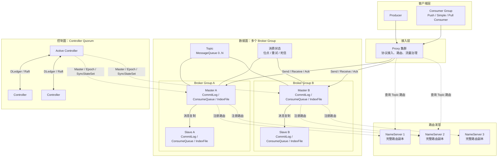
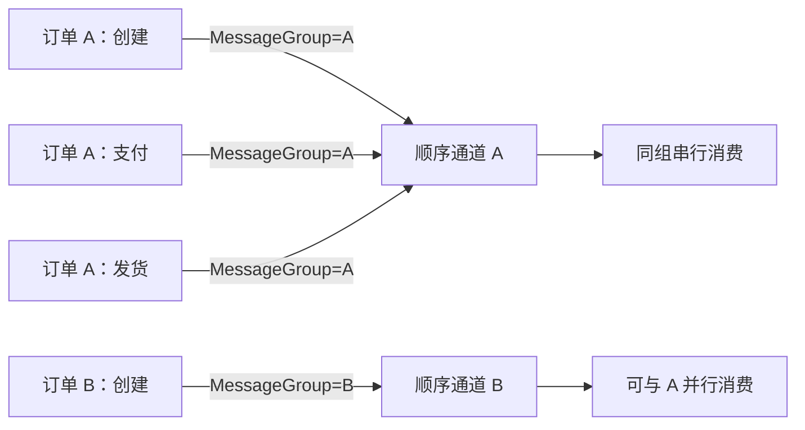
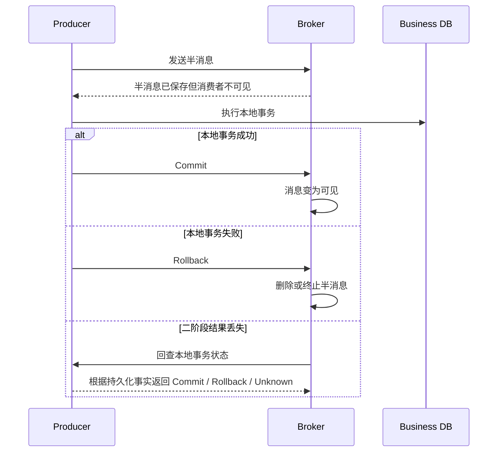

RocketMQ 的核心不是“一个支持很多高级功能的队列”，而是围绕业务事件提供 **MessageQueue 分片、MessageGroup 顺序、消费重试、事务消息和延时消息**。选型时最容易忽略的是：这些能力不共享同一个可靠性边界；消息何时返回成功，取决于刷盘、主从复制和同步副本集合的具体配置。

<!-- more -->

## 1. RocketMQ 解决什么问题

RocketMQ 更接近“面向业务事件的分布式消息系统”，典型场景包括：

- 订单创建后异步驱动库存、积分和通知；
- 同一订单或账户内的事件必须按顺序处理；
- 本地数据库事务成功后，消息最终必须可见；
- 消息在指定时间之后再投递；
- 消费失败后自动重试，超过上限进入死信队列。

它既不是复杂 AMQP 路由器，也不是以超长历史回放和流计算生态为第一目标的事件日志。选型的核心问题不是“RocketMQ 有没有这个功能”，而是它提供的抽象是否正好对应业务边界。

## 2. 完整生产架构



图中先展示完整部署关系。下面以顺序消息 **order-42 created** 为例，只说明一次生产和消费分别经过哪些组件。

### 生产消息的过程

1. Producer 通过 Proxy 接入，并从 NameServer 获得 **order-events** Topic 的 Broker 路由。
2. MessageGroup **order-42** 使同一订单稳定进入同一 MessageQueue。
3. Broker Master 把消息追加到 CommitLog，并按配置刷盘、复制给 Slave。
4. 达到当前刷盘和复制条件后，Broker 向 Producer 返回发送成功。

NameServer 只负责找路由，Controller 只在选主等控制过程参与，它们都不保存这条业务消息。

### 消费消息的过程

1. **inventory-group** 的一个 Consumer 从目标 MessageQueue 获取消息。
2. Broker 通过 ConsumeQueue 找到 CommitLog 中的消息正文并投递。
3. Consumer 完成库存事务后返回 ACK。
4. 成功则推进消费进度；失败或超时则进入重试，超过限制后进入死信队列。

发送成功与消费成功是两个时间点；具体刷盘、复制和 ACK 语义在后文解释。

各组件只解决自己的问题：

| 组件 | 核心职责 | 不负责什么 |
|---|---|---|
| Proxy | 承接 RocketMQ 5 客户端访问，可与 Broker 同进程或独立部署 | 不保存最终消息历史 |
| NameServer | 保存 Topic 到 Broker 的路由，使客户端找到数据 | 不复制业务消息，也不决定哪条消息已提交 |
| Broker | 接收、保存、复制和投递消息，维护消费相关状态 | 单个 Broker 不能独自解决自动选主 |
| Controller | 通过多数派维护 Master、Epoch、SyncStateSet 等选主元数据 | Raft 日志不包含业务消息 |
| MessageQueue | Topic 内的逻辑分片，是存储顺序和并行消费的基本边界 | 不等于一个 Broker 进程 |

NameServer 节点彼此独立，每个节点接受 Broker 注册并保存完整路由；Controller 则需要多数派维护一致的选主状态。这是两种完全不同的高可用机制。

## 3. 核心抽象与它们提供的语义

### 3.1 Topic：消息类型和治理边界

Topic 是消息的逻辑分类，例如 `order-events`。RocketMQ 5 的 Topic 会指定一种消息类型：普通、顺序、延时或事务消息。这个约束意味着消息类型应当在建模阶段确定，不应把所有不同语义的消息塞进同一个 Topic。

Topic 还承载权限、保留、队列数量等治理配置，但它本身不是顺序边界。

### 3.2 MessageQueue：分片、顺序和并行度边界

一个 Topic 由多个 MessageQueue 组成。MessageQueue 类似分片：

- 每条消息最终只追加到其中一个 MessageQueue；
- 同一个 MessageQueue 内有明确的存储顺序；
- 多个 MessageQueue 可以分布在不同 Broker Group 上并行读写；
- 队列数量限制了可并行处理的上限之一。

因此，**副本用于容错，MessageQueue 用于横向扩展**。增加 Slave 不会提高分片并行度，增加 MessageQueue 也不会自动提高单条消息的副本安全性。

RocketMQ 5 将逻辑队列名与物理 Broker 解耦。应用应使用 Topic、MessageGroup 等业务抽象，不要依赖或拼装具体物理队列名。

### 3.3 MessageGroup：业务顺序边界

顺序消息用 MessageGroup 表示哪些消息必须有序。例如以 `order_id` 为 MessageGroup，同一订单的创建、支付、发货事件会进入同一顺序通道。

它提供的是“同组有序”，不是整个 Topic 全局有序。全局有序等价于把所有流量压到一个顺序通道，会牺牲吞吐和故障隔离。

### 3.4 ConsumerGroup：一份独立消费进度

ConsumerGroup 表示一类业务订阅者：

- 不同消费组各自消费 Topic 的完整消息；
- 同组实例共同分担消息；
- 每组有独立位点、重试和死信状态；
- 同组实例应保持订阅表达式和消费语义一致。

例如库存组和通知组可以各自看到全部订单事件；库存组内部的多个实例只共同处理其中一份。

### 3.5 ACK：推进消费进度，不是删除消息文件

ACK 表示某个消费组已经成功处理消息，Broker 可以推进该组的消费进度。它不等于立即从 CommitLog 中物理删除该消息；消息文件仍按保留和磁盘清理策略删除。

由此得到两个语义：

- 消费成功与物理保留是两件事；
- 能否回放取决于历史是否仍在，而不只是是否 ACK 过。

## 9. 如何分区并保证顺序

### 9.1 普通消息的分区

普通消息可以由客户端在多个 MessageQueue 间负载均衡，也可以按业务 Key 选择稳定队列。更多 MessageQueue 提高并行度，但会增加路由、调度和运维成本。

简单的 `hash(key) % queue_count` 在队列数变化后会大规模重新映射。严格顺序业务应优先使用 MessageGroup，并在扩缩容时控制旧流量排空和新路由启用的边界。

### 9.2 FIFO 消息的完整顺序条件

Broker 只能保证它实际观察到的顺序。完整业务顺序必须同时满足：

1. 同一业务实体始终使用同一个 MessageGroup，如 `order_id`；
2. 同一 MessageGroup 的发送调用本身有确定先后，通常由单一生产者或串行发送建立；
3. 消费端对同组消息执行 `receive → process → ack`，不把同组任务异步并行化；
4. 前一条失败时不让后一条越过，或明确接受跳过后的乱序；
5. 业务事件携带版本号，防御多生产者和外部系统造成的因果倒序。



顺序的代价是阻塞：一条毒消息若必须保持严格顺序，会阻塞同组后续消息。团队必须在“等待修复”和“进入死信后继续”之间明确选择；不能同时承诺无限重试、绝不乱序和持续可用。

## 10. 消费、位点与至少一次

RocketMQ 5 常见消费方式：

| 类型 | 核心方式 | 主要注意点 |
|---|---|---|
| PushConsumer | SDK 控制拉取并调用监听器 | 监听器应在业务真正完成后同步返回结果，不要先异步转交再假装成功 |
| SimpleConsumer | 应用显式 Receive、处理和 Ack | `InvisibleDuration` 太短会并发重复，太长会拖慢故障重投 |
| PullConsumer | 应用按队列和位点主动拉取 | 控制力强，但位点、负载均衡和并发治理责任更多 |

PushConsumer 和 SimpleConsumer 默认更偏向服务端按消息负载均衡；PullConsumer 更适合需要按队列掌控位点的框架或高级场景。

可靠消费的基本时间线是：

```text
收到消息 → 执行业务事务 → 业务事务提交 → ACK
```

若业务提交后、ACK 前进程崩溃，消息会再次投递，因此默认思维应是“至少一次 + 业务幂等”。若先 ACK 再执行业务，进程崩溃则可能永久丢失业务处理机会。

常见幂等方式：

- 事件 ID 唯一键；
- Inbox/消费记录表与业务修改放入同一本地事务；
- 用订单状态机拒绝非法重复迁移；
- 调用下游时继续传递同一个幂等键。

## 11. 重试与死信

重试和死信以 ConsumerGroup 为边界。同一条业务消息可以在库存组成功、在通知组重试，二者互不代表。

重试策略需要回答：

- 哪些异常可重试，哪些是永久业务错误；
- 退避间隔和最大次数是多少；
- 进入死信后由谁告警、修复和重新驱动；
- 顺序消息进入死信后，是否允许后续消息继续；
- 重放是否仍使用原业务事件 ID。

无限重试不是更可靠，它可能把下游故障放大成重试风暴，并长期阻塞顺序通道。

## 12. 事务消息的边界

事务消息解决的是“本地事务已经提交，但普通发送失败”这一类原子性缺口：



回查必须依据数据库中的持久化事实，不能依赖 Producer 进程内存。事务消息只保证本地事务与消息可见性的最终一致，不保证 Consumer 的数据库修改与消息消费形成跨系统 ACID，也不能免除消费幂等。

若团队更熟悉数据库模式，也可以使用 Transactional Outbox：业务数据和 Outbox 记录在同一本地事务提交，再由后台任务可靠发布。

## 13. 延时消息与过滤

### 13.1 延时消息

延时消息表示“到某个时间之后才有资格投递”，适合订单超时检查、延迟通知等场景。它不是精确定时器：Broker 重启、负载、积压和同一时刻的大量消息都可能使实际投递晚于目标时间。

因此延时消费者必须重新检查业务状态。例如“30 分钟未支付则关单”的消息到达时，仍要查询订单是否已支付，而不能无条件关单。

### 13.2 消息过滤

RocketMQ 可以用 Tag 或基于属性的 SQL 表达式过滤。过滤用于减少无关消息传输，不应承载过度复杂且频繁变化的业务规则。同一 ConsumerGroup 的订阅和过滤表达式必须一致，否则同组实例对“应消费哪些消息”的理解不同。

## 18. 适用边界

RocketMQ 适合：

- 订单、支付、库存等以业务 Key 为顺序边界的事件；
- 需要事务消息、延时消息、消费重试和死信的业务系统；
- 团队愿意明确管理 MessageQueue、Broker Group、Controller 和幂等语义；
- 需要较高吞吐，但不以复杂 AMQP 路由或无限历史流处理为中心。

需要谨慎评估：

- 大量动态短生命周期队列和复杂路由规则；
- 把超长历史、多次任意回放和流处理生态作为第一目标；
- 无法承担 Controller、Broker 复制和客户端版本治理的团队；
- 要求同步跨地域且同时追求极低延迟和持续可写的系统。

## 19. 最小选型检查表

1. Topic 中承载普通、顺序、延时还是事务消息？
2. 业务顺序边界是订单、账户还是全局？MessageGroup 如何生成？
3. MessageQueue 数量如何覆盖峰值并行度？热点 Key 怎么处理？
4. `SEND_OK` 要求本地刷盘、几个副本确认？
5. SyncStateSet 缩小时最低允许几个副本，副本不足要停写还是降级？
6. 是否禁止从同步集合外选主？旧 Master 恢复如何截断和追赶？
7. Producer 超时如何使用稳定事件 ID 重试？Consumer 如何幂等？
8. 顺序消息失败时，是阻塞、死信还是跳过？
9. 最大积压量、最老消息年龄和磁盘清理边界是多少？
10. 单机、可用区、地域故障下的 RPO/RTO 分别是多少？
11. 谁负责死信修复、消息重放、Schema 演进和故障演练？
12. 监控能否区分路由、控制面、数据复制和消费端故障？

## 20. 参考资料

- [RocketMQ Domain Model](https://rocketmq.apache.org/docs/domainModel/01main/)
- [RocketMQ Topic](https://rocketmq.apache.org/docs/domainModel/02topic/)
- [RocketMQ MessageQueue](https://rocketmq.apache.org/docs/domainModel/04messagequeue/)
- [RocketMQ Message](https://rocketmq.apache.org/docs/domainModel/05message/)
- [RocketMQ ConsumerGroup](https://rocketmq.apache.org/docs/domainModel/08consumergroup/)
- [RocketMQ Master-Slave Automatic Failover](https://rocketmq.apache.org/docs/deploymentOperations/03autofailover/)
- [RocketMQ Controller Deployment and Design](https://github.com/apache/rocketmq/blob/develop/docs/en/controller/deploy.md)
- [RocketMQ FIFO Message](https://rocketmq.apache.org/docs/featureBehavior/03fifomessage/)
- [RocketMQ Transaction Message](https://rocketmq.apache.org/docs/featureBehavior/04transactionmessage/)
- [RocketMQ Consumer Type](https://rocketmq.apache.org/docs/featureBehavior/06consumertype/)
- [RocketMQ Consumer Load Balancing](https://rocketmq.apache.org/docs/featureBehavior/08consumerloadbalance/)
- [RocketMQ Consumer Progress](https://rocketmq.apache.org/docs/featureBehavior/09consumerprogress/)
- [RocketMQ Consumer Retry Policy](https://rocketmq.apache.org/docs/featureBehavior/10consumerretrypolicy/)
- [RocketMQ Message Storage and Cleanup](https://rocketmq.apache.org/docs/featureBehavior/11messagestorepolicy/)
- [RocketMQ Metrics](https://rocketmq.apache.org/docs/observability/01metrics/)
- [RocketMQ Security](https://rocketmq.apache.org/docs/security/01security/)
