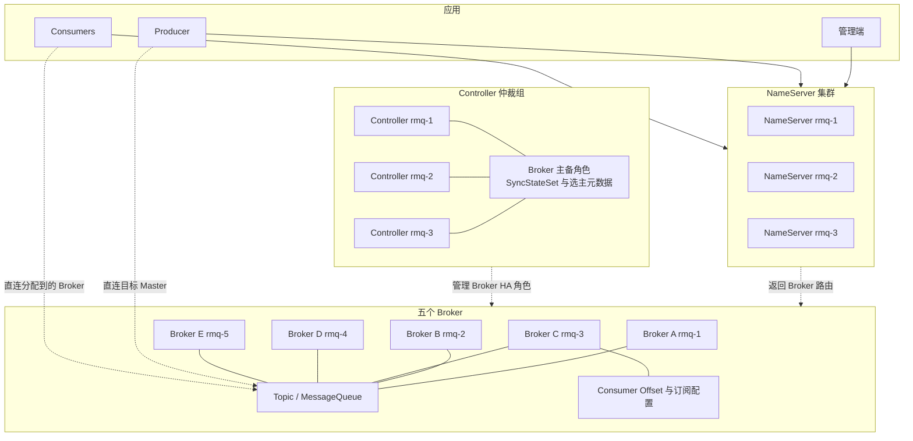
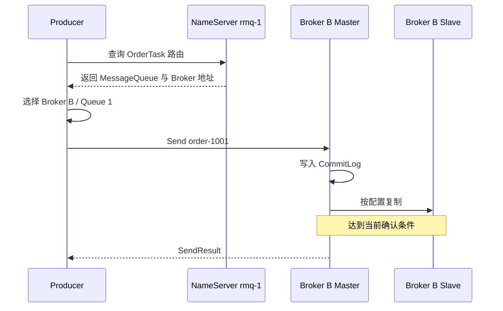
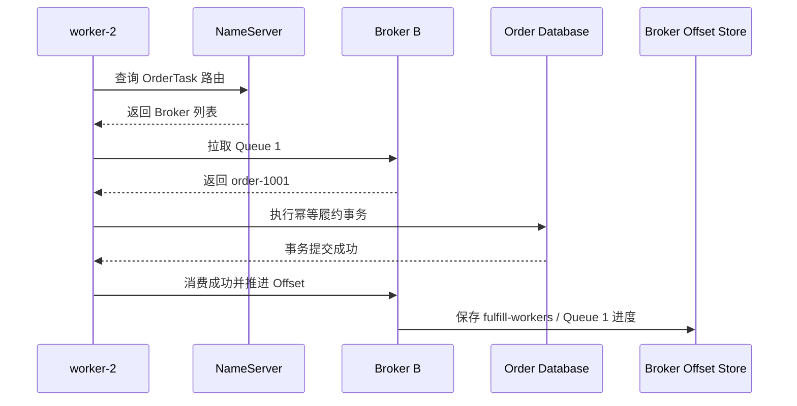

RocketMQ 把消息按 Topic 分类，再把 Topic 切成 MessageQueue。MessageQueue 是存储、顺序和消费并行度的基本单位；ConsumerGroup 表示一套独立的订阅和消费进度。

本文从五节点部署和两个订单示例说明 Producer、Consumer、NameServer、Controller 与 Broker 如何协作。CommitLog、ConsumeQueue、主从复制、确认时点和故障恢复放在[实现篇](008_rocketmq_implementation.md)。

<!-- more -->

## 1. 五节点生产部署

| 节点 | IP | 部署角色 |
|---|---|---|
| `rmq-1` | `10.0.0.11` | Broker A + NameServer + Controller |
| `rmq-2` | `10.0.0.12` | Broker B + NameServer + Controller |
| `rmq-3` | `10.0.0.13` | Broker C + NameServer + Controller |
| `rmq-4` | `10.0.0.14` | Broker D |
| `rmq-5` | `10.0.0.15` | Broker E |

这是便于说明的合并部署：三个 NameServer 提供路由发现，三个 Controller 组成仲裁组，五个 Broker 承载消息。对资源隔离要求较高时，可把 NameServer 和 Controller 独立部署。

客户端配置多个 NameServer 地址。NameServer 不是消息代理；Producer 和 Consumer获得路由后直接连接 Broker。

### 1.1 完整生产架构



各组件职责如下：

- **NameServer** 接收 Broker 注册并向客户端返回 Topic 路由，不保存消息正文，也不处于每条消息的转发路径。
- **Controller** 管理 Broker 副本组的主备角色、选主和同步副本集合，不负责 Topic 路由。
- **Broker** 接收、存储和投递消息，并维护 Topic、MessageQueue、ConsumerGroup 配置及消费位点。
- **客户端 SDK** 根据 NameServer 路由选择 Broker，并负责负载均衡、重试和消费协作。

### 1.2 RocketMQ 保存的四类数据

- **Topic 路由数据**
  - 解决的问题：一个 Topic 有哪些 MessageQueue，它们位于哪些 Broker。
  - 保存组件：Broker 持有 Topic 配置并向 NameServer 注册；NameServer 在内存中维护路由视图。
  - 一致性特点：NameServer 之间不复制一份强一致路由日志，客户端会从多个 NameServer 刷新路由。

- **Broker 高可用控制数据**
  - 解决的问题：一个 Broker 副本组当前谁可作为 Master，哪些副本处于同步集合。
  - 保存组件：Controller 仲裁组。
  - 一致性机制：Controller 元数据通过 DLedger 仲裁复制，形成一致的选主历史。

- **业务消息与索引**
  - 解决的问题：Broker 收到了哪些消息，以及某个 Topic 的某条 MessageQueue 应读取哪些位置。
  - 保存组件：Master/Slave Broker。消息先进入 CommitLog，ConsumeQueue 和 Index 提供逻辑查询入口。
  - 一致性机制：消息在 Broker 副本间复制；具体写入确认取决于刷盘、复制模式和 Controller 配置。

- **消费配置与进度**
  - 解决的问题：ConsumerGroup 订阅什么、每条 MessageQueue 已处理到哪里。
  - 保存组件：Broker 保存 SubscriptionGroup 配置和集群消费模式下的 Consumer Offset；客户端还保存当前连接、分配和正在处理的消息。
  - 一致性特点：已提交 Offset 用于恢复，应用已完成但尚未提交的进度只存在于 Consumer 侧。

## 2. 示例一：订单履约任务

需求是把订单履约任务交给三个 Worker 中的一个，失败后能够重试。

```text
Topic:          OrderTask
MessageQueue:   4
ConsumerGroup:  fulfill-workers
Message Key:    order-1001
```

本例假设 `OrderTask` 的四条 MessageQueue 分布在 Broker A、B、C、D，订单 `order-1001` 被选择到 Broker B 上的 Queue 1。

### 2.1 初始化后各组件保存什么

管理端创建 Topic 和 ConsumerGroup 配置后：

- Broker 保存 `OrderTask` 的 Topic 配置、MessageQueue 数量和读写权限。
- NameServer 根据 Broker 注册形成 `OrderTask → Broker A/B/C/D` 的路由视图。
- Broker 为对应 MessageQueue 准备逻辑消费索引。
- `fulfill-workers` 尚未产生的消费位点不会凭空存在；Consumer 开始消费并提交后，Broker 才保存每条 MessageQueue 的 Offset。
- Controller 只管理 Broker HA 角色，不保存订单消息的 Topic 路由。

Topic 表示消息类别；MessageQueue 是 Topic 内的逻辑分片。它决定一条消息写到哪个 Broker、同组消费者如何分摊，以及顺序保证落在哪个范围。

### 2.2 Producer 生产消息的完整过程



1. Producer 启动时从任一 NameServer 查询 `OrderTask` 路由并在本地缓存。
2. Producer 按轮询、业务 Key 或自定义选择器选择 Broker B 的 Queue 1。
3. Producer 直接连接 Broker B 的当前 Master；NameServer 不转发消息。
4. Broker 把消息写入统一 CommitLog，并建立该 MessageQueue 的逻辑索引。
5. 达到刷盘和副本确认条件后，Broker 返回 SendResult。

SendResult 只表示 Broker 按当前配置接管了消息，不表示 Consumer 已完成履约。请求超时仍可能是结果未知，Producer 需要业务 Key、重试和去重策略。

### 2.3 Consumer 有哪些状态

- **Group 与订阅**：`fulfill-workers`、订阅 Topic、Tag/SQL Filter 和消费模式。
- **成员与分配**：当前有哪些 Worker，以及四条 MessageQueue 分给谁，主要由客户端负载均衡和 Broker 连接共同形成。
- **正在处理状态**：某个 Worker 当前持有的消息、处理线程和超时状态，主要在 Consumer 进程内。
- **已提交 Offset**：`ConsumerGroup + Topic + MessageQueue` 的恢复位置，集群消费模式下保存在 Broker。
- **重试状态**：消费失败后，消息进入该 Group 对应的重试流程；超过限制后可进入死信队列。

### 2.4 Consumer 消费消息的完整过程

假设 Worker 2 负责 Broker B 的 Queue 1：



1. 三个 Worker 使用同一 ConsumerGroup 并订阅 `OrderTask`。
2. SDK 根据当前成员和 MessageQueue 列表做负载均衡；同一 Group 内一条 MessageQueue 同时交给一个 Worker。
3. Worker 2 直接从 Broker B 拉取 Queue 1，不通过 NameServer 获取消息正文。
4. Worker 完成数据库事务后返回成功，SDK 推进并提交消费 Offset。
5. 失败时按 Group 的重试策略再次投递；超过次数后进入死信队列。
6. 若业务成功但消费结果或 Offset 未保存，消息可能重复，因此下游仍需幂等。

## 3. 示例二：订单事件流

创建 Topic `OrderEvent`，以订单 ID 作为 MessageGroup 或队列选择依据，使同一订单的事件进入同一顺序通道：

```text
OrderCreated → OrderPaid → OrderShipped
```

库存、风控、分析分别使用不同 ConsumerGroup：

```text
inventory → 独立 Offset
risk      → 独立 Offset
analytics → 独立 Offset
```

Producer 仍先查询 NameServer，再把消息直发目标 Master Broker。三个 Group 各自从所有 MessageQueue 消费一份完整事件；库存的进度不会推进风控或分析的进度。

RocketMQ 的 FIFO 语义落在同一 MessageGroup/MessageQueue 的顺序通道上，不是整个 Topic 的全局顺序。Consumer 内部若并行处理同组消息，也可能破坏业务完成顺序。

## 4. 从两个示例归纳语义边界

- Topic 是分类和订阅入口，MessageQueue 才是路由、顺序和并行消费的基本单位。
- ConsumerGroup 表示一份独立处理进度：组内分摊 MessageQueue，组间各处理一份。
- NameServer 负责发现，不保存消息，也不代理每次生产和消费。
- Controller 负责 Broker 高可用角色，不替代 NameServer 的 Topic 路由。
- SendResult、消息投递、业务事务成功和 Offset 提交是不同责任边界。
- 顺序消息、延时消息、重试、死信和事务消息是 RocketMQ 的业务优势，但都不能消除下游幂等要求。

RocketMQ 适合交易、订单、营销等强调顺序、延时、事务消息、过滤、重试和死信语义的系统。若核心是长期事件保留、大规模回放和通用流处理生态，Kafka/Pulsar 通常更自然。

## 5. 客户端连接路径总结

```text
生产：
Producer → NameServer 查询 Topic 路由
         → 目标 MessageQueue 所在 Master Broker

消费：
Consumer → NameServer 查询路由
         → 分配到的 MessageQueue 所在 Broker
         → Broker 保存 Consumer Offset

控制面：
Controller → 管理 Broker 副本组的主备角色
```

## 6. 下一篇解决的实现问题

以下内容见[RocketMQ 实现篇](008_rocketmq_implementation.md)：

- Topic、MessageQueue 如何映射到 CommitLog 和 ConsumeQueue；
- 刷盘和主从复制配置如何决定 SendResult；
- Controller、Broker Epoch 和 SyncStateSet 如何协作；
- Master 故障前后未确认消息如何处理；
- 旧 Master 恢复后如何避免形成两条历史。

## 7. 参考资料

- [RocketMQ Domain Model](https://rocketmq.apache.org/docs/domainModel/01main/)
- [RocketMQ Message Queue](https://rocketmq.apache.org/docs/domainModel/03messagequeue/)
- [RocketMQ Consumer](https://rocketmq.apache.org/docs/domainModel/08consumer/)
- [RocketMQ Controller Mode](https://rocketmq.apache.org/docs/deploymentOperations/03autofailover/)
