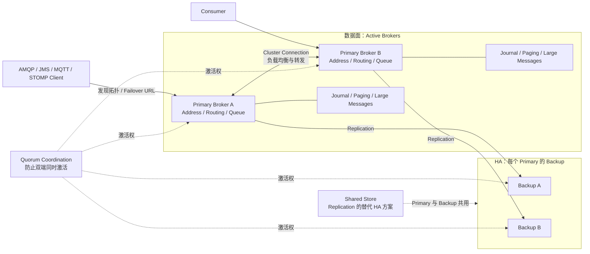

ActiveMQ Artemis 是面向 JMS 与多协议企业集成的消息 Broker。它需要把“Cluster 横向路由”和“HA 数据备份”分开理解：Cluster Connection 不会自动让每条消息拥有副本，高可用来自每个 Live Server 对应的 Backup Server。

<!-- more -->

## 1. 完整架构

下面以订单事件从 Address **orders** 路由到 Queue **inventory.q** 为例。

### 生产消息的过程

1. Producer 通过 AMQP 或 JMS 连接一个 Active Broker。
2. Broker 根据 Address 和 Routing Type 把消息路由到 inventory.q。
3. Broker 把消息写入 Journal；消息过多时可能进入 Paging，大消息使用独立存储。
4. 使用 Replication HA 时，Primary 按配置同步给 Backup 后向 Producer 确认。

Cluster Connection 负责 Broker 之间的路由与负载分布；Backup 负责某个 Primary 故障后的接管，两者不是同一件事。

### 消费消息的过程

1. inventory.q 把消息投递给一个 Consumer。
2. Consumer 完成库存事务后发送 ACK。
3. Broker 记录确认并结束这条 Queue 消息的待处理状态。
4. Consumer 故障或未 ACK 时，消息可以重新投递；超过策略限制后可以进入死信地址。

Producer 确认和 Consumer ACK 是两次独立的责任转移，后文再解释持久化与 HA 边界。

生产部署通常由多个 Primary-Backup 对组成集群。Cluster Connection 负责横向路由，Backup 负责单个 Broker 的状态接管，Quorum Coordination 负责防止脑裂；部署了 Cluster 并不等于消息已经拥有 HA 副本。

## 2. 分区与顺序

Artemis 没有 Kafka 式 Partition。横向分片通常通过多个 Queue、地址路由、集群负载均衡或 Federation 完成。消息在一个 Queue 内按入队顺序投递，但优先级、多个 Consumer、事务回滚和重新投递会改变完成顺序。

需要按业务 Key 保序时使用 Message Group：JMS 设置 `JMSXGroupID`，Core API 设置 `_AMQ_GROUP_ID`。同组消息固定给同一个 Consumer，Consumer 故障后再转交其他 Consumer。

Message Group 的顺序与横向扩展天然冲突。Clustered Grouping 需要集群级 Grouping Handler 协调，而且官方不推荐把它作为大规模扩展方案。更稳妥的方式是预先按业务 Key 路由到固定 Queue，再在单 Queue 内分组或串行消费。

## 3. 多副本一致性

Artemis 支持两种 HA 策略：

### 3.1 Shared Store

Live 与 Backup 使用同一份共享 Journal、Paging、Large Message 和 Binding 数据。Backup 激活时加载共享存储。它没有消息网络复制开销，但共享 SAN 成为关键基础设施，不能把普通 NFS 当成低延迟 Journal。

### 3.2 Replication

Live 把 Journal 等持久状态复制给 Backup。初始同步完成前 Backup 不能安全接管；同步后，持久消息需根据配置完成复制才能得到相应耐久保证。与 Kafka/Pulsar 不同，这通常是 Live-Backup 对的复制，而不是每条队列一个多副本 Raft 组。

网络分区可能导致 Live 与 Backup 互相不可见。Artemis 使用 Quorum Voting 和可选的 Network Isolation 检查降低脑裂风险；生产环境至少要有足够投票节点，避免两端同时激活并接受写入。

## 4. 故障修复与集群再平衡

### 4.1 临界故障时间线

Artemis 的 Replication 是一个 Active Primary 对一个 Passive Backup，不是多数派 Raft，也不宜笼统叫“半同步”：

1. Durable Message 路由到 Durable Queue 后写入 Primary Journal，并通过复制链路发送给已经完成初始同步的 Backup。
2. Core Client 默认 `blockOnDurableSend=true`；`journal-sync-non-transactional=true` 时，Broker 在本地持久写入完成前不会响应。事务提交则由 `journal-sync-transactional=true` 控制，默认也等待持久化。
3. 当已同步的 Backup 在线时，每个复制操作会在 Primary 的 Operation Context 中登记等待项；收到 Backup 的 Replication Response 后才标记 `replicationDone`。因此阻塞 Durable Send 的成功边界同时包含本地 Journal 完成和 Backup 复制确认。
4. 只有写入 Storage 的数据能在 Failover 后保留；Replication 模式要求 Durable Data 复制到 Backup。Backup 未完成初始同步时没有资格安全接管。
5. 如果 Primary 或网络在 Send/Commit 处理中断，Client 无法区分“消息没完成”与“消息已持久化、响应丢失”，官方将这种结果定义为不确定。
6. Client Failover 后应重发相同消息，并携带 `_AMQ_DUPL_ID`。Broker 的持久 Duplicate ID Cache 会过滤已经成功的那一次；业务消费者仍应幂等。

故障 Primary 恢复后不能携带自己的旧 Journal 直接激活。开启 `check-for-active-server=true` 时，它先找到当前 Active Backup，并从后者同步更新的数据；完成同步后才能 Failback。若跳过检查直接同时激活，旧消息可能再次投递并形成脑裂/重复。

Shared Store 模式没有 Primary-Backup 网络复制：安全响应边界取决于共享 Journal 是否持久化，Backup 接管同一份存储。Replication 模式则还必须保证 Backup 同步状态和防脑裂仲裁；只有一个 Backup 意味着它没有 RabbitMQ 那种每次写入的多节点多数派容错。

Live 故障后 Backup 激活，客户端尝试 Reattach 原 Session；若旧 Session 状态不可用则重连并重新创建 Producer/Consumer。客户端必须处理结果未知的在途发送，并通过重复检测或业务幂等避免二次执行。

原 Live 恢复时有两种路线：自动 Failback，或作为 Backup 重新同步后等待下一次故障。Replication 模式下，新 Backup 通常需要从当前 Live 做初始全量同步；Shared Store 模式则重新挂载并读取同一 Journal。

扩容不是把已有单 Queue 自动切成多个 Partition。新增 Live-Backup 对后，需要调整 Address/Queue 与 Cluster Connection 的负载均衡策略；已有消息是否重分布取决于 Redistribution 配置和消费者分布。缩容前应把队列排空、迁移或通过 Bridge/Federation 转发，再安全停用对应 HA 对。

修复后应检查：Backup 是否重新同步、Topology 是否收敛、Queue 消息数、Duplicate ID Cache、Paging 和 Journal 是否健康，以及客户端是否真的完成 Failover。

## 5. 适用边界

Artemis 适合依赖 JMS、AMQP、MQTT、STOMP、事务与传统企业集成的系统。若核心需求是海量分区日志、长期回放和流计算生态，应优先比较 Kafka 或 Pulsar。

## 6. 参考资料

- [ActiveMQ Artemis Documentation](https://activemq.apache.org/components/artemis/documentation/latest/)
- [ActiveMQ Artemis High Availability and Failover](https://activemq.apache.org/components/artemis/documentation/latest/ha.html)
- [ActiveMQ Artemis Guarantees of Sends and Commits](https://activemq.apache.org/components/artemis/documentation/latest/send-guarantees.html)
- [ActiveMQ Artemis Duplicate Detection](https://activemq.apache.org/components/artemis/documentation/latest/duplicate-detection.html)
- [ActiveMQ Artemis Message Grouping](https://activemq.apache.org/components/artemis/documentation/latest/message-grouping.html)
- [ActiveMQ Artemis Clusters](https://activemq.apache.org/components/artemis/documentation/latest/clusters.html)
- [Artemis ReplicationManager Source](https://github.com/apache/artemis/blob/main/artemis-server/src/main/java/org/apache/activemq/artemis/core/replication/ReplicationManager.java)
