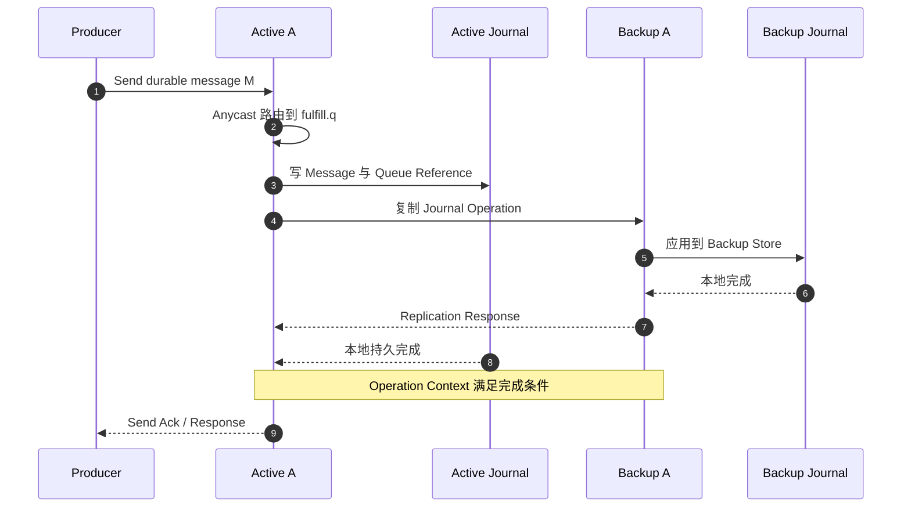
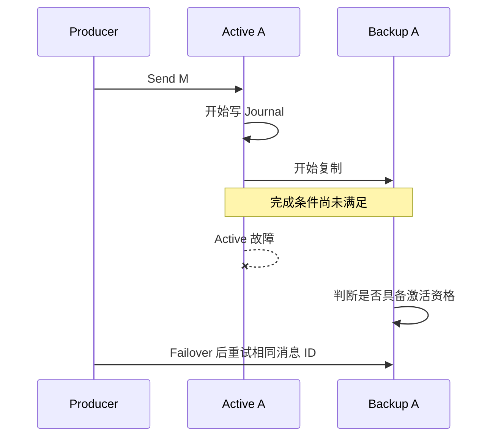

[第一篇](007_activemq_artemis.md)已经说明 Address、Queue、Anycast、Multicast、Broker Cluster 和 HA Pair。本文从 `fulfill.q` 已经接管消息的位置继续，说明消息如何落入 Journal、Active/Backup 如何同步、客户端何时能认为发送完成，以及故障切换为什么仍可能产生重复。

<!-- more -->

## 1. Queue 状态如何落到底层存储

Active Broker 不会为每条 Queue 简单创建一个独立消息文件。持久状态主要分成四类：

- **Bindings Journal**：Address、Queue、Filter、持久 Subscription 等绑定与配置记录；
- **Message Journal**：持久消息、Queue 引用、事务、Ack 等记录；
- **Paging Store**：内存压力达到阈值后，把 Address 的新消息分页到磁盘；
- **Large Message Files**：超过阈值的大消息正文单独保存，Journal 保留引用。

一条消息路由到三条 Durable Queue 时，Broker 不必物理复制三份完整正文。通常是一份消息记录加多条 Queue Reference；每条 Queue 的 Ack 独立移除自己的引用，最后一个引用完成后正文才可回收。

### 1.1 Journal 是追加记录，不是最终状态表

`fulfill.q` 的生命周期可以表达为：

```text
ADD_MESSAGE M
ADD_REFERENCE fulfill.q → M
DELIVERY / ACK_REFERENCE
COMMIT
```

Journal 先记录状态变化。Broker 重启时重放有效记录，重建 Queue 的 Ready、Delivering 和事务状态；旧 Journal 文件再由 Compact 回收无效记录。

因此不能只看“文件里是否出现过 M”判断消息是否有效，还要看事务是否 Commit、Queue Reference 是否仍存在、Ack 是否已经提交。

## 2. 持久发送的完整提交过程

继续第一篇的 Replication HA Pair：

```text
Active A: artemis-1
Backup A: artemis-2
Queue:    fulfill.q
```

假设使用 Durable Message、Durable Queue，非事务发送开启阻塞确认，并保持默认的持久同步安全配置。



成功响应的强度由三组配置共同决定：

- 消息与 Queue 是否 Durable；
- 客户端是同步发送、异步发送还是事务提交；
- `journal-sync-non-transactional`、`journal-sync-transactional` 以及 HA Replication 状态。

对 Durable Message：

- 非事务阻塞发送只有在 Broker 返回响应后，客户端才有服务端确认；
- `journal-sync-non-transactional=true` 时，Broker 等待非事务持久操作刷盘；
- 事务内发送由 Commit 决定整体可见性，`journal-sync-transactional=true` 时等待事务边界持久化；
- Replication HA 中，已同步 Backup 的复制操作也进入完成条件。

如果客户端配置异步非阻塞发送，`send()` 返回可能只表示消息进入客户端发送缓冲区。必须使用协议或客户端提供的异步 Send Acknowledgement 才能建立可观察的 Broker 接管边界。

## 3. Artemis 的 HA 不是五节点多数派日志

### 3.1 Shared Store

```text
Active ─┐
        ├── 同一份 Shared Journal / Paging / Large Message
Backup ─┘
```

Active 与 Backup 不复制消息正文，而是访问同一存储。Backup 激活后加载相同 Journal。

优点是没有 Active→Backup 消息复制流；代价是共享存储本身成为关键故障域。共享 SAN 必须提供正确的锁、延迟和持久性保证，普通网络文件系统不能自动等同于可靠低延迟 Journal。

### 3.2 Replication

```text
Active 本地 Journal
        → 复制协议
        → Passive Backup 本地 Journal
```

Backup 先完成 Initial Synchronization，之后才能作为可接管副本。运行期间 Active 把 Journal、Paging 和其他必要持久状态复制过去。

它通常是一组 Active/Backup 关系，而不是：

- 每条 Queue 一个 Raft Group；
- 五个 Broker 对每条消息执行多数派提交；
- 任意三个 Broker 都能选出拥有最新 `fulfill.q` 的节点。

Cluster 中其他 Active Broker 即使知道 `fulfill.q` 的拓扑，也不会自动拥有它的完整 Journal。

### 3.3 Quorum Voting 解决脑裂，不复制消息

网络分区时，Active 和 Backup都可能怀疑对方故障。Quorum Voting、Primary/Backup Coordination 和可选 Network Isolation 用于降低两端同时激活的风险。

投票节点回答“谁可以激活”，不表示这些节点保存了第三、第四份消息副本。数据安全仍取决于 Shared Store 或 Active/Backup Replication。

## 4. 三个临界故障场景

### 4.1 消息未完成持久化与复制，Active 故障



Producer 没收到确认，无法知道 M 是完全没写入、只在旧 Active、还是已经在 Backup 但响应未返回。Backup 只恢复自己拥有的有效 Journal 状态。

客户端应把结果视为未知，并使用相同 Duplicate ID 或业务事件 ID重试。不能因为“没有响应”就断言消息不存在。

### 4.2 消息已经安全，但响应丢失

Active 与 Backup 都完成 M，响应在网络中丢失：

- Failover 后 M 仍在 `fulfill.q`；
- Producer 会因为超时重试；
- 没有去重时 Queue 可能出现两条业务相同的消息。

Artemis 的 Duplicate Detection 可以让 Producer 携带稳定的 `_AMQ_DUPL_ID`。Broker 的 Duplicate ID Cache 用于过滤已处理发送；Cache 的持久性、大小和清理策略必须与最大重试窗口匹配。Consumer 仍需业务幂等。

### 4.3 Ack 已执行，但连接在响应前故障

Worker 完成数据库事务并 Ack：

1. Active 开始记录 Queue Reference 的 Ack；
2. Ack 可能已经持久化并复制，但客户端连接中断；
3. Failover 后客户端无法确定 Ack 最终结果；
4. 如果 Ack 未完成，消息会重新投递；
5. 如果 Ack 已完成，消息不会再次出现，但 Worker不能靠连接异常判断是哪种结果。

因此正确业务顺序仍是：

```text
收到消息
→ 执行业务幂等事务
→ 本地事务提交
→ Ack / Commit Session
```

不要先 Ack 再提交业务数据库，否则进程故障会产生“消息已结束但业务没完成”。

## 5. Backup 激活与旧 Active 恢复

### 5.1 Backup 激活

Backup 必须先完成初始同步，并满足 HA 策略的激活条件。激活后：

- 加载 Bindings 与 Message Journal；
- 重建 Queue、Ready、Delivering、事务和 Paging 状态；
- 接受客户端 Failover；
- 未完成的投递可能标记 Redelivered。

客户端优先尝试 Session Reattach；无法恢复旧 Session 时，重新建立 Connection、Session、Producer 和 Consumer。即使 Reattach 成功，也必须处理在途发送与 Ack 的结果未知。

### 5.2 旧 Active 回来后不能直接写旧历史

旧 Active 携带的 Journal 可能落后，也可能有未被 Backup接受的尾部。它不能绕过当前 Active 直接重新提供服务。

开启正确的 Active 检测和 Failback 配置后，旧节点应：

1. 找到当前 Active；
2. 作为 Backup 重新同步当前有效状态；
3. 同步完成后保持 Backup，或执行受控 Failback；
4. 客户端入口确认收敛后再恢复正常拓扑。

若两端绕过协调同时激活，就会形成脑裂：相同 Queue 出现两套发送、Ack 和顺序历史，事后无法靠简单拼接 Journal 自动合并。

## 6. Consumer、事务与顺序恢复

Queue 顺序是 Broker 选择下一条可投递消息的顺序，不是端到端业务完成顺序。以下都会改变观察结果：

- 多个 Consumer 并发；
- Consumer Credit 与预取；
- Redelivery；
- Scheduled Delivery；
- Message Priority；
- 事务回滚；
- Paging 与消息组。

需要同一订单串行时，可使用 Message Group 把相同 Group ID 稳定交给同一 Consumer。但 Consumer 故障、组重分配和重复投递仍要求业务幂等。

本地事务或 XA 可以把多条 Broker 操作放进一个事务边界，但跨数据库事务会增加协调与恢复成本。多数微服务更常使用 Outbox、幂等 Consumer 和补偿，而不是假设协议事务自动覆盖所有下游。

## 7. Paging、积压与容量

当 Address 内存达到阈值时，Paging 把后续消息写入 Page 文件。Paging 解决内存保护，不是廉价无限磁盘队列：

- 大积压会增加 Page 文件、索引和恢复时间；
- 多条 Queue 引用同一 Address 消息时，最慢 Queue 决定引用能否回收；
- 大消息会增加 Large Message 文件、复制和重投成本；
- Journal Compact 与 Paging 清理需要磁盘余量。

容量估算至少包括：

```text
消息正文 + Queue Reference + Journal 写放大
+ Paging + Large Message
+ Active/Backup 两份数据
+ Compact/Initial Sync 临时空间
```

扩容 Active Broker 不会自动分割已有单 Queue。需要在 Address/Queue 层设计分片、Redistribution、Bridge 或 Federation，并明确顺序和重复边界。

## 8. 运维与灾备

需要观察：

- Active/Backup 同步状态、Failover 次数和 Quorum 投票；
- Journal 写入与 fsync 延迟、Compact、磁盘空间；
- Address Memory、Paging Size、Page Count；
- Queue Message Count、Delivering Count、Scheduled、Redelivery；
- Duplicate ID Cache 命中与容量；
- 客户端 Failover、Reattach、Send/Ack 超时。

HA Pair 解决机房内在线故障，不替代备份。跨地域通常使用独立 Broker 集群加 Bridge/Federation 异步传递，必须单独定义 RPO、RTO、重复、路由回切和双写冲突。

## 9. 实现结论

- Artemis 的持久状态以 Binding/Message Journal、Paging 和 Large Message 形式保存，不是一条 Queue 一个文件。
- Broker Cluster 管路由，HA Pair 管数据接管；其他 Cluster 节点不自动成为 Queue 副本。
- Shared Store 依赖共享存储，Replication 依赖 Active/Backup 同步，都不是每条 Queue 的多数派 Raft。
- 发送确认强度取决于 Durable、客户端阻塞/事务方式、Journal Sync 和 Backup 同步状态。
- Active 故障时，在途发送和 Ack 都可能结果未知；Duplicate Detection 与业务幂等必须同时考虑。
- 扩 Broker 不会自动分片已有 Queue。

## 10. 参考资料

- [ActiveMQ Artemis Persistence](https://activemq.apache.org/components/artemis/documentation/latest/persistence.html)
- [ActiveMQ Artemis High Availability](https://activemq.apache.org/components/artemis/documentation/latest/ha.html)
- [Guarantees of Sends and Commits](https://activemq.apache.org/components/artemis/documentation/latest/send-guarantees.html)
- [ActiveMQ Artemis Duplicate Detection](https://activemq.apache.org/components/artemis/documentation/latest/duplicate-detection.html)
- [ActiveMQ Artemis Paging](https://activemq.apache.org/components/artemis/documentation/latest/paging.html)
- [ActiveMQ Artemis Message Grouping](https://activemq.apache.org/components/artemis/documentation/latest/message-grouping.html)
- [ActiveMQ Artemis Clusters](https://activemq.apache.org/components/artemis/documentation/latest/clusters.html)
