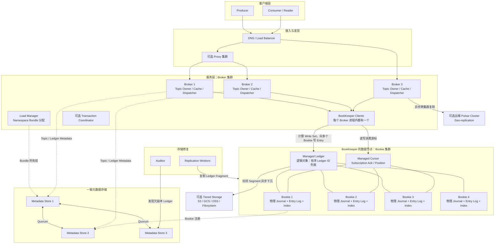
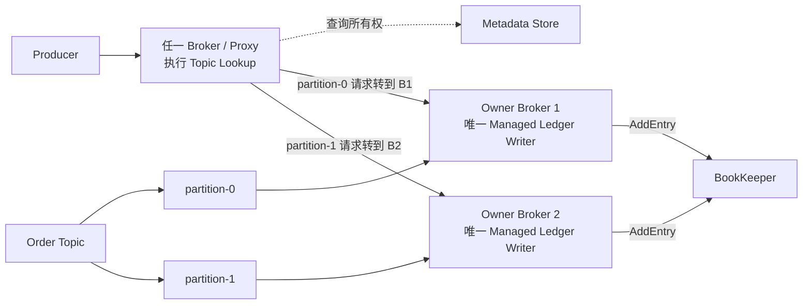
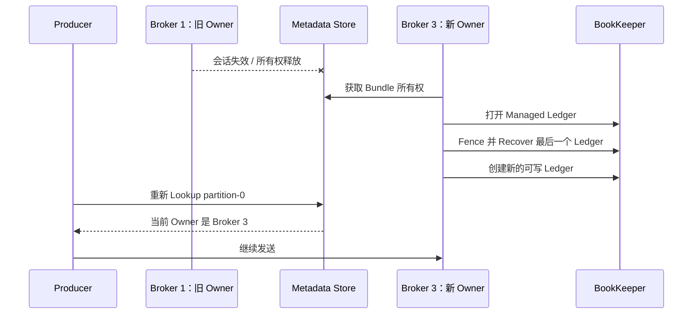
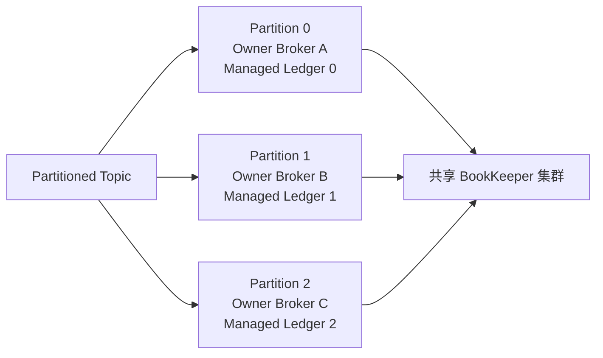
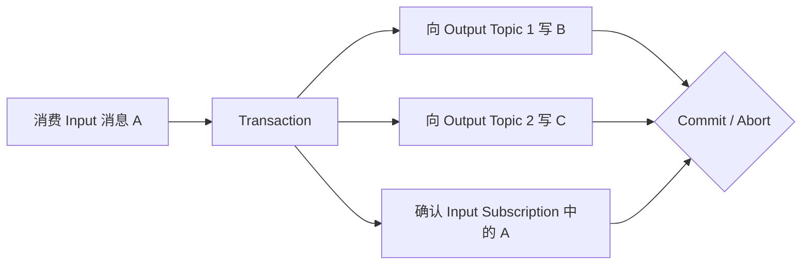

Pulsar 最鲜明的特点是 **服务层和存储层分离**：Broker 负责连接、Topic 所有权和消息投递，BookKeeper 负责持久化消息。Broker 扩容或切换时不需要搬迁历史数据，但代价是系统多了一套独立存储集群和元数据控制面。

<!-- more -->

本文以当前生产稳定的 Pulsar 4.2.x 架构为基线。选型时最重要的不是记住组件名称，而是理解三条边界：谁是 Topic 的唯一写入者、消息达到几个持久副本才返回成功、每个 Subscription 的 Cursor 如何决定积压和回放。

## 1. Pulsar 解决什么问题

Pulsar 同时提供消息队列和事件流能力，典型优势是：

- Broker 与存储分别扩缩容；
- 一个集群承载大量 Tenant、Namespace 和 Topic；
- 每个 Topic 可以建立多份相互独立的 Subscription；
- 未确认消息形成持久积压，已确认消息也可以按策略继续保留；
- 旧 Ledger 可以下沉到对象存储，支持较长历史；
- 支持跨集群复制和多租户治理。

它不是“没有状态的简单 Broker”。Broker 不保存消息本体，但仍持有 Topic 会话、缓存、分发器和临时所有权；BookKeeper、元数据存储、AutoRecovery 中任何一层设计错误，都会影响整体可靠性。

## 2. 完整生产架构



图中先展示完整部署关系。下面以 **order-42 created** 为例，只说明一次生产和消费分别经过哪些组件。

### 生产消息的过程

1. Producer 通过 DNS、Load Balancer 或 Proxy Lookup，找到目标 Topic Partition 的 Owner Broker。
2. Owner Broker 接收消息，并由进程内的 BookKeeper Client 把消息作为 Entry 写入多个 Bookie。
3. 足够 Bookie 返回持久化确认后，Broker 向 Producer 返回成功。
4. 消息正文保存在 Bookie 中；Broker 负责协调写入，但不是最终消息副本。

Metadata Store 保存所有权和 Ledger 等元数据，AutoRecovery 负责故障后的欠副本修复，它们不逐条转发消息。

### 消费消息的过程

1. **inventory-subscription** 的 Consumer 连接该 Topic Partition 的 Owner Broker。
2. Broker 的 Dispatcher 从缓存或 BookKeeper 读取 order-42，并按 Subscription 类型投递。
3. Consumer 完成库存事务后发送 ACK。
4. Broker 推进并持久化该 Subscription 的 Managed Cursor。

Producer 成功与 Subscription 消费成功相互独立；BookKeeper Quorum、Cursor 和故障恢复在后文解释。

图中实线主要表示数据流，虚线表示控制或元数据流。首先要区分两个名字：

```text
BookKeeper = 完整的分布式日志存储系统
Bookie      = BookKeeper 系统中的一个存储节点进程
```

BookKeeper 不是一台名叫 “BookKeeper” 的服务器。对 Pulsar 来说，这套存储系统由几个部分共同组成：

```text
BookKeeper
  ├─ BookKeeper Client：嵌入每个 Pulsar Broker，执行 Ledger 协议
  ├─ Bookie 1..N：保存 Entry 的物理副本
  ├─ Ledger Metadata：保存在一致元数据存储中
  └─ AutoRecovery：检测并修复欠副本 Ledger Fragment
```

正常写入时，并不存在下面这条链路：

```text
Broker → 某个叫 BookKeeper 的中心服务 → Bookie
```

真实链路是：Owner Broker 内部的 BookKeeper Client 根据 Ledger Metadata 算出本条 Entry 应写到哪些 Bookie，然后直接并行请求这些 Bookie，最后统计是否达到 Ack Quorum。

各组件的职责边界如下：

| 组件 | 核心职责 | 不负责什么 |
|---|---|---|
| Proxy / Broker Lookup | 让客户端找到 Topic 当前所属 Broker | 不决定消息是否持久化成功 |
| Broker | Topic 单写者、协议接入、缓存和订阅投递 | 不保存最终消息副本，不是消息数据的主从节点 |
| BookKeeper | Ledger、Quorum 写入、读取与恢复组成的完整存储系统 | 不是一个节点名称，也不理解 Pulsar 的业务 Topic 路由 |
| BookKeeper Client | 嵌入 Broker，选择 Write Set、发送 Entry、统计 Ack Quorum | 本身不是持久副本 |
| Bookie | 保存 Ledger Entry 并提供持久化确认 | 不理解 Topic、ConsumerGroup 等业务概念 |
| Metadata Store | 保存所有权、Ledger、配置等一致元数据 | 不保存消息正文 |
| AutoRecovery | 检测并修复欠副本 Ledger Fragment | 不在 Producer 正常写入路径上决定 ACK |
| Tiered Storage | 保存封闭的冷 Ledger，降低长保留成本 | 不承接当前活跃 Ledger 的实时写入 |

生产部署通常需要多个 Broker、足够多且跨故障域放置的 Bookie，以及奇数节点的元数据存储。只部署多个 Broker 并不能形成消息副本；具体副本存在 BookKeeper 系统的多个 Bookie 上。

### 2.1 架构图里的 Ledger 是什么：它不是文件

最准确的一句话是：

```text
Ledger ≠ 物理文件

Ledger = Ledger ID
       + 从 0 递增的 Entry ID 空间
       + E / Qw / Qa
       + 每段 Entry 使用哪些 Bookie 的 Ensemble 元数据
       + OPEN / IN_RECOVERY / CLOSED 状态
```

Ledger 是 BookKeeper API 暴露的**逻辑追加日志对象**。应用看到它像一段连续日志，但 Bookie 不会为它创建一个同名、独占的 `ledger-100.log` 文件。

Fragment 也不是物理文件。它只是 Ledger Metadata 中的一条范围规则：从某个 Entry ID 开始，改用哪一组 Bookie。

Bookie 物理磁盘上主要是 Journal、Entry Log 和索引。各个 Ledger 的 Entry 会混合写入这些物理文件。

从业务抽象到物理文件的关系是：

```text
Pulsar Topic Partition
  ↓ 对应
Managed Ledger：该分区的完整逻辑历史
  ↓ 由多个组成
BookKeeper Ledger：有 Ledger ID 的一段逻辑追加日志
  ↓ 包含
Entry：带 Ledger ID + Entry ID 的实际记录
  ↓ 在每个目标 Bookie 上写入
Journal File：预写日志，先保证持久 ACK
Entry Log File：长期保存 Entry 内容
Index：从 Ledger ID + Entry ID 定位到 Entry Log 中的位置
```

一个 Bookie 的同一个 Entry Log 文件通常会混合保存许多 Ledger 的 Entry：

```text
Bookie 1 / entryLog-38.log
  ├─ Ledger 100 / Entry 598
  ├─ Ledger 203 / Entry 20
  ├─ Ledger 100 / Entry 599
  ├─ Ledger 102 / Entry 88
  └─ Ledger 200 / Entry 301
```

因此下面两种理解都是错误的：

```text
一个 Ledger = Bookie 上的一个 ledger 文件       ×
一个 Fragment = Bookie 上的一个 fragment 文件   ×
```

更准确的定义是：

- **Ledger**：由 `Ledger ID` 标识的一段逻辑追加日志，Entry ID 从 0 递增；
- **Fragment**：同一个 Ledger 内，连续使用同一组 Bookie 的 Entry 范围；
- **Journal File**：Bookie 的物理预写日志，可包含多个 Ledger 的写入；
- **Entry Log File**：Bookie 的物理数据文件，也可混合多个 Ledger 的 Entry；
- **Index**：解决混合保存后如何按 `(Ledger ID, Entry ID)` 找回数据。

例如 Ledger 100 的 Bookie 在 Entry 600 处发生替换：

```text
Ledger 100                         ← 一个逻辑 Ledger
  Fragment 1: Entry 0～599         ← Ensemble [B1, B2, B3]
  Fragment 2: Entry 600～999       ← Ensemble [B1, B2, B4]
```

这两个 Fragment 只是 Ledger Metadata 中的两个 Entry 范围。它们的实际 Entry 会散落在 B1、B2、B3、B4 各自的 Journal/Entry Log 文件里。

### 2.1.1 什么时候发生 Ledger 切换

这里的“Ledger 切换”是指 Pulsar Managed Ledger 不再向当前 Ledger 追加，而是关闭它并创建一个新 Ledger：

```text
Managed Ledger
  Ledger 100：CLOSED
  Ledger 102：OPEN，当前写入
```

主要触发场景是：

1. **正常滚动**：当前 Ledger 达到配置的 Entry 数、大小或滚动时间边界；
2. **Broker Owner 切换**：新 Owner 对旧 Ledger 执行 fencing 和 recovery，关闭旧 Ledger，再创建新 Ledger；
3. **Ledger 无法继续安全写入**：发生不可恢复写入错误、无法完成必要的元数据变更，Managed Ledger 关闭当前段并尝试建立新段；如果连新 Ledger 的 Quorum 也无法满足，则写入失败；
4. **管理操作或 Topic unload**：当前 Owner 释放 Topic，重新加载时需要恢复最后一个 Ledger，并根据状态继续或创建新 Ledger。

普通的单个 Bookie 故障并不必然触发 Ledger 切换。若 Writer 能把故障 Bookie 替换掉并成功更新 Ensemble，Ledger ID 可以保持不变，只从某个 Entry 开始形成新 Fragment：

```text
Bookie 成员变化：Ledger 100 / Fragment 1 → Fragment 2
Ledger 正常滚动：Ledger 100 → Ledger 102
```

### 2.1.2 物理文件什么时候切换

Bookie 的 Journal File 和 Entry Log File 也会因文件大小等条件自行滚动，但它与 Pulsar 的 Ledger 切换无关：

```text
Ledger 没变，物理 Entry Log 可能从 entryLog-38 滚到 entryLog-39
Ledger 从 100 切到 102，新 Entry 也可能仍写在当前 entryLog-39
```

所以必须分别观察三种变化：

| 发生了什么 | 改变的对象 | 是否产生新 Ledger |
|---|---|---|
| 只新增一个健康 Bookie 4 | 可供后续分配的 Bookie 集合 | 否，也不会产生新 Fragment |
| Bookie 3 故障并被 Bookie 4 替换 | Ensemble，形成新 Fragment | 不一定 |
| Managed Ledger 正常滚动或 Broker 接管 | 当前逻辑 Ledger | 是 |
| Bookie 本地 Journal/Entry Log 滚动 | 物理文件 | 否 |

只增加 Bookie 4 时，它先向 Metadata Store 注册为可用存储节点。已有 Ledger 的 Ensemble 不会为了“平均一点”自动改变，当前 Ledger 也不会因此生成 Fragment。Bookie 4 通常会在以下时机被使用：创建新 Ledger、替换故障 Bookie、修复欠副本数据，或者执行显式的数据迁移/下线流程。

Metadata Store 保存 Ledger ID、状态、Quorum 参数和各 Fragment 的 Ensemble；Bookie 磁盘保存 Entry 内容。Broker 读取这张逻辑目录后，才能定位物理副本。

### 2.2 示例：Order Topic 的 Metadata Store 中有什么

假设 `Order Topic` 有两个分区，每个分区的 Managed Ledger 都由两个 Ledger 组成，并且写入期间发生过 Bookie 切换：

```text
Order Topic
  ├─ partition-0 → Managed Ledger 0
  │    ├─ Ledger 100：已封闭
  │    └─ Ledger 102：当前写入
  └─ partition-1 → Managed Ledger 1
       ├─ Ledger 200：已封闭
       └─ Ledger 203：当前写入
```

下面使用便于理解的伪 YAML 展示 Metadata Store 中的逻辑信息。它不是实际存储路径或序列化格式，但字段之间的关系与真实架构一致。

#### 2.2.1 Topic 和 Broker 所有权

```yaml
topic: persistent://sales/order/order-events
partitioned-topic-metadata:
  partitions: 2

namespace-bundles:
  bundle-0x00000000_0x7fffffff:
    owner: broker-1
    contains:
      - order-events-partition-0
  bundle-0x80000000_0xffffffff:
    owner: broker-2
    contains:
      - order-events-partition-1
```

Pulsar 实际按 Namespace Bundle 分配 Broker 所有权，而不是为每个 Topic 保存一个永久 Broker。这里表示当前：

- `partition-0` 由 `broker-1` 服务；
- `partition-1` 由 `broker-2` 服务；
- Broker 故障或负载迁移后，`owner` 可以改变；
- 所有权改变不会搬迁下面的 Ledger 数据。

#### 2.2.2 两个 Managed Ledger 的 Ledger 列表

```yaml
managed-ledgers:
  order-events-partition-0:
    ledgers:
      - ledgerId: 100
        entries: 1000
        state: CLOSED
      - ledgerId: 102
        state: OPEN

  order-events-partition-1:
    ledgers:
      - ledgerId: 200
        entries: 800
        state: CLOSED
      - ledgerId: 203
        state: OPEN
```

这部分回答：“一个分区的完整历史由哪些 Ledger 按什么顺序组成？”

- `partition-0` 先读 Ledger 100，再读 Ledger 102；
- `partition-1` 先读 Ledger 200，再读 Ledger 203；
- `OPEN` Ledger 是当前追加段，还没有最终结尾；
- `CLOSED` Ledger 已有确定结尾，只能读取，不能继续追加。

#### 2.2.3 Ledger 100 的 Bookie 发生切换

假设 Ledger 100 使用 `E=3、Qw=3、Qa=2`。它仍处于 `OPEN` 状态、写到 Entry 600 时，`bookie-3` 不可用，BookKeeper Client 选择 `bookie-4` 替换它。Ledger 100 后来写到 Entry 999 才被关闭，所以最终元数据如下：

```yaml
ledger-metadata:
  ledgerId: 100
  state: CLOSED
  lastEntryId: 999
  ensembleSize: 3
  writeQuorum: 3
  ackQuorum: 2
  ensembles:
    0:   [bookie-1, bookie-2, bookie-3]
    600: [bookie-1, bookie-2, bookie-4]
```

`ensembles` 的 Key 表示“从哪个 Entry 开始使用这组 Bookie”：

```text
Entry 0   ～ 599 → [bookie-1, bookie-2, bookie-3]
Entry 600 ～ 999 → [bookie-1, bookie-2, bookie-4]
```

这里的 **Fragment 不是一个新 Bookie，也不是新建的一份完整 Ledger 文件**。它的定义是：同一个 Ledger 中，连续使用同一组 Ensemble 的一段 Entry 范围。

```text
Fragment 1 = Ledger 100 的 Entry 0～599
             Ensemble [bookie-1, bookie-2, bookie-3]

Fragment 2 = Ledger 100 的 Entry 600～999
             Ensemble [bookie-1, bookie-2, bookie-4]
```

正因为 `bookie-3` 被 `bookie-4` 替换，从 Entry 600 开始使用的 Ensemble 发生变化，Ledger Metadata 才增加 `600 → [bookie-1, bookie-2, bookie-4]` 这条记录，并由此划出新的 Fragment。Ledger ID 仍然是 100，Writer 仍在这条 Ledger 上顺序追加，因此不必仅为一次可恢复的成员替换创建新 Ledger。

读取时，BookKeeper Client 根据 Entry ID 找对应 Fragment：读取 Entry 500 使用起始位置 `0` 的 Ensemble；读取 Entry 800 使用起始位置 `600` 的 Ensemble。

需要区分两件事：

1. **为后续写入切换 Ensemble**：新 Fragment 从 Entry 600 开始使用 Bookie 4，不会自动搬迁 Entry 0～599；
2. **修复旧 Fragment**：若 Bookie 3 永久故障，AutoRecovery 从 Bookie 1/2 读取 Entry 0～599，复制到替代 Bookie，成功后再更新旧 Fragment 的副本元数据。

“不一定创建新 Ledger”也有前提：当前 Ledger 仍可维持合法单 Writer、能够满足 Ack Quorum，并且 Ensemble Metadata 的 CAS 更新成功。若整个旧 Ensemble 都不可用、没有足够副本读取，或者 Ledger 已进入 fencing/recovery，系统不能只增加一个 Bookie 4 就凭空恢复历史；写入会失败或先关闭/恢复旧 Ledger，再由 Managed Ledger 创建新 Ledger。新 Ledger 只能承接后续写入，不能找回已经丢失的数据。

#### 2.2.4 其余三个 Ledger 的元数据

```yaml
ledger-metadata:
  102:
    state: OPEN
    ensembleSize: 3
    writeQuorum: 3
    ackQuorum: 2
    ensembles:
      0: [bookie-2, bookie-3, bookie-4]

  200:
    state: CLOSED
    lastEntryId: 799
    ensembleSize: 3
    writeQuorum: 3
    ackQuorum: 2
    ensembles:
      0:   [bookie-1, bookie-3, bookie-4]
      300: [bookie-2, bookie-3, bookie-4]

  203:
    state: OPEN
    ensembleSize: 3
    writeQuorum: 3
    ackQuorum: 2
    ensembles:
      0: [bookie-1, bookie-2, bookie-4]
```

Ledger 200 也发生过一次切换：Entry 0～299 使用第一组 Bookie，Entry 300 起使用第二组。Ledger 102 和 203 当前只有一个 Fragment，以后发生 Bookie 替换时可以继续增加新的起始 Entry 和 Ensemble。

#### 2.2.5 Subscription、Bookie 注册和 Namespace 策略

除上面的核心存储目录外，Metadata Store 还会保存或索引其他控制状态，例如：

```yaml
subscriptions:
  inventory-service:
    topic: order-events-partition-0
    managedCursor: inventory-service-cursor
    cursorMetadata: 指向持久 Cursor 状态

available-bookies:
  bookie-1: bookie-1.example:3181
  bookie-2: bookie-2.example:3181
  bookie-3: bookie-3.example:3181
  bookie-4: bookie-4.example:3181

namespace-policies:
  namespace: sales/order
  retention: 72h
  backlogQuota: 2TiB
  schemaCompatibilityStrategy: BACKWARD
```

Cursor 的高频确认状态可以通过 Managed Cursor 的持久结构写入 BookKeeper，Metadata Store 保存其入口和必要元数据。这里不应把 Cursor 简化成 Metadata Store 中一个不断覆盖的 Offset 数字。Schema 兼容策略属于配置元数据；具体 Schema 版本内容由 Pulsar Schema Registry 使用现有持久存储层保存。

把这些信息合起来，新 Broker 接管 `partition-0` 时才能完成下面的定位：

```text
Topic 分区元数据
  → 找到 partition-0
Bundle 所有权
  → 确认自己是当前 Owner
Managed Ledger 元数据
  → 找到 Ledger 100、102
Ledger 102 元数据
  → 找到当前写入 Bookie [2,3,4] 和 E/Qw/Qa
Managed Cursor 元数据
  → 恢复各 Subscription 的消费位置
```

Metadata Store 保存的是这张“目录、所有权和状态地图”，而不是订单消息正文。真正的 `OrderCreated`、`OrderPaid` 等 Entry 数据仍保存在对应 Bookie 上。

### 2.3 一个 Topic 到底属于几个 Broker

要区分“Partitioned Topic”与“它内部的单个 Partition”：

- 非分区 Topic：同一时刻只有一个 Owner Broker；
- Partitioned Topic：它是一个逻辑名称，每个内部 Partition 分别只有一个 Owner Broker；
- 不同 Partition 可以属于不同 Broker，因此整个 Partitioned Topic 可以同时使用多个 Broker；
- Broker 所有权的实际调度单位是 Namespace Bundle，一个 Bundle 内会包含多个 Topic 或 Partition。

仍以两个分区的 Order Topic 为例：



“客户端可以连接任意 Broker”只适用于发现入口，不能理解成所有 Broker 都能同时写同一个 Partition：

1. Producer 根据路由策略先选中 `partition-0`；
2. 客户端向任一 Broker 查询它的当前 Owner；
3. 直连模式下，客户端被引导并连接到 `broker-1`；使用 Proxy 时，由 Proxy 把请求转给 `broker-1`；
4. 只有 `broker-1` 持有该 Partition 的活动 Managed Ledger Writer；
5. `broker-1` 才能为消息分配下一个 Entry ID，并向 Ledger 当前 Ensemble 中的 Bookie 发起 `AddEntry`。

这条“单 Owner、单 Writer”规则很重要。如果 Broker 1 和 Broker 3 同时给同一个 Ledger 分配 Entry ID，就可能产生两个冲突的日志尾部。

#### 2.3.1 Broker 故障时转移什么

Broker 1 故障后，转移的是 `partition-0` 所在 Bundle 的服务所有权，不是把消息数据从 Broker 1 复制给 Broker 3：



接管时，新 Broker 先恢复并封闭旧 Ledger，再创建新 Ledger 继续写。旧 Broker 即使稍后恢复，也不能继续成为同一个 Ledger 的合法 Writer：

- Metadata Store 的当前所有权已经属于新 Broker；
- Ledger 元数据更新使用 CAS，两个 Writer 不能各自成功提交不同的 Ledger 列表；
- BookKeeper fencing 会阻止旧 Writer 再获得 Ack Quorum。

因此，控制面的目标是同一时刻只有一个有效 Owner；即使故障切换期间旧 Broker 暂时保留过期认知，存储协议也只允许一条日志历史最终成立。

## 3. 核心抽象与它们提供的语义

### 3.1 Tenant 与 Namespace：多租户治理边界

Pulsar Topic 的完整名称通常是：

```text
persistent://tenant/namespace/topic
```

- **Tenant** 是组织或租户边界，可关联权限和允许使用的集群；
- **Namespace** 是一组 Topic 的策略边界，保留、TTL、配额、复制、持久化参数常在这里配置；
- **Topic** 是消息流和订阅的逻辑边界。

这套层次适合平台化治理，但也意味着错误的 Namespace 规划会扩大配置变更和资源竞争的影响面。

### 3.2 Topic 与 Partition：顺序和并行度边界

非分区 Topic 对应一条 Managed Ledger，由一个 Broker 负责服务。经典 Partitioned Topic 则由多个内部 Topic 分区组成，每个分区各有自己的 Broker Owner 和 Managed Ledger。



因此：

- 分区增加写入和消费并行度；
- 每个分区内有存储顺序，跨分区没有全局顺序；
- Broker Owner 可以改变，但分区历史仍在 BookKeeper；
- 增加 Bookie 提高存储容量和副本承载力，不直接增加 Topic 的服务并行度。

### 3.3 Message、Entry 与 Message ID

Producer 发送的是 Message。Broker 经过批处理后写入 BookKeeper 的单位是 Entry，一个 Entry 可以包含一条消息或一个批次。

Message ID 通常包含 Ledger、Entry、Partition 和批次内位置等信息。它适合定位和恢复读取位置，但业务系统仍应提供稳定的 `event_id`；物理 Message ID 不等于跨重试、跨 Topic 的业务幂等键。

### 3.4 Managed Ledger：Topic 的逻辑日志

一个 Topic 分区对应一条 Managed Ledger，而一条 Managed Ledger 又由多个 BookKeeper Ledger 组成：

```text
Managed Ledger
  ├── Ledger 10：已封闭，只读
  ├── Ledger 11：已封闭，可下沉
  └── Ledger 12：当前写入 Segment
```

BookKeeper Ledger 是单写者、只追加的 Segment。达到大小、时间或故障切换条件后会封闭，Broker 创建新 Ledger 继续写。Segment 不可变，使副本修复、删除和冷数据下沉更容易。

### 3.5 Subscription 与 Cursor：一份独立消费状态

Subscription 表示一份独立订阅。每个持久 Subscription 有自己的 Managed Cursor，用于记录：

- 已确认到哪里；
- 哪些单条消息已确认；
- 哪些消息仍在 backlog；
- 故障后从哪里恢复投递。

不同 Subscription 各自看到完整消息流，并独立推进。例如风控订阅变慢不会改变报表订阅的 Cursor，但会让风控订阅的 backlog 阻止相关 Ledger 被删除。

### 3.6 Consumer 与 Reader

- **Consumer** 绑定 Subscription，通过 ACK 推进 Cursor；
- **Reader** 从指定 Message ID 读取，不创建普通消费 ACK 语义，应用自己管理位置。

Reader 不会替数据建立持久 backlog。若仅使用 Reader 又希望历史长期存在，必须显式配置 retention，不能假设 Topic 会自动永久保留消息。

## 11. 如何分区并保证顺序

### 11.1 Producer 路由

经典 Partitioned Topic 的消息可以轮询到各分区，也可以依据 Message Key/Ordering Key 稳定路由。若要求同一订单有序，应让相同 `order_id` 始终进入同一分区。

增加经典 Topic 的分区数会改变类似 `hash(key) % partitionCount` 的映射，同一个 Key 可能从旧分区转到新分区。旧分区中尚未处理完的消息与新分区消息并行时，业务顺序就会破坏。

因此严格顺序场景需要：预留分区、受控切流、等待旧路由排空，或用业务版本号拒绝倒序状态变更。

### 11.2 四种 Subscription 的语义

| 类型 | 消费者关系 | 顺序范围 | 主要局限 |
|---|---|---|---|
| Exclusive | 一个 Subscription 只允许一个 Consumer | 单分区按存储顺序 | 单活限制消费并行度 |
| Failover | 每个分区一个活动 Consumer，其他待命 | 每个分区有序 | 切换时可能重投；跨分区无全局顺序 |
| Shared | 多 Consumer 轮流分担消息 | 不保证顺序 | 完成顺序和重投顺序均可能变化 |
| Key_Shared | 同一 Key 在同一时刻交给一个 Consumer | 单 Key 有序 | 需要正确 Key 和批处理策略；热点 Key 仍是瓶颈 |

Key_Shared 要求 Producer 禁用普通批处理，或使用 key-based batching。否则不同 Key 被装入同一 Entry 批次，Broker 可能按批次第一个 Key 把整批发给同一 Consumer，破坏预期的 Key 分发语义。

### 11.3 存储有序不等于业务完成有序

完整顺序至少需要：

1. 同一业务实体使用稳定 Key，并始终路由到同一分区；
2. 多 Producer 并发时，用事件版本或单一写入源定义因果顺序；
3. Consumer 对同 Key 串行执行，不把任务交给无序线程池；
4. 处理成功后再 ACK；
5. 明确失败消息是阻塞后续、重投，还是跳过进入死信。

Negative ACK、ACK Timeout 和消费者切换都可能触发重投；在有序 Subscription 上，单条重投也可能改变观察顺序。关键状态机不能只依赖 Broker 投递顺序，还要校验业务版本。

## 12. ACK、Cursor 与至少一次消费

可靠消费的基本顺序是：

```text
Receive → 执行业务事务 → 业务提交 → ACK
```

若业务提交后、ACK 前进程崩溃，消息会被重新投递。因此默认语义应按“至少一次 + 业务幂等”设计。

Pulsar 支持：

- **Individual ACK**：确认一条具体消息，适合 Shared/Key_Shared 等并行处理；
- **Cumulative ACK**：确认当前位置以及之前的连续消息，适合 Exclusive/Failover 的顺序处理；Shared/Key_Shared 不适合累计确认；
- **Negative ACK / Redelivery**：显式请求稍后重投；
- **ACK Timeout**：消费者超过时间未确认后重投。

Receiver Queue 和应用内部并发决定一次有多少未完成消息。预取过大可提高吞吐，也会在 Consumer 故障时扩大重投范围，并让慢任务长时间占用内存。

消费幂等仍建议采用事件 ID 唯一键、Inbox 表或业务状态机。Pulsar 的 Producer 去重不能阻止 Consumer 在业务成功后因 ACK 丢失而再次执行。

## 13. 保留、TTL、积压与回放

Pulsar 必须区分三个概念：

| 概念 | 控制什么 | 到达边界后的结果 |
|---|---|---|
| Backlog | 某 Subscription 尚未确认的消息 | Cursor 推进前应继续保留 |
| Retention | 已被所有 Subscription 确认或没有订阅的消息还保留多久/多大 | 超出后可以删除 |
| TTL | 未确认消息最多允许存活多久 | 到期后自动视为已确认，可能被删除 |

默认情况下，未确认消息因为 Subscription backlog 被保留；当所有 Subscription 都确认后，如果没有 retention，数据就可以被删除。一个从未创建 Subscription、只依赖未来 Reader 回放的 Topic，也不能默认获得长期历史。

回放通常通过重置 Subscription Cursor 或 Reader 从旧 Message ID 读取，但前提是目标 Ledger 仍在 BookKeeper 或 Tiered Storage。Cursor 能指向过去，不代表过去的数据一定存在。

Backlog Quota 达到上限后，策略可能阻塞/拒绝 Producer，或淘汰旧 backlog。选型时必须明确采用哪种策略，因为“容量满了仍返回成功”和“消息绝不丢”无法同时成立。

## 15. Producer 去重与“精确一次”的边界

启用消息去重后，Broker 根据 Producer Name 和单调 Sequence ID 识别重试，使同一 Producer 会话针对单分区的重复发送只持久化一次。

它有明确边界：

- 必须启用 Broker/Namespace 去重并保持稳定 Producer Name；
- Sequence ID 的范围与 Producer、Topic 分区相关；
- 不能自动去重两个独立 Producer 产生的同一业务事件；
- 不能阻止 Consumer 重复执行业务数据库操作；
- 跨多个 Topic/Partition 的原子写入需要 Transaction，而不是普通去重。

因此文章中更稳妥的表达是：“Producer Deduplication 减少持久化重复；端到端仍需要业务幂等”，而不是笼统宣称 exactly-once。

## 16. Pulsar Transaction 的边界

Pulsar Transaction 可以把多个 Pulsar Topic/Partition 的 Produce 与 Subscription ACK 放进同一事务：全部提交后可见，或全部回滚。



它适合 Pulsar 内部的 consume-process-produce 流程，但不自动包含 MySQL、Redis 或外部 HTTP 服务。若业务逻辑还修改数据库，仍需 Outbox、Inbox、幂等状态机或业务补偿。

Transaction Coordinator、事务日志、Transaction Buffer 和 Pending Ack 状态也会增加额外组件与运维成本。生产使用前要确认客户端语言支持、功能开关、超时和监控，而不能因为产品“支持事务”就默认所有链路已经原子化。

## 17. 延时、重试与死信

Delayed Delivery 表示消息已经持久化，但到指定时间之后才允许投递。当前经典消费模型中主要由 Shared 和 Key_Shared Subscription 支持；在其他 Subscription 上不能假设仍具有相同延时语义。

长延时消息可能阻止前部 Ledger 清理、放大 backlog，并与 TTL 冲突：若 TTL 先到期，消息可能在计划投递时间之前就被视为过期。因此它适合“稍后检查”，不应被当作绝对精确且无限期的定时任务系统。

重试和死信需要明确：

- Negative ACK、ACK Timeout 和 Retry Letter Topic 分别何时使用；
- 最大次数、退避、告警和人工修复负责人；
- 顺序消息失败后是否允许后续消息越过；
- 重新驱动是否沿用原始业务事件 ID。

无限重试会形成热循环；死信只是在主链路旁边保存失败，不代表问题已经解决。

## 18. Schema、安全与多租户

Pulsar 内置 Schema Registry，Schema 按 Topic 管理并存入现有存储层。Producer 连接时可以注册 Schema，Broker 按兼容策略决定接受或拒绝；Message 携带 Schema Version，Consumer 按相应版本解析。

Schema Registry 能执行格式兼容检查，但不能判断字段的业务含义是否被错误修改。事件所有者仍需定义向前/向后兼容、废弃周期和无法解析消息的隔离流程。

安全与隔离至少包括：

- TLS、认证、Tenant/Namespace/Topic 授权；
- Broker 与 Bookie 的网络隔离；
- 管理 API、Proxy 和 Metrics 端口访问控制；
- Namespace 级发布、分发、存储和 backlog 配额；
- Broker isolation、Bookie isolation 和跨机架副本放置；
- 端到端加密时的密钥轮换和丢失恢复策略。

权限隔离不等于资源隔离。一个租户创建海量 Topic、产生长积压或高频冷读，仍可能影响共享 Broker、Bookie 和元数据存储。

## 22. 版本与演进边界

截至本文更新时，生产稳定版本线是 Pulsar 4.2.x。Pulsar 5.0 milestone 展示了 Scalable Topics：用可拆分/合并的 Key Range Segment 替代固定分区，并试图在伸缩时保留单 Key 顺序。

这个方向解决了经典 `hash(key) % partitionCount` 扩分区导致 Key 漂移的问题，但 milestone 不是生产稳定版，且需要 V5 客户端和相应元数据能力。当前选型不能把它当作 4.2.x 已有保证；应单独验证 GA 状态、客户端语言和迁移路径。

## 23. 适用边界

Pulsar 适合：

- 大量 Tenant、Namespace、Topic 和独立 Subscription；
- Broker 与存储需要分别扩缩容；
- 长积压、历史回放和对象存储下沉；
- 同时需要队列式 Shared 消费和事件流式独立订阅；
- 有跨集群复制、多租户配额和隔离需求。

需要谨慎评估：

- 团队只希望维护一个简单 Broker 集群；
- Topic 数和积压都很小，存算分离收益不足以覆盖 BookKeeper/Metadata Store 成本；
- 要求全局顺序或热点 Key 无限横向扩展；
- 把 Producer 去重误认为端到端 exactly-once；
- 缺少 BookKeeper、AutoRecovery、Tiered Storage 和跨层故障演练能力。

## 24. 最小选型检查表

1. 需要队列、可回放事件流，还是两者都需要？
2. Tenant、Namespace、Topic 和 Subscription 如何划分？
3. 顺序边界是单分区还是单 Key？使用哪种 Subscription？
4. `E/Qw/Qa` 分别是多少，Producer 何时获得成功？
5. 副本是否跨机架/可用区，能容忍哪些 Bookie 同时损坏？
6. Broker 在达到 Qa 前后故障，Producer 如何处理未知结果？
7. 是否启用 Producer 去重？Consumer 如何保证业务幂等？
8. ACK、Negative ACK、ACK Timeout、重试和死信如何配合？
9. 未确认 backlog、已确认 retention 和 TTL 分别是多少？
10. 经典 Topic 扩分区后如何避免 Key 漂移造成乱序？
11. Broker、Bookie、Metadata Store 和 AutoRecovery 是否分别监控和演练？
12. 长历史是否下沉，冷读性能和对象存储成本是否测算？
13. 跨地域采用异步复制还是同步 BookKeeper Quorum，RPO/RTO 是多少？
14. Schema、安全、配额和租户资源隔离由谁治理？

## 25. 参考资料

- [Apache Pulsar 4.2 Architecture Overview](https://pulsar.apache.org/docs/4.2.x/concepts-architecture-overview/)
- [Apache Pulsar 4.2 Messaging Concepts](https://pulsar.apache.org/docs/4.2.x/concepts-messaging/)
- [Pulsar Broker Load Balancing](https://pulsar.apache.org/docs/4.2.x/concepts-broker-load-balancing-overview/)
- [Pulsar Metadata Store Administration](https://pulsar.apache.org/docs/4.2.x/administration-metadata-store/)
- [Pulsar BookKeeper Persistence Policies](https://pulsar.apache.org/docs/4.2.x/administration-zk-bk/)
- [Apache BookKeeper Protocol](https://bookkeeper.apache.org/docs/development/protocol/)
- [BookKeeper Ledger API：LAC 与 Durable Add](https://bookkeeper.apache.org/docs/latest/api/ledger-api/)
- [BookKeeper Client Configuration：Explicit LAC](https://bookkeeper.apache.org/docs/latest/api/javadoc/org/apache/bookkeeper/conf/ClientConfiguration.html)
- [Pulsar Consumer API and Key_Shared Batching](https://pulsar.apache.org/docs/4.2.x/client-libraries-consumers/)
- [Pulsar Retention and Expiry](https://pulsar.apache.org/docs/4.2.x/cookbooks-retention-expiry/)
- [Pulsar Tiered Storage](https://pulsar.apache.org/docs/4.2.x/tiered-storage-overview/)
- [Pulsar Topic Compaction](https://pulsar.apache.org/docs/4.2.x/concepts-topic-compaction/)
- [Pulsar Transactions](https://pulsar.apache.org/docs/4.2.x/txn-why/)
- [Pulsar Schema Overview](https://pulsar.apache.org/docs/4.2.x/schema-overview/)
- [Pulsar Geo-replication](https://pulsar.apache.org/docs/4.2.x/concepts-replication/)
- [Pulsar Release Notes and Supported Versions](https://pulsar.apache.org/download/)
- [Pulsar 5.0 Milestone：Scalable Topics Preview](https://pulsar.apache.org/release-notes/versioned/pulsar-5.0.0-M1/)
