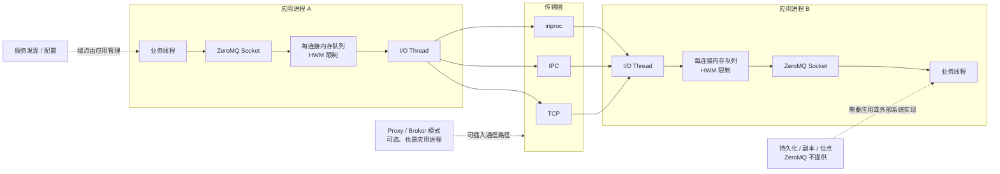

ZeroMQ 名字中有 MQ，但它不是一套可部署的持久消息队列服务。它是嵌入应用进程的通信库，用 Socket Pattern、自动重连和内存队列简化并发与网络通信。

<!-- more -->

## 1. 完整架构

图中的核心事实是：没有独立 ZeroMQ Broker、元数据集群、持久存储或副本组。Socket、I/O 线程和消息缓冲都在应用进程里；Proxy 也只是开发者用 ZeroMQ 编写的普通进程。

因此它减少了基础设施层级，也把服务发现、消息协议、故障检测、持久化和恢复责任交给了应用。

## 2. 通信模式与顺序

ZeroMQ 用 Socket 类型表达通信模式：`REQ/REP` 负责请求响应，`PUB/SUB` 负责广播，`PUSH/PULL` 负责流水线，`ROUTER/DEALER` 用于异步路由和自定义 Broker。

顺序只在具体连接和 Socket Pattern 的规则内成立。多个发送者、多个接收者或多条连接汇合后，不存在全局顺序。若业务要求同一 Key 有序，应用必须固定路由、限制并发，或在消息中携带序列号。

ZeroMQ 的高水位线 HWM 控制内存队列长度。消费者跟不上时，不同 Socket 类型可能阻塞发送或丢弃消息。低延迟来自内存和异步 I/O，也意味着积压不能被当成可靠磁盘存储。

## 3. 多副本与提交语义

ZeroMQ 没有内置消息副本、一致性协议和“消息已提交”的统一概念。一次 `send` 成功通常只说明消息已被本地通信栈接受，不说明对端已经收到、持久化或完成业务处理，也不说明另一个节点拥有可接管副本。

若需要这些保证，应用必须自行增加消息 ID、确认、超时、重试、幂等、持久日志和主备协议。做到这一步时，团队实际上正在构建自己的消息系统。

## 4. 临界故障

假设进程 A 向进程 B 发送消息 M：

1. A 的 `send` 把 M 放入本地 ZeroMQ 队列；
2. A 随即崩溃，而 M 尚未到达 B；
3. 内存队列随进程消失，M 丢失；
4. 即使 B 已经收到 M，A 在没有业务确认协议时也无法区分成功与失败；
5. A 重试可能让 B 再次处理 M。

自动重连只能恢复连接，不能恢复已经消失的消息和业务状态。要可靠处理，必须在应用层定义请求 ID、响应、超时、重试、幂等和状态恢复；需要离线积压时还要引入磁盘日志或外部持久队列。

旧节点恢复后也不存在内置的“追主日志”过程。主备选举、状态同步和脑裂防护完全取决于应用采用的协议。

## 5. 适用边界

ZeroMQ 适合同机线程、进程间和受控局域网中的低延迟通信，也适合允许丢弃旧数据的实时流，以及愿意自行维护通信协议的定制拓扑。

它不适合直接替代持久消息队列：消费者离线期间必须保留消息、已确认消息必须跨节点保存，或者需要消费位点、回放、死信和自动副本修复时，应选择承担这些职责的消息系统。

ZeroMQ 的核心优势是少一层 Broker 和极强的拓扑自由；核心局限也是同一件事：平台没有承担的责任，都会回到应用团队。

## 6. 参考资料

- [ZeroMQ Guide：Sockets and Patterns](https://zguide.zeromq.org/docs/chapter2/)
- [ZeroMQ Guide：Reliable Request-Reply Patterns](https://zguide.zeromq.org/docs/chapter4/)
- [ZeroMQ Guide：Advanced Pub-Sub Patterns](https://zguide.zeromq.org/docs/chapter5/)
- [ZeroMQ RFC 18：Majordomo Protocol](https://rfc.zeromq.org/spec/18/)

