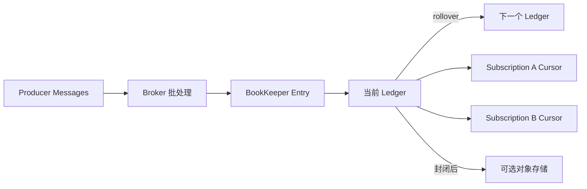
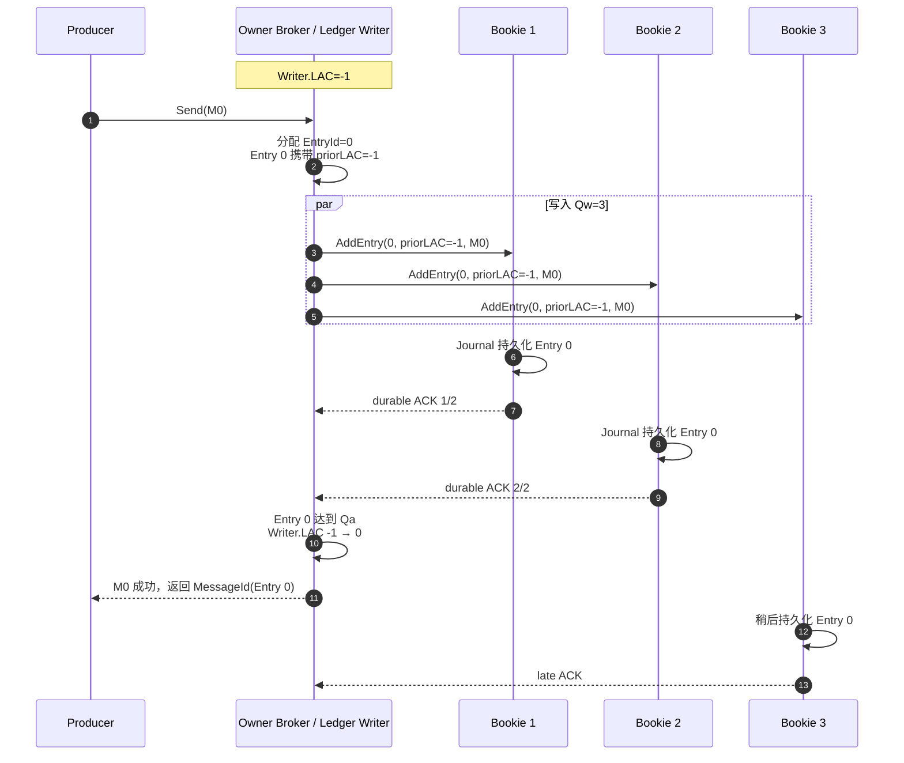
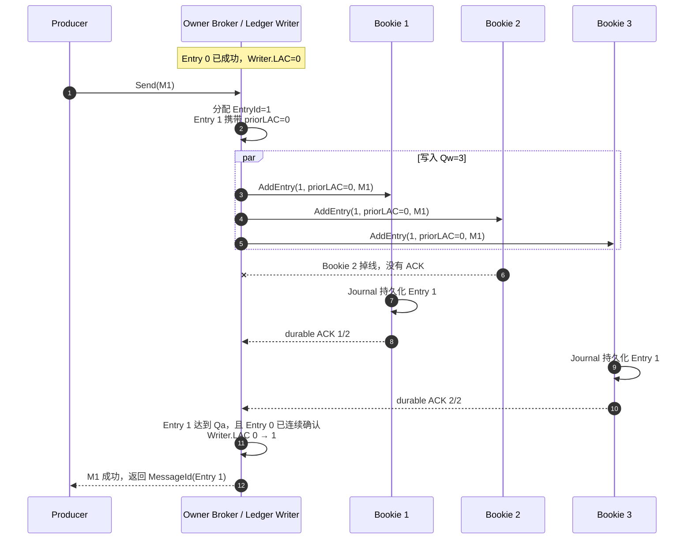
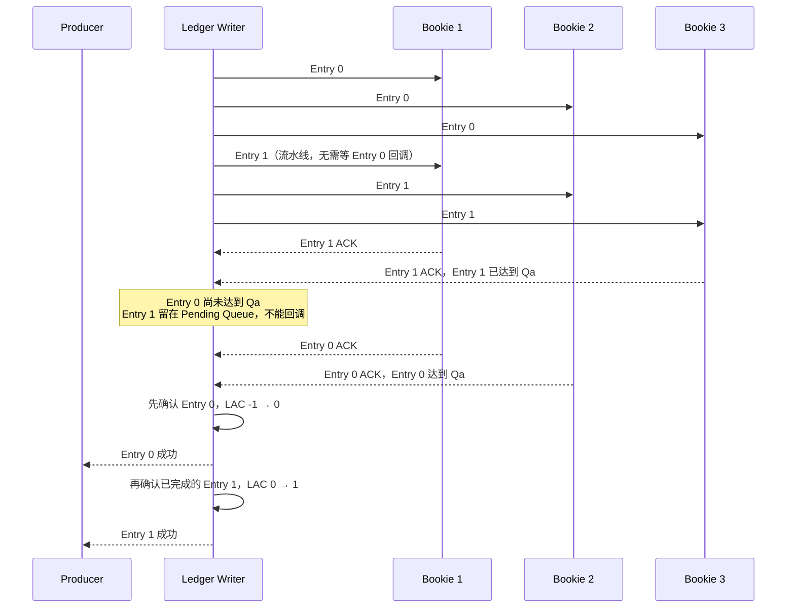
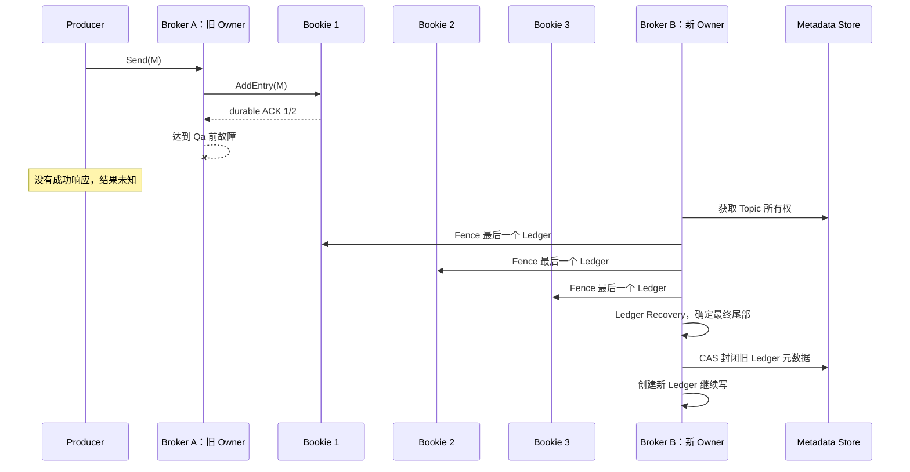
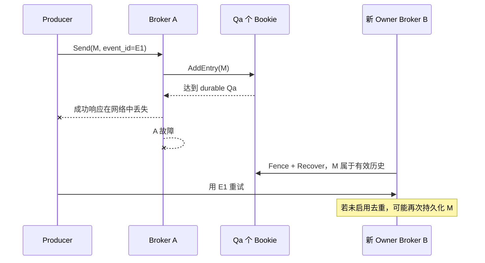

## 4. 存储模型：Ledger、Entry 和 Cursor



这里有三个容易混淆的关系：

1. 消息属于 Topic/Partition，但物理副本属于 Ledger Entry；
2. Ledger 的副本集合可以在故障后更换，因此一个 Topic 的不同历史段可分布在不同 Bookie；
3. Cursor 也是持久状态，Broker 切换后新 Owner 会从存储恢复，而不是从客户端猜测消费进度。

Broker 缓存用于降低读延迟，但不构成持久化保证。真正的确认边界在 BookKeeper Journal 和 Ack Quorum。

## 5. BookKeeper 多副本的三个参数

每个 Ledger 由三个参数定义副本写入范围：

| 参数 | 含义 | 第一性原理 |
|---|---|---|
| Ensemble `E` | 该 Ledger Fragment 可使用的 Bookie 集合大小 | 副本放置范围 |
| Write Quorum `Qw` | 每条 Entry 实际写入多少个 Bookie | 单条消息的目标副本数 |
| Ack Quorum `Qa` | 至少收到多少个持久化确认才算成功 | Producer 成功时已经保证的副本数 |

必须满足：

```text
E >= Qw >= Qa
```

例如 `E=3, Qw=3, Qa=2` 表示每条 Entry 发往 3 个 Bookie，收到其中 2 个持久确认后即可完成写入。它不是“一个主节点同步到两个从节点”，而是单写者向一组对等存储节点执行 Quorum 写入。

`Qa=2` 可以安全承受一个已确认副本丢失；若要抵抗机架或可用区故障，还必须使用 rack-aware 或 region-aware 放置策略。三个副本若都在同一故障域，仍然只能抵抗单机故障。

## 6. 消息何时可以返回成功

以下都假设当前 Ledger 的参数是：

```text
Ensemble = [Bookie 1, Bookie 2, Bookie 3]
E = 3，Qw = 3，Qa = 2
初始 Writer.LAC = -1，表示还没有确认任何 Entry
```

每条 Entry 会发给三个 Bookie，但得到任意两个持久化 ACK 就满足 `Qa=2`。不同 Entry 不要求由完全相同的两个 Bookie 确认。

### 6.1 两次连续写入：第二次 Bookie 2 掉线

假设 Producer 连续发送 `M0`、`M1`，Broker 分别把它们写成 `Entry 0`、`Entry 1`。

#### 6.1.1 Entry 0 由 Bookie 1、2 确认



第一次返回成功时，已经确定至少 Bookie 1、2 持久保存了 Entry 0。Bookie 3 可以稍后追上；`Qa=2` 不要求为了这次响应等待全部三个 Bookie。

#### 6.1.2 Entry 1 写入时 Bookie 2 掉线

为便于观察连续历史，假设 Bookie 3 的迟到写入已经完成 Entry 0。Entry 0 成功后，Writer 的 LAC 是 0，因此 Entry 1 会把 `priorLAC=0` 一起写给 Bookie：



所以答案是：**第二次写入可以由 Bookie 1、3 确认，不要求仍然是第一次的 Bookie 1、2。** 在同一个三节点 Write Quorum 中，任意两个 `Qa=2` 集合至少相交一个 Bookie；上例的交点是 Bookie 1。

Bookie 2 掉线后是否立刻换成 Bookie 4，还受客户端的 Ensemble Change 策略和故障到达顺序影响：

- 如果 Bookie 1、3 已经先满足 `Qa=2`，Entry 1 可以成功；不需要仅为了本次 ACK 等待第三个副本恢复；
- 若 Writer 在 Entry 1 仍处于 Pending 状态时发起 Ensemble Change，就会通过元数据 CAS 将 Bookie 2 替换为 Bookie 4，并把受影响的 Pending Entry 重新发给新 Bookie；
- 开启延迟 Ensemble Change 时，只要剩余响应仍能满足 Ack Quorum，可以暂缓昂贵的元数据切换；无法满足 `Qa` 时才必须替换或让写入失败。

这解释了 `Qw=3、Qa=2` 的取舍：目标是最终有三个写入副本，但 Producer 的成功条件是两个持久副本；第三份副本可以通过迟到写入、Ensemble Change 或后续修复补齐。

### 6.2 第二次写入必须等待第一次吗

要区分“能否开始写”和“能否返回成功”：

- **不必等待才能开始**：BookKeeper 支持流水线，Entry 1 可以在 Entry 0 的回调完成前就发往 Bookie；
- **必须等待才能成功返回**：Entry 1 不能越过 Entry 0 向 Broker/Producer 返回成功，LAC 只能连续推进。

假设 Entry 1 比 Entry 0 更早凑齐自己的两个 ACK：



如果 Entry 0 始终无法达到 `Qa`，即使 Entry 1 已经写到两个 Bookie，也不能单独向上层宣布成功。Writer 必须通过重试或 Ensemble Change 先修复 Entry 0；若无法形成连续前缀，这个 Ledger 写入会失败。

这样做是为了防止出现：

```text
Entry 0：未知或缺失
Entry 1：已经向 Producer 返回成功
```

BookKeeper 对外承诺的是一段没有空洞的连续日志，而不是若干彼此独立的成功 Entry。

### 6.3 LastAddConfirmed 到底保存在哪里

LastAddConfirmed（LAC）表示 Writer 已经按顺序完成 Ack Quorum 的最后一个 Entry ID。它分为三种形态，不能混成“所有 Bookie 上的同一个变量”。

#### 6.3.1 Writer 内存中的权威 LAC

Ledger 正常写入时，当前 LedgerHandle/Owner Broker 在内存中维护权威的 `Writer.LAC`：

```text
Entry 0 连续达到 Qa → Writer.LAC = 0
Entry 1 连续达到 Qa → Writer.LAC = 1
```

它决定当前 Writer 已经成功确认到哪里。LAC 不会在每次写入后都更新到 Metadata Store；Metadata Store 中的 Ledger `lastEntryId` 通常是在 Ledger 被 CLOSED 后才成为最终结尾。

#### 6.3.2 普通 Entry 中携带的 priorLAC

每次写 Entry 时，协议会把“发送这一条时已经确认到哪里”放进 Entry 头部。Bookie 把整个 Entry 写入 Journal，因此这个 priorLAC 会随 Entry 一起持久保存：

```text
Entry 0 携带 priorLAC=-1
Entry 1 携带 priorLAC=0
Entry 2 携带 priorLAC=1
```

注意，Entry 1 达到 Qa 后 Writer 才能把 LAC 推进到 1，所以 Entry 1 通常只能携带此前的 LAC=0；要让 Bookie 从普通写入中知道 LAC=1，需要后续 Entry 2 把它带过去。

#### 6.3.3 可选的 Explicit LAC

如果一段时间没有下一条 Entry，Writer 可以按配置发送 Explicit LAC，把最新 LAC 单独传播给 Bookie。现代 Bookie 存储格式可以把 Explicit LAC 写入 Journal，并保存在 Ledger 的 FileInfo 中。

Explicit LAC 解决的是“最后一条已确认 Entry 后面没有新 Entry，Bookie 如何尽快知道最新 LAC”。它不会改变 Entry 是否曾达到 Ack Quorum，也不是三个 Bookie 之间的共识投票。

### 6.4 三个 Bookie 如何对齐 LAC

答案是：**正常写入期间不要求三个 Bookie 的本地 LAC 时刻完全一致。** 它们不会互相同步 LAC，也不会共同选举一个 LAC。

连续两次写入结束后，可能出现：

| 位置 | 保存的 Entry | 已知的最高 LAC | 原因 |
|---|---|---|---|
| Writer | Entry 0、1 已连续完成 | 1 | 已收到两条 Entry 的有序 Qa |
| Bookie 1 | Entry 0、1 | 0 | Entry 1 中携带 priorLAC=0 |
| Bookie 2 | Entry 0，随后掉线 | -1 | Entry 0 写入时携带 priorLAC=-1 |
| Bookie 3 | Entry 0、1 | 0 | Entry 1 中携带 priorLAC=0 |

若随后写入 Entry 2，它会携带 `priorLAC=1`，收到它的 Bookie 就会学到 LAC=1；若没有 Entry 2，可以由 Explicit LAC 传播。Bookie 2 掉线期间继续保留旧认知并不破坏正确性。

读者或恢复者不会相信单个落后 Bookie。它会向足够多的 Bookie 查询 LAC，取最高的有效结果作为安全起点；Broker 故障恢复还会 fencing 旧 Writer，并从该起点向后逐条读取和补齐，最终把 Ledger 以确定的 `lastEntryId` 关闭。此时所有读者依据 CLOSED Ledger 元数据得到相同结尾。

所以“对齐”分为两层：

1. 平时通过后续 Entry 或 Explicit LAC 让各 Bookie 逐步学到更新位置；
2. 故障时通过 Quorum 查询、fencing、向后扫描和 CAS Close 确定唯一最终结尾。

### 6.5 未确认 Entry 如何处理

假设 Writer 已经确认到 Entry 1，即 `Writer.LAC=1`，随后 Entry 2 只写入 Bookie 3，尚未达到 `Qa=2`，Broker 就故障：

```text
Bookie 1：Entry 0、1
Bookie 2：Entry 0，已掉线
Bookie 3：Entry 0、1、2
Writer：LAC=1，Entry 2 未向 Producer 返回成功
```

Entry 2 位于已确认连续前缀之后，普通读者不能把它直接当成已提交消息。Recovery 会：

1. Fence 旧 Ledger，阻止旧 Writer 再凑够 Ack Quorum；
2. 查询各 Bookie 的最高已知 LAC；
3. 从安全起点之后逐条探测 Entry；
4. 如果 Entry 2 仍能从某个 Bookie 读出，就把它以 Recovery Add 补到完整 Write Quorum，并把它纳入最终 Ledger；
5. 如果 Entry 2 已无法读出，就在 Entry 1 结束并关闭 Ledger；残留的孤立字节不属于有效日志，之后由存储清理。

因此，Producer 没收到 Entry 2 的成功响应时，结果仍然未知：它可能在 Recovery 中被保留，也可能被舍弃。Producer 要用相同业务事件 ID 重试，Consumer 仍需幂等。

### 6.6 Journal 持久化与 DEFERRED_SYNC

正常耐久写入的过程可以简化为：

```text
Bookie 收到 Entry
  → 写入 Journal
  → Journal 刷到持久介质
  → 返回 durable ACK
```

Bookie 可以把多条 Journal 写入合并刷盘，不等于每条消息单独执行一次物理 `fsync`；但 ACK 的耐久边界仍在 Journal 刷盘之后。Ledger Storage 可以随后从内存结构刷新，Bookie 崩溃重启时用 Journal 重放恢复。

BookKeeper 底层还提供特殊的 `DEFERRED_SYNC` 写标志。使用它时，Bookie 可以在数据只进入操作系统缓冲区、尚未刷到持久介质时返回；这种写入不会像普通耐久 Add 那样推进 LAC。若此时整机掉电，已经返回的数据仍可能消失。

原文那句话实际想表达的是：

```text
普通 Durable Add 成功
  = 至少 Qa 个 Bookie 已把 Entry 写入持久 Journal

DEFERRED_SYNC 成功
  = Bookie 已暂时接收数据，但掉电后仍可能丢失
```

本文讨论 Pulsar 持久 Topic 的成功语义时，默认指普通 Durable Add。除非应用明确选择了放松持久性的底层模式，并接受最近一段已响应数据在掉电时丢失，否则不能把 `DEFERRED_SYNC` 的成功称为“持久化成功”。这里所谓重新定义 RPO，就是明确承认：故障时允许丢掉多少条或多长时间内已经返回的消息。

## 7. Pulsar 是否采用主从复制或半同步

对持久 Topic 的消息数据来说，答案是：**不是 Broker 主从复制**。

- Broker 是某个 Topic 分区的临时单写者；
- Bookie 是对等存储节点，没有为每个 Topic 选一个 Bookie Master；
- `Qa` 决定一次成功等待几个持久副本；
- Broker 故障后转移的是 Topic 所有权，并恢复/封闭最后一个 Ledger；
- Bookie 故障后修复的是 Ledger Fragment 副本，不是提升“从 Broker”为“主 Broker”。

如果一定要与半同步主从类比，`Qa < Qw` 看起来像“等待部分副本后返回”，但 BookKeeper 更准确的术语是 Ack Quorum。使用正确术语能避免误以为某个 Slave 会带着本地日志直接接管 Topic。

## 8. Broker 故障的临界场景

### 8.1 M 未达到 Qa，Broker 就故障



恢复过程不是简单地“只保留 LAC 之前的数据”。新 Broker 会：

1. 把旧 Ledger 标记为恢复中并执行 fencing；
2. 从 Bookie 获得最高的已知 LAC；
3. 从该位置向后逐条探测；
4. 若尾部 Entry 仍可读，则把它补齐到相应 Write Quorum；
5. 遇到不可继续读取的位置后，以 CAS 封闭 Ledger，所有恢复者收敛到同一结尾。

因此 M 虽未达到 Qa，也可能在 Recovery 中被保留；也可能因无法读取而被舍弃。Producer 没收到成功时不能推断 M 一定不存在，应使用同一业务事件 ID 重试并接受可能重复。

### 8.2 M 已达到 Qa，但响应丢失



这是所有分布式写入都绕不开的不确定窗口：服务端已经成功，客户端却不知道。解决方法不是“不重试”，而是：

- Producer 使用稳定名称和 Sequence ID，并在需要时启用 Broker 去重；
- 消息携带稳定业务 `event_id`；
- Consumer 仍按业务 ID 幂等，因为消费重投也会制造重复。

### 8.3 Producer 已收到成功，Broker 随后故障

只要仍有足够的已确认 Bookie 副本可读，新 Broker 的 Recovery 就能保留 M。Broker 本身无需拥有 M 的本地完整副本。

但保证范围由 `Qa` 和故障域放置共同决定。如果 `Qa=2` 的两个确认副本所在整机架同时损坏，Producer 收到成功也不能创造不存在的第三份持久数据。

## 9. 旧 Broker 恢复后如何避免双写

Pulsar 用两个层次保持单一历史：

1. 元数据存储中的 Bundle/Topic 所有权决定当前谁可以服务 Topic；
2. BookKeeper fencing 和 Ledger 元数据 CAS 阻止旧 Writer 在旧 Ledger 上重新达到 Ack Quorum。

旧 Broker 可能还来得及把某个 Entry 写到个别 Bookie，因为 fencing 消息不保证同时到达所有节点；但只要 fencing 覆盖集合与任意 Ack Quorum 相交，旧 Writer 就无法再凑够 `Qa` 并向客户端返回成功。

新 Owner 会封闭旧 Ledger、创建新 Ledger。旧 Broker 恢复后重新参与 Broker 集群，可以接管别的 Bundle，但不能把旧 Ledger 的孤立尾部自行重新发布。

## 10. Bookie 故障和副本修复

### 10.1 正在写入时的 Ensemble 变化

一个 Ledger 可以包含多个 Fragment，每个 Fragment 有自己的 Ensemble。Bookie 故障后，BookKeeper 客户端可以选择新 Bookie 替换它，并从新的 Entry 起形成新 Fragment：

```text
Ledger 12
  Entry 0   开始：Ensemble = [B1, B2, B3]
  Entry 900 开始：Ensemble = [B1, B2, B4]
```

这说明“一个 Ledger 固定复制在三台机器上”并不准确，更不能据此做静态磁盘归属判断。

若当前健康 Bookie 数量或放置条件无法满足 `E/Qw/Qa`，写入会阻塞或失败。继续有响应和继续满足承诺的副本安全，是两个不同指标。

### 10.2 AutoRecovery

AutoRecovery 分为两个逻辑角色：

- **Auditor** 根据 Bookie 失联和 Ledger 元数据找出欠副本 Fragment；
- **Replication Worker** 从仍可用副本读取 Entry，复制到新 Bookie，再更新 Ensemble 元数据。

AutoRecovery 修复的是“已存在但副本数不足”的历史数据。它不能恢复所有副本都已经丢失的数据，也不能替代正常写入路径上的 Ack Quorum。

### 10.3 下线 Bookie

不能因为 Bookie 上没有“完整 Topic”就直接关机。一个 Bookie 通常包含大量 Topic 的部分 Ledger Fragment。安全下线流程应先禁止新分配，再执行 decommission/re-replication，确认欠副本清零后才移除节点。

## 14. Tiered Storage 与长历史

封闭 Ledger 已经不可变，可以异步复制到 S3、GCS、OSS 或文件系统等低成本存储。完成下沉并经过安全等待后，本地 BookKeeper 副本可以删除，Consumer 读取旧历史时由 Broker 透明访问冷存储。

它解决的是长期存储成本，不代表冷热读取性能相同：

- 第一次读取冷数据延迟更高；
- 回放会消耗对象存储请求、网络和 Broker 资源；
- Offload 失败、凭证、生命周期规则和不完整上传都需要监控；
- 对象存储自身的耐久性和跨地域策略必须纳入 RPO。

Topic Compaction 则是另一种能力：按 Key 保留最新值的紧凑视图，适合重建最新状态，不等于保存完整审计历史。Retention、TTL、Compaction 和 Tiered Storage 不能互相替代。

## 19. 扩缩容和热点

Pulsar 的存算分离使两类扩容相对独立：

- 增加 Broker：Load Manager 转移 Namespace Bundle 所有权，不复制历史消息；
- 增加 Bookie：新 Ledger/Fragment 可以使用新节点，扩大容量和 I/O；旧数据不会瞬间自动均匀迁移；
- 增加 Topic Partition：提高该 Topic 并行度，但可能改变 Key 路由；
- 拆分 Namespace Bundle：增加 Topic 所有权调度粒度，不等于拆分某个热点 Topic 的日志。

存算分离消除了“Broker 扩容必须搬整个分区历史”的耦合，但没有消除热点：

- 单个非分区 Topic 仍由一个 Broker Owner 服务；
- 单分区或单 Key 仍受串行路径限制；
- 所有 Broker 共享 BookKeeper 时，存储热点可能影响多个租户；
- 元数据操作和百万 Topic 会给 Metadata Store、Bundle 调度和客户端连接带来压力。

## 20. 跨地域复制

Pulsar 的异步 Geo-replication 在消息本地持久化后，由 Broker 复制到远端集群。远端中断时本地仍可写，代价是存在复制积压和非零 RPO。

Pulsar 也可以通过 BookKeeper region-aware placement 把 Ack Quorum 跨地域放置，形成同步地域级持久化；这样 Producer 成功需要等待远端持久确认，跨地域延迟和故障会进入每次写入路径。

两者的区别是：

| 模式 | Producer 成功是否等待远端 | 核心取舍 |
|---|---|---|
| 异步 Geo-replication | 否 | 低延迟、地域隔离，但可能丢尚未复制的数据 |
| BookKeeper 同步跨地域 Quorum | 是 | 更低 RPO，但延迟更高，远端故障可能阻塞写入 |

Active-active 还需要处理多地域同时写入的业务冲突、重复和顺序。跨集群复制能搬运消息，不能自动建立跨地域全局业务顺序。

## 21. 运维时真正要观察什么

至少需要覆盖四层指标：

### 21.1 Producer 与 Broker

- 发布成功率、超时、重试、吞吐和 P99 延迟；
- Topic/Partition/Bundle 的 Owner 变更和重连次数；
- Broker CPU、堆外内存、Direct Memory、缓存命中和连接数；
- 单 Topic/Partition 热点，而不只是集群平均值。

### 21.2 Subscription

- 每个 Subscription 的 backlog 数量和字节；
- 最老未确认消息年龄；
- ACK、Negative ACK、Redelivery 和死信增长；
- Consumer 可用数、处理延迟和未确认消息数量。

### 21.3 BookKeeper

- Journal 写入和 fsync 延迟；
- Ledger/Entry 读写错误；
- Bookie 磁盘水位、只读状态和可用数量；
- 欠副本 Ledger 数、AutoRecovery 队列和修复速度；
- Ensemble 是否满足机架/地域放置策略。

### 21.4 元数据与冷存储

- Metadata Store quorum、会话延迟和连接异常；
- Ledger 元数据 CAS、Topic 加载和 Bundle 分配失败；
- Offload 成功率、冷读延迟、对象存储错误和费用；
- Geo-replication backlog、复制速率和最老待复制消息。

Broker 全部存活不代表系统健康：若 `Qa` 无法满足，持久写入仍会失败；Bookie 都存活也不代表可用：Metadata Store 失去多数派后，所有权和 Ledger 元数据变更会受阻。

## 25. 参考资料

- [Apache Pulsar 4.2 Architecture Overview](https://pulsar.apache.org/docs/4.2.x/concepts-architecture-overview/)
- [Apache Pulsar 4.2 Messaging Concepts](https://pulsar.apache.org/docs/4.2.x/concepts-messaging/)
- [Pulsar Broker Load Balancing](https://pulsar.apache.org/docs/4.2.x/concepts-broker-load-balancing-overview/)
- [Pulsar Metadata Store Administration](https://pulsar.apache.org/docs/4.2.x/administration-metadata-store/)
- [Pulsar BookKeeper Persistence Policies](https://pulsar.apache.org/docs/4.2.x/administration-zk-bk/)
- [Apache BookKeeper Protocol](https://bookkeeper.apache.org/docs/development/protocol/)
- [BookKeeper Ledger API：LAC 与 Durable Add](https://bookkeeper.apache.org/docs/latest/api/ledger-api/)
- [BookKeeper Client Configuration：Explicit LAC](https://bookkeeper.apache.org/docs/latest/api/javadoc/org/apache/bookkeeper/conf/ClientConfiguration.html)
- [Pulsar Consumer API and Key_Shared Batching](https://pulsar.apache.org/docs/4.2.x/client-libraries-consumers/)
- [Pulsar Retention and Expiry](https://pulsar.apache.org/docs/4.2.x/cookbooks-retention-expiry/)
- [Pulsar Tiered Storage](https://pulsar.apache.org/docs/4.2.x/tiered-storage-overview/)
- [Pulsar Topic Compaction](https://pulsar.apache.org/docs/4.2.x/concepts-topic-compaction/)
- [Pulsar Transactions](https://pulsar.apache.org/docs/4.2.x/txn-why/)
- [Pulsar Schema Overview](https://pulsar.apache.org/docs/4.2.x/schema-overview/)
- [Pulsar Geo-replication](https://pulsar.apache.org/docs/4.2.x/concepts-replication/)
- [Pulsar Release Notes and Supported Versions](https://pulsar.apache.org/download/)
- [Pulsar 5.0 Milestone：Scalable Topics Preview](https://pulsar.apache.org/release-notes/versioned/pulsar-5.0.0-M1/)
