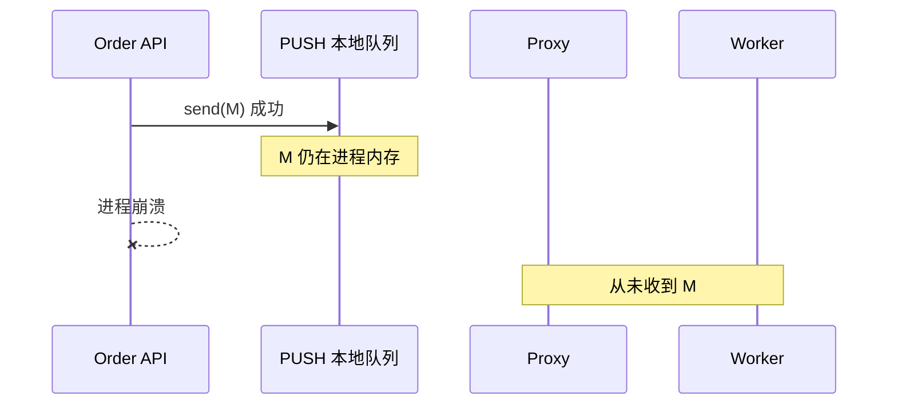
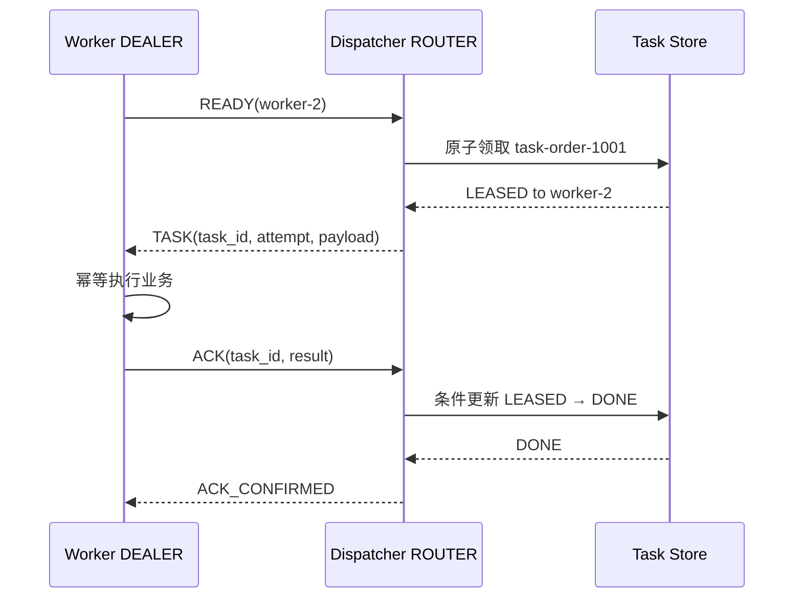

[第一篇](009_zeromq.md)已经说明 ZeroMQ 没有 Broker、持久 Queue 和 Consumer Offset。本文不再重复 Socket Pattern，而是继续追踪 `order-1001`：一次 send 后消息可能位于哪些缓冲区、每个位置故障会发生什么，以及如果业务不能丢，应用至少要建立怎样的状态机。

<!-- more -->

## 1. send 之后消息经过哪些位置

第一篇的 Pipeline 为：

```text
Order API PUSH
→ Proxy PULL
→ Proxy PUSH
→ Worker PULL
```

更接近实现的路径是：

```text
应用线程
→ PUSH Socket 的 Outgoing Pipe
→ ZeroMQ I/O Thread
→ 操作系统 TCP Send Buffer
→ 网络
→ Proxy TCP Receive Buffer
→ Proxy PULL Incoming Pipe
→ zmq_proxy
→ Proxy PUSH Outgoing Pipe
→ Worker
```

这些队列分散在三个进程和操作系统内存中，不构成一份共享、可恢复的消息日志。

### 1.1 send 成功的准确含义

官方 API 的核心语义是：成功调用 `zmq_send()` 表示消息已经排入本地 Socket，ZeroMQ 接管了这块消息内存；它不表示：

- 消息已经发送到网络；
- Proxy 已经收到；
- Worker 已经 recv；
- Worker 已经持久化；
- Worker 已经完成业务；
- 另一个节点保存了可接管副本。

因此 ZeroMQ 没有类似 Kafka Commit、RabbitMQ Publisher Confirm 或 JetStream PubAck 的内建统一提交点。

### 1.2 Multipart 的原子边界

Multipart Message 由多帧组成。ZeroMQ 对 Peer 的交付边界是整条消息：接收方不会只看到前半部分 Frame。

这只保证消息帧边界，不保证跨进程持久性。发送进程在消息仍位于本地内存时崩溃，完整 Multipart 一样会消失。

## 2. 四个关键 Socket 参数

### 2.1 HWM：限制内存队列

SNDHWM 和 RCVHWM 限制 Socket Pipe 可以积压的消息数。到达 HWM 后的行为取决于 Socket 类型：

- PUSH、DEALER 等通常进入不可写/阻塞状态；
- 使用 DONTWAIT 时返回 EAGAIN；
- PUB 等允许丢弃无法继续排队的消息。

HWM 是内存保护，不是可靠性确认。设置无限 HWM 只是把丢消息风险换成进程 OOM。

### 2.2 IMMEDIATE：不要向未完成连接排队

默认情况下，连接型 Socket 可能在连接尚未建立时接受并排队消息。对轮询路由的 PUSH/DEALER，这可能把消息放进一个最终没有成功连接的 Pipe。

`ZMQ_IMMEDIATE=1` 让 Socket 只向已经建立的连接排队；没有可用 Peer 时阻塞或返回 EAGAIN。它缩小“发往尚未连接 Peer”的窗口，但仍不提供对端业务 Ack。

### 2.3 LINGER：关闭时等多久

关闭 Socket 或 Context 时，LINGER 决定尚未发送的消息等待多久：

- `0`：立即丢弃未发送队列；
- 正数：最多等待指定时间；
- 默认无限等待：可能让进程退出长期阻塞。

LINGER 只能让当前进程尝试把缓冲发送出去；机器断电或进程崩溃时，内存消息仍无法恢复。

### 2.4 ROUTER_MANDATORY：路由失败要不要报错

ROUTER 默认可能静默丢弃无法匹配 Identity 的消息。启用 ROUTER_MANDATORY 后，不可路由或 HWM 条件可以通过错误暴露给应用。

它让错误可观察，却没有自动重试、持久保存和去重。

## 3. 临界故障：消息所有权从未真正转移

### 3.1 Producer send 成功后立即崩溃



应用看到 send 成功，但消息丢失。因为没有持久 Outbox，重启后的 Producer甚至不知道需要重发什么。

### 3.2 Proxy 已收到，但转发前崩溃

消息已经离开 Producer 的内存，进入 Proxy PULL 队列。Producer没有端到端 Ack，因此可能认为 send 已完成；Proxy 崩溃后消息仍丢失。

在链路中增加 Proxy 只是增加路由能力，也增加一个内存故障点。

### 3.3 Worker recv 后、业务完成前崩溃

Pipeline 已经把消息从 Proxy 交给 Worker。ZeroMQ 不维护“已投递未确认集合”，所以 Worker 崩溃后：

- Proxy 不知道任务是否完成；
- Worker B 不会自动接管；
- Producer 没有 Pending 状态可查询；
- 只能依靠应用自己的超时和重试。

### 3.4 Worker 已完成，但 Ack 丢失

如果应用增加 Ack，又会出现标准的结果未知：

1. Worker 完成数据库事务；
2. Worker 发送 Ack；
3. Ack 在网络中丢失；
4. 调度器超时重发；
5. Worker 或另一实例再次执行任务。

Ack 解决“不知道是否需要重试”，但同时引入重复窗口。最终仍要靠稳定 Task ID 和业务幂等。

## 4. 自动重连能恢复什么

ZeroMQ 可以在连接中断后自动重连。它恢复的是未来消息的传输通道，不是过去的业务状态。

- 仍存在于存活 Socket 队列中的消息可能在重连后继续发送；
- 已因进程崩溃、disconnect、LINGER 到期或 HWM 丢弃的消息不会恢复；
- 新 Proxy 不知道旧 Proxy 内存里有哪些任务；
- 新 Worker 不知道旧 Worker 已处理到哪里；
- PUB/SUB 订阅者重连后不能读取离线期间历史。

因此“自动重连”不能等同于“消息可靠”。

## 5. 如果必须可靠：先定义任务状态机

真正的可靠任务系统必须先决定谁拥有权威状态。最简单的做法是让数据库任务表作为事实源：

```text
READY
  → LEASED(worker_id, lease_until, attempt)
  → DONE(result_hash, finished_at)

LEASED 超时
  → READY 或 RETRY_WAIT

超过最大次数
  → DEAD
```

每个任务至少包含：

```yaml
task_id: task-order-1001
event_id: evt-1001
attempt: 3
lease_until: 2026-09-08T10:01:00+08:00
payload_hash: sha256:...
```

ZeroMQ 只负责传输 Task/ACK/Heartbeat，数据库负责回答：

- 任务是否存在；
- 当前租约属于谁；
- 是否已完成；
- 是否应该重试；
- 重复 ACK 是否可以忽略。

### 5.1 推荐的可靠任务流程

相比 PUSH/PULL，ROUTER/DEALER 更适合承载有 Identity 的自定义任务协议：



关键不是 Socket 类型，而是状态转换必须有持久权威：

1. Dispatcher 只有成功建立租约后才能发送任务。
2. Worker 必须携带 Task ID 幂等执行。
3. ACK 只能完成匹配当前租约版本的任务，防止过期 Worker 覆盖新尝试。
4. Dispatcher 崩溃后从 Task Store 扫描 READY 和过期 LEASED。
5. Worker 收不到 ACK_CONFIRMED 可以重发 ACK，服务端幂等处理。

### 5.2 外部副作用仍不能精确一次

如果 Worker 同时更新订单数据库和任务表，而它们不在同一数据库事务中，仍有双写窗口。解决方法通常是：

- 让业务数据库中的唯一状态成为幂等依据；
- 使用 Outbox/Inbox；
- 使用同库事务同时更新业务状态和 Inbox；
- 接受至少一次传输与幂等处理。

ZeroMQ 不会替应用提供分布式事务。

## 6. Proxy 高可用为什么困难

启动两个 Proxy 并让 Producer 同时 connect，并不会自动形成 Active/Standby：

- 两个 Proxy 没有共享 Pending 状态；
- 同一任务可能被不同 Proxy 重复分发；
- Proxy 故障后另一台不知道哪些消息在途；
- 没有 Epoch/Fencing 时，网络分区中的旧 Proxy 可能继续调度。

要实现安全切换，需要：

```text
Leader Election
+ Epoch / Fencing Token
+ 共享持久 Task Store
+ 幂等租约更新
+ 客户端重新发现
```

一旦加入这些组件，真正的可靠性来自数据库或共识系统，不来自 ZeroMQ Socket。架构评审时必须把两者成本分开计算。

## 7. PUB/SUB 的可靠性上限

第一篇的订单事件广播还存在四个窗口：

- Late Joiner：订阅建立前发布的消息不会补发；
- Slow Subscriber：队列达到 HWM 后可能丢消息；
- Subscriber Crash：内存进度和已收到数据消失；
- Publisher Crash：没有可恢复历史供新 Publisher 接续。

可以增加 Snapshot 服务、序列号、Gap Detection 和重传通道，但这实际上在应用层建立事件日志协议。若业务要求长期保留、多个 Consumer 独立进度和回放，使用专用 Stream 系统通常更简单。

## 8. 容量、背压与运维

需要观察：

- 每个 Socket 的 EAGAIN、发送/接收延迟和断线事件；
- HWM、应用队列长度和内存；
- TCP 重连、Heartbeat 与 Peer 数；
- Dispatcher READY Worker 数、租约超时和重试次数；
- Task Store 中 READY、LEASED、DEAD 数量；
- Task 从创建到 DONE 的端到端延迟。

背压必须端到端设计。仅让 ZeroMQ send 阻塞可能把压力推回业务线程；改成 DONTWAIT 又需要应用决定丢弃、降级还是持久重试。不能在没有容量上限的情况下持续增加内存队列。

安全方面需要 CURVE/ZAP 或受控网络、稳定身份和密钥轮换。加密与认证不提供消息持久化，它们是另一条架构维度。

## 9. 实现结论

- ZeroMQ send 成功只代表本地 Socket 接受消息，不是网络、对端或业务提交点。
- 消息可能停留在多个进程和操作系统缓冲区，任一内存故障都可能丢失。
- HWM、IMMEDIATE、LINGER 和 ROUTER_MANDATORY改善流控与可观察性，不构成持久可靠队列。
- Ack 会把“静默丢失”转化为“超时重试与可能重复”，因此必须配合稳定 ID 和幂等。
- 可靠任务的权威状态必须放在持久 Task Store，并使用租约、Epoch 和条件更新。
- 如果需要多副本日志、消费进度和自动故障接管，采用专用 Broker 往往成本更低。

## 10. 参考资料

- [libzmq zmq_send](https://libzmq.readthedocs.io/en/latest/zmq_send.html)
- [libzmq Socket Options](https://libzmq.readthedocs.io/en/latest/zmq_setsockopt.html)
- [ØMQ Guide：Sockets and Patterns](https://zguide.zeromq.org/docs/chapter2/)
- [ØMQ Guide：Reliable Request-Reply](https://zguide.zeromq.org/docs/chapter4/)
- [ØMQ Guide：Advanced Pub-Sub](https://zguide.zeromq.org/docs/chapter5/)
- [ØMQ RFC 18：Majordomo Protocol](https://rfc.zeromq.org/spec/18/)
