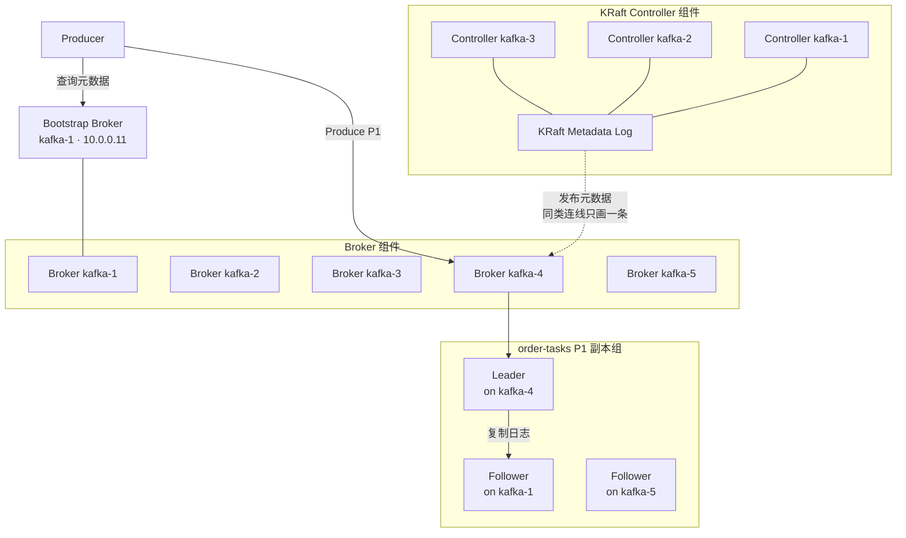
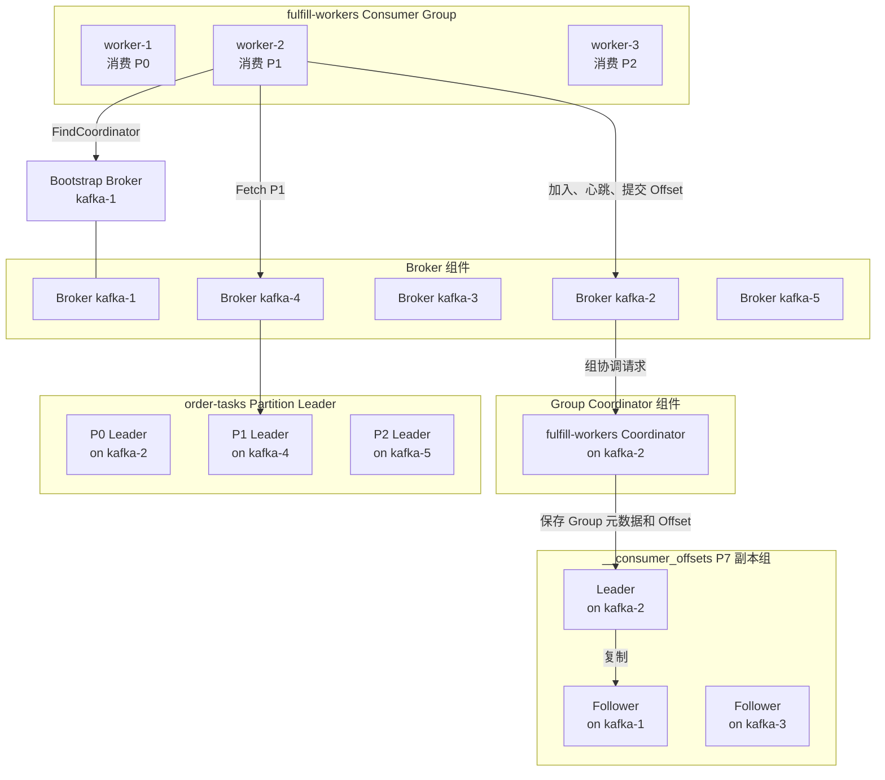
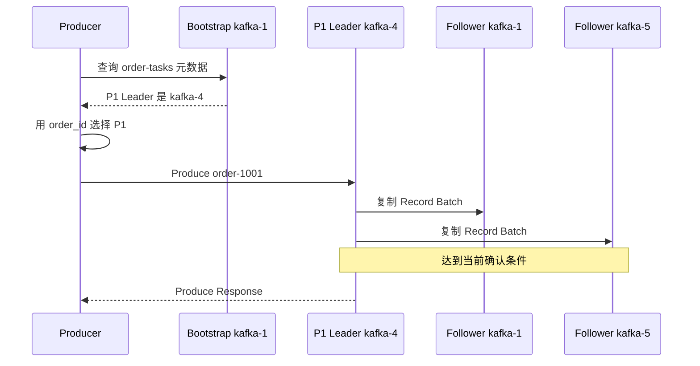
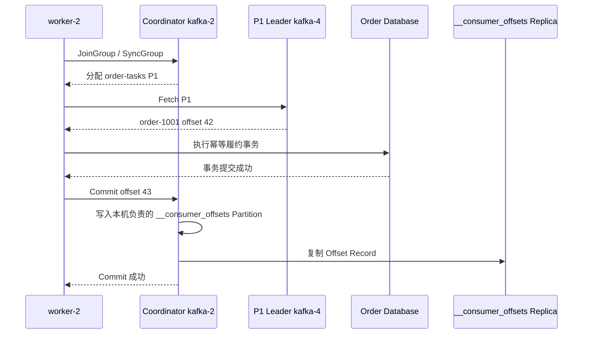
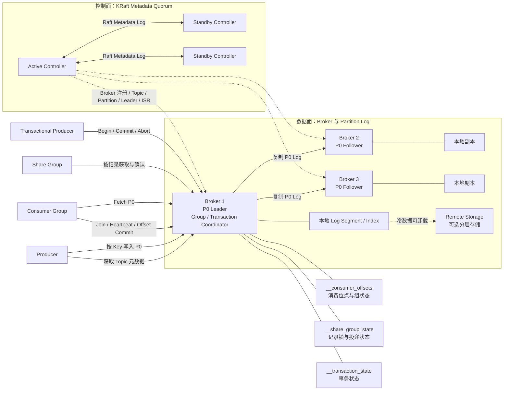

Kafka 的第一性原理是：把事件追加到可复制、可保留的分区日志，Consumer 保存自己的读取位置。消息不会因为某个 Consumer 读过就立即删除，因此多个业务可以独立消费，也可以从历史位置重新处理。

本文回答三个问题：
1. 五台服务器如何部署 Kafka；
2. Producer 和 Consumer 最终连接谁；
3. Topic、Partition、Consumer Group 和 Offset 在流程中分别解决什么问题。

ISR、HW、完整提交过程和 Leader 故障恢复放在[实现篇](012_kafka_implementation.md)。

<!-- more -->

## 1. 五节点生产部署

| 节点 | IP | 部署角色 |
|---|---|---|
| `kafka-1` | `10.0.0.11` | Broker 1 + KRaft Controller |
| `kafka-2` | `10.0.0.12` | Broker 2 + KRaft Controller |
| `kafka-3` | `10.0.0.13` | Broker 3 + KRaft Controller |
| `kafka-4` | `10.0.0.14` | Broker 4 |
| `kafka-5` | `10.0.0.15` | Broker 5 |

三个 Controller 组成 KRaft 仲裁组。这里把 Controller 与 Broker 合并部署以便用五台机器说明完整架构；规模更大或隔离要求更高时，可以使用独立 Controller 节点。

客户端配置多个 Bootstrap 地址：

```text
10.0.0.11:9092,10.0.0.12:9092,10.0.0.13:9092
```

Bootstrap Broker 只是发现入口。客户端获取元数据后直接连接目标 Partition Leader，不由 Bootstrap Broker 代理全部流量。

### 1.1 生产消息架构

下面按组件组织架构：Controller 组件有三个节点，Broker 组件有五个节点，业务 Partition 组件包含一个 Leader 和两个 Follower。节点标签中的主机名说明它实际部署在哪里。



图中先回答“Kafka 有哪些组件、每个组件有几个节点”，再用 `on kafka-x` 表示共置关系。P1 Leader 还会复制给 `kafka-5` 上的 Follower；由于与 Leader 到 `kafka-1` 的关系相同，只保留一条代表线。

这条路径中有三个角色：

- **Controller** 决定 Topic、Partition、副本和 Leader 等集群元数据，不转发每条业务消息。
- **Bootstrap Broker** 是发现入口。它告诉 Producer 目标 Partition 的 Leader 在哪里，不代理后续写入。
- **Partition Leader** 接收 Produce 请求并分配 Offset；Follower 复制 Leader 的日志。

一个 Topic 可以有多个 Partition，每个 Partition 又可以有多个副本。五个 Broker 不表示每条消息固定写五份。

### 1.2 消费消息架构

消费图同样按组件组织：Consumer Group、Broker、Group Coordinator、业务 Partition Leader 和 `__consumer_offsets` 副本组各自独立。Consumer 先找 Coordinator 完成组协调，再直连业务 Partition Leader 拉取消息。



连接只用 `worker-2` 的路径作为代表：另外两个 Worker 会以相同方式连接 Coordinator，并分别连接 P0、P2 Leader；offsets P7 还会复制到 `kafka-3`。这些节点仍然完整画出，只省略重复连线。

这里的 **Group Coordinator** 不是独立部署的新服务，而是某个 Broker 针对一组 Consumer Group 承担的逻辑角色：

1. Consumer 可以询问任意 Broker，找到自己 Group 的 Coordinator。
2. Coordinator 接收成员加入、退出和心跳，维护组状态，并推动 Partition 分配。
3. Consumer 得到分配后，绕过 Coordinator，直接连接对应的 Partition Leader Fetch 数据。
4. Consumer 完成业务后把 Offset 提交给 Coordinator；Coordinator 将其写入 `__consumer_offsets`。

`group.id` 会映射到 `__consumer_offsets` 的某个 Partition，该 Partition 的 Leader 所在 Broker 承担这个 Group 的 Coordinator。例如，后面的订单示例假设 `fulfill-workers` 映射到 P7，而 P7 Leader 位于 `kafka-2`。这只是当前分配，不表示 `kafka-2` 永远是所有 Group 的 Coordinator。

因此，Consumer 实际连接的对象不止一个：**向 Coordinator 发送组协调和 Offset 请求，向各业务 Partition Leader 发送 Fetch 请求**。

### 1.3 普通生产消费涉及的三类数据

- **集群元数据**
  - 解决的问题：有哪些 Broker、Topic 和 Partition，每个副本在哪，谁是 Leader。
  - 保存内容：Broker 注册、Topic 配置、Partition 副本分配、Leader 和 ACL 等。
  - 保存组件：KRaft Metadata Log，由 Controller 仲裁组管理。
  - 一致性机制：Controller 使用 Raft 管理唯一的已提交元数据历史。

- **业务消息日志**
  - 解决的问题：一个 Partition 中按什么顺序保存了哪些 Record。
  - 保存内容：Record Batch、Offset、时间戳和索引。
  - 保存组件：Partition Leader 和 Follower Broker 的本地日志。
  - 一致性机制：Leader/Follower 复制；ISR、`acks` 和 `min.insync.replicas` 共同约束确认。

- **消费组与进度**
  - 解决的问题：Group 中谁负责哪些 Partition，以及恢复时从哪里继续。
  - 保存内容：Group 成员与分配的运行状态、每个 `Group + Topic + Partition` 的已提交 Offset。
  - 保存组件：Group Coordinator 负责协调；已提交 Offset 保存在内部 Topic `__consumer_offsets`。
  - 一致性机制：`__consumer_offsets` 本身也是有副本的 Kafka Topic。

Connection、Fetch Session 和尚未提交的应用处理位置属于运行时数据，不写入 KRaft 元数据日志。

### 1.4 Kafka 中还有哪些 Coordinator

先从部署角度区分两类角色：

- **KRaft Controller 仲裁组**是独立的控制面一致性组件。三个 Controller 通过 Raft 维护一份集群元数据历史，并选出一个 Active Controller；
- **Group、Transaction 和 Share Coordinator**不是三套额外部署的服务。它们是 Broker 进程内的逻辑组件，由内部 Topic 的 Partition Leader 分片承担职责。

可以把对应关系先概括成：

```text
集群级元数据
└─ KRaft Controller 仲裁组
   └─ KRaft Metadata Log

按 group.id 分片的组协调
└─ __consumer_offsets 某个 Partition 的 Leader Broker
   └─ Group Coordinator

按 transactional.id 分片的事务协调
└─ __transaction_state 某个 Partition 的 Leader Broker
   └─ Transaction Coordinator

按 group + topicId + partition 分片的共享消费状态
└─ __share_group_state 某个 Partition 的 Leader Broker
   └─ Share Coordinator
```

这里最重要的区别是：KRaft 仲裁组通过 Raft 决定唯一的集群元数据历史；其他 Coordinator 的状态写入有副本的 Kafka 内部 Topic，依靠对应 Partition 的 Leader/Follower 复制获得持久性。它们自身不再组成一套 KRaft 仲裁组。

#### Group Coordinator：协调一组消费者

Group Coordinator 以 `group.id` 为分片键。Kafka 把 `group.id` 映射到 `__consumer_offsets` 的某个 Partition，该 Partition 的 Leader Broker 就承担这个 Group 的协调职责。

它主要负责：

- 维护成员加入、退出和心跳；
- 计算或推动 Topic Partition 在成员之间的分配；
- 管理 Group Epoch、Member Epoch 等组状态；
- 接收和查询 Consumer Offset；
- 把需要恢复的 Group 元数据和 Offset 写入 `__consumer_offsets`，并在内存中缓存当前运行状态。

Classic Consumer Group、新的 Consumer Group 协议和 Streams Group 都由 Group Coordinator 子系统协调。Share Group 的成员列表与 Partition 分配也归 Group Coordinator；它的逐条消息获取状态则由后面的 Share Coordinator 管理。

本例中：

```text
group.id = fulfill-workers
        ↓ 映射
__consumer_offsets P7
        ↓ 当前 Leader 位于 kafka-2
kafka-2 承担 fulfill-workers 的 Group Coordinator
```

因此 `worker-2` 向 `kafka-2` 发送 Join、Heartbeat 和 Offset Commit，但读取 `order-tasks P1` 时仍然直连 P1 Leader `kafka-4`。Coordinator 管“谁消费、从哪里恢复”，不转发正常的业务消息。

#### Transaction Coordinator：协调一个 Kafka 事务

Transaction Coordinator 以 `transactional.id` 为分片键。该 ID 映射到 `__transaction_state` 的某个 Partition，其 Leader Broker 承担这一个 transactional ID 的协调职责。

它主要负责：

- 管理 Producer ID、Producer Epoch 和旧 Producer 隔离；
- 保存事务当前处于进行、准备提交、提交或中止等状态；
- 记录本次事务涉及哪些 Topic Partition；
- 事务结束时推动各业务 Partition 写入 Commit 或 Abort Marker；
- 在 Coordinator 故障转移后，从 `__transaction_state` 恢复未完成事务。

例如假设：

```text
transactional.id = fulfill-txn-1
        ↓ 映射
__transaction_state P3
        ↓ 当前 Leader 位于 kafka-5
kafka-5 承担 fulfill-txn-1 的 Transaction Coordinator
```

Transactional Producer 向 `kafka-5` 发起事务控制请求，但真正的订单事件仍直接写到各业务 Partition Leader。Transaction Coordinator 管事务状态和最终决议，不代理所有事务数据。

#### Share Coordinator：保存 Share Group 的任务投递状态

Share Group 是 Kafka 面向任务队列的消费模型：多个 Share Consumer 可以共同处理同一个 Partition，并分别确认每条任务。普通 Consumer Group 的规则没有改变，同一 Partition 同一时刻仍只分配给组内一个 Consumer。

Share Group 中，Group Coordinator 仍负责成员和 Partition 分配；Share Coordinator 则负责持久化哪些 Record 已获取、已确认或需要重试，状态写入 `__share_group_state`。业务消息仍由 Topic Partition Leader 投递，Share Coordinator 不转发消息。

普通 Consumer Group 不使用 Share Coordinator。Share Group 的完整生产、获取、确认和故障恢复过程见[Kafka 任务队列篇](013_kafka_task_queue.md)。

#### Coordinator 故障后为什么可以转移

普通客户端或 Broker 内部调用方可以先向任意 Broker 发送 `FindCoordinator`。Kafka 当前区分 `GROUP`、`TRANSACTION` 和 `SHARE` 三种查找类型，返回当前承担该键的 Broker 地址。

如果某个 Coordinator Broker 故障：

1. Controller 为对应内部 Topic Partition 选择新 Leader；
2. 新 Leader Broker 加载这个 Partition 中的协调状态；
3. 加载期间客户端可能收到 Coordinator 正在加载或不可用的错误；
4. 客户端重新执行 `FindCoordinator`，连接新的 Broker 后重试请求。

所以 Coordinator 的可用性最终依赖两件事：内部 Topic 是否拥有健康副本，以及它的 Partition 能否选出 Leader。一个 Broker 也可以同时承担许多 Group、Transaction 和 Share Coordinator，但只负责映射到自己所领导内部 Partition 的那些键。

## 2. 示例一：订单履约任务

需求是订单创建后交给任意一个 Worker 履约，Worker 崩溃后其他 Worker 能继续处理。

```text
Topic:          order-tasks
Partitions:     3
Replication:    3
Consumer Group: fulfill-workers
Record Key:     order_id
```

本例假设：

| Partition | Leader | Followers |
|---|---|---|
| P0 | `kafka-2` | `kafka-3/4` |
| P1 | `kafka-4` | `kafka-1/5` |
| P2 | `kafka-5` | `kafka-2/3` |

### 2.1 初始化后各组件保存什么

Controller 元数据记录 Topic 配置、三个 Partition、副本分配和当前 Leader。各 Broker 创建自己负责的 Partition 日志。

此时还没有持久的 `fulfill-workers` 消费进度。Consumer 加入后，Coordinator 才建立 Group 运行状态；Consumer 提交 Offset 后，`__consumer_offsets` 才出现对应记录。

- Topic `order-tasks` 表示一类订单任务。
- Partition P1 是一条有序日志，也是生产、存储和消费并行度单位。
- Offset 42 表示 P1 中的位置，不是整个 Topic 的全局编号。

### 2.2 Producer 生产消息的完整过程

假设 Producer 首次连接 `kafka-1`，`order-1001` 被分到 P1，P1 Leader 是 `kafka-4`。



1. Producer 连接任一 Bootstrap Broker，获取 Topic、Partition 和 Leader 元数据。
2. 分区器根据 `order_id` 选择 P1。相同 Key 稳定进入同一 Partition，才能获得同一订单的日志顺序。
3. Producer 直接连接 `kafka-4`，把 Record Batch 交给 P1 Leader。
4. Leader 分配 Partition 内 Offset，Follower 拉取新日志。
5. 达到 `acks` 和 ISR 配置要求后，Leader 返回结果。

Producer 收到成功只表示 Kafka 按当前配置接管消息，不表示 Worker 已完成履约。超时表示结果未知，重试需要依赖幂等 Producer 和业务去重。

### 2.3 Consumer 有哪些状态

- **Group 身份**：`group.id=fulfill-workers`，表示三个 Worker 共同维护一份读取进度。
- **成员与分配**：Worker、成员 ID、订阅 Topic，以及 P0/P1/P2 当前分别归谁，由 Coordinator 管理。
- **当前处理位置**：Consumer 已拉取、正在处理到哪里，保存在客户端内存中。
- **已提交 Offset**：业务完成后持久保存的恢复位置，保存在 `__consumer_offsets`。

“已经拉取到 Offset 50”和“已经提交 Offset 50”不是一回事。前者可能只存在于 Worker 内存，后者才是重启后的恢复依据。

### 2.4 Consumer 消费消息的完整过程

```text
worker-1 → P0
worker-2 → P1
worker-3 → P2
Group Coordinator → kafka-2
P1 Leader → kafka-4
```



1. Worker 可连接任一 Broker 找到 `fulfill-workers` 的 Coordinator。
2. 三个 Worker 加入 Group，同一 Group 内一个 Partition 同时只分给一个成员。
3. `worker-2` 直接连接 P1 Leader `kafka-4`，从已提交位置 Fetch。
4. Kafka 返回 Offset 42，但不知道 Worker 的数据库事务是否成功。
5. Worker 完成幂等事务后提交 Offset 43，表示下次从 43 开始。
6. 若数据库已提交但 Offset 尚未提交时 Worker 崩溃，任务会被再次读取。

Kafka 按 Partition 分配工作，不是把每条消息独立派发给任意空闲 Worker。长任务、单条优先级、独立 TTL 和复杂重试需要额外设计。

## 3. 示例二：订单事件流

创建三分区 Topic `order-events`。Producer 以 `order_id` 为 Key，依次写入：

```text
OrderCreated → OrderPaid → OrderShipped
```

仓储、风控和分析使用不同 Group：

```text
warehouse → 一份独立进度
risk      → 一份独立进度
analytics → 一份独立进度
```

生产和消费连接路径与任务示例相同。区别在于三个 Group 都能读取完整事件，各自提交 Offset；某个 Group 的进度不会推进其他 Group，也不会删除消息。消息由 Topic 的保留时间、容量或压缩策略清理。

相同订单稳定进入同一 Partition 时，Kafka 保证这些 Record 在该 Partition 的追加顺序，不保证不同 Partition 的全局顺序。

常见场景：

- **CDC**：捕获数据库增删改并写成事件，供搜索、缓存或数仓同步。
- **日志聚合**：集中收集多台服务器日志，再交给检索、告警和离线分析。
- **流处理**：事件到达时持续计算，例如窗口成交额或异常支付检测。
- **回放**：从旧 Offset 重读历史，例如修复程序后重算报表或重建索引。

## 4. 从两个示例归纳语义边界

- Topic 是事件分类和治理边界，Partition 才是顺序、存储、副本和并行度单位。
- Record Key 用于选择 Partition；相同 Key 只有稳定进入同一 Partition才能讨论顺序。
- Consumer Group 表示一套独立进度：组内分摊 Partition，组间各读一份。
- Offset 是 Partition 内位置。提交 Offset 是保存恢复书签，不是物理删除消息。
- Producer 成功、Consumer 拉取、业务事务成功和 Offset 提交是四个不同时间点。
- Kafka 默认应按至少一次设计；Kafka 内部幂等和事务不能自动覆盖外部数据库或 HTTP 调用。

Kafka 适合事件流、CDC、日志聚合、流处理和需要回放的业务事件。若核心是复杂 AMQP 路由、单条消息 TTL/优先级或大量短生命周期 Queue，传统任务型消息队列通常更直接。

## 5. 客户端连接路径总结

```text
生产：
Producer → Bootstrap Broker 查询元数据
         → 目标 Partition Leader 写入

消费：
Consumer → Group Coordinator 加入和分配
         → Partition Leader 拉取数据
         → Coordinator 提交 Offset
```

Controller 不在每条消息的数据路径中，Bootstrap Broker 也不是固定代理。

## 6. 后续文章解决的问题

以下内容见[Kafka 实现篇](012_kafka_implementation.md)：

- Partition 日志和索引如何组织；
- Follower 如何推进 LEO，Leader 如何计算 HW；
- ISR、`acks` 和 `min.insync.replicas` 如何决定提交；
- Leader 切换时如何区分已提交与未提交消息；
- 旧 Leader 恢复后如何截断分叉日志；
- Kafka 事务如何让多 Partition 写入和 Consumer Offset 原子提交。

Share Group 的逐条任务获取、确认、重投和故障恢复见[Kafka 任务队列篇](013_kafka_task_queue.md)。

安全、多租户、监控、升级与跨地域灾备见[Kafka 运维与灾备篇](014_kafka_operations.md)。

## 7. 参考资料

- [Kafka Design](https://kafka.apache.org/documentation/#design)
- [Kafka Consumer Offset Tracking](https://kafka.apache.org/42/implementation/distribution/)
- [Kafka Producer Configs](https://kafka.apache.org/documentation/#producerconfigs)
- [Kafka Consumer Configs](https://kafka.apache.org/documentation/#consumerconfigs)
- [Kafka KRaft](https://kafka.apache.org/documentation/#kraft)
- [Kafka Protocol：FindCoordinator 与协调请求](https://kafka.apache.org/43/design/protocol/)
- [Kafka Distribution：Group Coordinator 与 Offset 存储](https://kafka.apache.org/43/implementation/distribution/)
- [Kafka Transaction Protocol](https://kafka.apache.org/43/operations/transaction-protocol/)
- [KIP-932：Share Group、Group Coordinator 与 Share Coordinator](https://cwiki.apache.org/confluence/display/KAFKA/KIP-932%3A+Queues+for+Kafka)
- [Kafka Broker 协调类型映射实现](https://github.com/apache/kafka/blob/trunk/core/src/main/scala/kafka/server/KafkaApis.scala)

## 附录：Kafka 完整架构图


