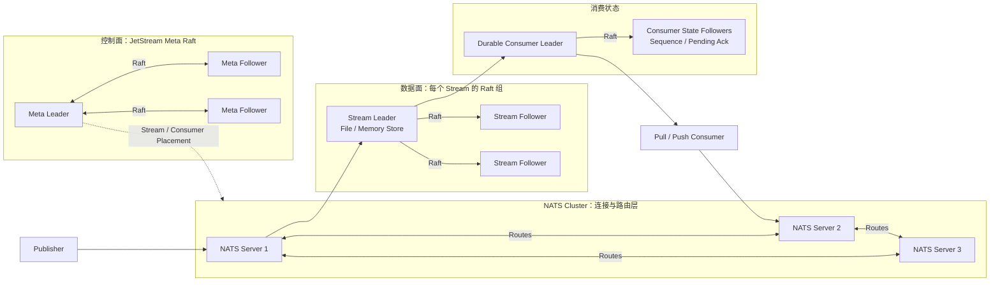

Core NATS 是在线、至多一次的消息总线；JetStream 在它之上增加 Stream、Consumer、持久化、确认和重放。需要可靠消息时讨论的应是 JetStream，而不是只开启 Core NATS 集群。

<!-- more -->

## 1. 完整架构



下面以 Publisher 向 Subject **orders.created** 发布 order-42 为例。

### 生产消息的过程

1. Publisher 连接任一 NATS Server，并向 orders.created 发布消息。
2. NATS 路由层找到订阅该 Subject 的 JetStream Stream，消息最终到达 Stream Leader。
3. Stream Leader 通过自己的 Raft 组复制消息。
4. 达到提交条件后，JetStream 向 Publisher 返回发布确认（PubAck）。

Meta Raft 负责 Stream 和 Consumer 的放置等集群元数据，不保存这条业务消息。

### 消费消息的过程

1. **inventory** Durable Consumer 从自己的 Sequence 继续读取。
2. Consumer Leader 把消息交给 Pull 或 Push Consumer，并记录 Pending Ack。
3. 应用完成库存事务后发送 ACK。
4. JetStream 更新该 Durable Consumer 的消费状态；未 ACK 的消息可以再次投递。

Stream 数据状态和 Consumer 消费状态是不同的 Raft 状态，具体复制与故障行为在后文解释。

JetStream 不是“整个集群一个 Raft 组”。集群元数据、每个 Stream 和持久 Consumer 分别维护状态；客户端连接到任一 NATS Server，消息最终路由到对应 Stream Leader。增加副本提高容错，但不会提高单个 Stream 的写吞吐。

## 2. 如何“分区”并保证顺序

JetStream Stream 是匹配一个或多个 Subject 的追加日志，自身没有 Kafka 式 Partition 数。要横向扩展单 Stream Leader 的写入瓶颈，需要把 Subject 空间拆给多个 Stream，例如：

```text
orders.0.> -> ORDERS_0
orders.1.> -> ORDERS_1
orders.2.> -> ORDERS_2
```

Publisher 根据 `hash(order_id) % N` 选择 Subject。顺序保证存在于单 Stream 的 Sequence 中；拆成多个 Stream 后不再有全局顺序。

Ordered Consumer 是无状态、自动重建的单线程读取视图，适合分析和一次性顺序扫描；它不使用 Ack，也不适合作为可扩展的关键任务工作队列。持久 Consumer 要保证处理顺序，应限制在途消息数为 1，串行 Ack，并避免多个客户端并行共享同一 Consumer。

至少一次投递会重发超时未 Ack 的消息，因此应用仍需使用业务 ID 幂等。若多个 Publisher 并发发送，同一 Subject 的“业务先后”也必须由上游序列号定义。

## 5. 适用边界

JetStream 适合云原生服务通信、控制面事件、低延迟任务和中等规模可回放消息。需要成熟分区生态、超长保留和大规模流处理时，Kafka/Pulsar 通常更合适。

## 6. 参考资料

- [NATS JetStream](https://docs.nats.io/concepts/jetstream)
- [NATS Surviving Node Loss](https://docs.nats.io/learn/jetstream/surviving-node-loss)
- [NATS Clustering and Replication](https://docs.nats.io/learn/clustering/)
- [NATS Ordered Consumers](https://docs.nats.io/learn/jetstream/ordered-consumer)
