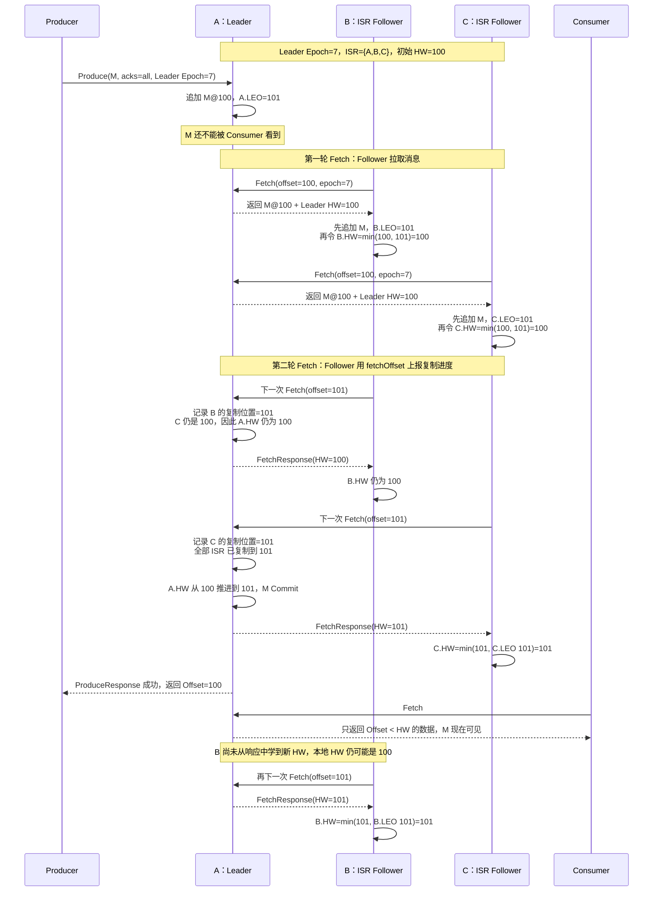
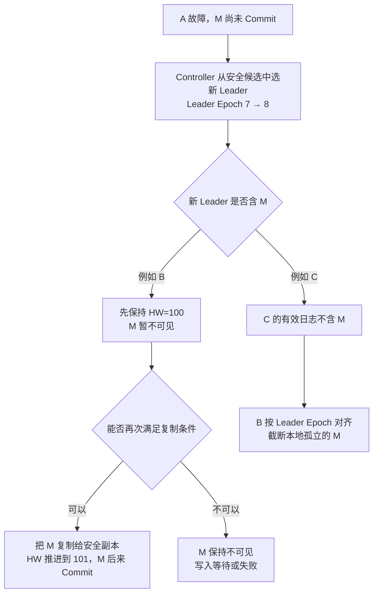
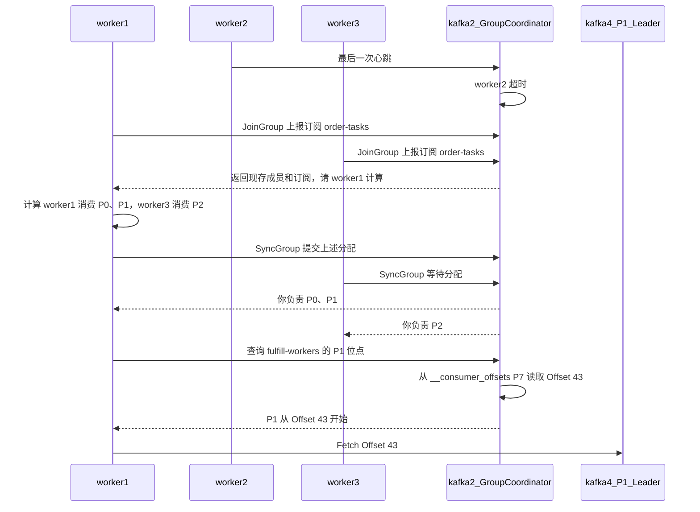
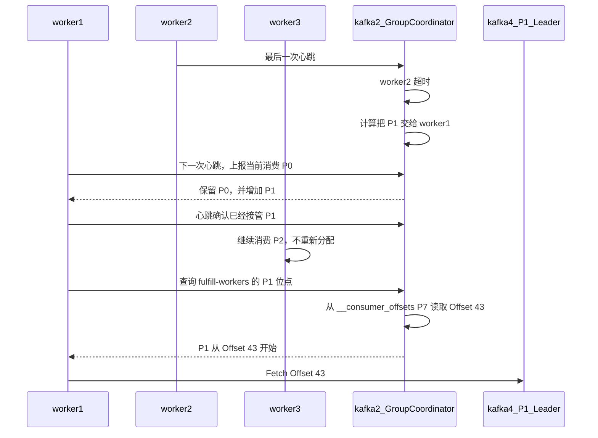
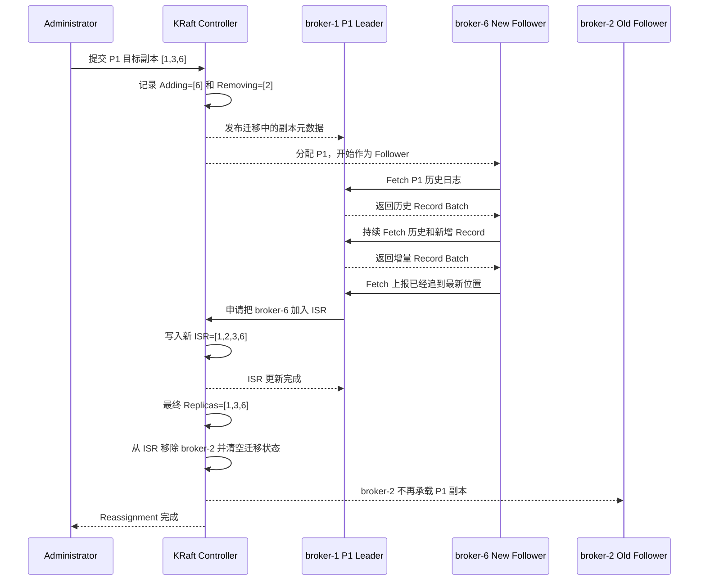
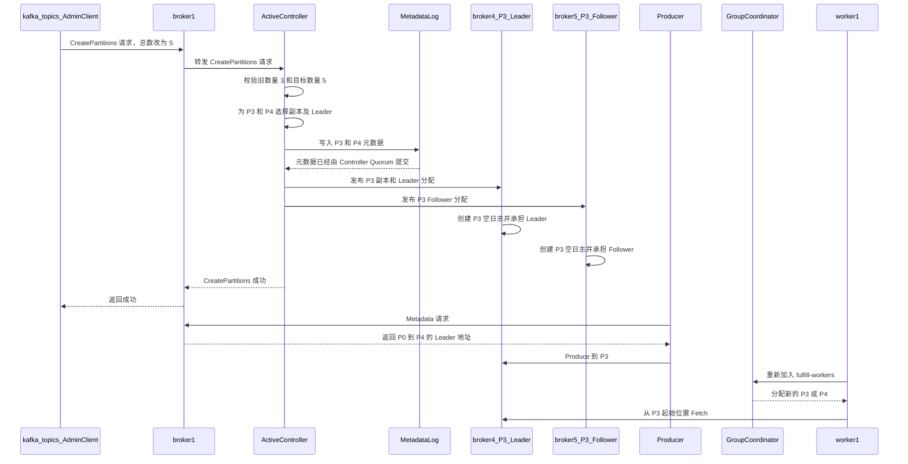
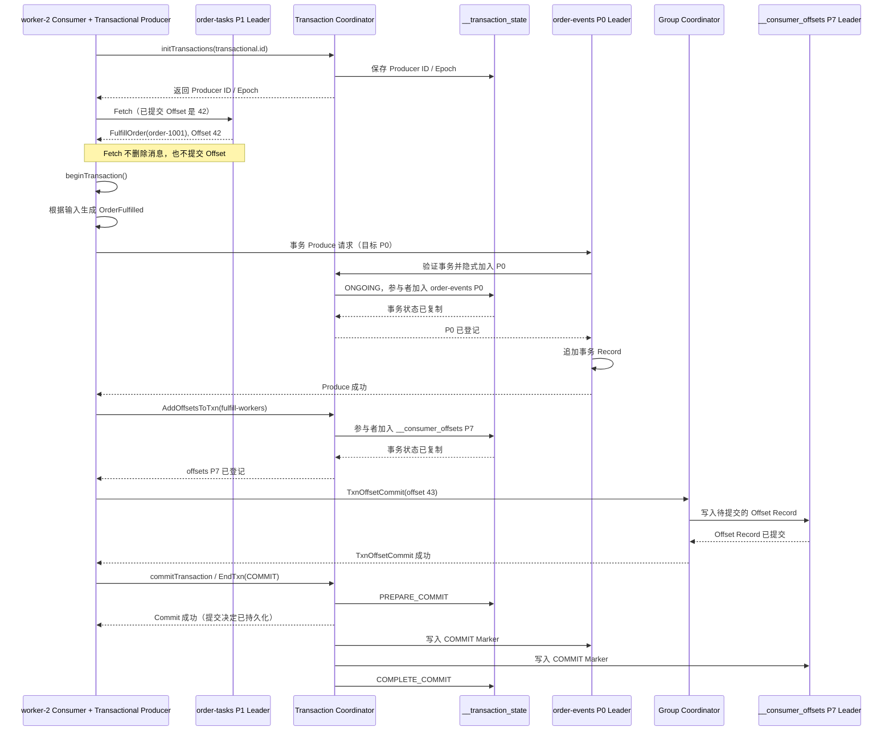

[第一篇](011_kafka.md)已经说明 Topic、Partition、Consumer Group、Offset 和客户端连接路径。本文从 `order-tasks` 的 P1 Leader 收到 `order-1001` 的位置继续，依次解释磁盘日志、多副本提交、Consumer Offset、Consumer Group Rebalance、Partition Replica Reassignment、Topic 分区扩容和 Kafka 事务。

<!-- more -->

## 1. 从 Topic Partition 到磁盘日志

Kafka 真正的存储单位是 Partition。`order-tasks` 的 P1 在每个副本 Broker 上都有一个日志目录，目录内由多个 Segment 组成：

```text
order-tasks-1/
├── 00000000000000000000.log
├── 00000000000000000000.index
├── 00000000000000000000.timeindex
├── 00000000000001000000.log
├── 00000000000001000000.index
└── 00000000000001000000.timeindex
```

- `.log` 保存按 Offset 排列的 Record Batch；
- `.index` 把相对 Offset 映射到日志文件位置；
- `.timeindex` 支持按时间定位；
- 当前 Segment 达到大小或时间条件后滚动到新 Segment；
- 删除保留和日志压缩以 Segment/Record Key 为基础清理历史。

Topic 本身没有一个合并文件。P0、P1、P2 是三条独立日志，各自拥有 Leader、Follower、Offset、HW 和 Leader Epoch。

### 1.1 控制面与数据面

```text
KRaft Metadata Log：Topic、Partition、副本分配、Leader、ISR/ELR
Partition Log：      业务 Record、Offset、Segment 与索引
__consumer_offsets： Consumer Group 元数据与已提交 Offset
```

Controller 决定谁负责 P1，却不保存 P1 的订单正文；Group Coordinator 保存消费进度，却不参与 P1 的 Record 排序。三条状态链分别复制，不能混成一个“Kafka Raft 日志”。

## 2. Producer 如何确认消息成功

Producer 先选择 Partition，再由 Partition Leader 排序和追加消息。`acks` 定义 Producer 在什么时点把一次写入视为成功：

| 确认方式 | 成功边界 | 核心风险 |
|---|---|---|
| 不等待 | 消息发出后立即继续 | 网络或 Broker 故障时应用甚至不知道消息是否到达 |
| 只等 Leader | Leader 本地接受写入 | 副本尚未同步就切主时，已确认消息可能丢失 |
| 等同步副本 | 当前 ISR 完成确认且满足最低同步副本要求 | 延迟更高；同步副本不足时拒绝写入 |

关键业务通常采用复制因子 3、至少两个同步副本、等待全部当前 ISR，并禁止落后副本直接成为 Leader。这里表达的不是固定参数答案，而是一个原则：只有未来有资格接管的副本已经拥有消息，Leader 才能向客户端确认。

### 2.1 幂等 Producer 解决什么

消息已经提交但响应丢失时，Producer 只能重试。幂等 Producer 使用 Producer ID、Epoch 和序列号识别同一批次的重试，避免因为客户端重试在同一 Partition 写入两份。

它的边界是：

- 主要解决 Producer 到 Kafka 的重复写入；
- 不代表 Consumer 的业务副作用只执行一次；
- 业务跨进程重建、外部系统写入和超出去重作用域时，仍需要稳定事件 ID。

### 2.2 批处理、压缩和背压

Producer 会把同一 Partition 的 Record 合成 Batch，并可以压缩后发送。更大的 Batch 通常提高网络和磁盘效率，但需要等待更多消息，增加低流量下的延迟。

当 Broker 变慢时，Record 会积累在 Producer 内存缓冲区。应用必须限制等待时间和缓冲上限，不能在 Kafka 不可用时无限堆积内存。发送成功的定义还应受总投递超时约束，而不是无限重试。

## 3. 多副本一致性与临界故障

### 3.1 Partition 的唯一历史

每个 Partition 有一个 Leader 和若干 Followers。Leader 决定写入顺序，Follower 按这个顺序复制。理解切主必须先区分四个状态：

| 状态 | 含义 | 解决的问题 |
|---|---|---|
| LEO（Log End Offset） | 某个副本下一条消息将写入的位置 | 这个副本实际复制到了哪里 |
| HW（High Watermark） | 已提交区域的右边界；Offset 小于 HW 的 Record 才是已提交 | Consumer 最多可以安全看到哪里 |
| Leader Epoch | 该 Partition 每一任 Leader 的单调递增任期 | 隔离旧 Leader，并识别切主后的日志分叉 |
| ISR / ELR | Controller 记录的安全 Leader 候选集合 | 哪些副本有资格在故障后接管 |

例如消息 M 的 Offset 是 100：

```text
HW = 100：Offset 100 尚未 Commit
HW = 101：Offset 100 已经 Commit
```

Kafka 不会给每条消息写一个独立的 `committed=true` 标志。是否 Commit 由 HW 这条边界统一表达。

传统模型中，足够接近 Leader 的副本进入 ISR，并参与安全提交和后续选主。Kafka 4.x 还提供 Eligible Leader Replicas（ELR）：在严格 `min.insync.replicas` 规则下，Controller 可以记录部分已经离开 ISR、但仍被证明不会丢失已提交数据的安全候选。ELR 不是允许任意落后副本上位的 Unclean Election。

Kafka 数据复制不是“每个 Partition 一个 Raft 组”。ISR 可以随着副本延迟动态变化；最低同步副本数决定 ISR 缩小时还能不能继续确认写入。

KRaft Controller 保存 Leader、Leader Epoch、ISR/ELR 等元数据，但不保存业务 Record，也不替数据 Partition 计算 HW。业务消息仍由 Partition Leader 与 Followers 复制。

核心取舍是：

- 剩余副本不足时继续写，获得可用性，但增加已确认数据丢失风险；
- 剩余副本不足时停止写，保护已确认历史，但业务暂时不可用。

### 3.2 临界故障场景

假设 P0 有 A、B、C 三个副本：

```text
Leader = A
Leader Epoch = 7
ISR = {A, B, C}
min.insync.replicas = 2
Producer acks = all
写入前 HW = 100
```

Producer 要写入消息 M。M 被分配 Offset 100，写入完成后的 LEO 是 101。

#### 3.2.1 从接收到返回的完整过程



完整过程实际包含三种信息流：

1. **消息向 Follower 传播**：Follower 用 `Fetch(offset=100)` 拉到 M，追加后把自己的 LEO 推进到 101；
2. **复制进度向 Leader 传播**：Follower 下一次发送 `Fetch(offset=101)`，这个请求同时告诉 Leader：“我的日志已经写到 101”；
3. **提交边界向 Follower 传播**：Leader 汇总 ISR 的复制位置并把自己的 HW 推进到 101，再通过当前或后续 `FetchResponse(HW=101)` 把提交边界传回 Follower。

因此，每个副本上都有一个本地 HW，但职责不同：

| 位置 | HW 如何产生 | 作用 |
|---|---|---|
| Leader | 根据当前 ISR 中各副本已知的复制位置推进 | 权威的提交边界，决定何时响应 Producer、向 Consumer 暴露到哪里 |
| Follower | 从 Leader 的 FetchResponse 学到，并限制为不超过自己的 LEO | 保存对提交边界的本地认知，可能暂时落后于 Leader |

Follower 更新本地 HW 的原则可以简化为：

```text
Follower.HW = min(FetchResponse 中的 Leader.HW, Follower 自己的 LEO)
```

取 `min` 是因为 Follower 不能把尚未复制到本地的 Offset 标记为已提交。Follower 也不参与“投票计算 HW”；它只是上报自己的复制位置，并接受 Leader 算出的提交边界。

这里还有两个容易误解的地方。

第一，Follower 不是等待 Leader 主动推送再单独发送 ACK。Follower 主动发 Fetch 请求复制数据；它下一次请求携带的 Fetch Offset，告诉 Leader 自己已经复制到哪里。Leader 据此维护各副本 LEO，并计算 HW。

第二，`acks=all` 的 “all” 是当前全部 ISR，而不是 `min.insync.replicas` 个副本。上例 ISR 有三个成员，即使 `min.insync.replicas=2`，正常情况下也要 A、B、C 都拥有 M 才返回成功。`min.insync.replicas=2` 的作用是：ISR 若缩到一个成员，则拒绝这次 `acks=all` 写入。

从第一性原理看，M 的提交条件是：

```text
当前安全复制集合满足最小副本要求
                    ＋
M 已复制到当前全部 ISR
                    ↓
              HW 推进越过 M
                    ↓
       Producer 可以成功，Consumer 可以看到 M
```

事务消息还多一条可见性边界：`read_committed` Consumer 最多读取到 LSO（Last Stable Offset）。HW 表示复制已提交，LSO 还会挡住尚未结束的事务；这里讨论的 M 是非事务消息。

#### 3.2.2 Leader 切换时如何知道哪条消息已 Commit

答案不是“新 Leader 枚举每条消息的状态”，而是四步：

1. **Controller 选择安全候选**：优先从 ISR 中选择；启用 ELR 时，ISR 为空后还可以按 ELR 规则选择。Unclean Election 关闭时，不会随意选择普通落后副本；
2. **Controller 增加 Leader Epoch**：新 Leader 获得更高任期，旧 Leader 即使暂时存活，也会因 Epoch 过旧而被拒绝写入和复制；
3. **新 Leader 以本地 HW 限制可见性**：刚接管时，不会把 HW 之后的尾部立即暴露给 Consumer；
4. **副本按 Leader Epoch 对齐日志**：Followers 使用 `OffsetsForLeaderEpoch` 找到与新 Leader 的共同历史，截断真正分叉的尾部，再继续复制。新 Leader 收集当前安全副本的 Fetch 进度后，才继续推进 HW。

四个概念各负其责：

| 机制 | 它回答的问题 |
|---|---|
| ISR / ELR | 谁可以安全成为新 Leader |
| Leader Epoch | 哪一任 Leader 的日志历史有效，如何隔离旧主 |
| HW | 哪个 Offset 之前已提交并可见 |
| `acks` + `min.insync.replicas` | 什么时候可以向 Producer 返回成功 |

Follower 本地的 HW 可能暂时落后，因为 Leader 要在后续 FetchResponse 中把新 HW 传播给它。现代 Kafka 不会简单地让恢复副本“把 HW 之后全部删除”，而是用 Leader Epoch 判断真正的分叉点。这避免了一个已经复制并提交的 M，仅因新 Leader 尚未收到最新 HW 就被错误截断。

#### 3.2.3 M 尚未 Commit，A 就故障

假设此时状态是：

```text
              Log End     HW
A Leader       101        100    含 M
B Follower     101        100    含 M
C Follower     100        100    不含 M
```

M 位于 HW 之后，所以还没有对 Consumer 可见，Producer 也没有得到 `acks=all` 成功。A 故障后会出现两个安全分支：



这说明“未收到 ACK”不等于 M 一定被删除。如果含 M 的 B 成为新 Leader，M 可能稍后完成复制并提交；如果不含 M 的 C 成为新 Leader，B 上的 M 会作为分叉尾部被截断。

Producer 无法从超时判断走了哪条分支，只能重试。启用幂等 Producer 后，相同 Producer ID、Epoch 和序列号的重试可以避免在同一 Partition 形成重复 Record；业务跨进程恢复和 Consumer 副作用仍应使用事件 ID 幂等。

#### 3.2.4 M 已 Commit，但成功响应丢失

状态已经变成：

```text
              Log End     Leader 已知的 HW
A Leader       101        101
B Follower     101        100 或 101
C Follower     101        100 或 101
```

A 已确认 B、C 都复制了 M，并把自己的 HW 推进到 101，但 ProduceResponse 在网络中丢失。即使 B、C 本地记录的 HW 还停在 100，它们的日志都已经含有 M。

此时 A 故障：

1. 任一正常的 ISR 安全候选都包含 M；
2. 新 Leader 用新 Leader Epoch 接管，不会仅因本地 HW 传播稍慢就删除 M；
3. 它根据副本 Fetch 进度恢复并推进 HW，M 继续属于有效历史；
4. Producer 仍只看到超时，重试可能重复。

因此 Kafka 能保证的是：在 `acks=all`、满足 `min.insync.replicas`、使用安全 Leader Election，且仍有合格数据副本存活的条件下，已经成功确认的 Record 不会因一次正常 Leader 切换丢失。它不能让 Producer 在响应丢失时知道服务端结果，也不能替业务实现端到端恰好一次。

#### 3.2.5 Unclean Election 为什么会破坏结论

如果 ISR/ELR 都没有可用副本，却允许不安全选主，Controller 可能选择一个缺少最新已提交 Record 的落后副本。系统更快恢复可用，但 HW 可能回退，Consumer 曾经看到的数据也可能从新历史中消失。

所以生产可靠性结论必须同时写出：

- Producer 是否使用 `acks=all`；
- `min.insync.replicas` 是多少；
- 复制因子是多少；
- 是否启用 ELR，以及集群升级后的实际状态；
- 是否禁止 Unclean Leader Election；
- 副本是否跨独立故障域。

只说“Kafka 三副本”仍然无法回答一次成功写入究竟受到了什么保护。

### 3.3 故障范围决定保证范围

三个副本跨三个 Broker，可以容忍部分 Broker 故障；副本全部位于同一机架，则不能抵抗整个机架断电。应使用 Rack Awareness 将同一 Partition 副本分散到不同故障域。

单集群副本仍不能抵抗整个地域损坏。可靠性结论必须写明它针对的是进程、磁盘、节点、可用区还是地域故障。

## 4. Consumer Offset 的故障恢复

第一篇已经说明了 Offset 的提交时点。本节只回答一个实现问题：Coordinator 或 Consumer 故障后，系统依靠什么恢复。

提交后的 Offset 不只存在于 Coordinator 内存中。它会成为 `__consumer_offsets` 中的一条 Record，并像普通 Kafka 数据一样复制。

```text
Key:   fulfill-workers + order-tasks + P1
Value: committed-offset=43 + metadata
```

Offset 43 仍然只表示恢复时从 43 开始。Kafka 不会检查 Offset 42 对应的数据库事务是否成功。

- Consumer 故障触发 Group 重新分配，接管者从已提交 Offset 恢复；
- Coordinator Broker 故障后，`__consumer_offsets` 对应 Partition 选出新 Leader，新 Broker 接管该 Group；
- 只存在于旧 Consumer 内存的 Fetch Position 和处理中 Record 不会被恢复；
- 已复制的 Group Offset 会保留，尚未提交或响应丢失的 Commit 仍是结果未知。

Kafka 事务可以把“消费 Offset + 生产到其他 Kafka Topic”纳入同一 Kafka 事务，并让 `read_committed` Consumer 避开未完成事务。但它不能自动把 MySQL、HTTP 或其他外部副作用纳入同一原子边界。

## 5. Consumer Group Rebalance 如何完成消费权转移

### 5.1 Rebalance 解决什么问题

Rebalance 重新分配的是 **消费权**，不移动 Topic 的消息，也不改变 Partition 的 Leader 或副本位置。

继续使用 `fulfill-workers`：

```text
Rebalance 前：worker-1 -> P0，worker-2 -> P1，worker-3 -> P2
worker-2 故障
Rebalance 后：worker-1 -> P0、P1，worker-3 -> P2
```

Coordinator 需要让整个 Group 对三个事实达成一致：

- 哪些 Consumer 仍是有效成员；
- 每个 Consumer 订阅了什么，以及每个 Partition 最终归谁；
- 当前分配属于哪个版本，旧 Consumer 不能再使用过期分配提交 Offset。

Consumer 的当前 Fetch Position 和处理中消息仍在客户端内存；可恢复的已提交 Offset 才保存在 `__consumer_offsets`。因此，Rebalance 能恢复消费分工，却不能恢复旧 Consumer 尚未提交的处理现场。

### 5.2 什么会触发 Rebalance

常见触发原因包括：Consumer 加入或主动离开、心跳超时、长时间没有调用 `poll()`、订阅集合变化、Topic 增加 Partition，以及 Coordinator 故障后的 Group 状态恢复。

“进程还活着”不等于“还能继续占有 Partition”：

- 心跳在 Session Timeout 内消失，Coordinator 会认为成员已经故障；
- 即使心跳线程仍然工作，业务线程超过 `max.poll.interval.ms` 没有继续 `poll()`，Kafka 也会收回其消费权，避免活锁长期占住 Partition。

### 5.3 Classic Rebalance 的完整流程

Kafka 4.3 的客户端默认仍使用 Classic 协议。它的核心特点只有一个：**Group Coordinator 负责召集成员，但具体怎么分配 Partition，由其中一个 Consumer 计算。**

继续使用三个 Worker 的示例。原来 `worker-1` 消费 P0，`worker-2` 消费 P1，`worker-3` 消费 P2。假设 `worker-2` 故障，本轮由 Coordinator 临时让 `worker-1` 计算新分配。



过程可以归纳为：Coordinator 发现成员变化，让存活 Consumer 重新登记；`worker-1` 计算整个 Group 的分配方案并交回 Coordinator；Coordinator 把结果分别发给 `worker-1` 和 `worker-3`。`worker-1` 接管 P1 后，再从 Coordinator 取得已提交 Offset 43，最后直接连接 `order-tasks` P1 Leader 继续 Fetch。

Classic 协议的局限是：成员变化时，存活 Consumer 也要重新参加这一轮协调。Group 较大或频繁变化时，这段等待会放大消费停顿。

### 5.4 Consumer Rebalance Protocol 的分区转移流程

Kafka 4.0 起可以使用新版协议；Kafka 4.3 客户端需要显式配置 `group.protocol=consumer`。它与 Classic 的核心差异是：**不再让某个 Consumer 计算整个 Group 的分配，而是由 Group Coordinator 直接计算。**

仍以 `worker-2` 故障、P1 转交给 `worker-1` 为例：



新协议只改变必要的部分：`worker-1` 保留 P0 并接管 P1，`worker-3` 继续消费 P2。与 Classic 相比，它省去了“所有存活 Consumer 重新登记，再由某个 Consumer 计算全组分配”的过程。

它减少的是不必要的全组停顿，并不会消除 `worker-2` 故障检测时间、P1 转移期间的短暂停顿或重复处理。

### 5.5 临界窗口：旧 Consumer 和新 Consumer 会不会同时处理 P1

假设 `worker-2` 已经处理 P1 的 Offset 43～45，但已提交 Offset 仍是 43，然后网络隔离：

1. Coordinator 超时移除 `worker-2`，生成新的分配版本，并把 P1 分给 `worker-1`；
2. `worker-1` 从已提交 Offset 43 开始，所以 43～45 可能再次处理；
3. 旧 `worker-2` 即使恢复，它携带的成员版本和分配已经过期，不能再成功提交 P1 的 Offset；
4. 但旧 Worker 在被隔离期间已经执行的数据库、HTTP 等外部副作用，Kafka 无法撤销。

因此，Rebalance 的一致性边界是：**最终只承认当前成员版本下的 Partition 所有者和 Offset 提交**。它不承诺业务副作用只发生一次，Consumer 仍需要幂等处理；收到 Rebalance 回调后，还应停止被撤销 Partition 的新任务，并在允许的时间内完成或放弃在途任务。

## 6. Partition Replica Reassignment 如何迁移副本

Consumer Group Rebalance 重新分配的是 Consumer 对 Partition 的消费权；Partition Replica Reassignment 重新分配的是 Partition 在 Broker 上的物理副本。前者不搬消息，由 Group Coordinator 协调；后者需要复制日志，由 KRaft Controller 协调。

### 6.1 Controller 需要维护哪些迁移状态

一次副本迁移不能直接把旧副本地址替换成新地址，否则新节点还没有数据，集群就会立即失去一个有效副本。Controller 必须区分：

- **Current Replicas**：迁移开始前的副本集合；
- **Target Replicas**：管理员期望的最终副本集合；
- **Adding Replicas**：正在增加、但尚未完成追赶的副本；
- **Removing Replicas**：等新副本追平后才能移除的旧副本；
- **ISR**：当前已经同步、可以参与安全提交和选主的副本；
- **Leader**：迁移期间继续为该 Partition 排序和处理写入的 Broker。

这些状态属于控制面元数据，由 KRaft Controller 写入 Metadata Log 并发布给 Broker。真正的业务 Record 仍然保存在各 Broker 的 Partition Log 中。

### 6.2 新增 Broker 后如何迁移已有 Partition

假设原集群有 `broker-1`～`broker-5`，现在新增 `broker-6`。新 Broker 加入后没有已有 Topic 的数据，Kafka 不会自动把历史 Partition 均匀搬给它。

`order-tasks` P1 原来的状态是：

```text
Leader   = broker-1
Replicas = [broker-1, broker-2, broker-3]
ISR      = [broker-1, broker-2, broker-3]
```

管理员希望把 `broker-2` 上的 P1 副本迁移到新节点：

```text
Target Replicas = [broker-1, broker-3, broker-6]
```

迁移不是一次元数据替换，而是“扩大副本集合、追平新副本、缩小副本集合”的过程：



核心顺序是：

```text
先增加新 Follower
→ 新 Follower 从当前 Leader 拉取完整历史和增量
→ 追平后进入 ISR
→ 再移除旧副本
```

迁移期间 Producer 和 Consumer 仍连接 P1 Leader。新副本没有追平前只是追赶者，不能因为写入了部分日志就代替旧副本承担容错责任。迁移也不等于 Leader Election：只要计划没有要求更换 Leader 且原 Leader 健康，`broker-1` 可以在整个过程中继续担任 Leader。

### 6.3 下线 Broker 时如何迁空数据

假设现在要删除 `broker-2`。不能先停止节点再研究数据放到哪里，而应先把它承载的每个 Partition 迁移到其他 Broker：

1. 标记 `broker-2` 不再承接新的副本安排；
2. 找出 `broker-2` 上的全部 Partition，以及它在其中是 Leader 还是 Follower；
3. 为每个 Partition 提交不包含 `broker-2` 的 Target Replicas；
4. Controller 按 6.2 的流程增加新副本，等待新副本追平并进入 ISR，再移除 `broker-2`；
5. 确认 `broker-2` 已经不是任何 Partition 的 Leader 或 Replica；
6. 最后停止并注销这个 Broker。

如果先关闭 `broker-2`，Partition 可能暂时仍可用，但那只是剩余 ISR 在承担故障：副本数和故障余量已经下降。此时再坏一个 Broker，`acks=all` 写入可能因不满足 `min.insync.replicas` 而被拒绝。

### 6.4 Broker 掉线后 Kafka 会不会自动补副本

Kafka 会自动处理“当前副本恢复”，但默认不会自行决定“换一台 Broker 创建新副本”。仍以 P1 为例：

```text
掉线前：Replicas=[1,2,3]，ISR=[1,2,3]
broker-2 掉线后：Replicas=[1,2,3]，ISR=[1,3]
```

注意 Replicas 没有变。Controller 会把掉线副本移出 ISR；如果掉线的是 Leader，还会从安全候选中自动选出新 Leader。但是 Kafka 不会因为 `broker-2` 暂时失联，就自动把 `broker-4` 加入 Replicas。

接下来分成两种情况：

- **`broker-2` 恢复**：它从当前 Leader 拉取缺失日志，追平后自动重新进入 ISR，不需要 Reassignment；
- **`broker-2` 永久损坏或准备下线**：管理员需要提交例如 `[1,2,3] -> [1,3,4]` 的 Reassignment 计划，Kafka 再自动执行新副本追赶和旧副本移除。

因此需要区分四种动作：

```text
Leader 故障后从安全副本切换 Leader        自动
原 Broker 恢复后追平并重新进入 ISR        自动
永久故障后选择哪台新 Broker 补足副本       默认不自动
按照已提交的 Reassignment 计划复制数据      自动
```

Kafka 不默认自动选择新节点，是因为 Controller 无法仅凭失联判断节点是暂时抖动还是永久损坏。如果每次短暂离线都立即迁移大量日志，故障期间的磁盘和网络压力反而可能拖垮剩余 Broker。Kafka Operator、Cruise Control 或商业发行版可以在外围生成并提交计划，但那不是原生 Controller 默认执行的副本自愈。

### 6.5 迁移失败如何收敛

- **新副本追赶很慢**：它不会提前成为有效 ISR，旧副本不能被安全移除；迁移保持进行中。
- **新副本故障**：Controller 保留旧副本和迁移状态，管理员需要恢复节点、修改目标集合或回滚计划。
- **原 Leader 故障**：Controller 从当前安全候选中选出新 Leader，新的 Leader 继续向 Adding Replica 提供 Fetch；Reassignment 与 Leader Election 分别收敛。
- **Controller 故障**：新的 Active Controller 从 KRaft Metadata Log 恢复 Adding、Removing、ISR 和 Target 状态，继续未完成迁移。

Reassignment 保证的是元数据和副本集合最终收敛，不保证迁移没有性能影响。它会同时消耗源 Broker 磁盘读、目标 Broker 磁盘写和 Broker 间网络，生产执行仍应分批、限速并监控 ISR、欠复制副本和请求延迟；这些运维约束见[Kafka 运维与灾备篇](013_kafka_operations.md)。

## 7. Topic 如何增加 Partition

增加 Partition 是扩大 Topic 的逻辑分片数量，不是把已有 Partition 的历史数据重新切分。它和上一章的区别是：

```text
Replica Reassignment：P1 仍然是 P1，只改变它存在哪些 Broker
增加 Partition：保留原来的 P0、P1、P2，另外创建新的 P3、P4
```

### 7.1 从 3 个 Partition 增加到 5 个

假设 `order-tasks` 当前有三个 Partition，复制因子为 3：

```text
P0 Replicas = [broker-1, broker-2, broker-3]
P1 Replicas = [broker-2, broker-3, broker-4]
P2 Replicas = [broker-3, broker-4, broker-5]
```

管理员把 Partition 总数从 3 增加到 5。可以显式指定两个新 Partition 的副本，也可以让 Controller 分配。例如：

```bash
bin/kafka-topics.sh --bootstrap-server kafka.example:9092 \
  --alter --topic order-tasks --partitions 5
```

这里的 `5` 表示修改后的 Partition 总数，不是“再增加 5 个”。使用 Admin API 时，对应的是 `Admin.createPartitions()` 和 `NewPartitions.increaseTo(5)`。

```text
P3 Replicas = [broker-4, broker-5, broker-1]
P4 Replicas = [broker-5, broker-1, broker-2]
```

只需要为新增的 P3、P4 建立空日志；P0、P1、P2 的副本和历史 Record 都不会改变，也不会被重新散列到新 Partition。

### 7.2 增加 Partition 的完整流程

这里使用上一节的具体分配：P3 的 Leader 是 `broker-4`，Follower 包括 `broker-5`；P4 的初始化过程相同，不再重复画线。

命令使用的是 `--bootstrap-server`，所以 `kafka-topics.sh` 内部的 AdminClient 先连接 `broker-1`。`broker-1` 只是本次请求入口，不一定是 Active Controller；它会把 CreatePartitions 请求转发给 Active Controller。



整个过程可以归纳为：

```text
AdminClient 向 Bootstrap Broker 提交新的总 Partition 数
→ Broker 把请求转发给 Active Controller
→ Controller 只为新增 Partition 分配副本
→ KRaft Metadata Log 提交新元数据
→ Broker 创建新的空 Partition Log
→ 成功响应沿 Active Controller、Broker 返回 AdminClient
→ Producer 主动请求新 Metadata 后开始使用新 Partition
→ Consumer Group Rebalance 后接管新 Partition
```

返回成功表示新 Partition 的元数据已经由 Controller Quorum 提交，不表示所有 Producer 和 Consumer 已经刷新到新元数据，更不表示旧数据已经重新分布，因为 Kafka 根本不会执行旧数据重分布。

### 7.3 增加 Partition 的核心限制

第一，Kafka 支持增加 Partition，但不支持直接减少 Partition。减少数量会让已有 Offset、Key 路由和副本日志失去明确归属；通常需要创建新 Topic，再迁移数据和客户端。

第二，如果 Producer 使用类似下面的取模路由：

```text
partition = hash(key) % partitionCount
```

Partition 数从 3 变成 5 后，同一个 Key 的计算结果可能改变。例如 `order-1001` 的旧消息在 P1，新消息却可能进入 P4。Kafka 只保证单 Partition 内有序，因此扩容可能破坏这个 Key 跨扩容时点的连续顺序。需要强顺序的业务应使用稳定的显式路由、预留足够 Partition，或者通过新 Topic 完成受控迁移。

第三，新增 Partition 没有该 Consumer Group 的已提交 Offset。Consumer 第一次获得 P3、P4 时，需要按照 Offset Reset 策略确定起点。使用 `latest` 时，如果 Producer 已经写入新 Partition，而 Consumer 尚未发现它们并完成 Rebalance，Consumer 可能从当时的日志末尾开始，从而跳过这段窗口内的消息。

第四，增加 Partition 只能提高可用的并行上限，不会自动解决单个热点 Key。一个 Key 仍然只能落入一个 Partition；如果它本身打满单 Partition，需要改变业务分片键，而不只是增加 Partition 数。

最后，不应手动修改 `__consumer_offsets`、`__transaction_state` 等内部 Topic 的 Partition 数。Coordinator 的映射依赖这些内部 Topic 的既定分区方式，普通业务扩容规则不能直接套用。

## 8. Kafka 事务如何实现

幂等 Producer 解决的是“同一个 Partition 内重试不重复”。事务进一步解决：**写入多个 Kafka Partition，并提交一个 Consumer Group 的 Offset，要么一起生效，要么一起不生效。**

这里必须先区分“读取”和“提交消费结果”。继续使用订单任务示例：

1. `order-tasks` P1 中原本已经保存了 Offset 42：`FulfillOrder(order-1001)`。
2. `worker-2` 作为 Consumer，先从 P1 Leader 读取这条消息。
3. 读取不会删除消息，也不会改变 `fulfill-workers` 已提交的 Offset。
4. `worker-2` 根据输入生成新的 `OrderFulfilled(order-1001)` 事件。

接下来才进入 Kafka 事务。事务中包含的不是“读取 Offset 42”，而是下面两次写入：

```text
输出写入：向 order-events P0 写入 OrderFulfilled(order-1001)
位点写入：把 fulfill-workers 在 order-tasks P1 的已提交位置改成 43
```

第二项也叫“推进 Offset”，但它本质上仍是一次写入：向 `__consumer_offsets` 写入新的恢复位置。

事务成功时，新事件对 `read_committed` Consumer 可见，并且 `fulfill-workers` 下次从 43 开始。事务 Abort 时，新事件不可见，已提交位置仍是 42；重新分配或重启后，Consumer 会再次读取 Offset 42。

因此，这个模式的顺序是：

```text
先读取输入消息
→ 开始事务
→ 写出处理结果
→ 把输入 Offset 加入同一事务
→ 提交事务
```

这个示例只演示 Kafka 到 Kafka 的 Consume—Transform—Produce。如果 `worker-2` 还修改 MySQL 或调用履约 HTTP 服务，这些外部操作不在 Kafka 事务中，仍然需要幂等或 Outbox。

### 8.1 事务涉及哪些状态

先把数据分成四类，再看协议流程：

- **生产者身份**：`transactional.id` 对应的 Producer ID 和 Epoch，用来识别当前实例并隔离旧实例。
- **事务状态**：事务正在进行、准备提交、已经提交或中止，以及涉及哪些 Partition，保存在内部 Topic `__transaction_state`。
- **业务 Record**：仍然写在 `order-events` 等普通 Topic 中，但 Record Batch 带有事务标志、Producer ID、Epoch 和 Sequence。
- **事务性 Offset**：Offset Record 写入 `__consumer_offsets`，但在整个事务提交前不会成为对外可用的消费进度。

`Transaction Coordinator` 是某个 Broker 承担的角色。`transactional.id` 会映射到 `__transaction_state` 的一个 Partition，该 Partition 的 Leader Broker 负责协调这个事务。它不保存业务消息正文，只记录事务身份、状态和参与者。

Transaction Coordinator 与 Group Coordinator 是两个职责。前者决定整个事务 Commit 还是 Abort，后者校验并保存 `fulfill-workers` 的 Offset；它们可能由不同 Broker 承担。

### 8.2 初始化如何隔离旧 Producer

`worker-2` 使用稳定且唯一的：

```text
transactional.id=fulfill-worker-2
```

启动时调用 `initTransactions()`：

1. Producer 找到自己的 Transaction Coordinator。
2. Coordinator 分配或恢复 Producer ID，并给出新的 Epoch。
3. `transactional.id -> Producer ID / Epoch` 的状态写入 `__transaction_state`。
4. 如果上一个同名实例留下未完成事务，Coordinator 先完成恢复或将其 Abort。

旧实例即使恢复并继续发送，也会携带较旧 Epoch。Broker 会拒绝它，这叫 **fencing**。因此 `transactional.id` 不能由两个正常实例共享；它应稳定地对应一个应用分片或处理实例。

Kafka 4.0 之后启用新版事务协议并使用相应客户端时，还会在每个事务推进 Producer Epoch，进一步阻止上一事务的迟到请求混入下一事务。这个增强没有改变下面的核心状态机。

### 8.3 一次消费—转换—生产事务



完整过程分为六步：

1. `initTransactions()` 在 Worker 启动时初始化事务身份，不需要每处理一条消息都调用。
2. Consumer 从 `order-tasks` P1 读取 Offset 42。此时 Group 的持久 Offset 仍是 42。
3. `beginTransaction()` 在客户端建立事务边界；Worker 根据输入计算输出事件。
4. 输出 Record 到达 `order-events` P0 Leader。P0 第一次参与该事务时，Leader 先请求 Transaction Coordinator 验证事务；Coordinator 把 P0 加入参与者集合并写入 `__transaction_state`，P0 Leader 得到成功后才追加事务 Record。Record 按 P0 的普通副本规则提交，但暂时不对 `read_committed` Consumer 可见。
5. `sendOffsetsToTransaction()` 先让 Transaction Coordinator 把 `__consumer_offsets` P7 加入参与者集合，再让 Group Coordinator 把 Offset 43 作为待提交的事务 Record 写入 P7。这不是普通 Offset Commit。
6. `commitTransaction()` 让 Transaction Coordinator 持久化不可逆的提交决定。Coordinator 随后向所有参与 Partition 写入 COMMIT Marker，全部完成后再记录 `COMPLETE_COMMIT`。

这里要区分“提交决定已经成功”和“所有 Partition 已经完成可见性更新”。Coordinator 可以在 `PREPARE_COMMIT` 被可靠记录后确认 EndTxn；Marker 的扇出与最终 `COMPLETE_COMMIT` 仍可能在后台继续。即使 Coordinator 此时故障，新 Coordinator 也必须沿已持久化的提交决定继续补齐 Marker，不能改成 Abort。

图中画的是 Kafka 4.x 新事务协议：业务 Partition 第一次收到事务 Produce 时，由 Partition Leader 在服务端发起验证和隐式登记。旧协议则由 Producer 客户端先发送 `AddPartitionsToTxn`。发起者不同，但第一性原理不变：Coordinator 必须持久记录事务涉及哪些 Partition，才能把最终 Marker 写到每一段日志。

### 8.4 COMMIT Marker 为什么必要

事务业务 Record 与普通 Record 一样先写进 Partition Log。Kafka 不会等提交时再把多份数据一起搬入日志，也不会在 Abort 时立即删除它们。

每个参与 Partition 尾部会追加一个控制批次：

```text
事务成功：... Transactional Records ... COMMIT Marker
事务失败：... Transactional Records ... ABORT Marker
```

Marker 是该 Partition 对事务结论的本地证明：

- `read_uncommitted` Consumer 可以读到尚未提交或最终中止的事务 Record；
- 显式配置 `isolation.level=read_committed` 的 Consumer，只返回已经由 COMMIT Marker 证明成功的事务 Record，并过滤 ABORT 的数据；
- `__consumer_offsets` 收到 COMMIT Marker 后，Offset 43 才成为有效恢复位置；收到 ABORT Marker 则忽略这次推进。

因此 HW 和事务可见位置不是同一个概念。HW 表示 Record 已按副本规则提交；一个事务 Record 即使已经低于 HW，只要事务仍未结束，`read_committed` Consumer 就不能把它当作已提交事务返回。

### 8.5 LSO 为什么可能落后于 HW

`read_committed` Consumer 受 **Last Stable Offset，LSO** 限制。LSO 不是某个事务自己的状态，而是 **每个 Partition 只有一个统一的可见性边界**：它通常指向该 Partition 最早一个未结束事务的起始位置；如果没有未结束事务，则可以推进到 HW。

假设同一个 Partition 中先后写入事务 A 和事务 B：

```text
Offset 100：之前已经确定的 Record
Offset 101：事务 A 的 Record，A 尚未结束
Offset 102：事务 B 的 Record，B 已经 Commit
Offset 103：事务 B 的 COMMIT Marker

HW  = 104
LSO = 101，因为 A 是最早的未结束事务
```

事务 B 并没有一个独立的“LSO 102”。虽然 B 已经 Commit，但 Offset 102 位于当前 LSO 之后。`read_committed` Consumer 只能读取 Offset 小于 LSO 的数据，所以此时不能跳过 101，提前看到 102。

```text
已确定区域          最早未结束事务          后续已提交事务
Offset 0～100       Offset 101             Offset 102～103
Consumer 可读取     LSO，形成阻塞点         暂时也不可读取
```

Kafka 必须保持 Partition 内的日志顺序。如果允许先返回 102，随后事务 A 又 Commit，Consumer 看到的顺序就会变成 102、101。

事务 A 最终结束后，LSO 才能越过这一段：

- A Commit：A、B 的 Record 按日志顺序对 `read_committed` Consumer 可见；
- A Abort：A 的 Record 被过滤，Consumer 越过它后看到已经 Commit 的 B；
- A 长时间不结束：即使 B 和后面的普通 Record 已经到达 HW，也会继续被阻塞。

LSO 是 **Partition 级别**，不是 Topic 或 Consumer Group 的全局边界。P0 被事务 A 阻塞，不妨碍 Consumer 继续读取 P1 上已经确定的 Record。因此长事务影响的是它涉及的各个 Partition，而不是整个 Kafka 集群。

这意味着长事务不仅占用 Coordinator 状态，还可能阻塞相关 Partition 上 `read_committed` Consumer 的可见进度。事务范围应小而有界，不能把长时间人工操作包在 Kafka 事务中。

### 8.6 故障发生时如何收敛

- **Producer 在 EndTxn 前故障**：事务超时后，Coordinator 将其 Abort，并向参与 Partition 补写 ABORT Marker。
- **`commitTransaction()` 超时**：客户端看到的是结果未知，不能仅凭超时改为 Abort。客户端可以重试同一个 Commit；如果不再重试，只能关闭 Producer，由 Coordinator 根据持久状态完成收敛。
- **Transaction Coordinator 故障**：`__transaction_state` 对应 Partition 选出新 Leader，新 Coordinator 从复制日志恢复状态并继续未完成流程。
- **参与 Partition Leader 故障**：新 Leader 接管相同 Partition 历史，Coordinator 重试写入 Marker。
- **旧 Producer 恢复**：新的 Epoch 已经隔离旧实例，旧实例不能继续完成或污染新事务。

### 8.7 Exactly Once 的边界

这个机制可以原子覆盖：

- 多个 Kafka Topic/Partition 的生产结果；
- Consume—Transform—Produce 模式中的 Consumer Offset；
- 配置为 `read_committed` 的下游 Kafka Consumer。

它不能自动覆盖：

- MySQL、Redis 等外部数据库事务；
- HTTP、短信、支付等外部调用；
- Consumer 已经执行但没有幂等保护的业务副作用。

所以 Kafka 的 Exactly Once 更准确地说是 **Kafka 日志边界内的原子可见性与去重**。一旦流程跨出 Kafka，仍需要 Outbox、Inbox、幂等键或业务状态机。

## 9. 实现结论

- Kafka 的业务数据单位是 Partition Log；KRaft 元数据、业务 Record 和 Consumer Offset 分属不同日志。
- `acks=all` 等待当前全部 ISR，`min.insync.replicas` 是允许继续写入的最低门槛，不是等待副本数的简称。
- Leader 根据 Follower 下一轮 Fetch 上报的位置推进 HW，再把 HW 通过 FetchResponse 传播给 Follower。
- 新 Leader 依靠 ISR/ELR、Leader Epoch 和安全历史接管，不逐条查找 `committed=true`。
- 未提交 Record 可能保留也可能被截断；已提交但响应丢失会让 Producer 重试，因此需要幂等 Producer 和业务幂等。
- Consumer Offset 是恢复书签，不是业务事务证明；外部副作用仍按至少一次设计。
- Consumer Group Rebalance 只转移 Partition 的消费权；新的分配版本隔离旧 Consumer，已提交 Offset 决定新所有者从哪里恢复。
- Partition Replica Reassignment 先让新副本追平并进入 ISR，再移除旧副本；它与 Leader Election 是两个可以分别发生的过程。
- 增加 Topic Partition 只创建新的空日志，不会重新分布旧数据；它会改变默认 Key 路由，并触发相关 Consumer Group Rebalance。
- Kafka 事务用 `__transaction_state`、Producer Epoch 和各 Partition 的 COMMIT/ABORT Marker，实现 Kafka 日志范围内的原子可见性。

保留策略、容量、分区副本迁移、安全、监控、升级和跨地域灾备见[Kafka 运维与灾备篇](013_kafka_operations.md)。

## 10. 参考资料

- [Apache Kafka 4.3 Documentation](https://kafka.apache.org/43/)
- [Kafka Design](https://kafka.apache.org/43/design/design/)
- [Kafka KRaft](https://kafka.apache.org/43/operations/kraft/)
- [Kafka APIs](https://kafka.apache.org/43/apis/)
- [Kafka Producer Configs](https://kafka.apache.org/43/configuration/producer-configs/)
- [Kafka Consumer and Share Consumer Configs](https://kafka.apache.org/43/configuration/consumer-configs/)
- [Kafka Eligible Leader Replicas](https://kafka.apache.org/43/operations/eligible-leader-replicas/)
- [KIP-101：Use Leader Epoch for Replica Log Truncation](https://cwiki.apache.org/confluence/pages/viewpage.action?pageId=177052956)
- [Kafka Consumer Rebalance Protocol](https://kafka.apache.org/43/operations/consumer-rebalance-protocol/)
- [Kafka Basic Operations：Partition Reassignment](https://kafka.apache.org/43/operations/basic-kafka-operations/)
- [Kafka Admin API：NewPartitions](https://kafka.apache.org/43/javadoc/org/apache/kafka/clients/admin/NewPartitions.html)
- [Kafka Transaction Protocol](https://kafka.apache.org/43/operations/transaction-protocol/)
- [KafkaProducer Transaction API](https://kafka.apache.org/43/javadoc/org/apache/kafka/clients/producer/KafkaProducer.html)
- [KIP-98：Exactly Once 与事务协议](https://cwiki.apache.org/confluence/spaces/KAFKA/pages/66854913/KIP-98%2B-%2BExactly%2BOnce%2BDelivery%2Band%2BTransactional%2BMessaging)
- [Kafka Message Format](https://kafka.apache.org/43/implementation/message-format/)
