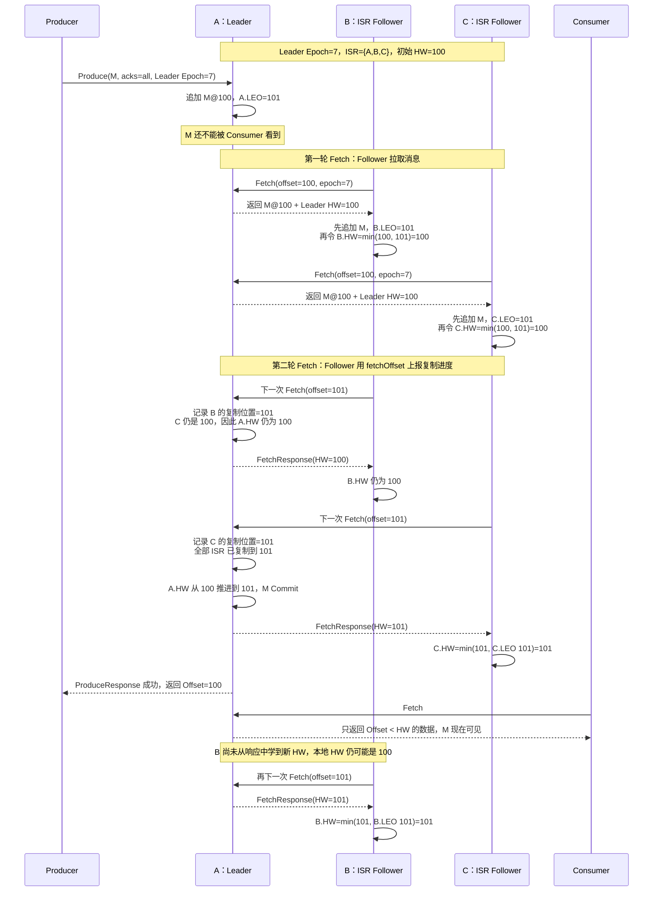
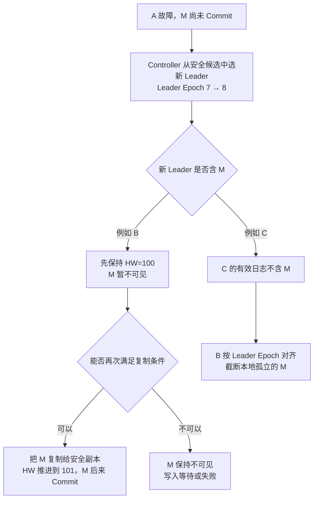
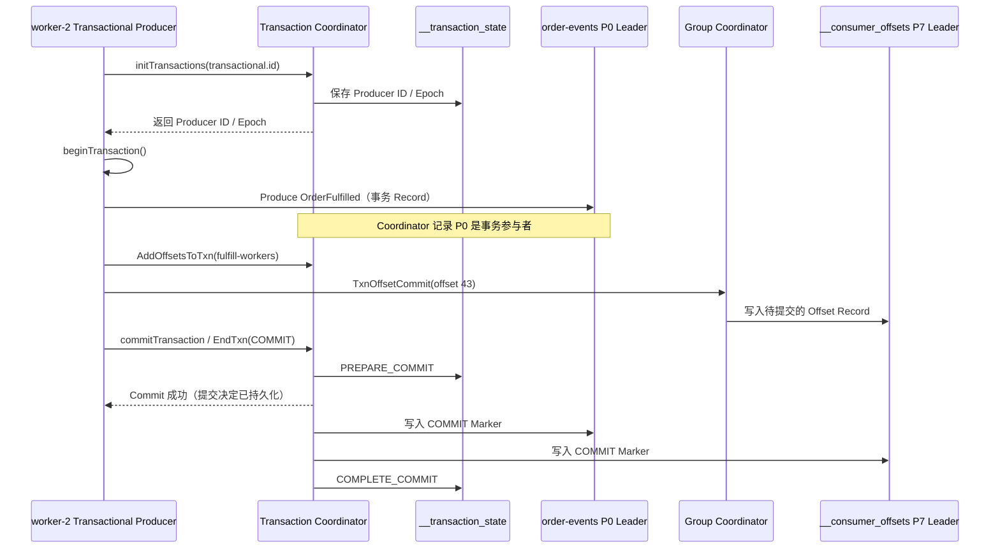

[第一篇](011_kafka.md)已经说明 Topic、Partition、Consumer Group、Offset 和客户端连接路径。本文从 `order-tasks` 的 P1 Leader 收到 `order-1001` 的位置继续，沿着磁盘日志、Follower Fetch、HW、Leader Epoch 和 Consumer Offset 解释提交与恢复。

<!-- more -->

## 1. 从 Topic Partition 到磁盘日志

Kafka 真正的存储单位是 Partition。`order-tasks` 的 P1 在每个副本 Broker 上都有一个日志目录，目录内由多个 Segment 组成：

```text
order-tasks-1/
├── 00000000000000000000.log
├── 00000000000000000000.index
├── 00000000000000000000.timeindex
├── 00000000000001000000.log
├── 00000000000001000000.index
└── 00000000000001000000.timeindex
```

- `.log` 保存按 Offset 排列的 Record Batch；
- `.index` 把相对 Offset 映射到日志文件位置；
- `.timeindex` 支持按时间定位；
- 当前 Segment 达到大小或时间条件后滚动到新 Segment；
- 删除保留和日志压缩以 Segment/Record Key 为基础清理历史。

Topic 本身没有一个合并文件。P0、P1、P2 是三条独立日志，各自拥有 Leader、Follower、Offset、HW 和 Leader Epoch。

### 1.1 控制面与数据面

```text
KRaft Metadata Log：Topic、Partition、副本分配、Leader、ISR/ELR
Partition Log：      业务 Record、Offset、Segment 与索引
__consumer_offsets： Consumer Group 元数据与已提交 Offset
```

Controller 决定谁负责 P1，却不保存 P1 的订单正文；Group Coordinator 保存消费进度，却不参与 P1 的 Record 排序。三条状态链分别复制，不能混成一个“Kafka Raft 日志”。

## 2. Producer 如何确认消息成功

Producer 先选择 Partition，再由 Partition Leader 排序和追加消息。`acks` 定义 Producer 在什么时点把一次写入视为成功：

| 确认方式 | 成功边界 | 核心风险 |
|---|---|---|
| 不等待 | 消息发出后立即继续 | 网络或 Broker 故障时应用甚至不知道消息是否到达 |
| 只等 Leader | Leader 本地接受写入 | 副本尚未同步就切主时，已确认消息可能丢失 |
| 等同步副本 | 当前 ISR 完成确认且满足最低同步副本要求 | 延迟更高；同步副本不足时拒绝写入 |

关键业务通常采用复制因子 3、至少两个同步副本、等待全部当前 ISR，并禁止落后副本直接成为 Leader。这里表达的不是固定参数答案，而是一个原则：只有未来有资格接管的副本已经拥有消息，Leader 才能向客户端确认。

### 2.1 幂等 Producer 解决什么

消息已经提交但响应丢失时，Producer 只能重试。幂等 Producer 使用 Producer ID、Epoch 和序列号识别同一批次的重试，避免因为客户端重试在同一 Partition 写入两份。

它的边界是：

- 主要解决 Producer 到 Kafka 的重复写入；
- 不代表 Consumer 的业务副作用只执行一次；
- 业务跨进程重建、外部系统写入和超出去重作用域时，仍需要稳定事件 ID。

### 2.2 批处理、压缩和背压

Producer 会把同一 Partition 的 Record 合成 Batch，并可以压缩后发送。更大的 Batch 通常提高网络和磁盘效率，但需要等待更多消息，增加低流量下的延迟。

当 Broker 变慢时，Record 会积累在 Producer 内存缓冲区。应用必须限制等待时间和缓冲上限，不能在 Kafka 不可用时无限堆积内存。发送成功的定义还应受总投递超时约束，而不是无限重试。

## 3. 多副本一致性与临界故障

### 3.1 Partition 的唯一历史

每个 Partition 有一个 Leader 和若干 Followers。Leader 决定写入顺序，Follower 按这个顺序复制。理解切主必须先区分四个状态：

| 状态 | 含义 | 解决的问题 |
|---|---|---|
| LEO（Log End Offset） | 某个副本下一条消息将写入的位置 | 这个副本实际复制到了哪里 |
| HW（High Watermark） | 已提交区域的右边界；Offset 小于 HW 的 Record 才是已提交 | Consumer 最多可以安全看到哪里 |
| Leader Epoch | 该 Partition 每一任 Leader 的单调递增任期 | 隔离旧 Leader，并识别切主后的日志分叉 |
| ISR / ELR | Controller 记录的安全 Leader 候选集合 | 哪些副本有资格在故障后接管 |

例如消息 M 的 Offset 是 100：

```text
HW = 100：Offset 100 尚未 Commit
HW = 101：Offset 100 已经 Commit
```

Kafka 不会给每条消息写一个独立的 `committed=true` 标志。是否 Commit 由 HW 这条边界统一表达。

传统模型中，足够接近 Leader 的副本进入 ISR，并参与安全提交和后续选主。Kafka 4.x 还提供 Eligible Leader Replicas（ELR）：在严格 `min.insync.replicas` 规则下，Controller 可以记录部分已经离开 ISR、但仍被证明不会丢失已提交数据的安全候选。ELR 不是允许任意落后副本上位的 Unclean Election。

Kafka 数据复制不是“每个 Partition 一个 Raft 组”。ISR 可以随着副本延迟动态变化；最低同步副本数决定 ISR 缩小时还能不能继续确认写入。

KRaft Controller 保存 Leader、Leader Epoch、ISR/ELR 等元数据，但不保存业务 Record，也不替数据 Partition 计算 HW。业务消息仍由 Partition Leader 与 Followers 复制。

核心取舍是：

- 剩余副本不足时继续写，获得可用性，但增加已确认数据丢失风险；
- 剩余副本不足时停止写，保护已确认历史，但业务暂时不可用。

### 3.2 临界故障场景

假设 P0 有 A、B、C 三个副本：

```text
Leader = A
Leader Epoch = 7
ISR = {A, B, C}
min.insync.replicas = 2
Producer acks = all
写入前 HW = 100
```

Producer 要写入消息 M。M 被分配 Offset 100，写入完成后的 LEO 是 101。

#### 3.2.1 从接收到返回的完整过程



完整过程实际包含三种信息流：

1. **消息向 Follower 传播**：Follower 用 `Fetch(offset=100)` 拉到 M，追加后把自己的 LEO 推进到 101；
2. **复制进度向 Leader 传播**：Follower 下一次发送 `Fetch(offset=101)`，这个请求同时告诉 Leader：“我的日志已经写到 101”；
3. **提交边界向 Follower 传播**：Leader 汇总 ISR 的复制位置并把自己的 HW 推进到 101，再通过当前或后续 `FetchResponse(HW=101)` 把提交边界传回 Follower。

因此，每个副本上都有一个本地 HW，但职责不同：

| 位置 | HW 如何产生 | 作用 |
|---|---|---|
| Leader | 根据当前 ISR 中各副本已知的复制位置推进 | 权威的提交边界，决定何时响应 Producer、向 Consumer 暴露到哪里 |
| Follower | 从 Leader 的 FetchResponse 学到，并限制为不超过自己的 LEO | 保存对提交边界的本地认知，可能暂时落后于 Leader |

Follower 更新本地 HW 的原则可以简化为：

```text
Follower.HW = min(FetchResponse 中的 Leader.HW, Follower 自己的 LEO)
```

取 `min` 是因为 Follower 不能把尚未复制到本地的 Offset 标记为已提交。Follower 也不参与“投票计算 HW”；它只是上报自己的复制位置，并接受 Leader 算出的提交边界。

这里还有两个容易误解的地方。

第一，Follower 不是等待 Leader 主动推送再单独发送 ACK。Follower 主动发 Fetch 请求复制数据；它下一次请求携带的 Fetch Offset，告诉 Leader 自己已经复制到哪里。Leader 据此维护各副本 LEO，并计算 HW。

第二，`acks=all` 的 “all” 是当前全部 ISR，而不是 `min.insync.replicas` 个副本。上例 ISR 有三个成员，即使 `min.insync.replicas=2`，正常情况下也要 A、B、C 都拥有 M 才返回成功。`min.insync.replicas=2` 的作用是：ISR 若缩到一个成员，则拒绝这次 `acks=all` 写入。

从第一性原理看，M 的提交条件是：

```text
当前安全复制集合满足最小副本要求
                    ＋
M 已复制到当前全部 ISR
                    ↓
              HW 推进越过 M
                    ↓
       Producer 可以成功，Consumer 可以看到 M
```

事务消息还多一条可见性边界：`read_committed` Consumer 最多读取到 LSO（Last Stable Offset）。HW 表示复制已提交，LSO 还会挡住尚未结束的事务；这里讨论的 M 是非事务消息。

#### 3.2.2 Leader 切换时如何知道哪条消息已 Commit

答案不是“新 Leader 枚举每条消息的状态”，而是四步：

1. **Controller 选择安全候选**：优先从 ISR 中选择；启用 ELR 时，ISR 为空后还可以按 ELR 规则选择。Unclean Election 关闭时，不会随意选择普通落后副本；
2. **Controller 增加 Leader Epoch**：新 Leader 获得更高任期，旧 Leader 即使暂时存活，也会因 Epoch 过旧而被拒绝写入和复制；
3. **新 Leader 以本地 HW 限制可见性**：刚接管时，不会把 HW 之后的尾部立即暴露给 Consumer；
4. **副本按 Leader Epoch 对齐日志**：Followers 使用 `OffsetsForLeaderEpoch` 找到与新 Leader 的共同历史，截断真正分叉的尾部，再继续复制。新 Leader 收集当前安全副本的 Fetch 进度后，才继续推进 HW。

四个概念各负其责：

| 机制 | 它回答的问题 |
|---|---|
| ISR / ELR | 谁可以安全成为新 Leader |
| Leader Epoch | 哪一任 Leader 的日志历史有效，如何隔离旧主 |
| HW | 哪个 Offset 之前已提交并可见 |
| `acks` + `min.insync.replicas` | 什么时候可以向 Producer 返回成功 |

Follower 本地的 HW 可能暂时落后，因为 Leader 要在后续 FetchResponse 中把新 HW 传播给它。现代 Kafka 不会简单地让恢复副本“把 HW 之后全部删除”，而是用 Leader Epoch 判断真正的分叉点。这避免了一个已经复制并提交的 M，仅因新 Leader 尚未收到最新 HW 就被错误截断。

#### 3.2.3 M 尚未 Commit，A 就故障

假设此时状态是：

```text
              Log End     HW
A Leader       101        100    含 M
B Follower     101        100    含 M
C Follower     100        100    不含 M
```

M 位于 HW 之后，所以还没有对 Consumer 可见，Producer 也没有得到 `acks=all` 成功。A 故障后会出现两个安全分支：



这说明“未收到 ACK”不等于 M 一定被删除。如果含 M 的 B 成为新 Leader，M 可能稍后完成复制并提交；如果不含 M 的 C 成为新 Leader，B 上的 M 会作为分叉尾部被截断。

Producer 无法从超时判断走了哪条分支，只能重试。启用幂等 Producer 后，相同 Producer ID、Epoch 和序列号的重试可以避免在同一 Partition 形成重复 Record；业务跨进程恢复和 Consumer 副作用仍应使用事件 ID 幂等。

#### 3.2.4 M 已 Commit，但成功响应丢失

状态已经变成：

```text
              Log End     Leader 已知的 HW
A Leader       101        101
B Follower     101        100 或 101
C Follower     101        100 或 101
```

A 已确认 B、C 都复制了 M，并把自己的 HW 推进到 101，但 ProduceResponse 在网络中丢失。即使 B、C 本地记录的 HW 还停在 100，它们的日志都已经含有 M。

此时 A 故障：

1. 任一正常的 ISR 安全候选都包含 M；
2. 新 Leader 用新 Leader Epoch 接管，不会仅因本地 HW 传播稍慢就删除 M；
3. 它根据副本 Fetch 进度恢复并推进 HW，M 继续属于有效历史；
4. Producer 仍只看到超时，重试可能重复。

因此 Kafka 能保证的是：在 `acks=all`、满足 `min.insync.replicas`、使用安全 Leader Election，且仍有合格数据副本存活的条件下，已经成功确认的 Record 不会因一次正常 Leader 切换丢失。它不能让 Producer 在响应丢失时知道服务端结果，也不能替业务实现端到端恰好一次。

#### 3.2.5 Unclean Election 为什么会破坏结论

如果 ISR/ELR 都没有可用副本，却允许不安全选主，Controller 可能选择一个缺少最新已提交 Record 的落后副本。系统更快恢复可用，但 HW 可能回退，Consumer 曾经看到的数据也可能从新历史中消失。

所以生产可靠性结论必须同时写出：

- Producer 是否使用 `acks=all`；
- `min.insync.replicas` 是多少；
- 复制因子是多少；
- 是否启用 ELR，以及集群升级后的实际状态；
- 是否禁止 Unclean Leader Election；
- 副本是否跨独立故障域。

只说“Kafka 三副本”仍然无法回答一次成功写入究竟受到了什么保护。

### 3.3 故障范围决定保证范围

三个副本跨三个 Broker，可以容忍部分 Broker 故障；副本全部位于同一机架，则不能抵抗整个机架断电。应使用 Rack Awareness 将同一 Partition 副本分散到不同故障域。

单集群副本仍不能抵抗整个地域损坏。可靠性结论必须写明它针对的是进程、磁盘、节点、可用区还是地域故障。

## 4. Consumer Offset 的故障恢复

第一篇已经说明了 Offset 的提交时点。本节只回答一个实现问题：Coordinator 或 Consumer 故障后，系统依靠什么恢复。

提交后的 Offset 不只存在于 Coordinator 内存中。它会成为 `__consumer_offsets` 中的一条 Record，并像普通 Kafka 数据一样复制。

```text
Key:   fulfill-workers + order-tasks + P1
Value: committed-offset=43 + metadata
```

Offset 43 仍然只表示恢复时从 43 开始。Kafka 不会检查 Offset 42 对应的数据库事务是否成功。

- Consumer 故障触发 Group 重新分配，接管者从已提交 Offset 恢复；
- Coordinator Broker 故障后，`__consumer_offsets` 对应 Partition 选出新 Leader，新 Broker 接管该 Group；
- 只存在于旧 Consumer 内存的 Fetch Position 和处理中 Record 不会被恢复；
- 已复制的 Group Offset 会保留，尚未提交或响应丢失的 Commit 仍是结果未知。

Kafka 事务可以把“消费 Offset + 生产到其他 Kafka Topic”纳入同一 Kafka 事务，并让 `read_committed` Consumer 避开未完成事务。但它不能自动把 MySQL、HTTP 或其他外部副作用纳入同一原子边界。

## 5. Kafka 事务如何实现

幂等 Producer 解决的是“同一个 Partition 内重试不重复”。事务进一步解决：**写入多个 Kafka Partition，并推进一个 Consumer Group 的 Offset，要么一起对消费者可见，要么一起不可见。**

继续使用订单任务示例：`worker-2` 读取 `order-tasks` P1 的 Offset 42，生成 `OrderFulfilled` 事件，并准备把消费位置推进到 43。我们希望下面两项成为一个 Kafka 事务：

```text
写入：order-events P0 -> OrderFulfilled(order-1001)
推进：fulfill-workers / order-tasks P1 -> Offset 43
```

### 5.1 事务涉及哪些状态

先把数据分成四类，再看协议流程：

- **生产者身份**：`transactional.id` 对应的 Producer ID 和 Epoch，用来识别当前实例并隔离旧实例。
- **事务状态**：事务正在进行、准备提交、已经提交或中止，以及涉及哪些 Partition，保存在内部 Topic `__transaction_state`。
- **业务 Record**：仍然写在 `order-events` 等普通 Topic 中，但 Record Batch 带有事务标志、Producer ID、Epoch 和 Sequence。
- **事务性 Offset**：Offset Record 写入 `__consumer_offsets`，但在整个事务提交前不会成为对外可用的消费进度。

`Transaction Coordinator` 是某个 Broker 承担的角色。`transactional.id` 会映射到 `__transaction_state` 的一个 Partition，该 Partition 的 Leader Broker 负责协调这个事务。它不保存业务消息正文，只记录事务身份、状态和参与者。

Transaction Coordinator 与 Group Coordinator 是两个职责。前者决定整个事务 Commit 还是 Abort，后者校验并保存 `fulfill-workers` 的 Offset；它们可能由不同 Broker 承担。

### 5.2 初始化如何隔离旧 Producer

`worker-2` 使用稳定且唯一的：

```text
transactional.id=fulfill-worker-2
```

启动时调用 `initTransactions()`：

1. Producer 找到自己的 Transaction Coordinator。
2. Coordinator 分配或恢复 Producer ID，并给出新的 Epoch。
3. `transactional.id -> Producer ID / Epoch` 的状态写入 `__transaction_state`。
4. 如果上一个同名实例留下未完成事务，Coordinator 先完成恢复或将其 Abort。

旧实例即使恢复并继续发送，也会携带较旧 Epoch。Broker 会拒绝它，这叫 **fencing**。因此 `transactional.id` 不能由两个正常实例共享；它应稳定地对应一个应用分片或处理实例。

Kafka 4.0 之后启用新版事务协议并使用相应客户端时，还会在每个事务推进 Producer Epoch，进一步阻止上一事务的迟到请求混入下一事务。这个增强没有改变下面的核心状态机。

### 5.3 一次消费—转换—生产事务



核心过程分为四步：

1. `beginTransaction()` 在客户端建立事务边界；真正向 Partition 写入后，Coordinator 才需要跟踪事务参与者。
2. 业务 Record 直接写入目标 Partition Leader，并按该 Partition 的普通副本规则提交。
3. `sendOffsetsToTransaction()` 把 Offset 43 作为事务的一部分交给 Group Coordinator，而不是调用普通 Consumer Offset Commit。
4. `commitTransaction()` 让 Transaction Coordinator 持久化不可逆的提交决定。Coordinator 随后向所有参与 Partition 写入 COMMIT Marker，全部完成后再记录 `COMPLETE_COMMIT`。

这里要区分“提交决定已经成功”和“所有 Partition 已经完成可见性更新”。Coordinator 可以在 `PREPARE_COMMIT` 被可靠记录后确认 EndTxn；Marker 的扇出与最终 `COMPLETE_COMMIT` 仍可能在后台继续。即使 Coordinator 此时故障，新 Coordinator 也必须沿已持久化的提交决定继续补齐 Marker，不能改成 Abort。

Kafka 4.x 的新版协议会把部分“将业务 Partition 加入事务”的动作移到服务端完成，但第一性原理不变：Coordinator 必须知道事务涉及哪些 Partition，才能把最终 Marker 写到每一段日志。

### 5.4 COMMIT Marker 为什么必要

事务业务 Record 与普通 Record 一样先写进 Partition Log。Kafka 不会等提交时再把多份数据一起搬入日志，也不会在 Abort 时立即删除它们。

每个参与 Partition 尾部会追加一个控制批次：

```text
事务成功：... Transactional Records ... COMMIT Marker
事务失败：... Transactional Records ... ABORT Marker
```

Marker 是该 Partition 对事务结论的本地证明：

- `read_uncommitted` Consumer 可以读到尚未提交或最终中止的事务 Record；
- 显式配置 `isolation.level=read_committed` 的 Consumer，只返回已经由 COMMIT Marker 证明成功的事务 Record，并过滤 ABORT 的数据；
- `__consumer_offsets` 收到 COMMIT Marker 后，Offset 43 才成为有效恢复位置；收到 ABORT Marker 则忽略这次推进。

因此 HW 和事务可见位置不是同一个概念。HW 表示 Record 已按副本规则提交；一个事务 Record 即使已经低于 HW，只要事务仍未结束，`read_committed` Consumer 就不能把它当作已提交事务返回。

### 5.5 LSO 为什么可能落后于 HW

`read_committed` Consumer 受 **Last Stable Offset，LSO** 限制。只要前面还有未完成事务，Consumer 就不能越过它返回后面的事务结果，否则会破坏日志顺序。

```text
Offset 100：事务 T1 的 Record，尚未结束
Offset 101：普通 Record，已经到达 HW

HW  已超过 101
LSO 仍停在 T1 开始的位置
read_committed 暂时不能返回 100、101
```

这意味着长事务不仅占用 Coordinator 状态，还可能阻塞同一 Partition 上 `read_committed` Consumer 的可见进度。事务范围应小而有界，不能把长时间人工操作包在 Kafka 事务中。

### 5.6 故障发生时如何收敛

- **Producer 在 EndTxn 前故障**：事务超时后，Coordinator 将其 Abort，并向参与 Partition 补写 ABORT Marker。
- **`commitTransaction()` 超时**：客户端看到的是结果未知，不能仅凭超时改为 Abort。客户端可以重试同一个 Commit；如果不再重试，只能关闭 Producer，由 Coordinator 根据持久状态完成收敛。
- **Transaction Coordinator 故障**：`__transaction_state` 对应 Partition 选出新 Leader，新 Coordinator 从复制日志恢复状态并继续未完成流程。
- **参与 Partition Leader 故障**：新 Leader 接管相同 Partition 历史，Coordinator 重试写入 Marker。
- **旧 Producer 恢复**：新的 Epoch 已经隔离旧实例，旧实例不能继续完成或污染新事务。

### 5.7 Exactly Once 的边界

这个机制可以原子覆盖：

- 多个 Kafka Topic/Partition 的生产结果；
- Consume—Transform—Produce 模式中的 Consumer Offset；
- 配置为 `read_committed` 的下游 Kafka Consumer。

它不能自动覆盖：

- MySQL、Redis 等外部数据库事务；
- HTTP、短信、支付等外部调用；
- Consumer 已经执行但没有幂等保护的业务副作用。

所以 Kafka 的 Exactly Once 更准确地说是 **Kafka 日志边界内的原子可见性与去重**。一旦流程跨出 Kafka，仍需要 Outbox、Inbox、幂等键或业务状态机。

## 6. 保留、回放、压缩和分层存储

### 6.1 Delete Retention

日志按时间或容量删除旧 Segment。消费速度不会决定数据是否删除：Consumer 如果落后超过保留期，其尚未读取的数据仍会被清理。

因此 Retention 实际上是一条业务 SLA：系统承诺消费者和故障恢复必须在这段时间内追上。

容量可粗略估算为：

```text
总存储 ≈ 每秒写入字节 × 保留秒数 × 副本数 × 安全余量
```

压缩率、Segment 清理延迟、索引和副本迁移还会增加实际空间。

### 6.2 Log Compaction

Compaction 按 Key 清理旧值，让日志最终保留每个 Key 较新的状态。例如 `customer_id=42` 多次更新地址，压缩后可以用较新的记录重建客户状态。

它不是立即执行的普通去重：

- 相同 Key 的旧记录可能暂时仍存在；
- Key 为空的消息无法按业务 Key 压缩；
- 删除通常通过墓碑记录表达；
- 它适合保存最新状态，不适合要求完整审计历史的 Topic。

### 6.3 Tiered Storage

分层存储把较旧的封闭 Segment 放到对象存储等远端介质，本地磁盘主要保留热数据。它可以降低长保留成本，但历史回放会受到远端存储延迟和实现能力限制。

Kafka 只定义分层存储接口和元数据机制，部署时还要选择并验证具体远端存储实现。当前能力对某些 Topic 策略也存在限制，不能把“支持分层存储”直接等同于低成本无限保留。

## 7. 积压、背压与容量

Kafka 擅长积压，是因为消息本来就在日志中，不需要为每个 Consumer 复制一份正文。但积压仍会消耗磁盘，并增加恢复读取、缓存污染和跨层存储访问。

### 7.1 Consumer Lag

Lag 是日志末尾与 Consumer Group 已提交 Offset 的差值，表示还有多少 Record 未被该 Group 确认推进。但只看条数不够：消息大小不同、处理耗时不同，同样的 Lag 可能对应完全不同的恢复时间。

更实用的指标是：

- 最老未处理事件的时间；
- Lag 增长速度；
- 当前消费速度与生产速度；
- 按当前净消化速度预计多久清空。

### 7.2 Partition 是容量单位

单 Partition 由一个 Leader 排序写入，热点 Key 仍可能打满单 Partition。Partition 太少限制吞吐，太多则增加文件、内存、选主、Rebalance、迁移和恢复成本。

新增 Broker 后，已有 Partition 不会自动均匀搬过去，需要执行 Reassignment。迁移同时消耗源磁盘读、目标磁盘写和网络带宽，必须限速并监控线上延迟。

副本用于容错，Partition 用于分片。把复制因子从 3 增加到 5 不会让单 Partition 写得更快，反而会增加复制成本。

### 7.3 Producer 和 Broker 的过载行为

Broker 变慢时，Producer 的本地缓冲会逐渐填满，最终阻塞或超时。Broker 还可以通过客户端配额限制生产和消费速率，避免单个租户占满网络或磁盘。

容量设计需要同时验证正常峰值、单 Broker 故障、一个可用区故障、消费者停止和副本重建期间的吞吐。只在全员健康时跑 Benchmark，不能证明生产容量安全。

## 8. 实现结论

- Kafka 的业务数据单位是 Partition Log；KRaft 元数据、业务 Record 和 Consumer Offset 分属不同日志。
- `acks=all` 等待当前全部 ISR，`min.insync.replicas` 是允许继续写入的最低门槛，不是等待副本数的简称。
- Leader 根据 Follower 下一轮 Fetch 上报的位置推进 HW，再把 HW 通过 FetchResponse 传播给 Follower。
- 新 Leader 依靠 ISR/ELR、Leader Epoch 和安全历史接管，不逐条查找 `committed=true`。
- 未提交 Record 可能保留也可能被截断；已提交但响应丢失会让 Producer 重试，因此需要幂等 Producer 和业务幂等。
- Consumer Offset 是恢复书签，不是业务事务证明；外部副作用仍按至少一次设计。
- Kafka 事务用 `__transaction_state`、Producer Epoch 和各 Partition 的 COMMIT/ABORT Marker，实现 Kafka 日志范围内的原子可见性。
- 副本数提高容错，Partition 数决定并行度和吞吐扩展边界。

安全、多租户、监控、升级和跨地域灾备见[Kafka 运维与灾备篇](013_kafka_operations.md)。

## 9. 参考资料

- [Apache Kafka 4.3 Documentation](https://kafka.apache.org/43/)
- [Kafka Design](https://kafka.apache.org/43/design/design/)
- [Kafka KRaft](https://kafka.apache.org/43/operations/kraft/)
- [Kafka APIs](https://kafka.apache.org/43/apis/)
- [Kafka Producer Configs](https://kafka.apache.org/43/configuration/producer-configs/)
- [Kafka Consumer and Share Consumer Configs](https://kafka.apache.org/43/configuration/consumer-configs/)
- [Kafka Topic Configs](https://kafka.apache.org/43/configuration/topic-configs/)
- [Kafka Eligible Leader Replicas](https://kafka.apache.org/43/operations/eligible-leader-replicas/)
- [KIP-101：Use Leader Epoch for Replica Log Truncation](https://cwiki.apache.org/confluence/pages/viewpage.action?pageId=177052956)
- [Kafka Consumer Rebalance Protocol](https://kafka.apache.org/43/operations/consumer-rebalance-protocol/)
- [Kafka Transaction Protocol](https://kafka.apache.org/43/operations/transaction-protocol/)
- [KafkaProducer Transaction API](https://kafka.apache.org/43/javadoc/org/apache/kafka/clients/producer/KafkaProducer.html)
- [KIP-98：Exactly Once 与事务协议](https://cwiki.apache.org/confluence/spaces/KAFKA/pages/66854913/KIP-98%2B-%2BExactly%2BOnce%2BDelivery%2Band%2BTransactional%2BMessaging)
- [Kafka Message Format](https://kafka.apache.org/43/implementation/message-format/)
- [Kafka Tiered Storage](https://kafka.apache.org/43/operations/tiered-storage/)
