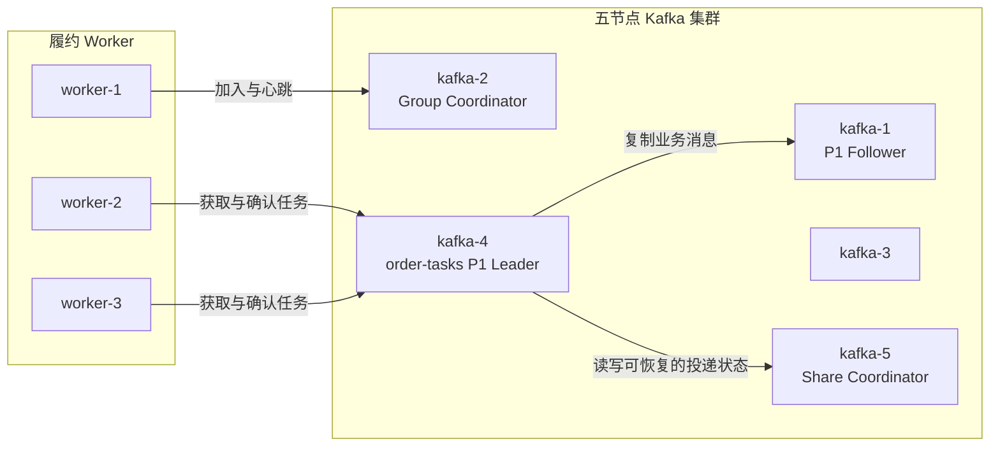
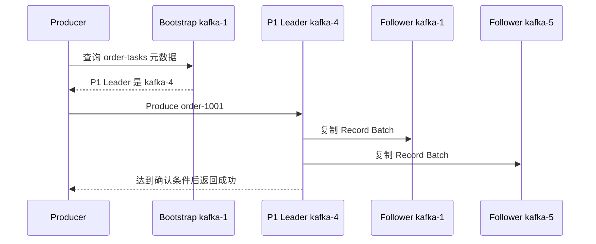
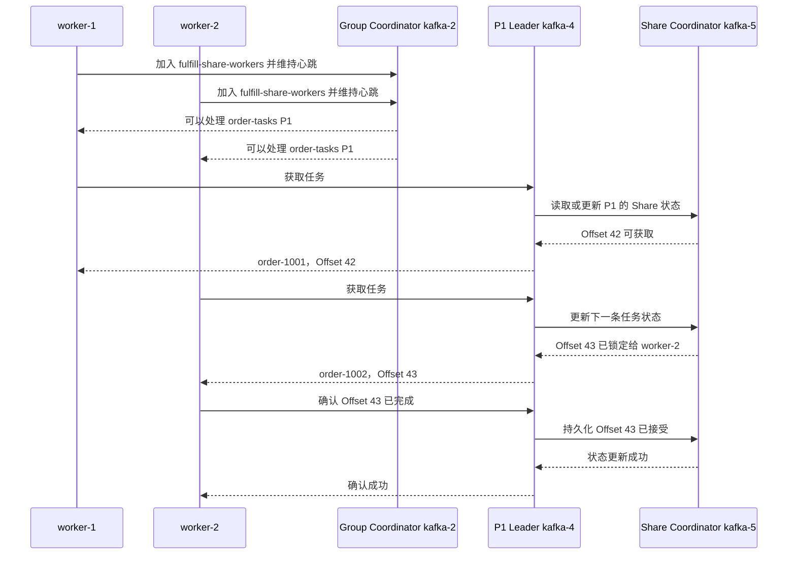

[第一篇](011_kafka.md)已经说明 Kafka 的部署、Topic、Partition 和普通 Consumer Group，[第二篇](012_kafka_implementation.md)说明了日志、副本、事务和故障恢复。本文只回答一个问题：如何使用 Share Group，把 Kafka 的一条有序日志当成可以逐条确认和重新投递的任务队列。

<!-- more -->

## 1. 为什么普通 Consumer Group 不是典型任务队列

普通 Consumer Group 的基本单位是 Partition：同一 Group 内，一个 Partition 同一时刻只交给一个 Consumer。消费进度也是一个连续 Offset，例如提交 43 表示下次从 43 开始读取。

```text
order-tasks P1 → worker-2

已提交 Offset = 43
```

这种模型适合顺序事件流，但有两个任务队列场景不容易表达：

- Topic 只有一个 Partition，却希望三个 Worker 同时处理其中不同任务；
- Offset 42 尚未完成，Offset 43 已经完成，需要分别记录两条任务的状态。

Share Group 改变的是消费模型，不改变 Topic 的生产和存储模型。它允许多个 Share Consumer 共同处理同一个 Partition，并对消息分别确认；代价是任务可以乱序完成，不能再依赖严格的 Partition 消费完成顺序。

## 2. 五节点示例与角色分工

沿用第一篇的五节点 Kafka 集群，创建一个三副本 Topic，并让三个 Worker 加入同一个 Share Group：

```text
Topic:       order-tasks
Partition:   P1
Replicas:    kafka-4 / kafka-1 / kafka-5
Leader:      kafka-4

Share Group: fulfill-share-workers
Consumers:   worker-1 / worker-2 / worker-3
```

为了看清调用路径，假设内部 Topic 的 Leader 分布如下：

```text
__consumer_offsets P7  Leader = kafka-2
__share_group_state P11 Leader = kafka-5
```

因此三类 Broker 角色分别是：

- **Group Coordinator（kafka-2）**：管理有哪些 Worker，以及哪些 Topic Partition 由哪些成员共同处理；
- **业务 Partition Leader（kafka-4）**：读取 `order-tasks P1` 的消息，选择当前可用任务交给 Worker，并接收确认；
- **Share Coordinator（kafka-5）**：持久化 P1 对这个 Share Group 的逐条任务状态，使业务 Leader 切换后仍能恢复。

这些角色都是 Broker 进程内的逻辑职责，不需要额外部署三种服务。同一个 Broker 也可能同时承担多种职责。



## 3. Share Group 需要保存哪些状态

先把数据分成三类，再看它们保存在哪里。

- **业务消息**：订单任务正文及 Offset，保存在 `order-tasks P1` 的 Leader/Follower 日志中；
- **Group 状态**：成员、心跳和 Partition 分配，持久状态写入 `__consumer_offsets`；
- **任务投递状态**：某条消息是否可获取、正在由谁处理、已经确认或不再投递，写入 `__share_group_state`。

Share Group 不能只保存一个连续 Offset。假设当前状态为：

```text
Offset 42 → worker-1 已获取，尚未确认
Offset 43 → worker-2 已确认
Offset 44 → 可获取
```

如果只记录“已经读到 44”，Offset 42 就可能被错误跳过；如果只记录“提交到 42”，Offset 43 又会被无意义地重复执行。因此它需要保存一个 Offset 范围内各条消息的状态。

从语义上可以将状态理解为：

- **可获取**：还可以分配给某个 Worker；
- **已获取**：已经临时锁定给某个 Worker，锁定有期限；
- **已接受**：Worker 确认成功，不再投递；
- **已释放**：本次不处理，重新变为可获取；
- **已拒绝**：不再继续投递，可用于无法处理的任务。

Kafka 在内部会合并连续 Offset 的状态范围，避免永远为每条历史消息保存一个独立对象。理解模型时只需把它看成“可恢复的逐条任务状态”，不必把它等同于普通 Consumer Offset。

## 4. Producer 生产任务的过程没有改变

Share Coordinator 不参与生产路径。Producer 仍按普通 Kafka 流程写入业务 Partition Leader：



Producer 成功只表示任务消息已经按当前 `acks`、ISR 和 `min.insync.replicas` 条件提交，并不表示某个 Worker 已经执行任务。

## 5. Consumer 获取并确认任务的完整过程

下面以 `worker-1` 获取 Offset 42、`worker-2` 获取 Offset 43 为例。两个 Worker 处理的是同一 Partition，但每条消息在一次有效获取期限内只交给其中一个 Worker。



把过程按职责归纳为：

1. Worker 先通过 Group Coordinator 加入 Share Group，并持续发送心跳；
2. Worker 直接向业务 Partition Leader 获取消息，Group Coordinator 不转发消息；
3. 业务 Leader 根据 Share 状态选择可获取的 Offset，并为本次处理建立有期限的获取状态；
4. Worker 执行业务后，把接受、释放或拒绝结果发回业务 Leader；
5. 业务 Leader 通过 Share Coordinator 持久化状态，然后返回确认结果。

消息正文与任务状态是两份不同数据：正文仍在业务 Topic 中，`__share_group_state` 只记录这个 Share Group 如何处理这些 Offset。

## 6. Worker 故障后如何重新投递

假设 `worker-1` 已经获取 Offset 42，但在确认前断开：

```text
Offset 42 → 已获取，获取期限未到：暂不交给其他 Worker
Offset 42 → 获取期限到期：重新变为可获取
Offset 42 → 随后可交给 worker-3
```

这里使用超时而不是立即认定失败，是因为 Broker 无法判断 Worker 是真的崩溃，还是只发生了网络中断。若 `worker-1` 实际已经完成外部数据库更新、但确认没有到达 Kafka，Offset 42 仍可能再次交给 `worker-3`。

所以 Share Group 提供的是任务获取和重新投递机制，不会让外部业务天然做到 Exactly Once。订单履约仍需使用 `order_id` 或任务 ID 做幂等约束。

## 7. 三类角色故障时分别发生什么

### 7.1 Group Coordinator 故障

Controller 为对应的 `__consumer_offsets` Partition 选择新 Leader。Worker 重新查找 Group Coordinator、恢复心跳和成员关系；恢复期间组协调会短暂停顿，但业务消息没有搬迁。

### 7.2 业务 Partition Leader 故障

Controller 从 ISR 中选择 `order-tasks P1` 的新 Leader。Worker 刷新元数据后向新 Leader 获取任务；新 Leader 再从 Share Coordinator 恢复该 Share Group 的任务状态，然后继续投递。

正在处理但未能可靠确认的任务可能重新投递，因此业务幂等仍然必要。

### 7.3 Share Coordinator 故障

Controller 为对应的 `__share_group_state` Partition 选择新 Leader。新的 Share Coordinator 加载已复制的任务状态；业务 Partition Leader 在此期间重试状态请求。已经持久化的状态可以恢复，结果未知的确认仍按可重复处理设计。

三类故障恢复的共同原理是：角色可以换 Broker，但可恢复状态位于有副本的 Kafka 内部 Topic 中。

## 8. 语义边界与选型

Share Group 适合：

- 每条消息代表相互独立的任务；
- 希望 Worker 数量可以超过 Partition 数量；
- 需要逐条确认、超时重新投递和失败重试；
- 可以接受至少一次处理，并能在业务侧幂等。

普通 Consumer Group 更适合：

- 必须保持 Partition 内处理顺序；
- 使用连续 Offset 回放事件；
- 流处理依赖稳定的 Partition 分配与顺序状态。

最核心的取舍是：**普通 Consumer Group 用 Partition 所有权换取顺序；Share Group 用逐条任务状态换取更高的 Worker 并行度。** 它让 Kafka 更接近任务队列，但不会自动提供 AMQP 路由、单条消息优先级或外部事务 Exactly Once。

## 9. 参考资料

- [KIP-932：Queues for Kafka](https://cwiki.apache.org/confluence/display/KAFKA/KIP-932%3A+Queues+for+Kafka)
- [KafkaShareConsumer API](https://kafka.apache.org/43/javadoc/org/apache/kafka/clients/consumer/KafkaShareConsumer.html)
- [Kafka Protocol：FindCoordinator 与 Share Group API](https://kafka.apache.org/43/design/protocol/)
