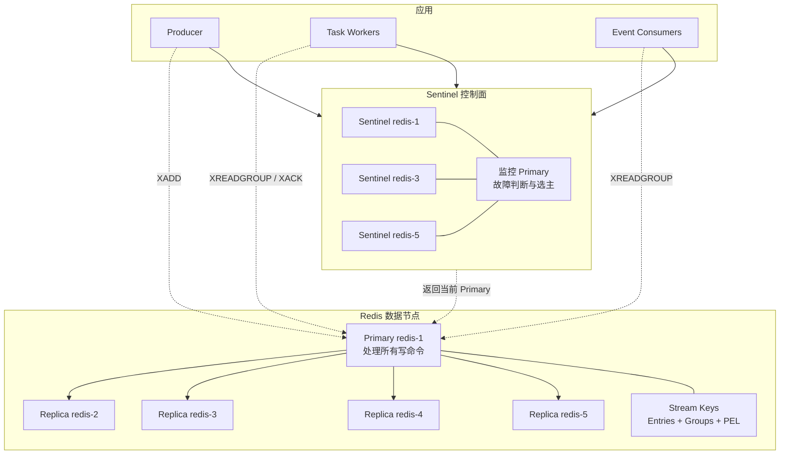
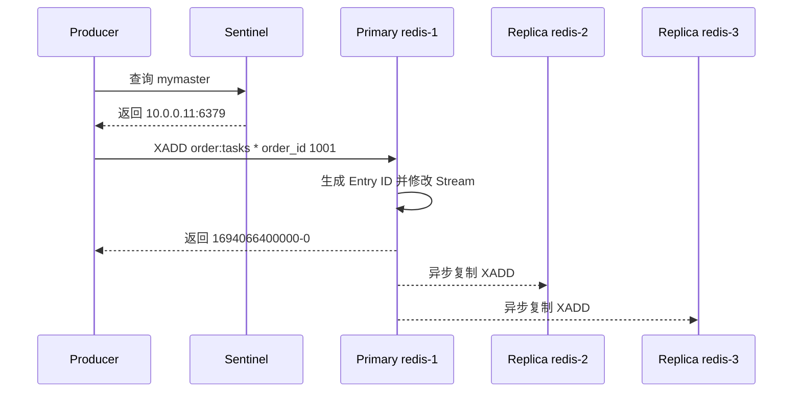
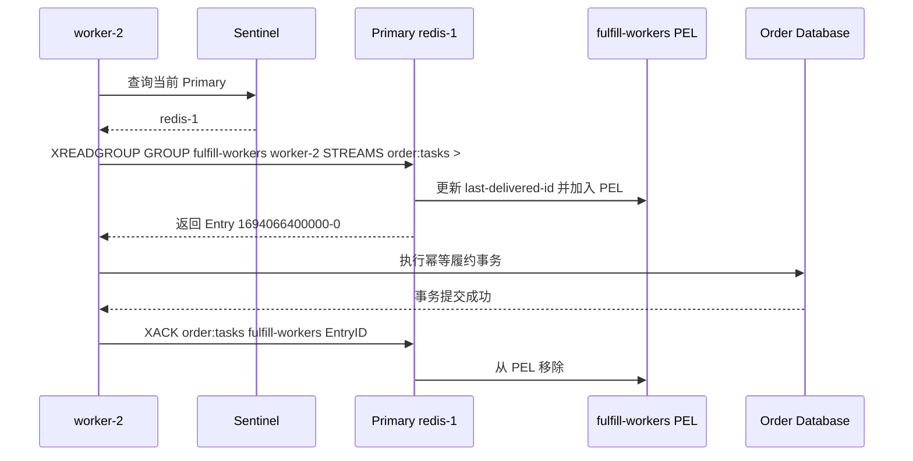

Redis Streams 是 Redis 数据类型，不是独立消息 Broker。它把消息追加到一个按 ID 排序的 Stream Key，并用 Consumer Group、Consumer 和 PEL 保存任务分工与待确认状态。

本文用一个五节点 Redis Sentinel 部署和两个订单示例说明客户端最终连接谁、Group 保存哪些状态，以及 XACK 为什么不等于删除消息。异步复制、WAIT、主从切换和旧主恢复见[实现篇](014_redis_streams_implementation.md)。

<!-- more -->

## 1. 五节点生产部署

为了清楚说明单个 Stream Key 的高可用，本例使用一个 Primary 和四个 Replica；Sentinel 进程分散在三个节点：

| 节点 | IP | 部署角色 |
|---|---|---|
| `redis-1` | `10.0.0.11` | Redis Primary + Sentinel 1 |
| `redis-2` | `10.0.0.12` | Redis Replica 1 |
| `redis-3` | `10.0.0.13` | Redis Replica 2 + Sentinel 2 |
| `redis-4` | `10.0.0.14` | Redis Replica 3 |
| `redis-5` | `10.0.0.15` | Redis Replica 4 + Sentinel 3 |

这是一套单分片 HA 部署，用于说明一个 Stream Key 的真实路径。四个 Replica 不会提高该 Key 的写吞吐；如果使用 Redis Cluster 做分片，每个 Stream Key 仍只属于一个 Hash Slot 和一个 Primary。

### 1.1 完整生产架构



- **Sentinel** 监控节点、判断故障并选择新 Primary，不保存 Stream 消息，也不代理 XADD/XREADGROUP。
- **Primary** 处理 Stream 写入和 Consumer Group 状态变化。
- **Replica** 异步复制 Primary 数据，主要用于故障接管和只读场景；正常情况下不能处理 Group 写命令。
- **客户端**先从 Sentinel 查询当前 Primary，随后直接连接 Primary。

### 1.2 Redis Streams 保存的四类数据

- **Stream Entry**
  - 解决的问题：Stream Key 中按什么顺序保存了哪些字段。
  - 保存内容：Entry ID 与字段值，例如 `1694066400000-0 → order_id=1001`。
  - 保存组件：作为 Redis Dataset 的一部分存在于 Primary 内存，并由 RDB/AOF 提供本地持久化。

- **Consumer Group 进度**
  - 解决的问题：一套 Group 新消息已经分发到哪里。
  - 保存内容：Group 名、`last-delivered-id`、Consumer 列表等。
  - 保存组件：它是 Stream Key 内部状态，与 Stream 一起持久化和复制。

- **PEL 待确认状态**
  - 解决的问题：哪些消息已经交给某个 Consumer，但尚未 XACK。
  - 保存内容：Entry ID、Consumer、投递时间和投递次数；Group 有总 PEL，每个 Consumer 有自己的视图。
  - 保存组件：同样属于 Stream Key 的数据，由 Primary 修改并复制。

- **Sentinel 与连接状态**
  - 解决的问题：谁是当前 Primary，客户端连到哪里。
  - 保存组件：Sentinel 维护监控、Epoch 和投票状态；客户端连接与正在执行的业务只存在于进程内。
  - 边界：Sentinel 不知道某个订单是否完成，也不会保存 PEL。

Stream Entry、Group 和 PEL 都在同一个 Redis Key 所属的数据集里，采用相同的 RDB/AOF 和主从复制链路，而不是三个独立服务。

## 2. 示例一：订单履约任务

创建：

```text
Stream Key: order:tasks
Group:      fulfill-workers
Consumers:  worker-1 / worker-2 / worker-3
```

初始化命令：

```bash
XGROUP CREATE order:tasks fulfill-workers 0 MKSTREAM
```

`0` 表示 Group 可以从现有历史开头消费；如果只关心创建后的新消息，可以使用 `$`。

### 2.1 初始化后各组件保存什么

- `order:tasks` 是真正保存 Entry 的 Stream Key。
- `fulfill-workers` 是该 Key 内的一份 Group 状态，包含自己的分发位置和 PEL。
- `worker-1` 等 Consumer 名称在首次消费时出现，用来标识 Pending 消息当前归谁。
- 初始化时 PEL 为空，因为还没有消息被投递。
- Sentinel 只知道 `mymaster → redis-1`，不知道 Stream、Group 或 Consumer 的业务含义。

Stream Key 是日志容器，Group 是一份共享进度，Consumer 是 Group 内的处理者，PEL 是已经派发但尚未确认的集合。

### 2.2 Producer 生产消息的完整过程



1. Producer 通过 Sentinel 客户端查询当前 Primary，然后直连 `redis-1`。
2. `XADD ... *` 让 Primary 生成递增 Entry ID 并把字段追加到 `order:tasks`。
3. Primary 执行命令后立即返回 Entry ID。
4. 复制命令异步发送给 Replica；Sentinel 不参与这条消息的数据路径。

默认成功响应证明 Primary 已执行写入，但不天然证明某个 Replica 已收到或刷盘。`WAIT` 只能增加等待副本确认的约束，不能把 Redis 变成强一致共识日志。

### 2.3 Consumer 有哪些状态

- **Group 共享位置**：`fulfill-workers.last-delivered-id`，表示新消息分发到哪里。
- **Consumer 身份**：`worker-2`、最后活跃时间以及归属于它的 Pending Entry。
- **Group PEL**：所有已经投递但没有 XACK 的 Entry。
- **Pending 明细**：Entry ID、当前 Consumer、空闲时间和投递次数，供 XPENDING/XAUTOCLAIM 判断。
- **客户端处理状态**：Worker 已收到、数据库是否提交，只存在于 Worker 进程和业务数据库。

PEL 不是另一份消息正文。Entry 仍在 Stream 中，PEL 只保存“这条 Entry 当前正在由谁处理”的状态。

### 2.4 Consumer 消费消息的完整过程



1. 三个 Worker 通过 Sentinel 找到并直连当前 Primary。
2. `XREADGROUP ... >` 读取从未交给该 Group 的新消息。
3. Primary 选择下一条 Entry，推进 Group 分发位置，并把 Entry 加入 `worker-2` 的 PEL。
4. Worker 完成数据库事务后执行 XACK。
5. XACK 只把 Entry 从该 Group 的 PEL 删除，不会从 Stream Key 删除消息正文。
6. Worker 失联后，其他 Worker 可以用 XAUTOCLAIM 接管空闲过久的 Pending Entry。
7. 业务成功但 XACK 丢失会导致重复处理，因此仍需业务幂等。

## 3. 示例二：订单事件流

使用 Stream Key `orders:events`，仓储、通知和分析分别创建 Group：

```text
warehouse    → 独立 last-delivered-id 与 PEL
notification → 独立 last-delivered-id 与 PEL
analytics    → 独立 last-delivered-id 与 PEL
```

Producer 只 XADD 一次。三个 Group 都能读取同一 Entry；仓储的 XACK 只修改 warehouse 的 PEL，不影响其他 Group。

消息删除由 XDEL、XTRIM、MAXLEN 或 MINID 等规则决定。若裁剪掉仍被某个 Group 引用的 Entry，PEL 与正文之间可能只剩引用关系，因此保留策略必须覆盖最慢 Consumer 的恢复需求。

一个 Stream Key 内按 Entry ID 有序，但一个 Key 只由一个 Primary 处理。Redis Streams 没有自动 Topic Partition；需要并行分片时，应用必须设计多个 Key，并处理跨 Key 无全局顺序的问题。

## 4. 从两个示例归纳语义边界

- Stream Key 是追加序列；Consumer Group 是该 Key 上的一份共享分发进度。
- Group 内多个 Consumer 竞争消息；多个 Group 各自读取一份。
- PEL 表示已投递未确认，XACK 清除 PEL，不删除 Stream Entry。
- Sentinel 只负责发现和故障切换，不保存消息，也不代理命令。
- 单个 Stream Key 的全部写入与 Group 状态变化都经过当前 Primary。
- XADD 成功、Replica 收到、Worker 收到、业务成功和 XACK 成功是不同时间点。

Redis Streams 适合系统已经依赖 Redis、规模可控的任务和事件场景。若需要天然分区、强持久确认、超长历史或成熟流处理生态，应评估专用消息系统。

## 5. 客户端连接路径总结

```text
Producer / Consumer → Sentinel 查询当前 Primary
                    → 直接连接 Stream Key 所在 Primary
                    → Primary 异步复制给 Replica
```

Sentinel 与 Replica 都不是正常写命令终点。Redis Cluster 模式下，客户端先根据 Slot 找到该 Key 的 Primary，核心结论相同。

## 6. 下一篇解决的实现问题

以下内容见[Redis Streams 实现篇](014_redis_streams_implementation.md)：

- RDB、AOF 和异步复制分别保证什么；
- `WAIT` 能缩小什么窗口，不能保证什么；
- Primary 返回后宕机时新 Primary 是否一定拥有消息；
- 旧 Primary 恢复后如何与新历史对齐；
- 多 Key 分片与 Resharding 的影响。

## 7. 参考资料

- [Redis Streams 数据类型](https://redis.io/docs/latest/develop/data-types/streams/)
- [Redis XREADGROUP](https://redis.io/docs/latest/commands/xreadgroup/)
- [Redis XAUTOCLAIM](https://redis.io/docs/latest/commands/xautoclaim/)
- [Redis Replication](https://redis.io/docs/latest/operate/oss_and_stack/management/replication/)
- [Redis Sentinel](https://redis.io/docs/latest/operate/oss_and_stack/management/sentinel/)
