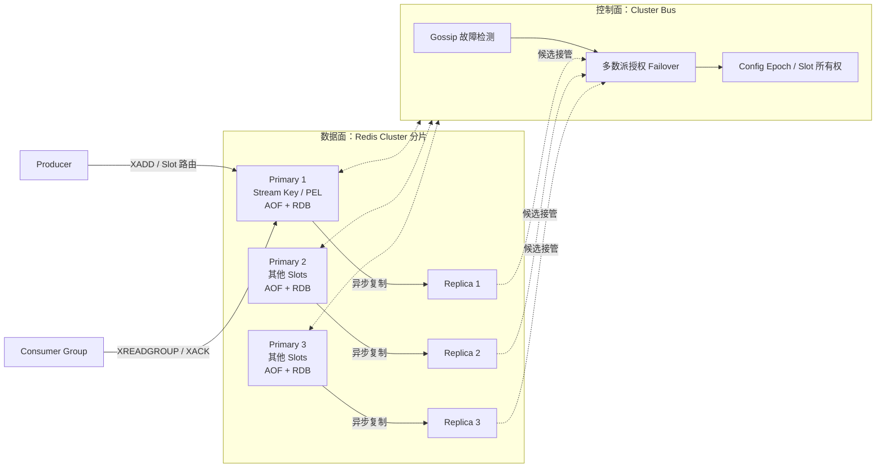

Redis Stream 是 Redis Key 对应的追加日志，不是独立的分布式消息集群。它复用 Redis 的持久化、复制、Sentinel 和 Cluster，因此队列可靠性完全受 Redis 高可用语义约束。

<!-- more -->

## 1. 完整架构



Redis Streams 常见部署有两种：单 Master 配合 Replica 和 Sentinel，或由 Redis Cluster 将不同 Stream Key 分布到不同 Slots。图中展示的是分片形态。

下面以向 Stream Key **orders** 写入 order-42 为例。

### 生产消息的过程

1. Producer 对 orders Key 计算 Cluster Slot，找到负责该 Slot 的 Primary 1。
2. Producer 执行 XADD，Primary 把新 Entry 追加到 orders Stream。
3. 本机持久性由 AOF/RDB 配置决定，Primary 再异步复制给 Replica。
4. Primary 执行成功后向 Producer 返回消息 ID。

这个成功默认不是多数副本提交；主从切换时是否保留该消息取决于复制进度。

### 消费消息的过程

1. **inventory-group** 使用 XREADGROUP 读取新 Entry。
2. Redis 把该消息记录到这个 Consumer Group 的 PEL，表示已经交付但尚未确认。
3. Consumer 完成库存事务后执行 XACK。
4. XACK 从 PEL 中移除待确认状态，但不会立即删除 Stream 中的 Entry。

PEL、消息保留和主从复制是三类不同状态，后文分别解释。

AOF/RDB 决定本机重启后还剩什么，Replica 决定主节点故障后由谁接管，Cluster Bus 决定谁有权接管。三者职责不同，而且都不会把异步复制变成每条写入的多数派共识。

## 2. 如何分区并保证顺序

Redis Cluster 把 Key 映射到 16384 个 Hash Slot，但一个 Stream Key 整体只位于一个 Master，不会在内部切成多个 Partition。要并行分片，应用必须创建多个 Stream Key：

```text
orders:{0}
orders:{1}
orders:{2}
```

Producer 用业务 Key 计算目标 Stream。每个 Stream 的 Entry ID 单调递增，`XRANGE/XREAD` 按 ID 顺序读取，但多个 Stream 之间没有全局顺序。

Consumer Group 用一个 `last-delivered-id` 分发新消息，并为每个消费者维护 PEL。多个 Consumer 会并发处理不同 Entry，因此只能保证分发位置推进，不能保证业务完成顺序。严格顺序需要单 Consumer 串行处理和 Ack；故障后用 `XAUTOCLAIM` 接管未确认消息，并接受至少一次带来的重复。

不要用 Hash Tag 把所有 Stream 都固定到同一 Slot，否则虽然方便多 Key 原子操作，却失去了分片能力。

## 5. 适用边界

Redis Streams 适合已有 Redis、消息量中小、保留期短、允许少量数据风险并能实现幂等的系统。关键事件总线、长积压或需要独立扩展分区时，专用消息队列通常更稳妥。

## 6. 参考资料

- [Redis Streams](https://redis.io/docs/latest/develop/data-types/streams/)
- [Redis Replication](https://redis.io/docs/latest/operate/oss_and_stack/management/replication/)
- [Redis WAIT](https://redis.io/docs/latest/commands/wait/)
- [Redis WAITAOF](https://redis.io/docs/latest/commands/waitaof/)
- [Scale with Redis Cluster](https://redis.io/docs/latest/operate/oss_and_stack/management/scaling/)
- [Redis Cluster Specification](https://redis.io/docs/latest/operate/oss_and_stack/reference/cluster-spec/)
- [Redis Sentinel](https://redis.io/docs/latest/operate/oss_and_stack/management/sentinel/)
