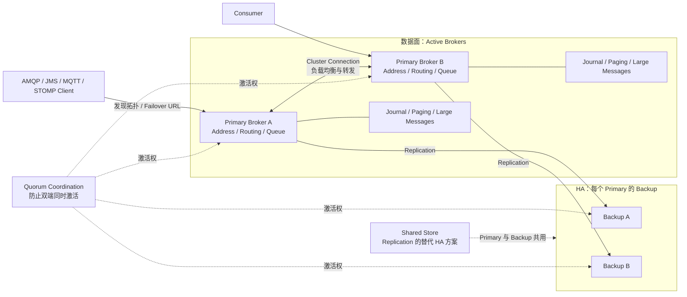

ActiveMQ Artemis 是面向 JMS 与多协议企业集成的消息 Broker。它需要把“Cluster 横向路由”和“HA 数据备份”分开理解：Cluster Connection 不会自动让每条消息拥有副本，高可用来自每个 Live Server 对应的 Backup Server。

<!-- more -->

## 1. 完整架构

下面以订单事件从 Address **orders** 路由到 Queue **inventory.q** 为例。

### 生产消息的过程

1. Producer 通过 AMQP 或 JMS 连接一个 Active Broker。
2. Broker 根据 Address 和 Routing Type 把消息路由到 inventory.q。
3. Broker 把消息写入 Journal；消息过多时可能进入 Paging，大消息使用独立存储。
4. 使用 Replication HA 时，Primary 按配置同步给 Backup 后向 Producer 确认。

Cluster Connection 负责 Broker 之间的路由与负载分布；Backup 负责某个 Primary 故障后的接管，两者不是同一件事。

### 消费消息的过程

1. inventory.q 把消息投递给一个 Consumer。
2. Consumer 完成库存事务后发送 ACK。
3. Broker 记录确认并结束这条 Queue 消息的待处理状态。
4. Consumer 故障或未 ACK 时，消息可以重新投递；超过策略限制后可以进入死信地址。

Producer 确认和 Consumer ACK 是两次独立的责任转移，后文再解释持久化与 HA 边界。

生产部署通常由多个 Primary-Backup 对组成集群。Cluster Connection 负责横向路由，Backup 负责单个 Broker 的状态接管，Quorum Coordination 负责防止脑裂；部署了 Cluster 并不等于消息已经拥有 HA 副本。

## 2. 分区与顺序

Artemis 没有 Kafka 式 Partition。横向分片通常通过多个 Queue、地址路由、集群负载均衡或 Federation 完成。消息在一个 Queue 内按入队顺序投递，但优先级、多个 Consumer、事务回滚和重新投递会改变完成顺序。

需要按业务 Key 保序时使用 Message Group：JMS 设置 `JMSXGroupID`，Core API 设置 `_AMQ_GROUP_ID`。同组消息固定给同一个 Consumer，Consumer 故障后再转交其他 Consumer。

Message Group 的顺序与横向扩展天然冲突。Clustered Grouping 需要集群级 Grouping Handler 协调，而且官方不推荐把它作为大规模扩展方案。更稳妥的方式是预先按业务 Key 路由到固定 Queue，再在单 Queue 内分组或串行消费。

## 5. 适用边界

Artemis 适合依赖 JMS、AMQP、MQTT、STOMP、事务与传统企业集成的系统。若核心需求是海量分区日志、长期回放和流计算生态，应优先比较 Kafka 或 Pulsar。

## 6. 参考资料

- [ActiveMQ Artemis Documentation](https://activemq.apache.org/components/artemis/documentation/latest/)
- [ActiveMQ Artemis High Availability and Failover](https://activemq.apache.org/components/artemis/documentation/latest/ha.html)
- [ActiveMQ Artemis Guarantees of Sends and Commits](https://activemq.apache.org/components/artemis/documentation/latest/send-guarantees.html)
- [ActiveMQ Artemis Duplicate Detection](https://activemq.apache.org/components/artemis/documentation/latest/duplicate-detection.html)
- [ActiveMQ Artemis Message Grouping](https://activemq.apache.org/components/artemis/documentation/latest/message-grouping.html)
- [ActiveMQ Artemis Clusters](https://activemq.apache.org/components/artemis/documentation/latest/clusters.html)
- [Artemis ReplicationManager Source](https://github.com/apache/artemis/blob/main/artemis-server/src/main/java/org/apache/activemq/artemis/core/replication/ReplicationManager.java)
