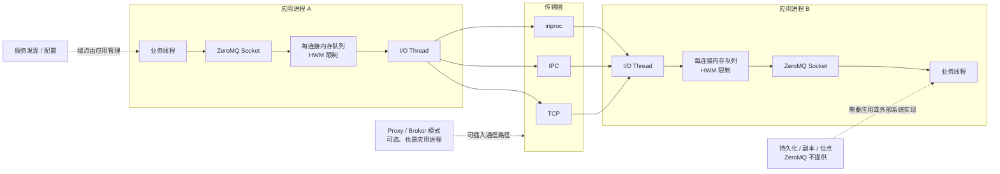

ZeroMQ 名字中有 MQ，但它不是一套可部署的持久消息队列服务。它是嵌入应用进程的通信库，用 Socket Pattern、自动重连和内存队列简化并发与网络通信。

<!-- more -->

## 1. 完整架构

下面以进程 A 向进程 B 发送 order-42 为例。ZeroMQ 没有独立 Broker，所以“生产”和“消费”都发生在应用进程内。

### 生产消息的过程

1. 进程 A 的业务线程把消息交给 ZeroMQ Socket。
2. Socket 把消息放入对应连接的内存队列；HWM 限制队列最多积压多少。
3. I/O Thread 通过 TCP、IPC 或 inproc 把消息发送给进程 B。
4. send 调用成功通常只代表 ZeroMQ 接受了消息，不代表进程 B 已完成业务，更不代表消息已经持久化。

服务发现、端点选择以及断线后的处理策略都由应用负责。

### 消费消息的过程

1. 进程 B 的 I/O Thread 收到数据并放入本地内存队列。
2. ZeroMQ Socket 把消息交给业务线程。
3. 业务线程处理 order-42。
4. 如果需要业务 ACK、重试、去重、持久化或消费位点，应用必须自己设计协议，或使用外部系统。

因此 ZeroMQ 提供的是高效通信，不提供传统消息队列的持久消费完成语义。

图中的核心事实是：没有独立 ZeroMQ Broker、元数据集群、持久存储或副本组。Socket、I/O 线程和消息缓冲都在应用进程里；Proxy 也只是开发者用 ZeroMQ 编写的普通进程。

因此它减少了基础设施层级，也把服务发现、消息协议、故障检测、持久化和恢复责任交给了应用。

## 2. 通信模式与顺序

ZeroMQ 用 Socket 类型表达通信模式：`REQ/REP` 负责请求响应，`PUB/SUB` 负责广播，`PUSH/PULL` 负责流水线，`ROUTER/DEALER` 用于异步路由和自定义 Broker。

顺序只在具体连接和 Socket Pattern 的规则内成立。多个发送者、多个接收者或多条连接汇合后，不存在全局顺序。若业务要求同一 Key 有序，应用必须固定路由、限制并发，或在消息中携带序列号。

ZeroMQ 的高水位线 HWM 控制内存队列长度。消费者跟不上时，不同 Socket 类型可能阻塞发送或丢弃消息。低延迟来自内存和异步 I/O，也意味着积压不能被当成可靠磁盘存储。

## 5. 适用边界

ZeroMQ 适合同机线程、进程间和受控局域网中的低延迟通信，也适合允许丢弃旧数据的实时流，以及愿意自行维护通信协议的定制拓扑。

它不适合直接替代持久消息队列：消费者离线期间必须保留消息、已确认消息必须跨节点保存，或者需要消费位点、回放、死信和自动副本修复时，应选择承担这些职责的消息系统。

ZeroMQ 的核心优势是少一层 Broker 和极强的拓扑自由；核心局限也是同一件事：平台没有承担的责任，都会回到应用团队。

## 6. 参考资料

- [ZeroMQ Guide：Sockets and Patterns](https://zguide.zeromq.org/docs/chapter2/)
- [ZeroMQ Guide：Reliable Request-Reply Patterns](https://zguide.zeromq.org/docs/chapter4/)
- [ZeroMQ Guide：Advanced Pub-Sub Patterns](https://zguide.zeromq.org/docs/chapter5/)
- [ZeroMQ RFC 18：Majordomo Protocol](https://rfc.zeromq.org/spec/18/)
