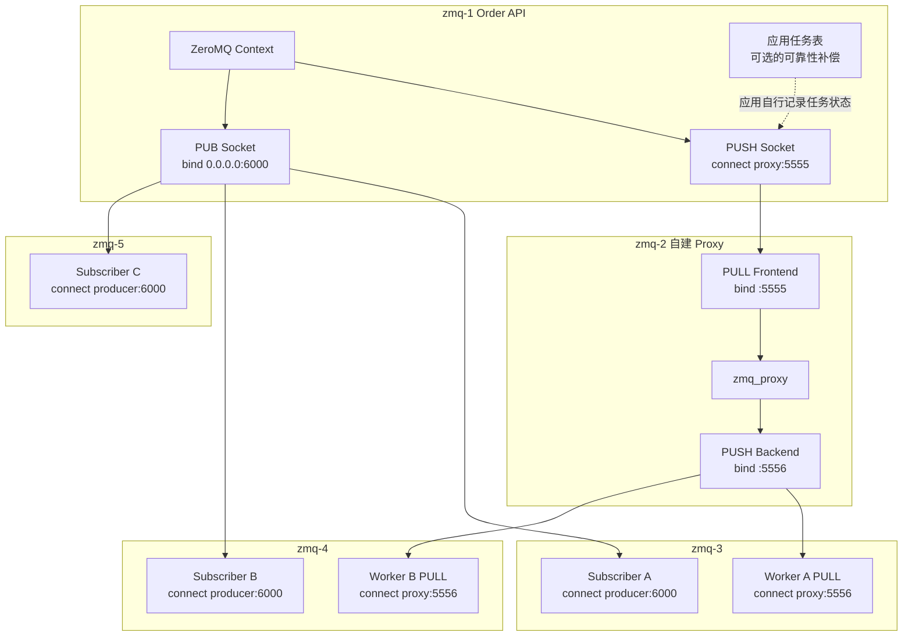
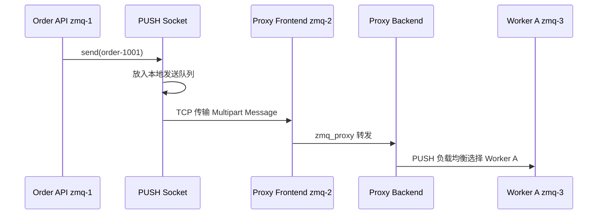
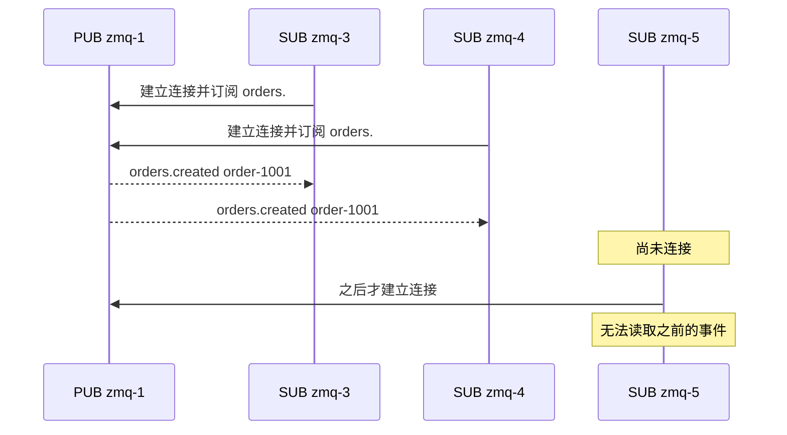

ZeroMQ 是嵌入应用进程的异步通信库，不是部署后便提供持久化、复制、选主和消费进度的消息 Broker。它提供 Socket Pattern 和内存消息队列；可靠任务、历史回放和故障恢复必须由应用或外部组件补齐。

因此，ZeroMQ 的“五节点架构”不是五个 Broker 组成集群，而是五个应用进程通过 ZeroMQ Socket 建立通信拓扑。

<!-- more -->

## 1. 五节点应用部署

| 节点 | IP | 应用角色 |
|---|---|---|
| `zmq-1` | `10.0.0.11` | Order API / Producer |
| `zmq-2` | `10.0.0.12` | 应用自建 ZeroMQ Proxy |
| `zmq-3` | `10.0.0.13` | Worker A / Subscriber A |
| `zmq-4` | `10.0.0.14` | Worker B / Subscriber B |
| `zmq-5` | `10.0.0.15` | Subscriber C / 监控服务 |

每个节点只需要链接 ZeroMQ 库。`zmq-2` 上的 Proxy 也是业务团队部署的普通应用进程，不会自动得到多副本、磁盘日志和故障转移。

### 1.1 完整应用架构



图中有两个独立 Pattern：

- `PUSH → PULL → PUSH → PULL` 是 Pipeline，用于把任务分摊给 Worker。
- `PUB → SUB` 是发布订阅，用于把实时事件发给当前在线订阅者。

Socket Pattern 规定哪些 Socket 可以通信以及消息如何分发，不提供 Broker 式持久语义。

### 1.2 ZeroMQ 实际保存哪些数据

- **端点与拓扑配置**
  - 解决的问题：哪个进程 bind，其他进程应该 connect 哪个地址。
  - 保存位置：应用配置、配置中心或服务发现系统。
  - ZeroMQ 不提供一个集群 Metadata Store，也没有 Raft/ZAB 等元数据一致性协议。

- **Socket 连接与路由状态**
  - 解决的问题：当前有哪些 Peer、连接是否建立、ROUTER Identity 如何映射。
  - 保存位置：各进程的 ZeroMQ Context、Socket 和 I/O Thread 内存。
  - 生命周期：进程退出后消失，不会由其他节点接管。

- **内存消息队列**
  - 解决的问题：应用线程和网络速度不一致时暂存待发送或待接收消息。
  - 保存位置：每个 Socket 的本地内存队列。
  - 容量边界：由 HWM 等参数限制；达到上限后是阻塞还是丢弃取决于 Socket 类型和发送选项。

- **业务可靠性状态**
  - 解决的问题：任务是否持久保存、由谁处理、是否完成、何时重试。
  - 保存位置：ZeroMQ 默认不保存。应用必须自己使用数据库、WAL、任务 ID、Ack 协议和超时扫描实现。
  - 一致性机制：完全取决于应用设计，不能称为 ZeroMQ 多副本协议。

## 2. 示例一：订单履约任务

拓扑为：

```text
zmq-1 PUSH
    → tcp://10.0.0.12:5555
zmq-2 PULL → zmq_proxy → PUSH
    → zmq-3 / zmq-4 PULL
```

初始化不是“创建 Queue”，而是创建 Context/Socket 并确定 bind/connect：

1. `zmq-2` 的 Frontend PULL bind `tcp://0.0.0.0:5555`。
2. `zmq-2` 的 Backend PUSH bind `tcp://0.0.0.0:5556`。
3. `zmq-2` 启动 `zmq_proxy(frontend, backend)`。
4. `zmq-1` 的 PUSH connect `10.0.0.12:5555`。
5. `zmq-3/4` 的 PULL connect `10.0.0.12:5556`。

这里的 Queue 是 Socket 内部内存队列，不是可以查询、复制和故障转移的服务端资源。

### 2.1 Producer 生产消息的完整过程



1. Order API 把订单序列化为一条或多帧 Multipart Message。
2. `send()` 把消息交给本进程的 PUSH Socket；是否立即发出取决于连接和队列状态。
3. I/O Thread 建立或维护到 Proxy 的 TCP 连接，并把消息传给 Frontend。
4. `zmq_proxy` 从 PULL 收到后原样转给 Backend PUSH。
5. Backend 在可用 PULL Peer 间分发，本次选择 Worker A。

`send()` 成功主要表示本地 ZeroMQ 接受了消息，不表示 Proxy、Worker 或磁盘已经确认。

### 2.2 Consumer 有哪些状态

- **连接状态**：Worker 的 PULL Socket 当前连接到哪个 Endpoint。
- **Socket 接收队列**：已经到达 Worker 进程但应用线程尚未 recv 的消息。
- **HWM 状态**：内存队列还能积压多少消息。
- **应用处理状态**：订单是否开始、数据库是否提交、结果是否返回。
- **持久消费进度**：ZeroMQ Pipeline 默认不存在 PEL、Offset、Consumer Group 或服务端 Ack 状态。

### 2.3 Worker 消费消息的完整过程

1. Worker A 的 I/O Thread 从 TCP 连接收到完整消息并放进本地接收队列。
2. Worker 线程调用 `recv()` 取得 `order-1001`。
3. Worker 执行业务数据库事务。
4. Pipeline 到此没有内建 Ack；Proxy 和 Producer不知道业务是否成功。
5. Worker 在 recv 后崩溃，默认不会让消息自动回到 Proxy 并重新分给 Worker B。

如果任务不能丢，应用至少需要：

```text
持久任务表 + 唯一 Task ID
    + Worker 结果回传
    + 处理租约或超时
    + Producer/调度器重试
    + Worker 幂等
```

这些能力一旦逐步补齐，应用实际上正在自行实现一个任务队列。

## 3. 示例二：订单事件广播

`zmq-1` 的 PUB bind `tcp://0.0.0.0:6000`；`zmq-3/4/5` 的 SUB 分别 connect，并订阅前缀 `orders.`。



PUB 只发送一次，当前连接且过滤条件匹配的 Subscriber 各收到一份。Subscription Filter 是前缀匹配状态，位于 Socket/连接运行时中，不是一个持久 Consumer 对象。

PUB/SUB 默认没有：

- 历史日志和 Offset；
- Subscriber 的持久身份与消费进度；
- 逐条 Ack 和重投；
- Publisher 等待所有 Subscriber 的提交点。

因此它适合实时状态、行情或遥测广播，不适合直接承载不可丢失、需要审计回放的业务事件。

## 4. 从两个示例归纳语义边界

- Context 管理一个进程内的 I/O Thread 和 Socket，不是集群 Controller。
- Socket 是异步消息端点，不是 Broker Queue。
- bind/connect 只决定端点地址关系，不表示主从或 Leader/Follower。
- Pipeline 提供负载分摊，不提供任务持久化、业务 Ack 和自动重投。
- PUB/SUB 提供在线广播，不提供离线保留和历史回放。
- HWM 只约束本地内存积压，不是磁盘容量和副本保证。
- Multipart Message 保证帧边界，不等于持久事务。

ZeroMQ 适合可控网络中的低延迟进程通信、自定义拓扑和允许丢失或由应用补偿的实时数据。若需求首先是持久任务、审计事件、跨故障恢复或统一运维治理，采用 Broker 通常比自行补齐这些能力更合适。

## 5. 连接路径总结

```text
Pipeline：
Producer Socket → 自建 Proxy → Worker Socket

PUB/SUB：
Publisher Socket → 当前在线且匹配的 Subscriber Socket
```

不存在“连接任一 Broker后自动发现 Leader”。应用自己负责端点配置、服务发现、Proxy 高可用和故障切换。

## 6. 下一篇解决的实现问题

以下内容见[ZeroMQ 实现篇](018_zeromq_implementation.md)：

- `send()` 成功究竟证明什么；
- 本地队列、TCP 缓冲区和对端队列形成哪些失败窗口；
- Proxy 或 Worker 故障时消息可能位于哪里；
- 如果必须可靠，应用需要增加哪些协议和持久状态。

## 7. 参考资料

- [ØMQ Guide：Sockets and Patterns](https://zguide.zeromq.org/docs/chapter2/)
- [ØMQ Guide：Reliable Request-Reply Patterns](https://zguide.zeromq.org/docs/chapter4/)
- [ØMQ Guide：Advanced Pub-Sub Patterns](https://zguide.zeromq.org/docs/chapter5/)
