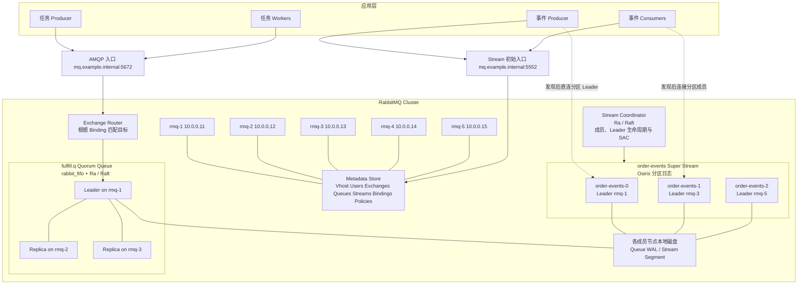
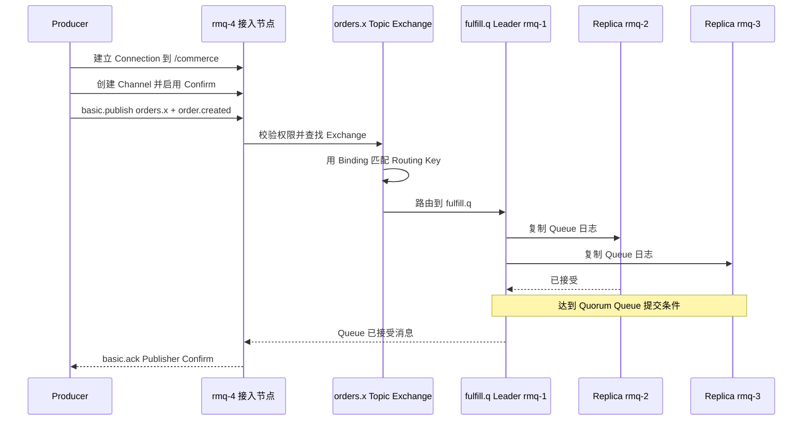
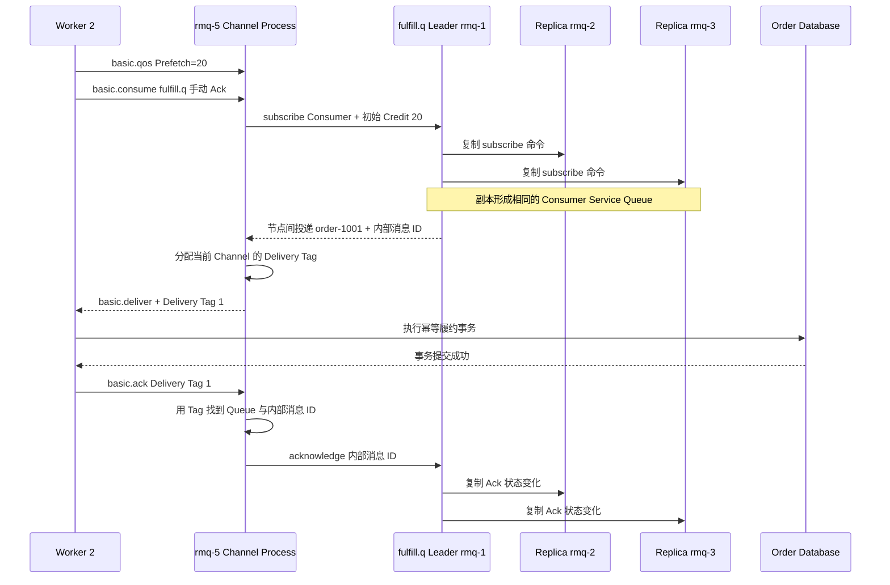
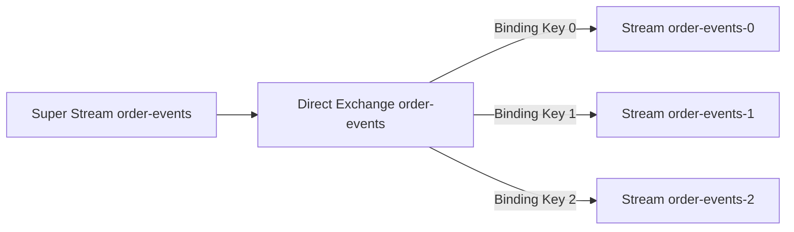
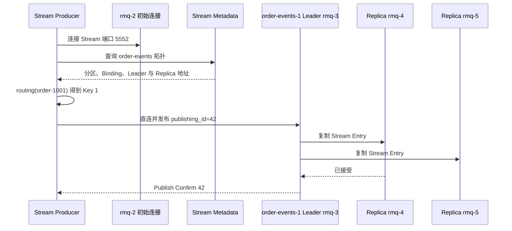
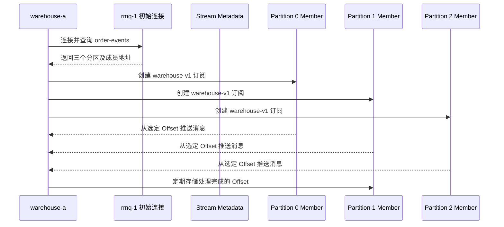
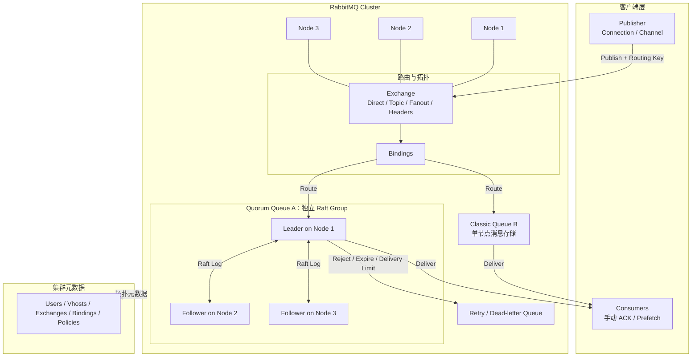

RabbitMQ 同时提供两类消息模型：

- **Queue**：一条消息最终交给一名 Consumer 完成，适合任务队列；
- **Stream**：消息按顺序追加并保留，多个消费者可以从各自位置反复读取，适合事件流。

二者共享 RabbitMQ 集群、用户、Virtual Host 和拓扑元数据，但生产、消费和存储语义并不相同。本文先用一套五节点环境和两个订单示例说明客户端到底连接谁、消息经过哪些组件，以及每个组件解决什么问题。复制提交和故障恢复分别放在 [Quorum Queue 实现篇](022_rabbitmq_queue_implementation.md) 与 [Stream 实现篇](023_rabbitmq_stream_implementation.md)。

<!-- more -->

## 1. 五节点生产部署

假设一个机房中有五台独立服务器：

| 节点 | 主机名 | IP | 主要职责 |
|---|---|---|---|
| Node 1 | `rmq-1` | `10.0.0.11` | RabbitMQ 节点；承载部分 Queue/Stream Leader 与副本 |
| Node 2 | `rmq-2` | `10.0.0.12` | RabbitMQ 节点；承载部分 Queue/Stream Leader 与副本 |
| Node 3 | `rmq-3` | `10.0.0.13` | RabbitMQ 节点；承载部分 Queue/Stream Leader 与副本 |
| Node 4 | `rmq-4` | `10.0.0.14` | RabbitMQ 节点；承载部分 Queue/Stream Leader 与副本 |
| Node 5 | `rmq-5` | `10.0.0.15` | RabbitMQ 节点；承载部分 Queue/Stream Leader 与副本 |

另有一个不计入 RabbitMQ 五节点的接入地址：

| 地址 | 用途 |
|---|---|
| `mq.example.internal:5672` | AMQP 0-9-1 入口，负载均衡到五个节点 |
| `mq.example.internal:5552` | Stream Protocol 的初始接入地址 |
| `rmq-1` 到 `rmq-5:5552` | Stream 客户端发现拓扑后访问具体 Leader/Replica |
| `10.0.0.11:15672` 等 | 管理 API/UI，仅开放给运维网络 |

生产者和消费者不应只配置一个 RabbitMQ 节点。AMQP 客户端至少配置多个地址或一个健康检查完善的负载均衡入口；Stream 客户端还必须能够解析并访问各节点对外公布的 `advertised_host` 和 `advertised_port`。

### 1.1 完整架构图



这张图要表达五件事：

1. **五个 RabbitMQ 节点组成一个集群**，任何节点都能接受客户端连接并查询拓扑；
2. **Metadata Store 保存定义，不保存消息正文**；RabbitMQ 4.x 可使用 Khepri，新旧升级集群也可能仍使用 Mnesia；
3. **Exchange 是路由器，不是消息仓库**；
4. **每条 Quorum Queue 和每个分区 Stream 都有自己的 Leader 与副本成员**，五节点不表示每条消息固定存五份；
5. **Stream 的每个分区拥有独立 Leader**，所以不同分区可以把负载摊到不同节点。

本例假设资源创建后形成以下数据副本布局：

| 数据对象 | Leader | Replica | Replica |
|---|---|---|---|
| `fulfill.q` | `rmq-1` | `rmq-2` | `rmq-3` |
| `order-events-0` | `rmq-1` | `rmq-2` | `rmq-3` |
| `order-events-1` | `rmq-3` | `rmq-4` | `rmq-5` |
| `order-events-2` | `rmq-5` | `rmq-1` | `rmq-2` |

它只是一个便于理解的布局。Leader 位置由 Leader Locator 和实际集群状态决定，副本成员也应通过管理 API/CLI 验证，不能仅凭“创建时连接了哪台节点”猜测。

### 1.2 RabbitMQ 的数据分类与一致性机制

先不要从 Raft、Osiris 等实现名词开始。部署 RabbitMQ 后，集群需要保存的持久数据可以先分成三类：

- **集群与拓扑元数据**
  - 解决的问题：集群里有哪些资源，这些资源如何连接。
  - 保存的数据：Virtual Host、用户与权限、Exchange、Queue、Stream、Binding、Policy、Runtime Parameter。
  - 使用的组件：Metadata Store。新建 RabbitMQ 4.2 集群默认使用 Khepri，升级集群也可能仍使用 Mnesia。
  - 一致性机制：Khepri 使用 RabbitMQ `Ra` 库实现 Raft；Mnesia 使用自身的分布式复制机制，不是 Raft。

- **Quorum Queue 数据与投递状态**
  - 解决的问题：任务消息当前处于 Ready、已分配还是已经 Ack 等状态。
  - 保存的数据：消息、Consumer、Credit、Ready/已分配状态、Ack/Reject 和投递次数。
  - 使用的组件：`rabbit_fifo` 状态机与 `Ra`。
  - 一致性机制：每条 Quorum Queue 是一个 Raft Group，通过 Raft 复制并由多数派提交。

- **Stream 数据与消费协调状态**
  - 解决的问题：日志里有哪些事件，以及当前由哪个 Consumer 实例读取。
  - 保存的数据：消息日志、Offset Tracking Record、Stream 成员布局、Leader 生命周期和 SAC 活动成员。
  - 使用的组件：数据面使用 `Osiris`，控制面使用 Stream Coordinator 与 `Ra`。
  - 一致性机制：Osiris 使用 Leader 驱动的多数派日志复制；Coordinator 的控制状态使用 Raft。

这三类数据的边界是：Metadata Store 保存“资源定义”，Queue 或 Stream 保存“资源里的业务数据”。例如，Metadata Store 知道 `fulfill.q` 是一条 Quorum Queue，但不会保存 `order-1001` 的消息正文。

#### 1.2.1 集群与拓扑元数据：Metadata Store

创建下面这些资源后：

```text
Virtual Host: /commerce
Exchange:     order.events（topic）
Queue:        fulfill.q（quorum）
Binding:      order.events -- order.paid --> fulfill.q
Stream:       order-events-0
```

Metadata Store 保存的是这些资源的定义和关系，还包括用户、权限、Policy、Runtime Parameter 等集群配置。任一 RabbitMQ 节点收到声明或查询请求时，都需要依据这份元数据理解集群拓扑。

新建 RabbitMQ 4.2 集群默认使用 **Khepri**。Khepri 基于 RabbitMQ 的 `Ra` 库，以 **Raft** 复制元数据：Leader 排序变更，多数副本确认后提交。旧集群可能仍使用 **Mnesia**；Mnesia 有自己的分布式复制与网络分区处理方式，但不提供与 Khepri 相同的 Raft 提交模型。一个集群同一时刻只使用其中一种 Metadata Store 后端。

#### 1.2.2 任务数据：Quorum Queue

`fulfill.q` 自己组成一个 Raft Group，成员位于 `rmq-1/2/3`：

```text
rabbit_fifo 状态机理解 Queue 命令
    入队 order-1001
    注册 worker-2，Credit=20
    把 order-1001 分配给 worker-2
    确认 order-1001
              ↓
Ra Leader：rmq-1
              ↓ Raft 复制
Ra Followers：rmq-2、rmq-3
```

`rabbit_fifo` 定义 Queue 的业务状态，`Ra` 负责 Leader 选举、日志复制和多数派提交。复制的不只是消息正文，还包括恢复任务投递所需的 Consumer、Credit、消息分配与 Ack 状态。因此 Leader 切换后，新 Leader 能区分 Ready 与尚未确认的消息。

三副本 Quorum Queue 的 Publisher Confirm 以多数成员写入并刷盘为边界，不是 Leader 收到后立即返回、Follower 再异步追赶。

#### 1.2.3 事件日志：Stream

Stream 内部再分成数据面和控制面：

- `Osiris` 保存消息日志和 Consumer 主动保存的 Offset Tracking Record。一个分区有一个 Writer Leader 和多个 Replica，数据复制到多数成员后才能确认发布。
- Stream Coordinator 保存 Stream 成员布局、Leader 生命周期和 SAC 协调状态。Coordinator 基于 `Ra`，用 Raft 复制这类控制状态。

```text
Producer
    ↓
order-events-1 Osiris Leader：rmq-3
    ├── 日志复制 → Replica：rmq-4
    └── 日志复制 → Replica：rmq-5
                 ↓
           多数派后 Confirm
```

Stream 默认依赖操作系统刷新 Page Cache，不为每次 Confirm 单独执行 `fsync`；Quorum Queue 的 Confirm 则要求多数副本写入并刷盘。因此两者都有多数派确认，但断电时的持久性边界并不完全相同。

最后再把客户端连接和副本复制网络对齐：

| 通信目的 | 默认端口或范围 | 说明 |
|---|---:|---|
| AMQP 客户端访问 Queue | `5672/5671` | Producer、Consumer 与接入节点之间的协议 |
| Stream 客户端访问 Stream | `5552/5551` | Stream Producer、Consumer 与 Stream Plugin 之间的协议 |
| Quorum Queue 与 Khepri 的 Raft 节点通信 | 通常 `25672` | RabbitMQ 节点间 Erlang Distribution，不是客户端 AMQP |
| Osiris Stream 副本复制 | `6000–6500` | Stream 数据副本之间的专用 TCP 通道 |

### 1.3 RabbitMQ 中有哪些协调与主导角色

RabbitMQ 没有一个统一的 Coordinator 家族。不同范围的状态由不同组件或资源 Leader 负责：

- **Metadata Store Leader**：协调 Exchange、Queue、Stream、Binding、用户和 Policy 等集群资源定义。使用 Khepri 时，它是 Khepri Raft Group 的 Leader，不参与每条消息路由；
- **Quorum Queue Leader**：每条 Quorum Queue 都有自己的 Raft Leader。它对入队、Consumer 注册、投递、Ack 和重新入队排序，并把命令复制给该 Queue 的 Followers；
- **Stream Coordinator**：管理 Stream 副本成员、Writer 生命周期和 SAC 活动消费者等控制状态。它不保存 Stream 消息正文，正文由 Osiris 日志副本保存；
- **Stream Writer**：每个 Stream 分区的唯一写入主导者，负责追加消息、推动副本复制并返回发布确认。它属于数据面，不是全局协调服务。

对应到本文示例：

```text
集群资源定义                 → Metadata Store Leader
fulfill.q 的入队与任务投递    → fulfill.q Quorum Queue Leader
order-events-1 的成员与 SAC   → Stream Coordinator
order-events-1 的日志追加     → order-events-1 Stream Writer
```

Exchange 也不是一个需要选举的消息协调者。入口节点读取 Exchange 与 Binding 定义并完成路由，再把消息转交给目标 Queue Leader。RabbitMQ 也没有 Kafka 式的全局 Consumer Group Coordinator：Queue 的消费者分配由该 Queue Leader 管理，Stream 的 SAC 活动实例由 Stream Coordinator 管理。

## 2. 集群启动后，各组件分别保存什么

在创建业务资源以前，五个节点已经组成 RabbitMQ Cluster。此时主要存在三类状态：

| 状态 | 例子 | 保存位置 | 是否包含消息正文 |
|---|---|---|---|
| 集群拓扑元数据 | 节点、Virtual Host、用户、权限、Policy | RabbitMQ Metadata Store，并在集群中复制 | 否 |
| 消息对象定义 | Exchange、Queue、Stream、Binding 及参数 | RabbitMQ Metadata Store | 否 |
| 消息与运行状态 | Queue 消息、投递状态、Stream Entry、Offset | 对应 Queue/Stream 的成员节点 | 是 |

连接和 Channel 则属于接入节点上的运行时状态。例如 Producer 的 TCP Connection 接到了 `rmq-4`，那么心跳、Channel、Publisher Confirm 序号首先由 `rmq-4` 上的连接进程维护。它不是一条需要复制到五个节点的持久业务资源。

## 3. 示例一：订单履约任务队列

需求如下：订单创建后交给任意一个履约 Worker 处理。Worker 成功处理后消息结束；Worker 崩溃时任务需要重新交给其他 Worker。

示例消息：

```json
{
  "event_id": "evt-20260907-0001",
  "event_type": "order.created",
  "order_id": "order-1001",
  "occurred_at": "2026-09-07T10:00:00+08:00"
}
```

### 3.1 初始化哪些资源

在 Virtual Host `/commerce` 中声明：

```yaml
vhost: /commerce

exchange:
  name: orders.x
  type: topic
  durable: true
  auto_delete: false

queue:
  name: fulfill.q
  durable: true
  exclusive: false
  auto_delete: false
  arguments:
    x-queue-type: quorum

binding:
  source: orders.x
  destination_type: queue
  destination: fulfill.q
  routing_key: order.created
  arguments: {}
```

这些声明可以由 IaC、Definitions Import、`rabbitmqadmin` 或应用启动代码完成。关键不是使用哪条命令，而是所有实例必须声明完全相同的属性；同名 Queue 已存在但类型或持久属性不同，RabbitMQ 会拒绝不等价声明，而不是偷偷修改它。

初始化顺序是：

1. 创建 `/commerce`，配置用户对该 Virtual Host 的 configure/write/read 权限；
2. 创建持久 Topic Exchange `orders.x`；
3. 创建持久 Quorum Queue `fulfill.q`；
4. 创建从 `orders.x` 到 `fulfill.q` 的 Binding；
5. Producer 打开 Publisher Confirm，Consumer 设置手动 Ack 与 Prefetch。

### 3.2 初始化后，元数据中有什么

Exchange、Binding、Queue 不保存相同的数据：

| 对象 | 保存的核心数据 | 它回答的问题 |
|---|---|---|
| Virtual Host | 名称 `/commerce`、权限与 Policy 作用域 | 这套资源属于哪个隔离命名空间 |
| Exchange | 名称 `orders.x`、类型 `topic`、durable、auto-delete、arguments | 使用哪种算法解释 Routing Key |
| Queue 定义 | 名称 `fulfill.q`、类型 `quorum`、durable、arguments | 目标是什么 Queue，采用什么 Queue 语义 |
| Queue 副本布局 | Leader `rmq-1`，成员 `rmq-1/2/3` | 真正由哪些节点保存和处理该 Queue |
| Binding | source、destination、destination type、binding key、arguments | 哪类消息应该进入哪个目标 |

本例 Binding 可以理解为一条路由表记录：

```yaml
vhost: /commerce
source_exchange: orders.x
destination_type: queue
destination: fulfill.q
binding_key: order.created
arguments: {}
```

Exchange 记录“我是一个 Topic 路由器”，Binding 记录“`order.created` 应进入 `fulfill.q`”。**Exchange 本身不会复制保存消息正文，Binding 也不会保存消费进度。**

### 3.3 Producer 生产消息的完整过程

假设负载均衡把 Producer 的连接分配到 `rmq-4`，但 `fulfill.q` Leader 位于 `rmq-1`。



逐步解释：

1. **连接接入节点**：Producer 连接 `mq.example.internal:5672`，负载均衡选中 `rmq-4`。握手时选择 `/commerce` 并完成认证；此时还没有发送业务消息。
2. **创建 Channel**：Producer 在 TCP Connection 内创建 Channel，并开启 Confirm。Channel 是轻量逻辑会话，不是消息存储节点。
3. **提交发布请求**：Producer 发送 Exchange=`orders.x`、Routing Key=`order.created`、消息属性和正文。持久任务还应设置持久消息属性。
4. **权限与 Exchange 查找**：`rmq-4` 检查 Producer 对 `orders.x` 的 write 权限，并从本地可见的集群元数据找到 Exchange 类型和 Binding。
5. **执行 Topic 匹配**：Topic Exchange 把 `order.created` 与 Binding Key 比较，得到目标集合 `{fulfill.q}`。
6. **转给 Queue Leader**：接入节点不是 Queue Leader，因此通过 RabbitMQ 节点间通信把入队操作交给 `rmq-1` 上的 Leader。
7. **Queue 接管消息**：Leader 追加 Queue 状态并复制给成员。达到 Quorum Queue 提交条件后，这条消息才算被该 Queue 接受。
8. **返回 Confirm**：Queue 的结果回到 `rmq-4`，再由原 Channel 向 Producer 返回 `basic.ack`。

如果一条消息匹配三条 Queue，接入节点会把消息分别交给三个目标。Publisher Confirm 要等所有匹配 Queue 接受；任何一条 Queue 的消费都不会推进另外两条 Queue。

如果没有 Binding 匹配：

- Exchange 不会把消息暂存在自身等待未来 Binding；
- 开启 `mandatory` 时，RabbitMQ 先向 Producer 返回不可路由消息，再发送 Confirm；
- 未开启 `mandatory` 或 Alternate Exchange 时，Producer 可能只看到发布已被 Exchange 处理，却没有业务 Queue 收到消息。

### 3.4 Consumer 消费消息的完整过程

消费过程涉及的数据先分成三层：连接节点负责 AMQP 会话，Quorum Queue 负责可恢复的投递状态，Metadata Store 负责 Queue 的持久定义。先把每个数据的用途对齐，再看流程。

- **Connection 状态**：用于标识客户端网络会话，包括 Socket、认证用户、Virtual Host 和心跳。它保存在 Consumer 所连接节点的 Connection Process 中，不复制，连接断开后失效。

- **Channel 状态**：用于在一条 Connection 中隔离协议会话，并限定 Ack 的作用域，包括 Channel 编号、Channel Process 和下一个 Delivery Tag。它保存在接入节点的 Channel Process 中，不复制，Channel 关闭后失效。

- **Consumer 订阅信息**：用于说明谁以什么方式消费哪条 Queue，包括 Queue、Consumer Tag、Ack 模式、优先级和是否 Exclusive。完整协议信息保存在 Channel Process；Queue 调度需要的部分进入 `rabbit_fifo` 状态机并通过 Raft 复制。

- **流量控制信息**：用于限制同一 Consumer 同时持有的未确认消息数，包括 Prefetch 上限和可用 Credit。Channel 的 Limiter 保存协议层限制，Quorum Queue 复制调度所需的 Credit 状态。

- **Queue 投递状态**：用于让故障后的新 Leader 知道消息交给了谁、是否完成，包括内部消息 ID、Ready/已分配状态、Consumer、投递次数和 Ack/Reject。它保存在 `fulfill.q` 的 `rabbit_fifo` 状态机中，并由该 Queue 的 Raft Group 复制。

- **AMQP Ack 映射**：用于把客户端发送的 Delivery Tag 翻译成 Queue 内部消息，包括 Consumer Tag、Queue、内部消息 ID 和投递时间。它只保存在接入节点的 Channel Process 中，不复制。

- **Queue 资源定义**：用于让所有节点知道这条 Queue 的名称、Virtual Host、类型和参数。它保存在 Metadata Store；使用 Khepri 时通过 Raft 复制。

其中最容易混淆的是最后两种“消息标识”：Queue 使用内部消息 ID 维护复制状态；Delivery Tag 只是某个 Channel 发给客户端的递增编号。Delivery Tag 不是全局消息 ID。

本节使用下面一组具体值。后续出现一个字段时，都可以回到这张表确认它的用途：

| 示例值 | 含义 | 此时保存在哪里 |
|---|---|---|
| `Worker 2` | 履约服务的一个实例 | 客户端自身 |
| `rmq-5` | Worker 2 建立 TCP Connection 的接入节点 | Connection 位于 `rmq-5` |
| `Channel 1` | Worker 2 在这条 Connection 中创建的 AMQP Channel | `rmq-5` 的 Channel Process |
| `worker-2` | 客户端声明的 Consumer Tag，用来标识当前订阅 | Channel Process；调度所需部分进入 Queue 状态 |
| `fulfill.q` | 被消费的 Quorum Queue | 定义在 Metadata Store；消息与投递状态在 Queue Raft Group |
| `Prefetch=20` | 最多允许该 Consumer 持有 20 条未确认消息 | Channel Limiter 与 Queue Consumer/Credit 状态 |
| `M1001` | Queue 内部用于跟踪 `order-1001` 的消息标识 | Quorum Queue 的复制状态 |
| `Delivery Tag=1` | Channel 投递后生成、供本 Channel Ack 使用的编号 | `rmq-5` 的 Channel Process |

#### 3.4.1 以 Worker 2 走一遍完整流程

假设三个 Worker 分别连接 `rmq-3`、`rmq-4`、`rmq-5`，都消费 `fulfill.q`，手动 Ack，Prefetch=20。

先回答最容易混淆的问题：**Worker 2 始终连接 `rmq-5`，不会在消费过程中改为直连 `rmq-1`。** `rmq-1` 是 Queue Leader，负责决定消息交给谁；`rmq-5` 持有 Worker 2 的 TCP Connection 和 Channel，负责把 AMQP Delivery 真正写给 Worker。

本例中 `fulfill.q` 的成员只有 `rmq-1/2/3`，`rmq-5` 不是副本。因此 `order-1001` 的实际路径是：

```text
fulfill.q Leader on rmq-1
        ↓ RabbitMQ 节点间通信
AMQP Channel process on rmq-5
        ↓ Worker 2 已建立的 TCP Connection
Worker 2
```

可以把 `rmq-5` 理解为这条消费连接的接入节点，但它不是另一个独立部署的 Proxy 服务，也不会把 `fulfill.q` 的消息复制一份到本地磁盘后再消费。



逐步解释：

1. **建立连接**：Worker 2 与 `rmq-5` 建立 TCP Connection，并在 Connection 中创建 AMQP Channel。后面的 `basic.consume`、Delivery 和 Ack 始终使用这个 Channel。
2. **设置 Prefetch**：Worker 在 Channel 上执行 `basic.qos(20)`。RabbitMQ 默认把这个值作为随后创建的每个 Consumer 的独立未确认消息上限。
3. **订阅 Queue**：Worker 发送 `basic.consume fulfill.q`。Consumer 订阅的是 Queue，不是 Exchange；Exchange 只参与生产消息的路由。
4. **复制 Consumer 注册**：`rmq-5` 的 Channel Process 把 Subscribe 命令交给 `fulfill.q` Leader。Quorum Queue 把 Consumer 信息作为运行时 Queue 状态写入 Raft 日志，使三个副本建立相同的 Consumer Service Queue。
5. **选择 Consumer**：副本按相同的 Queue 状态和 Consumer 顺序确定 `order-1001` 应由 Worker 2 处理，并把它从 Ready 变成已分配、等待确认的消息。
6. **跨节点投递**：由于 `rmq-5` 不是这条 Queue 的副本，Leader `rmq-1` 把消息经 RabbitMQ 节点间通信发给 `rmq-5` 的 Channel Process。
7. **生成 Delivery Tag**：Channel Process 为这次投递分配当前 Channel 内递增的 Delivery Tag，例如 `1`，记录 Tag 到 Queue 内部消息 ID 的映射，再通过已有 TCP Connection 发给 Worker。
8. **执行业务**：Worker 以 `event_id` 或 `order_id + 状态` 做幂等，并提交本地数据库事务。
9. **解析 Ack**：Worker 在同一 Channel 上发送 `basic.ack(1)`。`rmq-5` 的 Channel Process 用 Tag `1` 找到 `fulfill.q` 和内部消息 ID，再向 Quorum Queue 提交 Ack 命令。
10. **结束消息状态**：Ack 成为 Quorum Queue 已提交的状态变化后，消息不再属于 Unacked，Consumer Credit 得以恢复，Queue 可以继续投递。

#### 3.4.2 订阅状态保存在哪里

订阅状态只分成两部分：

- **接入节点 `rmq-5`**：Connection Process 保存 TCP 连接；Channel Process 保存 Consumer Tag、Ack 模式、Prefetch、Delivery Tag 和待确认映射。这些都是内存状态，连接断开后消失。
- **`fulfill.q` Quorum Queue**：复制 Worker 的订阅位置、可用 Credit，以及消息当前分配给谁。Leader 切换后，新 Leader 可以继续维护 Queue 的投递状态。

Metadata Store 只保存 `fulfill.q` 的名称、类型、参数和 Virtual Host 等资源定义，不保存这次 Consumer 订阅和 Delivery Tag。

#### 3.4.3 Unacked 与 Delivery Tag 保存在哪里

继续使用 `order-1001`：

```text
fulfill.q 的复制状态：M1001 已分配给 worker-2，尚未 Ack
rmq-5 的 Channel 状态：Delivery Tag 1 -> M1001
```

Unacked 是 Queue 对消息处理状态的记录；Delivery Tag 是当前 Channel 为这次投递生成的局部编号。Worker 发出 `basic.ack(1)` 后，`rmq-5` 的 Channel Process 用这条映射找到 M1001，再把 Ack 交给 `fulfill.q`。

Delivery Tag 只在当前 Channel 内有效，所以必须在收到消息的同一 Channel 上 Ack。换一个 Channel 可以再次从 Tag `1` 开始；在错误的 Channel 上 Ack 会得到 `unknown delivery tag`。

#### 3.4.4 Consumer 没有连接 Queue Leader 怎么办

AMQP 0-9-1 Consumer 不需要主动寻找 Queue Leader：

- 如果接入节点是 `fulfill.q` 的成员，例如 Follower `rmq-2`，它可以根据已复制的 Queue 状态把消息交给本地 Channel；
- 如果接入节点不是 Queue 成员，例如本例的 `rmq-5`，Queue Leader `rmq-1` 会把消息转给 `rmq-5` 的 Channel Process。

无论走哪条路径，Subscribe、消息分配和 Ack 等状态变化仍由 Queue Leader 排序并通过 Raft 提交。Follower 可以缩短投递路径，但不能绕开 Leader 独立决定消息归谁。

#### 3.4.5 故障时这些状态如何配合

- **Worker 或 Channel 断开**：本地 Pending Ack 映射消失；Queue 收到 Consumer Down 后，把该 Consumer 持有的消息重新投递。
- **`rmq-5` 故障**：Worker 的 TCP Connection 和 Channel 一起消失，客户端需要重连；Queue 的复制状态仍在 `rmq-1/2/3`，未 Ack 消息不会被当成已完成。
- **Queue Leader `rmq-1` 故障**：投递短暂停顿。新 Leader 根据已复制的 Queue 状态继续；连接在其他健康节点上的 Consumer 可以由 RabbitMQ 重新注册到新 Leader。
- **业务成功但 Ack 丢失**：Queue 仍可能把消息重新投递，因此 Worker 的数据库操作必须幂等。

RabbitMQ Queue 没有 Kafka 式 Consumer Group 名字。同一 Queue 上的 Consumer 天然竞争；若库存和审计都必须各处理一次，应创建 `inventory.q` 与 `audit.q` 两条 Queue，并分别绑定到 Exchange。

## 4. 示例二：订单事件 Super Stream

需求如下：保存订单事件 7 天，仓储和分析都能独立读取；吞吐超过单个 Stream 后，按订单 ID 分到三个分区，同一订单保持分区内顺序。

### 4.1 初始化 Stream 服务和 Super Stream

五个节点都启用 Stream Plugin，并让业务网络可访问各节点的 Stream 端口：

```text
rmq-1.example.internal:5552 → 10.0.0.11
rmq-2.example.internal:5552 → 10.0.0.12
rmq-3.example.internal:5552 → 10.0.0.13
rmq-4.example.internal:5552 → 10.0.0.14
rmq-5.example.internal:5552 → 10.0.0.15
```

每个节点返回的 `advertised_host` 必须是客户端能够解析和连接的地址。Stream 客户端先通过一个初始地址接入，之后会根据 Metadata 查询结果连接具体节点。

等价的 Super Stream 创建命令为：

```bash
rabbitmq-streams add_super_stream order-events \
  --vhost /commerce \
  --partitions 3 \
  --binding-keys 0,1,2 \
  --initial-cluster-size 3 \
  --leader-locator balanced
```

还应为三个分区 Stream 配置保留策略，例如 `x-max-age=7D` 或容量上限。Super Stream 不是一个新的物理文件，它是以下 AMQP 拓扑的逻辑封装：



### 4.2 初始化后，各组件保存什么

先看最核心的关系：

```text
Super Stream order-events
    = Direct Exchange order-events
    + Stream Queue order-events-0
    + Stream Queue order-events-1
    + Stream Queue order-events-2
    + Exchange 到三条 Stream Queue 的 Binding
```

这里的 Stream 在 RabbitMQ 资源模型中仍是一种 Queue，只是它的类型是 `stream`，底层使用追加日志而不是任务 Queue 的删除式消费模型。

#### 4.2.1 Exchange 保存什么

创建完成后，Metadata Store 中会有一个 Exchange 定义：

```yaml
vhost: /commerce
name: order-events
type: direct
durable: true
```

Exchange 不保存消息正文，也不是一份 Stream 日志。它表示一个路由入口：收到 Routing Key 后，查找匹配的 Binding。

#### 4.2.2 三条 Stream Queue 保存什么

Metadata Store 中还会有三条 Queue 资源定义：

```yaml
- name: order-events-0
  durable: true
  arguments:
    x-queue-type: stream
    x-max-age: 7D

- name: order-events-1
  durable: true
  arguments:
    x-queue-type: stream
    x-max-age: 7D

- name: order-events-2
  durable: true
  arguments:
    x-queue-type: stream
    x-max-age: 7D
```

这三条 Stream Queue 才是实际保存消息日志的三个分区。每条 Stream 都有自己的 Leader、Replica、Offset 和磁盘文件，三者之间没有共享的一条总日志。

例如本文后续假设：

```text
order-events-1
Leader   = rmq-3
Replicas = rmq-4、rmq-5
```

资源名称、类型和保留参数保存在 Metadata Store；当前 Leader、Replica 和客户端连接地址属于 Stream 的运行拓扑。消息到来后，正文最终写入 `rmq-3/rmq-4/rmq-5` 上的 `order-events-1` 日志。

#### 4.2.3 Binding 到底绑定什么

Binding 的 Source 是 Exchange，Destination 是一条 Stream Queue，Binding Key 是匹配条件：

```yaml
- source: order-events
  destination_type: queue
  destination: order-events-0
  routing_key: "0"

- source: order-events
  destination_type: queue
  destination: order-events-1
  routing_key: "1"

- source: order-events
  destination_type: queue
  destination: order-events-2
  routing_key: "2"
```

所以准确关系是：

```text
Direct Exchange order-events
    -- Binding Key 0 --> Stream Queue order-events-0
    -- Binding Key 1 --> Stream Queue order-events-1
    -- Binding Key 2 --> Stream Queue order-events-2
```

假设 `order-1001` 经过分区函数得到 Routing Key `1`：

```text
Routing Key 1
→ 匹配 Binding Key 1
→ 目标是 Stream Queue order-events-1
→ 最终写入 rmq-3 上的 order-events-1 Leader
```

使用 AMQP 0-9-1 发布时，RabbitMQ 在服务端根据 Exchange 和 Binding 完成这条路由。使用原生 Stream 客户端发布 Super Stream 时，客户端查询这些分区关系，在本地算出 `order-events-1`，然后直接连接它的 Leader；Exchange 和 Binding 此时主要承担 Super Stream 的拓扑描述。

#### 4.2.4 刚初始化完成时还没有什么

创建命令刚完成时：

- Metadata Store 已经有 Exchange、三条 Stream Queue 和三条 Binding 的定义；
- 三条 Stream 已经建立 Leader 和 Replica，但日志中还没有业务消息；
- 尚未注册 Consumer，所以没有 Subscription 和 SAC 活动实例；
- Consumer 尚未调用 Store Offset，所以也没有 Stored Offset。

后续 Producer、Consumer 和 SAC 产生的运行状态，不属于这次初始化创建的静态拓扑。

### 4.3 Producer 生产事件的完整过程

假设订单 `order-1001` 经稳定哈希得到分区路由键 `1`，因此目标是 `order-events-1`，其 Leader 位于 `rmq-3`。



逐步解释：

1. **初始接入**：Producer 用 `mq.example.internal:5552` 或地址列表建立 Stream 连接。这个节点只是发现入口，不一定承载目标分区。
2. **查询 Super Stream 拓扑**：客户端库查询 `order-events`，得到分区 Stream、Binding Key、各分区 Leader/Replica 的主机与端口。
3. **选择分区**：应用提供路由函数，从消息取出 `order_id`；客户端根据稳定哈希/路由策略得到 Binding Key `1`，映射到 `order-events-1`。
4. **连接 Leader**：客户端连接 `rmq-3.example.internal:5552`。若已经有到该节点的连接，可复用。
5. **追加消息**：Producer 带 Producer Name 和递增 Publishing ID 发布，分区 Leader 把消息追加到日志并复制。
6. **收到确认**：Leader 达到 Stream 的确认条件后返回 Publishing ID 42 的 Confirm。超时仍然表示结果未知，稳定 Producer Name 与 Publishing ID 可用于去重。

这里最容易误解的一点是：**使用原生 Stream 客户端发布 Super Stream 时，Exchange 与 Binding 用来描述分区拓扑，客户端据此选择分区；消息数据直接发往分区 Stream Leader，不先经过 Exchange 进程做一次服务器端转发。**

如果使用 AMQP 0-9-1 把普通 Stream 当 Queue 使用，则仍可以向 Exchange 发布，由 RabbitMQ 按 Binding 路由；但 Super Stream、SAC 和拓扑感知等完整能力应以原生 Stream 客户端为主。

### 4.4 Consumer 消费事件的完整过程

Stream 消费没有 Queue 的 Ready → Unacked → Ack 删除模型。它涉及的数据先分成三层：当前连接如何投递、应用处理到了哪里、多个实例中谁有权消费。

- **Connection 状态**：用于维持客户端与 RabbitMQ 节点的网络会话，包括 Socket、认证、Virtual Host 和客户端属性。它只存在于连接节点的 Stream Connection Process 内存中，不复制。

- **Subscription 状态**：用于描述当前连接正在读取哪个分区、已经发送到哪里以及还能推送多少数据，包括 Subscription ID、Stream、Delivery Offset、Credit、过滤条件和 Consumer Name。它只存在于连接节点的 Stream Subscription 内存中，不复制。

- **应用处理位置**：用于区分消息是刚收到、正在处理还是业务已经完成。它通常由 Consumer 进程在内存中维护，Broker 不知道应用事务是否已经完成。

- **Stored Offset**：用于为重连和故障接管提供持久恢复书签，包括 Consumer Name、Stream 分区和应用主动保存的 Offset。它作为 Offset Tracking Record 写入对应 Stream 的 Osiris 日志，并随 Stream 数据复制。

- **SAC 协调状态**：用于决定同名 Consumer 实例中当前由谁接收某个分区，包括 Consumer Name、成员 Subscription 及 Active/Inactive 关系。它保存在 Stream Coordinator 中，并通过 `Ra/Raft` 复制。

- **Stream 资源定义**：用于让节点知道 Stream 与 Super Stream 的拓扑，包括名称、分区和 Binding 等。资源定义保存在 Metadata Store，成员与 Leader 的运行控制状态由 Stream Coordinator 管理。

这几类数据回答的是不同问题：

```text
Subscription / Credit / Delivery Offset → 当前连接怎样发送
应用处理位置                            → 当前进程实际上处理到哪里
Stored Offset                           → 崩溃后从哪里恢复
SAC 状态                                → 多个实例中现在由谁接收
```

本节使用下面的具体值：

| 示例值 | 含义 |
|---|---|
| `order-events` | 由三个分区组成的 Super Stream |
| `order-events-0/1/2` | 三条真正保存消息的 Stream |
| `warehouse-a`、`warehouse-b` | 仓储服务的两个 Consumer 实例 |
| `warehouse-v1` | 两个实例共用的 Consumer Name，也是 Stored Offset 与 SAC 分组的身份 |
| `Subscription ID=3` | 某条 Connection 内对一个分区订阅的临时编号 |
| `Delivery Offset=8451` | Broker 当前准备投递的日志位置 |
| `Stored Offset=8450` | 应用最后主动保存、可用于恢复的处理位置 |
| `Credit=100` | 当前 Subscription 还允许 Broker 推送的数据额度 |

#### 4.4.1 以仓储服务走一遍完整流程

仓储服务部署两个实例 `warehouse-a`、`warehouse-b`，都使用 Consumer Name `warehouse-v1` 并启用 SAC；分析服务使用另一个名字 `analytics-v1`。两套名字代表两份独立处理进度。



逐步解释：

1. **查询分区**：Consumer 先连接任一 Stream 节点，查询 Super Stream 的三个分区及其 Leader/Replica。
2. **建立复合 Consumer**：客户端库在应用看来创建一个 Super Stream Consumer，内部实际为三个分区分别建立订阅连接；消费可以连接承载副本的节点分散读取压力。
3. **确定起点**：每个分区分别选择 `first`、`last`、绝对 Offset、时间戳或已存储 Offset。Super Stream 没有一个覆盖所有分区的全局 Offset。
4. **SAC 协调**：`warehouse-a` 与 `warehouse-b` 使用相同 Consumer Name。RabbitMQ 对每个分区只激活其中一个实例；三个分区可以分别分配给不同实例。
5. **投递与 Credit**：Stream 按 Credit 向活动 Consumer 推送消息，Credit 控制在途数量和背压。
6. **处理与存 Offset**：应用处理成功后定期存储各分区 Offset。Stored Offset 是恢复位置，不会删除消息。
7. **实例故障**：某个活动实例断开后，同名组中的另一个实例可以接手相应分区，从已保存位置继续，因此最后一次保存之后的消息可能再次处理。

分析服务 `analytics-v1` 使用另一 Consumer Name，会独立读取相同的三条分区日志。仓储保存 Offset 不会推进分析服务的位置；消息最终何时删除由 Stream 保留策略决定，而不是由某个 Consumer Ack 决定。

#### 4.4.2 各类状态具体保存在哪里

继续向下看实现时，可以把上表归并成三条主线：当前投递、故障恢复位置和 SAC 成员协调。

```text
当前连接怎么投递       → Stream Connection / Subscription 的内存状态
故障后从哪里继续       → Stream 中的 Stored Offset Tracking Record
SAC 哪个实例处于活动状态 → Stream Coordinator 的复制状态
```

| 状态类型 | 保存组件 | 具体保存内容 | 是否持久/复制 | 失效后的结果 |
|---|---|---|---|---|
| Connection | Consumer 所连接节点的 Stream Connection Process | TCP 连接、认证、Virtual Host、客户端属性 | 仅内存，不复制 | 节点或连接故障后客户端重连 |
| Subscription | 该连接上的 Stream Subscription | Subscription ID、目标 Stream、当前发送位置、Credit、过滤条件、Consumer Name 等 | 仅内存，不复制 | 重连后重新创建 Subscription |
| Consumer 当前处理位置 | 客户端进程 | 最后收到、正在处理、已经处理但尚未存储的 Offset | 通常仅在应用内存 | 崩溃后可能从旧 Stored Offset 重复处理 |
| Stored Offset | 目标 Stream 的 Osiris 日志 | `{consumer_name, stream, offset}` 对应的 Tracking Record | 作为非消息记录随 Stream 数据复制 | 重连后可以查询并从该位置继续 |
| SAC Group | Stream Coordinator | Stream、Consumer Name、成员 Subscription、活动/待命关系 | Coordinator 使用 Ra/Raft 复制协调状态 | 活动实例消失后选择待命实例 |

##### 临时 Subscription 状态

假设 `warehouse-a` 连接 `rmq-2` 上的 `order-events-0` Replica，建立 Subscription ID `3`：

```yaml
connection_node: rmq-2
subscription_id: 3
stream: order-events-0
consumer_name: warehouse-v1
next_delivery_offset: 8451
available_credit: 100
single_active_consumer: true
state: active
```

这份数据服务于当前网络投递，保存在 `rmq-2` 的 Stream Connection/Subscription 运行时进程中。Subscription ID 只需在当前 Connection 内区分订阅；连接断开后，它不会作为持久消费进度留下来。

##### Stored Offset

应用处理完 Offset `8450` 后，可以调用 Stream 客户端的 Offset Tracking API。Broker 把 Consumer Name 和 Offset 编码成 Tracking Record，追加到 `order-events-0` 本身：

```yaml
record_type: offset_tracking
consumer_name: warehouse-v1
stream: order-events-0
offset: 8450
```

它不是业务消息，但和 Stream 数据一起保存在 Osiris 日志并复制到 Stream Replica。Super Stream 有三个分区，所以会有三份独立位置：

```text
warehouse-v1 / order-events-0 → 8450
warehouse-v1 / order-events-1 → 9217
warehouse-v1 / order-events-2 → 8031
```

Stored Offset 只有在应用主动存储时才前进。应用可能每处理 100 条或每隔数秒存一次，所以“内存中已经处理到 8499，但持久位置仍是 8450”是正常情况。此时进程崩溃，接管者从 8450 附近恢复，后面的消息可能重复处理。

Stored Offset 也不会阻止 Retention 删除旧 Segment。如果 Consumer 停太久，已保存位置早于 Stream 当前最早 Offset，恢复时只能从仍然存在的最早数据开始。

##### SAC Group 状态

`warehouse-a` 与 `warehouse-b` 在同一分区上使用相同 Consumer Name `warehouse-v1`，Stream Coordinator 把它们视为同一个 SAC Group：

```yaml
group_key:
  vhost: /commerce
  stream: order-events-0
  consumer_name: warehouse-v1
members:
  - connection: warehouse-a@rmq-2
    subscription_id: 3
    state: active
  - connection: warehouse-b@rmq-3
    subscription_id: 1
    state: inactive
```

这份协调状态回答“现在由谁收消息”，Stored Offset 回答“下一个实例应该从哪里继续”。两者不能互相替代：

- 只有 SAC、没有 Stored Offset：能选出新活动实例，但恢复位置仍需应用指定；
- 只有 Stored Offset、没有 SAC：多个实例都可能从相同位置并行读取并重复处理；
- 二者都有：一个实例活动，故障后另一个实例从已保存位置接手，但最后一次存储后的消息仍可能重复。

##### Stream 没有 Queue 式 Unacked 集合

Queue 把消息从 Ready 变成 Unacked，Ack 后将其移除；Stream 不采用这种破坏性消费模型。Stream 中的消息始终按 Retention 保存，Credit 只是限制 Broker 当前可以推送多少数据，Stored Offset 只是恢复书签。

因此不要把 Stream 的三个值混为一谈：

```text
Credit         = 现在还能向这个 Subscription 推送多少
Delivery Offset = 当前投递的是日志中的哪一条
Stored Offset   = 故障恢复时可查询的持久书签
```

### 4.5 顺序保证到哪里

假设以下事件都以 `order-1001` 为路由键：

```text
OrderCreated → OrderPaid → OrderShipped
```

稳定路由会把它们写入同一分区，Stream 保留该分区中的追加顺序。SAC 又让同一 Consumer Name 对这个分区同一时刻只有一个活动消费者，因此可以维持分区内串行交付。

但它不保证：

- `order-1001` 与 `order-2002` 位于不同分区时的全局顺序；
- Consumer 使用线程池并发处理后的业务完成顺序；
- 失败重试与外部数据库提交天然精确一次。

## 5. 从两个示例归纳语义边界

前面的两个示例已经在实际流程中说明了 Connection、Channel、Exchange、Binding、Queue、Stream、Stored Offset 和 SAC。这里不再逐个重复定义，只归纳选型时最容易混淆的边界。

### 5.1 Queue 与 Stream 解决的问题不同

- **Queue 是一份待完成的任务集合**：消息交给一个竞争 Consumer，业务完成并 Ack 后，这次任务通常结束。
- **Stream 是一段可重复读取的历史日志**：不同 Consumer 可以从各自 Offset 读取同一批事件，保存 Offset 不会删除消息。
- **Quorum Queue 解决 Queue 的副本容错**，但不会把一条 Queue 自动拆成多个吞吐分区。
- **Super Stream 通过多个分区 Stream 扩展吞吐**，代价是只保证分区内顺序，不提供跨分区全局顺序。

### 5.2 三种确认表达不同的责任边界

```text
Publisher Confirm → RabbitMQ 已按目标 Queue 或 Stream 的规则接管发布
Consumer Ack      → Queue Consumer 已完成这次任务投递
Stored Offset     → Stream Consumer 保存了一个可用于恢复的读取位置
```

三者不能互相替代：

- Producer 收到 Publisher Confirm 时，Consumer 可能还没有收到消息；
- Queue Consumer Ack 不会反馈给最初的 Producer；
- Stored Offset 是恢复书签，不是消息删除确认；
- Confirm、Ack 和 Stored Offset 都不能自动与应用数据库组成原子事务。

因此，端到端可靠性仍需要 Producer 重试与去重、Broker 存储保证、Consumer 至少一次处理以及业务幂等共同完成。

### 5.3 选型时真正需要做的判断

如果业务问题是“这项任务必须由一个 Worker 完成”，优先从 Queue 模型思考；如果业务问题是“这段事件历史需要由多套系统独立读取或回放”，优先从 Stream 模型思考。

不要因为二者都部署在 RabbitMQ 集群中，就认为它们具有相同的路由、消费、保留和扩展语义。
## 6. 两个示例的连接路径对照

| 场景 | 第一次连接谁 | 内部查询或请求谁 | 最终生产写给谁 | 最终消费从谁读 |
|---|---|---|---|---|
| Quorum Queue | 任一 AMQP 节点或负载均衡 | 接入节点查询 Exchange、Binding、Queue Leader | `fulfill.q` Leader | Queue Leader 经接入节点投递 |
| Super Stream | 任一 Stream 节点或初始入口 | 客户端查询分区与 Leader/Replica Metadata | 目标分区 Stream Leader | 各分区 Leader/Replica |

最核心的区别是：

```text
Queue：Producer → 接入节点 → Exchange 路由 → Queue Leader
Stream：Producer → 初始节点查询拓扑 → 客户端选分区 → Partition Leader
```

## 7. 第一篇应该得到的选型结论

选择 RabbitMQ Queue，是选择“路由后的待办任务”：复杂路由、竞争消费、逐条 Ack、重投、TTL、优先级和死信是主要价值。

选择 RabbitMQ Stream，是选择“RabbitMQ 集群内的保留日志”：多个消费者独立读取、Offset、回放和大积压是主要价值；吞吐需要扩展时再使用 Super Stream 分区。

不要把两者混在一起：

- Queue Ack 后消息通常结束；Stream 保存 Offset 不会删除消息；
- Quorum Queue 不能自动变成多分区；Super Stream 天生由多个 Stream 组成；
- Queue Consumer 订阅 Queue；Stream Consumer 查询并订阅每个分区；
- Queue 路由由 Broker 上的 Exchange 执行；原生 Super Stream 的分区选择主要由客户端完成。

下一步实现问题包括：Quorum Queue 何时向 Producer Confirm、Leader 故障后未提交消息如何处理、Stream 如何形成多数派、分区 Leader 如何切换。这些分别见：

- [RabbitMQ（二）：Queue 存储、复制、提交与故障恢复](022_rabbitmq_queue_implementation.md)
- [RabbitMQ（三）：Stream 分区、复制、Offset 与故障恢复](023_rabbitmq_stream_implementation.md)

## 8. 参考资料

- [RabbitMQ Metadata Store](https://www.rabbitmq.com/docs/4.1/metadata-store)
- [RabbitMQ Clustering and Queue Leaders](https://www.rabbitmq.com/docs/clustering)
- [RabbitMQ Exchanges and Bindings](https://www.rabbitmq.com/docs/exchanges)
- [RabbitMQ Reliability Guide](https://www.rabbitmq.com/docs/reliability)
- [Consumer Acknowledgements and Publisher Confirms](https://www.rabbitmq.com/docs/4.1/confirms)
- [RabbitMQ Quorum Queues](https://www.rabbitmq.com/docs/quorum-queues)
- [RabbitMQ：Quorum Queue Local Delivery](https://www.rabbitmq.com/blog/2020/06/23/quorum-queues-local-delivery)
- [RabbitMQ Ra：Multi-Raft 实现](https://github.com/rabbitmq/ra)
- [RabbitMQ Streams and Super Streams](https://www.rabbitmq.com/docs/4.1/streams)
- [RabbitMQ Stream Plugin](https://www.rabbitmq.com/docs/4.1/stream)
- [RabbitMQ Stream Client Connections](https://www.rabbitmq.com/docs/next/stream-connections)
- [RabbitMQ Networking and Ports](https://www.rabbitmq.com/docs/next/networking)
- [RabbitMQ Osiris：Stream 日志子系统](https://github.com/rabbitmq/osiris)
- [RabbitMQ：Stream Single Active Consumer](https://www.rabbitmq.com/blog/2022/07/05/rabbitmq-3-11-feature-preview-single-active-consumer-for-streams)
- [RabbitMQ Server：Channel Process 源码](https://github.com/rabbitmq/rabbitmq-server/blob/main/deps/rabbit/src/rabbit_channel.erl)

## 附录：Queue 路由与副本关系概念图

下面保留 Queue 链路的概念图。它只展示 Exchange 路由和 Queue 副本关系，不代表本文五节点部署的完整生产架构。图中的 Node 1～3 表示 `fulfill.q` 所在的三成员副本组；Node 4、Node 5 仍属于 RabbitMQ Cluster，可以接受客户端连接，并承载其他 Queue 或 Stream 的 Leader 与副本。


