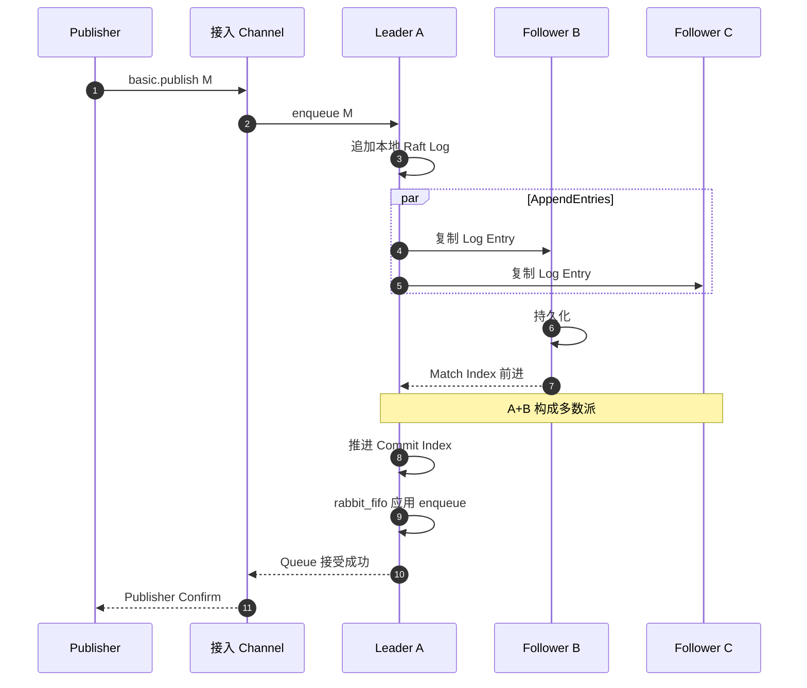
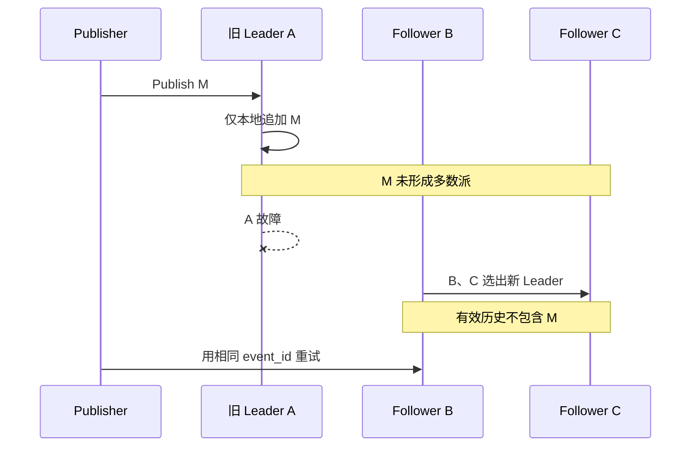
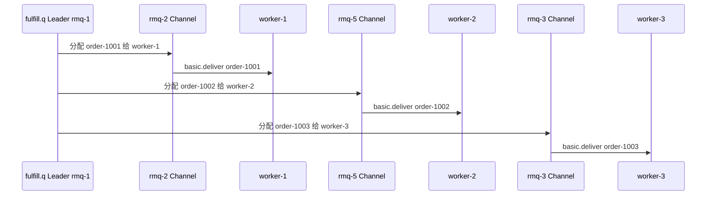
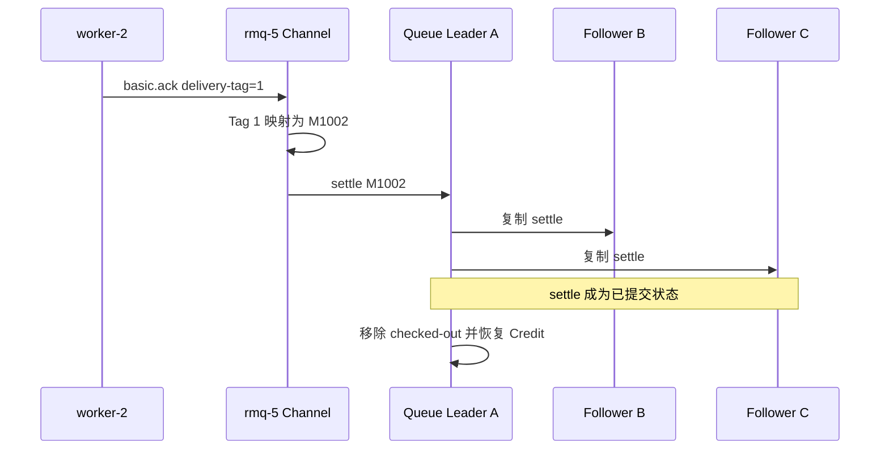
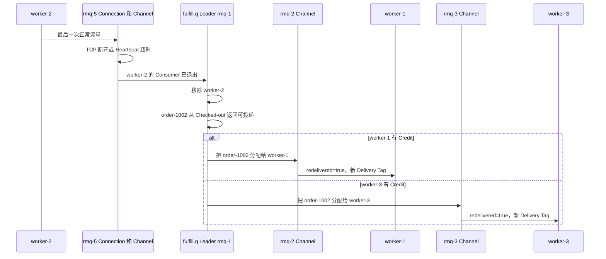

[第一篇](021_rabbitmq.md)已经说明 Exchange、Binding、Quorum Queue、Connection、Channel 与 Consumer 的完整路径。本文从 `fulfill.q` Leader 收到 `order-1001` 的位置继续：Queue 状态如何落入 Raft Log、何时返回 Publisher Confirm、Leader 切换如何区分已提交与未提交消息，以及 Unacked/Ack 状态如何恢复。

<!-- more -->

## 1. 从 Queue 命令到底层存储

每条 Quorum Queue 都是一个独立 Raft Group，但 Raft 只负责复制有序命令；Queue 语义由 `rabbit_fifo` 状态机解释。

```text
客户端与 Channel
    → enqueue / checkout / settle / return 等 Queue 命令
    → Raft Log
    → rabbit_fifo 按提交顺序应用
    → Ready、Consumer、Credit、Checked-out 状态
```

需要区分两类数据：

- **Raft Log 与 Snapshot**保存如何重建状态机的已提交历史；
- **rabbit_fifo 状态**表示当前哪些消息 Ready、交给了哪个 Consumer、是否 Ack/Reject、还有多少 Credit。

Quorum Queue 不是“消息正文一个文件、Unacked 一张表”。消息和状态变化作为 Raft 命令持久化，Snapshot 压缩已经应用的历史；节点恢复时加载 Snapshot，再重放后续 Log。

### 1.1 一条 Queue 一个 Raft Group意味着什么

`fulfill.q` 的 Leader 在 `rmq-1`、Followers 在 `rmq-2/3`。另一条 `audit.q` 可以拥有不同成员和 Leader。

因此：

- 一条 Queue 的写入只影响自己的 Raft Group；
- 增加 Queue 可以把 Leader 分散到更多节点；
- 增加某条 Queue 的副本数会增加写放大，不会增加该 Queue 的单 Leader 写吞吐；
- 五节点集群不表示每条 Queue 都有五副本。

## 2. 从 Publish 到 Publisher Confirm

假设 `fulfill.q` 有 A、B、C 三个成员，A 是 Leader。Producer 已经经过 Exchange 路由，接入 Channel 把 Enqueue 交给 A。



这里有三个不同时间点：

1. Leader 收到 M；
2. 多数成员持久化对应 Raft Entry；
3. Leader 判断该 Entry 已提交、状态机应用并返回 Confirm。

Publisher Confirm 的边界是第 3 个，不是第 1 个。Follower C 可以稍后追赶，不需要等待全部成员。

Quorum Queue 的持久 Publisher Confirm 会等待消息被复制并写入多数成员磁盘。副本网络延迟和磁盘延迟因此直接进入 Confirm 延迟。

## 3. Leader 如何判断消息已经提交

每个成员维护自己的 Raft Log Index。Leader 根据 Follower 返回的复制进度计算：某个 Index 是否已经存在于多数成员。

```text
A Leader:   ... 40 41 42
B Follower: ... 40 41 42
C Follower: ... 40 41

Index 42 已在 A+B
→ 三成员中的多数派
→ Leader 可推进 Commit Index 到 42
```

新 Leader 不是查看“最后一个本地文件”猜测提交点，而是依赖 Raft 选举约束：

- 候选者必须获得多数派选票；
- 投票者会比较候选者日志是否足够新；
- 已提交 Entry 至少存在于旧多数派；
- 新 Leader 也需要新多数派；
- 两个多数派必然相交，因此已提交历史不能被缺少它的候选者合法覆盖。

这就是 Leader 切换时判断“最新消息是否属于有效历史”的根本，不依赖客户端 Confirm 是否已经送达。

## 4. 三个临界故障场景

### 4.1 只写到旧 Leader，尚未提交



客户端没有收到 Confirm，应把结果视为未知。此例中新 Leader 的已提交历史没有 M，重试是必要的。

旧 A 恢复后不能把自己的孤立 M 注入新 Leader。它作为 Follower 比较日志，截断冲突尾部并追赶当前历史。

### 4.2 已复制多数派，但 Confirm 丢失

A、B 已经持久化并提交 M，Confirm 在返回途中丢失：

- 新 Leader 仍会保留 M；
- Publisher 只看到超时；
- Publisher 重试会再次发布同一业务消息；
- RabbitMQ 不会根据任意业务字段自动替 Producer 去重。

因此 Producer 使用稳定 `event_id`，Consumer 使用业务唯一键或状态机幂等。Raft 保证 Broker 内部只有一条已提交历史，不保证跨网络请求“只执行一次”。

### 4.3 失去多数派

A、B 同时不可用，只剩 C。C 可能落后，也无法证明另外两个节点没有形成更新历史，所以必须停止这条 Queue 的安全写入和接管。

这不是可用性缺陷，而是多数派一致性的选择：在无法同时保证一致性和可用性时，不允许两个分区各自产生一条 `fulfill.q` 历史。

## 5. Consumer 投递和 Ack 如何进入一致状态

要理解三个 Worker 同时消费 `fulfill.q` 时的故障恢复，先把整个机制分成两部分：

- **消息调度**：Queue 从当前可接收消息的 Consumer 中，为每条消息选择一个 Consumer；
- **故障恢复**：Consumer 消失后，Queue 移除它，并把它尚未 Ack 的消息重新变为可投递。

这不是 Kafka 式 Consumer Group Rebalance。RabbitMQ Queue 没有 Partition 分配方案，也不会在 `worker-1/2/3` 中选出一个长期负责整条 Queue 的 Leader。普通竞争消费下，三个 Worker 都是活动 Consumer，Queue 对每条消息分别选择接收者。

只有显式启用 **Single Active Consumer** 时，Queue 才会让三个订阅者中只有一个接收消息。假设当前活动者是 `worker-2`，它掉线后 Queue 会激活另一个已注册 Consumer；这属于单活动 Consumer 切换，不是普通任务队列的默认行为。

### 5.1 三个 Worker 如何竞争同一条 Queue

继续使用第一篇的五节点部署，并增加三个 Worker：

```text
worker-1 → rmq-2 的 Connection / Channel
worker-2 → rmq-5 的 Connection / Channel
worker-3 → rmq-3 的 Connection / Channel

fulfill.q Leader：rmq-1
fulfill.q Followers：rmq-2、rmq-3
```

三个 Worker 分别发送 `basic.consume fulfill.q`，并设置手动 Ack 和 `Prefetch=20`。订阅请求由各自的接入节点交给 `fulfill.q`；Queue 的调度状态可以概括为：

```text
Consumer     投递出口    可用 Credit    状态
worker-1     rmq-2       20             可投递
worker-2     rmq-5       20             可投递
worker-3     rmq-3       20             可投递
```

`Prefetch=20` 表示一个 Consumer 最多同时持有 20 条尚未 Ack 的消息；可用 `Credit` 是 Queue 当前还能投给它的数量。每投递一条消息，Credit 减一；对应消息 Ack 后，Credit 恢复。

假设三个 Consumer 优先级相同、Credit 都大于零，也没有被网络流控阻塞，Queue 会在它们之间轮询投递：



因此，“选择了 `worker-2`”只表示某一条消息被分配给它，不表示它当选了 Queue 的主 Consumer。如果 `worker-2` 已用完 20 个 Credit，Queue 会暂时跳过它，把新消息交给仍有 Credit 的 `worker-1/3`。

#### 5.1.1 并行消费还能保证顺序吗

任务 Queue 通常假设不同任务彼此独立，不要求它们严格按照入队顺序完成。因此，三个 Worker 可以并行处理：

```text
order-1001 → worker-1
order-1002 → worker-2
order-1003 → worker-3
```

这里需要区分两种顺序：

- **取出与投递顺序**：Queue 按自己的消息顺序取出任务，并依次分配给可用 Consumer；
- **业务完成顺序**：三个 Worker 的处理时间不同，可能按照 `order-1002 → order-1003 → order-1001` 的顺序完成。

故障重投还会进一步改变完成顺序。例如 `worker-2` 处理 `order-1002` 时掉线，`order-1003` 可能已经完成，而 `order-1002` 随后才重新投递给其他 Worker。

因此，多 Worker 竞争消费适合图片处理、邮件发送以及不同订单的履约任务等相互独立、允许并行执行的工作。Consumer 仍需支持幂等，因为故障边界下消息可能重复投递。

如果业务要求严格顺序，需要先明确顺序的范围：

- **整条 Queue 严格串行**：启用 Single Active Consumer，并使用 `Prefetch=1`，上一条消息 Ack 后再处理下一条；代价是整条 Queue 的并行度下降；
- **同一订单有序、不同订单并行**：按 `order_id` 做稳定分片，同一个 `order_id` 始终进入同一条 Queue；每条分片 Queue 再使用单活动 Consumer。这样只能保证同一订单内有序，不提供跨订单的全局顺序。

所以，Queue 不是完全没有顺序；真正需要注意的是：**多个 Consumer、不同处理耗时和失败重投，会使业务完成顺序不再等于消息入队顺序。**

实现层继续追踪已经交给 `worker-2` 的 `M1002`：

```text
Queue Raft 状态：
M1002 → checked-out to worker-2, delivery-count=1

rmq-5 Channel 本地：
Delivery Tag 1 → fulfill.q / M1002
```

投递需要两类状态配合：

- Queue 把 Checkout/Consumer/Credit 状态通过 Raft 复制，因此新 Leader 能知道 M1002 尚未完成；
- Channel 的 Delivery Tag 映射不复制，因为它只属于当前 AMQP Channel。

### 5.2 Ack 的完整路径



Ack 是 Queue 状态变化，也需要按 Raft 顺序提交。Ack 响应或连接丢失时，Consumer 不能判断最终结果；消息可能已完成，也可能重新投递。

### 5.3 worker-2 掉线如何被检测

RabbitMQ 不靠业务层定期发起“重新选举”，而是先判断承载 Consumer 的 Channel 是否仍然存活：

- **正常退出**：`worker-2` 主动取消订阅或关闭 Channel/Connection，`rmq-5` 立即移除本地 Channel，并通知 Queue 该 Consumer 已退出；
- **进程崩溃或连接明确断开**：操作系统报告 TCP 连接关闭，`rmq-5` 随即清理 Channel；
- **断网但连接没有立即关闭**：AMQP Heartbeat 在协商的超时时间内收不到对端流量后，`rmq-5` 判定连接失效并关闭 Channel；
- **整个 `rmq-5` 故障**：RabbitMQ 节点间的进程和节点监控发现承载 Channel 的节点消失，`fulfill.q` 同样会得知 `worker-2` 已离开。

`worker-2` 只是处理缓慢但连接仍存活时，不应被立即判死。它的 Credit 用尽后，Queue 先停止给它发送新消息；还可以配置 Consumer Timeout。超时后 RabbitMQ 会关闭对应 Channel，并重新排队该 Channel 上尚未确认的投递。

### 5.4 worker-2 掉线后如何重新分配

假设故障发生前：

```text
order-1001 → worker-1，处理中
order-1002 → worker-2，业务可能处理中，尚未 Ack
order-1003 → worker-3，处理中
```

`worker-2` 掉线后的恢复过程是：



这里发生的是局部恢复：

1. 只移除失效的 `worker-2`，`worker-1/3` 不需要停止消费或重新加入组；
2. `worker-2` 持有的全部 Unacked 消息自动重新入队；
3. Queue 按当前 Consumer 的 Credit 重新投递这些消息，新消息也可以继续分发；
4. 新接收者得到自己的 Delivery Tag，不能沿用 `worker-2` 在旧 Channel 上的 Tag；
5. 消息带有 Redelivered 标记，但它不能证明业务此前一定执行成功或失败。

如果 `worker-2` 已完成数据库事务，却在 Ack 提交前掉线，`order-1002` 仍会再次投递。因此恢复边界是**至少一次**，业务处理必须幂等。

### 5.5 Queue Leader 故障

新 Leader 从 Raft 状态恢复：

- Ready 消息；
- Consumer 与 Credit；
- 已 Checkout 但未 Ack 的消息；
- 已提交的 Ack/Reject；
- Delivery Count。

仍存活的 Channel 会重新与 Queue Leader 建立运行关系；短暂停顿不意味着 Consumer 要直连新 Leader。尚未确认消息根据恢复状态继续等待或重新投递。

## 6. Classic Queue 与 Quorum Queue 的实现边界

Classic Queue 与 Quorum Queue 共享 Queue API，但底层保证不同：

- Classic Queue 消息主要属于承载它的单个节点；
- Quorum Queue 使用 rabbit_fifo + Ra/Raft 复制状态；
- RabbitMQ 4.x 已移除旧式 Classic Mirrored Queue；
- “RabbitMQ 部署了三节点”不能推出某条 Classic Queue 有三副本。

选择 Classic Queue 通常是明确接受单节点数据故障边界，以换取较低复制成本或特定功能。关键任务不能只看集群节点数，必须检查 Queue Type 和实际成员。

## 7. Snapshot、成员修复与扩容

Raft Log 不会无限增长。RabbitMQ 周期性创建 Snapshot，把已应用状态压缩成恢复基线，并删除不再需要的旧日志段。

Follower 落后时：

- 缺口仍在日志范围内：复制缺失 Entries；
- 缺口已被压缩：安装 Snapshot 后继续追赶。

调整成员应采用：

```text
添加新成员
→ 等待同步完成
→ 验证多数派和 Leader
→ 再移除旧成员
```

新增 RabbitMQ 节点不会自动让所有已有 Queue 重新分布。必须显式检查并调整 Queue 成员和 Leader 布局。

## 8. 积压、背压与容量

容量至少估算：

```text
最大积压 ≈ 峰值生产速率 × 最长不可消费时间
磁盘需求 ≈ 积压消息字节 × 副本数 + Raft/Snapshot 开销
恢复能力必须长期高于恢复期生产速率
```

需要区分：

- Ready 增长：总体消费能力不足；
- Unacked 增长：处理慢、阻塞或 Prefetch 过大；
- Redelivered 增长：Consumer 故障、超时或业务失败；
- Confirm 延迟增长：副本网络、磁盘或流控压力。

Prefetch 过小增加往返，过大让单 Consumer 占住大量任务并扩大故障重投范围。大消息会同时放大内存、磁盘、复制和重投成本，通常应把大对象放在对象存储，只在 Queue 传引用与校验信息。

## 9. 跨地域与备份

Quorum Queue Raft 更适合低延迟局域网。跨地域同步部署会把地域 RTT带入每次多数派提交，并扩大网络分区影响。

跨地域通常使用独立 RabbitMQ 集群加 Federation/Shovel 异步传输。必须另外定义：

- 可接受的 RPO/RTO；
- 切换入口和回切流程；
- 重复与乱序范围；
- Queue 消费状态是否迁移；
- 两地同时写入时如何处理冲突。

导出 Definitions 只能恢复 Exchange、Queue 和 Binding 等拓扑，不能恢复未消费消息。在线副本也不能替代离线备份和恢复演练。

## 10. 实现结论

- Quorum Queue 是 rabbit_fifo 状态机与 Ra/Raft 的组合，不是普通异步主从。
- Enqueue、Checkout、Ack 和 Consumer/Credit 都属于 Queue 的有序状态。
- Publisher Confirm 在多数派持久化并提交后返回，不等待所有副本。
- 新 Leader 通过 Raft 的多数派相交和日志新旧约束继承已提交历史。
- 未提交尾部被截断；已提交但响应丢失会造成客户端重试和业务重复。
- Queue Raft 状态会恢复 Unacked，Channel Delivery Tag 不复制。
- 普通竞争消费没有 Consumer 选举或全组 Rebalance；Queue 逐条选择仍有 Credit 的 Consumer。
- Consumer 掉线后，只回收它持有的 Unacked 消息，其他 Consumer 不需要暂停或重新加入。
- 增加副本提高容错，不提高单 Queue 的分片吞吐。

## 11. 参考资料

- [RabbitMQ Quorum Queues](https://www.rabbitmq.com/docs/quorum-queues)
- [RabbitMQ Raft](https://www.rabbitmq.com/docs/raft)
- [RabbitMQ Ra Library](https://github.com/rabbitmq/ra)
- [Consumer Acknowledgements and Publisher Confirms](https://www.rabbitmq.com/docs/confirms)
- [RabbitMQ Consumers](https://www.rabbitmq.com/docs/consumers)
- [RabbitMQ Consumer Prefetch](https://www.rabbitmq.com/docs/consumer-prefetch)
- [RabbitMQ Heartbeats](https://www.rabbitmq.com/docs/heartbeats)
- [RabbitMQ Quorum Queue Local Delivery](https://www.rabbitmq.com/blog/2020/06/23/quorum-queues-local-delivery)
- [RabbitMQ Reliability Guide](https://www.rabbitmq.com/docs/reliability)
- [RabbitMQ Monitoring](https://www.rabbitmq.com/docs/monitoring)
- [RabbitMQ Federation](https://www.rabbitmq.com/docs/federation)
