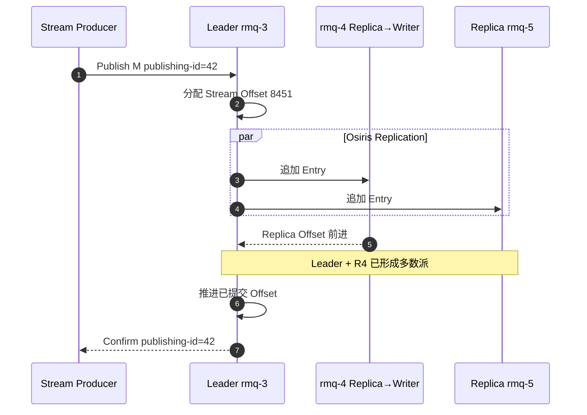
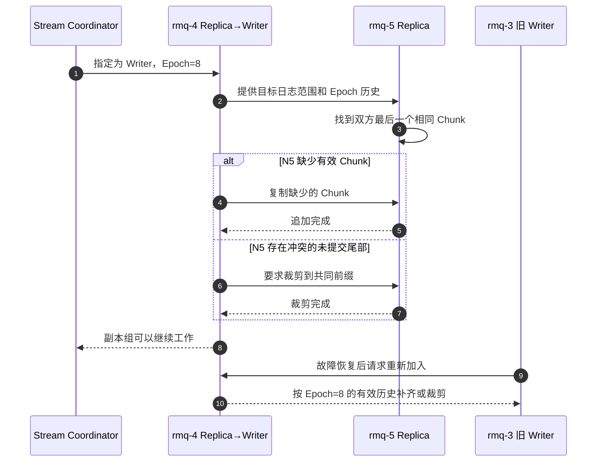
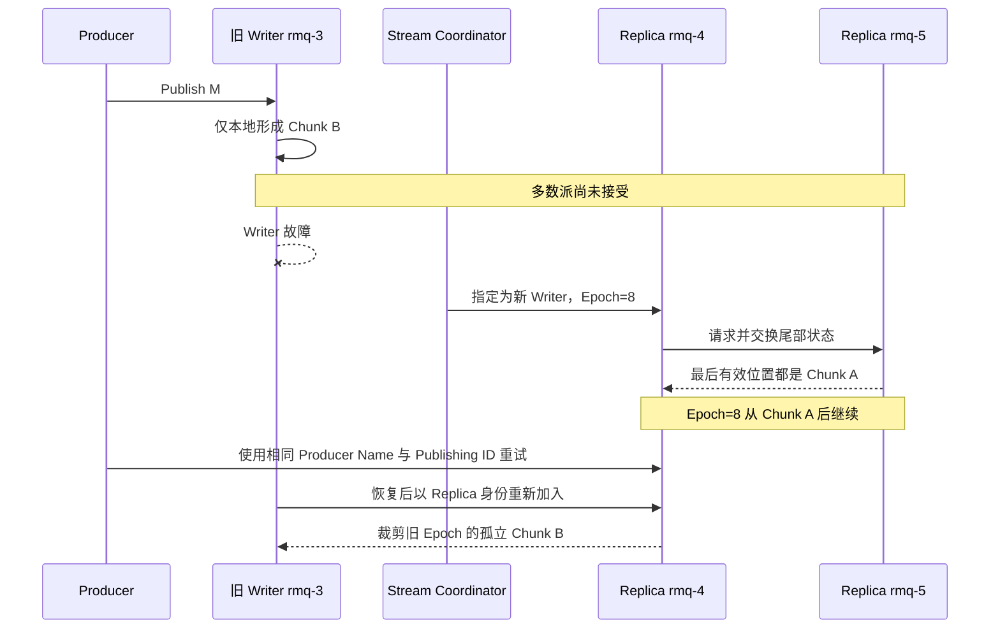
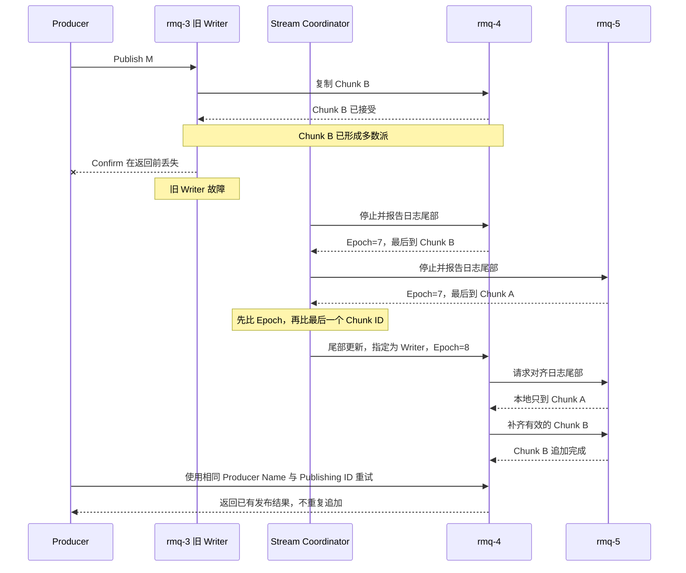
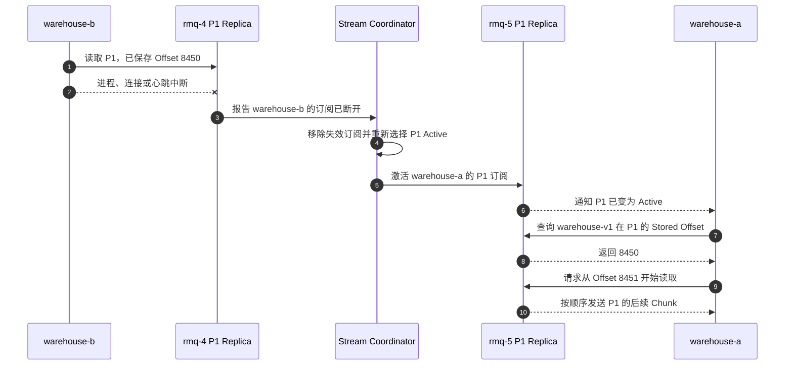

[第一篇](021_rabbitmq.md)已经说明普通 Stream、Super Stream、Stored Offset、SAC 和客户端连接路径。本文从 `order-events-1` Leader 收到事件的位置继续：事件如何映射到 Osiris 日志、何时返回 Publish Confirm、Leader 故障后怎样确定有效历史，以及分区、Offset 与消费顺序如何恢复。

<!-- more -->

## 1. 从 Super Stream 到磁盘文件

第一篇中的逻辑关系是：

```text
order-events Super Stream
    → Direct Exchange + Binding
    → order-events-0 / 1 / 2
```

真正保存消息的是三个普通 Stream。每个分区都有自己的：

- Writer Leader；
- Replica 成员；
- 单调递增 Offset；
- Osiris 追加日志；
- Chunk/Index 文件；
- Retention 与消费者 Tracking Record。

Super Stream 本身没有第四份合并日志，也没有覆盖三个分区的全局 Offset。

### 1.1 Osiris 日志如何组织

先给出完整的存储层级：

```text
order-events Super Stream          逻辑分区入口，本身不保存合并日志
└─ order-events-1                  一个真正保存数据的普通 Stream
   ├─ rmq-3 上的 Leader 副本       一份本地 Osiris 日志
   ├─ rmq-4 上的 Replica 副本      一份本地 Osiris 日志
   └─ rmq-5 上的 Replica 副本      一份本地 Osiris 日志

每个副本自己的 Stream 目录
├─ Segment 0 数据文件
│  ├─ Chunk A
│  │  ├─ Message Offset 8400
│  │  ├─ Message Offset 8401
│  │  └─ ...
│  └─ Chunk B
│     ├─ Message Offset 8430
│     └─ ...
├─ Segment 0 索引文件
├─ Segment 1 数据文件
│  └─ 当前正在追加的 Chunk
└─ Segment 1 索引文件
```

这里包含四个不同层次：

- **普通 Stream**：一条独立的追加日志，例如 `order-events-1`；它有自己的 Offset 空间、副本组和保留策略；
- **Stream 目录**：该 Stream 的一个副本在某台 RabbitMQ 节点上的本地存储。三副本意味着三台节点各自保存一份，不是共同读写一个共享目录；
- **Segment**：Stream 目录中的分段数据文件。单个文件达到滚动条件后，后续数据写入新的 Segment；Retention 也以整个 Segment 为边界删除旧数据；
- **Chunk**：Segment 文件内部的一批连续消息。Chunk 不是独立文件，它是 Osiris 写入、复制和向 Stream Consumer 传输数据的基本批次；
- **Message**：Chunk 中的业务消息。Offset 属于消息，并且只在当前普通 Stream 内单调递增。

因此，不能把 Chunk 和 Segment 看成同一个东西：

```text
Segment 解决：一个不断增长的日志怎样拆成可滚动、可删除的文件
Chunk 解决：多条消息怎样成批写入、复制和传输
Offset 解决：消费者怎样定位普通 Stream 中的某一条消息
```

#### 1.1.1 用 Offset 8451 走一遍写入过程

假设 `order-events-1` 当前目录里已经有两个 Segment：

```text
Segment 0：Offset 0～7999，已经关闭，不再追加
Segment 1：Offset 8000～现在，当前可写
```

Producer 连续发布三条订单事件。Leader `rmq-3` 为它们分配 Offset：

```text
OrderCreated   → Offset 8451
OrderPaid      → Offset 8452
OrderFulfilled → Offset 8453
```

Osiris 可以把这三条消息与同一时段到达的其他消息组成一个 Chunk，然后把整个 Chunk 追加到当前 Segment 1。一个 Chunk 有多少条消息不是固定的：流量高时批次通常更大，流量低时可能只有一条消息。

可以把追加后的局部内容理解成：

```text
Segment 1 数据文件
...
文件位置 120 KB：Chunk X，Offset 8400～8450
文件位置 168 KB：Chunk Y，Offset 8451～8480
文件位置 205 KB：Chunk Z，Offset 8481～...

Segment 1 索引文件
Offset 8400，时间 T1 → 数据文件位置 120 KB
Offset 8451，时间 T2 → 数据文件位置 168 KB
Offset 8481，时间 T3 → 数据文件位置 205 KB
```

这些数值只是为了展示关系，Segment 和 Chunk 实际容纳多少消息取决于消息大小、写入速率和配置，不是每 1000 个 Offset 固定切换一次。

#### 1.1.2 Consumer 如何根据 Offset 找到消息

假设 Consumer 请求从 Offset `8452` 开始读取，RabbitMQ 不需要从 Stream 开头扫描：

1. 根据各 Segment 覆盖的范围，找到包含 `8452` 的 Segment 1；
2. 查询 Segment 1 配套的索引文件，定位到起始 Offset 为 `8451` 的 Chunk Y；
3. 跳转到数据文件约 168 KB 的位置并读取 Chunk Y；
4. 在 Chunk 内跳过 Offset `8451`，从 `8452` 开始交给 Consumer；
5. 后续继续按 Chunk 顺序读取。

索引保存的是“Offset/时间戳到 Segment 文件位置”的定位信息，不保存另一份消息正文。每个 Segment 都有自己的索引文件，所以 Segment 删除时，对应数据文件和索引文件可以一起删除。

#### 1.1.3 Tracking Record 放在哪里

消费者保存的 Offset Tracking Record 也进入这条普通 Stream 的 Osiris 日志，并作为内部记录持久化和复制，但它不是业务消息。例如：

```text
warehouse-v1 已处理到 Offset 8450
→ 写入一条内部 Tracking Record
→ Consumer 重连时按 warehouse-v1 查询恢复位置
```

它不会作为一条 `OrderCreated` 交给普通业务 Consumer，也不会形成另一套独立存储。消息日志、Producer 去重信息和消费位置能够通过同一条 Osiris 日志恢复，后文第 4 节再解释 Stored Offset 的语义。

Tracking Record 的二进制布局、在 User Chunk Trailer 和 Tracking Delta Chunk 中的两种存放方式，以及 Snapshot 恢复过程，见[下一篇：Stream 的 Segment 与消费位点存储](024_rabbitmq_stream_storage.md)。

### 1.2 数据面与控制面不要混在一起

- **Osiris 数据面**保存和复制 Stream Entry、Offset 与 Tracking Record。
- **Stream Coordinator 控制面**管理 Stream 成员、Leader 生命周期、Replica 操作和 SAC 状态。
- Coordinator 基于 `Ra/Raft`，但不能因此把 Osiris 数据复制简单描述为 Quorum Queue 的 `rabbit_fifo + Ra`。

两种 Queue Type 都使用多数派思想，但状态机、磁盘布局和消费语义不同。

## 2. 从发布到 Publish Confirm

继续第一篇的分区布局：

```text
order-events-1
Leader:   rmq-3
Replica:  rmq-4
Replica:  rmq-5
```



发布涉及三个编号：

- Publishing ID：Producer 自己在某个 Producer Name 下递增，用于关联确认和去重；
- Stream Offset：RabbitMQ 为消息分配的分区内位置；
- Stored Offset：某个 Consumer Name 主动保存的恢复书签。

三者不在同一命名空间，也不能互相替代。

### 2.1 Confirm 的提交边界

三副本 Stream 不等待所有成员。Leader 看到当前 Entry 已存在于多数成员后，才能把对应 Publishing ID 确认为成功。

因此：

- Leader 仅本地追加不能返回可靠 Confirm；
- 一个 Replica 暂时变慢时，另外两个成员仍可形成多数派；
- 只剩一个成员时不能安全承诺新写入；
- Confirm 表示 Stream 存储接管，不表示 Consumer 已处理。

### 2.2 Confirm 与 fsync 的区别

RabbitMQ Stream 写入文件后依赖操作系统 Page Cache 和后台刷新，不对每条 Publish Confirm 都单独执行同步 fsync。

所以需要区分：

```text
多数派复制成功
≠ 每个成员都执行逐条 fsync
≠ 整个副本组同时断电绝不丢
```

三副本主要保护单节点进程、主机或磁盘故障。若故障模型包括整个机房同时断电，还需要可靠电源、文件系统、存储设备和跨故障域灾备共同保证。

## 3. 临界故障场景

理解故障恢复，先区分四个状态：

- **Epoch**：当前 Writer 的任期。Writer 切换后 Epoch 增加，用来阻止旧 Writer 继续写入；
- **本地尾部**：某个副本已经写到的最后一个 Chunk/Offset，各副本可能暂时不同；
- **已提交位置**：已经由多数副本接受的 Chunk 边界；
- **Publish Confirm**：Broker 把已提交结果通知 Producer。Confirm 丢失不等于提交结果消失。

Osiris 以 Chunk 为主要复制和对齐单位。Chunk ID 就是该 Chunk 的第一个 Offset，不是另一个从 0 开始的独立编号。下面用两个 Chunk 说明：

```text
Chunk A：Chunk ID=8400，包含 Offset 8400～8449，已经提交
Chunk B：Chunk ID=8450，包含 Offset 8450～8499，正在复制
旧 Writer Epoch：7
```

### 3.1 Writer 切换时，怎样对齐日志尾部

Writer 切换不是“选一台机器，然后以它的文件为准”。控制面和数据面分别完成两件事：

1. Stream Coordinator 检测旧 Writer 失联，先让仍在线的成员停止写入并报告各自的日志尾部；
2. 收集到当前 Epoch 下多数成员的停止及尾部报告后，Coordinator 就可以继续选举，不必等待所有存活成员。它在本轮候选中先比较最后一个 Epoch，再比较该 Epoch 的最后一个 Chunk ID，选择其中日志最新的成员；
3. 只有本轮多个候选报告完全相同的最新尾部时，Coordinator 才会在这些并列成员中选择一个。配置的首选节点也只能影响这个并列选择，不能让较短候选越过较长候选；尚未完成报告的成员不参与本轮比较；
4. Coordinator 把新的 Writer Epoch 从 7 推进到 8，并启动选中的 Writer；
5. 新 Writer 给 Replica 提供自己的日志范围和 `Epoch → 最后一个 Chunk ID` 历史。Replica 寻找双方最后一个相同的 Epoch 和 Chunk：较短就补齐，较长或存在冲突就先裁剪；
6. Replica 重新接入时向 Writer 报告自己的尾部进度，Writer 据此重新推进已提交 Chunk；副本组对齐后，才在 Epoch 8 下继续工作；
7. 旧 Writer 恢复时只能作为 Replica 加入，不能继续提交 Epoch 7 的尾部。



这里有两个关键判断：

- **是否相同**：看 Chunk 的位置和 Epoch 历史，而不是只比较“谁的 Offset 数字更大”；
- **是否保留**：以新 Writer 所代表的有效历史和已提交边界为准，而不是看 Producer 是否恰好收到了 Confirm。

多数派相交说明已提交数据不会只留在已经故障的节点上；Epoch 与尾部对齐过程则负责找出这段数据，并排除旧 Writer 的孤立分支。

#### 已提交位置从哪里来

正常复制时，每个 Replica 会把“我已经接受到哪个 Chunk”报告给 Writer。Writer 保存各成员的复制进度；三副本中至少两个成员到达 Chunk B 时，Writer 才能把 `committed_chunk_id` 推进到 `8450`，并确认 Chunk B 中的发布。

```text
rmq-3 Writer：  已到 Chunk B
rmq-4 Replica：已到 Chunk B  ┐
rmq-5 Replica：已到 Chunk A  ┴─ rmq-3 + rmq-4 已形成多数派

committed_chunk_id = 8450
```

`committed_chunk_id` 是运行时维护的提交边界，不是额外写一份“已提交消息文件”。真正留在磁盘上、可供故障恢复比较的是 Chunk，以及索引中的 Chunk ID 和 Epoch。Writer 重启或切换后，Replica 会重新报告尾部，新的 Writer 据这些报告重新发现提交边界。因此，切换时不是让三个节点互相修改一个共享变量，而是先用持久化日志选出一致历史，再由副本进度重新推进提交位置。

### 3.2 Chunk B 只在旧 Writer，Writer 随即故障



故障前状态是：

```text
rmq-3：Chunk A + Chunk B，Chunk B 仅本地存在
rmq-4：Chunk A
rmq-5：Chunk A
```

rmq-4 与 rmq-5 形成的新多数派都只到 Chunk A，因此有效尾部就是 Chunk A。rmq-3 恢复后，Chunk B 虽然物理上还在旧节点的文件里，但它属于旧 Epoch 的未提交孤立尾部，必须裁剪，不能重新注入新历史。

Producer 没收到 Confirm，只能把结果视为未知并使用相同 Producer Name 与 Publishing ID 重试。

### 3.3 Chunk B 已到多数派，但 Confirm 丢失

故障前状态变成：

```text
rmq-3：Chunk A + Chunk B
rmq-4：Chunk A + Chunk B
rmq-5：Chunk A
Producer：没有收到 Chunk B 中消息的 Confirm
```



#### 会不会选择只有 Chunk A 的 rmq-5

在上面的确切状态下，**不会**。

Coordinator 不是从存活节点中随机选择 Writer。旧 Writer 故障后，它先取得剩余成员从本地日志读出的尾部：

```text
rmq-4：{最后 Epoch=7，最后 Chunk ID=8450}  ← Chunk B
rmq-5：{最后 Epoch=7，最后 Chunk ID=8400}  ← Chunk A
```

两者 Epoch 相同，所以继续比较最后一个 Chunk ID。rmq-4 的尾部更新，只有 rmq-4 具备成为新 Writer 的资格；rmq-5 即使被配置为首选节点，也不能越过 rmq-4。这样，旧多数派中保留 Chunk B 的成员成为新历史的基准，再把 Chunk B 补给 rmq-5。

rmq-5 只有在选举前也已经收到 Chunk B，并报告与 rmq-4 相同的最新尾部时，才可能在并列选择中成为 Writer：

```text
rmq-4：{7, 8450}
rmq-5：{7, 8450}  ← 此时已包含 Chunk B
```

这时选择 rmq-5 是安全的，因为它已经拥有要保留的尾部。核心规则不是“绝不选择 rmq-5”，而是“**较短的 rmq-5 不能当选；追平后的 rmq-5 可以当选**”。

因此，Chunk B 已经进入旧多数派后，不会因为 Writer 切换而被较短副本覆盖。多数派相交保证新的可用多数派中至少有成员保留它，尾部比较保证这个成员所代表的更新历史被选中，随后其他副本再补齐。

对 Producer 来说，Confirm 仍可能在网络中丢失，因此客户端只知道“结果未知”：

- 使用稳定 Producer Name 与 Publishing ID 重试时，Broker 可以识别重复发布；
- 去重状态有生命周期和边界，Consumer 仍应按业务事件 ID 幂等；
- 如果 Confirm 已经到达，Producer 可以把该消息视为已被 RabbitMQ Stream 接管，但仍不代表 Consumer 已完成业务处理。

### 3.4 五副本中只有两份新数据，能否恢复

上一节的三副本中，旧 Writer 与一个 Replica 已构成多数派。换成五副本后，两份数据就不再具有相同保证。

用 A～E 表示五个节点，M 表示新 Chunk 中的消息。假设新 Chunk 已在 A、B 完整追加，各副本最后 Epoch 相同，随后 A 故障：

```text
A：旧日志 + M    ← 原 Writer，随后故障
B：旧日志 + M
C：旧日志
D：旧日志
E：旧日志

多数派 = 3，M 只有 2 份，尚未提交
```

**选最新的规则只作用于本轮已收集到的候选集合，不保证收集到整个副本组的最新尾部。** 因而恢复有两条路径：

| 先形成的候选多数派 | 新 Writer | M 的结果 |
|---|---|---|
| B、C、D 完成停止并报告尾部 | 同 Epoch 下 B 最新，选择 B | 保留 M；后续复制达到多数派后可以提交 |
| C、D、E 完成报告，B 尚未完成报告 | 三者尾部相同，选择其中一个 | 新历史不含 M；B 后续加入时按新 Writer 的历史对齐并裁剪这段尾部 |

第二条路径不要求 B 也故障，B 的停止或尾部报告较慢就可能形成这个时序。B 迟到后不能凭旧 Epoch 中较长的尾部推翻已经选出的新 Writer。

源码中的处理顺序是：`member_stopped` 更新成员状态，`stopped_in_epoch` 收集当前 Epoch 的候选，`is_quorum` 判断候选数，满足多数派后执行选主；`select_leader` 才在候选中比较 Epoch 和最后一个 Chunk ID。参见 [Stream Coordinator 实现](https://github.com/rabbitmq/rabbitmq-server/blob/main/deps/rabbit/src/rabbit_stream_coordinator.erl)。

三副本和五副本的差别来自多数派相交：

```text
三副本，A、B 有 M：已经达到多数派
→ A 故障后，B、C 的报告缺一不可，不能绕过 B

五副本，A、B 有 M：尚未达到多数派
→ A 故障后，C、D、E 就能组成候选多数派，可以绕过 B
```

如果五副本中 A、B、C 都已接受 M，那么任何三个成员组成的候选多数派都会与这三份数据相交。在正常故障恢复、数据未损坏且不强制重建成员组的前提下，已经提交的历史受到保护。

#### 与 Kafka 未提交尾部恢复的区别

| 比较点 | RabbitMQ Stream | Kafka 正常 Leader 选举 |
|---|---|---|
| 候选如何形成 | 收集当前 Epoch 下停止并报告尾部的多数成员 | 根据 ISR / ELR 规则与节点可用性确定资格 |
| 如何选择 | 在本轮候选中比较 Epoch、Chunk ID，选最新尾部 | 根据副本顺序及资格选择，不比较所有候选的最新日志尾部 |
| 持有 M 的 B 已参与本轮候选 | 同 Epoch 且 B 唯一最新时，选择 B | B 有资格也不代表一定选 B |
| 未提交 M 是否保证保留 | 不保证，候选多数派可能不含 B | 不保证，选中的安全候选可能不含 M |

因此不能概括成“RabbitMQ 一定恢复，Kafka 随机恢复”。两者都允许未提交尾部保留或被裁剪，只是形成候选和选择新主的规则不同。Kafka 的具体路径见 [Kafka 未提交消息恢复](012_kafka_implementation.md#323-m-尚未-commita-就故障)。

另外，“没有收到 Confirm”包括尚未提交与已经提交但响应丢失两种状态。客户端无法仅凭超时区分它们，仍应使用稳定的发布标识重试。

### 3.5 只剩一个副本，无法形成多数派

`order-events-1` 只剩 rmq-5 时必须停止安全写入，但 `order-events-0` 和 `order-events-2` 可能仍然健康。

这说明可用性单位是普通 Stream 分区，不是整个 Super Stream。应用要决定：

- 是否允许健康分区继续生产；
- 部分分区不可用时是否暂停整个业务；
- Producer 如何重试且不改变业务 Key 的分区归属；
- 告警按分区还是按 Super Stream 聚合。

## 4. Stored Offset 如何持久化和恢复

假设 `warehouse-v1` 在 `order-events-1` 处理到 Offset 8450，然后主动保存：

```text
consumer_name=warehouse-v1
stream=order-events-1
offset=8450
```

Broker 把它编码成 Offset Tracking Record 并追加到对应 Osiris Stream。它随 Stream 数据复制，因此 Leader 切换后可以查询恢复。

### 4.1 为什么它不是 Ack

Stored Offset只回答“应用希望从哪里恢复”，不回答：

- Offset 8450 的外部数据库事务是否一定提交；
- 8450 以前的消息能否立即删除；
- 其他 Consumer 是否处理到同一位置；
- Broker 当前已经推送到哪里。

Stream 当前 Delivery Offset、应用内存处理位置和 Stored Offset 可以不同：

```text
已收到：     8499
业务已完成： 8480
已持久保存： 8450
```

此时进程故障，新实例从 8450 附近恢复，8451～8480 可能重复，这是正常的至少一次窗口。

### 4.2 Tracking Record 不阻止 Retention

Stored Offset 是书签，不是数据保留锁。Retention 删除旧 Chunk 后，如果 Stored Offset 落在当前最早 Offset 之前，Consumer 只能从仍存在的最早位置恢复。

因此最大保留时间必须覆盖：

```text
最长离线时间
+ 故障发现与修复时间
+ 重放处理时间
+ 安全余量
```

不能只根据正常情况下的 Consumer Lag 设置 Retention。

## 5. Consumer Rebalance 如何完成

先区分两种消费方式：

- **普通 Stream 订阅**：每个 Consumer 都有自己的读取位置，三个 Consumer 默认会各自读取一遍完整日志，没有统一的分区分配，也没有 Kafka 式 Rebalance；
- **Super Stream + SAC**：同名 Consumer 组成一组。每个普通 Stream 分区只选一个 Active Subscription，其余订阅待命；成员变化时，Stream Coordinator 重新选择各分区的 Active Consumer。这才是本节所说的 Rebalance。

### 5.1 Rebalance 需要协调哪些状态

只有三类状态需要先对齐：

- **成员状态**：哪些 Consumer 仍在线，各自在 Super Stream 的哪些分区上建立了订阅；
- **分区归属**：每个分区当前由哪个 Subscription Active，哪些 Subscription Standby；
- **恢复位置**：`Consumer Name + 普通 Stream 分区` 对应的 Stored Offset。它决定新 Active 从哪里继续。

前两类是 Stream Coordinator 管理的 SAC 控制状态，并通过 Ra/Raft 复制；第三类是写进各普通 Stream Osiris 日志的 Tracking Record。Coordinator 决定“谁接管”，Stored Offset 决定“从哪里接着读”。

### 5.2 初始分配示例

假设三个应用实例都以 Consumer Name `warehouse-v1` 订阅三分区 Super Stream：

```text
warehouse-a：order-events-0 Active，P1/P2 Standby
warehouse-b：order-events-1 Active，P0/P2 Standby
warehouse-c：order-events-2 Active，P0/P1 Standby
```

这不是把一个消息在三个 Worker 中随机挑一个投递。每个应用实例都为各分区建立订阅，由 Coordinator 对每个分区分别指定一个 Active；因此三个分区可以并行，但同一分区同一时刻只有一个活动订阅。

### 5.3 warehouse-b 故障后的完整过程

假设 `warehouse-b` 正在从 `rmq-4` 上的 `order-events-1` Replica 读取，最近一次持久保存的 Offset 是 8450。



完整过程是：

1. `rmq-4` 通过连接关闭或心跳超时发现 `warehouse-b` 失联；
2. Stream Coordinator 删除它的活动订阅，从同名待命订阅中为 `order-events-1` 选择新的 Active；
3. `warehouse-a` 收到激活通知，经自己所连接的 `rmq-5` 查询 `warehouse-v1 + order-events-1` 的 Stored Offset；
4. Broker 从 P1 的 Osiris 日志读出 8451 之后的数据，交给 `warehouse-a`；
5. `order-events-0` 和 `order-events-2` 的 Active 没有变化，可以继续消费，只有 P1 短暂停顿。

如果 `warehouse-b` 已经处理了 8451～8455，但故障前只持久保存到 8450，新 Active 会再次收到这五条消息。这是至少一次恢复的重复窗口，不是 Rebalance 出错。应用必须在业务侧幂等，并在业务处理完成后再推进 Stored Offset。

### 5.4 Rebalance 能保证什么

- Coordinator 保证每个分区只有一个被认可的 Active Subscription；
- Rebalance 不迁移 Consumer 内存中的处理中任务，只根据最后保存的 Offset 恢复；
- 故障检测和重新激活之间会有短暂停顿；旧实例已拿到但尚未完成的消息可能与新实例重读重叠；
- `warehouse-b` 恢复后会重新注册为同名订阅，由 Coordinator 决定它保持 Standby 还是接管某个分区；
- SAC 保证分区内的单活动投递，不保证应用线程池串行完成，也不提供跨分区全局顺序。

## 6. Super Stream 的分区与扩容

客户端使用路由函数把业务 Key 映射成 Binding Key，再选择普通 Stream：

```text
hash(order-1001) → binding-key 1 → order-events-1
```

顺序保证成立需要同时满足：

- 同一业务 Key 使用稳定序列化；
- 分区算法和分区集合不变；
- Producer 不在失败重试时随意换分区；
- 单分区日志按 Offset 追加；
- Consumer 对同一 Key 不并发乱序完成。

### 6.1 增加分区为什么不是无损操作

从 3 个分区增加到 4 个分区时，简单取模会让大量 Key 改变结果：

```text
hash(key) % 3 ≠ hash(key) % 4
```

同一订单的新事件可能进入新分区，而旧事件仍在旧分区，跨分区顺序无法继续比较。常用做法包括：

- 预留足够分区；
- 使用显式路由表或虚拟节点；
- 在版本边界切换路由并记录映射版本；
- 迁移期让 Consumer 合并两个分区并按业务版本校验。

Super Stream 不提供自动跨分区事务或历史重排。

## 7. 副本修复与成员变更

Replica 落后时从 Leader 复制缺失的 Chunk/记录；缺口过大时需要以当前有效日志重新同步。恢复完成前不能把“进程已启动”当作副本健康。

成员调整遵循：

```text
添加 Replica
→ 等待数据同步
→ 验证 Leader/Replica 状态
→ 再移除旧 Replica
```

提高副本数增加故障容忍和写放大，不增加单分区吞吐。扩展吞吐依赖增加普通 Stream 分区并重新设计 Key 映射。

## 8. 保留、积压与容量

Stream 容量近似为：

```text
写入速率 × 平均消息大小 × 保留时间 × 副本数
+ Chunk/Index/Tracking 开销
+ 副本重同步临时空间
```

需要观察：

- 每个分区的写入速率、Confirm 延迟和未确认发布；
- Leader 分布、Replica 在线状态和同步进度；
- 当前最早/最新 Offset、Chunk 数和磁盘使用；
- Consumer 当前位置与 Stored Offset 的差距；
- SAC Active/Standby 状态和切换次数；
- Retention 删除速度与最慢 Consumer 可恢复位置。

Stream 依赖磁盘顺序 I/O。大量小 Stream、极小 Chunk、频繁 Tracking 更新或热点分区都会增加元数据、文件和调度开销。

## 9. 跨地域边界

跨地域同步副本会把广域网 RTT 和抖动带入 Confirm，并增加分区失去多数派的概率。更常见的设计是两地独立集群，通过 Federation、Shovel 或业务复制链路异步传递。

异步灾备必须明确：

- RPO/RTO；
- 哪一侧可以写；
- 分区映射是否一致；
- Stored Offset 是否需要单独迁移；
- 重复和乱序窗口；
- 回切时如何防止双写。

## 10. 实现结论

- Super Stream 是多个普通 Stream 的路由组合，真正的数据与故障单位是普通 Stream 分区。
- Osiris 保存追加日志和 Tracking Record，Stream Coordinator 管成员与 SAC 控制状态。
- Publish Confirm 在分区多数副本接受后返回，不等待全部成员。
- 多数派提交和逐条 fsync 是两个问题，不能把前者夸大成整组断电零丢失。
- Stored Offset 是可复制恢复书签，不是 Queue Ack，也不阻止 Retention。
- 普通 Stream 没有统一的 Consumer Rebalance；Super Stream 配合 SAC 后，Coordinator 才会按分区切换 Active Subscription。
- SAC 解决活动实例选择，不解决业务幂等和跨分区顺序。
- 副本数解决容错，分区数解决吞吐；增加分区会影响 Key 映射。

## 11. 参考资料

- [RabbitMQ Streams](https://www.rabbitmq.com/docs/streams)
- [RabbitMQ Stream Plugin](https://www.rabbitmq.com/docs/stream)
- [RabbitMQ Stream 磁盘布局与过滤](https://www.rabbitmq.com/docs/stream-filtering)
- [RabbitMQ Stream Filtering Internals](https://www.rabbitmq.com/blog/2023/10/24/stream-filtering-internals)
- [RabbitMQ Super Streams](https://www.rabbitmq.com/docs/stream)
- [RabbitMQ Stream Connections](https://www.rabbitmq.com/docs/stream-connections)
- [RabbitMQ Osiris](https://github.com/rabbitmq/osiris)
- [RabbitMQ Stream Coordinator：Writer 选择实现](https://github.com/rabbitmq/rabbitmq-server/blob/main/deps/rabbit/src/rabbit_stream_coordinator.erl)
- [Osiris 日志格式与 Replica 尾部裁剪实现](https://github.com/rabbitmq/osiris/blob/main/src/osiris_log.erl)
- [RabbitMQ Stream Single Active Consumer](https://www.rabbitmq.com/blog/2022/07/05/rabbitmq-3-11-feature-preview-single-active-consumer-for-streams)
- [RabbitMQ Stream Java Client：Super Stream 与 SAC](https://rabbitmq.github.io/rabbitmq-stream-java-client/snapshot/htmlsingle/)
- [RabbitMQ Monitoring](https://www.rabbitmq.com/docs/monitoring)
