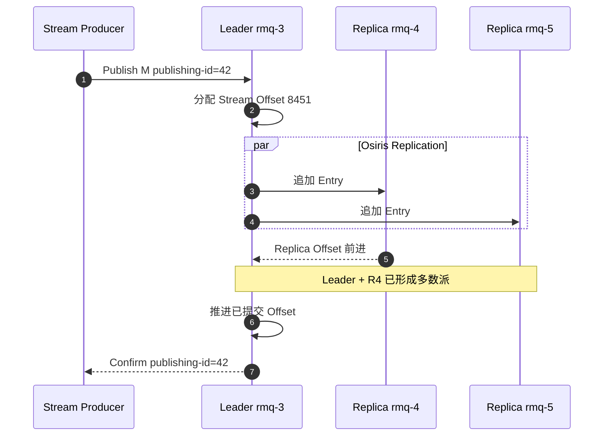
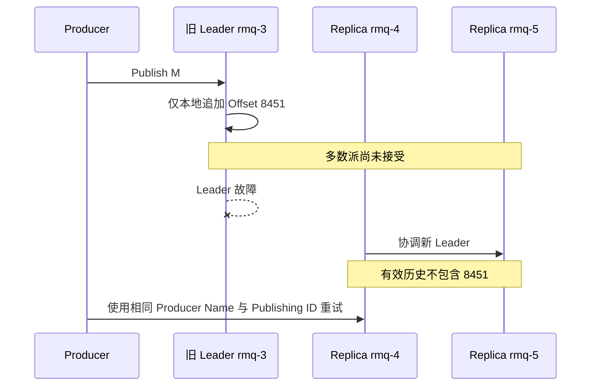

[第一篇](021_rabbitmq.md)已经说明普通 Stream、Super Stream、Stored Offset、SAC 和客户端连接路径。本文从 `order-events-1` Leader 收到事件的位置继续：事件如何映射到 Osiris 日志、何时返回 Publish Confirm、Leader 故障后怎样确定有效历史，以及分区、Offset 与消费顺序如何恢复。

<!-- more -->

## 1. 从 Super Stream 到磁盘 Chunk

第一篇中的逻辑关系是：

```text
order-events Super Stream
    → Direct Exchange + Binding
    → order-events-0 / 1 / 2
```

真正保存消息的是三个普通 Stream。每个分区都有自己的：

- Writer Leader；
- Replica 成员；
- 单调递增 Offset；
- Osiris 追加日志；
- Chunk/Index 文件；
- Retention 与消费者 Tracking Record。

Super Stream 本身没有第四份合并日志，也没有覆盖三个分区的全局 Offset。

### 1.1 Osiris 日志如何组织

可以把 `order-events-1` 理解成：

```text
Stream Offset
0 ... 999       → Chunk 000
1000 ... 1999   → Chunk 001
2000 ... 2499   → 当前 Chunk 002
```

Chunk 是磁盘存储与清理单位，Index 帮助按 Offset 或时间定位。消息按追加顺序进入当前 Chunk；Chunk 达到条件后关闭并滚动到新 Chunk。

消费者保存的 Offset Tracking Record 也写入 Stream 存储，但它不是业务消息。RabbitMQ可以根据消费者引用更新 Tracking 信息；它不会让业务消费者读到一条普通订单事件。

### 1.2 数据面与控制面不要混在一起

- **Osiris 数据面**保存和复制 Stream Entry、Offset 与 Tracking Record。
- **Stream Coordinator 控制面**管理 Stream 成员、Leader 生命周期、Replica 操作和 SAC 状态。
- Coordinator 基于 `Ra/Raft`，但不能因此把 Osiris 数据复制简单描述为 Quorum Queue 的 `rabbit_fifo + Ra`。

两种 Queue Type 都使用多数派思想，但状态机、磁盘布局和消费语义不同。

## 2. 从发布到 Publish Confirm

继续第一篇的分区布局：

```text
order-events-1
Leader:   rmq-3
Replica:  rmq-4
Replica:  rmq-5
```



发布涉及三个编号：

- Publishing ID：Producer 自己在某个 Producer Name 下递增，用于关联确认和去重；
- Stream Offset：RabbitMQ 为消息分配的分区内位置；
- Stored Offset：某个 Consumer Name 主动保存的恢复书签。

三者不在同一命名空间，也不能互相替代。

### 2.1 Confirm 的提交边界

三副本 Stream 不等待所有成员。Leader 看到当前 Entry 已存在于多数成员后，才能把对应 Publishing ID 确认为成功。

因此：

- Leader 仅本地追加不能返回可靠 Confirm；
- 一个 Replica 暂时变慢时，另外两个成员仍可形成多数派；
- 只剩一个成员时不能安全承诺新写入；
- Confirm 表示 Stream 存储接管，不表示 Consumer 已处理。

### 2.2 Confirm 与 fsync 的区别

RabbitMQ Stream 写入文件后依赖操作系统 Page Cache 和后台刷新，不对每条 Publish Confirm 都单独执行同步 fsync。

所以需要区分：

```text
多数派复制成功
≠ 每个成员都执行逐条 fsync
≠ 整个副本组同时断电绝不丢
```

三副本主要保护单节点进程、主机或磁盘故障。若故障模型包括整个机房同时断电，还需要可靠电源、文件系统、存储设备和跨故障域灾备共同保证。

## 3. 三个临界故障场景

### 3.1 尚未复制到多数派，Leader 故障



Producer 没收到 Confirm，只能按未知结果处理。此例中 M 没有达到多数派，新 Leader 不会把旧 Leader 的孤立尾部作为有效消息。

旧节点恢复后必须追赶当前 Stream 历史，冲突或超出的未提交尾部不能重新注入。

### 3.2 多数派已经接受，Confirm 丢失

如果 rmq-3 与 rmq-4 已经接受 M，随后 Leader 或网络在 Confirm 返回前故障：

- 新 Leader 仍保留 M；
- Producer 只看到超时；
- 使用稳定 Producer Name 与 Publishing ID重试时，Broker 可以识别重复发布；
- 去重状态有生命周期和边界，Consumer仍应按业务事件 ID 幂等。

### 3.3 分区失去多数派

`order-events-1` 只剩 rmq-5 时必须停止安全写入，但 `order-events-0` 和 `order-events-2` 可能仍然健康。

这说明可用性单位是普通 Stream 分区，不是整个 Super Stream。应用要决定：

- 是否允许健康分区继续生产；
- 部分分区不可用时是否暂停整个业务；
- Producer 如何重试且不改变业务 Key 的分区归属；
- 告警按分区还是按 Super Stream 聚合。

## 4. Leader 切换如何确定有效 Offset

每个 Replica 都拥有自己已经追加的 Offset 范围。有效历史必须由具备最新已确认共同前缀的成员接管。

第一性原理是：

1. 已确认 Entry 至少存在于旧多数派；
2. 新 Leader 必须由可用多数成员协调产生；
3. 两个多数派一定相交；
4. 因而新 Leader 不能合法选择一条缺失已确认共同前缀的历史；
5. 恢复成员以新 Leader 为准截断或补齐尾部。

客户端不参与判断哪些 Offset 已提交。Producer是否收到 Confirm 也不是选主输入：Confirm 可能已经生成但丢失，消息仍属于有效历史。

## 5. Stored Offset 如何持久化和恢复

假设 `warehouse-v1` 在 `order-events-1` 处理到 Offset 8450，然后主动保存：

```text
consumer_name=warehouse-v1
stream=order-events-1
offset=8450
```

Broker 把它编码成 Offset Tracking Record 并追加到对应 Osiris Stream。它随 Stream 数据复制，因此 Leader 切换后可以查询恢复。

### 5.1 为什么它不是 Ack

Stored Offset只回答“应用希望从哪里恢复”，不回答：

- Offset 8450 的外部数据库事务是否一定提交；
- 8450 以前的消息能否立即删除；
- 其他 Consumer 是否处理到同一位置；
- Broker 当前已经推送到哪里。

Stream 当前 Delivery Offset、应用内存处理位置和 Stored Offset 可以不同：

```text
已收到：     8499
业务已完成： 8480
已持久保存： 8450
```

此时进程故障，新实例从 8450 附近恢复，8451～8480 可能重复，这是正常的至少一次窗口。

### 5.2 Tracking Record 不阻止 Retention

Stored Offset 是书签，不是数据保留锁。Retention 删除旧 Chunk 后，如果 Stored Offset 落在当前最早 Offset 之前，Consumer 只能从仍存在的最早位置恢复。

因此最大保留时间必须覆盖：

```text
最长离线时间
+ 故障发现与修复时间
+ 重放处理时间
+ 安全余量
```

不能只根据正常情况下的 Consumer Lag 设置 Retention。

## 6. SAC 状态如何恢复

SAC 对每个 `Consumer Name + Stream Partition` 协调一个 Active Subscription。其控制状态由 Stream Coordinator 管理并通过 Raft 复制。

活动 Consumer 断开后：

1. Connection/Subscription 的本地内存状态消失；
2. Coordinator 观察成员变化；
3. 同名待命 Consumer 中选出新的 Active；
4. 新 Active 查询 Stored Offset；
5. 从保存位置继续接收。

SAC 解决“当前由谁收”，Stored Offset解决“从哪里继续”。只有 SAC 没有 Offset，接管者仍不知道业务恢复位置；只有 Offset 没有 SAC，多个实例可能同时读取同一分区。

SAC 保证同一分区的单活动投递，但不保证应用线程池串行完成，也不提供跨分区全局顺序。

## 7. Super Stream 的分区与扩容

客户端使用路由函数把业务 Key 映射成 Binding Key，再选择普通 Stream：

```text
hash(order-1001) → binding-key 1 → order-events-1
```

顺序保证成立需要同时满足：

- 同一业务 Key 使用稳定序列化；
- 分区算法和分区集合不变；
- Producer 不在失败重试时随意换分区；
- 单分区日志按 Offset 追加；
- Consumer 对同一 Key 不并发乱序完成。

### 7.1 增加分区为什么不是无损操作

从 3 个分区增加到 4 个分区时，简单取模会让大量 Key 改变结果：

```text
hash(key) % 3 ≠ hash(key) % 4
```

同一订单的新事件可能进入新分区，而旧事件仍在旧分区，跨分区顺序无法继续比较。常用做法包括：

- 预留足够分区；
- 使用显式路由表或虚拟节点；
- 在版本边界切换路由并记录映射版本；
- 迁移期让 Consumer 合并两个分区并按业务版本校验。

Super Stream 不提供自动跨分区事务或历史重排。

## 8. 副本修复与成员变更

Replica 落后时从 Leader 复制缺失的 Chunk/记录；缺口过大时需要以当前有效日志重新同步。恢复完成前不能把“进程已启动”当作副本健康。

成员调整遵循：

```text
添加 Replica
→ 等待数据同步
→ 验证 Leader/Replica 状态
→ 再移除旧 Replica
```

提高副本数增加故障容忍和写放大，不增加单分区吞吐。扩展吞吐依赖增加普通 Stream 分区并重新设计 Key 映射。

## 9. 保留、积压与容量

Stream 容量近似为：

```text
写入速率 × 平均消息大小 × 保留时间 × 副本数
+ Chunk/Index/Tracking 开销
+ 副本重同步临时空间
```

需要观察：

- 每个分区的写入速率、Confirm 延迟和未确认发布；
- Leader 分布、Replica 在线状态和同步进度；
- 当前最早/最新 Offset、Chunk 数和磁盘使用；
- Consumer 当前位置与 Stored Offset 的差距；
- SAC Active/Standby 状态和切换次数；
- Retention 删除速度与最慢 Consumer 可恢复位置。

Stream 依赖磁盘顺序 I/O。大量小 Stream、极小 Chunk、频繁 Tracking 更新或热点分区都会增加元数据、文件和调度开销。

## 10. 跨地域边界

跨地域同步副本会把广域网 RTT 和抖动带入 Confirm，并增加分区失去多数派的概率。更常见的设计是两地独立集群，通过 Federation、Shovel 或业务复制链路异步传递。

异步灾备必须明确：

- RPO/RTO；
- 哪一侧可以写；
- 分区映射是否一致；
- Stored Offset 是否需要单独迁移；
- 重复和乱序窗口；
- 回切时如何防止双写。

## 11. 实现结论

- Super Stream 是多个普通 Stream 的路由组合，真正的数据与故障单位是普通 Stream 分区。
- Osiris 保存追加日志和 Tracking Record，Stream Coordinator 管成员与 SAC 控制状态。
- Publish Confirm 在分区多数副本接受后返回，不等待全部成员。
- 多数派提交和逐条 fsync 是两个问题，不能把前者夸大成整组断电零丢失。
- Stored Offset 是可复制恢复书签，不是 Queue Ack，也不阻止 Retention。
- SAC 解决活动实例选择，不解决业务幂等和跨分区顺序。
- 副本数解决容错，分区数解决吞吐；增加分区会影响 Key 映射。

## 12. 参考资料

- [RabbitMQ Streams](https://www.rabbitmq.com/docs/streams)
- [RabbitMQ Stream Plugin](https://www.rabbitmq.com/docs/stream)
- [RabbitMQ Super Streams](https://www.rabbitmq.com/docs/stream)
- [RabbitMQ Stream Connections](https://www.rabbitmq.com/docs/stream-connections)
- [RabbitMQ Osiris](https://github.com/rabbitmq/osiris)
- [RabbitMQ Stream Single Active Consumer](https://www.rabbitmq.com/blog/2022/07/05/rabbitmq-3-11-feature-preview-single-active-consumer-for-streams)
- [RabbitMQ Monitoring](https://www.rabbitmq.com/docs/monitoring)
