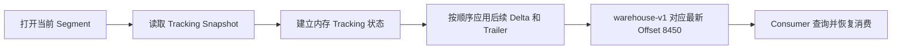

[上一篇](023_rabbitmq_stream_implementation.md)已经说明 Stream 的复制、确认和故障恢复。本文继续向下看 Osiris 的本地存储格式。

本文暂时只回答一个问题：Consumer 调用 `storeOffset("warehouse-v1", 8450)` 后，`warehouse-v1 → 8450` 究竟怎样进入 Segment，又怎样被重新找到。

先纠正名称：RabbitMQ 官方称它为 **Stored Offset**，而不是 Shared Offset。多个 Consumer 可以使用同一个名字读取同一份 Stored Offset，但它本质上仍是一条保存在 Stream 日志中的消费进度记录。

<!-- more -->

## 1. Tracking Record 与 Stored Offset 如何存储在 Segment 内

先给出全貌：

```text
一个 Stream 在一台副本节点上的本地目录
│
├── Segment A 数据文件
│   ├── Segment Header
│   ├── User Chunk
│   │   ├── Chunk Header
│   │   ├── Bloom Filter
│   │   ├── Data：业务消息
│   │   └── Trailer：可附带 Tracking Record
│   ├── Tracking Delta Chunk：消费位点等增量记录
│   └── ...
│
├── Segment A 索引文件：一条记录定位一个 Chunk
│
├── Segment B 数据文件
│   ├── Tracking Snapshot Chunk：已有 Tracking 状态的快照
│   ├── User Chunk
│   └── ...
│
└── Segment B 索引文件
```

其中包含两条不同的定位链路：

```text
读取业务消息：消息 Offset → Segment → Chunk 索引项 → 数据文件位置

查询消费位点：Consumer 名称 → 内存 Tracking 状态 → Stored Offset
                                  ↑
                     启动时由 Snapshot 和后续增量恢复
```

因此，理解 Stored Offset 之前，必须先把 Segment、Chunk 和索引文件分开。

### 1.1 Segment 不是一个 Chunk，而是一组 Chunk 的容器

每个普通 Stream 的每个副本都有自己的本地 Osiris 日志。日志持续增长，因此不能永久写进一个大文件，而是被滚动成多个 Segment。

一个 Segment 通常对应两个配套文件：

```text
00000000000000000000.segment   保存 Chunk 的完整内容
00000000000000000000.index     保存这些 Chunk 在数据文件中的位置
```

文件名只用于示意。核心关系是：一个 `.segment` 数据文件配一个 `.index` 索引文件。当前 Segment 达到配置的大小或 Chunk 数量条件后，Osiris 关闭它，并继续写下一个 Segment。Retention 删除旧数据时，也以整个 Segment 为基本边界。

`.segment` 文件内部不是一条条裸消息，而是：

```text
Segment Header
Chunk 1
Chunk 2
Chunk 3
...
```

Segment Header 保存 `OSIL` 魔数和格式版本，用于判断它是否是 Osiris 日志文件，以及应当按照哪个版本解析。真正的业务数据和内部状态都在后续 Chunk 中。

### 1.2 Chunk 是写入、复制和读取的基本批次

一个 Chunk 可以装一条消息，也可以装一批消息。它还是 Osiris 在副本间复制、向 Stream Consumer 发送数据时使用的基本单位。

Chunk 由四部分组成：

```text
┌──────────────────────────────────────────────┐
│ Chunk Header                                 │
│ 类型、记录数量、时间戳、Epoch、ChunkId、CRC、 │
│ Data 长度、Trailer 长度、Bloom Filter 长度等  │
├──────────────────────────────────────────────┤
│ Bloom Filter                                 │
│ 用于基于 Filter Value 跳过不可能匹配的 Chunk │
├──────────────────────────────────────────────┤
│ Data                                         │
│ User Chunk 中是业务消息；Tracking Chunk 中是 │
│ Tracking 数据                                │
├──────────────────────────────────────────────┤
│ Trailer                                      │
│ User Chunk 可在这里附带 Tracking Record      │
└──────────────────────────────────────────────┘
```

Header 中最需要理解的是下面几项：

- **Chunk Type**：说明这个 Chunk 保存业务消息、Tracking 增量还是 Tracking 快照；
- **Number of Entries**：Data 区有多少个物理 Entry。批量压缩的一个 Entry 可以包含多条 Record；
- **Number of Records**：这个 Chunk 对应多少条逻辑消息；
- **Epoch**：Chunk 属于哪一代 Leader，用于副本对齐和故障恢复；
- **ChunkId**：该 Chunk 第一条记录的 Offset，也是索引和复制使用的边界；
- **Data CRC**：校验 Data 是否完整；
- **Data Length / Trailer Length**：让读取方能够准确跳过两个变长区域。

Data 区继续由一个或多个 Entry 组成。Entry 有两种形态：

```text
Simple Entry
├── 1 bit：类型标记 0
├── 31 bit：Body 长度
└── Body：一条消息，或者一个 Tracking Chunk 的内部数据

Sub-batch Entry
├── 类型标记与压缩类型
├── 批次内 Record 数量
├── 压缩前长度与实际 Body 长度
└── Body：一批业务消息
```

因此 `Number of Entries` 和 `Number of Records` 不一定相等：一个压缩的 Sub-batch Entry 可以装多条业务 Record。Tracking Delta 和 Tracking Snapshot 则把内部 Tracking 数据装进 Simple Entry 的 Body。

Osiris 使用三种 Chunk Type：

- **User Chunk**：保存生产者发布的业务消息；
- **Tracking Delta Chunk**：只保存尚未随 User Chunk 一起写入的 Tracking 增量；
- **Tracking Snapshot Chunk**：保存某个时间点完整的 Tracking 状态，避免恢复时依赖已经被 Retention 删除的旧 Segment。

第一性原理上，三者没有三套日志。它们都按顺序追加在同一个 Stream 的 Segment 中，只是 Chunk Type 不同。

### 1.3 `.index` 如何定位 `.segment` 中的 Chunk

每写入一个 Chunk，配套的 `.index` 文件就追加一条定长索引记录。索引记录保存：

- **Offset**：该 Chunk 的 ChunkId，也就是起始 Offset；
- **Timestamp**：该 Chunk 的时间戳；
- **Epoch**：写入它的 Leader 代次；
- **File Offset**：该 Chunk 在 `.segment` 文件中的字节位置；
- **Chunk Type**：User、Tracking Delta 或 Tracking Snapshot。

例如：

```text
Segment 数据文件

字节位置 8       → Chunk A，ChunkId=8400，Type=USER
字节位置 49160   → Chunk B，ChunkId=8451，Type=USER
字节位置 81240   → Chunk C，ChunkId=8453，Type=TRACKING_DELTA

配套索引文件

{Offset=8400, Epoch=7, FileOffset=8,     Type=USER}
{Offset=8451, Epoch=7, FileOffset=49160, Type=USER}
{Offset=8453, Epoch=7, FileOffset=81240, Type=TRACKING_DELTA}
```

当 Consumer 请求从消息 Offset 8457 开始读取时，Osiris 可以先在索引中找到起始 Offset 最接近且不大于 8457 的 User Chunk，再跳到 `.segment` 的 `FileOffset=49160` 读取 Chunk B，最后在 Chunk 内定位具体消息。

这里要特别注意：这个索引的粒度是 **Chunk**，不是单条 Message，也不是 Consumer 名称。它解决的是“某个 Chunk 在大文件的什么位置”，并不直接保存：

```text
warehouse-v1 → Offset 8450
```

### 1.4 Stored Offset 如何编码成 Tracking Record

Tracking Record 是 Osiris 保存内部进度的通用记录，不只服务于 Consumer。其类型包括 Producer 去重序号、Consumer Offset 和时间戳。本节只展开 Consumer Offset：当 `Tracking Type=offset` 时，Tracking ID 是 Consumer 名称，Tracking Data 是它保存的位点。

假设 Consumer 完成了 Offset 8450 对应的消息，然后执行：

```text
storeOffset("warehouse-v1", 8450)
```

逻辑上需要保存三项数据：

- **Tracking Type = offset**：说明这是一条 Consumer 位点，而不是 Producer 去重序号；
- **Tracking ID = warehouse-v1**：Consumer 为这份进度指定的名字；
- **Tracking Data = 8450**：已经保存的 Offset，使用无符号 64 位整数编码。

它在 Tracking Record 中的布局可以简化为：

```text
┌─────────────────┬──────────────────┬────────────────┬──────────────────┐
│ Tracking Type   │ Tracking ID Size │ Tracking ID    │ Tracking Data    │
│ offset = 1      │ 12               │ warehouse-v1   │ Offset = 8450    │
└─────────────────┴──────────────────┴────────────────┴──────────────────┘
```

因为每个 Stream 有独立日志，所以真正的逻辑主键可以理解为：

```text
Stream 名称 + Tracking Type + Tracking ID

order-events-1 + offset + warehouse-v1 → 8450
```

磁盘记录中不需要再次写入 `order-events-1`：它所在的 Stream 目录已经提供了这一层命名空间。

### 1.5 Tracking Record 可以出现在两个位置

同一格式的 Tracking Record 有两种增量写入方式：

#### 位置一：User Chunk 的 Trailer

如果写业务消息时恰好也有待持久化的 Tracking 更新，Osiris 可以把业务消息放在 Data 区，把 Tracking Record 附加到同一 User Chunk 的 Trailer：

```text
User Chunk
├── Header：Type=USER，ChunkId=8451
├── Data
│   ├── OrderPaid，Offset 8451
│   └── OrderPacked，Offset 8452
└── Trailer
    └── {Type=offset, ID=warehouse-v1, Value=8450}
```

这条记录不属于 User Chunk 的业务消息数量，也不会作为 `OrderPaid` 一样的消息投递给普通 Consumer。

#### 位置二：独立的 Tracking Delta Chunk

如果 Tracking 更新需要单独落盘，Osiris 会写一个 Tracking Delta Chunk。此时 Tracking Record 位于该 Chunk 的 Data 区：

```text
Tracking Delta Chunk
├── Header：Type=TRACKING_DELTA，ChunkId=8453
└── Data
    └── {Type=offset, ID=warehouse-v1, Value=8450}
```

两种位置的语义相同，区别只是有没有与一批业务消息共同写入。它们都会进入 Stream 的追加日志，并随 Chunk 复制到该 Stream 的副本。

独立 Tracking Chunk 本身也是日志中的 Record，因此会占用一个 Offset，但不会作为业务消息交给普通 Consumer。沿用上面的例子：

```text
Offset 8451：OrderPaid
Offset 8452：OrderPacked
Offset 8453：Tracking Delta，普通 Consumer 看不到
Offset 8454：下一条业务消息
```

所以 Stream 的业务消息 Offset 保证单调递增，但可能因为内部 Tracking Chunk 而不连续。相反，放在 User Chunk Trailer 中的 Tracking Record 只是附加区数据，不再单独占用一个消息 Offset。

因此，Stored Offset 不是单独更新某个数据库表，也不是修改旧消息旁边的字段。它遵循追加日志的原则：旧值不原地覆盖，新值作为新的 Tracking Record 继续向日志尾部追加。

例如连续保存两次：

```text
较早的 Tracking Record：warehouse-v1 → 8400
较新的 Tracking Record：warehouse-v1 → 8450

恢复后的当前值：        warehouse-v1 → 8450
```

### 1.6 Tracking Snapshot 为什么也在 Segment 中

如果只保存增量，`warehouse-v1 → 8400` 可能位于很早的 Segment，而 Retention 可能已经删除该文件。为使消费位点不依赖旧业务消息是否还保留，Osiris 在 Segment 滚动时把当前 Tracking 状态写成 Tracking Snapshot Chunk。

假设滚动前内存中已有：

```text
warehouse-v1 → 8450
billing-v2   → 7210
```

新 Segment 开始处可以写入：

```text
Tracking Snapshot Chunk
└── Data
    ├── {Type=offset, ID=warehouse-v1, Value=8450}
    └── {Type=offset, ID=billing-v2,   Value=7210}
```

之后新的位点仍作为 Trailer 或 Tracking Delta 继续追加：

```text
Snapshot：warehouse-v1 → 8450
Delta：   warehouse-v1 → 8500
Delta：   billing-v2   → 7300
```

恢复时按日志顺序应用，最终得到：

```text
warehouse-v1 → 8500
billing-v2   → 7300
```

Snapshot 的作用不是提供另一份业务消息索引，而是把“截至这里的 Tracking 当前值”压缩到新 Segment 中。这样较老 Segment 被删除后，当前消费位点仍然可以恢复。

### 1.7 Consumer 名称如何找到最新 Stored Offset

这里存在第二层容易被称作“索引”的结构，但它不是 `.index` 文件：Osiris 在恢复时读取 Tracking Snapshot，并顺序应用其后的 Tracking Delta 和 User Chunk Trailer，在内存中重建以 Tracking ID 为键的当前状态。



因此一次查询可以概括为：

```text
Consumer 使用名称 warehouse-v1 查询
    → 在当前 Stream 的内存 Tracking 状态中查找 warehouse-v1
    → 得到 Stored Offset 8450
    → Consumer 决定从 8451 还是其他位置继续读取
```

最后一步由客户端的提交约定决定：如果 8450 表示“最后处理完成的消息”，通常下一条应从 8451 开始；如果应用保存的是“下一条待消费位置”，则按保存值读取。RabbitMQ 只持久化数值，不替应用定义这个数值的业务含义。

这里可以得到三个结论：

1. `.index` 是 **Offset/ChunkId → Segment 文件位置** 的磁盘索引；
2. Tracking Snapshot、Delta 和 Trailer 是 **Tracking ID → 当前值** 的持久化来源；
3. Consumer 查询 Stored Offset 时使用恢复后的内存状态，不是每次都扫描全部历史 Segment，也不存在一棵落盘的 `Consumer 名称 → 文件位置` 索引树。

## 参考资料

- [RabbitMQ Streams 官方文档](https://www.rabbitmq.com/docs/streams)
- [RabbitMQ Stream Protocol](https://github.com/rabbitmq/rabbitmq-server/blob/main/deps/rabbitmq_stream/docs/PROTOCOL.adoc)
- [Osiris 日志格式源码说明](https://github.com/rabbitmq/osiris/blob/main/src/osiris_log.erl)
