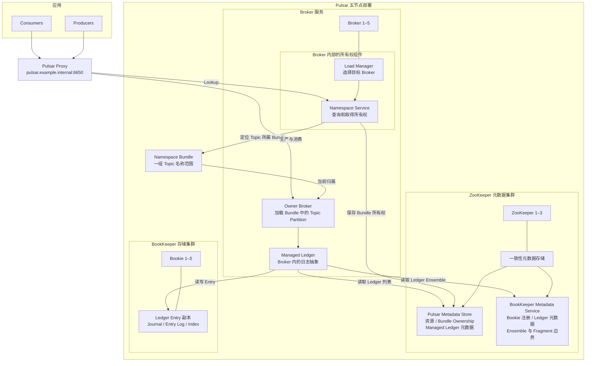
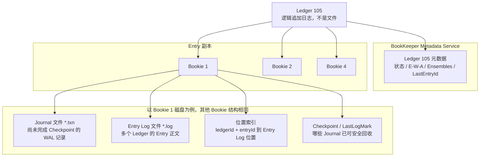
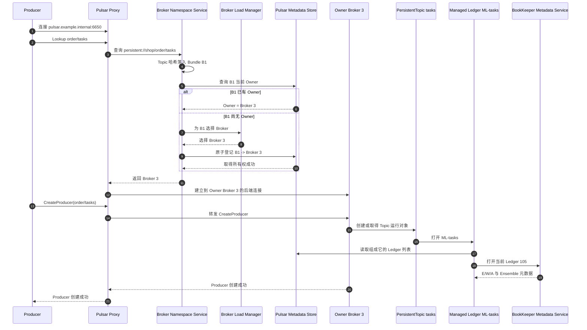
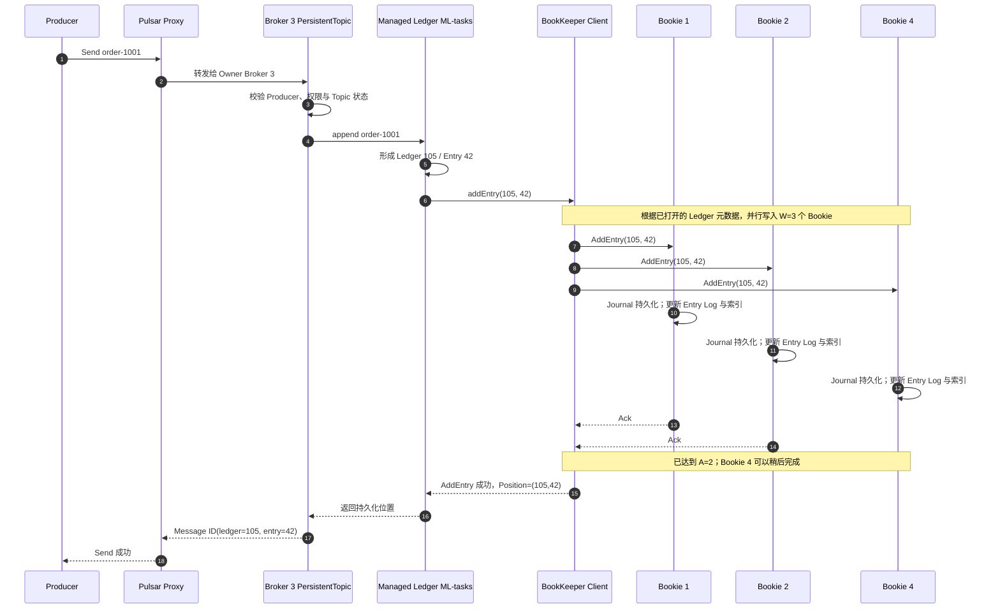
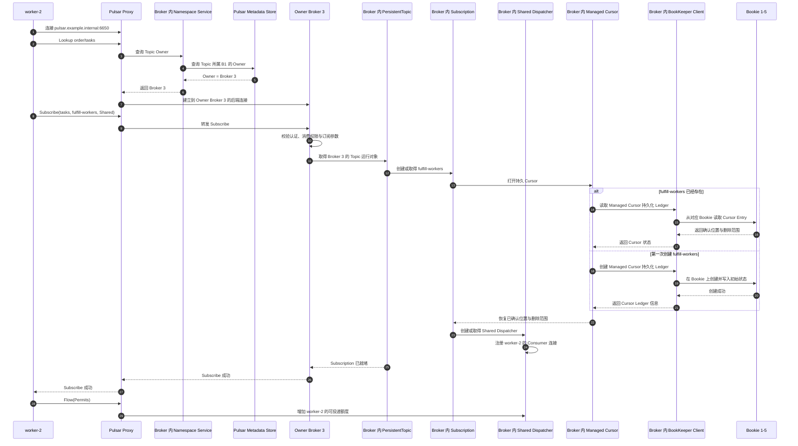
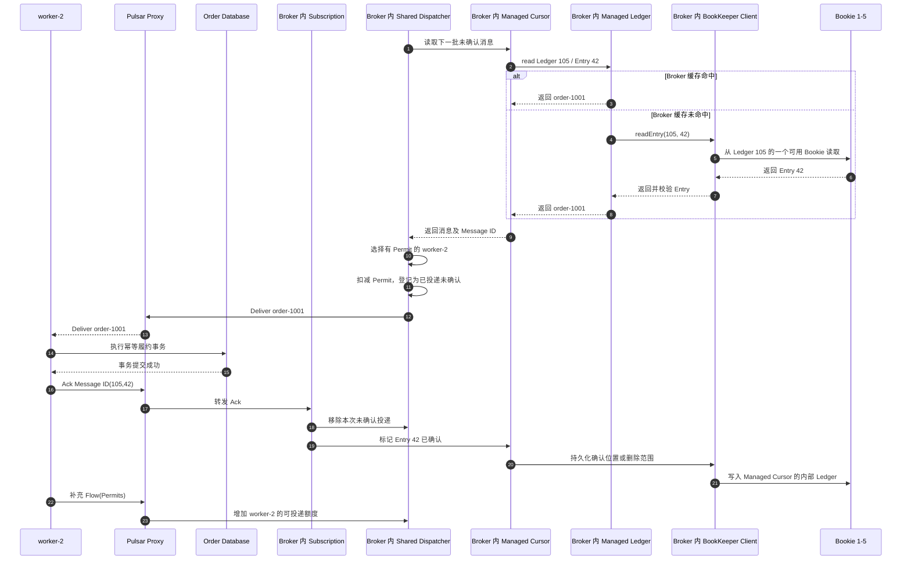
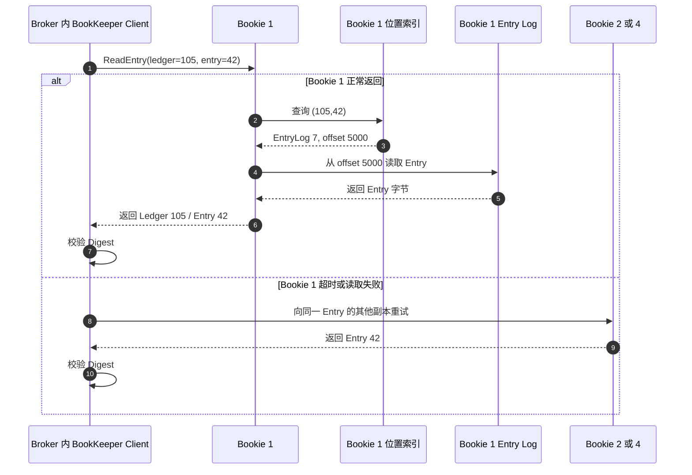
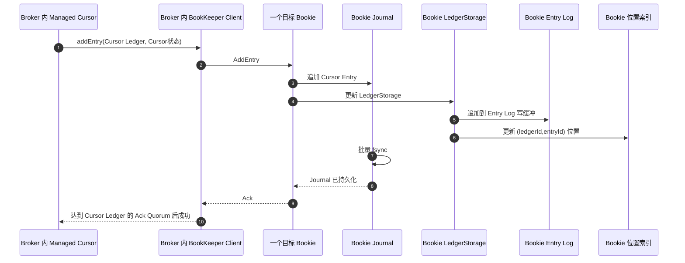
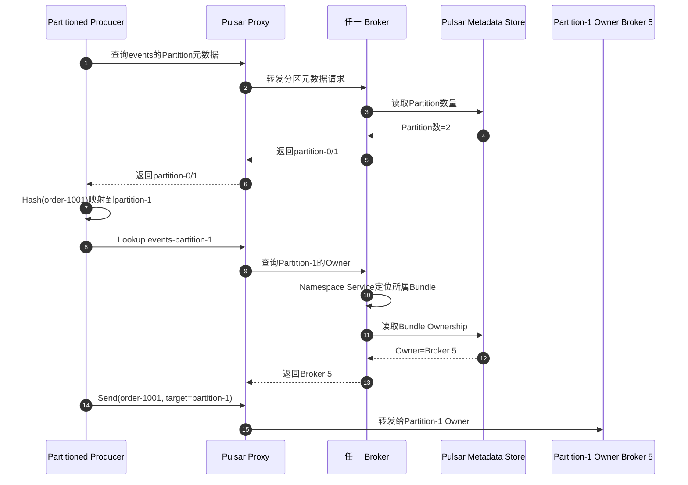

Pulsar 把接入计算和消息存储分开：Broker 负责协议、Topic Partition 所有权和投递，BookKeeper 负责持久化日志。Broker 故障后转移的是 Topic Partition 的所有权，历史消息不需要跟着 Broker 搬迁。

本文通过五节点部署和两个订单示例说明客户端最终连接谁、Owner Broker 做什么、Bookie 保存什么，以及 Subscription 如何形成不同消费语义。本文先建立 Bundle、Managed Ledger、Ledger 与 Fragment 的完整层级；LAC、连续写入和 Bookie 故障恢复见[消息队列实现篇](032_pulsar_message_queue_implementation.md)，任务投递和 Cursor 恢复见[任务队列实现篇](033_pulsar_task_queue_implementation.md)。

<!-- more -->

## 1. 五节点生产部署

为了在五台机器内展示完整链路，本例合并部署 Broker 与 Bookie，并在前三台部署 ZooKeeper Metadata Store：

| 节点 | IP | 部署角色 |
|---|---|---|
| `pulsar-1` | `10.0.0.11` | Broker 1 + Bookie 1 + ZooKeeper 1 |
| `pulsar-2` | `10.0.0.12` | Broker 2 + Bookie 2 + ZooKeeper 2 |
| `pulsar-3` | `10.0.0.13` | Broker 3 + Bookie 3 + ZooKeeper 3 |
| `pulsar-4` | `10.0.0.14` | Broker 4 + Bookie 4 |
| `pulsar-5` | `10.0.0.15` | Broker 5 + Bookie 5 |

生产环境通常把 Broker、Bookie 和 Metadata Store 放到独立故障域，避免一台物理机同时损失接入、存储副本和元数据投票。本例的 Proxy 地址为 `pulsar.example.internal:6650`。

### 1.1 完整生产架构



架构图把相同角色的实例合并成 `Broker 1–5`、`ZooKeeper 1–3` 和 `Bookie 1–5`，具体节点与 IP 仍以部署表为准。Load Manager、Namespace Service 和 Managed Ledger 不是额外部署的服务，而是每个 Broker 进程内的组件。Pulsar Metadata Store 与 BookKeeper Metadata Service 是两套逻辑用途，本例由同一个三节点 ZooKeeper 集群承载，因此也不是第四套物理集群。

后续只沿着 `persistent://shop/order/tasks` 这一条路径展开，阅读顺序是：

```text
1. 所有权：Topic → Namespace Bundle → Owner Broker
2. 日志组织：Topic → Managed Ledger → Ledger → Fragment → Entry
3. 物理保存：两类 Metadata Service + Bookie Journal / Entry Log / Index
4. 写入：Producer → Owner Broker → Ledger → Bookie
5. 读取：Message ID → Ledger 元数据 → Ensemble → Bookie 文件
```

先把所有权路径中的名字对齐：

- **Namespace** 是 Topic 的管理边界，例如 `shop/order`。
- **Namespace Bundle** 是 Namespace 内的一段 Topic 名称哈希范围。一个 Topic Partition 会落入一个 Bundle，Pulsar 以 Bundle 为单位分配 Broker 所有权；它不是消息存储文件。
- **Load Manager** 在 Bundle 尚无 Owner 或需要迁移时，根据 Broker 负载选择目标 Broker。
- **Namespace Service** 查询、取得和释放 Bundle 所有权，并把结果保存到 Metadata Store。
- **Owner Broker** 是当前拥有该 Bundle 的 Broker，负责加载其中的 Topic Partition，并处理生产和消费请求。

再对齐消息存储中的名字：

- **Broker** 是无共享的接入与调度服务。它拥有 Topic Partition，但不是历史消息的唯一物理存储点。
- **BookKeeper** 是由多个 Bookie 组成的分布式日志存储系统。
- **Bookie** 是一个具体存储进程，接收和保存 Ledger Entry。
- **Managed Ledger** 是 Broker 看到的一条长期 Topic 日志，它会由多个 Ledger 首尾相接组成。
- **Ledger** 是 BookKeeper 中带编号的逻辑追加日志，不等于 Bookie 磁盘上的一个文件。
- **Entry** 是 Ledger 的追加单位，可以包含一条消息或一个消息批次。
- **Metadata Store** 保存控制面元数据，不保存业务消息正文。

### 1.2 Topic 如何通过 Namespace Bundle 找到 Owner Broker

先看包含关系：

```text
Tenant: shop
└─ Namespace: order
   ├─ Bundle B0：0x00000000 ～ 0x3fffffff
   ├─ Bundle B1：0x40000000 ～ 0x7fffffff
   ├─ Bundle B2：0x80000000 ～ 0xbfffffff
   └─ Bundle B3：0xc0000000 ～ 0xffffffff
```

Bundle 是 Namespace 内的一段哈希范围。Pulsar 对完整 Topic 名称计算哈希，哈希落入哪个范围，Topic 就属于哪个 Bundle。下面的哈希值只用于说明：

```text
persistent://shop/order/tasks
    → 假设哈希为 0x51a20000
    → 落入 Bundle B1

persistent://shop/order/events-partition-0
    → 假设哈希为 0x23810000
    → 落入 Bundle B0

persistent://shop/order/events-partition-1
    → 假设哈希为 0xd1200000
    → 落入 Bundle B3
```

这说明一个分区 Topic 的各个 Partition 是独立的 Topic 名称，可以落入不同 Bundle，并由不同 Broker 服务。

再假设 Metadata Store 中保存了下面的所有权关系：

```text
Bundle B0 → Broker 1
Bundle B1 → Broker 3
Bundle B2 → Broker 4
Bundle B3 → Broker 5
```

Producer 查找 `persistent://shop/order/tasks` 时，过程是：

1. Producer 向 Proxy 或任一 Broker 发起 Lookup；
2. 该 Broker 的 Namespace Service 计算 Topic 哈希，确定它属于 Bundle B1；
3. Namespace Service 从 Metadata Store 查到 B1 的 Owner 是 Broker 3；
4. 客户端直连时获得 Broker 3 的地址；经过 Proxy 时由 Proxy 把请求转发给 Broker 3；
5. Broker 3 加载 `tasks` 的 Managed Ledger，处理后续生产和消费请求。

因此，不是“Bundle 获取 Topic 所有权”，而是 **Topic 先归入一个 Bundle，Broker 再取得这个 Bundle 的所有权**。Broker 拥有 B1 后，也负责 B1 中的其他 Topic。

如果 B1 尚无 Owner，Namespace Service 才触发所有权分配：

```text
Namespace Service 发现 B1 没有 Owner
    → Load Manager 根据负载选择 Broker 3
    → Broker 3 尝试取得 B1 所有权
    → Metadata Store 原子记录 B1 → Broker 3
    → Broker 3 加载 B1 中被访问的 Topic
```

如果 Broker 2 和 Broker 3 同时尝试取得 B1，Metadata Store 的原子更新只允许一个成功，失败者读取新的 Owner 后把请求交给它。Metadata Store 因此负责保证所有权唯一，不负责运行 Topic。

Bundle 只解决“这些 Topic 由哪个 Broker 服务”，不会把其中的消息合并存储。`tasks` 和 `events-partition-0` 即使属于同一 Bundle，仍各自拥有独立的 Managed Ledger。Bundle 分裂或迁移改变的是 Broker 所有权，不会重写 Topic 的历史消息。

### 1.3 从 Bundle 到 Fragment 与 Bookie 文件的存储层级

沿用前面的 `tasks` Topic，并假设：

```text
Topic:          persistent://shop/order/tasks
所属 Bundle:    B1
Bundle Owner:   Broker 3
Managed Ledger: ML-tasks

BookKeeper 参数：
Ensemble Size E = 3
Write Quorum W  = 3
Ack Quorum A    = 2
```

先看完整层级：

```text
Namespace shop/order
└─ Bundle B1                              ← Broker 所有权单位
   └─ Owner Broker 3                      ← 提供 Topic 服务
      └─ Topic order/tasks
         └─ Managed Ledger ML-tasks       ← Topic 的长期逻辑日志
            ├─ Ledger 101                 ← 已关闭的追加日志
            └─ Ledger 105                 ← 当前正在写入
               ├─ Fragment F0
               │  ├─ Entry 0..99
               │  └─ Ensemble: Bookie 1、2、4
               └─ Fragment F1
                  ├─ Entry 100..
                  └─ Ensemble: Bookie 1、3、4
```

这条链路中存在两种不同关系：

- `Namespace → Bundle → Owner Broker → Topic` 回答“由哪个 Broker 提供服务”；
- `Topic → Managed Ledger → Ledger → Fragment → Entry → Bookie` 回答“消息如何组织并存储”。

Bundle 不是 Managed Ledger 的存储目录。图中把它们连起来，只表示 Broker 取得 B1 所有权后，才有资格打开 `order/tasks` 的 Managed Ledger 并提供读写服务。

#### 1.3.1 Ledger 105 的逻辑内容与物理文件

先给结论：**不存在一个包含全部内容的 `Ledger-105` 文件**。Ledger 105 由一条 BookKeeper 元数据记录和分散在多个 Bookie 上的 Entry 副本共同组成。



Ledger 105 的内容分布如下。

**BookKeeper Metadata Service 中的 Ledger 元数据记录：**

```text
ledgerId:          105
state:             OPEN
ensembleSize:      3
writeQuorumSize:   3
ackQuorumSize:     2
ensembles:
  entry 0:         [Bookie 1, Bookie 2, Bookie 4]
  entry 100:       [Bookie 1, Bookie 3, Bookie 4]
lastEntryId:       仅在 Ledger 关闭后记录最终值
```

这条记录描述 Ledger 怎样复制，不包含 `order-1001` 的消息正文。Fragment 也从 `ensembles` 推导：Entry 0～99 属于第一段，Entry 100 以后属于第二段。

**Bookie 1 的 Entry Log 文件：**

```text
Entry Log 7（示意）

offset 4096:
  ledgerId = 88,  entryId = 9,  payload = ...

offset 5000:
  ledgerId = 105, entryId = 42, LAC = 41,
  payload = order-1001, digest = ...

offset 6200:
  ledgerId = 203, entryId = 7,  payload = ...
```

一个 Entry Log 会顺序混合保存多个 Ledger 的 Entry，因此它不等于 Ledger 文件。

**Bookie 1 的位置索引：**

```text
(ledgerId=105, entryId=42)
    → Entry Log 7, offset 5000
```

位置索引只保存 Entry 在哪里，不保存第二份消息正文。使用 `DbLedgerStorage` 时它通常由 RocksDB 等本地数据库实现；其他 LedgerStorage 实现可能使用独立索引文件。

**Bookie 1 的 Journal 文件：**

```text
Journal 20260908.txn（示意）

AddEntry: ledgerId=105, entryId=42, entry bytes=...
AddEntry: ledgerId=203, entryId=7,  entry bytes=...
```

Journal 保存尚未完成后台 Checkpoint 的写入记录。Entry Log 和索引完成持久化并推进 LastLogMark 后，对应的旧 Journal 才能回收。因此同一条 Entry 会暂时同时出现在 Journal 和 Entry Log 中，但它们分别承担崩溃恢复和长期读取职责。

把 Ledger 105 合起来看就是：

```text
Ledger 105
= BookKeeper Metadata Service 中的 Ledger 105 元数据
+ Bookie 1 Entry Log 中的部分 Entry 副本
+ Bookie 2 Entry Log 中的部分 Entry 副本
+ Bookie 3/4 Entry Log 中的部分 Entry 副本
```

### 1.4 一条消息按照什么顺序写入

Broker 3 打开 `ML-tasks` 当前的 Ledger 105。Ledger 元数据中最初记录：

```text
Ledger 105
Ensemble Size = 3
Write Quorum  = 3
Ack Quorum    = 2

Ensembles:
Entry 0 开始 → [Bookie 1, Bookie 2, Bookie 4]
```

Producer 发送 `order-1001` 后：

```text
Producer
    → Broker 3
    → Managed Ledger ML-tasks
    → Ledger 105 / Entry 42
    ├─ 写入 Bookie 1
    ├─ 写入 Bookie 2
    └─ 写入 Bookie 4
```

完整写入顺序是：

1. Producer 根据第 1.2 节的所有权路径找到 Bundle B1 的 Owner Broker 3；
2. Broker 3 中的 `PersistentTopic` 把消息交给 `ML-tasks`；
3. `ML-tasks` 选择当前打开的 Ledger 105，并为消息分配 Entry 42；
4. Broker 内的 BookKeeper Client 根据 Ledger 105 元数据，确定 Entry 42 使用 Ensemble `[Bookie 1, Bookie 2, Bookie 4]`；
5. 因为 `W=3`，BookKeeper Client 把 Entry 42 发给三个 Bookie；
6. 每个 Bookie 把 Entry 放入 Entry Log 写缓冲和位置索引，同时追加自己的 Journal；
7. Journal 批量 `fsync` 后，Bookie 向 BookKeeper Client 返回写入确认；
8. `A=2`，所以任意两个目标 Bookie 确认后，BookKeeper Client 就可以通知 Broker 本次 AddEntry 成功；
9. Broker 向 Producer 返回包含 `ledgerId=105`、`entryId=42` 的 Message ID；
10. 后台 SyncThread 再把 Entry Log 和位置索引批量刷盘，推进 Checkpoint，并回收已经不需要的旧 Journal。

`W=3` 表示这条 Entry 会发送给三个 Bookie，`A=2` 表示其中两个 Bookie 确认后，本次 BookKeeper 写入即可成功。Broker 再按照 Pulsar 的发布确认边界向 Producer 返回 Message ID，例如：

```text
ledgerId = 105
entryId  = 42
```

此时 Ledger 105 的 Entry 0～99 都使用相同 Ensemble，它们共同构成 Fragment F0。

#### 1.4.1 Entry 如何落到 Bookie 文件

每个 Bookie 只保存分配给自己的 Entry 副本。此时 Entry 42 的副本位置是：

```text
Entry 42 → Bookie 1、2、4
```

Entry Log 确实也是顺序追加的，但“顺序写”不等于“每次写入都已经 `fsync` 到持久介质”。BookKeeper 同时使用 Journal 与 Entry Log，是为了把确认延迟和长期存储解耦。

一次 `AddEntry` 在 Bookie 内可以简化为：

```text
收到 Ledger Entry
    ├─ 追加到 Entry Log 写缓冲，并更新内存中的位置索引
    └─ 追加到 Journal
           → Journal 执行批量 fsync
           → 默认到这里才向 BookKeeper Client 确认

后台 SyncThread
    → 把 Entry Log 和 Index 刷入持久介质
    → 写入 Checkpoint / LastLogMark
    → 确认更早的 Journal 已无恢复价值后删除旧 Journal
```

两者的职责不同：

- **Journal 是短期 WAL**：只为“已经向客户端确认、但 Entry Log 或 Index 尚未刷盘”的窗口提供崩溃恢复；正常读取消息不以 Journal 为主；
- **Entry Log 是长期消息文件**：把不同 Ledger 的 Entry 聚合后顺序写入，后续由 Index 定位并由垃圾回收与压缩整理；
- **Index 可能产生随机更新**：BookKeeper 把它留在内存中批量刷新，避免每条消息都同步更新索引文件。

如果 Bookie 在 Entry Log 和 Index 刷盘前崩溃，重启时会重放 Journal，把已经确认的 Entry 和索引补回来。如果每条 Entry 都强制同步刷新 Entry Log 和 Index，也可以获得持久性，但会把确认路径绑到更多磁盘操作上，吞吐和延迟都更差。

因此 Bookie 磁盘上通常不存在一个名为“Ledger 105”或“Fragment F1”的完整文件。Fragment 的范围和 Ensemble 关系来自 Ledger 元数据；真正的 Entry 数据长期位于多个 Bookie 的 Entry Log 中，Journal 只保留尚未完成后台刷盘检查点的恢复记录。

### 1.5 Bookie 切换如何形成 Fragment

写 Entry 100 时 Bookie 2 不可用。Broker 3 中的 BookKeeper Client 选择 Bookie 3 替换它，并更新 Ledger 105 的 Ensemble 元数据：

```text
Ledger 105 Ensembles:
Entry 0 开始   → [Bookie 1, Bookie 2, Bookie 4]
Entry 100 开始 → [Bookie 1, Bookie 3, Bookie 4]
```

于是同一个 Ledger 中形成两个 Fragment：

```text
Fragment F0 = Entry 0..99   + Ensemble [Bookie 1, Bookie 2, Bookie 4]
Fragment F1 = Entry 100..   + Ensemble [Bookie 1, Bookie 3, Bookie 4]
```

Fragment 不是新建的一份物理文件。它只是“Ledger 中连续使用同一组 Bookie 的 Entry 范围”。`F0`、`F1` 只是本例为了说明使用的标签，不是独立存储对象。因此 Bookie 切换可以产生新 Fragment，但不会创建新 Topic、Managed Ledger 或 Ledger。

#### 1.5.1 Broker 故障与 Bookie 故障的区别

```text
Broker 3 故障
→ B1 所有权转移给其他 Broker
→ 新 Owner 重新打开 ML-tasks
→ Ledger 和 Entry 仍在 BookKeeper，不随 Broker 搬迁

Bookie 2 故障
→ B1 的 Owner Broker 可以仍是 Broker 3
→ Ledger 105 更换 Ensemble
→ 从 Entry 100 开始形成新 Fragment
```

所以最核心的边界是：**Bundle 负责 Broker 所有权，Managed Ledger/Ledger 负责日志组织，Fragment 记录 Ledger 某一段使用哪些 Bookie，Bookie 文件才是 Entry 的物理落点。**

### 1.6 元数据保存位置与消息检索路径

先看保存位置。这里的“保存”要区分 Metadata Store 中的持久元数据、Broker 内存中的运行对象和 Bookie 中的消息正文。

- **Topic**
  - 持久定义：Topic 不是整体保存成一条记录；分区 Topic 的分区数量等资源元数据保存在 Pulsar Metadata Store，持久 Topic 与存储的关系则由 Topic 名称派生出的 Managed Ledger 元数据体现；
  - 运行对象：当前 Owner Broker 内存中的 `PersistentTopic`；
  - 消息正文：不在 Topic 元数据中，而在它对应的 Managed Ledger 中。

- **Namespace Bundle**
  - Bundle 的哈希边界及 `Bundle → Owner Broker` 关系保存在 Pulsar Metadata Store；
  - Broker 会缓存这些信息，但 Metadata Store 中的记录才是 Broker 故障后重新判断所有权的依据。

- **Managed Ledger**
  - 当前 Owner Broker 内存中有一个 `ManagedLedger` 对象；
  - Pulsar Metadata Store 保存它包含哪些 Ledger、Ledger 的先后顺序及相关属性；
  - Managed Ledger 自身不是 Bookie 上的一个文件。

- **Ledger**
  - BookKeeper Metadata Service 保存 Ledger ID、状态、`E/W/A` 参数，以及从哪个 Entry 开始使用哪组 Bookie；
  - Ledger Entry 正文保存在这些 Bookie 上。

- **Fragment**
  - 没有独立的 Fragment 文件或 Fragment ID；
  - 它由 Ledger 元数据中的 `起始 Entry → Ensemble` 记录推导出来。

- **Entry**
  - 写入时进入 Entry Log 缓冲和内存索引，同时追加 Journal；默认以 Journal 持久化作为 Bookie 返回确认的边界；
  - Bookie 的 Index 把 `(ledgerId, entryId)` 映射到 Entry Log 的物理位置。

Pulsar Metadata Store 和 BookKeeper Metadata Service 是两个逻辑用途。它们可以使用同一个 ZooKeeper/Oxia 集群，但会使用各自的元数据命名空间：前者管理 Pulsar 资源、Bundle 和 Managed Ledger，后者管理 BookKeeper Ledger 与 Bookie。

现在以查找 `order-1001` 为例。假设它的 Message ID 是：

```text
Topic:    persistent://shop/order/tasks
ledgerId: 105
entryId:  42
```

Owner Broker 冷启动时的完整检索路径是：

```text
Topic 名称
  → Namespace shop/order
  → 根据 Topic 名称哈希找到 Bundle B1
  → 从 Pulsar Metadata Store 查到 B1 Owner = Broker 3
  → Broker 3 创建 PersistentTopic
  → 根据 Topic 名称打开 ManagedLedger ML-tasks（本例逻辑名称）
  → 从 Pulsar Metadata Store 取得 Ledger 列表 [101, 105]
  → 根据 Message ID 选择 Ledger 105 / Entry 42
  → 从 BookKeeper Metadata Service 读取 Ledger 105 元数据
  → Entry 42 落在从 Entry 0 开始的 Ensemble [Bookie 1, 2, 4]
  → 向其中可用的 Bookie 读取 Entry 42
  → Bookie Index 定位 Entry Log 文件与偏移
  → 返回消息正文 order-1001
```

Ledger 105 的 Fragment 检索不是再访问一个 Fragment Store，而是在 Ensemble 列表中查找“不大于 Entry 42 的最大起始 Entry”：

```text
Ledger 105 Ensembles:
Entry 0 开始   → [Bookie 1, Bookie 2, Bookie 4]
Entry 100 开始 → [Bookie 1, Bookie 3, Bookie 4]

查询 Entry 42  → 使用 Entry 0 对应的 Ensemble
查询 Entry 120 → 使用 Entry 100 对应的 Ensemble
```

正常运行时不会为每条消息重复访问所有 Metadata Store。Owner Broker 会缓存 `PersistentTopic`、`ManagedLedger`、Ledger Handle 和相关元数据；上面的过程主要描述 Broker 第一次加载 Topic 或故障切换后恢复 Topic 时，如何重新建立这条索引链。

### 1.7 按 Kafka 的协调职责理解 Pulsar

Pulsar 没有统一命名的 Coordinator 家族，但 Kafka 的几类协调职责可以在 Pulsar 中找到对应实现。

#### KRaft Controller 对应的集群控制职责

Kafka Controller 管理集群元数据和 Partition Leader。Pulsar 把类似职责拆给以下组件：

- **Metadata Store**保存 Broker 存活、Namespace Bundle 所有权、负载报告和 Ledger 元数据等控制状态；
- Broker 内的 **Load Manager**根据负载选择目标 Broker；
- Broker 内的 **Namespace Service**取得或释放 Namespace Bundle 所有权，使其中的 Topic Partition 由目标 Broker 加载。

因此 Pulsar 没有单个 Active Controller。Metadata Store 提供一致的协调依据，Broker 内部模块共同完成所有权分配。

#### Group Coordinator 对应的消费者协调职责

Kafka Group Coordinator 管理 Group 成员和 Partition 分配。Pulsar 中对应职责位于每个 Topic Partition 的 **Owner Broker 与 Subscription Dispatcher**：

- Owner Broker 维护连接到该 Subscription 的 Consumer；
- Dispatcher 按 Exclusive、Failover、Shared 或 Key_Shared 规则选择 Consumer；
- Consumer 的当前连接和 Permit 主要是 Owner Broker 内存状态；
- 可恢复的 Subscription 进度由 Cursor 持久化到 Managed Ledger。

Pulsar 没有一个覆盖整个 Subscription 的全局 Group Coordinator。分区 Topic 的每个 Partition 都由自己的 Owner Broker 协调投递，客户端负责发现并连接这些 Owner。

#### Share Coordinator 对应的逐条任务状态职责

Kafka Share Coordinator 为共享消费者保存逐条消息的获取与确认状态。Pulsar Shared/Key_Shared Subscription 中，类似职责由两部分共同完成：

- **Owner Broker 的 Dispatcher**选择本次把消息交给哪个 Consumer，并维护当前未确认与重新投递状态；
- **Managed Cursor**持久化已确认位置以及非连续确认形成的删除范围，使新 Owner Broker 能恢复哪些消息尚未完成。

Kafka 把 Share 状态写入独立的 `__share_group_state`；Pulsar 则把这类职责放在 Topic Owner 的 Dispatcher 和该 Subscription 的 Cursor 中。

#### Transaction Coordinator 对应的事务协调职责

Pulsar 有名称和作用都接近 Kafka 的 **Transaction Coordinator**。启用事务后，它运行在 Broker 内，管理事务 ID、状态、超时和参与的 Topic/Subscription，并把事务元数据写入事务日志。业务消息仍写入实际 Topic，Transaction Coordinator 负责推动最终提交或中止。

最终对应关系是：

```text
Kafka KRaft Controller        → Metadata Store + Load Manager + Namespace Service
Kafka Group Coordinator       → Owner Broker + Subscription Dispatcher + Managed Cursor
Kafka Share Coordinator       → Dispatcher 的投递状态 + Managed Cursor
Kafka Transaction Coordinator → Pulsar Transaction Coordinator
```

BookKeeper 还有独立的存储修复协调：Auditor 发现欠复制 Ledger Fragment，Replication Worker 将缺失副本补到健康 Bookie。它不对应上述 Kafka Coordinator，也不参与正常消息投递。

## 2. 示例一：订单履约任务

创建：

```text
Topic:        persistent://shop/order/tasks
Subscription: fulfill-workers
Type:         Shared
Consumers:    worker-1 / worker-2 / worker-3
```

Shared Subscription 让三个 Worker 竞争同一份消息。若要求同一订单按 Key 串行，应使用 Key_Shared，并让 Producer 稳定设置订单 Key。

本例假设 Topic Owner 是 Broker 3，当前 Ledger 的 Bookie Ensemble 为 Bookie 1、2、4。

### 2.1 初始化后各组件保存什么

- Metadata Store 保存 Tenant `shop`、Namespace `order`、Topic 定义、策略和当前所有权协调信息。
- Broker 3 加载该 Topic 的 Managed Ledger，建立 Producer/Consumer 接入和 Dispatcher。
- Managed Ledger 元数据记录当前使用哪些 Ledger；BookKeeper Ledger 元数据记录 Ledger ID、Bookie Ensemble 和写入参数。
- Bookie 1、2、4 保存当前 Ledger 中分配给自己的 Entry，不保存“完整业务 Topic 文件”。
- `fulfill-workers` 建立后拥有独立 Cursor；三个 Worker 共享这一个订阅进度，而不是每人一份完整进度。

Bundle、Topic、Managed Ledger、Ledger、Fragment、Entry 与 Bookie 物理文件的完整映射见 1.3 节。本节只记录初始化完成后各组件分别持有哪些状态。

### 2.2 Producer 生产消息的完整过程

完整生产过程分成两段：Producer 第一次创建时先找到 Topic Owner；连接建立后，每条消息沿数据路径直接进入 Owner Broker 和 BookKeeper。`Namespace Service` 只参与前一段，不转发每条消息。

Pulsar 没有独立部署的 NameServer。这里承担名称解析和路由发现职责的是 **Broker 内部的 Namespace Service**，它结合 Namespace Bundle 与 Metadata Store 找到 Owner Broker；Bundle 尚无 Owner 时，才让 Load Manager 参与选择 Broker。

#### 2.2.1 第一次连接：找到并打开 Topic Owner



这一段中各组件分别解决一个问题：

1. Producer 连接的是 Proxy 的稳定地址，不知道 Broker 3 的物理地址。
2. Proxy 把 Lookup 请求交给 Broker 内的 Namespace Service。
3. Namespace Service 根据 Topic 名称确定 Bundle B1，再从 Metadata Store 查询 B1 的 Owner。
4. B1 没有 Owner 时，Load Manager 才选择 Broker 3，并通过 Metadata Store 原子取得所有权；正常发送不会每次重新选 Owner。
5. Proxy 建立到 Broker 3 的后端连接，后续仍由 Producer 连接 Proxy，但请求实际交给 Broker 3。
6. Broker 3 创建 `PersistentTopic` 运行对象，并打开对应的 Managed Ledger。
7. Managed Ledger 读取自己的 Ledger 列表，再从 BookKeeper Metadata Service 打开当前 Ledger 105，得到 Ensemble 和 `E/W/A` 参数。

正常运行时，这些 Topic、Ledger Handle 和路由信息都会被缓存。除非缓存失效、Owner 转移、Ledger 滚动或发生故障恢复，不会为每一条消息重新执行完整 Lookup 和元数据读取。

#### 2.2.2 每条消息：从 Producer 写入 Bookie

下面继续发送 `order-1001`。假设当前 Ledger 105 使用 `E=3、W=3、A=2`，Entry 42 的 Ensemble 是 Bookie 1、2、4：



1. Producer 后续仍把消息发给 Proxy；Proxy 通过已经建立的后端连接转给 Broker 3，不再为每条消息查询 Namespace Service。
2. Broker 3 中的 `PersistentTopic` 校验 Producer、权限与 Topic 状态，然后把消息交给 `ML-tasks`。
3. Managed Ledger 可以把一条消息或一个批次组成 Entry，并通过 Broker 内的 BookKeeper Client 追加到当前 Ledger。
4. BookKeeper Client 使用已打开的 Ledger Handle，根据 Ensemble 和 Write Quorum 把 Entry 发给 Bookie 1、2、4；Producer 不直接连接 Bookie。
5. 每个 Bookie 使用 Journal 保护已确认写入，并维护长期读取所需的 Entry Log 和位置索引。
6. 本例收到两个 Bookie 的持久化确认便达到 `A=2`。BookKeeper Client 把 `(ledgerId=105, entryId=42)` 返回给 Managed Ledger。
7. Owner Broker 生成 Message ID，经 Proxy 返回 Producer。成功只表示达到本次 BookKeeper 持久化条件，不表示 Consumer 已经处理消息。

这条普通消息不经过 Transaction Coordinator；只有显式使用 Pulsar 事务时才需要它。Auditor 和 Replication Worker 也不在正常生产链路中，它们只参与 Bookie 故障后的副本检查与修复。

因此，完整生产路径可以压缩成：

```text
首次连接：
Producer
  → Proxy
  → Namespace Service
  → Namespace Bundle / Metadata Store
  → 必要时由 Load Manager 选择 Owner
  → Owner Broker 打开 PersistentTopic 和 Managed Ledger
  → BookKeeper Metadata Service 打开当前 Ledger

每条消息：
Producer
  → Proxy
  → Owner Broker 的 PersistentTopic
  → Managed Ledger
  → BookKeeper Client
  → Write Quorum 中的 Bookie
  → 达到 Ack Quorum
  → Message ID 原路返回
```

### 2.3 Consumer 有哪些状态

- **Subscription 身份**：`fulfill-workers` 与类型 Shared，表示三个 Worker 共用一份消费关系。
- **Consumer 连接**：Consumer ID、连接所在 Broker、接收队列和可用 Permit，主要保存在 Owner Broker 的运行状态中。
- **Dispatcher 状态**：当前应把下一条消息交给哪个 Consumer，由 Owner Broker 为该 Subscription 调度。
- **Unacked 与重投状态**：哪些消息已经投递但尚未确认，用于超时、Nack 和 Consumer 断开后的重新投递。
- **Cursor**：该 Subscription 的持久进度，用来让新的 Owner Broker 恢复订阅位置。

### 2.4 Consumer 消费消息的完整过程

消费同样分成两段：Consumer 先找到 Topic Owner 并建立 Subscription；之后 Dispatcher 才沿 Cursor 指向的位置读取消息、选择 Worker、投递并处理 Ack。

#### 2.4.1 第一次连接：建立 Subscription

先说明图中对象归谁。真正独立部署的只有 Consumer、Proxy、Broker、Metadata Store 和 Bookie；其余名字都是 Broker 进程内部为了运行 Topic 和 Subscription 创建的对象，不是新的服务器：

```text
独立部署
├─ worker-2                         Consumer 进程
├─ Pulsar Proxy                    客户端稳定入口
├─ Pulsar Metadata Store           保存 Bundle 所有权等控制元数据
├─ Owner Broker 3                  当前运行 order/tasks 的 Broker 进程
└─ BookKeeper / Bookie             保存消息和 Cursor 的持久数据

Owner Broker 3 内部
├─ Namespace Service               查询 Topic 属于哪个 Bundle、Owner 是谁
├─ PersistentTopic order/tasks     order/tasks 在 Broker 内的运行对象
├─ Subscription fulfill-workers    这份订阅在 Broker 内的运行对象
│  └─ Shared Dispatcher            在 worker-1/2/3 中选择本次投递对象
└─ Managed Cursor                  fulfill-workers 的消费位置对象
```

其中需要特别区分：

- `PersistentTopic`、`Subscription`、`Shared Dispatcher` 和 `Managed Cursor` 的**运行对象都在 Owner Broker 3 内存中**；
- `Shared Dispatcher` 保存 Consumer 连接、Permit 和当前未确认投递，Broker 故障后需要重新建立；
- `Managed Cursor` 也在 Broker 内运行，但它的已确认位置和非连续确认范围会持久化到 BookKeeper，因此新 Owner 能恢复消费进度；
- 图中的“Managed Cursor 持久化 Ledger”不是独立组件，而是 Managed Cursor 通过 BookKeeper Client 创建的一条内部 Ledger。它逻辑上属于 `fulfill-workers` 的消费状态，物理 Entry 保存在多个 Bookie；BookKeeper 只把它当作普通 Ledger，并不知道其中记录的是消费进度；
- Metadata Store 负责找到 Topic Owner，不保存 `order-1001` 的消息正文，也不保存 Dispatcher 的连接状态。



1. Lookup 与 Producer 相同：Namespace Service 根据 Bundle B1 从 Metadata Store 找到 Broker 3。若 B1 没有 Owner，仍按 2.2.1 的流程由 Load Manager 选择并登记 Owner。
2. Worker 2 始终连接 Proxy；Proxy 建立或复用到 Broker 3 的后端连接。若不使用 Proxy，客户端在 Lookup 后直接连接 Broker 3。
3. Broker 3 的 `PersistentTopic` 取得 `fulfill-workers` Subscription。第一次创建时建立持久 Cursor；已经存在时恢复原来的确认位置。
4. Shared Subscription 创建 Dispatcher，并把 worker-2 的 Consumer 连接加入可选成员。worker-1、worker-3 也按相同步骤加入，不存在三个 Worker 之间的 Leader 选举。
5. Consumer SDK 发送 Flow Permit。Permit 表示 Broker 目前还可以向这个 Consumer 推送多少条消息，用完后必须等待客户端补充，因此它是流量控制，不是消费进度。

Subscription 创建后，Owner Broker 内存中形成下面的运行关系：

```text
PersistentTopic order/tasks
└─ Subscription fulfill-workers
   ├─ Managed Cursor：持久化确认位置
   └─ Shared Dispatcher
      ├─ worker-1：Consumer 连接 + Permits
      ├─ worker-2：Consumer 连接 + Permits
      └─ worker-3：Consumer 连接 + Permits
```

#### 2.4.2 每条消息：读取、选择 Worker、投递和确认

假设 `fulfill-workers` 的 Cursor 下一条需要读取 `Ledger 105 / Entry 42`，Dispatcher 本次选择还有 Permit 的 worker-2：



主图中的 `Bookie 1-5` 仍然代表一组实际 Bookie 进程。下面分别展开“读取业务 Entry”和“写入 Cursor Entry”时单个 Bookie 内部做了什么。

##### 2.4.2.1 缓存未命中时，Bookie 如何读取业务 Entry

Ledger 105 的元数据说明 Entry 42 的副本位于 Bookie 1、2、4。BookKeeper Client 本次先选择 Bookie 1：



Bookie 内部的读取路径是：

```text
(ledgerId=105, entryId=42)
    → 位置索引
    → (entryLogId=7, offset=5000)
    → Entry Log
    → Entry正文
```

位置索引属于 Bookie 的 LedgerStorage：使用 `DbLedgerStorage` 时通常由 RocksDB 保存；使用其他 LedgerStorage 实现时也可能表现为索引文件。**Journal 不参与正常读取**，它只负责恢复那些已经确认、但 Entry Log 和索引还没有完成 Checkpoint 的写入。

##### 2.4.2.2 Ack 后，Bookie 如何保存 Cursor Entry

worker-2 的 Ack 先更新 Owner Broker 内的 Managed Cursor。需要持久化时，Managed Cursor 通过 BookKeeper Client 向自己的内部 Cursor Ledger 追加一条 Entry。下面只展开其中一个目标 Bookie；Write Quorum 中的其他 Bookie 执行相同过程：



这里保存的 Entry 正文不是 `order-1001`，而是类似下面的消费状态：

```text
Subscription:        fulfill-workers
MarkDeletePosition:  Ledger 105 / Entry 40
IndividualDeletes:   Entry 42 已确认，Entry 41 尚未确认
```

Cursor Entry 与业务 Entry 使用同一套 BookKeeper 写入机制，但属于不同 Ledger。每个目标 Bookie 默认在自己的 Journal 持久化后返回 Ack；Entry Log 和位置索引随后通过 Checkpoint 完成长期持久化，故障时可由 Journal 重放恢复。BookKeeper Client 收到 Cursor Ledger 所要求数量的 Bookie Ack 后，才认为这次 Cursor 持久化完成。

这张图包含四条不同的状态链：

1. **读取位置**：Managed Cursor 决定下一条尚未完成的 Message ID，不由 worker-2 自己选择 Offset。
2. **消息正文**：Broker 缓存命中时直接返回；未命中时，Managed Ledger 调用 Broker 内的 BookKeeper Client。BookKeeper Client 根据 Ledger 105 的 Ensemble `[Bookie 1, Bookie 2, Bookie 4]` 选择一个副本读取；当前 Bookie 不可用时再尝试同一 Entry 的其他副本。Consumer 永远不直接连接 Bookie。
3. **本次投递**：Shared Dispatcher 从还有 Permit 的 Consumer 中选择 worker-2，扣减一个 Permit，并在 Owner Broker 内存中记录这条消息已经投递但尚未确认。
4. **可恢复进度**：Ack 到达后，Subscription 更新 Managed Cursor。连续确认可以推进 Mark-Delete Position；Shared 消费产生的非连续确认则暂时保存为单独删除范围。持久 Cursor 的状态最终写入 BookKeeper 中专门保存 Cursor 状态的 Ledger，不是 `order-1001` 所在的业务 Ledger；它和 Dispatcher 的临时连接状态也不是一份数据。

Ack 和 Permit 也不能混为一谈：

- Ack 表示这条 Message ID 已经处理完成，用来更新 Cursor；
- Permit 只表示 Consumer 还能接收多少条消息，用来限制 Broker 推送速度；
- Consumer SDK 可以对 Ack 和 Permit 做批量发送，所以它们不一定每处理一条消息就各自产生一次网络请求。

如果 worker-2 在 Ack 前断开，Dispatcher 会移除它的连接，并把未确认消息重新交给其他可用 Worker。若数据库事务已经成功、Ack 却没有到达或没有形成可恢复的 Cursor 状态，`order-1001` 仍可能重复投递，因此履约操作必须幂等。

完整消费路径可以压缩成：

```text
建立订阅：
Consumer
  → Proxy
  → Namespace Service / Metadata Store
  → Owner Broker 的 PersistentTopic
  → Subscription / Dispatcher / Managed Cursor

投递消息：
Dispatcher
  → Managed Cursor
  → Managed Ledger 缓存，未命中再读 BookKeeper
  → 选择有 Permit 的 Consumer
  → Proxy
  → worker-2

确认消息：
worker-2
  → Proxy
  → Subscription
  → Dispatcher 清理未确认状态
  → Managed Cursor 持久化消费进度
```

## 3. 示例二：订单事件流

创建两分区 Topic `persistent://shop/order/events`，Producer 使用 `order_id` 作为 Key。仓储、风控和分析分别创建独立 Subscription：

```bash
pulsar-admin topics create-partitioned-topic \
  persistent://shop/order/events \
  --partitions 2
```

创建后，Pulsar Metadata Store记录分区数，真正承载消息的是两个内部 Topic：

```text
persistent://shop/order/events
├─ persistent://shop/order/events-partition-0
└─ persistent://shop/order/events-partition-1
```

每个 Partition都是独立 Topic，分别拥有自己的 Bundle归属、Owner Broker、Managed Ledger和 BookKeeper Ledger。

### 3.1 Message Key 如何决定 Partition

先给结论：**Pulsar 的分区选择发生在 Producer客户端。** Broker/Proxy向客户端提供分区数量和各 Partition的 Lookup结果，但不会在收到每条消息后替 Producer重新计算分区。

创建 Partitioned Producer后，客户端先取得：

```text
Topic:         persistent://shop/order/events
Partition数:   2
内部Topic:     events-partition-0、events-partition-1
各Partition:   当前Owner Broker地址
```

发送 `order-1001` 时，客户端执行：

```text
Message Key = order-1001
    → 按Producer配置的HashingScheme计算Hash
    → Hash映射到2个Partition
    → 假设选择events-partition-1
    → Lookup得到它的Owner是Broker 5
    → 经Proxy转发或直接发送给Broker 5
```

Java客户端可以明确配置跨语言更容易统一的 Murmur3，并把 `order_id` 设置为 Message Key：

```java
Producer<byte[]> producer = client.newProducer()
    .topic("persistent://shop/order/events")
    .messageRoutingMode(MessageRoutingMode.RoundRobinPartition)
    .hashingScheme(HashingScheme.Murmur3_32Hash)
    .create();

producer.newMessage()
    .key("order-1001")
    .value(payload)
    .send();
```

这里的 Partitioned Producer 是客户端侧的复合对象。它为实际使用到的内部 Partition 建立子 Producer；是否一次建立所有连接或按需建立，取决于客户端及其惰性启动配置。

Pulsar内置路由策略可以归纳为：

- **消息有 Key**：在常用的 `RoundRobinPartition` 或 `SinglePartition` 模式下，客户端优先对 Key做哈希，把相同 Key映射到同一 Partition；
- **没有 Key且使用 RoundRobinPartition**：客户端在各 Partition间轮转。开启批处理时通常按批次切换，而不是每条消息严格轮转，以避免破坏批处理效率；
- **没有 Key且使用 SinglePartition**：客户端选择一个 Partition，并让这个 Producer的消息集中写入该 Partition；
- **CustomPartition**：应用实现 MessageRouter，根据消息和当前分区元数据返回目标 Partition。

不同语言客户端必须统一 Key的字节编码和 HashingScheme。若 Java、Go、Python Producer使用不同哈希算法，同一个 `order_id` 仍可能进入不同 Partition。跨语言系统应明确配置共同支持的算法，例如 Murmur3，而不是依赖各客户端可能不同的默认值。



Broker 5收到请求时，目标已经明确是 `events-partition-1`。它只负责把消息追加到这个 Partition的 Managed Ledger，不会再次根据 `order_id`选择 Partition。

增加 Partition时，客户端刷新元数据后会看到新的分区数量，但 `Hash(Key) → Partition数`的映射也可能改变。例如从2个增加到4个 Partition后，`order-1001` 可能从 Partition 1改到 Partition 3。扩容前后的同 Key事件因此可能分散在两个 Partition，不能再获得跨两段历史的统一顺序。若业务要求 Key长期固定，必须使用自定义稳定映射、迁移到新 Topic，或者在扩容期间设计明确的切换边界。

这里还要区分 Key的两个作用：

```text
Producer侧Message Key
    → 决定消息写入哪个Partition

Key_Shared Subscription中的Key
    → 消息进入Partition后，决定由哪个Consumer处理
```

它们发生在两个不同阶段。使用 Shared Subscription时，Key只参与生产分区，不保证同 Key固定交给同一个 Consumer；使用 Key_Shared才同时提供同 Key的 Consumer亲和性。

### 3.2 三个 Subscription 如何读取

```text
warehouse → 独立 Cursor
risk      → 独立 Cursor
analytics → 独立 Cursor
```

两个 Partition 可以分别由 Broker 2 和 Broker 5 拥有，各自拥有 Managed Ledger。Producer客户端查询分区元数据、在本地选择 Partition，再把消息交给目标 Partition Owner；Consumer对每个 Partition建立消费关系。

一个 Subscription 的 Ack 只推进自己的 Cursor，不影响其他 Subscription。消息是否继续保留由 Backlog、Retention 和 TTL 策略共同决定，不能把 Ack 简单等同于立即删除。

分区提高吞吐，但顺序只在同一 Partition 内成立。Shared 不保证同一 Key 被同一 Consumer 串行处理；Key_Shared 才用于把同一 Key 稳定交给同一 Consumer。

## 4. 从两个示例归纳语义边界

- Broker 是 Topic Partition 的 Owner 和协议处理者，Bookie 才是持久存储节点。
- BookKeeper 是存储系统，Bookie 是系统中的单个进程，二者不能混用。
- Managed Ledger 是 Topic 的长期逻辑日志；Ledger 是其滚动片段；Entry 是追加单位；这些都不等于 Bookie 上的单个物理文件。
- Subscription 表示一套消费关系和进度，Shared、Failover、Exclusive、Key_Shared 决定消息怎样交给 Consumer。
- Cursor 是恢复位置，Consumer 当前连接与 Permit 是 Owner Broker 内存状态。
- Producer 成功、Consumer 收到、业务成功和 Ack 成功是不同责任边界。

Pulsar 适合多租户、大量 Topic、计算存储分离、长期保留和跨地域复制。代价是 Broker、BookKeeper、Metadata Store 等组件更多，部署与故障判断也更复杂。

## 5. 客户端连接路径总结

```text
Producer / Consumer
        → Proxy 或任一 Broker 做 Lookup
        → Topic Partition 的唯一 Owner Broker
        → Owner Broker 读写 BookKeeper
        → 多个 Bookie 保存 Entry 副本
```

客户端不直接连接 Bookie。Broker 故障时转移的是 Topic Partition 所有权，新 Owner 从 Metadata Store 和 BookKeeper 恢复服务。

## 6. 下一篇解决的实现问题

以下内容见[Pulsar 消息队列实现篇](032_pulsar_message_queue_implementation.md)：

- Managed Ledger 与 Ledger 元数据如何编码上述层级，以及 Journal、Entry Log、Index 的具体存储和恢复；
- Ensemble、Write Quorum、Ack Quorum 如何决定成功；
- 两次连续写入时 Bookie 故障如何处理；
- LAC 保存在哪里，多个 Bookie 如何对齐；
- Broker、Bookie 故障与旧 Owner 恢复。

Shared/Key_Shared 的任务分配、Ack、Cursor 和重复投递见[Pulsar 任务队列实现篇](033_pulsar_task_queue_implementation.md)。

## 7. 参考资料

- [Pulsar Architecture](https://pulsar.apache.org/docs/next/concepts-architecture-overview/)
- [Pulsar Messaging](https://pulsar.apache.org/docs/next/concepts-messaging/)
- [Pulsar Producer：Partitioned Topic路由](https://pulsar.apache.org/docs/client-libraries/producers/#publish-messages-to-partitioned-topics)
- [Pulsar Metadata Store](https://pulsar.apache.org/docs/next/administration-metadata-store/)
- [Pulsar Broker Load Balancing](https://pulsar.apache.org/docs/next/concepts-broker-load-balancing-concepts/)
- [Pulsar Transactions](https://pulsar.apache.org/docs/next/txn-how/)
- [BookKeeper Overview](https://bookkeeper.apache.org/docs/overview/overview/)
- [BookKeeper Protocol：Ledger 元数据、Ensemble 与 Fragment](https://bookkeeper.apache.org/docs/development/protocol/)
- [BookKeeper Configuration：Journal、Entry Log 与刷盘配置](https://bookkeeper.apache.org/docs/next/reference/config/)
- [BookKeeper AutoRecovery](https://bookkeeper.apache.org/docs/admin/autorecovery/)
- [Pulsar PersistentTopic 源码](https://github.com/apache/pulsar/blob/master/pulsar-broker/src/main/java/org/apache/pulsar/broker/service/persistent/PersistentTopic.java)
- [Pulsar ManagedLedgerImpl 源码](https://github.com/apache/pulsar/blob/master/managed-ledger/src/main/java/org/apache/bookkeeper/mledger/impl/ManagedLedgerImpl.java)
