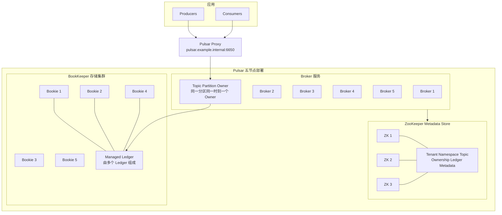
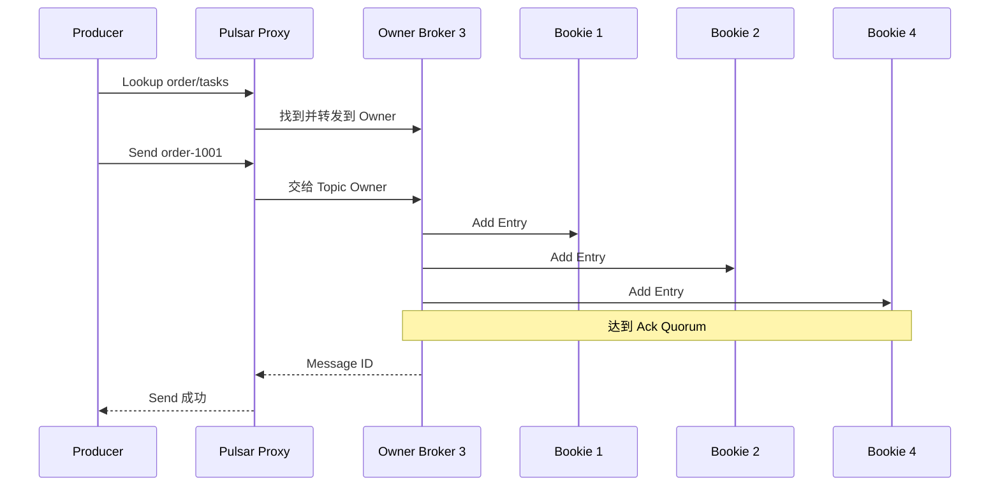
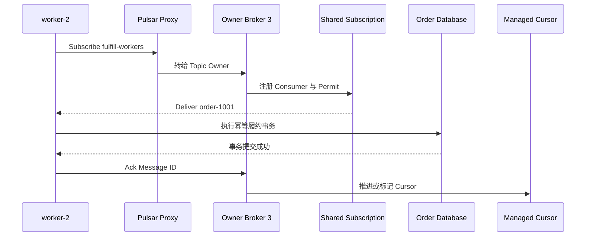

Pulsar 把接入计算和消息存储分开：Broker 负责协议、Topic Partition 所有权和投递，BookKeeper 负责持久化日志。Broker 故障后转移的是 Topic Partition 的所有权，历史消息不需要跟着 Broker 搬迁。

本文通过五节点部署和两个订单示例说明客户端最终连接谁、Owner Broker 做什么、Bookie 保存什么，以及 Subscription 如何形成不同消费语义。Ledger、Fragment、LAC、连续写入和 Bookie 故障恢复见[消息队列实现篇](032_pulsar_message_queue_implementation.md)，任务投递和 Cursor 恢复见[任务队列实现篇](033_pulsar_task_queue_implementation.md)。

<!-- more -->

## 1. 五节点生产部署

为了在五台机器内展示完整链路，本例合并部署 Broker 与 Bookie，并在前三台部署 ZooKeeper Metadata Store：

| 节点 | IP | 部署角色 |
|---|---|---|
| `pulsar-1` | `10.0.0.11` | Broker 1 + Bookie 1 + ZooKeeper 1 |
| `pulsar-2` | `10.0.0.12` | Broker 2 + Bookie 2 + ZooKeeper 2 |
| `pulsar-3` | `10.0.0.13` | Broker 3 + Bookie 3 + ZooKeeper 3 |
| `pulsar-4` | `10.0.0.14` | Broker 4 + Bookie 4 |
| `pulsar-5` | `10.0.0.15` | Broker 5 + Bookie 5 |

生产环境通常把 Broker、Bookie 和 Metadata Store 放到独立故障域，避免一台物理机同时损失接入、存储副本和元数据投票。本例的 Proxy 地址为 `pulsar.example.internal:6650`。

### 1.1 完整生产架构



先把几个容易混淆的名字对齐：

- **Broker** 是无共享的接入与调度服务。它拥有 Topic Partition，但不是历史消息的唯一物理存储点。
- **BookKeeper** 是由多个 Bookie 组成的分布式日志存储系统。
- **Bookie** 是一个具体存储进程，接收和保存 Ledger Entry。
- **Managed Ledger** 是 Broker 看到的一条长期 Topic 日志，它会由多个 Ledger 首尾相接组成。
- **Ledger** 是 BookKeeper 中带编号的逻辑追加日志，不等于 Bookie 磁盘上的一个文件。
- **Entry** 是 Ledger 的追加单位，可以包含一条消息或一个消息批次。
- **Metadata Store** 保存控制面元数据，不保存业务消息正文。

同一时刻，一个非分区 Topic 或一个 Topic Partition 只有一个 Owner Broker，正常生产和投递由它发起。一个分区 Topic 的不同 Partition 可以同时属于不同 Broker。

### 1.2 Pulsar 保存的四类数据

- **租户与资源元数据**
  - 解决的问题：有哪些 Tenant、Namespace、Topic、Subscription Policy 和权限。
  - 保存组件：Metadata Store。本例使用三节点 ZooKeeper。
  - 一致性机制：ZooKeeper 使用 ZAB 维护一致的元数据更新顺序。

- **Topic 所有权与运行状态**
  - 解决的问题：某个 Topic Partition 当前由哪个 Broker 服务。
  - 保存组件：Broker 与 Metadata Store 的协调状态；Connection、Producer、Consumer 和 Dispatcher 主要在 Owner Broker 内存中。
  - 故障含义：Broker 故障后重新分配所有权，客户端重新连接新的 Owner。

- **消息日志**
  - 解决的问题：Topic 中按什么顺序保存了哪些消息。
  - 保存组件：Broker 把消息追加到 Managed Ledger；BookKeeper 把 Ledger Entry 分布写入多个 Bookie。
  - 一致性机制：单个 Owner Broker 作为 Writer，按 Ensemble、Write Quorum 和 Ack Quorum 向 Bookie 执行 Quorum 写入。

- **Subscription 与 Cursor**
  - 解决的问题：一套订阅已经确认到哪里，哪些消息需要继续投递。
  - 保存组件：Owner Broker 维护当前 Consumer/Dispatcher 运行状态；持久 Subscription 的 Cursor 由 Managed Ledger 子系统持久化，Broker 切换后可以恢复。
  - 语义特点：不同 Subscription 拥有独立 Cursor，一个 Subscription Ack 不推进另一个 Subscription。

## 2. 示例一：订单履约任务

创建：

```text
Topic:        persistent://shop/order/tasks
Subscription: fulfill-workers
Type:         Shared
Consumers:    worker-1 / worker-2 / worker-3
```

Shared Subscription 让三个 Worker 竞争同一份消息。若要求同一订单按 Key 串行，应使用 Key_Shared，并让 Producer 稳定设置订单 Key。

本例假设 Topic Owner 是 Broker 3，当前 Ledger 的 Bookie Ensemble 为 Bookie 1、2、4。

### 2.1 初始化后各组件保存什么

- Metadata Store 保存 Tenant `shop`、Namespace `order`、Topic 定义、策略和当前所有权协调信息。
- Broker 3 加载该 Topic 的 Managed Ledger，建立 Producer/Consumer 接入和 Dispatcher。
- Managed Ledger 元数据记录当前使用哪些 Ledger；BookKeeper Ledger 元数据记录 Ledger ID、Bookie Ensemble 和写入参数。
- Bookie 1、2、4 保存当前 Ledger 中分配给自己的 Entry，不保存“完整业务 Topic 文件”。
- `fulfill-workers` 建立后拥有独立 Cursor；三个 Worker 共享这一个订阅进度，而不是每人一份完整进度。

例如，一个两分区 Topic 的逻辑关系可以是：

```text
order-events
├── partition-0 → Managed Ledger 0 → Ledger 101、Ledger 105
└── partition-1 → Managed Ledger 1 → Ledger 203、Ledger 208

Ledger 105：
Entry 0..99  → Bookie 1、2、3
Entry 100..  → Bookie 1、4、3（Bookie 2 故障后形成新 Fragment）
```

Bookie 切换不创建新的业务 Topic，也不必立即切换 Ledger；它可以让同一个 Ledger 后续 Entry 使用新的 Ensemble，形成新的 Fragment。Ledger 到达滚动条件、正常关闭或恢复后不能继续写时，Managed Ledger 才切换到下一个 Ledger。

### 2.2 Producer 生产消息的完整过程



1. Producer 通过 Proxy 查询 Topic，最终由 Broker 3 的 Owner Topic 实例处理请求。
2. Broker 可以把一条或多条 Pulsar Message 组成 BookKeeper Entry。
3. Broker 作为当前 Ledger 的唯一 Writer，把 Entry 写给 Ensemble 中的 Bookie。
4. 达到 Ack Quorum 后，Broker 才确认这次追加。
5. Broker 返回 Pulsar Message ID；它包含定位 Partition、Ledger 和 Entry 所需的信息。

Producer 不直接连接 Bookie，也不选择每条消息的存储副本。Proxy 是稳定入口；真正拥有写入权的是 Topic Partition 的 Owner Broker。

### 2.3 Consumer 有哪些状态

- **Subscription 身份**：`fulfill-workers` 与类型 Shared，表示三个 Worker 共用一份消费关系。
- **Consumer 连接**：Consumer ID、连接所在 Broker、接收队列和可用 Permit，主要保存在 Owner Broker 的运行状态中。
- **Dispatcher 状态**：当前应把下一条消息交给哪个 Consumer，由 Owner Broker 为该 Subscription 调度。
- **Unacked 与重投状态**：哪些消息已经投递但尚未确认，用于超时、Nack 和 Consumer 断开后的重新投递。
- **Cursor**：该 Subscription 的持久进度，用来让新的 Owner Broker 恢复订阅位置。

### 2.4 Consumer 消费消息的完整过程



1. Worker 始终连接 Proxy；Proxy 把协议请求转给 Broker 3。若不使用 Proxy，客户端会经 Lookup 后直接连接 Owner Broker。
2. 三个 Worker 绑定同一个 Shared Subscription，Owner Broker 的 Dispatcher 在它们之间分发消息。
3. Worker 2 收到消息后，Broker 把它视为已投递但未确认。
4. Worker 业务事务成功后按 Message ID Ack，Subscription 更新 Cursor/确认状态。
5. Worker 断开或 Ack 超时，消息可重新投递给其他 Worker。
6. 业务成功但 Ack 丢失仍会重复，因此必须幂等。

## 3. 示例二：订单事件流

创建两分区 Topic `persistent://shop/order/events`，Producer 使用 `order_id` 作为 Key。仓储、风控和分析分别创建独立 Subscription：

```text
warehouse → 独立 Cursor
risk      → 独立 Cursor
analytics → 独立 Cursor
```

两个 Partition 可以分别由 Broker 2 和 Broker 5 拥有，各自拥有 Managed Ledger。Producer 查询分区元数据后把消息交给目标 Partition Owner；Consumer 对每个 Partition 建立消费关系。

一个 Subscription 的 Ack 只推进自己的 Cursor，不影响其他 Subscription。消息是否继续保留由 Backlog、Retention 和 TTL 策略共同决定，不能把 Ack 简单等同于立即删除。

分区提高吞吐，但顺序只在同一 Partition 内成立。Shared 不保证同一 Key 被同一 Consumer 串行处理；Key_Shared 才用于把同一 Key 稳定交给同一 Consumer。

## 4. 从两个示例归纳语义边界

- Broker 是 Topic Partition 的 Owner 和协议处理者，Bookie 才是持久存储节点。
- BookKeeper 是存储系统，Bookie 是系统中的单个进程，二者不能混用。
- Managed Ledger 是 Topic 的长期逻辑日志；Ledger 是其滚动片段；Entry 是追加单位；这些都不等于 Bookie 上的单个物理文件。
- Subscription 表示一套消费关系和进度，Shared、Failover、Exclusive、Key_Shared 决定消息怎样交给 Consumer。
- Cursor 是恢复位置，Consumer 当前连接与 Permit 是 Owner Broker 内存状态。
- Producer 成功、Consumer 收到、业务成功和 Ack 成功是不同责任边界。

Pulsar 适合多租户、大量 Topic、计算存储分离、长期保留和跨地域复制。代价是 Broker、BookKeeper、Metadata Store 等组件更多，部署与故障判断也更复杂。

## 5. 客户端连接路径总结

```text
Producer / Consumer
        → Proxy 或任一 Broker 做 Lookup
        → Topic Partition 的唯一 Owner Broker
        → Owner Broker 读写 BookKeeper
        → 多个 Bookie 保存 Entry 副本
```

客户端不直接连接 Bookie。Broker 故障时转移的是 Topic Partition 所有权，新 Owner 从 Metadata Store 和 BookKeeper 恢复服务。

## 6. 下一篇解决的实现问题

以下内容见[Pulsar 消息队列实现篇](032_pulsar_message_queue_implementation.md)：

- Topic、Managed Ledger、Ledger、Fragment、Entry Log 的映射；
- Ensemble、Write Quorum、Ack Quorum 如何决定成功；
- 两次连续写入时 Bookie 故障如何处理；
- LAC 保存在哪里，多个 Bookie 如何对齐；
- Broker、Bookie 故障与旧 Owner 恢复。

Shared/Key_Shared 的任务分配、Ack、Cursor 和重复投递见[Pulsar 任务队列实现篇](033_pulsar_task_queue_implementation.md)。

## 7. 参考资料

- [Pulsar Architecture](https://pulsar.apache.org/docs/next/concepts-architecture-overview/)
- [Pulsar Messaging](https://pulsar.apache.org/docs/next/concepts-messaging/)
- [Pulsar Metadata Store](https://pulsar.apache.org/docs/next/administration-metadata-store/)
- [BookKeeper Overview](https://bookkeeper.apache.org/docs/overview/overview/)
