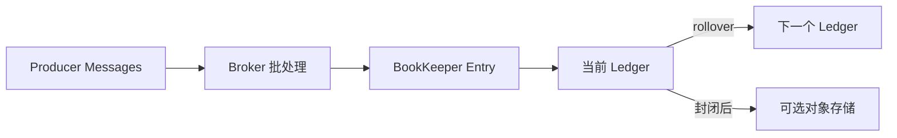
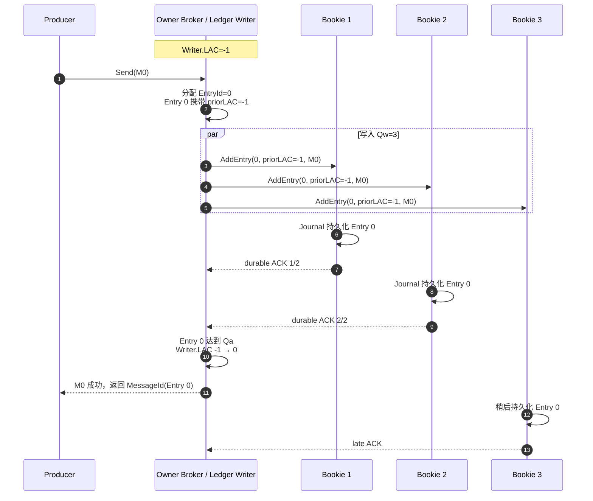
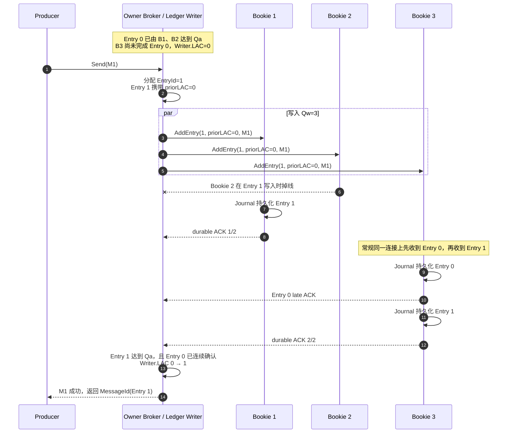
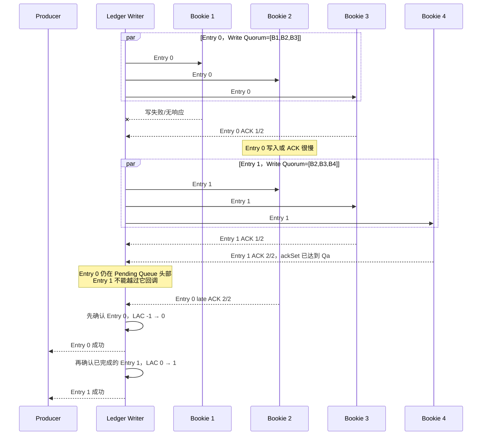
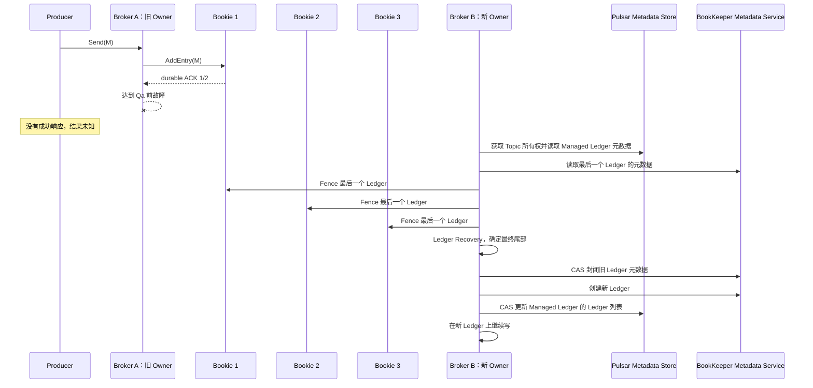
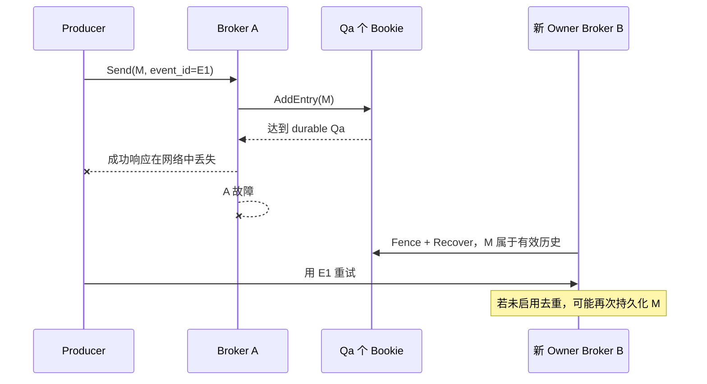
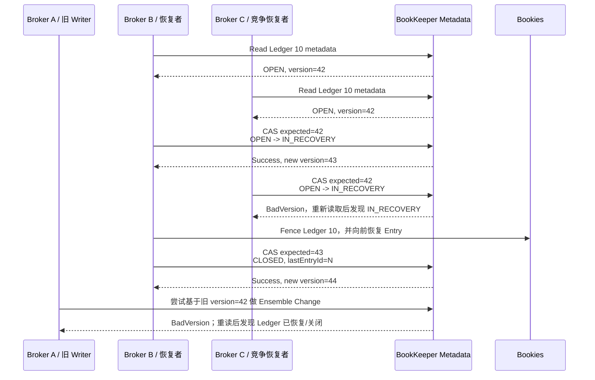
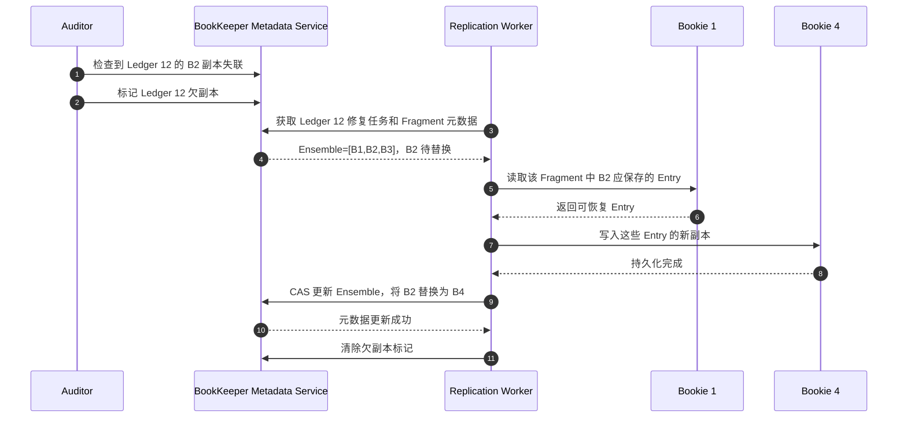

[第一篇](031_pulsar.md)已经说明 Broker Owner、BookKeeper、Bookie、Managed Ledger、Subscription 和客户端连接路径。本文从 Owner Broker 收到 `order-1001` 的位置继续，沿 Ledger Entry、写入 Quorum、LAC 和 Ensemble 变化解释消息存储、故障恢复、扩缩容、Producer 去重与事务。Shared/Key_Shared 的任务调度、普通 Ack 和 Cursor 见[任务队列实现篇](033_pulsar_task_queue_implementation.md)。

<!-- more -->

## 1. 存储模型：Managed Ledger、Ledger 和 Entry



这里有两个核心关系：

1. 消息属于 Topic/Partition，但物理副本属于 Ledger Entry；
2. Ledger 的副本集合可以在故障后更换，因此一个 Topic 的不同历史段可分布在不同 Bookie；

物理存储关系是：

```text
Managed Ledger 元数据
    → 记录 Topic 由哪些 Ledger 首尾组成
    → 保存于 Pulsar Metadata Store

BookKeeper Ledger 元数据
    → Ledger ID、Ensemble、Fragment 边界、Quorum 参数
    → 保存于 BookKeeper Metadata Service

Ledger Entry
    → Bookie 先写 Journal，再进入 Entry Log
    → Index 把 ledgerId + entryId 映射到 Entry Log 位置
```

Ledger 不是 Bookie 上的一个文件，Fragment 也不是独立文件。一个 Entry Log 文件可以混合保存多个 Ledger 的 Entry；Fragment 只是 Ledger 元数据中“这一段 Entry 使用哪组 Bookie”的逻辑范围。

Broker 缓存用于降低读延迟，但不构成持久化保证。真正的确认边界在 BookKeeper Journal 和 Ack Quorum。

### 1.1 控制面与数据面分别保存什么

理解故障恢复前，先把状态按职责分开。这里的 Pulsar Metadata Store 与 BookKeeper Metadata Service 是两套逻辑用途；如[第一篇的架构图](031_pulsar.md#11-%E5%AE%8C%E6%95%B4%E7%94%9F%E4%BA%A7%E6%9E%B6%E6%9E%84)所示，它们可以由同一个 ZooKeeper 集群承载，但不能因此视为同一类元数据：

- **Pulsar Metadata Store**：保存 Tenant、Namespace、Partitioned Topic 的分区数、Namespace Bundle 范围、动态的 Bundle Owner，以及 Managed Ledger 元数据；其中 Managed Ledger 元数据描述一个 Topic Partition 由哪些 Ledger 按顺序组成、当前写到哪个 Ledger；
- **BookKeeper Metadata Service**：保存可用 Bookie 的注册信息和 BookKeeper Ledger 元数据；其中 Ledger 元数据包含 Ledger ID、`E/Qw/Qa`、每个 Fragment 的 Ensemble，以及 Ledger 是否已经关闭；
- **Bookie 数据面**：Journal、Entry Log 和索引保存真正的 Ledger Entry；
- **Owner Broker 内存**：保存当前 Producer、Pending Write、Writer LAC（LastAddConfirmed，当前 Ledger 已连续确认到的最后一个 Entry ID）、缓存和 Dispatcher 等运行状态，Broker 切换后可以从上述持久状态重建。

```text
Pulsar Metadata Store       记录：谁拥有 Topic、Topic 由哪些 Ledger 组成
BookKeeper Metadata Service 记录：有哪些 Bookie、Ledger 各段使用哪些 Bookie
Bookie 数据面                保存：Topic 的消息正文和可恢复日志
Owner Broker                执行：排序、批处理、Quorum 写入和客户端响应
```

因此，无论 Pulsar Metadata Store 还是 BookKeeper Metadata Service 达成了元数据共识，都不等于业务消息已经持久化；Bookie 上存在某个 Entry，也不等于该 Entry 已达到 Ack Quorum。两套元数据分别回答“谁拥有 Topic、Topic 包含哪些 Ledger”和“Ledger 应写到哪些 Bookie”，Bookie 数据面才负责保存 Entry，而 Ack Quorum 决定哪些写入可以向上层承诺成功。

## 2. BookKeeper 多副本的三个参数

每个 Ledger 由三个参数定义副本写入范围：

| 参数 | 含义 | 第一性原理 |
|---|---|---|
| Ensemble `E` | 该 Ledger Fragment 可使用的 Bookie 集合大小 | 副本放置范围 |
| Write Quorum `Qw` | 每条 Entry 实际写入多少个 Bookie | 单条消息的目标副本数 |
| Ack Quorum `Qa` | 至少收到多少个持久化确认才算成功 | Producer 成功时已经保证的副本数 |

必须满足：

```text
E >= Qw >= Qa
```

例如 `E=3, Qw=3, Qa=2` 表示每条 Entry 发往 3 个 Bookie，收到其中 2 个持久确认后即可完成写入。它不是“一个主节点同步到两个从节点”，而是单写者向一组对等存储节点执行 Quorum 写入。

`Qa=2` 可以安全承受一个已确认副本丢失；若要抵抗机架或可用区故障，还必须使用 rack-aware 或 region-aware 放置策略。三个副本若都在同一故障域，仍然只能抵抗单机故障。

## 3. 消息何时可以返回成功

### 3.1 Writer.LAC 是什么，如何初始化

- `LAC` 是 `LastAddConfirmed`：当前 Ledger 从 Entry 0 开始，连续达到 Ack Quorum 的最后一个 Entry ID。
- `Writer.LAC` 是 Owner Broker 持有的 BookKeeper 写句柄中的内存状态，用来表示当前 Ledger 已连续确认到哪里。
- 新 Ledger 没有任何 Entry，因此初始化为 `Writer.LAC = -1`，第一条消息使用 `Entry ID = 0`。
- Broker 故障恢复时，BookKeeper 根据 Ledger 元数据和 Bookie 副本确定旧 Ledger 的最终确认位置并关闭旧 Ledger；Pulsar 随后创建新 Ledger，新 Writer 仍从 `LAC = -1` 开始。

LAC 按 Ledger 独立维护，不是 Topic 的全局位点。它如何更新由后面的连续写入示例说明。

以下都假设当前 Ledger 的参数是：

```text
Ensemble = [Bookie 1, Bookie 2, Bookie 3]
E = 3，Qw = 3，Qa = 2
初始 Writer.LAC = -1，表示还没有确认任何 Entry
```

每条 Entry 会发给三个 Bookie，但得到任意两个持久化 ACK 就满足 `Qa=2`。不同 Entry 不要求由完全相同的两个 Bookie 确认。

### 3.2 两次连续写入：第二次 Bookie 2 掉线

假设 Producer 连续发送 `M0`、`M1`，Broker 分别把它们写成 `Entry 0`、`Entry 1`。

#### 3.2.1 Entry 0 由 Bookie 1、2 确认



第一次返回成功时，已经确定至少 Bookie 1、2 持久保存了 Entry 0。Bookie 3 可以稍后追上；`Qa=2` 不要求为了这次响应等待全部三个 Bookie。

#### 3.2.2 Entry 1 写入时 Bookie 2 掉线

先看更容易遗漏的情况：Entry 0 已由 Bookie 1、2 达到 `Qa=2`，Broker 已向 Producer 返回成功，但 Bookie 3 还没有返回 Entry 0 的 ACK。这里的“没有返回 ACK”可能是写入较慢，也可能是数据已经落盘但响应仍在途中。Writer 不必等待第三个 ACK 才发送 Entry 1；Entry 1 携带的仍然是已经确认的 `priorLAC=0`。



所以答案是：**第二次写入可以由 Bookie 1、3 确认，不要求仍然是第一次的 Bookie 1、2。** 图中采用最常见的时序：同一个 Writer 先向 B3 发送 Entry 0，再发送 Entry 1，B3 依次完成两次写入。此时 Entry 0 有 B1、B2、B3 三份，Entry 1 有 B1、B3 两份。

但这不是安全性的前提。假如 B3 对 Entry 0 的那次写入确实失败，随后却成功保存了 Entry 1，Entry 1 仍可与 B1 的 ACK 一起达到 `Qa=2`。这是安全的，因为 Entry 0 早已由 B1、B2 达到 `Qa=2`；BookKeeper 要求的是每个 Entry 分别达到 Ack Quorum，以及 Writer 按 Entry ID 连续回调，不要求同一个 Bookie 必须保存该 Ledger 的完整前缀。

Bookie 2 掉线后是否立刻换成 Bookie 4，还受客户端的 Ensemble Change 策略和故障到达顺序影响：

- 如果 Bookie 1、3 已经先满足 `Qa=2`，Entry 1 可以成功；不需要仅为了本次 ACK 等待第三个副本恢复；
- 如果 B3 对 Entry 1 也无法返回 ACK，B2 掉线后 Entry 1 只剩 B1 的一个 ACK，不能成功；
- 如果 B3 没有 Entry 0、但成功持久化 Entry 1，Entry 1 可以由 B1、B3 达到 `Qa=2`；这不会影响已经由 B1、B2 确认的 Entry 0；
- 若 Writer 在 Entry 1 仍处于 Pending 状态时发起 Ensemble Change，就会通过元数据 CAS 将 Bookie 2 替换为 Bookie 4，从 Entry 1 开始形成新 Fragment，并把受影响的 Pending Entry 1 发给新 Ensemble；
- 开启延迟 Ensemble Change 时，只要剩余响应仍能满足 Ack Quorum，可以暂缓昂贵的元数据切换；无法满足 `Qa` 时才必须替换或让写入失败。

注意，Ensemble Change 从新的 Fragment 起点生效，不会因为 Entry 1 切换到 B4，就自动把旧 Fragment 的 Entry 0 也复制给 B4。Entry 0 已经由 B1、B2 达到成功条件；若 B2 后来永久丢失，旧 Fragment 的欠副本由 AutoRecovery 另行修复。

这解释了 `Qw=3、Qa=2` 的取舍：目标写入范围是三个 Bookie，但 Producer 的成功条件是其中两个耐久 ACK；第三份可能通过迟到写入完成，Bookie 失效后也可能从某个新 Entry 开始做 Ensemble Change，并由后续 AutoRecovery 修复旧 Fragment。

### 3.3 第二次写入必须等待第一次吗

要区分“能否开始写”和“能否返回成功”：

- **不必等待才能开始**：BookKeeper 支持流水线，Entry 1 可以在 Entry 0 的回调完成前就发往 Bookie；
- **必须等待才能成功返回**：Entry 1 不能越过 Entry 0 向 Broker/Producer 返回成功，LAC 只能连续推进。

这里还要区分三件事：Bookie 的物理 Journal 记录顺序、某个 Entry 自己是否达到 `Qa`、Writer 是否可以向上层回调。

- Journal 是 Bookie 的本地预写日志，记录中包含 `ledgerId + entryId`。Ledger 的逻辑顺序由 Entry ID 和 LAC 决定，并不靠 Entry 在 Entry Log/Journal 文件中的物理偏移决定；
- 在同一个 Writer、同一个 Bookie、同一条连接的正常路径中，Writer 先发送 Entry 0，再发送 Entry 1；但这只是常规到达时序，不是 Partition 顺序的存储依据；
- Bookie 按 `(ledgerId, entryId)` 索引 Entry，不要求本机持有连续前缀。写入失败、重试、Recovery 或 `Qw<E` 的轮转 Write Quorum，都可能让某个 Bookie 有 Entry 1、却没有 Entry 0；
- Journal/Entry Log 中的物理先后也不是 Partition 顺序。一个文件本来就会混入多个 Ledger 的 Entry，读取时先通过索引定位，再按 Ledger 的 Entry ID 返回；
- BookKeeper 协议明确要求：高 Entry 即使先达到自己的 `Qa`，也只有在所有更低 Entry 已向客户端确认后才能回调。

如果固定写集合始终是 `[B1,B2,B3]`，而其中两个 Bookie 从 Entry 0 开始一直不可用，那么你的判断是对的：Entry 1 同样凑不齐 `Qa=2`。高 Entry 先达到自己的 `Qa`，必须有额外条件，例如故障只影响某次请求、后续节点恢复、发生 Ensemble Change，或者 `Qw<E` 时相邻 Entry 使用了不同的 Write Quorum。

为了不依赖“某次请求单独失败”这种特殊时序，下面改用轮转 Write Quorum 展示最清晰的情况。

设置 `E=4、Qw=3、Qa=2`：Entry 0 的写集合是 `[B1,B2,B3]`，Entry 1 的写集合是 `[B2,B3,B4]`。B1 未写成、B2 对 Entry 0 很慢，只有 B3 完成 Entry 0；与此同时 B3、B4 可以让 Entry 1 自己达到 `Qa=2`：



如果 Entry 0 的 Pending Add 最终超时或收到不可恢复错误，Writer 不能仅凭 Entry 1 的 ackSet 单独向上层宣布 Entry 1 成功。BookKeeper 会重发受影响的 Pending Add，或通过 Ensemble Change 替换故障 Bookie并重发；仍无法恢复时，Ledger 写入失败，后续 Recovery 决定旧 Ledger 的连续结尾。

这个例子同时回答了物理存储问题：此刻 B4 可以只有 Entry 1 而没有 Entry 0，因为 Entry 0 根本不属于 B4 的 Write Quorum。BookKeeper 依靠 Entry ID 和 Pending Add Queue 保证逻辑顺序，不要求每个 Bookie 的本地 Entry 集合都从 0 连续到最新。即便 Entry 1 已达到自己的 `Qa`，Pending Add Queue 仍不会先回调它；这种有序回调才是不向上层暴露空洞的关键。

这样做是为了防止出现：

```text
Entry 0：未知或缺失
Entry 1：已经向 Producer 返回成功
```

BookKeeper 对外承诺的是一段按 Entry ID 排序、没有已确认空洞的连续日志，而不是 Entry Log 文件中的物理相邻记录，也不是若干彼此独立的成功 Entry。

### 3.4 LastAddConfirmed 到底保存在哪里

前面已经说明 LAC 的语义。本节只回答它保存在哪里、怎样传播。它分为三种形态，不能混成“所有 Bookie 上的同一个变量”。

#### 3.4.1 Writer 内存中的权威 LAC

Ledger 正常写入时，当前 LedgerHandle/Owner Broker 在内存中维护权威的 `Writer.LAC`：

```text
Entry 0 连续达到 Qa → Writer.LAC = 0
Entry 1 连续达到 Qa → Writer.LAC = 1
```

它决定当前 Writer 已经成功确认到哪里。LAC 不会在每次写入后都更新到 BookKeeper Metadata Service；其中的 Ledger `lastEntryId` 通常是在 Ledger 被 CLOSED 后才成为最终结尾。

#### 3.4.2 普通 Entry 中携带的 priorLAC

每次写 Entry 时，协议会把“发送这一条时已经确认到哪里”放进 Entry 头部。Bookie 把整个 Entry 写入 Journal，因此这个 priorLAC 会随 Entry 一起持久保存：

```text
Entry 0 携带 priorLAC=-1
Entry 1 携带 priorLAC=0
Entry 2 携带 priorLAC=1
```

注意，Entry 1 达到 Qa 后 Writer 才能把 LAC 推进到 1，所以 Entry 1 通常只能携带此前的 LAC=0；要让 Bookie 从普通写入中知道 LAC=1，需要后续 Entry 2 把它带过去。

#### 3.4.3 可选的 Explicit LAC

如果一段时间没有下一条 Entry，Writer 可以按配置发送 Explicit LAC，把最新 LAC 单独传播给 Bookie。现代 Bookie 存储格式可以把 Explicit LAC 写入 Journal，并保存在 Ledger 的 FileInfo 中。

Explicit LAC 解决的是“最后一条已确认 Entry 后面没有新 Entry，Bookie 如何尽快知道最新 LAC”。它不会改变 Entry 是否曾达到 Ack Quorum，也不是三个 Bookie 之间的共识投票。

### 3.5 三个 Bookie 如何对齐 LAC

答案是：**正常写入期间不要求三个 Bookie 的本地 LAC 时刻完全一致。** 它们不会互相同步 LAC，也不会共同选举一个 LAC。

连续两次写入结束后，可能出现：

| 位置 | 保存的 Entry | 已知的最高 LAC | 原因 |
|---|---|---|---|
| Writer | Entry 0、1 已连续完成 | 1 | 已收到两条 Entry 的有序 Qa |
| Bookie 1 | Entry 0、1 | 0 | Entry 1 中携带 priorLAC=0 |
| Bookie 2 | Entry 0，随后掉线 | -1 | Entry 0 写入时携带 priorLAC=-1 |
| Bookie 3 | Entry 0、1 | 0 | Entry 1 中携带 priorLAC=0 |

若随后写入 Entry 2，它会携带 `priorLAC=1`，收到它的 Bookie 就会学到 LAC=1；若没有 Entry 2，可以由 Explicit LAC 传播。Bookie 2 掉线期间继续保留旧认知并不破坏正确性。

读者或恢复者不会相信单个落后 Bookie。它会向足够多的 Bookie 查询 LAC，取最高的有效结果作为安全起点；Broker 故障恢复还会 fencing 旧 Writer，并从该起点向后逐条读取和补齐，最终把 Ledger 以确定的 `lastEntryId` 关闭。此时所有读者依据 CLOSED Ledger 元数据得到相同结尾。

所以“对齐”分为两层：

1. 平时通过后续 Entry 或 Explicit LAC 让各 Bookie 逐步学到更新位置；
2. 故障时通过 Quorum 查询、fencing、向后扫描和 CAS Close 确定唯一最终结尾。

### 3.6 未确认 Entry 如何处理

假设 Writer 已经确认到 Entry 1，即 `Writer.LAC=1`，随后 Entry 2 只写入 Bookie 3，尚未达到 `Qa=2`，Broker 就故障：

```text
Bookie 1：Entry 0、1
Bookie 2：Entry 0，已掉线
Bookie 3：Entry 0、1、2
Writer：LAC=1，Entry 2 未向 Producer 返回成功
```

Entry 2 位于已确认连续前缀之后，普通读者不能把它直接当成已提交消息。Recovery 会：

1. Fence 旧 Ledger，阻止旧 Writer 再凑够 Ack Quorum；
2. 查询各 Bookie 的最高已知 LAC；
3. 从安全起点之后逐条探测 Entry；
4. 如果 Entry 2 仍能从某个 Bookie 读出，就把它以 Recovery Add 补到完整 Write Quorum，并把它纳入最终 Ledger；
5. 如果 Entry 2 已无法读出，就在 Entry 1 结束并关闭 Ledger；残留的孤立字节不属于有效日志，之后由存储清理。

因此，Producer 没收到 Entry 2 的成功响应时，结果仍然未知：它可能在 Recovery 中被保留，也可能被舍弃。Producer 要用相同业务事件 ID 重试，Consumer 仍需幂等。

### 3.7 Journal 持久化与 DEFERRED_SYNC

正常耐久写入的过程可以简化为：

```text
Bookie 收到 Entry
  → 写入 Journal
  → Journal 刷到持久介质
  → 返回 durable ACK
```

Bookie 可以把多条 Journal 写入合并刷盘，不等于每条消息单独执行一次物理 `fsync`；但 ACK 的耐久边界仍在 Journal 刷盘之后。Ledger Storage 可以随后从内存结构刷新，Bookie 崩溃重启时用 Journal 重放恢复。

BookKeeper 底层还提供特殊的 `DEFERRED_SYNC` 写标志。使用它时，Bookie 可以在数据只进入操作系统缓冲区、尚未刷到持久介质时返回；这种写入不会像普通耐久 Add 那样推进 LAC。若此时整机掉电，已经返回的数据仍可能消失。

两种写入的成功边界不同：

```text
普通 Durable Add 成功
  = 至少 Qa 个 Bookie 已把 Entry 写入持久 Journal

DEFERRED_SYNC 成功
  = Bookie 已暂时接收数据，但掉电后仍可能丢失
```

本文讨论 Pulsar 持久 Topic 的成功语义时，默认指普通 Durable Add。除非应用明确选择了放松持久性的底层模式，并接受最近一段已响应数据在掉电时丢失，否则不能把 `DEFERRED_SYNC` 的成功称为“持久化成功”。这里所谓重新定义 RPO，就是明确承认：故障时允许丢掉多少条或多长时间内已经返回的消息。

### 3.8 Producer 重试如何避免重复写入

Broker 已经写成功但响应丢失时，Producer 必须重试。Pulsar 的 Broker 端去重依赖两项身份：

```text
Producer Name：标识同一个逻辑 Producer
Sequence ID：  标识该 Producer 在当前 Topic Partition 上的消息顺序
```

`Sequence ID` 首先来自 **Pulsar Client Producer**，不是 Broker 根据 BookKeeper Entry ID 生成的：

1. 每个 Producer 在目标 Topic Partition 上为发送消息分配单调递增的 Sequence ID；应用也可以通过消息构造器显式指定；
2. Producer Name 标识这条序列属于哪个逻辑 Producer。使用分区 Topic 时，各 Partition Broker 分别维护该 Producer 在本 Partition 的状态；
3. Broker 收到 `CommandSend(producerId, sequenceId, highestSequenceId, ...)` 后，在写 BookKeeper 前检查该 Producer Name 的序列进度；
4. 批消息除了起始 Sequence ID，还可携带 `highestSequenceId`，使 Broker 知道一个 Batch 覆盖到哪个序号；
5. BookKeeper 持久化成功后，Broker 才把相应序列更新为 persisted，并向 Producer 完成 send future/callback。

启用去重后，Owner Broker 的 `MessageDeduplication` 对每个 Producer Name 至少区分两类进度：

```text
highestSequenceIdPushed
  收到请求并准备写入的最高序号，用于挡住同一 Owner 上并发到达的重复请求

highestSequenceIdPersisted
  已经收到 Managed Ledger 持久化回调的最高序号，可进入持久快照
```

重试请求的 Sequence ID 已经持久化或已在当前写入窗口中处理过时，Broker 将其判为重复，不再向 Managed Ledger 追加第二份消息。持久状态通过名为 `pulsar.dedup` 的内部 Managed Cursor 做周期性快照：Cursor 的 mark-delete position 关联每个 Producer 的最高持久序号。新 Owner 加载 Topic 时读取快照，再重放快照位置之后的 Entry，重建精确状态。因此它不只是旧 Owner Broker 的临时内存 Map。

Producer 重连时也有两层编号不要混淆：连接内的 `producerId` 是协议对象标识，去重身份依赖稳定的 Producer Name；Sequence ID 是消息序号，Message ID 则是持久化后得到的 `(ledgerId, entryId, partition, batchIndex)` 位置。Producer 重新创建后若换了名称，Broker 会按新序列处理；希望故障重试去重时必须保持名称和序号连续。

它只能解决 Producer 到同一 Topic Partition 的重复发布：

- Producer Name 必须稳定，换一个名称会被视为新的 Producer；
- Partitioned Topic 的去重状态按 Partition 独立维护；
- Producer 长时间不活动后，去重状态可能按配置清理；
- Consumer 的数据库写入或 HTTP 调用仍需使用稳定业务 `event_id` 幂等。

### 3.9 批处理和背压改变性能，不改变确认边界

Producer 可以把发往同一 Partition 的多条消息组成一个 Batch，再由 Broker 写成较少的 BookKeeper Entry。批处理能够减少网络与 Journal 开销，但会带来两个结果：

- 第一条消息要等待 Batch 满、达到延迟上限或显式刷新，低流量时延迟可能增加；
- Message ID 除了 Ledger ID、Entry ID，还需要 Batch Index 才能定位 Batch 内的具体消息。

无论一个 Entry 中有一条还是一批消息，成功边界仍是该 Entry 达到 `Qa`。Broker/BookKeeper 变慢时，异步发送会堆积在客户端 Pending Queue 中；应用必须设置队列上限和失败策略，不能把无限内存堆积当作可靠重试。

## 4. Pulsar 是否采用主从复制或半同步

对持久 Topic 的消息数据来说，答案是：**不是 Broker 主从复制**。

- Broker 是某个 Topic 分区的临时单写者；
- Bookie 是对等存储节点，没有为每个 Topic 选一个 Bookie Master；
- `Qa` 决定一次成功等待几个持久副本；
- Broker 故障后转移的是 Topic 所有权，并恢复/封闭最后一个 Ledger；
- Bookie 故障后修复的是 Ledger Fragment 副本，不是提升“从 Broker”为“主 Broker”。

如果一定要与半同步主从类比，`Qa < Qw` 看起来像“等待部分副本后返回”，但 BookKeeper 更准确的术语是 Ack Quorum。使用正确术语能避免误以为某个 Slave 会带着本地日志直接接管 Topic。

## 5. Broker 故障的临界场景

### 5.1 M 未达到 Qa，Broker 就故障



图中的“创建新 Ledger”是 **在同一个 Pulsar Managed Ledger 中创建下一个 BookKeeper Ledger**。它不是创建新 Topic/Partition，也不是 BookKeeper 的新 Fragment。Fragment 是同一 BookKeeper Ledger 内因 Ensemble 变化而产生的分段；Ledger 滚动是 Managed Ledger 的日志段切换。

这个过程由新 Owner Broker 的 Managed Ledger/BookKeeper Client 执行，不是 Producer 负责修复 Ledger。Producer 侧通常经历：旧连接断开 → Client 自动重新 lookup Topic Owner 并连接新 Broker → 把本进程 `pendingMessages` 中尚未完成的 send 用原 Sequence ID 重新发送。只要 send future 尚未因 `sendTimeout` 等条件失败，这一层一般由客户端库完成；如果 send future 已经以超时或连接错误返回应用，是否再次投递则由应用的重试策略决定。Producer 只知道 M 没有成功响应，并不知道 Recovery 最终保留还是排除了 M。

恢复过程也不是简单地“只保留旧 Writer 内存 LAC 之前的数据”。新 Broker 会：

1. 把旧 Ledger 标记为恢复中并执行 fencing；
2. 从 Bookie 获得最高的已知 LAC；
3. 从该位置向后逐条探测；
4. 若尾部 Entry 仍可读，则把它补齐到相应 Write Quorum；
5. 遇到不可继续读取的位置后，以 CAS 封闭 Ledger，所有恢复者收敛到同一结尾。

因此 M 虽未向 Producer 达到可见的成功条件，也可能已经写到至少一个 Bookie，并在 Recovery 向前探测时可读，随后被 recovery add 补到该 Entry 的整个 Write Quorum，成为封闭 Ledger 的有效尾部；也可能因为任何恢复读集合都无法读到而被排除在最终 `lastEntryId` 之外。Producer 没收到成功时不能推断 M 一定不存在，应以原 Producer Name/Sequence ID 重试，并继续使用业务 `event_id` 让下游幂等。

### 5.2 M 已达到 Qa，但响应丢失



这是所有分布式写入都绕不开的不确定窗口：服务端已经成功，客户端却不知道。解决方法不是“不重试”，而是：

- Producer 使用稳定名称和 Sequence ID，并在需要时启用 Broker 去重；
- 消息携带稳定业务 `event_id`；
- Consumer 仍按业务 ID 幂等，因为消费重投也会制造重复。

### 5.3 Producer 已收到成功，Broker 随后故障

只要仍有足够的已确认 Bookie 副本可读，新 Broker 的 Recovery 就能保留 M。Broker 本身无需拥有 M 的本地完整副本。

但保证范围由 `Qa` 和故障域放置共同决定。如果 `Qa=2` 的两个确认副本所在整机架同时损坏，Producer 收到成功也不能创造不存在的第三份持久数据。

## 6. 旧 Broker 恢复后如何避免双写

Pulsar 用两个层次保持单一历史：

1. 元数据存储中的 Bundle/Topic 所有权决定当前谁可以服务 Topic；
2. BookKeeper fencing 和 Ledger 元数据 CAS 阻止旧 Writer 在旧 Ledger 上重新达到 Ack Quorum。

### 6.1 用一个具体版本号说明 CAS

假设 Broker A 原来持有 Topic，正在写 BookKeeper Ledger 10。Ledger 10 的元数据是：

```text
metadata version = 42
state            = OPEN
ensemble         = [B1, B2, B3]
```

A 与元数据服务失联，但进程和到部分 Bookie 的网络还活着。Broker B、C 都可能尝试恢复，CAS 过程如下：



CAS 比较的不是“Broker 名称”，而是元数据节点的版本。只有读取了当前版本并提交匹配 expected version 的更新者能成功。B 把 `OPEN@42` 改成 `IN_RECOVERY@43` 后，C 和 A 基于 42 的更新都失败；它们必须重读，看到 Ledger 已进入恢复或关闭状态后停止作为该 Ledger 的 Writer。

Pulsar Managed Ledger 元数据还有一层版本 CAS。假设它的版本 88 记录 Ledger 列表 `[... , 10]`。B 完成 Ledger 10 Recovery 后创建 Ledger 11，再以 `expectedVersion=88` 把列表更新为 `[..., 10(closed), 11(current)]`。如果另一个会话也创建了候选新 Ledger，只有一个列表更新能成功；失败者收到 BadVersion/Fenced，不能把自己的 Ledger 接到 Topic 的有效历史上，孤立的空 Ledger 会被后续清理。

Topic/Bundle 所有权先减少并发 Writer 出现的机会，BookKeeper CAS 与 fencing 则是存储层最终屏障。即使所有权状态传播存在窗口，旧 Writer 也不能把旧 Ledger 继续推进成另一条已确认历史。

### 6.2 Fencing 如何让旧 Writer 凑不齐 Qa

对 `Qw=3、Qa=2`，Recovery 不要求在宣布 fenced 前等所有三个 Bookie；它需要从每个 Write Quorum 收到至少：

```text
(Qw - Qa) + 1 = (3 - 2) + 1 = 2
```

个 Bookie 的持久 fence 响应。任意两个 fenced Bookie 与旧 Writer 想取得的任意两个 ACK 必然相交，因此旧 Writer 最多只能从一个尚未收到 fence 的 Bookie 获得 Add 成功，无法达到 `Qa=2`。如果旧 Writer 尝试把故障 Bookie 换出 Ensemble，它对 Ledger 元数据的 CAS 又会因为版本已变成 `IN_RECOVERY` 而失败。

旧 Broker 可能还来得及把某个 Entry 写到个别 Bookie，因为 fence 消息不保证同时到达所有节点；但只要 fencing 覆盖集合与任意 Ack Quorum 相交，旧 Writer 就无法再凑够 `Qa` 并向客户端返回成功。它最终会收到 `LedgerFenced`；这个错误只能说明“本次写没有获得成功承诺”，不能说明任何 Bookie 都没有写入。

### 6.3 已写入 Journal、但没有达到 Qa 的 Entry 怎么处理

Bookie 不会在 Writer 未达到 `Qa` 时回滚已经刷盘的 Journal 记录。它也不知道其他 Bookie 是否 ACK，更不知道 Producer 是否收到成功。假设 Entry 7 只写入 B3：

```text
B3 Journal / Ledger Storage：存在 (Ledger 10, Entry 7)
B1、B2：                    不存在 Entry 7
旧 Writer：                 未达到 Qa，没有成功回调
```

这条数据先成为 **未确认尾部候选**。后续由 Ledger Recovery 决定它是否进入逻辑历史：

1. Recovery 先取得已知最高 LAC，然后从下一 Entry 开始逐条向前读；
2. 如果 Entry 7 能从某个合法副本读出，Recovery 使用 recovery add 把它复制到该 Entry 的整个 Write Quorum；
3. Entry 7 补齐后，Recovery 才继续探测 Entry 8；
4. 在第一个无法继续读取的 Entry 停止，以最后成功补齐的连续 Entry ID 做 CAS，将 Ledger 标记为 `CLOSED`；
5. 若 Entry 7 无法从恢复所需响应集合中读出，最终 `lastEntryId` 只到 6，B3 上孤立的 Entry 7 不属于可见日志。

所谓“舍弃”是 **从逻辑 Ledger 尾部排除**，不是立即在 Journal 中定位并擦除那几个字节。Journal 重放仍可能把记录放入 Ledger Storage，但普通 Reader 受 CLOSED Ledger 的 `lastEntryId` 和 LAC 限制，不会把尾部孤儿当成已承诺 Entry 返回。物理空间随后随 Entry Log compaction、整个 Ledger 删除和垃圾回收回收；BookKeeper 不为一次未达 `Qa` 的 Add 做跨 Bookie 两阶段回滚。

如果 Recovery 成功把一条 Producer 从未收到 ACK 的 Entry 纳入有效尾部，Producer 重发会落入“服务端已有、客户端未知”的窗口。启用去重时，新 Broker 从 `pulsar.dedup` 快照和尾部消息元数据重建 Producer Name/Sequence ID，可识别这次重发；未启用去重时仍可能再写一份，因此业务 `event_id` 幂等不可省略。

新 Owner 会封闭旧 Ledger、创建新 Ledger。旧 Broker 恢复后重新参与 Broker 集群，可以接管别的 Bundle，但不能把旧 Ledger 的孤立尾部自行重新发布。

## 7. Bookie 故障和副本修复

### 7.1 正在写入时的 Ensemble 变化

一个 Ledger 可以包含多个 Fragment，每个 Fragment 有自己的 Ensemble。Bookie 故障后，BookKeeper 客户端可以选择新 Bookie 替换它，并从新的 Entry 起形成新 Fragment：

```text
Ledger 12
  Entry 0   开始：Ensemble = [B1, B2, B3]
  Entry 900 开始：Ensemble = [B1, B2, B4]
```

这说明“一个 Ledger 固定复制在三台机器上”并不准确，更不能据此做静态磁盘归属判断。

若当前健康 Bookie 数量或放置条件无法满足 `E/Qw/Qa`，写入会阻塞或失败。继续有响应和继续满足承诺的副本安全，是两个不同指标。

### 7.2 AutoRecovery

AutoRecovery 分为两个逻辑角色：

- **Auditor** 根据 Bookie 失联和 Ledger 元数据找出欠副本 Fragment；
- **Replication Worker** 从仍可用副本读取 Entry，复制到新 Bookie，再更新 Ensemble 元数据。

AutoRecovery 修复的是“已存在但副本数不足”的历史数据。它不能恢复所有副本都已经丢失的数据，也不能替代正常写入路径上的 Ack Quorum。

#### 7.2.1 一个封闭 Fragment 如何迁移到 Bookie 4

假设 Ledger 12 已经封闭，其中一个 Fragment 的 Ensemble 是 `[B1, B2, B3]`，随后 B2 永久损坏。修复过程不是给 Topic 创建新 Partition，也不会改变 Entry ID：



整个过程遵循：

```text
先标记欠副本
→ 从仍存活的副本读取历史 Entry
→ 把缺失副本复制到新 Bookie
→ 数据完整后再修改 Ensemble 元数据
```

正在写入的 Ledger 由当前 Writer 通过 Ensemble Change 处理，已经封闭的历史 Ledger 主要由 AutoRecovery 修复。两者都会形成或修改 Fragment 的 Bookie 映射，但发起者和时机不同。

### 7.3 下线 Bookie

不能因为 Bookie 上没有“完整 Topic”就直接关机。一个 Bookie 通常包含大量 Topic 的部分 Ledger Fragment。安全下线流程应先禁止新分配，再执行 decommission/re-replication，确认欠副本清零后才移除节点。
