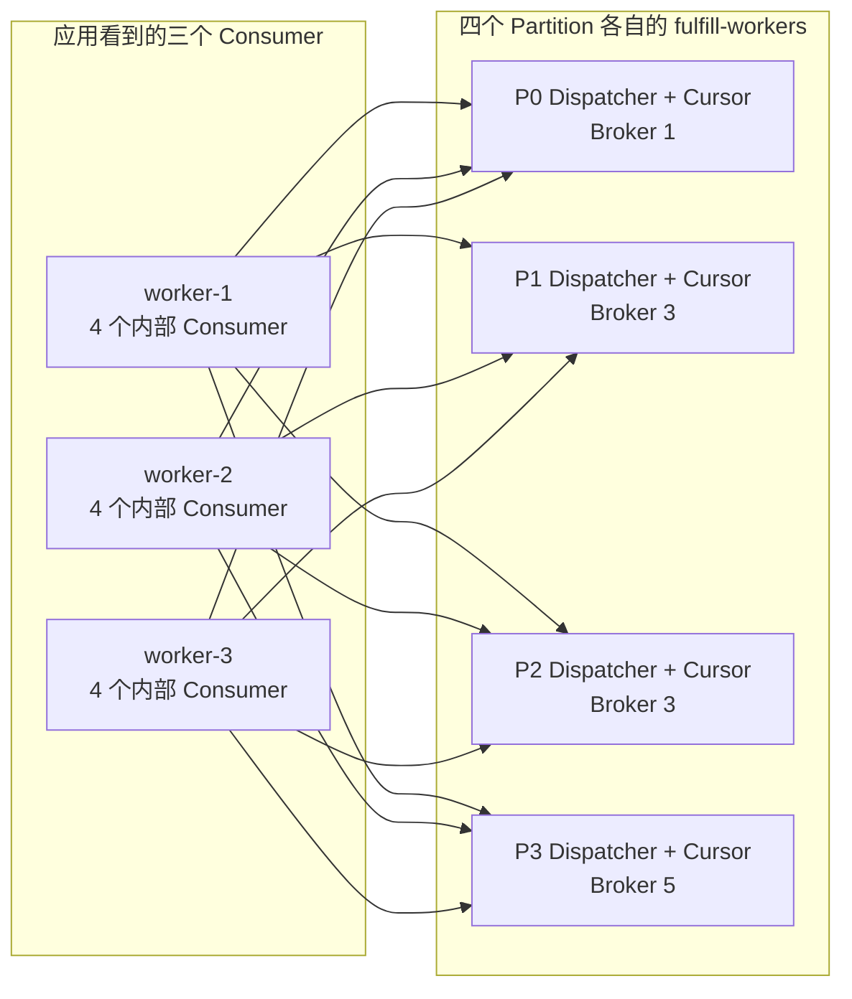
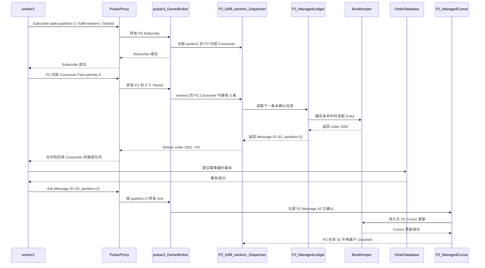

[第一篇](031_pulsar.md)已经说明订单履约任务的生产和消费路径，[消息队列实现篇](032_pulsar_message_queue_implementation.md)说明了 Managed Ledger 与 BookKeeper 的存储和复制。本文把 `shop/order/tasks` 扩展为四个 Partition，讨论 Shared/Key_Shared 在哪个层级分配任务、Worker 增减时如何重新分配、Ack 如何推进 Cursor，以及故障后为什么可能重复投递。

<!-- more -->

## 1. 任务队列需要维护哪些状态

继续使用第一篇的订单履约任务，但现在把它设为四分区 Topic：

```text
Partitioned Topic：persistent://shop/order/tasks
├─ tasks-partition-0 → Owner Broker pulsar-1
├─ tasks-partition-1 → Owner Broker pulsar-3
├─ tasks-partition-2 → Owner Broker pulsar-3
└─ tasks-partition-3 → Owner Broker pulsar-5

Subscription：fulfill-workers
Subscription Type：Shared
Consumers：worker-1、worker-2、worker-3
```

`tasks` 只是逻辑名称，真正拥有 Managed Ledger 和 Owner Broker 的是四个内部 Topic。每个 Partition 都独立维护：

```text
tasks-partition-N
├─ Managed Ledger / BookKeeper Ledger
└─ Subscription: fulfill-workers
   ├─ Managed Cursor
   └─ Shared 或 Key_Shared Dispatcher
```

因此先直接回答层级问题：**Shared 和 Key_Shared 都在单个 Partition 的 Subscription/Dispatcher 内生效。** 分区 Topic 上看到的 `fulfill-workers` 是同名订阅的逻辑集合，底层是四个 Partition 各自的 Cursor 和 Dispatcher，不存在一个跨四个 Partition 排序、派发和推进位置的全局 Dispatcher 或全局 Cursor。

消息正文仍然按照[消息队列实现篇](032_pulsar_message_queue_implementation.md)的流程写入 BookKeeper。每个 Partition 的任务消费再增加三类状态：

- **Subscription 与 Cursor**：回答 `fulfill-workers` 已经确认了哪些消息，属于持久状态；
- **Dispatcher 与 Consumer**：回答下一条任务交给哪个 Worker，主要是 Owner Broker 的运行状态；
- **Permit 与 Unacked**：回答每个 Worker 还能接收多少消息，以及哪些消息已经投递但尚未 Ack。

这三类状态不能混成一个 Offset：Cursor 负责单个 Partition 的故障恢复，Dispatcher 负责该 Partition 内的实时分配，Permit 负责一条分区级 Consumer 连接的流量控制。

标准客户端把这些分区级对象聚合起来，所以应用代码仍然只持有一个 `Consumer`：



在这个示例中，三个应用 Worker 通常会形成 `3 × 4 = 12` 个内部 Consumer。每个 Partition 的 Dispatcher 都看到三个候选 Consumer，但应用收到的消息会被客户端合并到同一个接收队列或 Message Listener。

## 2. 初始化 Subscription 后保存了什么

`fulfill-workers` 可以由管理接口提前创建，也可以在第一个 Consumer Subscribe 时创建。对于四分区 `tasks`，初始化的不是一份跨分区进度，而是四份同名的分区级订阅状态：

| 内部 Topic | Owner Broker | Subscription/Cursor 名称 | Cursor 只记录 |
|---|---|---|---|
| `tasks-partition-0` | `pulsar-1` | `fulfill-workers` | P0 的消费位置 |
| `tasks-partition-1` | `pulsar-3` | `fulfill-workers` | P1 的消费位置 |
| `tasks-partition-2` | `pulsar-3` | `fulfill-workers` | P2 的消费位置 |
| `tasks-partition-3` | `pulsar-5` | `fulfill-workers` | P3 的消费位置 |

- Pulsar Metadata Store 保存 Partitioned Topic 的分区数，以及各 Partition 的 Managed Ledger 元数据；
- 每个 Partition 的 Managed Ledger 子系统为 `fulfill-workers` 建立 Managed Cursor；
- 每个 Cursor 独立记录自己的初始位置，例如从 Earliest 或 Latest 开始；
- 还没有 Dispatcher 中的活跃 Consumer、Permit 和 Unacked，因为这些状态要等 Worker 的分区级连接建立后才产生。

三个 Worker 使用相同 Subscription Name，表示在每个 Partition 上共同处理一份任务。如果它们使用三个不同名称，每个 Partition 都会建立三份独立 Cursor，每个 Worker 最终都会收到整个四分区 Topic 的一份完整消息，这就不再是任务竞争模型。

## 3. Worker 如何注册并获得消息

### 3.1 Subscribe 注册了哪些信息

`worker-2` 订阅逻辑 Topic `order/tasks` 时，客户端先取得分区数，再分别 Lookup 四个内部 Topic 的 Owner。应用只调用一次 `subscribe()`，客户端内部实际建立四个分区级 Consumer：

```text
应用 Consumer = worker-2 / persistent://shop/order/tasks

内部 Consumer 0 → tasks-partition-0 → pulsar-1
内部 Consumer 1 → tasks-partition-1 → pulsar-3
内部 Consumer 2 → tasks-partition-2 → pulsar-3
内部 Consumer 3 → tasks-partition-3 → pulsar-5

Subscription = fulfill-workers
Type = Shared
Consumer ID = 每条 Broker 连接内的消费者编号
Consumer Name = worker-2
```

每个 Owner Broker 验证 Subscription 类型兼容后，把对应的 `worker-2` 内部 Consumer 加入本 Partition 的 `fulfill-workers` Dispatcher。于是 P0、P1、P2、P3 的 Dispatcher 都各自看到 `worker-1/2/3`。Consumer 注册只属于当前连接；断线重连后，客户端必须向受影响 Partition 的当前 Owner 重新 Subscribe。

这和 Kafka 的常见 Consumer Group 模型不同：Pulsar Shared/Key_Shared 不会把 P0 独占给 worker-1、P1 独占给 worker-2。默认情况下，每个 Worker 都能从每个 Partition 收消息，具体消息由每个 Partition 的 Dispatcher 再分配。

### 3.2 Permit 是什么

Pulsar Broker 不会无限向 Consumer 推送消息。Consumer 通过 `Flow` 请求给 Broker 一定数量的 Permit：

```text
P0 的内部 Consumer：Flow permits=5
P1 的内部 Consumer：Flow permits=5
P2 的内部 Consumer：Flow permits=5
P3 的内部 Consumer：Flow permits=5

= 各 Owner Broker 最多再向 worker-2 的对应内部 Consumer 投递 5 条
```

每投递一条消息就消耗一个 Permit。客户端应用从本地 Receiver Queue 取走消息后，客户端库会继续发送 Flow 补充 Permit。

Permit 控制的是单条分区级 Consumer 连接从 Broker 到客户端的在途数量，不是每秒消费速率，也不表示消息已经处理成功。分区 Consumer 的 Receiver Queue 最终汇入应用 Consumer；客户端通常还会限制所有 Partition 的 Receiver Queue 总量。Permit 很大可以提高吞吐，但 Worker 会提前占住更多任务；Worker 此时故障，需要重新投递的消息也更多。

### 3.3 从注册到 Ack 的完整过程

下面只展开 `tasks-partition-2` 的一次投递；另外三个 Partition 各自执行相同流程。`P2_fulfill_workers_Dispatcher` 和 `P2_ManagedCursor` 都运行在 P2 当前 Owner Broker `pulsar-3` 内，Cursor 的持久更新最终写入 BookKeeper。



Producer 不知道哪个 Worker 会执行任务。Producer 先决定消息进入哪个 Partition，该 Partition 的 Dispatcher 再根据 Subscription 类型和各内部 Consumer 的 Permit 选择接收者。Message ID 带有 Partition 信息，所以客户端能把 Ack 发回正确 Owner；只有 Ack 成为该 Partition 的 Cursor 状态后，这条任务才不会在故障恢复时再次投递。

## 4. Shared 和 Key_Shared 如何选择 Worker

分区 Topic 的一次投递包含两次彼此独立的选择：

```text
第一次：Producer 路由
Message / Key → tasks-partition-N

第二次：该 Partition 的 Dispatcher 分配
Message → worker-M 的分区级 Consumer
```

第一次由 Producer 的 `MessageRoutingMode`、Key 和分区数决定；第二次才由 Shared 或 Key_Shared 决定。Subscription Type 不负责选择 Partition，Producer 路由也不负责选择 Worker。

### 4.1 Shared：每个 Partition 内谁有容量就交给谁

Shared 允许多个 Worker 竞争每个 Partition 的任务。假设三个 Worker 在四个 Partition 上都有 Permit，可能得到：

```text
无 Key 的任务 A → Producer 路由到 P0 → P0 Dispatcher → worker-1
无 Key 的任务 B → Producer 路由到 P1 → P1 Dispatcher → worker-2
order-1001/A → Producer 按 Key 路由到 P2 → P2 Dispatcher → worker-2
order-1001/B → Producer 按 Key 路由到 P2 → P2 Dispatcher → worker-3
```

同一个 Key 通常会让 Producer 把消息稳定路由到同一个 Partition，但 Shared Dispatcher 不看 Key，仍可能把同一订单的连续任务交给不同 Worker。各 Partition 的 Dispatcher 也不共享轮询指针、Permit 或 Unacked 状态，因此不能期待四个 Partition 合起来严格轮询 `worker-1 → worker-2 → worker-3`。

Shared 不保证单 Partition 内或跨 Partition 的整体处理顺序，适合彼此独立、可以并行且具备幂等性的任务。

### 4.2 Key_Shared：先固定 Partition，再在该 Partition 内固定 Worker

如果要求同一订单串行处理，Producer 必须给消息设置稳定 Key，例如 `order-1001`，Subscription 改为 Key_Shared：

```text
Producer 分区路由：
Hash(order-1001) % 4 → tasks-partition-2

P2 的 Key_Shared Dispatcher：
Hash(order-1001) → P2 上归 worker-2 管理的 Hash Range

最终：
order-1001/A → P2 → worker-2
order-1001/B → P2 → worker-2
```

这里出现了两个 Hash，但职责不同：

| Hash 阶段 | 执行者 | 输入 | 输出 |
|---|---|---|---|
| Key → Partition | Producer 客户端 | Key、分区数、Producer Hashing Scheme | 一个内部 Topic |
| Key → Consumer | 该 Partition 的 Owner Broker | Key Hash、当前 Consumer Hash Range | 一个 Worker 的内部 Consumer |

Key_Shared 的 Consumer Hash Range 是**每个 Partition 独立维护**的。P0 和 P2 可以有不同的 Range 切分状态；这不影响 `order-1001`，因为相同 Key 在分区数不变时只会进入其中一个 Partition。Key_Shared 保证同一 Key 同一时刻只交给一个 Consumer，并在正常投递中保持该 Key 的顺序，不保证不同 Key、不同 Partition 之间的全局顺序。

没有 Key 的消息在 Key_Shared 中会按特殊空 Key 处理，容易集中到同一 Consumer，实际任务必须设置稳定 Key 或 Ordering Key。Producer 使用批处理时还必须禁用普通批处理或使用按 Key 批处理；否则一个 Batch 混合多个 Key，Broker 只能按 Batch 的路由 Key 分配，破坏预期边界。

Shared 和 Key_Shared 都依赖单条 Ack，不应使用累计 Ack 跳过前面的并行任务。

## 5. Worker 增减时如何重新分配

Pulsar 文档有时也把消费者变化称为 mapping adjustment，但它不等于 Kafka 式的 Partition Rebalance。必须分 Shared、Key_Shared 和 Broker 所有权迁移三种情况。

### 5.1 Shared：更新每个 Partition 的候选 Consumer 集合

当 `worker-4` 加入时，它的客户端向 P0～P3 的 Owner 分别创建内部 Consumer。四个 Dispatcher 各自把 `worker-4` 加入候选集合；之后只要它有 Permit，就可以收到该 Partition 的新任务。不会发生以下动作：

- 不会把 P2 从 worker-2 手里“收回”再独占分给 worker-4，因为 P2 本来就没有独占绑定给某个 Worker；
- 不会迁移 Cursor，P2 的 `fulfill-workers` Cursor 始终属于 P2 的 Subscription；
- 不会等待四个 Partition 同时到达一个全局 Rebalance Barrier，各 Owner Broker 独立处理连接变化。

当 `worker-2` 正常关闭或故障断开时，每个 Partition 的 Dispatcher 分别移除它的内部 Consumer。已经 Ack 的消息保持不变；尚未 Ack 的消息进入该 Partition 的重投流程，交给仍有 Permit 的其他 Worker。Shared 没有 Key 归属，因此重投给谁只取决于当时可用的 Consumer 和流控状态。

```text
worker-2 离线
├─ P0 Dispatcher：移除 worker-2/P0，重投 P0 Unacked
├─ P1 Dispatcher：移除 worker-2/P1，重投 P1 Unacked
├─ P2 Dispatcher：移除 worker-2/P2，重投 P2 Unacked
└─ P3 Dispatcher：移除 worker-2/P3，重投 P3 Unacked
```

### 5.2 Key_Shared：每个 Partition 独立调整 Hash Range

Key_Shared 默认的 `AUTO_SPLIT` 模式把 16 位 Hash 空间分给当前连接的 Consumer。`worker-4` 加入 P2 时，P2 Dispatcher 会把部分 Range 从原 Consumer 切给 `worker-4/P2`；它加入其他 Partition 时，那些 Dispatcher 也分别执行自己的 Range 调整。

Range 不能在仍有旧消息未确认时粗暴切换，否则同一 Key 可能同时在两个 Worker 上处理。Pulsar 4.x 的 AUTO_SPLIT 会让需要迁移且仍有 Unacked 的 Hash 进入 draining 状态：

```text
某段 Hash 原属于 worker-2
→ worker-4 加入后计划迁移
→ 该 Hash 的旧 Unacked 仍由 worker-2 完成，暂不向 worker-4 投递新消息
→ 旧 Unacked 清空后，新的同 Key 消息才交给 worker-4
```

因此 Key_Shared 扩缩容时，部分 Key 可能短暂停顿，但不需要阻塞整个 Subscription。若原 Consumer 直接断开，对应 Range 会改派，未确认消息也会重投；应用仍必须按至少一次和幂等处理。Negative Ack 或显式要求重投可能打破原始消息顺序，不能把 Key_Shared 理解为所有异常路径上的绝对顺序。

`STICKY` 模式则由应用为每个 Consumer 显式声明 Hash Range。Broker 不会自动均分；新增 Worker 时必须由应用协调无重叠且完整覆盖的 Range，未声明 Range 或与现有 Consumer 重叠的连接会被拒绝。它适合应用确实需要稳定、可控映射的场景，不是一般 Worker 自动扩缩容的默认选择。

### 5.3 Broker Rebalance 与 Consumer 变化不是一回事

如果 Load Manager 把 `tasks-partition-2` 所在 Bundle 从 `pulsar-3` 迁到 `pulsar-4`，变化的是 Partition Owner：

1. P2 在旧 Owner 上的 Dispatcher、Consumer 连接和 Permit 消失；
2. 新 Owner 从 P2 的 Managed Ledger 与 Cursor 恢复 `fulfill-workers`；
3. worker-1～4 重新 Lookup P2，并向 `pulsar-4` 建立内部 Consumer；
4. Shared 重新形成候选集合；Key_Shared 重新形成 Hash Range 映射；
5. 未持久 Ack 的 P2 消息可能重新投递，P0、P1、P3 可继续由各自 Owner 服务。

这是 Broker/Bundle 的负载均衡，不是把 Partition 在 Worker 之间分配。

### 5.4 Partition 从 4 增加到 8

客户端开启自动更新 Partition 后，会周期性发现 P4～P7，并为新 Partition 创建内部 Consumer；否则需要重建 Consumer 或按客户端能力手动刷新。已有 P0～P3 的 Cursor 和历史消息不会迁移到新 Partition。

扩分区还会改变 `Hash(Key) % PartitionCount` 的结果。`order-1001` 扩容前可能在 P2，扩容后可能进入 P6；两个 Partition 的 Key_Shared Dispatcher 和 Cursor 彼此独立，因此无法提供扩容前后跨 Partition 的同 Key 连续顺序。需要长期 Key 顺序时，应使用稳定的自定义路由、迁移到新 Topic，或设计明确的停写与切换边界。

## 6. Cursor 如何表达乱序 Ack

每个 Partition 的 Managed Cursor 至少维护两部分进度：

- **Mark-delete Position**：此前已经连续确认完成的位置；
- **Individual Deleted Ranges**：Mark-delete 之后已经单独 Ack 的位置范围。

假设 P2 的 Message ID 0～10 已投递：

```text
0..7 已连续 Ack
8 尚未 Ack
9、10 已 Ack

Mark-delete = 7
Individual Deleted Ranges = {9,10}
```

因为 P2/8 仍未完成，P2 Cursor 的 Mark-delete 不能直接推进到 10；P2/9、P2/10 只能先记入后面的已确认范围。等 P2/8 Ack 后，这一条 Cursor 的连续边界才能越过 10。此时 P0、P1、P3 各有自己的位置，既不被 P2/8 阻塞，也不能用自己的 Ack 帮 P2 推进。

这些 Cursor 状态可以写入 BookKeeper 的 Cursor Ledger；Cursor 名称和必要元数据通过 Pulsar Metadata Store 发现。Message ID 携带所属 Partition，客户端收到 Ack 请求后会把它交给对应的内部 Consumer。Owner Broker 故障后，新 Owner 从该 Partition 的持久 Cursor 恢复，不依赖 Worker 猜测消费到了哪里。

大量任务长期乱序完成会产生很多不连续范围，增加 Cursor 更新、恢复和重投成本。因此不仅要观察 Backlog，还要观察 Unacked、Redelivery 和不连续 Ack 范围。

## 7. 四个临界故障场景

### 7.1 业务尚未成功，Worker 就故障

Message 42 已经交给 `worker-2`，但数据库事务尚未提交。Worker 断开后，Dispatcher 取消它的 Consumer 状态；因为 Cursor 没有 Ack 42，这条消息会重新投递给其他 Worker。

这是正常恢复，不会丢任务，但可能增加一次无效业务尝试。

### 7.2 业务成功，Ack 尚未持久化

`worker-2` 已经提交数据库事务，但 Ack 42 尚未成为持久 Cursor 状态，此时 Worker 或 Owner Broker 故障。新 Owner 恢复后仍认为 42 未确认，所以会再次投递。

```text
数据库已经成功
Cursor 尚未确认
→ order-1001 被重复执行
```

因此 Pulsar 的至少一次投递不能替代业务幂等。履约表应使用 `order_id` 或稳定事件 ID 建立唯一约束，让重复任务得到相同业务结果。

### 7.3 Ack 已持久化，但 Worker 不知道结果

Ack 42 已经写入 Cursor，但确认结果或网络连接随后丢失。Worker 无法仅凭超时判断服务端最终状态；恢复后可能看不到 42，也可能在 Ack 未成功时再次收到它。

客户端不能为了避免重复而主动跳过一个更大的未知位置。安全策略仍是允许重投，并让业务处理保持幂等。

### 7.4 Owner Broker 故障

`tasks-partition-2` 的 Owner Broker `pulsar-3` 故障后：

1. 当前 Connection、Consumer、Dispatcher 和 Permit 等内存状态消失；
2. 新 Broker 获得 P2 所在 Bundle 的所有权；
3. 新 Owner 加载 P2 的 Managed Ledger 和 `fulfill-workers` Cursor；
4. Worker 经 Proxy 重新查找 P2 Owner，并重建各自的 P2 内部 Consumer；
5. P2 Cursor 已确认的消息不会重投，尚未持久确认的消息重新分配。

转移的是 P2 的 Topic 所有权，不是把 BookKeeper 中的消息搬到新 Broker。本例中 P1 也由 `pulsar-3` 服务，所以 Broker 故障时 P1 的连接同样断开，但 P1、P2 的所有权和 Cursor 分别恢复，之后也可能由不同的新 Owner 承接；P0、P3 不需要等待它们恢复。

## 8. 失败任务如何重试和进入死信

失败处理先区分三种动作：

- **Negative Ack**：Worker 明确表示本次处理失败，请稍后重新投递；
- **Ack Timeout**：消息投递后在规定时间内没有 Ack，Broker 将其视为需要重投；
- **Retry Topic 与 Dead Letter Topic**：客户端把多次失败的消息转入专门 Topic，控制延迟和最大重试次数。

继续使用 `order-1001`：

```text
第一次失败 -> Negative Ack -> 再次投递
连续失败 -> order/tasks-fulfill-workers-RETRY
超过最大重投次数 -> order/tasks-fulfill-workers-DLQ
```

Retry 和 DLQ 本质上仍是 Pulsar Topic，不是原 Topic 内的隐藏消息状态。它们拥有自己的存储、Subscription、Retention 和积压风险。自动重试和死信逻辑主要由客户端能力实现；Pulsar 4.2 的 Retry Letter Topic 用于 Shared，而 Dead Letter Policy 支持 Shared 和 Key_Shared，使用前还要核对所用语言客户端的具体能力。

重试延迟不应阻塞正常任务。持续失败的毒消息必须有最大次数、DLQ 消费者、告警和人工处置流程；只配置 DLQ 名称但没有 Subscription 和处理者，等于把故障从主队列移到另一个无人管理的 Topic。

## 9. Permit、积压与容量

分区任务吞吐受四条路径共同限制：

- Producer 到 Owner Broker 和 BookKeeper 的写入能力；
- Partition 数量以及各 Owner Broker Dispatcher 的读取与分发能力；
- Worker 的实际处理能力和可用 Permit；
- Key_Shared 场景下 Key 数量与 Hash Range 是否均匀。

`receiverQueueSize` 和 Permit 太大时，少数 Worker 会提前占有大量消息，故障重投范围也更大；太小时，每次补充 Permit 和网络往返更频繁，吞吐可能下降。长任务通常应使用较小的在途窗口，短任务可以适度放大。

Shared/Key_Shared 的 Worker 数量可以大于 Partition 数量，因为每个 Partition 能同时向多个 Worker 投递；消费并行度并不像 Kafka 的常见 Consumer Group 那样被 Partition 数硬性封顶。但单个 Partition 仍只有一个 Owner Broker 和一个分区级 Dispatcher，增加 Worker 无法突破它的读取与派发上限。要分散 Broker 负载需要增加 Partition，而不是只增加 Worker。

反过来，Worker 数小于 Partition 数也不表示有 Partition 无人消费：每个 Worker 客户端都建立到所有 Partition 的内部 Consumer。真正需要观察的是各 Partition Backlog 是否倾斜、各内部 Consumer 的 Permit/Unacked，以及 Key_Shared 的 Hash Range 与 draining hash 是否集中。

生产监控至少按 Partition 覆盖：Backlog 数量和字节、最老未确认消息年龄、Unacked、Redelivery、Negative Ack、DLQ 增长、可用 Consumer 数和业务处理延迟。Key_Shared AUTO_SPLIT 还应关注 `keyHashRangeArrays`、`drainingHashesCount` 和 `drainingHashesUnackedMessages`。

## 10. 任务队列的语义边界

- 分区 Topic 的逻辑 Subscription 在每个 Partition 上都有独立 Cursor 和 Dispatcher，不存在跨分区全局 Cursor；
- 标准客户端通常让每个 Worker 连接所有 Partition，不会把一个 Partition 独占分给一个 Worker；
- Producer 先决定 Partition，Shared/Key_Shared 再在该 Partition 内决定 Worker；
- Shared 表示多个 Worker 竞争每个 Partition 的消息，不保证单分区或跨分区的整体处理顺序；
- Key_Shared 用 Key Hash Range 保持同一 Partition 内同一 Key 的投递归属和正常投递顺序；AUTO_SPLIT 在 Consumer 增减时重新调整 Range；
- Worker 增减、Partition Owner 迁移和 Partition 数扩容是三种不同变化，不能都叫同一种 Rebalance；
- Permit 只控制推送窗口，不表示业务成功；
- Ack 只确认 Pulsar Subscription 进度，不能提交外部数据库事务；
- Cursor 持久化已确认位置，Owner 切换后仍可能重投尚未确认的消息；
- Retry 和 DLQ 是新的 Topic，需要单独规划存储、消费和告警；
- 端到端任务处理仍应按至少一次和业务幂等设计。

## 11. 参考资料

- [Apache Pulsar 4.2 Architecture Overview](https://pulsar.apache.org/docs/4.2.x/concepts-architecture-overview/)
- [Apache Pulsar 4.2 Messaging Concepts](https://pulsar.apache.org/docs/4.2.x/concepts-messaging/)
- [Pulsar Binary Protocol：Subscribe、Flow 与 Ack](https://pulsar.apache.org/docs/4.2.x/developing-binary-protocol/)
- [Use Pulsar as a Message Queue](https://pulsar.apache.org/docs/4.2.x/cookbooks-message-queue/)
- [Pulsar Consumer API and Key_Shared Batching](https://pulsar.apache.org/docs/4.2.x/client-libraries-consumers/)
- [Pulsar Topic Internal Stats：Managed Cursor](https://pulsar.apache.org/docs/4.2.x/admin-api-topics/)
- [Pulsar Retention and Expiry](https://pulsar.apache.org/docs/4.2.x/cookbooks-retention-expiry/)
- [Pulsar Java Client：MultiTopicsConsumerImpl](https://github.com/apache/pulsar/blob/branch-4.2/pulsar-client/src/main/java/org/apache/pulsar/client/impl/MultiTopicsConsumerImpl.java)
