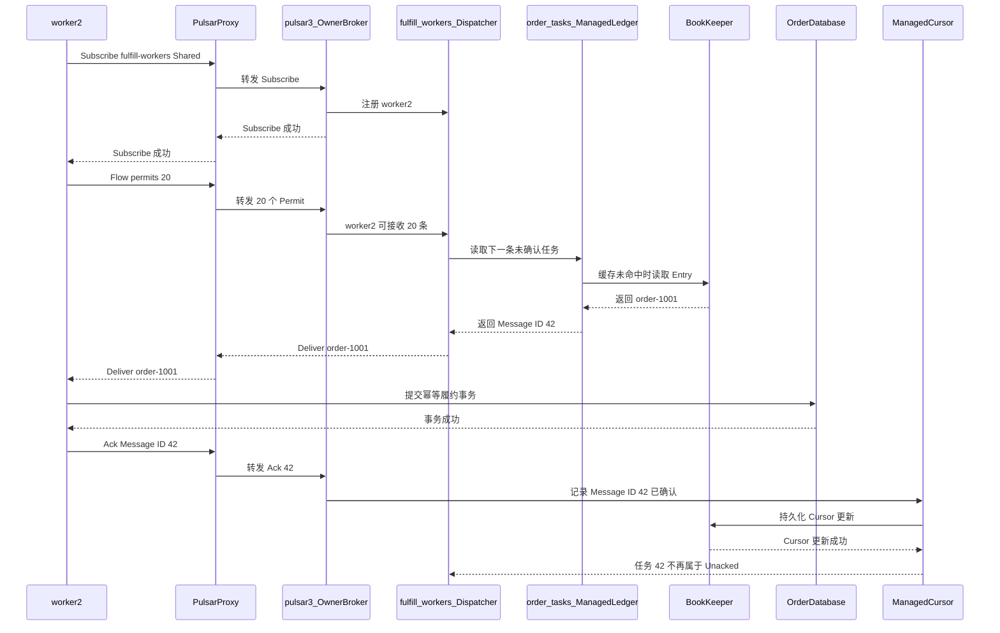

[第一篇](031_pulsar.md)已经说明订单履约任务的生产和消费路径，[消息队列实现篇](032_pulsar_message_queue_implementation.md)说明了 Managed Ledger 与 BookKeeper 的存储和复制。本文只讨论任务如何交给 Worker、Ack 如何推进 Cursor，以及故障后为什么可能重复投递。

<!-- more -->

## 1. 任务队列需要维护哪些状态

继续使用第一篇的订单履约任务：

```text
Topic：persistent://shop/order/tasks
Subscription：fulfill-workers
Subscription Type：Shared
Consumers：worker-1、worker-2、worker-3
Owner Broker：pulsar-3
```

消息正文仍然按照[消息队列实现篇](032_pulsar_message_queue_implementation.md)的流程写入 BookKeeper。任务队列在此基础上增加三类消费状态：

- **Subscription 与 Cursor**：回答 `fulfill-workers` 已经确认了哪些消息，属于持久状态；
- **Dispatcher 与 Consumer**：回答下一条任务交给哪个 Worker，主要是 Owner Broker 的运行状态；
- **Permit 与 Unacked**：回答每个 Worker 还能接收多少消息，以及哪些消息已经投递但尚未 Ack。

这三类状态不能混成一个 Offset：Cursor 负责故障恢复，Dispatcher 负责实时分配，Permit 负责流量控制。

## 2. 初始化 Subscription 后保存了什么

`fulfill-workers` 可以由管理接口提前创建，也可以在第一个 Consumer Subscribe 时创建。初始化完成但 Worker 尚未连接时：

- Metadata Store 能发现 Topic 和 Subscription 的持久标识；
- Managed Ledger 子系统为 `fulfill-workers` 建立 Managed Cursor；
- Cursor 记录初始消费位置，例如从 Earliest 或 Latest 开始；
- 还没有 Dispatcher 中的活跃 Consumer、Permit 和 Unacked，因为这些状态要等 Worker 连接后才产生。

三个 Worker 使用相同 Subscription Name，表示共同处理一份任务。如果它们使用不同名称，Pulsar 会建立三份独立 Cursor，每个 Worker 都会收到一份完整消息，这就不再是任务竞争模型。

## 3. Worker 如何注册并获得消息

### 3.1 Subscribe 注册了哪些信息

`worker-2` 先通过 Proxy 找到 `order/tasks` 的 Owner Broker `pulsar-3`，再发送 Subscribe。请求至少说明：

```text
Topic = persistent://shop/order/tasks
Subscription = fulfill-workers
Type = Shared
Consumer ID = 当前连接内的消费者编号
Consumer Name = worker-2
```

Owner Broker 验证 Subscription 类型兼容后，把 `worker-2` 加入 `fulfill-workers` 的 Dispatcher。Consumer 注册只属于当前连接；断线重连后必须重新 Subscribe。

### 3.2 Permit 是什么

Pulsar Broker 不会无限向 Consumer 推送消息。Consumer 通过 `Flow` 请求给 Broker 一定数量的 Permit：

```text
Flow permits=20
= Broker 最多再向 worker-2 投递 20 条消息
```

每投递一条消息就消耗一个 Permit。客户端应用从本地 Receiver Queue 取走消息后，客户端库会继续发送 Flow 补充 Permit。

Permit 控制的是 Broker 到客户端的在途数量，不是每秒消费速率，也不表示消息已经处理成功。Permit 很大可以提高吞吐，但 Worker 会提前占住更多任务；Worker 此时故障，需要重新投递的消息也更多。

### 3.3 从注册到 Ack 的完整过程

图中所有名字都是本例中的实际角色。`fulfill_workers_Dispatcher` 和 `ManagedCursor` 都运行在当前 Owner Broker `pulsar-3` 内，Cursor 的持久更新最终写入 BookKeeper。



Producer 不知道哪个 Worker 会执行任务。消息先属于 Topic，Dispatcher 再根据 Subscription 类型和各 Consumer 的 Permit 选择接收者。只有 Ack 成为 Cursor 状态后，这条任务才不会在故障恢复时再次投递。

## 4. Shared 和 Key_Shared 如何选择 Worker

### 4.1 Shared：谁有容量就交给谁

Shared 允许多个 Worker 竞争同一份任务。假设三人都有 Permit：

```text
Message 42 -> worker-1
Message 43 -> worker-2
Message 44 -> worker-3
```

Dispatcher 会在可用 Consumer 之间分配消息，但不保证整体顺序。同一订单的连续任务也可能落到不同 Worker，因此 Shared 适合彼此独立、可以并行且具备幂等性的任务。

### 4.2 Key_Shared：同一个 Key 交给同一个 Worker

如果要求同一订单串行处理，Producer 必须给消息设置稳定 Key，例如 `order-1001`，Subscription 改为 Key_Shared：

```text
order-1001 的任务 -> worker-2
order-2001 的任务 -> worker-1
order-1001 的后续任务 -> 仍由 worker-2
```

Key_Shared 保证的是同一 Key 的消息由同一个 Consumer 接收并保持顺序，不保证不同 Key 之间的全局顺序。Producer 使用批处理时也必须使用与 Key_Shared 兼容的按 Key 批处理方式，否则一个 Batch 混合多个 Key 会破坏分配边界。

Shared 和 Key_Shared 都依赖单条 Ack，不应使用累计 Ack 跳过前面的并行任务。

## 5. Cursor 如何表达乱序 Ack

Managed Cursor 至少维护两部分进度：

- **Mark-delete Position**：此前已经连续确认完成的位置；
- **Individual Deleted Ranges**：Mark-delete 之后已经单独 Ack 的位置范围。

假设 Message ID 0～10 已投递：

```text
0..7 已连续 Ack
8 尚未 Ack
9、10 已 Ack

Mark-delete = 7
Individual Deleted Ranges = {9,10}
```

因为 8 仍未完成，Mark-delete 不能直接推进到 10；9、10 只能先记入后面的已确认范围。等 8 Ack 后，连续边界才能越过 10。

这些 Cursor 状态可以写入 BookKeeper 的 Cursor Ledger；Cursor 名称和必要元数据通过 Metadata Store 发现。Owner Broker 故障后，新 Owner 从持久 Cursor 恢复，不依赖 Worker 猜测消费到了哪里。

大量任务长期乱序完成会产生很多不连续范围，增加 Cursor 更新、恢复和重投成本。因此不仅要观察 Backlog，还要观察 Unacked、Redelivery 和不连续 Ack 范围。

## 6. 三个临界故障场景

### 6.1 业务尚未成功，Worker 就故障

Message 42 已经交给 `worker-2`，但数据库事务尚未提交。Worker 断开后，Dispatcher 取消它的 Consumer 状态；因为 Cursor 没有 Ack 42，这条消息会重新投递给其他 Worker。

这是正常恢复，不会丢任务，但可能增加一次无效业务尝试。

### 6.2 业务成功，Ack 尚未持久化

`worker-2` 已经提交数据库事务，但 Ack 42 尚未成为持久 Cursor 状态，此时 Worker 或 Owner Broker 故障。新 Owner 恢复后仍认为 42 未确认，所以会再次投递。

```text
数据库已经成功
Cursor 尚未确认
→ order-1001 被重复执行
```

因此 Pulsar 的至少一次投递不能替代业务幂等。履约表应使用 `order_id` 或稳定事件 ID 建立唯一约束，让重复任务得到相同业务结果。

### 6.3 Ack 已持久化，但 Worker 不知道结果

Ack 42 已经写入 Cursor，但确认结果或网络连接随后丢失。Worker 无法仅凭超时判断服务端最终状态；恢复后可能看不到 42，也可能在 Ack 未成功时再次收到它。

客户端不能为了避免重复而主动跳过一个更大的未知位置。安全策略仍是允许重投，并让业务处理保持幂等。

### 6.4 Owner Broker 故障

Owner Broker `pulsar-3` 故障后：

1. 当前 Connection、Consumer、Dispatcher 和 Permit 等内存状态消失；
2. 新 Broker 获得 `order/tasks` 所有权；
3. 新 Owner 加载 Managed Ledger 和 `fulfill-workers` Cursor；
4. Worker 经 Proxy 重新查找 Owner 并再次 Subscribe；
5. Cursor 已确认的消息不会重投，尚未持久确认的消息重新分配。

转移的是 Topic 所有权，不是把 BookKeeper 中的消息搬到新 Broker。

## 7. 失败任务如何重试和进入死信

失败处理先区分三种动作：

- **Negative Ack**：Worker 明确表示本次处理失败，请稍后重新投递；
- **Ack Timeout**：消息投递后在规定时间内没有 Ack，Broker 将其视为需要重投；
- **Retry Topic 与 Dead Letter Topic**：客户端把多次失败的消息转入专门 Topic，控制延迟和最大重试次数。

继续使用 `order-1001`：

```text
第一次失败 -> Negative Ack -> 再次投递
连续失败 -> order/tasks-fulfill-workers-RETRY
超过最大重投次数 -> order/tasks-fulfill-workers-DLQ
```

Retry 和 DLQ 本质上仍是 Pulsar Topic，不是原 Topic 内的隐藏消息状态。它们拥有自己的存储、Subscription、Retention 和积压风险。自动重试和死信逻辑主要由客户端能力实现，并依赖 Shared 或 Key_Shared 的重投过程。

重试延迟不应阻塞正常任务。持续失败的毒消息必须有最大次数、DLQ 消费者、告警和人工处置流程；只配置 DLQ 名称但没有 Subscription 和处理者，等于把故障从主队列移到另一个无人管理的 Topic。

## 8. Permit、积压与容量

任务吞吐受三条路径共同限制：

- Producer 到 Owner Broker 和 BookKeeper 的写入能力；
- Owner Broker Dispatcher 的读取与分发能力；
- Worker 的实际处理能力和可用 Permit。

`receiverQueueSize` 和 Permit 太大时，少数 Worker 会提前占有大量消息，故障重投范围也更大；太小时，每次补充 Permit 和网络往返更频繁，吞吐可能下降。长任务通常应使用较小的在途窗口，短任务可以适度放大。

扩容 Worker 只有在 Topic、Owner Broker、BookKeeper 和下游数据库仍有容量时才有效。单个非分区 Topic 仍由一个 Owner Broker 服务；如果 Dispatcher 或单 Topic 已经成为瓶颈，仅增加 Worker 不能线性提高吞吐，需要考虑 Partitioned Topic。

生产监控至少覆盖：Backlog 数量和字节、最老未确认消息年龄、Unacked、Redelivery、Negative Ack、DLQ 增长、可用 Consumer 数和业务处理延迟。

## 9. 任务队列的语义边界

- Shared 表示多个 Worker 竞争同一份消息，不保证消息整体有序；
- Key_Shared 用 Key 保持同一业务实体的投递归属和顺序；
- Permit 只控制推送窗口，不表示业务成功；
- Ack 只确认 Pulsar Subscription 进度，不能提交外部数据库事务；
- Cursor 持久化已确认位置，Owner 切换后仍可能重投尚未确认的消息；
- Retry 和 DLQ 是新的 Topic，需要单独规划存储、消费和告警；
- 端到端任务处理仍应按至少一次和业务幂等设计。

## 10. 参考资料

- [Apache Pulsar 4.2 Architecture Overview](https://pulsar.apache.org/docs/4.2.x/concepts-architecture-overview/)
- [Apache Pulsar 4.2 Messaging Concepts](https://pulsar.apache.org/docs/4.2.x/concepts-messaging/)
- [Pulsar Binary Protocol：Subscribe、Flow 与 Ack](https://pulsar.apache.org/docs/4.2.x/developing-binary-protocol/)
- [Use Pulsar as a Message Queue](https://pulsar.apache.org/docs/4.2.x/cookbooks-message-queue/)
- [Pulsar Consumer API and Key_Shared Batching](https://pulsar.apache.org/docs/4.2.x/client-libraries-consumers/)
- [Pulsar Topic Internal Stats：Managed Cursor](https://pulsar.apache.org/docs/4.2.x/admin-api-topics/)
- [Pulsar Retention and Expiry](https://pulsar.apache.org/docs/4.2.x/cookbooks-retention-expiry/)
