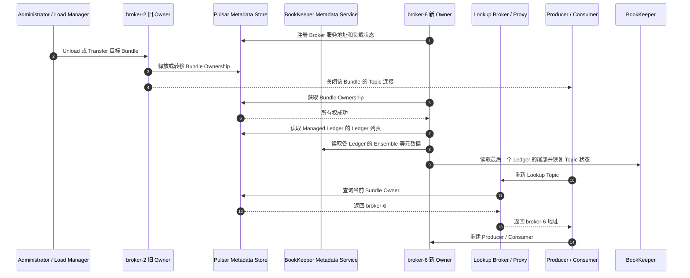
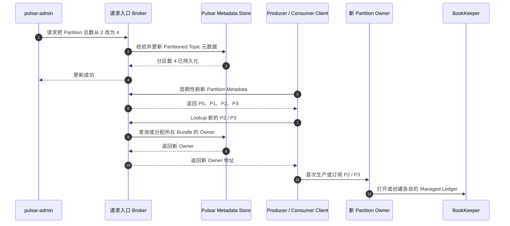
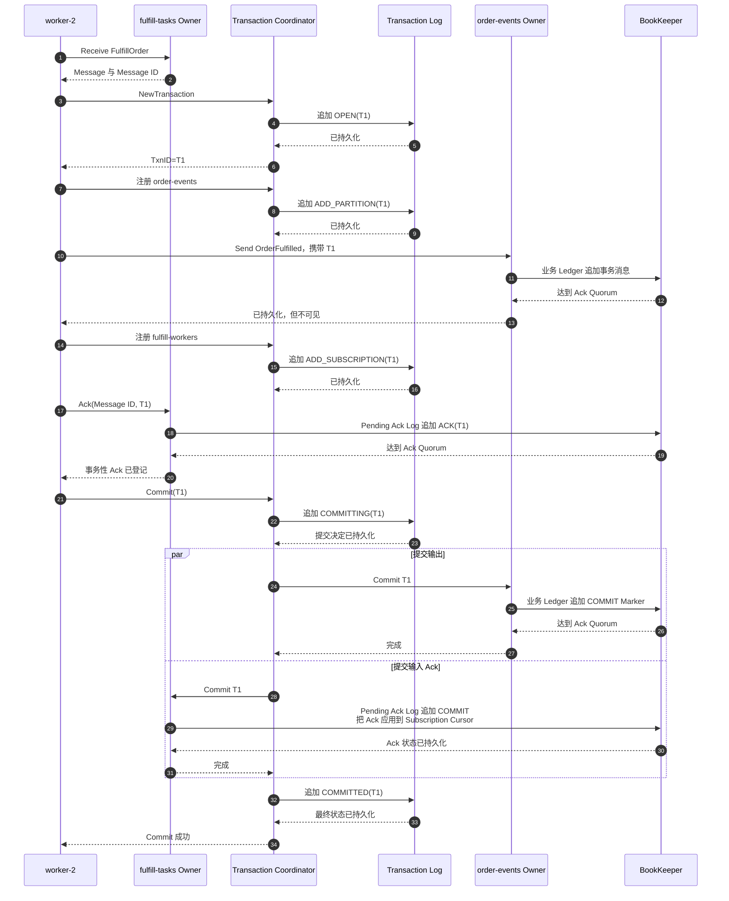

[存储与一致性篇](032_pulsar_message_queue_implementation.md)已经说明消息如何通过 BookKeeper Quorum 落盘，以及 Broker、Writer 和 Bookie 故障后如何恢复唯一日志。本文继续回答系统进入生产环境后的四类问题：历史数据放在哪里、容量如何扩展、跨 Topic 事务如何控制可见性，以及跨地域和日常运维如何定义边界。

阅读顺序是：先处理单集群内的存储生命周期和扩容，再进入事务，最后讨论跨地域与监控。Shared/Key_Shared 的任务调度和 Cursor 恢复仍见[任务队列实现篇](033_pulsar_task_queue_implementation.md)。

<!-- more -->

## 1. Tiered Storage 与长历史

封闭 Ledger 已经不可变，可以异步复制到 S3、GCS、OSS 或文件系统等低成本存储。完成下沉并经过安全等待后，本地 BookKeeper 副本可以删除，Consumer 读取旧历史时由 Broker 透明访问冷存储。

它解决的是长期存储成本，不代表冷热读取性能相同：

- 第一次读取冷数据延迟更高；
- 回放会消耗对象存储请求、网络和 Broker 资源；
- Offload 失败、凭证、生命周期规则和不完整上传都需要监控；
- 对象存储自身的耐久性和跨地域策略必须纳入 RPO。

Topic Compaction 则是另一种能力：按 Key 保留最新值的紧凑视图，适合重建最新状态，不等于保存完整审计历史。Retention、TTL、Compaction 和 Tiered Storage 不能互相替代。

## 2. 扩缩容和热点

扩容前先判断瓶颈属于哪一层：

```text
Broker 不够：             增加协议处理和 Topic Owner 容量
Bookie 不够：             增加存储容量与磁盘 I/O
Topic Partition 不够：    增加单个业务 Topic 的并行日志数
Namespace Bundle 太粗：   增加 Broker 间可调度的所有权单元
```

这四种操作不能互相替代。

### 2.1 增加 Broker：迁移所有权，不迁移历史消息

假设新增 `broker-6`。它注册到集群后可以承接新 Bundle，但不会像 Kafka 新 Follower 那样复制 Topic 历史，因为历史仍在共享的 BookKeeper 中。



新增 Broker 后，Load Manager 可以通过自动负载卸载或人工 Unload/Transfer 让旧 Owner 释放 Bundle。切换期间客户端会短暂重连，但不需要把 Ledger Entry 从旧 Broker 搬到新 Broker。

### 2.2 增加 Bookie：先获得新容量，不代表旧数据已经均衡

新增 `bookie-6` 注册为 Writable Bookie 后：

- 新建 Ledger、Ensemble Change 和 AutoRecovery 可以选择它；
- 已有 Ledger 的 Ensemble 元数据不会因为节点刚加入就全部改写；
- 旧 Entry 也不会立即从其他 Bookie 自动平均搬到它；
- 如果目标是下线旧 Bookie，需要执行 Decommission，等待相关 Fragment 完成再复制后再移除。

因此“Bookie 数量增加”与“历史数据已经均衡”是两个状态。容量规划还要观察各 Bookie 的磁盘利用率、写入速率和欠副本 Ledger。

### 2.3 Topic 从两个 Partition 增加到四个

假设 `persistent://shop/order/events` 当前只有：

```text
order/events-partition-0
order/events-partition-1
```

管理员把总 Partition 数改成 4：

```bash
pulsar-admin topics update-partitioned-topic \
  persistent://shop/order/events \
  --partitions 4
```

这里的 `4` 是修改后的总数，不是“再增加 4 个”。完整过程是：



P0、P1 的 Ledger 和历史消息不会被拆到 P2、P3；新增分区是两条新的独立日志。Producer 和 Consumer 发现新分区后才开始使用它们。

如果路由是：

```text
partition = hash(key) % partitionCount
```

分区数从 2 变成 4 后，同一个 `order_id` 可能改投新分区，扩容前后的消息就失去单分区顺序。需要连续顺序的业务应预留分区、使用稳定路由表，或者创建新 Topic 做受控迁移。Pulsar 只支持增加 Partition，不能直接减少。

### 2.4 拆分 Bundle 与增加 Topic Partition 的区别

- **拆分 Bundle**：同一批 Topic 被分成更细的 Broker 所有权范围，方便分散协议处理负载；Topic 的 Ledger、Partition 和消息路由都不变；
- **增加 Topic Partition**：给一个业务 Topic 新增独立日志，提高 Producer/Consumer 并行上限，但会影响 Key 路由和顺序。

存算分离消除了“Broker 扩容必须搬整个分区历史”的耦合，但没有消除热点：单个非分区 Topic 仍由一个 Owner 服务，单个 Key 仍只落到一个 Partition，共享 BookKeeper 的存储热点还可能影响多个 Broker。

## 3. Pulsar 事务如何实现

Producer 去重只解决同一个 Producer 重试时不重复追加。Pulsar 事务进一步解决：**向一个或多个 Topic 写消息，并确认一个或多个 Subscription 中的输入消息，要么一起生效，要么一起撤销。**

继续使用订单示例：

1. `worker-2` 从 `fulfill-tasks` 的 `fulfill-workers` Subscription 收到 `FulfillOrder(order-1001)`；
2. Worker 完成计算，准备向 `order/events` 写入 `OrderFulfilled(order-1001)`；
3. Worker 还要 Ack 输入消息，避免下次再次领取任务。

我们希望下面两项属于同一个事务：

```text
输出：向 order/events 写入 OrderFulfilled
输入：在 fulfill-workers 中 Ack FulfillOrder
```

读取输入消息发生在事务之前。事务覆盖的是“写出结果”和“确认输入”，不是把读取动作倒过来执行。

### 3.1 事务涉及哪些状态

先分清四类状态：

- **Transaction Coordinator（TC）**：保存事务状态并驱动 Commit 或 Abort；
- **Transaction Log**：持久化 TxnID、事务状态和参与者，不保存业务消息正文；
- **Transaction Buffer**：属于每个目标 Topic Partition，由它的 Owner Broker 维护，控制事务消息是否可见；
- **Pending Ack Log**：属于源 Topic 的某个 Subscription，只保存事务性 Ack。

业务消息、事务状态和事务性 Ack 分别写入三个独立的 Managed Ledger。它们最终都变成 BookKeeper Entry，但可能落在不同 Ledger、不同 Ensemble 和不同 Bookie 上，不存在一条跨越三者的全局物理写入顺序。

### 3.2 正常提交时顺序写入什么

仍以事务 `T1` 为例。三个日志中的逻辑内容分别是：

```text
order-events 的业务 Ledger
  Entry 100：OrderFulfilled，携带 TxnID=T1
  Entry 101：COMMIT Marker，携带 TxnID=T1

T1 所属 TC 的 Transaction Log
  OPEN(T1)
  ADD_PARTITION(T1, order-events)
  ADD_SUBSCRIPTION(T1, fulfill-tasks, fulfill-workers)
  COMMITTING(T1)
  COMMITTED(T1)

fulfill-workers 的 Pending Ack Log
  ACK(T1, FulfillOrder 的 Message ID)
  COMMIT(T1)
```

完整过程是：



每一次“追加”仍沿普通存储路径进入 BookKeeper：Bookie 先追加 Journal，随后把 Entry 写入 Entry Log 并更新索引。Bookie 的 Journal/Entry Log 会混存多个 Ledger 的 Entry；Pulsar 依靠 `Ledger ID + Entry ID` 找回各条逻辑日志，而不是依靠一个全局事务文件。

### 3.3 Abort 时顺序写入什么

Abort 不会回头删除或修改已经落盘的业务 Entry，而是继续追加结果：

```text
order-events 的业务 Ledger
  Entry 100：OrderFulfilled，携带 TxnID=T1
  Entry 101：ABORT Marker，携带 TxnID=T1

Transaction Log
  ...
  ABORTING(T1)
  ABORTED(T1)

Pending Ack Log
  ACK(T1, FulfillOrder 的 Message ID)
  ABORT(T1)
```

业务 Entry 自己携带 TxnID，用于表明它属于哪个事务。Journal 和 Entry Log 不会给这条 Entry 原地补写一个“未提交”标志；Topic Owner 读取后面的 ABORT Marker，才知道它必须永久过滤这条消息。Pending Ack 的 Abort 也不会推进 Subscription Cursor，因此输入消息之后可以重新投递。

### 3.4 Consumer 如何判断事务消息能否读取

Consumer 不查询 TC，也不直接读取 Transaction Log。目标 Topic Owner 上的 Transaction Buffer 维护两份判断信息：

- `maxReadPosition`：到该位置为止，不再存在结果未知的事务；Dispatcher 最多读取到这个安全边界；
- Aborted TxnID 集合：安全边界内若有已经 Abort 的事务消息，Dispatcher 将其过滤。

例如：

```text
Position 100：普通消息
Position 101：事务 A，仍为 OPEN
Position 102：事务 B，已经 COMMIT

maxReadPosition 停在 101 之前
```

即使事务 B 已提交，Consumer 也不能越过尚未结束的事务 A 先读取 Position 102。事务 A 结束后，边界才能推进：已 Commit 的事务消息可见，已 Abort 的事务消息被过滤。该边界按 Topic Partition 独立维护。

### 3.5 Transaction Coordinator 是 Topic Owner 吗

不是。两者可以运行在不同 Broker：

- TC 管理 `T1` 的状态和参与者，并把决定写入自己的 Transaction Log；
- `order-events` Owner 持有该 Topic 的 `PersistentTopic` 和 Transaction Buffer；
- `fulfill-tasks` Owner 持有 `fulfill-workers` Subscription、Cursor 和 Pending Ack 状态。

TC 持久化 `COMMITTING` 或 `ABORTING` 后，请求各参与者当前的 Owner Broker 追加 Marker。Consumer 连接的是 Topic Owner，Owner 的 Dispatcher 直接查询本地 Transaction Buffer，因此不需要由 TC 在每次消费时判断可见性。Topic 迁移后，新 Owner 通过 Transaction Buffer 快照和业务 Ledger 中的事务消息、Marker 恢复这些状态。

### 3.6 Pending Ack Log 是否每次消费都会写

不会。只有调用 `Ack(Message ID, TxnID)` 的**事务性 Ack**才会写 Pending Ack Log；普通 Ack 直接更新 Subscription 的 Cursor，不经过它。

每个参与事务 Ack 的 Subscription 都有自己的 Pending Ack Managed Ledger。名称由源 Topic 和 Subscription 派生，并以 `__transaction_pending_ack` 结尾。它保存：

- `ACK`：TxnID、Ack 类型和待确认的消息位置；
- `COMMIT`：把这些 Ack 应用到正式 Subscription Cursor；
- `ABORT`：撤销这些 Pending Ack，使消息仍可重新投递。

它不是写入某个固定 Bookie，也不是追加到源 Topic 的业务 Ledger。BookKeeper 为这个独立 Managed Ledger 创建 Ledger 和 Ensemble，再按其 `Qw/Qa` 把 Entry 写入所选 Bookie 的 Journal 与 Entry Log。

### 3.7 故障发生时如何收敛

- **Worker 在 Commit 前故障**：事务超时后由 TC Abort，输出消息不可见，输入 Ack 撤销；
- **提交决定已持久化，但成功响应丢失**：客户端看到结果未知，TC 仍按 Transaction Log 继续完成各参与者的 Commit；
- **TC 所在 Broker 故障**：新的 TC 从 Transaction Log 恢复状态，继续未完成的 Commit 或 Abort；
- **Topic Owner 故障**：新 Owner 恢复 Transaction Buffer 或 Pending Ack 状态，再处理 TC 的重试请求；
- **某个参与者暂时不可用**：事务停留在中间状态，TC 持续重试，不能让不同参与者得到相反结果。

### 3.8 Exactly Once 的边界

事务保证范围只覆盖 Pulsar Topic 与 Subscription。MySQL、Redis、HTTP、支付和仓库设备调用不属于 Pulsar 事务；一旦处理流程越过 Pulsar 边界，仍需 Outbox、Inbox、业务幂等键或状态机。

## 4. 跨地域复制

Pulsar 的异步 Geo-replication 在消息本地持久化后，由 Broker 复制到远端集群。远端中断时本地仍可写，代价是存在复制积压和非零 RPO。

Pulsar 也可以通过 BookKeeper region-aware placement 把 Ack Quorum 跨地域放置，形成同步地域级持久化；这样 Producer 成功需要等待远端持久确认，跨地域延迟和故障会进入每次写入路径。

两者的区别是：

| 模式 | Producer 成功是否等待远端 | 核心取舍 |
|---|---|---|
| 异步 Geo-replication | 否 | 低延迟、地域隔离，但可能丢尚未复制的数据 |
| BookKeeper 同步跨地域 Quorum | 是 | 更低 RPO，但延迟更高，远端故障可能阻塞写入 |

Active-active 还需要处理多地域同时写入的业务冲突、重复和顺序。跨集群复制能搬运消息，不能自动建立跨地域全局业务顺序。

## 5. 运维时真正要观察什么

至少需要覆盖四层指标：

### 5.1 Producer 与 Broker

- 发布成功率、超时、重试、吞吐和 P99 延迟；
- Topic/Partition/Bundle 的 Owner 变更和重连次数；
- Broker CPU、堆外内存、Direct Memory、缓存命中和连接数；
- 单 Topic/Partition 热点，而不只是集群平均值。

### 5.2 BookKeeper

- Journal 写入和 fsync 延迟；
- Ledger/Entry 读写错误；
- Bookie 磁盘水位、只读状态和可用数量；
- 欠副本 Ledger 数、AutoRecovery 队列和修复速度；
- Ensemble 是否满足机架/地域放置策略。

### 5.3 元数据与冷存储

- Pulsar Metadata Store 的 quorum、会话延迟，以及 Topic 加载、Bundle 分配与 Managed Ledger 元数据更新失败；
- BookKeeper Metadata Service 的 quorum、Bookie 注册状态和 Ledger 元数据 CAS 失败；
- Offload 成功率、冷读延迟、对象存储错误和费用；
- Geo-replication backlog、复制速率和最老待复制消息。

### 5.4 事务

- Transaction Coordinator 是否可用，OPEN/COMMITTING/ABORTING 事务数量；
- 慢事务、超时事务和 Transaction Log 写入延迟；
- 各 Topic Transaction Buffer 的 `maxReadPosition` 是否长时间不前进；
- Pending Ack 恢复状态，以及 Commit/Abort Marker 写入失败次数。

Broker 全部存活不代表系统健康：若 `Qa` 无法满足，持久写入仍会失败；Bookie 都存活也不代表可用：Pulsar Metadata Store 失去多数派会阻塞所有权和 Managed Ledger 元数据变更，BookKeeper Metadata Service 失去多数派则会阻塞 Ledger 创建、关闭与 Ensemble 变更。

## 6. 实现结论

- Tiered Storage、Retention、TTL 和 Compaction 解决不同问题：冷存、保留时间、过期和最新状态视图不能互相替代。
- 增加 Broker、增加 Bookie、拆分 Bundle 和增加 Topic Partition 分别扩展计算、存储、所有权调度和单 Topic 并行度。
- Pulsar 事务用 Transaction Log 保存决定，由目标 Topic Owner 的 Transaction Buffer 控制消息可见性，由 Pending Ack Log 暂存事务性 Ack。
- Transaction Coordinator 不是业务 Topic Owner；它持久化决定并驱动各参与者 Owner 完成 Commit 或 Abort。
- 异步 Geo-replication 优先地域隔离和本地低延迟，但存在非零 RPO；同步跨地域 Quorum 用写入延迟换取更低 RPO。
- 运维不能只看 Broker 存活数，还要同时观察 Topic 热点、BookKeeper 持久化、两类元数据操作、事务阻塞和跨地域复制积压。

## 7. 参考资料

- [Pulsar Broker Load Balancing](https://pulsar.apache.org/docs/4.2.x/concepts-broker-load-balancing-overview/)
- [Pulsar Load Balance Administration](https://pulsar.apache.org/docs/4.2.x/administration-load-balance/)
- [Pulsar Topic Administration](https://pulsar.apache.org/docs/4.2.x/admin-api-topics/)
- [Pulsar Metadata Store Administration](https://pulsar.apache.org/docs/4.2.x/administration-metadata-store/)
- [Pulsar Retention and Expiry](https://pulsar.apache.org/docs/4.2.x/cookbooks-retention-expiry/)
- [Pulsar Tiered Storage](https://pulsar.apache.org/docs/4.2.x/tiered-storage-overview/)
- [Pulsar Topic Compaction](https://pulsar.apache.org/docs/4.2.x/concepts-topic-compaction/)
- [Pulsar Transactions](https://pulsar.apache.org/docs/4.2.x/txn-why/)
- [Pulsar Transaction Components](https://pulsar.apache.org/docs/4.2.x/txn-what/)
- [Pulsar Transaction Workflow](https://pulsar.apache.org/docs/4.2.x/txn-how/)
- [Pulsar TopicTransactionBuffer：可见边界、Commit/Abort Marker 与恢复](https://github.com/apache/pulsar/blob/master/pulsar-broker/src/main/java/org/apache/pulsar/broker/transaction/buffer/impl/TopicTransactionBuffer.java)
- [Pulsar MLTransactionLogImpl：Transaction Log 的 Managed Ledger 实现](https://github.com/apache/pulsar/blob/master/pulsar-transaction/coordinator/src/main/java/org/apache/pulsar/transaction/coordinator/impl/MLTransactionLogImpl.java)
- [Pulsar MLPendingAckStore：事务性 Ack 的 Managed Ledger 实现](https://github.com/apache/pulsar/blob/master/pulsar-broker/src/main/java/org/apache/pulsar/broker/transaction/pendingack/impl/MLPendingAckStore.java)
- [Pulsar Geo-replication](https://pulsar.apache.org/docs/4.2.x/concepts-replication/)
- [Pulsar Release Notes and Supported Versions](https://pulsar.apache.org/download/)
- [Pulsar 5.0 Milestone：Scalable Topics Preview](https://pulsar.apache.org/release-notes/versioned/pulsar-5.0.0-M1/)
