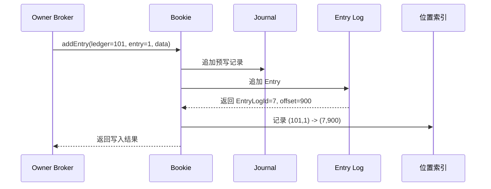

[前文](032_pulsar_message_queue_implementation.md)已经说明 Managed Ledger、BookKeeper Ledger 和多副本写入。本篇只继续向下讨论 Bookie 的本地存储：一次很小的 Ledger Entry 怎样进入共享 Entry Log，位置索引怎样记录，以及某个 Topic 的数据过期后怎样真正释放磁盘空间。

<!-- more -->

## 1. 先看完整关系

假设 `persistent://shop/order/order-events-partition-0` 当前使用 `Ledger-101`。Broker 连续调用 BookKeeper 写入三个 Entry：

```text
Ledger-101
├─ Entry-0：order-1001
├─ Entry-1：order-1002
└─ Entry-2：order-1003
```

每次 `addEntry` 只向这个 Ledger 增加一个 Entry。这个 Entry 通常很小；如果 Pulsar 开启批处理，它也可能封装多条 Pulsar 消息。

与此同时，这台 Bookie 还在接收其他 Ledger 的写入：

```text
时间顺序

Ledger-101 / Entry-0
Ledger-205 / Entry-42
Ledger-101 / Entry-1
Ledger-330 / Entry-8
Ledger-101 / Entry-2
```

Bookie 不为每个 Ledger 维护一条独立的默认写入流，而是把这些 Entry 顺序追加到当前 Entry Log：

```text
Bookie 本地存储

Journal
└─ 写入确认前使用的预写日志

EntryLog-7.log
├─ offset=100：Ledger-101 / Entry-0 / Entry Data
├─ offset=500：Ledger-205 / Entry-42 / Entry Data
├─ offset=900：Ledger-101 / Entry-1 / Entry Data
├─ offset=1200：Ledger-330 / Entry-8 / Entry Data
└─ offset=1600：Ledger-101 / Entry-2 / Entry Data

位置索引
├─ (101, 0)  -> (EntryLog-7, 100)
├─ (205, 42) -> (EntryLog-7, 500)
├─ (101, 1)  -> (EntryLog-7, 900)
├─ (330, 8)  -> (EntryLog-7, 1200)
└─ (101, 2)  -> (EntryLog-7, 1600)
```

因此需要把三个东西分开：

- **Entry Log**保存 Entry 正文，按 Bookie 的到达顺序混合追加多个 Ledger 的 Entry；
- **位置索引**只保存 `(LedgerId, EntryId)` 到物理位置的映射，不重复保存 Entry 正文；
- **Journal**保护尚未完成后台刷盘的写入，用于 Bookie 异常后的恢复，不负责正常读取定位。

## 2. 一次 Entry 写入时，数据和索引怎样更新

以 `Ledger-101 / Entry-1` 为例，一次写入经过下面几个步骤：



这是逻辑顺序，不表示每一步都单独触发一次随机磁盘写：

- Journal 使用顺序追加，并按照持久化策略执行刷盘；
- Entry Log 也是顺序追加，Bookie 可以缓冲多个到达的 Entry；
- 位置映射先进入内存索引或写缓存，再由后台机制批量持久化；
- 如果 Bookie 在索引完全落盘前故障，可以依靠持久化数据和 Journal 恢复尚未完成的状态。

所谓“多个 Ledger 混写到一个 Entry Log”，指的是同一个 Entry Log 文件在一段时间内依次接收不同 Ledger 的 Entry，并不是把多个 Ledger 强行合并成一个不可区分的 Entry。每条 Entry 自带 `LedgerId`、`EntryId` 等识别信息。

## 3. 索引具体如何组织

索引的逻辑形式始终是：

```text
(LedgerId, EntryId) -> (EntryLogId, Offset)
```

它只回答一个问题：某个 Entry 的正文位于哪个 Entry Log 的哪个位置。

### 3.1 InterleavedLedgerStorage

传统的 `InterleavedLedgerStorage` 按 Ledger 组织索引页。可以把它理解成：

```text
Ledger-101 的索引
├─ Entry-0 -> EntryLog-7, offset=100
├─ Entry-1 -> EntryLog-7, offset=900
└─ Entry-2 -> EntryLog-7, offset=1600

Ledger-205 的索引
└─ Entry-42 -> EntryLog-7, offset=500
```

物理上，索引文件由固定大小的 Index Page 组成。一个 Entry 对应一个固定长度的位置值；位置值可以编码 `EntryLogId` 和文件内 Offset。

因此，一个 Ledger 的 Entry 越多，它自己的索引越大，但索引不会保存 Entry 的消息体。

### 3.2 DbLedgerStorage

使用 `DbLedgerStorage` 时，位置关系通常由 RocksDB 一类的键值索引维护。逻辑上仍然是：

```text
Key                    Value
(101, 0)     ->        (EntryLog-7, 100)
(101, 1)     ->        (EntryLog-7, 900)
(101, 2)     ->        (EntryLog-7, 1600)
(205, 42)    ->        (EntryLog-7, 500)
```

这时不应该再把它想成“每个 Ledger 必然对应一个独立 `.idx` 文件”。不同 Ledger 的位置记录可以物理保存在同一套数据库文件中，但 Key 中包含 LedgerId，因此逻辑上仍然可以按 Ledger 和 Entry 精确查询。

## 4. 索引会不会很大

索引大小取决于 Entry 数量，而不是 Ledger 数量，也不是消息正文大小。

传统位置索引中，一个 Entry 的位置通常只需要一个 8 字节值。忽略页头和其他元数据，一个 Ledger 有 100 万个 Entry 时，位置部分大约为：

```text
1,000,000 × 8 Byte ≈ 8 MB
```

如果一个 Entry 只包含一条 Pulsar 消息，那么100万条消息大约需要100万个位置记录。这个索引会随 Entry 数量线性增长，但和消息正文相比通常仍然较小。

如果开启 Pulsar 批处理，一个 Entry 可以包含多条 Pulsar 消息：

```text
Ledger-101 / Entry-8
├─ BatchIndex-0：order-1001
├─ BatchIndex-1：order-1002
└─ BatchIndex-2：order-1003
```

BookKeeper位置索引仍然只需要一条：

```text
(Ledger-101, Entry-8) -> (EntryLog-7, offset=2200)
```

读取其中一条消息时，先读取整个 Entry，再由 Pulsar Broker 根据 `BatchIndex` 找到批次内部的消息：

```text
MessageId(101, 8, 2)
        │
        ├─ BookKeeper使用(101, 8)查询位置索引
        ▼
EntryLog-7 / offset=2200
        │
        ├─ 读取并解析整个Entry
        ▼
BatchIndex-2
```

批处理减少了 BookKeeper Entry 数量，也会相应减少位置索引条目，但读取单条批内消息时需要先取出和解析所在 Entry。

## 5. 混合存储后，怎样检索某个 Ledger

读取 `Ledger-101 / Entry-1` 时，不需要扫描 `EntryLog-7` 中属于其他 Ledger 的内容：

```text
1. 使用(LedgerId=101, EntryId=1)查询位置索引
2. 得到(EntryLogId=7, Offset=900)
3. 打开或复用EntryLog-7的文件句柄
4. 定位到offset=900
5. 读取并校验这一条Entry
```

因此，混合写入主要影响物理连续性，不会把检索退化成全文件扫描。

它的读取代价主要在于：同一个 Ledger 的相邻 Entry 可能分散在 Entry Log 的不同位置，冷读时可能产生磁盘跳转。不过索引、文件缓存和预读可以降低这部分开销。

## 6. 某个 Topic 的过期内容怎样清理

Topic 过期数据的清理分为两层：Pulsar 负责判断哪些 Ledger 已经不再需要；BookKeeper 负责回收这些 Ledger 占用的物理空间。

### 6.1 Pulsar先推进可删除边界

假设 `order-events-partition-0` 的 Managed Ledger 由三段组成：

```text
order-events-partition-0
├─ Ledger-101：所有订阅都已消费，Retention也已结束
├─ Ledger-102：所有订阅都已消费，Retention也已结束
└─ Ledger-103：仍有订阅需要读取
```

Broker 根据持久化订阅的消费位置、消息 TTL 和 Retention 等条件，判断哪些历史消息不再需要保留。

真正交给 BookKeeper 删除的基本单位是完整 Ledger。因此：

- `Ledger-101` 和 `Ledger-102` 可以删除；
- `Ledger-103` 仍然保留；
- 如果一个 Ledger 的前半部分过期、后半部分仍然有效，通常不能只删除前半段占用的物理空间。

这也是 Managed Ledger 需要不断滚动成多个 BookKeeper Ledger 的原因之一：让旧数据最终形成可以整体删除的边界。

### 6.2 BookKeeper先完成逻辑删除

Pulsar 删除 `Ledger-101` 后，BookKeeper 元数据不再把它视为活动 Ledger，各个 Bookie 最终能够识别这个 Ledger 已被删除。

但是，这不等于对应的 Entry Log 文件可以立刻删除：

```text
EntryLog-7.log
├─ Ledger-101 / Entry-0     已删除
├─ Ledger-205 / Entry-42    仍然有效
├─ Ledger-101 / Entry-1     已删除
└─ Ledger-330 / Entry-8     仍然有效
```

`EntryLog-7` 还包含 `Ledger-205` 和 `Ledger-330` 的数据，所以 Bookie 不能直接删除整个文件。

### 6.3 Bookie再回收物理空间

如果一个 Entry Log 中的所有 Ledger 都已删除，Bookie GC 可以直接删除整个 Entry Log：

```text
EntryLog-8
├─ Ledger-101：已删除
└─ Ledger-102：已删除

结果：直接删除EntryLog-8
```

如果 Entry Log 同时包含已删除和有效 Ledger，Bookie需要等待它满足 Compaction 条件：

```text
旧 EntryLog-7
├─ Ledger-101：无效Entry
├─ Ledger-205：有效Entry
└─ Ledger-330：有效Entry
        │
        │ 复制有效Entry
        ▼
新 Entry Log
├─ Ledger-205：有效Entry
└─ Ledger-330：有效Entry
        │
        │ 更新位置索引
        ▼
删除旧 EntryLog-7
```

Compaction 后，`Ledger-205` 和 `Ledger-330` 的位置发生变化，因此必须先更新相应的位置索引，再安全删除旧 Entry Log。

最终应当区分三个时间点：

```text
消息对消费者不可见
        ≠
BookKeeper Ledger已经删除
        ≠
Bookie磁盘空间已经释放
```

Entry Log 滚动周期、Ledger 滚动周期和 Bookie GC/Compaction 周期，都会影响过期数据最终释放磁盘空间的时间。

## 7. 为什么选择混合 Entry Log

如果每个活跃 Ledger 都使用独立 Entry Log，删除会更加直接，同一 Ledger 的数据局部性也更好。但一台 Bookie 可能同时承载大量 Ledger，这会带来：

- 大量活跃文件和文件句柄；
- 每个 Ledger 各自维护写缓存；
- 很多分散的小写入；
- 频繁切换写入文件，降低整体吞吐。

默认共享 Entry Log 把来自不同 Ledger 的小写入变成少量文件上的顺序追加：

```text
多个Ledger的小写入
        ↓
共享Entry Log顺序追加
        ↓
减少活跃文件，提高写入吞吐
```

它付出的代价是：

- 同一 Ledger 的 Entry 在物理上不一定连续；
- 删除一个 Ledger 后不一定立即释放磁盘；
- 需要后台 GC 和 Compaction 搬迁其他 Ledger 的有效 Entry；
- Compaction 会消耗磁盘带宽、CPU和临时空间。

所以这一设计的核心取舍是：

> 优先让高频的前台写入保持顺序和高吞吐，把低频的数据整理与空间回收放到后台完成。

BookKeeper也提供按 Ledger 使用 Entry Log 的模式。它可以改善单 Ledger 的数据局部性和删除隔离，但会增加活跃文件、文件句柄和缓存管理成本，适合活跃 Ledger 数量较少或具有特殊磁盘布局的场景。

## 8. 总结

```text
写入：
不同Ledger的Entry -> 共享Entry Log顺序追加

索引：
(LedgerId, EntryId) -> (EntryLogId, Offset)

读取：
查询索引 -> 直接定位Entry Log -> 读取Entry

清理：
Topic推进删除边界 -> 删除完整Ledger -> Bookie GC/Compaction
```

Entry Log 按 Bookie 的写入效率组织，Ledger 索引负责恢复逻辑上的独立性。共享 Entry Log 并没有消除 Ledger 边界，只是让多个 Ledger 的数据在物理文件中交错排列。

## 参考资料

- [Apache BookKeeper：Concepts and architecture](https://bookkeeper.apache.org/docs/4.8.2/getting-started/concepts/)
- [Apache BookKeeper：Configuration](https://bookkeeper.apache.org/docs/next/reference/config/)
- [Apache Pulsar：Architecture overview](https://pulsar.apache.org/docs/2.7.4/concepts-architecture-overview/)
- [Apache Pulsar：Message retention and expiry](https://pulsar.apache.org/docs/2.11.x/cookbooks-retention-expiry/)
