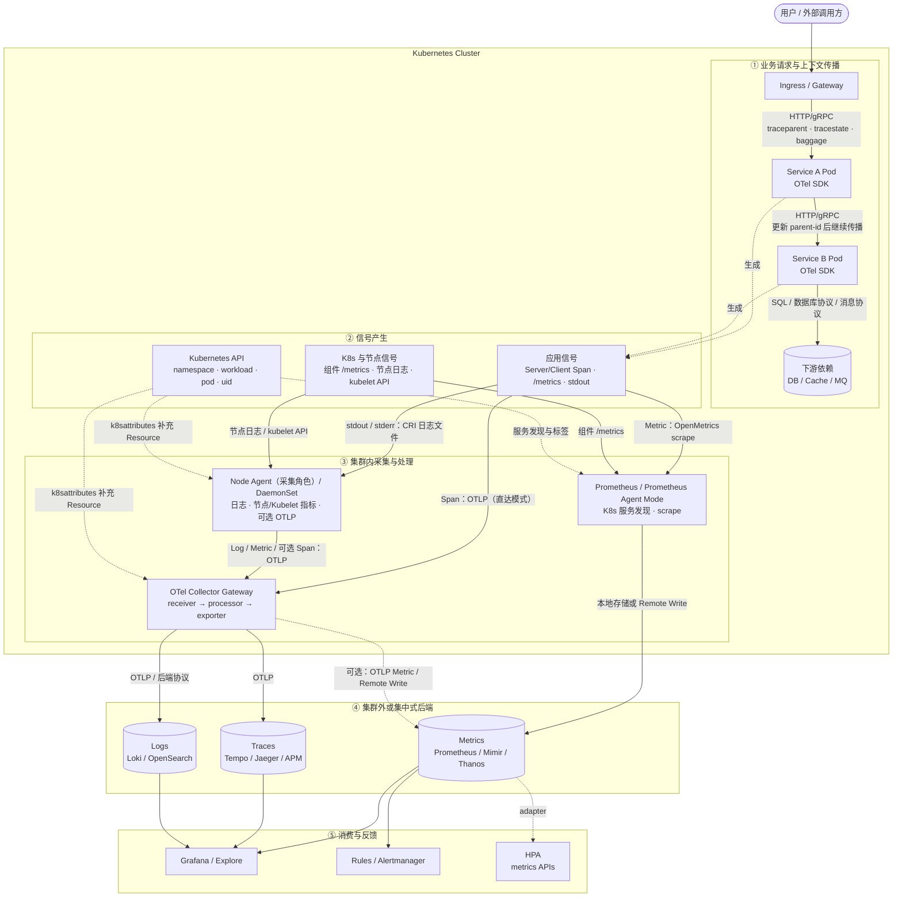
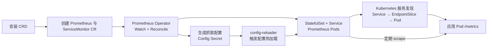

先看全景图。理解 Kubernetes 可观测性，关键不是记住产品名称，而是先分清两条链路：

1. **业务请求链路**：请求从 Ingress 进入 Service A，再调用 Service B。W3C header 随请求传播，用来维持同一条 Trace。
2. **遥测上传链路**：应用和基础设施产生 Metric、Log、Span，经 Agent、Gateway 送到后端。这里使用的是 OTLP、OpenMetrics、Remote Write、CRI 等协议或格式。

<!-- more -->

## 1. 一张图看懂 Kubernetes 可观测性架构



这张图可以压缩成五层：

| 层次 | 核心问题 | 主要抽象或组件 |
| --- | --- | --- |
| 请求传播 | 下游如何知道自己属于哪条 Trace | `traceparent`、`tracestate`、`baggage` |
| 信号产生 | 系统发生了什么 | Metric、Log Record、Span、Kubernetes Event |
| 采集处理 | 如何接收、补充、过滤、采样和批处理 | Prometheus、Node Agent、OTel Collector |
| 传输存储 | 数据怎样离开集群并保存 | OTLP、Remote Write、日志后端协议 |
| 查询反馈 | 人或控制器怎样消费数据 | Grafana、Alertmanager、HPA |

最重要的边界是：**W3C header 负责传播上下文，不负责上传遥测数据；OTLP 等协议负责上传数据，不负责让业务请求属于同一条 Trace。**

### 1.1 Agent、Node Agent 和 Gateway 是什么

这里的 **Agent** 不是某个协议，也不特指某个软件。它是一种部署角色：采集程序靠近数据源运行，先在本地接收、读取或抓取数据，再转发到集中式后端。

在 Kubernetes 中，**Node Agent** 指每个 Node 上运行一个的采集进程，通常用 DaemonSet 部署：

```text
Node 1：业务 Pod + Node Agent 1 ─┐
Node 2：业务 Pod + Node Agent 2 ─┼─→ Collector Gateway / Backend
Node 3：业务 Pod + Node Agent 3 ─┘
```

它离节点本地数据最近，能够挂载并读取 `/var/log/pods`，访问本节点 kubelet API，采集宿主机 CPU、内存、磁盘和网络指标。应用也可以把 OTLP 数据发给所在节点的 Agent，再由 Agent 转发。

Agent 通常只做轻量工作，例如读取、解析、补充元数据、批处理、限流和转发。跨集群的认证、全局路由、tail sampling 等集中式策略通常放在 **Collector Gateway**。Gateway 一般以 Deployment 运行，不需要挂载每个节点的日志目录。

```text
Agent：靠近数据源，解决“数据怎么离开本机”
Gateway：集中处理，解决“数据进入哪个后端、执行什么全局策略”
Backend：存储和查询，解决“数据怎样被检索和分析”
```

Kubernetes 和 W3C 并没有规定唯一的 Agent 实现。Agent 是一种架构角色，常见实现如下：

| 实现 | 主要信号 | 典型用途 |
| --- | --- | --- |
| OpenTelemetry Collector Contrib | Metrics、Logs、Traces | 通用实现；以 DaemonSet 作为 Node Agent，或以 Deployment 作为 Gateway |
| Grafana Alloy | Metrics、Logs、Traces、Profiles | 集成 OpenTelemetry、Prometheus 和 Grafana 生态的数据采集与转发 |
| Fluent Bit | Logs 为主 | 轻量读取容器 stdout/stderr 和节点日志，常以 DaemonSet 部署 |
| Fluentd | Logs 为主 | 日志解析、路由和插件集成能力强，但资源开销通常高于 Fluent Bit |
| Vector | Logs、Metrics | 高性能日志与指标采集、转换和路由 |
| Prometheus Agent Mode | Metrics | 服务发现、抓取指标并通过 Remote Write 转发，不负责日志和 Trace |
| Elastic Agent | Logs、Metrics、安全数据 | 采集并发送到 Elastic Stack，偏向 Elastic 生态 |
| Datadog Agent | Metrics、Logs、Traces | Datadog 体系的一体化节点 Agent，偏向厂商后端 |

如果希望采用厂商中立、统一三类信号的方案，通常优先选择 **OpenTelemetry Collector Contrib**。如果已有成熟的 Prometheus 和日志体系，也可以继续让 Prometheus 负责指标、Fluent Bit 或 Vector 负责日志，只让 OTel Collector 负责 Trace 和统一转发。

因此，同一个软件也可能扮演不同角色：OTel Collector 以 DaemonSet 部署时是 Node Agent，以 Deployment 集中部署时则是 Gateway。Prometheus Agent Mode 虽然也叫 Agent，但它特指一种指标转发模式，并不等于 OTel Node Agent。

因此，Agent 并不天然等于“只采 Trace 和 Log”。**软件能力由 Receiver/插件决定，实际职责由架构分工和配置决定。**

### 1.2 Node Agent 与 Prometheus 的采集边界

`Node Agent / DaemonSet` 描述的是**每个节点部署一个采集实例**，不是一个只能处理固定信号的产品。以 OTel Collector Agent 为例，它能收什么取决于启用的 Receiver：

| 数据源 | Node Agent / DaemonSet | Prometheus / Prometheus Agent | Collector Gateway |
| --- | --- | --- | --- |
| 应用 stdout/stderr | 主要负责：`filelog` 读取节点 CRI 日志文件 | 不负责 | 接收 Agent 发来的日志并集中处理 |
| 节点、系统日志 | 主要负责：读取文件或 journald | 不负责 | 接收、过滤并路由 |
| 应用 Span | 可选：开放本节点 OTLP Receiver，接收 SDK push | 不负责 | 主要入口：直接接收 SDK 或 Agent 转发的 OTLP |
| 应用 `/metrics` | 技术上可用 Prometheus Receiver 抓取，但不建议和 Prometheus 重复采集 | 主要负责：发现 Pod/Service 并 scrape | 可接收 OTLP Metric，通常不主动抓每个 Pod |
| kubelet / 容器资源指标 | 可用 `kubeletstats` 从本节点 kubelet API 采集 | 可抓取 kubelet/cAdvisor 暴露的 `/metrics` | 接收 Agent 转发的数据 |
| 节点 OS 指标 | 可用 `hostmetrics` 直接采集 | 通常抓取 `node_exporter` | 接收 Agent 转发的数据 |
| K8s 组件 `/metrics` | 通常不负责全局抓取 | 主要负责：抓取 apiserver、scheduler、controller-manager 等 | 只在配置相应 Receiver 时采集 |
| K8s 对象状态 | 不应让每个 DaemonSet 重复全量 watch | 抓取 `kube-state-metrics` 转换出的指标 | 可由单实例/分片的 cluster receiver 采集 |
| Kubernetes Events | 不建议每个 DaemonSet 重复采集 | 默认不负责 | 通常由集群级单实例/分片 Collector watch API |

因此，在图中的推荐分工是：

```text
Metrics：应用/K8s 组件 --/metrics--> Prometheus --Remote Write--> Metrics Backend

Logs：应用 stdout/stderr --> CRI 日志文件 --> Node Agent --> Gateway --> Log Backend

Traces：应用 OTel SDK --OTLP--> Collector Gateway --> Trace Backend

节点数据：host metrics / kubelet stats / 节点日志 --> Node Agent --> Gateway 或对应后端
```

图中采用的是 **Trace 直达 Gateway** 模式：应用 SDK 把完成的 Span 通过 OTLP 发到 Gateway 的 Kubernetes Service，Node Agent 不经过这条路径。`traceparent` 等 header 仍然只在业务服务之间传播，与 Span 上传路径无关。

也可以使用两级模式：

```text
应用 OTel SDK --OTLP--> 本节点 Node Agent --OTLP--> Collector Gateway --> Trace Backend
```

两级模式适合需要节点本地接收、缓冲或预处理的场景，但会增加一跳和一层配置。若 Node Agent 的主要用途只是读取日志和节点指标，应用直接上报 Gateway 更简单。

Prometheus 的 Kubernetes 服务发现只负责找到抓取目标，不会直接把 Deployment、Pod 状态“变成指标”。这部分由 `kube-state-metrics` 监听 Kubernetes API，再以 `/metrics` 暴露给 Prometheus。

### 1.3 Prometheus、Prometheus Agent Mode 与 Remote Write

三者位于同一条指标链路中，但不是同一类东西：

| 名称 | 性质 | 负责什么 |
| --- | --- | --- |
| Prometheus | 完整指标系统 | 服务发现、抓取、本地 TSDB、PromQL 查询、recording/alerting rules，也可以向远端写入 |
| Prometheus Agent Mode | Prometheus 的轻量运行模式 | 服务发现、抓取、WAL 缓冲和 Remote Write；不提供本地 PromQL 查询与规则计算 |
| Remote Write | 指标传输协议 | 把已经抓取到的时间序列批量发送给远程 Metrics Backend |

完整的数据流是：

```text
应用与 K8s 组件
      │ 暴露 /metrics
      ▼
Prometheus 或 Prometheus Agent Mode
      │ scrape：读取指标
      │ Remote Write：转发时间序列
      ▼
Mimir / Thanos Receive / VictoriaMetrics / 云指标后端
```

Remote Write 传输指标名称、Labels、时间戳、样本值以及相关的 Histogram、Exemplar 数据。它不负责发现目标、不抓取 `/metrics`、不执行 PromQL，也不是存储后端。通常由 Prometheus 或 Agent Mode 作为发送端，应用不直接调用 Remote Write。

选择方式可以简化为：

- 单集群需要本地查询、Dashboard 和告警规则：使用完整 Prometheus，本地保存数据，也可以额外配置 Remote Write。
- 多集群只需要把指标汇聚到中心后端：每个集群使用 Prometheus Agent Mode 抓取，再通过 Remote Write 集中发送。
- 已有完整 Prometheus 但需要长期存储：保留 Prometheus 的本地查询和规则能力，同时 Remote Write 到远端后端。

Prometheus Agent Mode 虽然也叫 Agent，但它特指指标抓取和转发模式，并不等于前面负责日志、节点指标或 OTLP 中继的 OTel Node Agent。

## 2. W3C 约定了哪些可观测性 Header

对分布式追踪而言，需要记住三个 header：

| Header | 所属规范 | 是否必须 | 约束什么 | 不负责什么 |
| --- | --- | --- | --- | --- |
| `traceparent` | W3C Trace Context | 核心字段 | 跨服务传递标准 Trace 身份、父 Span 身份和采样标志 | 不携带业务字段，不上传 Span |
| `tracestate` | W3C Trace Context | 可选 | 在标准 Trace 身份旁传播厂商特定状态 | 不是任意业务 metadata 容器 |
| `baggage` | W3C Baggage | 可选 | 传播应用自定义键值上下文 | 不决定 Trace 身份，也不会自动成为 Span 属性 |

其中 Trace Context 已是 W3C Recommendation；截至本文更新时，Baggage 是 Candidate Recommendation Snapshot。两者相关但相互独立。

### 2.1 `traceparent`：跨厂商都能识别的 Trace 身份

```http
traceparent: 00-4bf92f3577b34da6a3ce929d0e0e4736-00f067aa0ba902b7-01
```

格式固定为：

```text
version-trace-id-parent-id-trace-flags
   00      32hex     16hex        2hex
```

| 字段 | 含义 |
| --- | --- |
| `version` | 格式版本，当前常见值为 `00` |
| `trace-id` | 整条 Trace 的 16 字节标识，所有服务保持一致 |
| `parent-id` | 调用方当前操作的 8 字节标识，通常就是调用方 Span ID |
| `trace-flags` | 追踪标志；最低位为 sampled 标志，`01` 表示调用方可能记录了数据 |

`traceparent` **不记录应用名称**。它只传递 Trace ID 和调用方 Span ID，用来回答“当前请求接在哪个 Span 后面”。Span 属于哪个应用，由 Span 上传时携带的 OpenTelemetry Resource 决定，例如 `service.name`、`service.instance.id` 和 `k8s.pod.uid`。

下面以 Service A 请求 Service B 为例。假设请求到达 A 时没有 Trace Context，A 创建一条新 Trace：

```text
Trace ID：4bf92f3577b34da6a3ce929d0e0e4736

Service A
  Server Span A1：处理入站请求
  span_id = a1a1a1a1a1a1a1a1

  Client Span A2：请求 Service B
  span_id        = a2a2a2a2a2a2a2a2
  parent_span_id = a1a1a1a1a1a1a1a1
```

A 发起对 B 的 HTTP 请求时，把 **Client Span A2 的 Span ID** 写入 `parent-id`：

```http
traceparent: 00-4bf92f3577b34da6a3ce929d0e0e4736-a2a2a2a2a2a2a2a2-01
```

B 收到 header 后，保留同一个 Trace ID，并创建自己的 Server Span B1。B1 的 `parent_span_id` 等于 header 中的 `parent-id`：

```text
Service B
  Server Span B1：处理 A 的请求
  trace_id       = 4bf92f3577b34da6a3ce929d0e0e4736
  span_id        = b1b1b1b1b1b1b1b1
  parent_span_id = a2a2a2a2a2a2a2a2
```

最终 A 和 B 分别通过 OTLP 上传自己的 Span。下面是便于理解的简化数据，真实 OTLP 会将 Resource 和 Span 分层编码：

```json
[
  {
    "resource": {
      "service.name": "service-a",
      "service.instance.id": "service-a-pod-7f9c",
      "k8s.pod.uid": "pod-uid-a"
    },
    "name": "POST /publish",
    "kind": "SERVER",
    "trace_id": "4bf92f3577b34da6a3ce929d0e0e4736",
    "span_id": "a1a1a1a1a1a1a1a1",
    "parent_span_id": ""
  },
  {
    "resource": {
      "service.name": "service-a",
      "service.instance.id": "service-a-pod-7f9c",
      "k8s.pod.uid": "pod-uid-a"
    },
    "name": "POST http://service-b/publish",
    "kind": "CLIENT",
    "trace_id": "4bf92f3577b34da6a3ce929d0e0e4736",
    "span_id": "a2a2a2a2a2a2a2a2",
    "parent_span_id": "a1a1a1a1a1a1a1a1"
  },
  {
    "resource": {
      "service.name": "service-b",
      "service.instance.id": "service-b-pod-5d8b",
      "k8s.pod.uid": "pod-uid-b"
    },
    "name": "POST /publish",
    "kind": "SERVER",
    "trace_id": "4bf92f3577b34da6a3ce929d0e0e4736",
    "span_id": "b1b1b1b1b1b1b1b1",
    "parent_span_id": "a2a2a2a2a2a2a2a2"
  }
]
```

Trace 后端分两步还原调用链：

1. 用相同的 `trace_id` 把所有 Span 放进同一条 Trace。
2. 用 `span_id` 与 `parent_span_id` 建立父子关系，再读取每条 Span 的 `resource.service.name` 判断它属于哪个应用。

因此最终得到：

```text
service-a：Server Span A1
└── service-a：Client Span A2
    └── service-b：Server Span B1
```

`parent-id` 不是“这个 Trace 属于哪个应用”的标识，也不总是根 Span ID；它是**当前这一次跨进程调用的直接父 Span ID**，每经过一层调用都会更新。

`sampled=1` 只是传播给下游的建议和状态，不保证这条 Trace 最终一定被保存。Collector 的 tail sampling、后端限流或故障仍可能使数据被丢弃。

### 2.2 `tracestate`：多追踪系统的厂商扩展

```http
tracestate: vendor1=value1,vendor2=value2
```

`tracestate` 与 `traceparent` 配套使用，值是有序的厂商键值列表。它解决的是同一条请求同时经过多个追踪系统时，如何保留各系统自己的状态。

需要注意：

- `traceparent` 无效时，不能继续依赖对应的 `tracestate`。
- `tracestate` 不是用来放租户、用户、订单号等业务上下文的。
- W3C 明确要求其中不能包含个人可识别信息。
- 网关跨越信任边界时，可以重启 Trace，并清理不可信的 `tracestate`。

### 2.3 `baggage`：随请求传播的业务上下文

```http
baggage: tenant.id=acme,workflow.name=publish
```

`baggage` 是应用定义的键值集合。它适合传播确实需要被多个下游读取的少量上下文，例如租户分区或工作流名称。

它有三个容易误解的地方：

1. `baggage` 与 Trace Context 相互独立，没有 Trace 也能传播 Baggage。
2. Baggage 不会自动写入 Span、Log 或 Metric；需要应用或 Collector 显式映射。
3. 它会沿调用链扩散，应限制大小、键数量和传播范围，不能放 Token、Cookie、邮箱等秘密或个人信息。

### 2.4 与可观测性相关，但不属于分布式追踪上下文

W3C Web Performance 还定义了响应 header：

```http
Server-Timing: db;dur=12.4, app;dur=38.7
Timing-Allow-Origin: https://example.com
```

`Server-Timing` 用于把一次请求的服务端性能指标暴露给浏览器 Performance API；跨域页面能否读取完整信息由 `Timing-Allow-Origin` 控制。它们服务于浏览器性能分析，不负责连接微服务 Trace，因此不应画进服务间 Trace Context 主链路。

以下常见 header 也不要误认为 W3C Trace Context：

| Header | 性质 |
| --- | --- |
| `X-Request-ID`、`Request-ID`、`Correlation-ID` | 常见工程约定，不是 W3C Trace Context 标准字段 |
| `b3`、`X-B3-*` | Zipkin B3 传播格式 |
| `uber-trace-id` | Jaeger 旧传播格式 |

系统可以为了兼容同时接收多种 propagator，但内部最好统一为 W3C Trace Context，避免一条请求被错误拆成多条 Trace。

## 3. 协议到底约束什么

架构图中的箭头不是同一种协议。把它们按职责拆开，就不会把“传播”“采集”和“导出”混为一谈。

| 协议、格式或 API | 约束对象 | 典型方向 |
| --- | --- | --- |
| W3C Trace Context / Baggage | 请求上下文的 header 名称、格式和传播规则 | Service → Service |
| OTLP/gRPC、OTLP/HTTP | Trace、Metric、Log 的编码、请求和交付语义 | SDK → Collector → Backend |
| OpenMetrics / Prometheus exposition | 进程如何在 `/metrics` 暴露指标快照 | Prometheus ← Target |
| Prometheus Remote Write | 抓取端如何把时间序列批量写到远端 | Prometheus / Agent → Metrics Backend |
| CRI logging format | 容器运行时与 kubelet 如何在节点文件中交接 stdout/stderr | Container → Node log file |
| `metrics.k8s.io` | Node/Pod CPU、内存如何提供给 `kubectl top` 和 HPA | metrics-server → kube-apiserver |
| `custom.metrics.k8s.io` / `external.metrics.k8s.io` | HPA 如何读取自定义或外部指标 | metrics adapter → kube-apiserver |

它们分别解决不同问题：

```text
W3C header：请求属于谁？下一个 Span 的父亲是谁？
OTLP：已经生成的遥测记录怎样发给 Collector？
OpenMetrics：Prometheus 去哪里读取当前指标？
Remote Write：抓到的时间序列怎样写入远端存储？
CRI：容器 stdout/stderr 怎样落成节点日志文件？
```

PromQL、LogQL、TraceQL 是查询语言，不是上传协议；Grafana 是查询和展示入口，也不是采集协议。

## 4. 架构中的核心抽象

### 4.1 Signal：系统输出什么

| Signal | 基本记录 | 擅长回答的问题 |
| --- | --- | --- |
| Metrics | 带属性的 Data Point / Time Series | 是否异常、影响面多大、趋势如何 |
| Traces | Trace 中的 Span | 慢在哪里、经过了哪些依赖 |
| Logs | 带时间和上下文的 Log Record | 某个实例具体发生了什么 |
| Events / Audit | 状态变化或 API 操作事件 | 为什么调度失败、谁改了资源 |

Baggage 是传播上下文，不是一类需要独立存储的 Signal。

### 4.2 Context：一次请求属于谁

Trace Context 在进程内通常存在于 SDK 的 `Context` 对象中；跨进程时再由 propagator 注入 HTTP header、gRPC metadata 或消息属性。

```text
Extract：从入站载体读取 traceparent / tracestate / baggage
Create：以入站 Span 为父节点创建当前 Span
Inject：把当前上下文写入出站载体
```

HTTP header 只是 Context 的一种载体。Kafka、RabbitMQ 等消息系统应把上下文写入消息属性；异步消费、批处理和扇入扇出场景还可能使用 Span Link，而不是强行构造单一父子关系。

### 4.3 Resource：是谁产生了数据

`Resource` 描述遥测数据的来源。Kubernetes 环境常用：

```text
service.name
service.namespace
service.version
service.instance.id
deployment.environment.name
k8s.cluster.name
k8s.namespace.name
k8s.deployment.name
k8s.pod.name
k8s.pod.uid
k8s.container.name
```

应用通常只知道 `service.*`；Collector 的 `k8sattributes` processor 再根据 Pod IP、连接信息和 Kubernetes API 补充 `k8s.*`。名称便于阅读，UID 用于稳定关联，二者都应保留。

### 4.4 Telemetry Record：真正上传的数据

- Span 包含 Trace ID、Span ID、父子关系、时间、状态、事件和属性。
- Metric Data Point 包含数值、时间和有限基数的属性集合。
- Log Record 包含时间、严重级别、正文、Resource；处于请求上下文时还应包含 Trace ID 和 Span ID。

W3C header 不会被原样当作遥测记录上传。SDK 先提取 Context，再生成 Span 或关联 Log；随后 exporter 才把这些记录通过 OTLP 发走。

### 4.5 Collector Pipeline：数据怎样被处理

```text
Receiver → Processor → Exporter
```

| 抽象 | 职责 | 示例 |
| --- | --- | --- |
| Receiver | 接收或采集信号 | `otlp`、`filelog`、`kubeletstats`、`prometheus` |
| Processor | 限流、批处理、补属性、过滤、采样 | `memory_limiter`、`batch`、`k8sattributes`、`filter`、`tail_sampling` |
| Exporter | 发给下一层 Collector 或后端 | `otlp`、`otlphttp`、`prometheusremotewrite` |
| Connector | 把一个 Pipeline 的输出变成另一个 Pipeline 的输入 | 由 Trace 派生 Metric |
| Extension | 提供健康检查、认证、调试等旁路能力 | `health_check`、认证扩展 |

Pipeline 是处理抽象，DaemonSet、Deployment 是部署形态，两者不是同一层概念。

## 5. 三类信号的完整上传链路

### 5.1 Trace：传播与上传是两条链

一次 `Ingress → Service A → Service B` 的完整过程如下：

1. Ingress 收到请求。如果没有合法的 `traceparent`，埋点组件创建新的 Trace ID 和入口 Span。
2. Ingress 调用 A 时注入 `traceparent`；如果启用，则同时传播 `tracestate` 和经过过滤的 `baggage`。
3. A 提取 Context，创建服务端 Span。A 调用 B 时创建客户端 Span，并用该 Span ID 更新下游 `parent-id`。
4. B 重复 Extract → Create → Inject；数据库客户端、HTTP 客户端和消息 SDK 也可以产生子 Span。
5. Span 结束后进入 SDK 的 Span Processor。生产环境通常异步、批量导出，不能阻塞业务请求。
6. SDK 通过 OTLP/gRPC 或 OTLP/HTTP 把 Span 发给 Collector Gateway。
7. Gateway 补充 Kubernetes Resource、限流、过滤并执行 head/tail sampling；做 tail sampling 时，同一 Trace 的 Span 必须路由到同一采样实例。
8. Collector 通过 OTLP 写入 Tempo、Jaeger 或厂商 APM，Grafana 再按 Trace ID 查询整条链。

```text
业务传播：Ingress --traceparent--> A --traceparent--> B
遥测上传：Ingress/A/B --OTLP Span--> Collector --> Trace Backend
```

如果日志中写入同一个 `trace_id`、`span_id`，Trace 页面就能跳到对应日志；如果延迟 Histogram 保存 exemplar，Metric 峰值还能跳到一条代表性 Trace。

### 5.2 Metrics：抓取、转发与 HPA 是三件事

Prometheus 模式下的上传链路是：

1. 应用在 `/metrics` 暴露 Counter、Gauge、Histogram 等指标。
2. `ServiceMonitor` 或 `PodMonitor` 声明发现和抓取规则；Prometheus Operator 把它们转换成 Prometheus 配置。
3. Prometheus 定期 pull 指标，并附加 cluster、namespace、pod、service 等目标标签。
4. 小规模环境可保存在本地 TSDB；多集群或长期存储时，通过 Remote Write 发到 Mimir、Thanos Receive 或云后端。
5. Rules 计算聚合指标和告警条件，Alertmanager 负责去重、分组、抑制和路由。
6. Grafana 使用 PromQL 查询；HPA 则通过 Kubernetes Metrics API 或指标 Adapter 获取数据。

```text
应用 /metrics <--scrape-- Prometheus --Remote Write--> Metrics Backend
                                             └-------> Rules / Alertmanager
```

#### 5.2.1 Prometheus Operator 提供的 CRD

Kubernetes 原生并不知道 `Prometheus`、`ServiceMonitor` 这些资源。安装 Prometheus Operator 时，需要先注册 `monitoring.coreos.com` API Group 下的 CRD，再运行 Operator 控制器。

这些 CRD 可以分成三组：

| 类型 | CRD | 作用 |
| --- | --- | --- |
| 工作负载 | `Prometheus` | 声明完整 Prometheus 集群，Operator 据此创建和维护 StatefulSet |
| 工作负载 | `PrometheusAgent` | 声明只负责抓取和 Remote Write 的轻量 Prometheus Agent |
| 工作负载 | `Alertmanager`、`ThanosRuler` | 声明 Alertmanager 和 Thanos Ruler 实例 |
| 采集配置 | `ServiceMonitor` | 通过 Service 发现一组抓取目标 |
| 采集配置 | `PodMonitor` | 不经过 Service，直接发现一组 Pod 抓取目标 |
| 采集配置 | `Probe` | 声明黑盒探测目标，例如 HTTP、TCP、ICMP |
| 采集配置 | `ScrapeConfig` | 表达 ServiceMonitor/PodMonitor 难以覆盖的抓取配置或集群外目标 |
| 规则与路由 | `PrometheusRule` | 声明 recording rules 和 alerting rules |
| 规则与路由 | `AlertmanagerConfig` | 声明告警路由、接收器和抑制规则 |

这里要区分 **CRD** 和 **CR**：

```text
CRD：向 Kubernetes 注册一种新的资源类型，例如 ServiceMonitor。
CR：这种资源类型的一个实例，例如名为 content-api 的 ServiceMonitor。
Operator：监听这些 CR，把声明的期望状态转换成 StatefulSet 和 Prometheus 配置。
```

#### 5.2.2 ServiceMonitor 如何变成真实抓取任务

下面以 `content-api` 为例。应用 Pod 已经在名为 `metrics` 的端口暴露 `/metrics`，先创建 Service：

```yaml
apiVersion: v1
kind: Service
metadata:
  name: content-api
  namespace: apps
  labels:
    app: content-api
spec:
  selector:
    app: content-api
  ports:
    - name: metrics
      port: 8080
      targetPort: metrics
```

再创建 `ServiceMonitor`。它通过 `spec.selector` 选择上面的 Service，通过 `endpoints` 描述如何抓取：

```yaml
apiVersion: monitoring.coreos.com/v1
kind: ServiceMonitor
metadata:
  name: content-api
  namespace: monitoring
  labels:
    monitoring: platform
spec:
  namespaceSelector:
    matchNames:
      - apps
  selector:
    matchLabels:
      app: content-api
  endpoints:
    - port: metrics
      path: /metrics
      interval: 30s
```

最后创建 `Prometheus` CR，并用 `serviceMonitorSelector` 选择这个 `ServiceMonitor`：

```yaml
apiVersion: monitoring.coreos.com/v1
kind: Prometheus
metadata:
  name: platform
  namespace: monitoring
spec:
  serviceAccountName: prometheus
  replicas: 2
  serviceMonitorSelector:
    matchLabels:
      monitoring: platform
  podMonitorSelector:
    matchLabels:
      monitoring: platform
```

这里存在两次不同的 Label Selector：

```text
Prometheus.spec.serviceMonitorSelector
  └── 选择 ServiceMonitor.metadata.labels

ServiceMonitor.spec.selector
  └── 选择 Service.metadata.labels
      └── Service.spec.selector 再选择 Pod
```

`ServiceMonitor.endpoints[].port` 引用的是 **Service Port 的名称** `metrics`，不是端口号，也不是 Deployment 中随意填写的字符串。这是 ServiceMonitor 没有产生 Target 时最常见的排查点之一。

整个控制循环如下：



具体过程是：

1. Prometheus Operator watch `Prometheus`、`ServiceMonitor`、`PodMonitor` 等自定义资源。
2. 创建 `Prometheus/platform` 后，Operator 根据期望状态创建或更新对应的 StatefulSet、Service 和配置。
3. Operator 根据 `serviceMonitorSelector` 找到 `ServiceMonitor/content-api`。
4. ServiceMonitor 根据 namespace 和 Service label 找到 `apps/content-api`，Kubernetes 服务发现再解析出后面的 EndpointSlice 和 Pod 地址。
5. Operator 把 Monitor 转换成 Prometheus scrape 配置；配置变化后，由 Prometheus Pod 中的 config-reloader 触发热加载。
6. Prometheus 开始定期请求每个目标的 `/metrics`。之后新增或替换 Pod 时，服务发现会更新目标，不需要手工改 Prometheus 配置。

`PodMonitor` 的过程相同，只是跳过 Service：它的 `spec.selector` 直接匹配 Pod label，`podMetricsEndpoints[].port` 引用 Pod 的容器端口名称。相同目标不要同时被 ServiceMonitor 和 PodMonitor 选中，否则会发生重复抓取。

跨 Namespace 发现还需要相应的 Namespace Selector 和 RBAC：Prometheus 要能读取目标 Namespace 中的 Service、EndpointSlice 和 Pod；Operator 也必须有权限读取相关 CR 并更新 StatefulSet、Secret 等资源。

`metrics-server` 只服务 `kubectl top` 和资源指标 HPA，不提供 PromQL、长期存储或通用告警，不能替代 Prometheus。

### 5.3 Logs：stdout 只是链路起点

容器日志链路是：

1. 应用向 stdout/stderr 输出单行结构化 JSON。
2. 容器运行时捕获输出，并按 CRI logging format 写入节点上的 Pod 日志文件。
3. DaemonSet 日志 Agent 贴近节点读取文件，并记录 offset。
4. Agent 解析 JSON、合并 CRI 分片、过滤无用字段。
5. Agent 根据 Pod 路径、容器 ID、IP 与 Kubernetes API 补充 namespace、workload、pod、uid 等 Resource。
6. 日志通过 OTLP 或后端协议，经 Gateway 写入 Loki、OpenSearch 等后端。
7. Grafana 按 Resource 检索，并用 `trace_id` 跳转到 Trace。

```text
stdout/stderr → runtime → /var/log/pods → DaemonSet Agent
             → enrich / batch → Gateway → Log Backend
```

`kubectl logs` 只是读取节点容器日志的入口，不是跨 Pod 检索和长期保留方案。Pod 驱逐或节点损坏后，本地日志也可能消失。

## 6. Kubernetes 中各组件分别做什么

| 组件 | 架构位置 | 主要职责 |
| --- | --- | --- |
| OpenTelemetry SDK / Auto Instrumentation | 应用 Pod | 创建 Span、记录 Metric/Log、管理 Context、注入和提取 header、OTLP 导出 |
| OTel Collector Agent | DaemonSet | 读取节点文件、host/kubelet 数据、就近补属性和削峰 |
| OTel Collector Gateway | Deployment | 集中接收、认证、批处理、过滤、路由、tail sampling |
| Prometheus Operator | 控制器 | 把 `ServiceMonitor`、`PodMonitor`、`PrometheusRule` 等 CR 转换为运行配置 |
| Prometheus | 指标采集层 | 服务发现、抓取、规则计算、本地 TSDB、查询或 Remote Write |
| Prometheus Agent Mode | 指标转发层 | 服务发现、抓取、WAL 缓冲和 Remote Write；不提供本地查询与规则计算 |
| kube-state-metrics | 信号源 | 把 Kubernetes 对象状态转换成指标，不采集容器 CPU/内存 |
| node_exporter | 信号源 | 暴露节点 OS 和硬件指标 |
| metrics-server | 控制循环数据源 | 为 `metrics.k8s.io` 提供短期 Node/Pod CPU、内存 |
| Tempo / Jaeger | Trace 后端 | 保存与检索 Trace |
| Loki / OpenSearch | Log 后端 | 保存与检索日志 |
| Grafana / Alertmanager | 消费层 | 查询关联、Dashboard、告警路由 |

### 6.1 DaemonSet、Gateway 与 Sidecar

| 形态 | 适用场景 | 主要代价 |
| --- | --- | --- |
| DaemonSet Agent | 必须读取节点文件、host metrics、kubelet stats | 每个节点一份资源；需要处理节点故障和 offset |
| Deployment Gateway | 集中接收 OTLP、认证、路由、采样 | 需要高可用、扩缩容和负载均衡 |
| Sidecar | 强隔离、Pod 本地特殊协议或文件 | 资源和运维成本随 Pod 数量放大 |

通用起点是 **DaemonSet Agent + Deployment Gateway**。只有明确需要 Pod 级隔离或本地访问时才使用 Sidecar。

## 7. 跨信号关联靠什么

三类信号存储在不同后端，能够互相跳转依赖的是稳定的关联键：

```text
资源关联：service.name + k8s.cluster.name + k8s.namespace.name + k8s.pod.uid
请求关联：trace_id + span_id
版本关联：service.version + deployment.environment.name
Metric → Trace：Histogram exemplar 中的 trace_id
Trace → Log：Span Resource/时间窗口 + 日志中的 trace_id
```

不要把 `request_id`、`user_id`、完整 URL 或异常堆栈放进 Metric label。它们会制造高基数时间序列；单次请求细节应该留在 Trace 和 Log 中。

部署系统还应把版本、配置和发布时间写成注解、事件或独立变更记录。否则系统只能回答“何时变慢”，不能快速回答“是否从某次发布开始变慢”。

## 8. 生产环境的关键约束

### 8.1 信任边界

- 不直接信任来自公网的 `traceparent`、`tracestate` 和 `baggage`；校验格式、限制大小，必要时在入口重启 Trace。
- 在入口和出口对 Baggage 使用 allowlist，移除 Token、Cookie、PII 和未经治理的业务字段。
- Collector Receiver 不应无认证暴露到公网；跨信任域使用 TLS 和认证。

### 8.2 基数与费用

```text
Metrics ≈ 时间序列数 × 抓取频率 × 保留时间
Logs    ≈ 每秒字节数 × 索引放大 × 保留时间
Traces  ≈ 每秒 Span 数 × 单 Span 大小 × 采样率 × 保留时间
```

- Metric label 只使用有限集合；HTTP 使用 route 模板 `/users/{id}`，不用真实路径 `/users/123`。
- 日志默认关闭全量 debug，正文与堆栈不要全部建立索引。
- Trace 用 head sampling 控制基础成本，必要时再用 tail sampling 保留错误、慢请求和关键租户。

### 8.3 背压与自监控

- SDK 异步、批量、超时导出；遥测后端故障不能无限阻塞业务线程。
- Collector 配置 `memory_limiter`、`batch`、有界队列和重试上限。
- 监控 Collector 的 received、refused、dropped、export failed、queue size 等自身指标。
- 监控 Prometheus target up、抓取耗时、规则失败，以及日志 Agent 的 offset 和解析错误。
- 从集群外增加黑盒探测，避免“业务和内部监控同时死亡，却无人报告”。

## 9. 用一次慢请求复盘整条链路

假设用户请求发布接口，Service A 调用 Service B 时变慢：

1. Ingress 为请求接收或创建 `traceparent`，Trace ID 沿 A、B 和数据库调用传播。
2. A、B 的 OTel SDK 创建 Span，异步通过 OTLP 上传到 Collector。
3. Collector 用 Kubernetes API 补上 Pod、Deployment 和版本信息，再把 Span 发到 Tempo。
4. 应用的延迟 Histogram 被 Prometheus 抓取；P99 告警触发，exemplar 指向这次慢请求的 Trace ID。
5. 值班人员从 Grafana Metric 面板跳到 Trace，发现 B 的数据库 Span 最慢。
6. 再用 Span 的 `trace_id` 跳到 B 的日志，看到连接池等待；用 `k8s.pod.uid` 确认只影响新版本 Pod。
7. 发布事件显示异常从新版本上线后开始，回滚后 SLI 恢复，Alertmanager 告警关闭。

这一闭环中：

```text
W3C header 保证请求链不断；
OTLP / OpenMetrics / CRI 保证数据能被采集和上传；
Resource 与 trace_id 保证不同后端的数据能关联；
Grafana、Rules、Alertmanager 把数据变成排障和响应动作。
```

## 10. 总结

Kubernetes 可观测性可以记成一条主线：

```text
请求传播
  traceparent / tracestate / baggage
        ↓
信号产生
  Metric / Span / Log / Event
        ↓
采集处理
  Prometheus 或 Receiver → Processor → Exporter
        ↓
传输存储
  OTLP / Remote Write → Metrics / Trace / Log Backend
        ↓
关联与反馈
  Resource + trace_id → Dashboard / Alert / HPA / Incident Response
```

其中最容易混淆、也最应该牢牢记住的是：

```text
W3C Trace Context 负责“上下文传播”，OTLP 负责“遥测上传”。
OpenMetrics 负责“指标暴露”，Remote Write 负责“指标远程写入”。
CRI 只规定“节点日志交接”，集群级日志仍需要 Agent 和后端。
metrics-server 服务资源指标 API，不是 Prometheus 的替代品。
```

## 参考资料

- [W3C：Trace Context](https://www.w3.org/TR/trace-context/)
- [W3C：Propagation format for distributed context — Baggage](https://www.w3.org/TR/baggage/)
- [W3C：Server Timing](https://www.w3.org/TR/server-timing/)
- [W3C：Resource Timing](https://www.w3.org/TR/resource-timing/)
- [OpenTelemetry：Context Propagation](https://opentelemetry.io/docs/concepts/context-propagation/)
- [OpenTelemetry：OTLP Specification](https://opentelemetry.io/docs/specs/otlp/)
- [OpenTelemetry：Collector Architecture](https://opentelemetry.io/docs/collector/architecture/)
- [OpenTelemetry：Kubernetes Resource Semantic Conventions](https://opentelemetry.io/docs/specs/semconv/resource/k8s/)
- [Kubernetes：Observability](https://kubernetes.io/docs/concepts/cluster-administration/observability/)
- [Kubernetes：Logging Architecture](https://kubernetes.io/docs/concepts/cluster-administration/logging/)
- [Kubernetes：Resource Metrics Pipeline](https://kubernetes.io/docs/tasks/debug/debug-cluster/resource-metrics-pipeline/)
- [Prometheus：OpenMetrics 1.0](https://prometheus.io/docs/specs/om/open_metrics_spec/)
- [Prometheus：Remote Write Specification](https://prometheus.io/docs/specs/prw/remote_write_spec/)
- [Prometheus Operator：Design](https://prometheus-operator.dev/docs/getting-started/design/)
- [Prometheus Operator：API Reference](https://prometheus-operator.dev/docs/api-reference/api/)
- [Prometheus Operator：Getting Started](https://prometheus-operator.dev/docs/developer/getting-started/)
