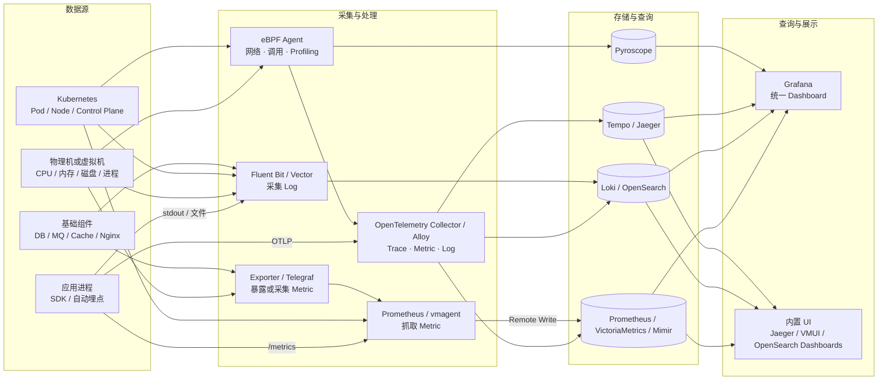

这一篇不再重复协议细节，直接回答两个问题：

1. 开源可观测性系统有哪些可用组件？
2. 在 Kubernetes、物理机和小型环境中，应该怎样组合这些组件？

先纠正一个容易混淆的名称：**OTLP 是 OpenTelemetry 使用的遥测数据传输协议，不是一个监控产品，也没有存储和 UI**。真正可以部署的是 OpenTelemetry SDK、OpenTelemetry Collector，以及接收 OTLP 的后端。

<!-- more -->

## 1. 从完整实现看可观测性组件



这张图中的组件可以分成四层：

| 层次 | 负责什么 | 典型组件 |
|---|---|---|
| 数据产生 | 在应用、主机和基础组件中产生遥测数据 | OTel SDK、Prometheus Client、各种 Exporter |
| 采集与处理 | 接收、抓取、补标签、过滤、批处理和转发 | OTel Collector、Alloy、Prometheus、vmagent、Fluent Bit、Vector、Telegraf |
| 存储与查询 | 按信号保存数据并提供查询接口 | VictoriaMetrics、Mimir、Loki、Tempo、Jaeger、OpenSearch、Pyroscope |
| UI | Dashboard、检索、告警、调用链和火焰图 | Grafana、Jaeger UI、VMUI、OpenSearch Dashboards |

这里最重要的结论是：**Collector 和 Agent 通常不是最终的监控系统**。它们负责把数据送到后端，历史查询和可视化由存储后端及 UI 完成。

## 2. 采集组件怎么选

### 2.1 OpenTelemetry Collector

[OpenTelemetry Collector](https://opentelemetry.io/docs/collector/) 是厂商无关的遥测数据管道，主要处理 Trace，也可以处理 Metric 和 Log。其内部始终是三类组件：

```text
Receiver → Processor → Exporter
接收数据     处理数据       输出到后端
```

常见部署方式：

- **Agent 模式**：每台物理机一个进程，或在 Kubernetes 中以 DaemonSet 运行，负责采集本机数据。
- **Gateway 模式**：集中部署，对多个 Agent 或应用上报的数据做批处理、采样和后端路由。
- **Agent + Gateway**：规模较大时最常见，节点 Agent 负责就近采集，Gateway 负责集中治理。

Collector 本身没有查询 UI，也不适合承担长期存储。它的优势是统一 OTLP 入口，之后更换 Tempo、Jaeger、SigNoz 等后端时，应用埋点不需要一起修改。

### 2.2 Grafana Alloy

[Grafana Alloy](https://grafana.com/docs/alloy/latest/) 是开源的可观测性采集器，兼容 OpenTelemetry Collector 和 Prometheus 生态，并原生支持 Loki、Tempo、Mimir 与 Pyroscope 数据管道。

它适合下面这种需求：

- 希望一个 Agent 同时采集 Metric、Log、Trace 和 Profile；
- 后端主要采用 Grafana 开源栈；
- 不想分别管理 OTel Collector、Prometheus Agent 和日志 Agent。

Alloy 仍然只是采集器，没有独立监控 UI。展示端通常使用 Grafana。

### 2.3 Prometheus、vmagent 与 Exporter

[Prometheus](https://prometheus.io/docs/introduction/overview/) 专门处理指标。它既能定时抓取 `/metrics`，也能存储时间序列、执行 PromQL 和告警规则。

在物理机上，常见链路是：

```text
node_exporter ──/metrics──> Prometheus ──> Grafana
```

在数据库和中间件上，Exporter 把组件自身状态转换成 Prometheus 指标：

```text
MySQL ──> mysqld_exporter ─┐
Redis ──> redis_exporter ──┼──> Prometheus
Nginx ──> nginx_exporter ──┘
```

[vmagent](https://docs.victoriametrics.com/victoriametrics/vmagent/) 是 VictoriaMetrics 提供的轻量指标采集与转发组件。它能执行 Prometheus 风格的抓取，再通过 Remote Write 写入 VictoriaMetrics 或其他兼容后端。只需要转发指标、不需要在采集节点保存数据时，vmagent 比完整 Prometheus 更合适。

### 2.4 Fluent Bit、Vector 与 Telegraf

这三类 Agent 更偏向特定信号：

| 组件 | 主要用途 | 适合场景 |
|---|---|---|
| [Fluent Bit](https://docs.fluentbit.io/manual/) | 轻量日志采集、解析和转发 | Kubernetes 容器日志、物理机日志 |
| [Vector](https://vector.dev/docs/) | 高性能日志和指标管道，转换能力强 | 需要复杂清洗、路由和缓冲 |
| [Telegraf](https://docs.influxdata.com/telegraf/v1/) | 插件化采集主机、中间件和设备指标 | 物理机、网络设备、IoT、传统基础设施 |

如果只是采集容器 stdout 日志，Fluent Bit 通常更直接；如果日志转换逻辑较复杂，可以选择 Vector；如果有大量现成设备和中间件指标需要接入，可以先检查 Telegraf 的输入插件。

### 2.5 eBPF Agent

eBPF Agent 在 Linux 内核层观测网络、系统调用和进程，不要求所有应用都先接入 SDK。典型实现包括：

- [Grafana Beyla](https://grafana.com/docs/beyla/latest/)：自动产生应用 RED 指标和 Trace；
- [Pixie](https://docs.px.dev/)：面向 Kubernetes 的 eBPF 可观测性；
- [Coroot Node Agent](https://docs.coroot.com/)：用 eBPF 发现服务依赖、网络调用和性能问题；
- [OpenTelemetry eBPF Instrumentation](https://opentelemetry.io/docs/zero-code/obi/)：OpenTelemetry 的零代码 Linux 可观测方案。

eBPF 很适合补齐“无法改代码的服务”，但不能完全替代业务埋点。它通常知道一次 HTTP 或数据库调用耗时多久，却未必知道订单号、业务阶段或失败原因等应用语义。

## 3. 按遥测信号选择存储后端

### 3.1 Metrics：Prometheus、VictoriaMetrics、Mimir

| 后端 | 部署形态 | UI | 适合场景 |
|---|---|---|---|
| Prometheus | 单进程，本地时序库 | 自带基础查询页，通常配 Grafana | 单集群、小中型环境、短中期保存 |
| VictoriaMetrics Single | 单进程、无外部依赖 | 内置 VMUI，也支持 Grafana | 物理机、小中型环境、希望节省资源 |
| VictoriaMetrics Cluster | 多组件分布式 | VMUI、Grafana | 大规模指标与多租户 |
| [Thanos](https://thanos.io/tip/thanos/getting-started.md/) | Prometheus Sidecar + 对象存储 | Grafana | 保留现有 Prometheus，并增加全局查询和长期存储 |
| Grafana Mimir | 分布式、Prometheus 兼容 | Grafana | 多集群、长周期、高可用指标平台 |

[VictoriaMetrics](https://docs.victoriametrics.com/victoriametrics/) 的单节点版本是很实用的轻量方案：一个可执行文件同时提供抓取、存储、PromQL/MetricsQL 查询和 VMUI。它不是只有转发功能的 Agent。

[Grafana Mimir](https://grafana.com/docs/mimir/latest/) 更适合多租户和大规模长期存储，但组件更多，运维复杂度明显高于单个 Prometheus 或 VictoriaMetrics Single。

Thanos 与 Mimir 的出发点不同：Thanos 常用于扩展已经存在的 Prometheus，通过 Sidecar 把历史块上传到对象存储，再提供跨 Prometheus 查询；Mimir 更像一套集中式、支持多租户的 Prometheus 后端。

### 3.2 Logs：Loki 与 OpenSearch

| 后端 | 查询与 UI | 特点 |
|---|---|---|
| [Grafana Loki](https://grafana.com/docs/loki/latest/) | LogQL + Grafana | 以标签建立索引，适合与 Grafana、Tempo 组合 |
| [OpenSearch](https://docs.opensearch.org/latest/observing-your-data/) | Query DSL/PPL + OpenSearch Dashboards | 全文检索强，也能承载 Trace 和可观测性分析 |

Loki 的设计重点是降低日志索引成本，它不会像搜索引擎一样给所有正文建立完整倒排索引。需要围绕标签和结构化字段设计查询。

OpenSearch 更适合重度全文检索和搜索分析，但索引、分片和 JVM 资源需要认真规划。其日志与 Trace 数据可以经 OTel Collector、Data Prepper 等组件写入。

### 3.3 Traces：Tempo 与 Jaeger

| 后端 | UI | 特点 |
|---|---|---|
| [Grafana Tempo](https://grafana.com/docs/tempo/latest/) | 主要使用 Grafana | 与 Loki、Prometheus、Pyroscope 关联方便，适合对象存储 |
| [Jaeger](https://www.jaegertracing.io/docs/latest/) | 自带 Jaeger UI | Trace 能力成熟，调用链检索直观 |

Jaeger 的 all-in-one 模式把 Collector、查询服务和 UI 放在一个进程中，非常适合本地学习和小规模验证；默认内存存储重启后会丢数据，正式环境需要配置持久化后端。

Tempo 本身没有独立的完整 UI，通常由 Grafana 展示 Trace。它的优势是能从 Trace 跳转到对应日志、指标和 Profile，适合作为 Grafana 开源栈的一部分。

### 3.4 Profiles：Pyroscope

[Grafana Pyroscope](https://grafana.com/docs/pyroscope/latest/) 用于持续性能剖析。它保存 CPU、内存等 Profile，并通过火焰图回答：

- 哪个函数长期消耗 CPU；
- 哪段代码分配了大量内存；
- 某条慢 Trace 对应的函数热点在哪里。

Pyroscope 可以使用自己的 UI，也可以接入 Grafana，并与 Metric、Log、Trace 关联。Profile 是 Metrics、Logs、Traces 之外的第四类重要信号，但小型环境不必一开始就部署。

## 4. UI：数据最终在哪里看

### 4.1 Grafana

[Grafana](https://grafana.com/docs/grafana/latest/) 是最常见的统一 UI。它不负责采集数据，通常也不直接保存遥测数据，而是查询不同数据源：

```text
Prometheus / VictoriaMetrics / Mimir ──┐
Loki ──────────────────────────────────┼──> Grafana
Tempo / Jaeger ────────────────────────┤
Pyroscope ─────────────────────────────┘
```

Grafana 的价值不只是画图，还包括统一变量、告警、Explore 查询，以及 Metric、Log、Trace、Profile 之间的跳转。

### 4.2 各后端的内置 UI

| UI | 能看什么 | 定位 |
|---|---|---|
| Prometheus UI | PromQL、目标状态、规则、告警 | 运维和调试页，不适合做完整监控门户 |
| VMUI | MetricsQL、指标探索、基数分析、告警 | VictoriaMetrics 自带的实用指标 UI |
| Jaeger UI | Trace 搜索、Span 瀑布图、依赖关系 | 专业 Trace UI |
| OpenSearch Dashboards | 日志检索、Dashboard、Trace 分析 | OpenSearch 的统一分析 UI |
| SkyWalking UI | 服务拓扑、Trace、指标、日志 | APM 导向的统一 UI |
| SigNoz UI | Dashboard、Trace、Log、Metric、告警 | 一体化可观测性 UI |
| OpenObserve UI | Log、Metric、Trace 搜索和 Dashboard | 一体化数据探索 UI |

如果使用的是模块化后端，优先统一到 Grafana；如果部署的是 SigNoz、SkyWalking 或 OpenObserve，一般先使用它们自带的 UI，不必再额外增加 Grafana。

## 5. 开源一体化平台

前面的组件需要自己拼装。下面这些平台已经把接收、存储、查询和 UI 组合到一起，更接近“安装后得到完整产品”。

### 5.1 SigNoz

[SigNoz](https://signoz.io/docs/what-is-signoz/) 是 OpenTelemetry-first 的开源可观测性平台，统一接收 Metrics、Logs 和 Traces，使用 ClickHouse 存储，并提供 Dashboard、Trace Explorer、Log Explorer、Metric Explorer 和告警。

适合：

- 希望通过 OTLP 接入，不想分别维护 Loki、Tempo 和指标库；
- 希望获得统一的 APM 使用体验；
- 可以接受 ClickHouse 带来的资源和运维成本。

它的 Docker 部署适合试用，但“容易启动”不等于“运行很轻”。小规格物理机需要先评估 ClickHouse 的内存和磁盘占用。

### 5.2 OpenObserve

[OpenObserve](https://openobserve.ai/docs/) 是面向 Logs、Metrics 和 Traces 的开源平台，提供内置 UI、Dashboard 和告警，支持 OTLP、Prometheus、Fluent Bit、Vector、Filebeat、Telegraf 等多种入口。

适合：

- 日志检索是主要需求，同时希望把 Metric 和 Trace 放进同一平台；
- 希望组件数量少于完整 LGTM 栈；
- 需要 SQL 风格查询和 PromQL 支持。

### 5.3 Apache SkyWalking

[Apache SkyWalking](https://skywalking.apache.org/docs/main/latest/readme/) 是以 APM 为中心的开源平台，核心结构是：

```text
语言 Agent / OTel / eBPF Probe
              ↓
         OAP Server
              ↓
   BanyanDB / Elasticsearch 等存储
              ↓
         SkyWalking UI
```

它对服务拓扑、分布式调用链、应用性能和告警的支持较完整，也提供 Java、Python、Node.js、Go 等语言探针。

适合以微服务 APM 为中心的系统。如果主要需求只是主机 CPU、磁盘和少量日志，SkyWalking 会显得偏重。

### 5.4 OpenSearch Observability

[OpenSearch Observability](https://docs.opensearch.org/latest/observing-your-data/) 在 OpenSearch 与 OpenSearch Dashboards 上提供 Logs、Metrics 和 Traces 的分析能力。常见数据链路是：

```text
应用 / OTel Collector
        ↓
   Data Prepper
        ↓
    OpenSearch
        ↓
OpenSearch Dashboards
```

它适合已经使用 OpenSearch 保存日志的团队，可以继续补充 Trace 和 Dashboard，减少新引入一种存储系统的成本。

### 5.5 Coroot

[Coroot Community Edition](https://docs.coroot.com/) 是开源、eBPF 驱动的可观测性平台，可运行在 Kubernetes、Docker 和普通 Linux 服务器上。Node Agent 自动发现服务、网络连接和部分性能数据，平台提供拓扑、指标、日志、Trace、数据库监控和根因分析 UI。

它适合不能为大量旧应用逐个埋点、希望快速获得服务拓扑的 Linux 环境。需要注意：eBPF Agent 需要较高主机权限，对内核能力也有要求；平台仍会依赖 Prometheus 兼容指标存储和 ClickHouse 等组件，不能简单理解成“只有一个 Agent”。

### 5.6 Grafana LGTM Stack

LGTM 不是一个单体产品，而是一组可以独立扩缩容的开源组件：

| 字母 | 组件 | 信号 |
|---|---|---|
| L | Loki | Logs |
| G | Grafana | UI |
| T | Tempo | Traces |
| M | Mimir | Metrics |

再加上 Alloy 采集和 Pyroscope Profiling，就形成完整的 Grafana 开源可观测性栈。

它的优势是各信号可以独立选型、扩容和替换；代价是组件多，配置、对象存储、权限和高可用都需要自己维护。它更适合作为团队级平台，不是最轻量的入门方案。

## 6. 物理机与小型环境的轻量方案

### 6.1 Glances：单机临时观察

[Glances](https://glances.readthedocs.io/en/latest/) 是跨平台主机监控工具，可以直接在终端显示 CPU、内存、磁盘、网络和进程，也能启动 Web UI。

```text
Glances → 终端 UI / Web UI
```

适合开发机、测试机和临时排障。它不是集中式可观测性平台，不适合长期保留大量历史数据。

### 6.2 Netdata：安装后立即看到主机 UI

[Netdata](https://learn.netdata.cloud/docs/dashboards-and-charts/) Agent 能在 Linux、Windows、macOS、FreeBSD、Docker 和 Kubernetes 上采集大量系统及应用指标，并直接提供本地 Web UI：

```text
http://<node>:19999
```

它适合少量服务器和希望快速看到实时监控的环境。仅使用本地开源 Agent 和本地 Dashboard 即可，不依赖托管服务。若需要跨很多节点集中保存和统一管理，则要进一步设计 Parent/Child 或改用 Prometheus 类平台。

### 6.3 node_exporter + Prometheus + Grafana

这是最通用的开源物理机监控组合：

```text
每台主机 node_exporter
          ↓ scrape
一台 Prometheus
          ↓ query
一台 Grafana
```

优点是生态成熟、Exporter 多、资料丰富。缺点是默认只解决指标；日志和 Trace 仍需增加其他组件。

### 6.4 VictoriaMetrics Single + vmagent + Grafana

当 Prometheus 本地存储的保留周期或资源占用成为问题时，可以使用：

```text
node_exporter / 应用 / Exporter
               ↓ scrape
             vmagent
               ↓ Remote Write
      VictoriaMetrics Single
               ↓
          VMUI / Grafana
```

对于几十台到数百台主机，这是组件数量较少、资源开销可控的指标方案。小规模时也可以省去 vmagent，让 VictoriaMetrics 自己抓取目标。

### 6.5 Zabbix：传统主机与设备监控

[Zabbix](https://www.zabbix.com/documentation/current/en/manual/concepts/agent) 是成熟的开源监控系统，由 Agent、Server、Proxy、数据库和 Web Frontend 组成，支持主机 Agent、SNMP、JMX、IPMI 等方式。

它适合物理机、网络设备和传统基础设施较多的环境，资产、模板、触发器和告警体系完整。若目标是云原生的 Trace、OTLP 和信号关联，OpenTelemetry + Grafana 生态更自然。

## 7. 几种可直接落地的组合

### 7.1 一台开发机或测试机

只想立刻看到主机状态：

```text
Netdata Agent + 本地 Web UI
```

只想临时排查：

```text
Glances
```

只学习 Trace：

```text
应用 OTel SDK → Jaeger all-in-one → Jaeger UI
```

### 7.2 少量物理机，只关注指标

```text
node_exporter / 各类 Exporter
              ↓
         Prometheus
              ↓
           Grafana
```

若希望保存更久或进一步降低存储成本，把 Prometheus 存储替换为 VictoriaMetrics Single。

### 7.3 少量物理机，需要日志、指标和 Trace

优先考虑一体化平台：

```text
应用 OTel SDK + OTel Collector
主机 Exporter + Fluent Bit
               ↓
       SigNoz 或 OpenObserve
               ↓
          平台内置 UI
```

这种组合比自行拼装 LGTM 更容易维护，但后端资源消耗仍需压测。

### 7.4 Kubernetes，中小规模且希望组件清晰

```text
Metrics: Prometheus 或 VictoriaMetrics
Logs:    Fluent Bit → Loki
Traces:  OTel Collector → Tempo
UI:      Grafana
```

采集器也可以统一为 Alloy。Prometheus Operator 继续负责 ServiceMonitor、PodMonitor、PrometheusRule 等 Kubernetes CRD。

### 7.5 Kubernetes，希望开箱即用的一体化 APM

```text
OTel SDK / 自动埋点 / 基础设施采集
                 ↓
       SigNoz 或 SkyWalking
                 ↓
            内置 UI
```

偏 OpenTelemetry 原生与三种信号统一，优先评估 SigNoz；偏服务拓扑、Java 微服务 APM 和语言 Agent，优先评估 SkyWalking。

### 7.6 多集群、长周期和较大规模

```text
节点 Alloy / OTel Collector
           ↓
集中 Collector Gateway
           ↓
Mimir + Loki + Tempo + Pyroscope
           ↓
         Grafana
```

这套组合扩展能力强，但需要对象存储、多租户、容量、高可用和升级方面的工程投入。

## 8. 组件总表

| 组件 | 角色 | Metric | Log | Trace | Profile | 自带 UI | 适合物理机 | 适合 K8s |
|---|---|:---:|:---:|:---:|:---:|:---:|:---:|:---:|
| OTel Collector | 采集/处理/转发 | ✓ | ✓ | ✓ | 部分 | — | ✓ | ✓ |
| Grafana Alloy | 统一采集/处理 | ✓ | ✓ | ✓ | ✓ | — | ✓ | ✓ |
| Prometheus | 指标抓取/存储/查询 | ✓ | — | — | — | 基础 | ✓ | ✓ |
| vmagent | 指标采集/转发 | ✓ | — | — | — | — | ✓ | ✓ |
| Fluent Bit | 日志采集/转发 | 部分 | ✓ | — | — | — | ✓ | ✓ |
| Vector | 数据采集/转换/转发 | ✓ | ✓ | 部分 | — | — | ✓ | ✓ |
| Telegraf | 插件化指标采集 | ✓ | 部分 | — | — | — | ✓ | ✓ |
| VictoriaMetrics | 指标存储/查询 | ✓ | — | — | — | VMUI | ✓ | ✓ |
| Thanos | Prometheus 长期存储/全局查询 | ✓ | — | — | — | 基础 | ✓ | ✓ |
| Mimir | 分布式指标存储/查询 | ✓ | — | — | — | — | ✓ | ✓ |
| Loki | 日志存储/查询 | — | ✓ | — | — | — | ✓ | ✓ |
| Tempo | Trace 存储/查询 | — | — | ✓ | — | — | ✓ | ✓ |
| Jaeger | Trace 后端 | — | — | ✓ | — | Jaeger UI | ✓ | ✓ |
| Pyroscope | Profile 后端 | — | — | — | ✓ | ✓ | ✓ | ✓ |
| Grafana | 查询与展示 | ✓ | ✓ | ✓ | ✓ | ✓ | ✓ | ✓ |
| SigNoz | 一体化平台 | ✓ | ✓ | ✓ | — | ✓ | ✓ | ✓ |
| OpenObserve | 一体化平台 | ✓ | ✓ | ✓ | — | ✓ | ✓ | ✓ |
| SkyWalking | APM 平台 | ✓ | ✓ | ✓ | 部分 | ✓ | ✓ | ✓ |
| OpenSearch | 搜索/日志/Trace 平台 | 部分 | ✓ | ✓ | — | Dashboards | ✓ | ✓ |
| Coroot | eBPF 可观测性平台 | ✓ | ✓ | ✓ | ✓ | ✓ | ✓ | ✓ |
| Netdata | 主机实时监控 | ✓ | 部分 | — | — | ✓ | ✓ | ✓ |
| Zabbix | 主机/设备监控平台 | ✓ | 部分 | — | — | ✓ | ✓ | ✓ |

表中的“支持”并不代表每种信号都同样成熟。例如 Prometheus 专注 Metric，Jaeger 专注 Trace；把职责单一的组件用在它最擅长的链路上，通常比强求一个 Agent 包办所有事情更可靠。

以上项目虽然都提供开源、自建版本，但许可证并不完全相同，常见的有 Apache-2.0、AGPL、GPL 等。若要修改后对外提供服务或嵌入商业发行版，还需要在采用前核对项目当前许可证。

## 9. 最终选型建议

不要先问“哪个产品功能最多”，而要先确定下面四件事：

1. **主要数据是什么**：只有主机指标，还是还需要日志、Trace 和 Profile？
2. **是否允许修改应用**：能接入 OTel SDK，就能获得更完整的业务 Trace；不能修改时再依赖 eBPF。
3. **希望一体化还是可组合**：SigNoz、OpenObserve、SkyWalking 部署直观；LGTM 更灵活，但组件和运维工作更多。
4. **数据量和保留周期**：决定单机 Prometheus、VictoriaMetrics Single 是否足够，还是需要 Mimir 等分布式后端。

按学习和实践成本，我建议依次体验：

```text
第一步：node_exporter + Prometheus + Grafana
第二步：OTel SDK + OTel Collector + Jaeger
第三步：Fluent Bit + Loki，并在 Grafana 中关联日志与 Trace
第四步：再比较 SigNoz、SkyWalking、OpenObserve 或完整 LGTM
```

这样可以先理解每个信号的独立链路，再判断一体化平台替自己封装了哪些组件，而不是只记住产品名称。
