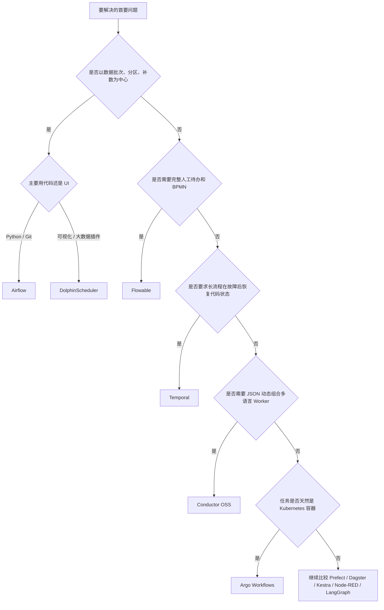

# 开源 Workflow 调研总结与选型指南


## 深入调研

1. 以三节点集群，介绍每一个组件的架构
2. 举一个最适合当前组件的示例，结合示例讲解组件的核心流程、核心概念、核心抽象
3. 以例子讲述，组件对 workflow 的抽象，workflow 状态是如何持久化的，包括如何做异常恢复，如何做重试，存储层支持的存储有哪些
4. 支不支持定时任务，服务重启或者异常恢复后，中断的任务是否可以自动恢复，如果能自动恢复是如何实现的
4. 有没有交互 UI，除了 UI 如何自定义工作流，支不支持通过 yaml或者 json 而非接口的方式定义工作流
5. 支持哪些 work 节点任务类型
6. 总结: 组件适用于什么场景，什么类型的任务

## 1. 先按问题类型选类别

“Workflow”不是一种产品类型。同样是依次调用三个服务，不同组件真正解决的问题可能完全不同：

| 类别 | 首要问题 | 代表项目 | 典型任务 |
|---|---|---|---|
| 持久执行 | 服务、Worker 重启后，长流程怎样自动继续？ | Temporal、Cadence、DBOS | 订单、支付、跨服务事务、异步回调、长时间等待 |
| 声明式服务编排 | 怎样用外部流程定义动态组合多语言 Worker？ | Conductor OSS | 微服务编排、平台化任务、动态分支和并行 |
| 数据编排 | 哪批数据应在什么时间、依赖和分区条件下运行？ | Airflow、DolphinScheduler、Dagster、Prefect | ETL/ELT、数仓、报表、批量训练、历史补数 |
| 通用声明式自动化 | 怎样用 YAML 统一编排脚本、SQL、API 和插件？ | Kestra | 数据与运维自动化、多语言脚本任务 |
| Kubernetes 工作流 | 怎样把一组容器和集群资源组织成 DAG？ | Argo Workflows | 批计算、训练、仿真、转码、容器流水线 |
| BPM/人工流程 | 谁处理待办，怎样认领、转办、会签、超时和审计？ | Flowable | 审批、工单、理赔、开户、合同流程 |
| 事件集成 | 消息怎样在协议、设备和系统连接器之间流动？ | Node-RED | IoT、MQTT、Webhook、轻量自动化 |
| Agent 状态图 | 模型、工具、状态和人工反馈怎样循环？ | LangGraph | 多轮 Agent、工具调用、检索、人工介入 |

因此第一步不是比较 Star 或 UI，而是确定主导问题：数据批次、业务长流程、人工待办、容器执行、事件集成还是 Agent 内部状态。

## 2. 候选项目全景

### 2.1 开源候选

| 项目 | 主导模型 | 定义方式 | 核心执行单元 | 主要状态存储 | UI 定位 |
|---|---|---|---|---|---|
| Temporal | 代码式持久执行、Event History | Go/Java/Python/TS 等 SDK | Activity、Child Workflow | MySQL/PostgreSQL/Cassandra 等 | 查询、排障和运维 |
| Cadence | 代码式持久执行、事件历史 | Go/Java 等 SDK | Activity | Cassandra/MySQL/PostgreSQL 等 | 查询和运维 |
| DBOS | 应用内持久 Workflow/Step | Python/TypeScript 等代码 | Step | PostgreSQL | 控制面和观测 |
| Conductor OSS | JSON Workflow + 中心状态机 | JSON、API、UI | SIMPLE Worker Task、System Task | Execution、Queue、Index 分层后端 | 定义、观察和运维 |
| Airflow | 数据 DAG、DagRun、TaskInstance | Python | Operator/TaskFlow/Sensor | Metadata DB；执行层取决于 Executor | 观察和运维，非主要建模入口 |
| DolphinScheduler | 可视化数据 DAG | UI、API、Python SDK、SDK YAML | Task Plugin | 关系数据库 + Registry | 设计、配置和运维 |
| Dagster | Software-defined Assets | Python | Asset、Op | 实例数据库 + IO Manager | 资产、运行和观测 |
| Prefect | 原生 Python Flow | Python | Flow、Task | SQLite/PostgreSQL + Result Storage | 部署、运行和观测 |
| Kestra | YAML 声明式流程 | YAML、UI | Plugin Task | SQL + Internal Storage | 设计和运维 |
| Argo Workflows | Kubernetes CRD | YAML | Container/Script/Resource Template | Kubernetes 对象，可选 SQL Archive | 设计、运行和运维 |
| Flowable | BPMN/CMMN/DMN | 标准 XML、建模器 | User Task、Service Task、Event、Job | 关系数据库 | 当前 OSS 重点是引擎/API，UI 需另 |
| Node-RED | 事件消息流 | 浏览器 Flow Editor、JSON Flow | Node | Flow 文件、可选 Context Store | 核心建模入口 |
| LangGraph | 有状态图与 Checkpoint | Python/JavaScript 代码 | Node | Checkpointer、Store | 库本身以代码为主 |

### 2.2 需要单独判断许可证边界的产品

| 产品 | 与哪些项目功能重叠 | 不能直接纳入宽松开源清单的原因 |
|---|---|---|
| Restate | Temporal、DBOS | Server 使用 BSL 1.1，并非当前意义上的开源许可证 |
| n8n | Node-RED、Kestra | 使用 Sustainable Use License，包含使用限制 |
| Dify | LangGraph、可视化 LLM Workflow | 修改版 Apache 2.0，带额外多租户和品牌条款 |
| Camunda 8 | Flowable | 核心平台采用 Camunda License，生产使用边界需单独确认 |

有源码可见不等于采用 OSI 意义上的开源许可证。实际部署前必须检查所选版本及商业组件各自的 LICENSE。

## 3. 五个深入调研组件的核心定位

| 组件 | 一句话定位 | 最强能力 | 主要限制 |
|---|---|---|---|
| Temporal | 用事件历史恢复代码执行的持久执行平台 | 长流程恢复、Timer、Signal/Update、多语言 SDK | 确定性约束；没有业务人员拖拽式流程定义 |
| Conductor OSS | 用 JSON 定义驱动多语言 Worker 的中心化编排引擎 | 动态流程、Worker 拉取、系统任务、可视化运维 | 存储组合和队列语义较复杂；JSON 流程规模大后治理困难 |
| Flowable | 基于 BPMN/CMMN/DMN 的业务流程引擎 | User Task、候选组、认领、会签、超时、审计 | 当前 OSS 不附带旧版完整 UI；需自行建设任务门户和身份集成 |
| Airflow | 以逻辑日期和数据区间为中心的数据 DAG 平台 | 定时、补数、数据依赖、Provider 生态 | 不适合把每个在线业务实体建成长生命周期状态机 |
| DolphinScheduler | 可视化、低代码的分布式数据 DAG 调度平台 | UI 建模、大数据 Task Plugin、Worker Group | 依赖 Registry；人工业务任务和代码式持久执行较弱 |

Temporal 与 Flowable、Airflow 解决的是三个不同主问题：

```text
Temporal：业务执行怎样可靠继续？
Flowable：参与者怎样完成业务流程？
Airflow / DolphinScheduler：某个数据批次何时以及按什么依赖运行？
Conductor：平台怎样动态组织多语言 Worker？
```

## 4. 三节点架构对比

### 4.1 Temporal

Temporal 的服务端按逻辑角色拆分：Frontend 接入请求，History 管理 Workflow Execution 和 Event History，Matching 维护 Task Queue 匹配，内部 Worker 执行系统后台任务。业务 Worker 独立部署并长轮询 Task Queue。

三节点可以让每台节点运行多个 Temporal Service 角色，也可以按角色分别扩容。所有节点共享持久化数据库；生产环境还要保证数据库自身高可用。业务 Worker 不保存权威 Workflow 状态，崩溃后其他 Worker 可从 Event History 重放恢复。

```text
Client -> Frontend
           -> History Shard -> Persistence
           -> Matching / Task Queue <- Worker long poll
```

### 4.2 Conductor OSS

三个 Conductor Server 都可以接收 API、执行 Decider/Sweeper 和管理任务。Workflow/Task Execution、Queue、搜索索引和分布式锁使用共享后端。外部 Worker 按 Task Type 轮询队列并回报结果。

```text
Client -> Conductor Server × 3
             ├─ ExecutionDAO：Workflow/Task 状态
             ├─ QueueDAO：待领取 taskId
             ├─ IndexDAO：UI/检索
             └─ Lock：多节点决策互斥
                     ^
                     └─ Worker poll/update
```

简单组合可以全部使用 PostgreSQL；高吞吐组合常拆成 PostgreSQL 状态、Redis Queue/Lock、OpenSearch 索引。具体支持范围必须以固定 Release 验证。

### 4.3 Flowable

三个相同的 Spring Boot/Flowable 节点放在负载均衡后，节点同时提供 REST/Engine，并启用 Async Executor。流程定义、Execution、User Task、Variable、Job 和 History 都保存在共享关系数据库。

```text
Client -> LB -> Flowable Engine × 3 -> HA relational DB
                      |
                      ├─ Async Executor 获取 DB Job
                      ├─ External Worker 按 topic 获取任务
                      └─ Identity / custom Task UI
```

核心异步 Job Queue 也在数据库中，通过 lock owner、lock expiration 和乐观锁协调，不依赖 Redis、ZooKeeper 或 Kafka。

### 4.4 Airflow

Airflow 3 的控制面包括 API Server、Scheduler 和 DAG Processor，执行面由 Executor 决定；需要异步等待时运行 Triggerer。三节点架构不能只说“三个 Airflow Server”，必须指出选择的 Executor：

- CeleryExecutor：Scheduler 把任务交给 Celery Broker，Celery Worker 分布执行；
- KubernetesExecutor：Scheduler 通过 Kubernetes API 为任务创建 Pod；
- LocalExecutor：任务运行在 Scheduler 节点，适合较小部署。

Metadata DB 保存 DagRun、TaskInstance 和调度状态。多 Scheduler 主要通过数据库行锁协调，不要求 ZooKeeper。

### 4.5 DolphinScheduler

DolphinScheduler 把 API、Master、Worker、Alert 拆分。三台机器可分别部署这些服务，Master 和 Worker 都可多副本。Master 消费数据库 Command、推进 DAG 状态机，通过 RPC 把任务发给 Worker；Registry 提供服务发现、故障检测、选主和分布式锁。

```text
UI/API -> API Server × 3
              -> Metadata DB / Command
              -> Master × 3 -> RPC -> Worker × 3
                    |                    |
                 Registry          Task Plugin
              ZK / etcd / JDBC
```

生产环境最好把重负载 Worker 与 Master 隔离，避免脚本、Spark 提交或媒体计算影响调度控制面。

## 5. Queue 与集群协调

| 组件 | Queue 实现 | 状态与队列关系 | 集群协调 |
|---|---|---|---|
| Temporal | Server 内建持久 Task Queue；Matching 负责匹配，任务源自 History 状态 | Task Queue 是执行投递，Event History 是恢复权威 | History Shard 所有权及服务端内部协调 |
| Conductor | `QueueDAO` 抽象，可用 PostgreSQL、Redis 等 | Queue 通常只放 taskId；完整 Task Execution 在 ExecutionDAO | Redis/PostgreSQL 等锁实现；固定版本需验证 |
| Flowable | 关系数据库 Job 表 + 节点本地线程池缓冲 | DB Job 是持久队列；流程运行态同样在 DB | DB 锁字段、租约、乐观锁 |
| Airflow | Metadata DB 状态 + Executor 的投递机制 | TaskInstance 状态在 DB；实际队列由 Executor 决定 | Scheduler 间使用 DB 行锁；Celery 另需 Broker |
| DolphinScheduler | DB Command/Instance + Master 内存待分发队列 + RPC | 数据库是权威状态；内存队列只是实时调度层 | ZooKeeper、etcd 或 JDBC Registry |

几个常见误解：

- Airflow 不一定依赖 Redis；只有 CeleryExecutor 选择 Redis 作为 Broker 时才依赖。
- Flowable 核心 Job Queue 不要求 Redis/ZooKeeper。
- Conductor 的 Queue 不是 Workflow 状态的唯一来源，不能只备份 Redis Queue。
- DolphinScheduler 的 Task Group Queue 是并发配额排队，不等于 Master 到 Worker 的全部任务通道。
- Temporal Task Queue 不是普通业务消息队列；它与 Event History、Workflow Task 和 Activity Task 共同构成执行协议。

## 6. 工作流状态与恢复模型

### 6.1 Temporal：事件历史重放

Temporal 持久化 Workflow Execution 的 Event History。Workflow Worker 收到 Workflow Task 后，从历史起点确定性重放代码，恢复内存变量，再产生新的 Command。Activity 结果、Signal、Timer 和 Update 都进入历史。

恢复特点：

- Worker 重启不丢 Workflow 内存状态，因为状态能从历史重建；
- 已完成 Activity 不会在普通重放中再次执行，历史结果直接返回给 Workflow 代码；
- 未完成 Activity 根据超时和 Retry Policy 重新调度；
- Activity 外部副作用仍可能至少执行一次，必须幂等；
- 修改 Workflow 代码必须保证旧历史仍可重放，通常使用 Worker Versioning 或 Patch/version 机制。

### 6.2 Conductor：状态快照与重新决策

Conductor 持久化 Workflow Instance 和每个 Task Instance 的状态、输入、输出、重试信息。Decider 根据当前状态快照反复计算哪些任务应调度、完成或失败；Sweeper 重新检查仍在运行的 Workflow。

恢复特点：

- Worker poll 后有 ACK/lease/response timeout 等控制；Worker 丢失后任务可重新入队；
- Task 根据 Task Definition 的 retryCount、retryLogic、timeoutPolicy 等重试；
- 三个 Server 全部重启后，可从 Execution 与 Queue 后端继续；
- 已进入终态的 Workflow 通常需要 retry、rerun 或 restart 操作，不会无条件自动复活；
- Queue、Execution 和 Index 是不同职责，索引损坏不应改变执行真相。

### 6.3 Flowable：事务推进到 wait state

Flowable API 调用在数据库事务中同步推进流程，直到所有路径到达 User Task、Receive Task、Timer、External Worker Task、异步边界等 wait state。此时 Execution、Variable、Task、Job 和 Event Subscription 已写入数据库。

恢复特点：

- 同步 Service Task 抛异常时整个当前事务回滚，通常回到上一个 wait state；
- `flowable:async="true"` 的任务成为 Job，使用自动重试和 Dead Letter；
- Job 获取带 lock owner 和过期时间，节点崩溃后租约到期可由其他节点接管；
- External Worker 按 topic 获取任务并持有锁，可报告完成、BPMN Error 或技术失败；
- BPMN Error 表示业务分支，Java Exception 表示技术失败，两者不应混用。

### 6.4 Airflow：TaskInstance 状态机

Airflow 为每个 DagRun 创建 TaskInstance。Scheduler 根据依赖和状态把任务从 scheduled 推到 queued，Executor 运行后回报 success、failed、up_for_retry 等状态。

恢复特点：

- Scheduler/API 重启后从 Metadata DB 继续判断 TaskInstance；
- Worker 心跳丢失、执行器事件或超时会促使任务失败或重派，具体行为依赖 Executor；
- retry 以整个 TaskInstance 尝试为单位，不恢复 Python 函数栈中的某一行；
- XCom 是小型元数据交换，不是持久业务数据总线，也不是跨重试检查点；
- Backfill 和 clear/retry 适合重新计算明确的数据区间。

### 6.5 DolphinScheduler：实例状态 + failover

Schedule、Command、Workflow Instance 和 Task Instance 保存在关系数据库。Master 维护运行时 DAG 状态机，Registry 感知 Master/Worker 下线并触发 failover。

恢复特点：

- Master 故障后其他 Master 从数据库接管 Workflow Instance；
- Worker 故障时，本地 Shell/Python 和外部 Spark/Flink/YARN/Kubernetes 作业的恢复语义不同；
- 外部作业可能在 Worker 消失后仍运行，插件应保存 application/job ID 并查询状态；
- Task 支持失败重试、间隔和超时；实例可恢复失败、重跑、停止和补数；
- Registry 和 Metadata DB 分别承担协调与权威状态，不能互相替代。

## 7. 重试与幂等的共同边界

五个系统都能配置某种重试，但没有一个能自动让任意外部副作用 exactly-once。

```text
调用第三方接口成功
    -> Workflow 引擎保存“成功”前宕机
    -> 恢复后再次调用
    -> 外部系统出现两次效果
```

通用处理方式：

1. 为每个业务操作生成稳定幂等键；
2. 外部服务记录幂等键与最终结果；
3. 重试前先查询已有结果；
4. 长任务保存外部 job/application ID；
5. 将大文件存对象存储，工作流只传 URI 和校验信息；
6. 不可逆步骤设计补偿、人工处理和审计；
7. 区分“平台任务成功”和“业务结果完成”。

组件的持久化保证主要覆盖自身状态转换，不能跨越第三方 HTTP、数据库、云服务和文件系统建立自动原子事务。

## 8. 定时任务能力

| 组件 | 定时能力 | 重启恢复 | 最适合的时间模型 |
|---|---|---|---|
| Temporal | Schedule、持久 Timer、Sleep、超时 | Timer 写入历史/服务端状态，重启后继续 | 单个业务流程中的等待、延时和长期 Schedule |
| Conductor | Workflow Schedule、WAIT、回调等待 | Schedule/Workflow 状态持久化后继续 | 声明式流程周期触发和节点等待 |
| Flowable | Timer Start/Boundary/Intermediate Event | Timer Job 在数据库，Async Executor 恢复获取 | SLA、提醒、升级和业务流程定时启动 |
| Airflow | Timetable、cron、Asset、catchup、Backfill | Scheduler 从 Metadata DB 重建待运行批次 | 数据区间、历史补跑和批次依赖 |
| DolphinScheduler | Quartz cron、Complement Data、Dependent Task | Schedule/Command/Instance 在 DB，Master 恢复 | 可视化数据调度和批量补数 |

如果问题是“审核超过 24 小时升级”，Flowable Timer 更自然；“订单 30 分钟未支付取消”适合 Temporal Timer；“补跑过去 30 天分区”应优先看 Airflow 或 DolphinScheduler。

## 9. UI 与定义方式

| 组件 | UI 能否创建流程 | 主要定义方式 | YAML | JSON |
|---|---|---|---|---|
| Temporal | 否，Web UI 主要查询和运维 | SDK 代码 | 无官方通用 DSL | 无官方通用 DSL |
| Conductor OSS | 可以，且适合查看/编辑定义 | JSON Workflow Definition、API、UI | 非核心 | 是，核心格式 |
| Flowable OSS 8 | 当前 OSS 不带旧版完整 UI 应用 | BPMN/CMMN/DMN XML、API、外部模型器 | 否 | REST/Event Registry 可用 JSON，但 BPMN 定义不是 JSON |
| Airflow | 不作为主要建模入口 | Python DAG/TaskFlow | 无官方通用 DSL | 无官方通用 DSL |
| DolphinScheduler | 可以，拖拽是核心能力 | UI、Open API、PyDolphinScheduler | Python SDK CLI 支持 | 服务端内部/API 使用，结构不宜当稳定手写契约 |

定义方式会直接影响治理：

- 代码定义便于类型检查、测试、代码审查和复用；
- JSON/YAML 便于平台动态生成，但需要 Schema、差异审查和发布验证；
- UI 拖拽降低建模门槛，但必须补充导出、版本控制、审批和回滚；
- BPMN XML 冗长，却提供标准业务语义和模型器互通。

## 10. Worker 与任务类型

### 10.1 Temporal

业务任务主要是自定义 Activity。HTTP、SQL、LLM、文件、容器提交等都由应用代码封装。Workflow、Activity 和 Nexus/外部调用等执行职责清晰，适合强类型业务代码，但没有大量固定节点目录。

### 10.2 Conductor

- SIMPLE：外部 Worker 拉取执行；
- HTTP、INLINE、JSON_JQ_TRANSFORM 等系统任务；
- SWITCH、FORK_JOIN、JOIN、DO_WHILE 等控制任务；
- SUB_WORKFLOW、WAIT、EVENT、HUMAN 等组合和等待能力；
- Worker 可使用不同语言，通过 HTTP/gRPC 接入。

HUMAN/WAIT 能让流程停住，但完整任务门户、人员权限、会签和表单能力仍弱于 BPM 引擎。

### 10.3 Flowable

- User Task、Manual Task、Receive Task；
- Java Service Task、Delegate Expression、Script Task；
- External Worker Task、HTTP Task；
- Business Rule/DMN Task、Call Activity、Subprocess；
- Timer、Message、Signal、Error、Escalation、Compensation Event；
- Exclusive、Parallel、Inclusive、Event-based Gateway；
- multi-instance 顺序/并行会签。

### 10.4 Airflow

- Python/TaskFlow、Bash、SQL；
- Sensor 与 Deferrable Operator；
- Kubernetes Pod、Spark、云服务和数据库 Provider；
- Branch、ShortCircuit、Dynamic Task Mapping；
- HITL Operator；
- 自定义 Operator、Hook、Trigger 和 Provider。

### 10.5 DolphinScheduler

- Shell、Python、Java、Remote Shell；
- SQL、Stored Procedure；
- Spark、Flink、MapReduce；
- DataX、SeaTunnel 等同步任务；
- Kubernetes、部分云和 MLOps 插件；
- HTTP、gRPC；
- Switch、Conditions、Dependent、Sub Workflow；
- Task Group 资源并发控制。

## 11. 人工参与能力

| 组件 | 人工参与方式 | 能力评价 |
|---|---|---|
| Flowable | User Task、候选用户/组、claim、delegate、multi-instance、Boundary Timer | 五者中最完整，适合业务待办和审批 |
| Temporal | Signal/Update 写入人工决定，Query 查询状态 | 等待和恢复强；任务列表、角色、表单需应用实现 |
| Conductor | HUMAN/WAIT、外部回调、Worker/UI 操作 | 可实现人工检查点；复杂人员流程需外部系统 |
| Airflow | HITL Operator，`awaiting_input` 状态和 UI 输入 | 适合数据批次中的批准/拒绝/选择，不是完整 BPM |
| DolphinScheduler | UI 运维操作、HTTP/Dependent 对接外部审批 | 没有原生业务 User Task，主要是运维人工操作 |

按需求判断：

- 需要候选组、认领、转办、会签、表单、SLA：Flowable；
- 只需长流程等待一个人工决定，且任务门户由应用提供：Temporal；
- JSON 流程里加入简单人工检查点：Conductor；
- 数据批次发布前由操作员确认：Airflow HITL；
- DolphinScheduler 应把审批放到外部业务系统。

## 12. 存储对比

| 组件 | 核心状态 | 队列/协调 | 查询/历史 | 大文件和产物 |
|---|---|---|---|---|
| Temporal | PostgreSQL/MySQL/Cassandra 等 Persistence | 内建 Task Queue/Matching | Visibility SQL/Elasticsearch 等 | 对象存储或业务存储，只在 History 传引用 |
| Conductor | ExecutionDAO：PostgreSQL/MySQL/Redis/Cassandra 等组合 | QueueDAO；Redis/PostgreSQL 等 | IndexDAO，常用 OpenSearch/Elasticsearch | External Payload Storage/对象存储 |
| Flowable | JDBC 关系数据库 | DB Job、锁 owner/expiry | `ACT_HI_*` 历史表 | 外部内容服务/对象存储 |
| Airflow | PostgreSQL/MySQL Metadata DB | Executor 决定；Celery 可用 Redis/RabbitMQ | Metadata DB、日志后端 | 对象存储、数仓；XCom 只传小数据 |
| DolphinScheduler | PostgreSQL/MySQL 等 Metadata DB | DB Command + Registry | 实例表、日志和告警数据 | HDFS/S3/云对象存储等 Resource Plugin |

选型时至少要分别确认流程定义、执行状态、任务队列、查询索引、日志和业务产物，不要把“支持 PostgreSQL”理解为所有数据都只落一个数据库。

## 13. 项目归属、CNCF 与受欢迎程度

| 组件 | 基金会/维护方 | CNCF | 许可证 | 调研时 GitHub 热度 |
|---|---|---|---|---|
| Airflow | Apache Software Foundation | 非 CNCF 托管 | Apache-2.0 | 约 46.8k Star、17.8k Fork |
| Conductor OSS | conductor-oss 社区；原 Netflix 仓库已归档 | 非 CNCF 托管 | Apache-2.0 | 约 32k Star |
| Temporal | Temporal Technologies/开源社区 | 非 CNCF 托管 | MIT | 约 22.9k Star、1.9k Fork |
| DolphinScheduler | Apache Software Foundation | 非 CNCF 托管；被 CNCF Landscape 收录 | Apache-2.0 | 约 14.5k Star、5.1k Fork |
| Flowable | Flowable 社区/公司 | 非 CNCF 托管 | Apache-2.0 | 约 9.3k Star、2.8k Fork |

五个深入调研组件都不是 CNCF 托管项目。进入 CNCF Landscape 只表示项目被生态目录收录，不等于通过 CNCF Sandbox、Incubating 或 Graduated 治理阶段。

Star 可以反映关注度，不能代替以下判断：Release 节奏、升级兼容性、安全响应、文档质量、关键维护者数量、生产案例、扩展生态和团队运维经验。

## 14. 直接替代与部分重叠

| 比较组 | 替代程度 | 核心区别 |
|---|---|---|
| Airflow ↔ DolphinScheduler | 高 | Python/Git/Provider 生态 vs UI/Worker Group/大数据插件 |
| Temporal ↔ Cadence | 高 | 同源的事件历史与持久执行模型，SDK 和生态不同 |
| Temporal ↔ DBOS | 中到高 | 独立编排集群 vs 应用 SDK + PostgreSQL |
| Temporal ↔ Conductor | 中 | 确定性代码和重放 vs JSON 状态机和 Worker Task |
| Flowable ↔ Temporal/Conductor | 部分 | 都能编排服务；Flowable 的 BPMN 和人工任务更强 |
| Airflow ↔ Dagster/Prefect | 中到高 | 任务 DAG vs 数据资产 vs 原生 Python Flow |
| Kestra ↔ Airflow/DolphinScheduler | 中 | YAML/插件自动化与数据调度重叠 |
| Argo ↔ 数据编排器 | 条件性 | 任务全部容器化且已有 Kubernetes 时替代程度提高 |
| Node-RED ↔ Kestra | 部分 | 实时事件连接流 vs 有状态任务执行 |
| LangGraph ↔ Temporal | 部分且常组合 | Agent 内部图状态 vs 外层可靠业务执行 |

## 15. 选型决策树



## 16. 五个组件的选择结论

### 16.1 选择 Temporal

当核心是长生命周期业务执行、异步回调、持久 Timer、跨服务失败恢复，并且团队愿意用 SDK 代码定义流程。接受确定性约束、Activity 至少一次语义和独立服务端运维。

### 16.2 选择 Conductor OSS

当工作流需要由平台动态配置，业务 Worker 使用多种语言，JSON Definition、Worker 拉取和系统控制任务比代码重放更重要。落地前验证所选 Release 的 Execution、Queue、Index 和 Lock 后端组合。

### 16.3 选择 Flowable

当核心是人工业务流程，需要 BPMN、User Task、候选组、认领、委派、会签、SLA、业务错误和审计。采用 OSS 8.x 时要把任务门户、身份和表单集成纳入工作量。

### 16.4 选择 Airflow

当核心是数据工程、定时 DAG、逻辑日期、数据区间、补数、数据依赖和 Provider 生态，并希望定义天然处于 Python/Git。不要用它承载大量在线业务实体或复杂人工工单。

### 16.5 选择 DolphinScheduler

当核心同样是数据调度，但团队更看重 Web UI 建模、Worker Group 和 Spark/Flink/DataX 等任务插件。需要额外运维 Registry，并验证 Master/Worker failover 下外部作业的接管和幂等。

## 17. 通用 PoC 验收清单

不要只验证正常路径。候选组件至少使用三个服务节点完成以下实验：

1. 启动 100 个并发 Workflow，记录调度延迟和数据库压力；
2. 在任务已经产生外部副作用、状态尚未回写时杀 Worker；
3. 杀调度/控制节点，验证接管时间和是否重复执行；
4. 全部服务重启，检查 Timer、等待任务和未完成流程；
5. 让同一步骤持续失败，观察退避、重试耗尽、Dead Letter/终态和人工恢复；
6. 模拟回调重复、乱序和早于等待点到达；
7. 流程运行中发布新版本，验证旧实例和新实例分别执行哪个版本；
8. 测试大 Payload，确认是否自动外置、失败或压垮状态库；
9. 验证日志、历史、队列、索引和业务产物分别清理后的行为；
10. 数据库、Registry、Broker 或 Kubernetes API 故障时观察降级边界；
11. 验证多租户、身份、权限和 Worker 路由；
12. 使用相同业务流程比较开发量、恢复语义、运维操作和资源成本。

需要采集的指标包括：任务领取延迟、恢复时间、重复副作用数、重试次数、Timer 延迟、队列积压、数据库 QPS/锁等待、历史增长速度、Worker 吞吐和人工任务查询延迟。

## 18. 总结

五个重点组件可以归纳为五种不同的权威状态：

```text
Temporal          Event History 是执行权威
Conductor OSS     Workflow/Task Execution 是编排权威，Queue 负责投递
Flowable          关系数据库中的 Execution/Task/Job 是业务流程权威
Airflow           Metadata DB 中的 DagRun/TaskInstance 是数据批次权威
DolphinScheduler  Metadata DB 中的 Command/Workflow/Task Instance 是调度权威
```

选择时先确定系统必须恢复的对象：函数执行状态、声明式任务图、人工待办、数据批次还是可视化大数据 DAG。之后再比较 UI、定义格式、存储依赖和插件数量，才能避免把能力相似但语义不同的 Workflow 产品放在同一条性能排名中。

## 深入调研文件

- [Airflow 深入调研](./001_airflow.md)
- [Conductor OSS 深入调研](./011_conductor.md)
- [Conductor Queue 与 Distributed Lock](./012_conductor_abs.md)
- [Temporal 深入调研](./021_temporal.md)
- [Flowable 深入调研](./031_flowable.md)
- [DolphinScheduler 深入调研及与 Airflow 对比](./041_dolphinscheduler.md)
- [全部候选项目初步调研](./research.md)
