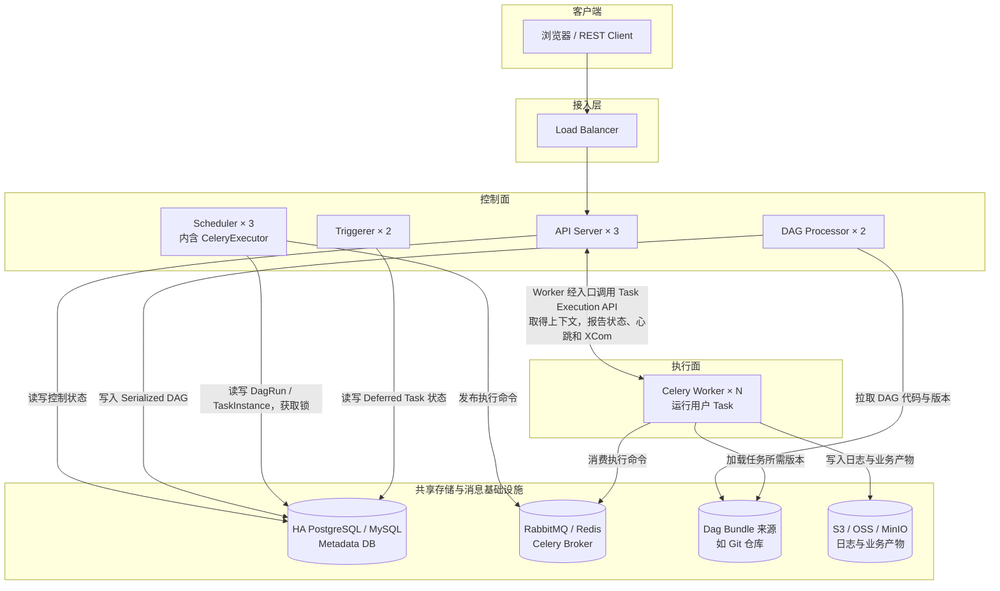

# Airflow 基础与架构：从内容生产 DAG 到三节点集群

Airflow 内容分成四篇：

1. **本文**；

2. [002：调度归属与任务分配](./002_airflow_scheduler_assignment.md)；

3. [003：执行与故障恢复](./003_airflow_execution_recovery.md)；

4. [004：任务投递与数据变化](./004_airflow_task_delivery_data_model.md)。

## 1. 结论先行

Apache Airflow 是一个以 **DAG、数据区间、DagRun 和 TaskInstance** 为中心的数据工作流编排平台。它负责确定某个数据周期应创建哪次运行、哪些任务依赖已经满足、任务交给哪里执行，以及失败后如何重试和补跑。

它最适合：

- 定时 ETL/ELT、报表、数据同步和数仓分层；
- 数据清洗、训练、评估和批量推理等 ML/AI Pipeline；
- 每日或每小时批量采集选题、生成内容、统计运营指标；
- Python、Shell、SQL、Spark、Kubernetes Pod 或外部计算服务组成的任务链；
- 需要按逻辑日期重跑、补数并查看历史批次的流程。

Airflow 3.1 起提供 Human-in-the-Loop Operator，3.3 增加专门的 `awaiting_input` 状态，可以在批次中等待人工输入和审核。但它的主模型仍然是数据 DAG：普通任务失败后从 Task 函数入口重试，不会像 Temporal 一样重放 Workflow Event History 并恢复持久函数状态。

| 维度 | 结论 |
|---|---|
| 项目类型 | 数据工作流编排、批处理调度平台 |
| 基金会 | Apache Software Foundation 顶级项目 |
| CNCF | 不是 CNCF 托管项目；`cncf-kubernetes` 只是 Provider 名称 |
| 许可证 | Apache-2.0 |
| 主要语言 | Python；任务可调用其他语言和外部计算系统 |
| 最强能力 | 周期调度、数据区间、任务依赖、补跑和丰富的 Provider |
| 主要边界 | 不是在线状态机、流处理引擎，也不会自动保证外部副作用 exactly-once |

下面先看架构，再沿一条 TaskInstance 的完整链路解释 DAG 如何进入系统、Scheduler 如何排队、Worker 如何执行；随后用“每日内容生产与人工审核”实例串起核心对象，最后讨论持久化、故障恢复和使用边界。

## 2. 贯穿实例：每日内容生产与人工发布审核

用一条按天运行的数据流水线贯穿后文：

```text
每天 01:00 为前一天的数据区间创建 DagRun
  → 抽取热点和历史运营数据
  → 清洗、去重、生成选题候选
  → 并行生成文案、封面和视频草稿
  → 质量检查与汇总
  → 等待运营人员审核
      ├─ 通过：发布候选内容
      └─ 拒绝：保存原因，不发布
  → 汇总本批次指标
```

这符合 Airflow 的主模型：每个 DagRun 对应明确数据区间，任务依赖稳定，失败步骤可按 TaskInstance 重试，也能补跑过去某一天。人工审核是批次中的一个检查点，而不是不断接收用户消息的长期业务实体。

### 2.1 Airflow 3 DAG 示例

```python
from datetime import timedelta

import pendulum
from airflow.sdk import dag, task
from airflow.providers.standard.operators.hitl import ApprovalOperator


@dag(
    dag_id="daily_media_pipeline",
    schedule="0 1 * * *",
    start_date=pendulum.datetime(2026, 9, 1, tz="Asia/Shanghai"),
    catchup=True,
    max_active_runs=2,
    tags=["media", "agent"],
)
def daily_media_pipeline():
    @task(retries=3, retry_delay=timedelta(minutes=2))
    def collect_and_generate(**context) -> dict:
        interval = {
            "start": context["data_interval_start"].isoformat(),
            "end": context["data_interval_end"].isoformat(),
        }
        return run_generation_job(
            interval,
            idempotency_key=context["run_id"],
        )

    @task
    def publish(result: dict):
        publish_batch(
            manifest_uri=result["manifest_uri"],
            idempotency_key=result["batch_id"],
        )

    generated = collect_and_generate()

    approve = ApprovalOperator(
        task_id="human_review",
        subject="是否发布本批次候选内容？",
        body="候选清单：{{ ti.xcom_pull(task_ids='collect_and_generate')['manifest_uri'] }}",
        defaults="Reject",
        response_timeout=timedelta(hours=24),
        fail_on_reject=True,
    )

    generated >> approve >> publish(generated)


daily_media_pipeline()
```

视频、图片和批量文本应放对象存储或数据仓库。上例只通过 XCom 传递 `manifest_uri`、计数、批次 ID 等小型元数据。

### 2.2 这段代码部署后发生什么

1. DAG 文件进入 Dag Bundle，DAG Processor 解析并写入 Serialized DAG。
2. 数据区间结束后，Scheduler 为该区间创建 `daily_media_pipeline` DagRun。
3. Scheduler 创建并排队 `collect_and_generate` 的 TaskInstance。
4. Worker 执行生成任务，将产物写入对象存储，把 manifest URI 写入 XCom。
5. Scheduler 发现生成成功，将 `human_review` 推进到等待人工输入。
6. 运营人员在 UI 或 REST API 中审批。
7. 通过后，Scheduler 排队 `publish`；拒绝或超时则按 Operator 配置结束。
8. `publish` 使用稳定 `batch_id` 作为幂等键，避免 Worker 故障导致重复发布。

## 3. 三节点架构：控制面、执行面与共享存储

### 3.1 Airflow 3 的核心组件

| 组件 | 职责 | 是否直接执行用户 Task |
|---|---|---:|
| API Server | REST API、Web UI，以及 Worker 使用的 Task Execution API | 否 |
| DAG Processor | 从 Dag Bundle 加载并解析用户 DAG，序列化到 Metadata DB | 只执行 DAG 顶层定义代码，不执行 Task |
| Scheduler | 创建 DagRun、检查依赖，把可运行 TaskInstance 提交给 Executor | 否 |
| Executor | Scheduler 内部的执行策略，决定把 TaskInstance 交给本机、Celery 或 Kubernetes | 自身通常不执行 |
| Worker / Task Pod | 加载对应 DAG 版本，真正执行 Operator 或 TaskFlow 函数 | 是 |
| Triggerer | 在 asyncio 事件循环中等待外部条件，承接 Deferrable Task 的 Trigger | 不运行主要业务 Task |
| Metadata Database | 保存 DAG、DagRun、TaskInstance、XCom、Pool、Connection 等控制状态 | 不适用 |
| Dag Bundle | DAG 代码和相关资源的部署、版本来源 | 不适用 |

最容易混淆的是 Scheduler、Executor 和 Worker：

- Scheduler 决定“哪个 TaskInstance 现在可以运行”；
- Executor 决定“用什么执行后端把它启动起来”；
- Worker 或 Task Pod 才真正运行用户代码。

Executor 是 Scheduler 进程中的插件，不是另一套独立调度中心。

### 3.2 三节点 CeleryExecutor 总体架构

先按职责从上到下看逻辑架构：**客户端 → 接入层 → 控制面 → 执行面 → 共享存储与消息基础设施**。图中的副本数表示服务规模，三台宿主机如何放置这些副本见后面的表格。



连线表示组件访问关系：Scheduler 向 Broker 发布命令，Worker 从 Broker 消费命令；DAG Processor 和 Worker 从底层 Bundle 来源读取代码。Worker 与 API Server 的双向连线表示请求与响应，连接由 Worker 发起，并经过接入层。

三台宿主机可以这样放置：

| 节点 | 控制面 | 执行面 |
|---|---|---|
| Node A | API Server A、Scheduler A、DAG Processor A | Celery Worker A |
| Node B | API Server B、Scheduler B、DAG Processor B、Triggerer A | Celery Worker B |
| Node C | API Server C、Scheduler C、Triggerer B | Celery Worker C |

这只是副本布局，不表示 Scheduler A 只向 Worker A 发任务。Celery Worker 从共享 Broker 消费符合自己 queue 的任务。

三台 Airflow 节点也不等于完整高可用。Metadata DB、Broker、Dag Bundle、远程日志和业务产物存储都必须独立考虑故障。如果 DAG 和日志只存在某台机器的本地盘，这台机器丢失后，其他 Airflow 进程无法完整接管。

### 3.3 四类数据不要混在一起

| 数据 | 保存在哪里 | 示例 |
|---|---|---|
| 编排控制状态 | Metadata DB | DagRun、TaskInstance、Pool、XCom |
| 待执行命令 | Executor 对应后端 | Celery Broker 消息、Kubernetes Pod |
| DAG 代码 | Dag Bundle | Git、本地目录、对象存储 Bundle |
| 业务数据和任务日志 | 外部存储 | 数仓、业务库、S3/OSS/MinIO |

Metadata DB 保存“任务运行到哪里”，不是整个数据湖；Celery Broker 负责投递执行命令，不是 DagRun 的权威状态库；XCom 适合传小型元数据，不适合传视频或大批量数据。

### 3.4 回到示例：内容生产 DAG 怎样经过这张架构图

前面的 `daily_media_pipeline` 会按下面的路径流转：

```text
1. DAG Processor 解析 DAG 文件，把可调度定义保存为 Serialized DAG
2. Scheduler 根据 timetable 创建当天的 DagRun 和 TaskInstance
3. Scheduler 发现 fetch_topics 依赖满足，把它从 SCHEDULED 推进到 QUEUED
4. CeleryExecutor 按 TaskInstance 的 queue 把执行消息发送到 Broker
5. 某个消费该 queue 的 Celery Worker 获得消息并执行 fetch_topics
6. Worker 经 Airflow 运行时接口上报 SUCCESS 或 FAILED
7. Scheduler 再次读取 Metadata DB，发现 generate_script 的上游已经成功
8. Scheduler 用相同方式继续投递 generate_script，直到整个 DagRun 结束
```

对应架构图，只记住下面这些归属与并发结论：

| 问题 | 结论 | 详细原理 |
|---|---|---|
| DagRun、TaskInstance 状态归谁 | Metadata Database 是权威状态库，不归某台 Scheduler 或 Worker 的内存 | [003](./003_airflow_execution_recovery.md) |
| 谁负责发现可运行任务 | 多个 Scheduler 共同调度，通过数据库锁和条件更新临时取得一批调度工作，不永久拥有某个 DAG | [002](./002_airflow_scheduler_assignment.md) |
| 一条 Celery 任务归哪个 Worker | Executor 按 queue 发布，Broker 把消息交给一个消费该 queue 的 Worker；Worker 没有固定 DAG 所有权 | [004](./004_airflow_task_delivery_data_model.md) |
| 怎样并发 | 不同 TaskInstance 可由多个 Worker 并发执行，同时受 DAG 并发、Pool、queue、Worker concurrency 等限制 | [002](./002_airflow_scheduler_assignment.md) |
| 谁推进 DAG | Scheduler 根据 Metadata DB 中的依赖和终态决定哪些下游 TaskInstance 可以进入队列；Worker 只执行单个 TaskInstance | [003](./003_airflow_execution_recovery.md) |

这里不展开 Broker ACK、Worker 消费和每次数据库状态变化，完整时序见 [004](./004_airflow_task_delivery_data_model.md)。

## 4. 从实例理解核心对象

| 抽象 | 含义 | 示例 |
|---|---|---|
| DAG | 有向无环的任务定义 | `daily_media_pipeline` |
| DagRun | DAG 的一次运行 | 处理 2026-09-08 数据的运行 |
| logical date / data interval | 本次运行代表的业务时间与数据窗口 | `[09-08 00:00, 09-09 00:00)` |
| Task | Operator 或 TaskFlow 函数定义 | `collect_and_generate` |
| TaskInstance | 某 Task 在某 DagRun 中的执行实例 | 09-08 批次的生成任务 |
| Operator | 可复用任务模板 | Python、Bash、SQL、KubernetesPod、HITL |
| Sensor / Trigger | 等待外部条件；Trigger 可把等待移出 Worker | 等待对象存储文件到达 |
| XCom | TaskInstance 间的小型元数据 | 产物 URI、数量、质量分数 |
| Asset | 由 URI 标识的数据逻辑对象 | `s3://media/topics/2026-09-08.json` |
| Pool | 一类任务共享的并发额度 | LLM API 同时最多 10 个请求 |
| Executor | TaskInstance 的执行后端策略 | CeleryExecutor、KubernetesExecutor |
| Dag Bundle | DAG 文件及资源的部署和版本单元 | Git 仓库中的工作流目录 |

最容易混淆的是 Task 与 TaskInstance：

```text
Task：DAG 中的定义 generate_candidates
TaskInstance：generate_candidates 在 2026-09-08 这次 DagRun 中的运行实例
Task Try：这个 TaskInstance 的第 1 次、第 2 次执行尝试
```

Airflow 的状态、重试和日志主要围绕 TaskInstance 及其尝试展开，而不是保存 Python 函数每一行的执行历史。

另一个常见误区是 `logical_date`。每日 DagRun 通常在数据区间结束后才创建，因此 UI 看上去像“晚一天”。业务 SQL 应使用 `data_interval_start` 和 `data_interval_end`，不能用任务真正启动时的机器时间推断数据分区。

## 5. UI 与工作流定义方式

Airflow Web UI 是编排运维界面，可以：

- 查看 DAG、Grid、Graph、DagRun 和 TaskInstance；
- 查看日志、XCom、代码、文档和 Asset 关系；
- 搜索运行，手工 Trigger、Retry/Clear、Pause；
- 创建 Backfill；
- 响应 HITL Required Action。

UI 用于观察、操作和排障，不是拖拽式 DAG 设计器。官方工作流定义方式是 Python DAG 或 Task SDK，不是 YAML/JSON DSL。

DAG Processor 会把 DAG 序列化为 JSON，但这是内部调度表示，不应手工编辑成工作流定义。`dag_run.conf` 可以是 JSON，也不表示 Airflow 提供声明式 JSON 工作流。

团队可以读取 YAML/JSON 动态生成 DAG，或使用第三方 DAG Factory，但需要自己承担 Schema 校验、任务 ID 稳定性、解析性能、配置版本和兼容性。

## 6. Worker 能运行哪些任务

任务能力主要由 Core/Standard Provider、第三方 Provider 和自定义 Operator 决定：

| 类型 | 示例 | 适用情况 |
|---|---|---|
| Python / TaskFlow | `@task`、PythonOperator | Python 业务与轻量编排 |
| Shell | BashOperator | CLI、脚本和系统工具 |
| SQL / 数据库 | SQLExecuteQueryOperator | 查询、DDL/DML、存储过程 |
| Sensor | 文件、时间、外部任务、对象存在性 | 等待依赖；优先 deferrable 版本 |
| 大数据 | Spark、Databricks、EMR Provider | 把计算提交给外部引擎 |
| 容器 | DockerOperator、KubernetesPodOperator | 隔离依赖、运行非 Python 程序 |
| 控制流 | Branch、ShortCircuit、Dynamic Mapping | 分支、跳过和按输入展开任务 |
| 人工参与 | HITL、Approval、HITLBranch | 输入、审核和人工分支 |

Operator 往往只是外部系统的提交和观察适配器。不要让 Worker 自己搬运大量视频字节；更合适的是提交 Kubernetes 或转码 Job，只传递任务 ID 和产物 URI。

## 7. 与 Temporal、Conductor 的关键差别

| 问题 | Airflow | Temporal | Conductor |
|---|---|---|---|
| 核心单位 | 数据区间的一次 DagRun / TaskInstance | 一个持久化函数执行 | JSON Workflow/Task 实例 |
| 流程表达 | Python DAG | 确定性 SDK 代码 | JSON 定义和系统任务 |
| 推进者 | Scheduler 读取数据库状态并调和 | History Service 处理事件和内部任务 | Decider/Workflow Executor |
| 故障恢复 | TaskInstance 级重跑 | Event History 重放 Workflow 状态 | 数据库状态 + Queue 重新调度 |
| 任务中途恢复 | 普通 Task 从入口重试，检查点自建 | Workflow 可重放；Activity 仍需幂等 | Worker Task 通常重试，检查点自建 |
| 时间模型 | data interval、catchup、backfill | 持久 Timer、Schedule | Schedule、WAIT |
| 人工参与 | HITL / `awaiting_input` | Signal/Update + 业务 UI | HUMAN Task + 业务 UI |
| 最强场景 | 周期性数据和 ML 批次 | 长生命周期可靠业务执行 | 动态声明式微服务编排 |

## 8. 对 media_agent 的建议

Airflow 适合承担外围批处理：

```text
每日选题采集 → 数据清洗 → 批量生成 → 批量质量评估
每小时平台指标采集 → 汇总 → 报表
每周模型效果回测 → 人工确认 → 更新提示词或模型版本
```

单条内容的交互式生命周期更适合 Temporal 或 Conductor：

```text
创建内容 → 多轮 Agent → 等待第三方生成
         → 人工审核 → 发布或返工
```

若首期只部署一种系统，应按主要负载选择：

- 大量按天/小时运行的批次、数据区间和补数：Airflow；
- 大量独立、长时间等待且需要可靠恢复的业务实例：Temporal；
- 运营人员需要配置声明式流程：Conductor 一类产品。

## 9. 最终评价

理解 Airflow 的关键不是会写 `task1 >> task2`，而是理解这条链路：

```text
DAG 代码
  → DAG Processor 解析
  → Metadata DB 保存定义和运行状态
  → Scheduler 创建 DagRun、判断依赖
  → Executor 提交 TaskInstance
  → Worker 执行并汇报
  → Scheduler 再推进下游
```

Airflow 3.3 的 HITL 已能低成本完成批次审批，而且等待时不占 Worker、Triggerer 或 Pool slot。但这没有改变 Airflow 的数据编排本质。对于 `media_agent`，它适合周期采集、批量生成、质量评估和运营统计；不应独自承担每条内容或每个用户会话的长期在线状态。

## 参考资料

- [Airflow GitHub repository](https://github.com/apache/airflow)
- [Airflow 3 architecture overview](https://airflow.apache.org/docs/apache-airflow/stable/core-concepts/overview.html)
- [Scheduler and HA database locking](https://airflow.apache.org/docs/apache-airflow/stable/concepts/scheduler.html)
- [Executor](https://airflow.apache.org/docs/apache-airflow/stable/core-concepts/executor/index.html)
- [CeleryExecutor](https://airflow.apache.org/docs/apache-airflow-providers-celery/stable/celery_executor.html)
- [KubernetesExecutor](https://airflow.apache.org/docs/apache-airflow-providers-cncf-kubernetes/stable/kubernetes_executor.html)
- [DAGs](https://airflow.apache.org/docs/apache-airflow/stable/core-concepts/dags.html)
- [Dag Runs and catchup](https://airflow.apache.org/docs/apache-airflow/stable/core-concepts/dag-run.html)
- [Backfill](https://airflow.apache.org/docs/apache-airflow/stable/core-concepts/backfill.html)
- [Dag Bundles](https://airflow.apache.org/docs/apache-airflow/stable/administration-and-deployment/dag-bundles.html)
- [Dag Serialization](https://airflow.apache.org/docs/apache-airflow/stable/dag-serialization.html)
- [Tasks and heartbeat timeout](https://airflow.apache.org/docs/apache-airflow/stable/core-concepts/tasks.html)
- [Deferrable Operators and Triggers](https://airflow.apache.org/docs/apache-airflow/stable/authoring-and-scheduling/deferring.html)
- [Human-in-the-Loop tutorial](https://airflow.apache.org/docs/apache-airflow/stable/tutorial/hitl.html)
- [HITL Operator API](https://airflow.apache.org/docs/apache-airflow-providers-standard/stable/_api/airflow/providers/standard/operators/hitl/index.html)
- [Assets](https://airflow.apache.org/docs/apache-airflow/stable/authoring-and-scheduling/assets.html)
- [Metadata database backend](https://airflow.apache.org/docs/apache-airflow/stable/howto/set-up-database.html)
- [XComs](https://airflow.apache.org/docs/apache-airflow/stable/core-concepts/xcoms.html)
- [Task logging](https://airflow.apache.org/docs/apache-airflow/stable/administration-and-deployment/logging-monitoring/logging-tasks.html)
- [Production deployment](https://airflow.apache.org/docs/apache-airflow/stable/administration-and-deployment/production-deployment.html)
