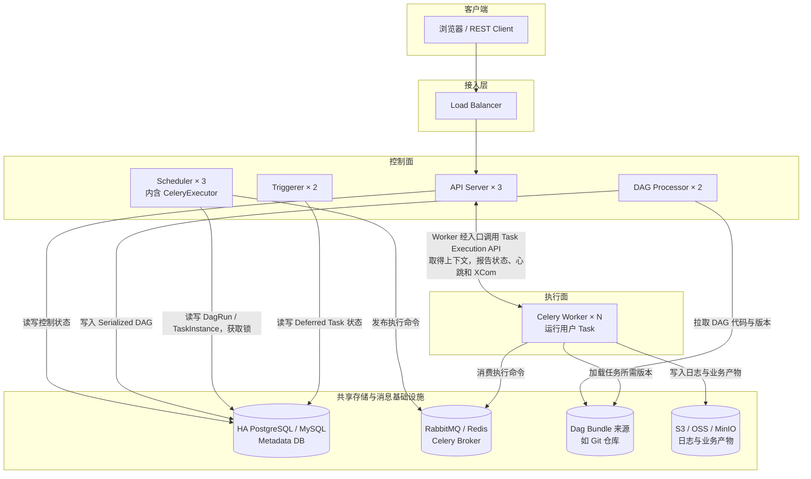
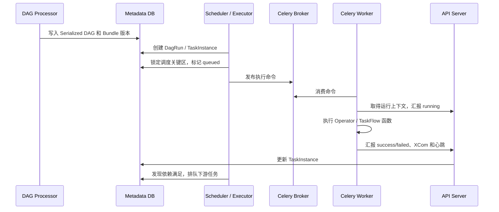
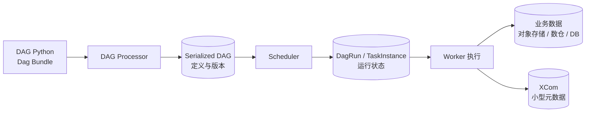

# Apache Airflow 深入调研：DAG 调度、任务执行与故障恢复

调研日期：2026-09-09。调研问题见 [question.md](./question.md)。本文以 Airflow 3.3.x 为基线；Airflow 2.x 的 Webserver、DAG Processor、Worker 数据库访问和 Human-in-the-Loop 行为存在明显差异，不能直接套用本文结论。

## 1. 结论先行

Apache Airflow 是一个以 **DAG、数据区间、DagRun 和 TaskInstance** 为中心的数据工作流编排平台。它负责确定某个数据周期应创建哪次运行、哪些任务依赖已经满足、任务交给哪里执行，以及失败后如何重试和补跑。

它最适合：

- 定时 ETL/ELT、报表、数据同步和数仓分层；
- 数据清洗、训练、评估和批量推理等 ML/AI Pipeline；
- 每日或每小时批量采集选题、生成内容、统计运营指标；
- Python、Shell、SQL、Spark、Kubernetes Pod 或外部计算服务组成的任务链；
- 需要按逻辑日期重跑、补数并查看历史批次的流程。

Airflow 3.1 起提供 Human-in-the-Loop Operator，3.3 增加专门的 `awaiting_input` 状态，可以在批次中等待人工输入和审核。但它的主模型仍然是数据 DAG：普通任务失败后从 Task 函数入口重试，不会像 Temporal 一样重放 Workflow Event History 并恢复持久函数状态。

| 维度 | 结论 |
|---|---|
| 项目类型 | 数据工作流编排、批处理调度平台 |
| 基金会 | Apache Software Foundation 顶级项目 |
| CNCF | 不是 CNCF 托管项目；`cncf-kubernetes` 只是 Provider 名称 |
| 许可证 | Apache-2.0 |
| 主要语言 | Python；任务可调用其他语言和外部计算系统 |
| 最强能力 | 周期调度、数据区间、任务依赖、补跑和丰富的 Provider |
| 主要边界 | 不是在线状态机、流处理引擎，也不会自动保证外部副作用 exactly-once |

下面先看架构，再沿一条 TaskInstance 的完整链路解释 DAG 如何进入系统、Scheduler 如何排队、Worker 如何执行；随后用“每日内容生产与人工审核”实例串起核心对象，最后讨论持久化、故障恢复和使用边界。

## 2. 三节点架构：控制面、执行面与共享存储

### 2.1 Airflow 3 的核心组件

| 组件 | 职责 | 是否直接执行用户 Task |
|---|---|---:|
| API Server | REST API、Web UI，以及 Worker 使用的 Task Execution API | 否 |
| DAG Processor | 从 Dag Bundle 加载并解析用户 DAG，序列化到 Metadata DB | 只执行 DAG 顶层定义代码，不执行 Task |
| Scheduler | 创建 DagRun、检查依赖，把可运行 TaskInstance 提交给 Executor | 否 |
| Executor | Scheduler 内部的执行策略，决定把 TaskInstance 交给本机、Celery 或 Kubernetes | 自身通常不执行 |
| Worker / Task Pod | 加载对应 DAG 版本，真正执行 Operator 或 TaskFlow 函数 | 是 |
| Triggerer | 在 asyncio 事件循环中等待外部条件，承接 Deferrable Task 的 Trigger | 不运行主要业务 Task |
| Metadata Database | 保存 DAG、DagRun、TaskInstance、XCom、Pool、Connection 等控制状态 | 不适用 |
| Dag Bundle | DAG 代码和相关资源的部署、版本来源 | 不适用 |

最容易混淆的是 Scheduler、Executor 和 Worker：

- Scheduler 决定“哪个 TaskInstance 现在可以运行”；
- Executor 决定“用什么执行后端把它启动起来”；
- Worker 或 Task Pod 才真正运行用户代码。

Executor 是 Scheduler 进程中的插件，不是另一套独立调度中心。

### 2.2 三节点 CeleryExecutor 总体架构

先按职责从上到下看逻辑架构：**客户端 → 接入层 → 控制面 → 执行面 → 共享存储与消息基础设施**。图中的副本数表示服务规模，三台宿主机如何放置这些副本见后面的表格。



连线表示组件访问关系：Scheduler 向 Broker 发布命令，Worker 从 Broker 消费命令；DAG Processor 和 Worker 从底层 Bundle 来源读取代码。Worker 与 API Server 的双向连线表示请求与响应，连接由 Worker 发起，并经过接入层。

三台宿主机可以这样放置：

| 节点 | 控制面 | 执行面 |
|---|---|---|
| Node A | API Server A、Scheduler A、DAG Processor A | Celery Worker A |
| Node B | API Server B、Scheduler B、DAG Processor B、Triggerer A | Celery Worker B |
| Node C | API Server C、Scheduler C、Triggerer B | Celery Worker C |

这只是副本布局，不表示 Scheduler A 只向 Worker A 发任务。Celery Worker 从共享 Broker 消费符合自己 queue 的任务。

三台 Airflow 节点也不等于完整高可用。Metadata DB、Broker、Dag Bundle、远程日志和业务产物存储都必须独立考虑故障。如果 DAG 和日志只存在某台机器的本地盘，这台机器丢失后，其他 Airflow 进程无法完整接管。

### 2.3 四类数据不要混在一起

| 数据 | 保存在哪里 | 示例 |
|---|---|---|
| 编排控制状态 | Metadata DB | DagRun、TaskInstance、Pool、XCom |
| 待执行命令 | Executor 对应后端 | Celery Broker 消息、Kubernetes Pod |
| DAG 代码 | Dag Bundle | Git、本地目录、对象存储 Bundle |
| 业务数据和任务日志 | 外部存储 | 数仓、业务库、S3/OSS/MinIO |

Metadata DB 保存“任务运行到哪里”，不是整个数据湖；Celery Broker 负责投递执行命令，不是 DagRun 的权威状态库；XCom 适合传小型元数据，不适合传视频或大批量数据。

## 3. 一条 TaskInstance 是怎样被执行的

### 3.1 第一步：DAG 定义进入 Airflow

开发者用 Python 定义 DAG 和 Task，再把代码发布到 Dag Bundle。DAG Processor 负责：

```text
加载指定 Dag Bundle 版本
  → 执行 Python 文件的顶层 DAG 定义代码
  → 得到 DAG、Task 和依赖关系
  → 序列化为调度所需结构
  → 写入 Metadata DB
```

Scheduler 和 API Server 主要读取 Serialized DAG，不需要反复执行 DAG 作者的顶层代码。Worker 真正运行某个 Task 时，再取得该 DagRun 对应的 Bundle 版本和任务代码。

所以 DAG Python 文件有两个不同执行阶段：

1. **解析阶段**：DAG Processor 执行顶层定义，构造任务图；
2. **任务阶段**：Worker 只执行被选中的 Operator 或 TaskFlow 函数。

不要在 DAG 顶层发 HTTP 请求、扫描大目录或读取大量业务数据，否则每次解析都会产生副作用和性能问题。

### 3.2 第二步：Scheduler 创建 DagRun 和 TaskInstance

Scheduler 根据 Timetable、`start_date`、现有运行和 `catchup` 决定是否创建 DagRun。每个 DagRun 对应一个业务数据区间，不是简单记录“机器几点启动”。

创建 DagRun 后，Scheduler 为其中的 Task 建立 TaskInstance，并持续检查：

- 上游 TaskInstance 是否完成；
- Trigger Rule 是否满足；
- Pool 是否还有 slot；
- DAG、Task 和 DagRun 并发限制；
- 重试时间、开始时间等条件。

条件满足的 TaskInstance 从 `scheduled` 进入 `queued`。多 Scheduler 会在调度关键区使用 Metadata DB 行锁，避免同时占用同一批 Pool slot 或重复排队。

### 3.3 第三步：Executor 把任务交给执行后端

Airflow 没有一种固定的任务队列，提交方式由 Executor 决定：

| Executor | 如何启动 TaskInstance | 是否需要 Celery Broker |
|---|---|---:|
| LocalExecutor | Scheduler 所在机器的本地进程 | 否 |
| CeleryExecutor | 将执行命令发送到 RabbitMQ/Redis，由常驻 Celery Worker 消费 | 是 |
| KubernetesExecutor | 通过 Kubernetes API 为每个 TaskInstance 创建 Pod | 否 |
| 自定义/批处理 Executor | 提交到实现指定的计算后端 | 取决于实现 |

以 CeleryExecutor 为例：



Airflow 3 的任务进程通过 Task Execution API 与控制面交互，不应让用户 Task 代码直接操作 Metadata DB。

### 3.4 谁推动 DAG 进入下一步

不是 Worker 直接启动下游 Task。Worker 只报告当前 TaskInstance 的结果；Scheduler 再读取数据库，判断下游依赖是否满足，然后交给 Executor。

```text
Worker 完成 generate
  → API Server 记录 generate=success
  → Scheduler 发现 review 的上游已成功
  → Scheduler 将 review 排队
  → Executor 启动 review
```

因此，Airflow 的推进方式是 **数据库状态 + Scheduler 调和**。Scheduler 短暂重启不会丢失已经提交的 TaskInstance 状态，新 Scheduler 可以继续扫描并推进。

## 4. 贯穿实例：每日内容生产与人工发布审核

用一条按天运行的数据流水线贯穿后文：

```text
每天 01:00 为前一天的数据区间创建 DagRun
  → 抽取热点和历史运营数据
  → 清洗、去重、生成选题候选
  → 并行生成文案、封面和视频草稿
  → 质量检查与汇总
  → 等待运营人员审核
      ├─ 通过：发布候选内容
      └─ 拒绝：保存原因，不发布
  → 汇总本批次指标
```

这符合 Airflow 的主模型：每个 DagRun 对应明确数据区间，任务依赖稳定，失败步骤可按 TaskInstance 重试，也能补跑过去某一天。人工审核是批次中的一个检查点，而不是不断接收用户消息的长期业务实体。

### 4.1 Airflow 3 DAG 示例

```python
from datetime import timedelta

import pendulum
from airflow.sdk import dag, task
from airflow.providers.standard.operators.hitl import ApprovalOperator


@dag(
    dag_id="daily_media_pipeline",
    schedule="0 1 * * *",
    start_date=pendulum.datetime(2026, 9, 1, tz="Asia/Shanghai"),
    catchup=True,
    max_active_runs=2,
    tags=["media", "agent"],
)
def daily_media_pipeline():
    @task(retries=3, retry_delay=timedelta(minutes=2))
    def collect_and_generate(**context) -> dict:
        interval = {
            "start": context["data_interval_start"].isoformat(),
            "end": context["data_interval_end"].isoformat(),
        }
        return run_generation_job(
            interval,
            idempotency_key=context["run_id"],
        )

    @task
    def publish(result: dict):
        publish_batch(
            manifest_uri=result["manifest_uri"],
            idempotency_key=result["batch_id"],
        )

    generated = collect_and_generate()

    approve = ApprovalOperator(
        task_id="human_review",
        subject="是否发布本批次候选内容？",
        body="候选清单：{{ ti.xcom_pull(task_ids='collect_and_generate')['manifest_uri'] }}",
        defaults="Reject",
        response_timeout=timedelta(hours=24),
        fail_on_reject=True,
    )

    generated >> approve >> publish(generated)


daily_media_pipeline()
```

视频、图片和批量文本应放对象存储或数据仓库。上例只通过 XCom 传递 `manifest_uri`、计数、批次 ID 等小型元数据。

### 4.2 这段代码部署后发生什么

1. DAG 文件进入 Dag Bundle，DAG Processor 解析并写入 Serialized DAG。
2. 数据区间结束后，Scheduler 为该区间创建 `daily_media_pipeline` DagRun。
3. Scheduler 创建并排队 `collect_and_generate` 的 TaskInstance。
4. Worker 执行生成任务，将产物写入对象存储，把 manifest URI 写入 XCom。
5. Scheduler 发现生成成功，将 `human_review` 推进到等待人工输入。
6. 运营人员在 UI 或 REST API 中审批。
7. 通过后，Scheduler 排队 `publish`；拒绝或超时则按 Operator 配置结束。
8. `publish` 使用稳定 `batch_id` 作为幂等键，避免 Worker 故障导致重复发布。

## 5. 从实例理解核心对象

| 抽象 | 含义 | 示例 |
|---|---|---|
| DAG | 有向无环的任务定义 | `daily_media_pipeline` |
| DagRun | DAG 的一次运行 | 处理 2026-09-08 数据的运行 |
| logical date / data interval | 本次运行代表的业务时间与数据窗口 | `[09-08 00:00, 09-09 00:00)` |
| Task | Operator 或 TaskFlow 函数定义 | `collect_and_generate` |
| TaskInstance | 某 Task 在某 DagRun 中的执行实例 | 09-08 批次的生成任务 |
| Operator | 可复用任务模板 | Python、Bash、SQL、KubernetesPod、HITL |
| Sensor / Trigger | 等待外部条件；Trigger 可把等待移出 Worker | 等待对象存储文件到达 |
| XCom | TaskInstance 间的小型元数据 | 产物 URI、数量、质量分数 |
| Asset | 由 URI 标识的数据逻辑对象 | `s3://media/topics/2026-09-08.json` |
| Pool | 一类任务共享的并发额度 | LLM API 同时最多 10 个请求 |
| Executor | TaskInstance 的执行后端策略 | CeleryExecutor、KubernetesExecutor |
| Dag Bundle | DAG 文件及资源的部署和版本单元 | Git 仓库中的工作流目录 |

最容易混淆的是 Task 与 TaskInstance：

```text
Task：DAG 中的定义 generate_candidates
TaskInstance：generate_candidates 在 2026-09-08 这次 DagRun 中的运行实例
Task Try：这个 TaskInstance 的第 1 次、第 2 次执行尝试
```

Airflow 的状态、重试和日志主要围绕 TaskInstance 及其尝试展开，而不是保存 Python 函数每一行的执行历史。

另一个常见误区是 `logical_date`。每日 DagRun 通常在数据区间结束后才创建，因此 UI 看上去像“晚一天”。业务 SQL 应使用 `data_interval_start` 和 `data_interval_end`，不能用任务真正启动时的机器时间推断数据分区。

## 6. DAG 定义、运行状态与业务数据怎样持久化

### 6.1 DAG 定义与运行状态分离

Python 文件是定义；DAG Processor 解析后写入的 Serialized DAG 是调度结构；DagRun 和 TaskInstance 是运行时实体。



TaskInstance 常见状态包括 `none`、`scheduled`、`queued`、`running`、`success`、`failed`、`up_for_retry`、`deferred`、`awaiting_input`、`skipped`、`upstream_failed`。具体状态以部署版本为准。

### 6.2 XCom 不是数据总线

XCom 默认保存在 Metadata DB，适合 URI、行数、分区名、模型版本和质量分数等小值。大对象可使用 Object Storage XCom Backend，但这仍不意味着应该在任务间传递整段视频或大 DataFrame。

一次 Task 重试前，Airflow 会清除该 TaskInstance 前一次尝试写入的 XCom，以支持幂等执行。因此 XCom 也不能当作跨重试检查点。

推荐的数据边界是：

```text
业务数据：对象存储 / 数仓 / 业务数据库
XCom：业务数据的 URI、版本、校验值和统计信息
Metadata DB：编排状态
Remote Logging：任务运行日志
```

### 6.3 Dag Bundle 为什么需要版本

Worker 必须执行与 DagRun 相匹配的 DAG 代码。Airflow 3 的 versioned Dag Bundle 可以让 DagRun 固定到特定 Bundle 版本，避免部署新代码后，旧运行突然使用不同定义。

不能把所有 Bundle 都假设成可版本化。本地目录、S3、GCS 和 Git 等实现的版本能力并不相同，采用前要按具体 Bundle 后端确认。

## 7. Queue 与 Executor：Task 到底排在哪里

“Airflow Queue”需要分三层理解：

1. **Metadata DB 状态队列**：TaskInstance 被标记为 `scheduled`、`queued`；
2. **Executor 提交层**：Scheduler 内的 Executor 选择启动方式；
3. **执行后端**：Celery Broker、本地进程或 Kubernetes Pod。

### 7.1 CeleryExecutor

```text
TaskInstance(queued)
  → CeleryExecutor
  → RabbitMQ / Redis Broker
  → 符合 queue 的 Celery Worker
  → Task Execution API
```

Celery 的 `queue` 是任务路由标签。例如视频任务发到 `video`，只有监听 `video` 的 Worker 消费；它不是 Temporal 那种由服务端持久化和分区的内建 Task Queue。

- Broker 保存待执行命令和 Celery 投递状态；
- Result Backend 保存 Celery 命令执行结果，生产环境通常使用数据库后端；
- DagRun、TaskInstance、XCom 等权威编排状态仍在 Airflow Metadata DB；
- 清理 Metadata DB 不会清理 Redis，清理 Redis 也不会删除 Airflow 历史；
- 运行中直接清空 Broker 可能丢失已排队命令，之后需要 Scheduler 调和。

### 7.2 KubernetesExecutor

KubernetesExecutor 运行在 Scheduler 中，通过 Kubernetes API 为每个 TaskInstance 创建独立 Pod：

```text
Scheduler / KubernetesExecutor
  → Kubernetes API
  → 创建一个 Task Pod
  → Pod 加载 DAG 版本并执行
  → 通过 API Server 汇报结果
  → Pod 退出
```

它不需要 Celery Broker，任务级资源和依赖隔离更强，代价是 Pod 启动延迟、镜像和 Kubernetes 运维成本。

### 7.3 Pool 与 Celery queue 不同

| 机制 | 控制什么 |
|---|---|
| Pool | Scheduler 允许一类 TaskInstance 同时占用多少个 slot |
| Celery queue | Task 命令交给哪一类 Worker |
| Kubernetes 资源配置 | 单个 Task Pod 请求多少 CPU、内存或 GPU |
| DAG/Task 并发参数 | 一个 DAG、DagRun 或 Task 可并发多少实例 |

例如 LLM 调用可以放入 `llm_api` Pool 控制第三方 API 并发，同时发送到 `llm` Celery queue，让装有对应依赖的 Worker 执行。

## 8. 定时、补跑与事件触发

### 8.1 数据区间与 catchup

DAG 可使用 cron、`timedelta`、预设值或自定义 Timetable。Airflow 的 cron 通常表示“为刚结束的数据区间创建一次运行”，不是立即处理当前时刻之后的数据。

`catchup=True` 时，Scheduler 可以为 `start_date` 到当前之间尚未创建的历史区间补建 DagRun；`catchup=False` 通常只从最近区间开始。Backfill 则由用户显式指定起止日期、重处理策略和并发，适合受控补数。

Scheduler 停机后：

- 已存在的 DagRun 和 TaskInstance 仍在 Metadata DB；
- 恢复后继续推进未完成运行；
- 是否为停机期间创建新 DagRun，取决于 catchup、Timetable 和运行限制；
- 服务重启不等于无条件补跑所有错过周期。

### 8.2 Asset 与事件调度

Airflow 3 将旧 Dataset 概念称为 Asset。上游 Task 成功更新某个 Asset 后，可以触发依赖该 Asset 的 DAG，条件支持 AND/OR。AssetWatcher/Trigger 还可以观察外部队列或存储事件。

这扩展了事件驱动能力，但 Airflow 仍不是持续处理每条消息的流处理引擎。Kafka/Flink 负责连续流计算时，Airflow 更适合提交作业、等待结果和按批编排上下游。

## 9. 人工参与怎样建模

### 9.1 Airflow 3.3 HITL

Standard Provider 提供：

| Operator | 作用 |
|---|---|
| `HITLEntryOperator` | 收集字符串、数字等参数 |
| `HITLOperator` | 让用户选择一个或多个选项 |
| `ApprovalOperator` | 审批或拒绝 |
| `HITLBranchOperator` | 根据人工选择进入不同分支 |

HITL 可以设置 subject、body、options、默认值、参数、通知器、响应超时和 `assigned_users`。用户可在 UI 的 Required Actions 页面响应，也可通过 REST API 查询和提交决定。

Airflow 3.3 中 Task 进入由 Scheduler 管理的 `awaiting_input`，等待期间不占 Worker、Triggerer 或 Pool slot；人工响应或 response-timeout sweep 使其继续。这个行为与 3.1/3.2 有版本差异。

### 9.2 能力边界

适合：

- 数据发布前批准；
- 模型评估后决定是否部署；
- AI 生成内容的批次质检；
- 数据异常时选择继续、跳过或终止。

不适合直接当成成熟 BPM 人工任务系统：

- `assigned_users` 不等于候选组、认领、转办、会签和组织规则；
- 复杂表单、业务待办和大量运营用户门户仍需自建；
- 每个订单都启动一个长期 DagRun 并频繁接收外部消息，不是 Airflow 最自然的负载模型。

## 10. UI 与工作流定义方式

Airflow Web UI 是编排运维界面，可以：

- 查看 DAG、Grid、Graph、DagRun 和 TaskInstance；
- 查看日志、XCom、代码、文档和 Asset 关系；
- 搜索运行，手工 Trigger、Retry/Clear、Pause；
- 创建 Backfill；
- 响应 HITL Required Action。

UI 用于观察、操作和排障，不是拖拽式 DAG 设计器。官方工作流定义方式是 Python DAG 或 Task SDK，不是 YAML/JSON DSL。

DAG Processor 会把 DAG 序列化为 JSON，但这是内部调度表示，不应手工编辑成工作流定义。`dag_run.conf` 可以是 JSON，也不表示 Airflow 提供声明式 JSON 工作流。

团队可以读取 YAML/JSON 动态生成 DAG，或使用第三方 DAG Factory，但需要自己承担 Schema 校验、任务 ID 稳定性、解析性能、配置版本和兼容性。

## 11. Worker 能运行哪些任务

任务能力主要由 Core/Standard Provider、第三方 Provider 和自定义 Operator 决定：

| 类型 | 示例 | 适用情况 |
|---|---|---|
| Python / TaskFlow | `@task`、PythonOperator | Python 业务与轻量编排 |
| Shell | BashOperator | CLI、脚本和系统工具 |
| SQL / 数据库 | SQLExecuteQueryOperator | 查询、DDL/DML、存储过程 |
| Sensor | 文件、时间、外部任务、对象存在性 | 等待依赖；优先 deferrable 版本 |
| 大数据 | Spark、Databricks、EMR Provider | 把计算提交给外部引擎 |
| 容器 | DockerOperator、KubernetesPodOperator | 隔离依赖、运行非 Python 程序 |
| 控制流 | Branch、ShortCircuit、Dynamic Mapping | 分支、跳过和按输入展开任务 |
| 人工参与 | HITL、Approval、HITLBranch | 输入、审核和人工分支 |

Operator 往往只是外部系统的提交和观察适配器。不要让 Worker 自己搬运大量视频字节；更合适的是提交 Kubernetes 或转码 Job，只传递任务 ID 和产物 URI。

## 12. 故障、重试与恢复

### 12.1 按故障位置判断从哪里恢复

| 故障位置 | 权威状态 | 恢复方式 |
|---|---|---|
| Scheduler 重启 | Metadata DB | 新 Scheduler 扫描 DagRun/TaskInstance 后继续调度 |
| 一个 Scheduler 节点失效 | Metadata DB + 数据库锁 | 其他 Scheduler 副本继续工作 |
| Worker 接任务前失效 | DB、Executor/Broker 状态 | 由 Executor 和 Scheduler 调和，具体确认语义取决于后端 |
| Worker 执行中失效 | TaskInstance 心跳和状态 | 超时清理后 retry 或 fail |
| Triggerer 失效 | Deferred Task 状态在 DB | 其他 Triggerer 重新承接 Trigger |
| 等待人工输入时重启 | `awaiting_input` 在 DB | Scheduler/API Server 恢复后继续等待 |
| Metadata DB 失效 | 核心状态不可用 | 依赖数据库自身高可用、备份和恢复 |

Airflow 的恢复单位主要是 TaskInstance。一个 Python Task 处理 1000 个文件，在第 900 个崩溃后，默认会从函数入口重新执行，而不是从第 901 个继续。

需要细粒度恢复时，应：

- 使用 Dynamic Task Mapping 把文件分成独立 TaskInstance；
- 在业务存储中保存检查点；
- 让每个分片可幂等重试。

### 12.2 重试由谁发起

Task 可配置 `retries`、`retry_delay`、指数退避、`max_retry_delay` 和 `execution_timeout`。Task 失败后，Worker 上报失败；Scheduler 根据 TaskInstance 状态、剩余次数和下一次重试时间再次排队。

短暂网络错误、HTTP 429 和临时资源不足适合重试；输入格式错误、凭据失效或永久性内容违规应快速失败。生产任务应显式配置策略，不依赖隐含默认值。

### 12.3 外部副作用为什么仍需幂等

如果 `publish()` 已经调用平台成功，但 Worker 在汇报 `success` 前崩溃，Scheduler 可能再次执行该 Task。Airflow 不能证明第三方操作只发生一次。

常见做法：

- 使用 `dag_id + run_id + task_id` 或稳定业务 ID 作为幂等键；
- 目标表按业务分区覆盖或 `MERGE`，不要无条件追加；
- 发布、扣费前按业务键查询已有结果；
- 保存外部 operation ID，必要时补偿或人工核对；
- 使用 data interval 决定业务分区，不用 `datetime.now()`。

### 12.4 多 Scheduler 为什么不会同时排队

HA Scheduler 使用 Metadata DB 行锁协调调度关键区，不额外要求 ZooKeeper、Consul 或 Raft。多个 Scheduler 对 Pool 等记录执行 `SELECT ... FOR UPDATE NOWAIT/SKIP LOCKED` 一类操作，确保全局 Pool 和并发限制。

Celery 使用的 Redis/RabbitMQ 是执行命令 Broker，不是 Scheduler 选主或分布式锁。

## 13. 存储层

### 13.1 Metadata Database

| 数据库 | 定位 |
|---|---|
| PostgreSQL | 生产支持，适合 HA Scheduler，优先选择 |
| MySQL | 生产支持，可用于 HA Scheduler |
| SQLite | 本地开发测试，不用于生产多节点 |
| MariaDB | 官方不支持、不测试 |
| Microsoft SQL Server | 已不再作为受支持 Backend 维护 |

Metadata DB 是 Airflow 的核心状态库。生产环境需要规划高可用、备份/PITR、连接池、Schema 迁移和历史清理。

### 13.2 其他存储

| 层 | 可选实现 | 保存内容 |
|---|---|---|
| Celery Broker | RabbitMQ、Redis、Redis Sentinel | 待执行命令与 Broker 临时状态 |
| Celery Result Backend | 通常使用数据库后端 | Celery 命令结果 |
| XCom | Metadata DB、Object Storage、自定义 Backend | 小型跨 Task 元数据 |
| Remote Log | S3/GCS/Elasticsearch 等 | Task 日志 |
| Dag Bundle | 本地、Git、S3、GCS、扩展 Backend | DAG 代码和资源 |
| 业务数据 | 数仓、对象存储、湖仓、业务 DB | CSV、Parquet、视频、模型和报表 |

## 14. 与 Temporal、Conductor 的关键差别

| 问题 | Airflow | Temporal | Conductor |
|---|---|---|---|
| 核心单位 | 数据区间的一次 DagRun / TaskInstance | 一个持久化函数执行 | JSON Workflow/Task 实例 |
| 流程表达 | Python DAG | 确定性 SDK 代码 | JSON 定义和系统任务 |
| 推进者 | Scheduler 读取数据库状态并调和 | History Service 处理事件和内部任务 | Decider/Workflow Executor |
| 故障恢复 | TaskInstance 级重跑 | Event History 重放 Workflow 状态 | 数据库状态 + Queue 重新调度 |
| 任务中途恢复 | 普通 Task 从入口重试，检查点自建 | Workflow 可重放；Activity 仍需幂等 | Worker Task 通常重试，检查点自建 |
| 时间模型 | data interval、catchup、backfill | 持久 Timer、Schedule | Schedule、WAIT |
| 人工参与 | HITL / `awaiting_input` | Signal/Update + 业务 UI | HUMAN Task + 业务 UI |
| 最强场景 | 周期性数据和 ML 批次 | 长生命周期可靠业务执行 | 动态声明式微服务编排 |

## 15. 对 media_agent 的建议

Airflow 适合承担外围批处理：

```text
每日选题采集 → 数据清洗 → 批量生成 → 批量质量评估
每小时平台指标采集 → 汇总 → 报表
每周模型效果回测 → 人工确认 → 更新提示词或模型版本
```

单条内容的交互式生命周期更适合 Temporal 或 Conductor：

```text
创建内容 → 多轮 Agent → 等待第三方生成
         → 人工审核 → 发布或返工
```

若首期只部署一种系统，应按主要负载选择：

- 大量按天/小时运行的批次、数据区间和补数：Airflow；
- 大量独立、长时间等待且需要可靠恢复的业务实例：Temporal；
- 运营人员需要配置声明式流程：Conductor 一类产品。

## 16. 建议 PoC 与故障实验

1. 建立多 Scheduler 的 CeleryExecutor 环境，使用 PostgreSQL 和 RabbitMQ/Redis。
2. 实现每日媒体 DAG，并加入 `ApprovalOperator`。
3. 使用支持版本的 Dag Bundle，确认旧 DagRun 仍能取得对应代码。
4. 把生成结果写 MinIO/S3，只通过 XCom 传 URI。
5. 杀死一个 Scheduler，确认其他副本继续推进。
6. 在任务执行中杀死 Worker，确认超时后重试，并验证没有重复发布。
7. 在 `awaiting_input` 期间重启 Scheduler/API Server，恢复后继续审批。
8. 停机跨过两个周期，分别验证 `catchup=True` 和 `catchup=False`。
9. 对历史日期执行 Backfill，检查 data interval 和业务分区。
10. 模拟 Broker 故障，观察 Metadata DB 的 `queued` 状态和恢复调和。

## 17. 最终评价

理解 Airflow 的关键不是会写 `task1 >> task2`，而是理解这条链路：

```text
DAG 代码
  → DAG Processor 解析
  → Metadata DB 保存定义和运行状态
  → Scheduler 创建 DagRun、判断依赖
  → Executor 提交 TaskInstance
  → Worker 执行并汇报
  → Scheduler 再推进下游
```

Airflow 3.3 的 HITL 已能低成本完成批次审批，而且等待时不占 Worker、Triggerer 或 Pool slot。但这没有改变 Airflow 的数据编排本质。对于 `media_agent`，它适合周期采集、批量生成、质量评估和运营统计；不应独自承担每条内容或每个用户会话的长期在线状态。

## 参考资料

- [Airflow GitHub repository](https://github.com/apache/airflow)
- [Airflow 3 architecture overview](https://airflow.apache.org/docs/apache-airflow/stable/core-concepts/overview.html)
- [Scheduler and HA database locking](https://airflow.apache.org/docs/apache-airflow/stable/concepts/scheduler.html)
- [Executor](https://airflow.apache.org/docs/apache-airflow/stable/core-concepts/executor/index.html)
- [CeleryExecutor](https://airflow.apache.org/docs/apache-airflow-providers-celery/stable/celery_executor.html)
- [KubernetesExecutor](https://airflow.apache.org/docs/apache-airflow-providers-cncf-kubernetes/stable/kubernetes_executor.html)
- [DAGs](https://airflow.apache.org/docs/apache-airflow/stable/core-concepts/dags.html)
- [Dag Runs and catchup](https://airflow.apache.org/docs/apache-airflow/stable/core-concepts/dag-run.html)
- [Backfill](https://airflow.apache.org/docs/apache-airflow/stable/core-concepts/backfill.html)
- [Dag Bundles](https://airflow.apache.org/docs/apache-airflow/stable/administration-and-deployment/dag-bundles.html)
- [Dag Serialization](https://airflow.apache.org/docs/apache-airflow/stable/dag-serialization.html)
- [Tasks and heartbeat timeout](https://airflow.apache.org/docs/apache-airflow/stable/core-concepts/tasks.html)
- [Deferrable Operators and Triggers](https://airflow.apache.org/docs/apache-airflow/stable/authoring-and-scheduling/deferring.html)
- [Human-in-the-Loop tutorial](https://airflow.apache.org/docs/apache-airflow/stable/tutorial/hitl.html)
- [HITL Operator API](https://airflow.apache.org/docs/apache-airflow-providers-standard/stable/_api/airflow/providers/standard/operators/hitl/index.html)
- [Assets](https://airflow.apache.org/docs/apache-airflow/stable/authoring-and-scheduling/assets.html)
- [Metadata database backend](https://airflow.apache.org/docs/apache-airflow/stable/howto/set-up-database.html)
- [XComs](https://airflow.apache.org/docs/apache-airflow/stable/core-concepts/xcoms.html)
- [Task logging](https://airflow.apache.org/docs/apache-airflow/stable/administration-and-deployment/logging-monitoring/logging-tasks.html)
- [Production deployment](https://airflow.apache.org/docs/apache-airflow/stable/administration-and-deployment/production-deployment.html)
