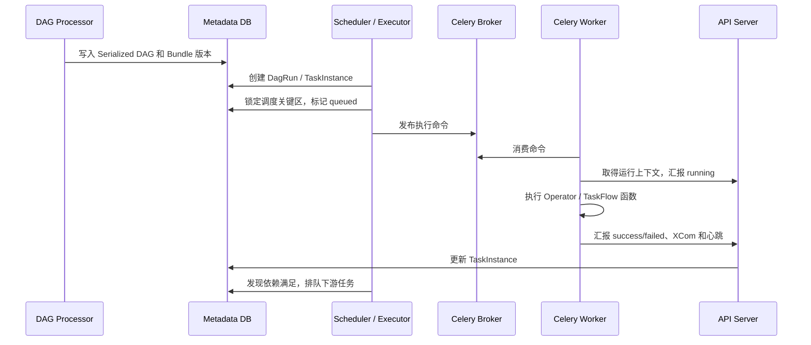
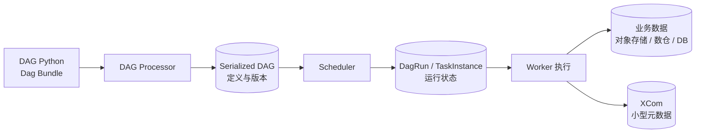

# Airflow 执行流程与故障恢复：TaskInstance、重试、补跑与幂等

Airflow 内容分成四篇：

1. [001：基础与架构](./001_airflow.md)；

2. [002：调度归属与任务分配](./002_airflow_scheduler_assignment.md)；

3. **本文**；

4. [004：任务投递与数据变化](./004_airflow_task_delivery_data_model.md)。

## 1. 一条 TaskInstance 是怎样被执行的

### 1.1 第一步：DAG 定义进入 Airflow

开发者用 Python 定义 DAG 和 Task，再把代码发布到 Dag Bundle。DAG Processor 负责：

```text
加载指定 Dag Bundle 版本
  → 执行 Python 文件的顶层 DAG 定义代码
  → 得到 DAG、Task 和依赖关系
  → 序列化为调度所需结构
  → 写入 Metadata DB
```

Scheduler 和 API Server 主要读取 Serialized DAG，不需要反复执行 DAG 作者的顶层代码。Worker 真正运行某个 Task 时，再取得该 DagRun 对应的 Bundle 版本和任务代码。

所以 DAG Python 文件有两个不同执行阶段：

1. **解析阶段**：DAG Processor 执行顶层定义，构造任务图；
2. **任务阶段**：Worker 只执行被选中的 Operator 或 TaskFlow 函数。

不要在 DAG 顶层发 HTTP 请求、扫描大目录或读取大量业务数据，否则每次解析都会产生副作用和性能问题。

### 1.2 第二步：Scheduler 创建 DagRun 和 TaskInstance

Scheduler 根据 Timetable、`start_date`、现有运行和 `catchup` 决定是否创建 DagRun。每个 DagRun 对应一个业务数据区间，不是简单记录“机器几点启动”。

创建 DagRun 后，Scheduler 为其中的 Task 建立 TaskInstance，并持续检查：

- 上游 TaskInstance 是否完成；
- Trigger Rule 是否满足；
- Pool 是否还有 slot；
- DAG、Task 和 DagRun 并发限制；
- 重试时间、开始时间等条件。

条件满足的 TaskInstance 从 `scheduled` 进入 `queued`。多 Scheduler 会在调度关键区使用 Metadata DB 行锁，避免同时占用同一批 Pool slot 或重复排队。

### 1.3 第三步：Executor 把任务交给执行后端

Airflow 没有一种固定的任务队列，提交方式由 Executor 决定：

| Executor | 如何启动 TaskInstance | 是否需要 Celery Broker |
|---|---|---:|
| LocalExecutor | Scheduler 所在机器的本地进程 | 否 |
| CeleryExecutor | 将执行命令发送到 RabbitMQ/Redis，由常驻 Celery Worker 消费 | 是 |
| KubernetesExecutor | 通过 Kubernetes API 为每个 TaskInstance 创建 Pod | 否 |
| 自定义/批处理 Executor | 提交到实现指定的计算后端 | 取决于实现 |

以 CeleryExecutor 为例：



Airflow 3 的任务进程通过 Task Execution API 与控制面交互，不应让用户 Task 代码直接操作 Metadata DB。

### 1.4 谁推动 DAG 进入下一步

不是 Worker 直接启动下游 Task。Worker 只报告当前 TaskInstance 的结果；Scheduler 再读取数据库，判断下游依赖是否满足，然后交给 Executor。

```text
Worker 完成 generate
  → API Server 记录 generate=success
  → Scheduler 发现 review 的上游已成功
  → Scheduler 将 review 排队
  → Executor 启动 review
```

因此，Airflow 的推进方式是 **数据库状态 + Scheduler 调和**。Scheduler 短暂重启不会丢失已经提交的 TaskInstance 状态，新 Scheduler 可以继续扫描并推进。

## 2. DAG 定义、运行状态与业务数据怎样持久化

### 2.1 DAG 定义与运行状态分离

Python 文件是定义；DAG Processor 解析后写入的 Serialized DAG 是调度结构；DagRun 和 TaskInstance 是运行时实体。



TaskInstance 常见状态包括 `none`、`scheduled`、`queued`、`running`、`success`、`failed`、`up_for_retry`、`deferred`、`awaiting_input`、`skipped`、`upstream_failed`。具体状态以部署版本为准。

### 2.2 XCom 不是数据总线

XCom 默认保存在 Metadata DB，适合 URI、行数、分区名、模型版本和质量分数等小值。大对象可使用 Object Storage XCom Backend，但这仍不意味着应该在任务间传递整段视频或大 DataFrame。

一次 Task 重试前，Airflow 会清除该 TaskInstance 前一次尝试写入的 XCom，以支持幂等执行。因此 XCom 也不能当作跨重试检查点。

推荐的数据边界是：

```text
业务数据：对象存储 / 数仓 / 业务数据库
XCom：业务数据的 URI、版本、校验值和统计信息
Metadata DB：编排状态
Remote Logging：任务运行日志
```

### 2.3 Dag Bundle 为什么需要版本

Worker 必须执行与 DagRun 相匹配的 DAG 代码。Airflow 3 的 versioned Dag Bundle 可以让 DagRun 固定到特定 Bundle 版本，避免部署新代码后，旧运行突然使用不同定义。

不能把所有 Bundle 都假设成可版本化。本地目录、S3、GCS 和 Git 等实现的版本能力并不相同，采用前要按具体 Bundle 后端确认。

## 3. 定时、补跑与事件触发

### 3.1 数据区间与 catchup

DAG 可使用 cron、`timedelta`、预设值或自定义 Timetable。Airflow 的 cron 通常表示“为刚结束的数据区间创建一次运行”，不是立即处理当前时刻之后的数据。

`catchup=True` 时，Scheduler 可以为 `start_date` 到当前之间尚未创建的历史区间补建 DagRun；`catchup=False` 通常只从最近区间开始。Backfill 则由用户显式指定起止日期、重处理策略和并发，适合受控补数。

Scheduler 停机后：

- 已存在的 DagRun 和 TaskInstance 仍在 Metadata DB；
- 恢复后继续推进未完成运行；
- 是否为停机期间创建新 DagRun，取决于 catchup、Timetable 和运行限制；
- 服务重启不等于无条件补跑所有错过周期。

### 3.2 Asset 与事件调度

Airflow 3 将旧 Dataset 概念称为 Asset。上游 Task 成功更新某个 Asset 后，可以触发依赖该 Asset 的 DAG，条件支持 AND/OR。AssetWatcher/Trigger 还可以观察外部队列或存储事件。

这扩展了事件驱动能力，但 Airflow 仍不是持续处理每条消息的流处理引擎。Kafka/Flink 负责连续流计算时，Airflow 更适合提交作业、等待结果和按批编排上下游。

## 4. 人工参与怎样建模

### 4.1 Airflow 3.3 HITL

Standard Provider 提供：

| Operator | 作用 |
|---|---|
| `HITLEntryOperator` | 收集字符串、数字等参数 |
| `HITLOperator` | 让用户选择一个或多个选项 |
| `ApprovalOperator` | 审批或拒绝 |
| `HITLBranchOperator` | 根据人工选择进入不同分支 |

HITL 可以设置 subject、body、options、默认值、参数、通知器、响应超时和 `assigned_users`。用户可在 UI 的 Required Actions 页面响应，也可通过 REST API 查询和提交决定。

Airflow 3.3 中 Task 进入由 Scheduler 管理的 `awaiting_input`，等待期间不占 Worker、Triggerer 或 Pool slot；人工响应或 response-timeout sweep 使其继续。这个行为与 3.1/3.2 有版本差异。

### 4.2 能力边界

适合：

- 数据发布前批准；
- 模型评估后决定是否部署；
- AI 生成内容的批次质检；
- 数据异常时选择继续、跳过或终止。

不适合直接当成成熟 BPM 人工任务系统：

- `assigned_users` 不等于候选组、认领、转办、会签和组织规则；
- 复杂表单、业务待办和大量运营用户门户仍需自建；
- 每个订单都启动一个长期 DagRun 并频繁接收外部消息，不是 Airflow 最自然的负载模型。

## 5. 故障、重试与恢复

### 5.1 按故障位置判断从哪里恢复

| 故障位置 | 权威状态 | 恢复方式 |
|---|---|---|
| Scheduler 重启 | Metadata DB | 新 Scheduler 扫描 DagRun/TaskInstance 后继续调度 |
| 一个 Scheduler 节点失效 | Metadata DB + 数据库锁 | 其他 Scheduler 副本继续工作 |
| Worker 接任务前失效 | DB、Executor/Broker 状态 | 由 Executor 和 Scheduler 调和，具体确认语义取决于后端 |
| Worker 执行中失效 | TaskInstance 心跳和状态 | 超时清理后 retry 或 fail |
| Triggerer 失效 | Deferred Task 状态在 DB | 其他 Triggerer 重新承接 Trigger |
| 等待人工输入时重启 | `awaiting_input` 在 DB | Scheduler/API Server 恢复后继续等待 |
| Metadata DB 失效 | 核心状态不可用 | 依赖数据库自身高可用、备份和恢复 |

Airflow 的恢复单位主要是 TaskInstance。一个 Python Task 处理 1000 个文件，在第 900 个崩溃后，默认会从函数入口重新执行，而不是从第 901 个继续。

需要细粒度恢复时，应：

- 使用 Dynamic Task Mapping 把文件分成独立 TaskInstance；
- 在业务存储中保存检查点；
- 让每个分片可幂等重试。

### 5.2 重试由谁发起

Task 可配置 `retries`、`retry_delay`、指数退避、`max_retry_delay` 和 `execution_timeout`。Task 失败后，Worker 上报失败；Scheduler 根据 TaskInstance 状态、剩余次数和下一次重试时间再次排队。

短暂网络错误、HTTP 429 和临时资源不足适合重试；输入格式错误、凭据失效或永久性内容违规应快速失败。生产任务应显式配置策略，不依赖隐含默认值。

### 5.3 外部副作用为什么仍需幂等

如果 `publish()` 已经调用平台成功，但 Worker 在汇报 `success` 前崩溃，Scheduler 可能再次执行该 Task。Airflow 不能证明第三方操作只发生一次。

常见做法：

- 使用 `dag_id + run_id + task_id` 或稳定业务 ID 作为幂等键；
- 目标表按业务分区覆盖或 `MERGE`，不要无条件追加；
- 发布、扣费前按业务键查询已有结果；
- 保存外部 operation ID，必要时补偿或人工核对；
- 使用 data interval 决定业务分区，不用 `datetime.now()`。


## 6. 存储层

### 6.1 Metadata Database

| 数据库 | 定位 |
|---|---|
| PostgreSQL | 生产支持，适合 HA Scheduler，优先选择 |
| MySQL | 生产支持，可用于 HA Scheduler |
| SQLite | 本地开发测试，不用于生产多节点 |
| MariaDB | 官方不支持、不测试 |
| Microsoft SQL Server | 已不再作为受支持 Backend 维护 |

Metadata DB 是 Airflow 的核心状态库。生产环境需要规划高可用、备份/PITR、连接池、Schema 迁移和历史清理。

### 6.2 其他存储

| 层 | 可选实现 | 保存内容 |
|---|---|---|
| Celery Broker | RabbitMQ、Redis、Redis Sentinel | 待执行命令与 Broker 临时状态 |
| Celery Result Backend | 通常使用数据库后端 | Celery 命令结果 |
| XCom | Metadata DB、Object Storage、自定义 Backend | 小型跨 Task 元数据 |
| Remote Log | S3/GCS/Elasticsearch 等 | Task 日志 |
| Dag Bundle | 本地、Git、S3、GCS、扩展 Backend | DAG 代码和资源 |
| 业务数据 | 数仓、对象存储、湖仓、业务 DB | CSV、Parquet、视频、模型和报表 |

## 7. 建议 PoC 与故障实验

1. 建立多 Scheduler 的 CeleryExecutor 环境，使用 PostgreSQL 和 RabbitMQ/Redis。
2. 实现每日媒体 DAG，并加入 `ApprovalOperator`。
3. 使用支持版本的 Dag Bundle，确认旧 DagRun 仍能取得对应代码。
4. 把生成结果写 MinIO/S3，只通过 XCom 传 URI。
5. 杀死一个 Scheduler，确认其他副本继续推进。
6. 在任务执行中杀死 Worker，确认超时后重试，并验证没有重复发布。
7. 在 `awaiting_input` 期间重启 Scheduler/API Server，恢复后继续审批。
8. 停机跨过两个周期，分别验证 `catchup=True` 和 `catchup=False`。
9. 对历史日期执行 Backfill，检查 data interval 和业务分区。
10. 模拟 Broker 故障，观察 Metadata DB 的 `queued` 状态和恢复调和。
