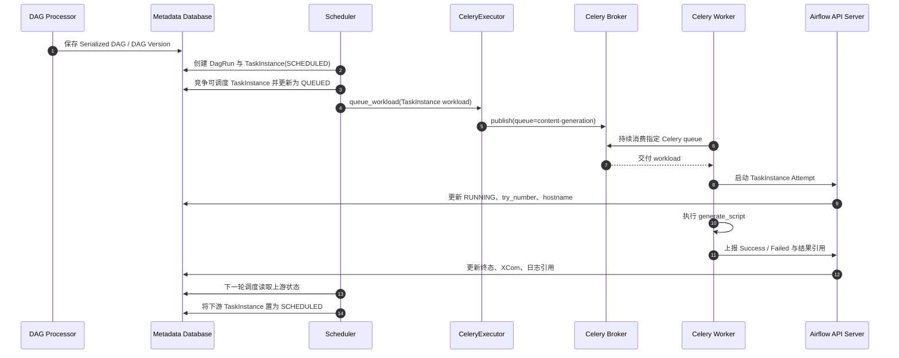

# Airflow 任务投递与状态变化

Airflow 内容分成四篇：

1. [基础与架构](./001_airflow.md);

2. [任务分配与并发控制](./002_airflow_scheduler_assignment.md);

3. [执行与故障恢复](./003_airflow_execution_recovery.md);

4. **任务投递与状态变化（本文）**;

## 1. 先看完整时序图

下面使用 001 中的每日内容生产 DAG，观察其中一个 `generate_script` TaskInstance：



## 2. Worker 与谁保持连接

Celery Worker 不直接长轮询 Scheduler，也不从 Metadata Database 抢普通 TaskInstance。它使用 Celery/Broker 协议连接 Redis 或 RabbitMQ：

```text
Scheduler → CeleryExecutor → Broker ← Celery Worker Consumer
                                      └─ concurrency 执行槽位
```

Worker 通常复用与 Broker 的连接并持续消费消息。连接断开后 Celery 客户端重连；这与 Temporal 的 `PollTaskQueue` 长轮询 RPC 不同，但目的相同：让空闲 Worker 等待可执行任务。

Airflow 3 中任务运行时通过 Task SDK/Execution API 与 API Server 交互；不要把“从 Broker 收到消息”和“直接修改 Metadata Database”当成同一件事。

## 3. Broker 怎样把消息交给 Worker

### 3.1 路由条件

TaskInstance 的 Operator、DAG 默认参数或执行配置可以指定 Celery queue。Executor 发布消息时携带 queue/routing key，Worker 用 `--queues` 等配置声明自己消费哪些队列。

```text
queue=content-generation
  ├─ worker-a consumer
  ├─ worker-b consumer
  └─ worker-c consumer
```

Broker 将一条消息交给其中一个可用 Consumer；Worker 的 concurrency、prefetch/QoS 和 Airflow Pool 共同限制并发。Pool 是 Metadata Database 中的全局调度配额，Celery queue 是 Broker 路由维度，两者不能互相替代。

### 3.2 ACK 不等于 TaskInstance 成功

Broker ACK 只确认消息的消费语义；TaskInstance 是否成功以 Airflow 权威状态为准。Worker 在执行期间崩溃时，消息是否重新投递还受 Celery ACK、Broker visibility timeout 和 Airflow 的孤儿任务检查共同影响。

因此业务代码必须能容忍一次 TaskInstance Attempt 被重新执行，不能仅依赖 Broker 的“一次交付”。

## 4. 沿图看数据模型

### 4.1 关键记录

```yaml
dag_run:
  dag_id: daily_content_pipeline
  run_id: scheduled__2024-10-11T00:00:00+00:00
  logical_date: 2024-10-11T00:00:00+00:00
  data_interval_start: 2024-10-10T00:00:00+00:00
  data_interval_end: 2024-10-11T00:00:00+00:00
  state: running

task_instance:
  dag_id: daily_content_pipeline
  task_id: generate_script
  run_id: scheduled__2024-10-11T00:00:00+00:00
  map_index: -1
  try_number: 1
  state: scheduled
  queue: content-generation
```

DagRun 表示一次数据周期运行；TaskInstance 表示某个 Task 在该运行中的一次逻辑实例。Broker 消息只是执行载体，不是这两类状态的唯一来源。

### 4.2 每一步的请求与状态变化

| 步骤 | 关键输入 | Metadata Database | Broker/后续工作 |
|---|---|---|---|
| DAG 解析 | Bundle、DAG ID、代码版本 | Serialized DAG、DAG Version | Scheduler 可读取新定义 |
| 创建运行 | timetable、logical date、data interval | 新建 RUNNING DagRun；创建 TaskInstance | 依赖检查 |
| 发现可运行任务 | 上游状态、Pool、并发限制 | TaskInstance：SCHEDULED → QUEUED | Executor 发布 workload |
| Broker 路由 | queue、routing key、序列化 workload | TaskInstance 仍是 QUEUED | 消息交给一个 Consumer |
| Worker 开始 | Dag ID、Task ID、Run ID、map index、try number | 更新 RUNNING 与 Attempt 信息 | 占用 Worker 槽位 |
| Worker 完成 | Success/Failure、XCom、日志位置 | 更新终态；写入 XCom/日志引用 | Scheduler 下轮推进下游 |
| Worker 丢失 | heartbeat、超时、作业状态 | Scheduler/运维逻辑识别孤儿状态 | 清理、失败或重新排队 |

## 5. 谁真正推进 DAG

Worker 只运行一个 TaskInstance。Scheduler 周期性读取 Metadata Database，检查依赖、数据区间、Pool 与并发条件，再把下一个 TaskInstance 变成可执行状态。

所以执行闭环是：

```text
Metadata Database 中的状态
  → Scheduler 决定哪些 TaskInstance 可运行
  → Executor/Broker 投递
  → Worker 执行并上报
  → Metadata Database 更新
  → Scheduler 再次判断
```

## 参考资料

详细来源沿用 [001](./001_airflow.md) 的参考资料；Executor、Celery 故障与补跑机制见 [002](./002_airflow_scheduler_assignment.md) 和 [003](./003_airflow_execution_recovery.md)。
