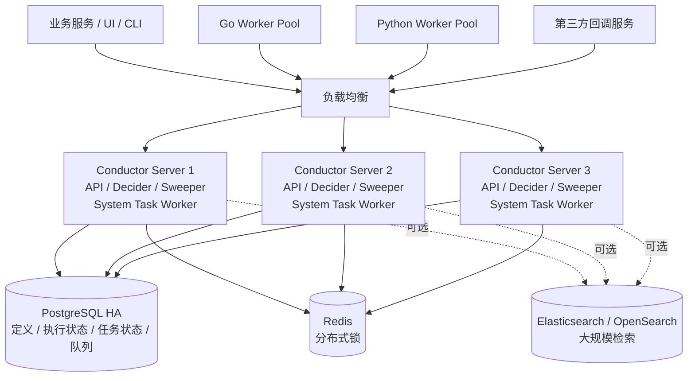

# Conductor OSS 深入调研：声明式微服务与 Agent 工作流编排

调研日期：2026-09-09。调研问题见 [question.md](./question.md)。

## 1. 结论先行

Conductor OSS 是一个以 **JSON 工作流定义、中心化状态机和 Worker 拉取任务** 为核心的分布式工作流编排引擎。它最适合以下场景：

- 一个流程需要调用多个独立微服务，而且这些服务使用不同语言实现；
- 工作流需要在不重新编译业务服务的情况下动态调整顺序、分支和并行关系；
- 流程需要持续数小时或数天，期间等待异步回调、人工审批或外部事件；
- 平台需要保存每个节点的输入、输出、状态和重试记录，并提供可视化运维界面；
- Agent 平台希望把 LLM、MCP 工具、人工确认和普通业务服务组织成一条可审计流程。

它不以数据分区、补数和数据资产为中心，因此不能直接替代 Airflow；也不采用 Temporal 那种确定性 Workflow 代码和事件历史重放模型。Conductor 的主要特点是：**编排逻辑保存在 JSON 定义中，业务逻辑运行在外部 Worker 或服务端内置任务中。**

项目当前由 [`conductor-oss/conductor`](https://github.com/conductor-oss/conductor) 维护，采用 Apache-2.0 许可证。原来的 [`Netflix/conductor`](https://github.com/Netflix/conductor) 已归档，评估维护状态时应以 `conductor-oss` 仓库为准。它不是 CNCF 托管项目。截至本次调研，主仓库约 3.2 万 Star；Star 只能说明开发者关注度，不能直接代表生产部署规模。

## 2. 最适合 Conductor 的示例

以自媒体 Agent 的视频生产流程为例：

```text
接收选题
   ↓
生成文案
   ↓
提交视频生成任务
   ↓
等待生成平台回调
   ↓
人工审核
   ├─ 通过 → 发布视频 → 记录结果
   └─ 拒绝 → 结束流程或重新生成
```

这个例子适合 Conductor，原因是：

1. 文案生成、视频生成、审核和发布可能由不同语言、不同团队或第三方服务实现；
2. 视频生成是长时间异步任务，提交和获取结果之间需要持久化等待；
3. 人工审核可能等待几小时甚至几天；
4. 运营人员可能需要调整节点顺序、增加分支，而不希望重新发布整个后端服务；
5. 平台需要从 UI 中看到任务停在哪个节点，并能重试失败节点。

### 2.1 定义期的核心对象

| 对象 | 含义 | 在示例中的对应物 |
|---|---|---|
| Task Definition | 可复用的 Worker 任务类型及其超时、重试、限流配置 | `generate_copy`、`submit_video`、`publish_video` |
| Workflow Definition | 一个带版本的 JSON 流程蓝图 | “视频生产流程 V1” |
| Task Configuration | 某个任务在当前工作流中的一次引用和输入映射 | 将选题传给 `generate_copy` |
| Workflow Input/Output | 工作流的输入、输出契约 | 产品信息、素材 URI；最终发布结果 |

`Task Definition` 与工作流中的任务配置不是同一个概念。前者定义某类 `SIMPLE` Worker 任务的通用重试、超时和并发规则；后者决定这类任务在某个工作流中的位置、引用名和输入来源。官方的对象关系和 JSON Schema 见 [Schemas](https://conductor-oss.github.io/conductor/documentation/configuration/schemas.html)。

例如，视频提交 Worker 可以注册为：

```json
{
  "name": "submit_video",
  "description": "向视频生成平台提交任务",
  "retryCount": 3,
  "retryLogic": "EXPONENTIAL_BACKOFF",
  "retryDelaySeconds": 5,
  "maxRetryDelaySeconds": 60,
  "responseTimeoutSeconds": 30,
  "timeoutSeconds": 120,
  "timeoutPolicy": "RETRY",
  "ownerEmail": "media-platform@example.com"
}
```

工作流定义则引用这个任务类型：

```json
{
  "name": "media_video_production",
  "description": "生成、审核并发布视频",
  "version": 1,
  "schemaVersion": 2,
  "inputParameters": ["topic", "assets", "operatorId"],
  "tasks": [
    {
      "name": "generate_copy",
      "taskReferenceName": "generate_copy_ref",
      "type": "SIMPLE",
      "inputParameters": {
        "topic": "${workflow.input.topic}",
        "assets": "${workflow.input.assets}"
      }
    },
    {
      "name": "submit_video",
      "taskReferenceName": "submit_video_ref",
      "type": "SIMPLE",
      "inputParameters": {
        "script": "${generate_copy_ref.output.script}",
        "idempotencyKey": "${workflow.workflowId}-submit-video"
      }
    },
    {
      "name": "wait_video_callback",
      "taskReferenceName": "wait_video_callback_ref",
      "type": "WAIT",
      "inputParameters": {
        "externalJobId": "${submit_video_ref.output.externalJobId}"
      }
    },
    {
      "name": "review_video",
      "taskReferenceName": "review_video_ref",
      "type": "HUMAN",
      "inputParameters": {
        "videoUri": "${wait_video_callback_ref.output.videoUri}",
        "operatorId": "${workflow.input.operatorId}"
      }
    },
    {
      "name": "review_decision",
      "taskReferenceName": "review_decision_ref",
      "type": "SWITCH",
      "evaluatorType": "value-param",
      "expression": "reviewResult",
      "inputParameters": {
        "reviewResult": "${review_video_ref.output.result}"
      },
      "decisionCases": {
        "approved": [
          {
            "name": "publish_video",
            "taskReferenceName": "publish_video_ref",
            "type": "SIMPLE",
            "inputParameters": {
              "videoUri": "${wait_video_callback_ref.output.videoUri}",
              "idempotencyKey": "${workflow.workflowId}-publish-video"
            }
          }
        ]
      },
      "defaultCase": [
        {
          "name": "terminate_rejected",
          "taskReferenceName": "terminate_rejected_ref",
          "type": "TERMINATE",
          "inputParameters": {
            "terminationStatus": "COMPLETED",
            "terminationReason": "video rejected"
          }
        }
      ]
    }
  ],
  "outputParameters": {
    "reviewResult": "${review_video_ref.output.result}",
    "publishResult": "${publish_video_ref.output}"
  }
}
```

这段 JSON 用于解释抽象和数据流，实际导入前应使用目标版本的 Schema 或 CLI 做校验，尤其要验证 `HUMAN`、表达式和输出引用在所选 Release 中的字段要求。

### 2.2 运行期的核心对象

| 对象 | 关键标识 | 作用 |
|---|---|---|
| Workflow Execution | `workflowId` | 一次工作流运行，保存定义快照、整体状态、输入输出和任务列表 |
| Task Execution | `taskId` | 一个节点的一次执行，保存输入、输出、状态、Worker、超时与重试关系 |
| Task Queue | Task Type/Name | 保存等待特定 Worker 或系统任务执行器处理的任务 |
| Worker | Worker 标识及其轮询的任务类型 | 执行业务代码，然后向服务端报告 `IN_PROGRESS`、`COMPLETED` 或失败状态 |

一次执行的大致过程如下：

1. 调用方启动 `media_video_production`，Conductor 创建 `workflowId`，保存工作流定义快照和输入；
2. Decider 计算当前可运行的节点，把 `generate_copy` 放入对应任务队列；
3. Python 或 Go Worker 轮询该队列，领取任务后执行文案生成，并回报输出；
4. Conductor 持久化任务结果，再次执行状态决策，调度 `submit_video`；
5. `submit_video` 返回第三方任务 ID，流程进入 `WAIT`；回调服务拿到视频结果后完成等待节点；
6. `HUMAN` 节点保持运行状态，直到审核系统通过 API 提交审核结果；
7. `SWITCH` 根据审核结果选择发布或结束分支；
8. 所有必要节点完成后，Workflow Execution 进入终态。

Conductor 官方把这个运行模型称为 Worker–Task Queue 架构：不同任务类型拥有各自的队列，Worker 通过 HTTP 或 gRPC 轮询任务并回报结果。参见 [Architecture Overview](https://conductor-oss.github.io/conductor/devguide/architecture/index.html)。

## 3. 三节点集群架构

### 3.1 推荐拓扑

下面以三个功能相同的 Conductor Server 节点为例。三个节点都可以接收 API 请求、执行状态决策和运行系统任务；它们共享持久化、队列、索引和分布式锁。



图中的 PostgreSQL、Redis 和可选索引也需要各自的高可用部署。只有三个 Conductor Server，而数据库仍是单节点，并不能构成完整的生产高可用系统。

### 3.2 各组件职责

| 组件 | 职责 | 三节点中的运行方式 |
|---|---|---|
| API Server | 暴露 REST/gRPC，处理定义、启动、查询、任务轮询和状态上报 | 三个节点都提供，由负载均衡分发 |
| Decider | 根据工作流定义和已持久化状态计算下一批任务 | 多节点都可触发；同一工作流决策需要分布式锁防并发 |
| Sweeper | 扫描仍在运行或需要重新评估的工作流，触发 Decider | 多节点运行，保证长流程继续推进 |
| System Task Workers | 执行 HTTP、WAIT、EVENT、JOIN 等内置任务 | 默认在 Server JVM 中运行，也可隔离到专用实例 |
| Event Processor | 消费事件总线消息，启动流程或完成等待任务 | 多节点运行时依赖共享后端和正确配置 |
| Database | 保存定义、Workflow/Task Execution 和事件处理定义等 | 所有节点共享 |
| Queue | 保存待执行、延迟和待 Sweeper 处理的任务 | 所有节点共享，不能使用进程内队列做三节点生产部署 |
| Index | 为 UI 和搜索 API 提供工作流、任务检索 | 可使用 PostgreSQL，也可独立使用 Elasticsearch/OpenSearch |
| Distributed Lock | 防止多个 Decider 同时推进同一个工作流 | 三节点生产部署必须启用 Redis 或 ZooKeeper 锁 |
| External Worker | 执行 `SIMPLE` 任务中的业务代码 | 独立扩缩容，可以使用 Go、Python 或其他语言 |

官方生产部署文档明确把 API Server、Decider、Sweeper、System Task Worker、Event Processor、数据库、队列、索引和锁作为主要组件，并要求多实例生产环境使用分布式锁。参见 [Production Deployment](https://conductor-oss.github.io/conductor/devguide/running/deploy.html)。

### 3.3 为什么节点可以横向扩展

Conductor Server 不应把唯一的工作流真相保存在本机内存。定义、运行状态和任务状态写入共享数据库，待处理任务写入共享队列；因此任一 Server 节点下线后，其他节点仍能读取同一状态并继续决策。

多节点需要特别处理同一工作流被并发决定的问题。如果两个节点同时读取相同状态并各自调度下一任务，就可能生成重复任务。生产环境必须启用分布式执行锁，使同一个 `workflowId` 在一个时刻只有一个有效的状态决策过程。本地锁只适用于单实例开发环境。

## 4. Workflow 抽象与状态持久化

### 4.1 Workflow 是版本化 JSON，而不是可恢复函数

Conductor 的规范表示是 JSON。无论工作流通过 UI、SDK、API 还是文件创建，最终都会变成服务端保存和解释的 JSON 文档。每一个 Workflow Execution 在启动时取得定义快照；后续修改定义不会改变已经运行的实例。多个版本可以同时运行。[JSON + Code Native](https://conductor-oss.github.io/conductor/architecture/json-native.html) 和 [Workflow Versioning](https://conductor-oss.github.io/conductor/devguide/how-tos/Workflows/versioning-workflows.html) 对此有明确说明。

这与 Temporal 的恢复模型不同：

- Conductor 持久化当前 Workflow/Task Execution，并由状态机重新计算下一节点；
- Temporal 主要依据事件历史重放确定性 Workflow 代码以重建状态；
- Conductor Worker 不会通过“重放业务函数”恢复局部变量，节点之间应显式传递 JSON 输入输出或外部数据 URI。

### 4.2 四类存储职责

| 存储职责 | 保存内容 | 可选实现 |
|---|---|---|
| Database / MetadataDAO、ExecutionDAO | Task/Workflow Definition、执行状态、任务状态、事件处理定义 | PostgreSQL、MySQL、Redis、Cassandra、SQLite |
| Queue / QueueDAO | 待执行任务、延迟任务、Sweeper 与系统任务所需队列 | PostgreSQL、Redis、SQLite；扩展接口允许其他实现 |
| Index / IndexDAO | UI 与 API 的工作流、任务检索索引 | PostgreSQL、Elasticsearch 7/8、OpenSearch 2/3、SQLite，或关闭 |
| External Payload Storage | 超过阈值的工作流/任务输入输出 | S3、Azure Blob、PostgreSQL；客户端支持范围需按语言核对 |

生产环境的推荐起点是：

```properties
conductor.db.type=postgres
conductor.queue.type=postgres
conductor.indexing.enabled=true
conductor.indexing.type=postgres
conductor.elasticsearch.version=0

conductor.workflow-execution-lock.type=redis
conductor.app.workflowExecutionLockEnabled=true
conductor.redis-lock.serverAddress=redis://redis-host:6379
```

这个组合用 PostgreSQL 保存状态、队列和搜索索引，只额外使用 Redis 做分布式锁，组件数量较少。MySQL 数据库目前需要搭配独立的 Redis 队列；SQLite 只适合本地开发。需要更强全文检索或更低队列延迟时，可改为 Redis 队列以及 Elasticsearch/OpenSearch 索引。具体支持矩阵和属性见 [部署配置](https://github.com/conductor-oss/conductor/blob/main/docs/devguide/running/deploy.md)。

视频、图片等业务文件不应该直接放入 Workflow/Task 的 JSON 输出。流程中只传 `videoUri`、`assetId` 和校验值，文件本体放对象存储。Conductor 的 External Payload Storage 用于卸载过大的 JSON Payload，也不应被理解成完整的媒体资产管理系统。参见 [External Payload Storage](https://conductor-oss.github.io/conductor/documentation/advanced/externalpayloadstorage.html)。

### 4.3 状态如何推进

Worker 任务的主要状态包括：

```text
SCHEDULED → IN_PROGRESS → COMPLETED
                       ├→ FAILED → 延迟 → 新的重试执行
                       ├→ FAILED_WITH_TERMINAL_ERROR
                       └→ TIMED_OUT → 按策略重试或结束 Workflow
```

此外还有 `CANCELED`、`SKIPPED` 和适用于可选任务的 `COMPLETED_WITH_ERRORS`。每次 Worker 更新任务结果后，服务端先保存 Task Execution，再触发工作流状态决策；Decider 根据定义、已完成任务输出和当前状态，创建下一批任务。任务生命周期见 [Task Lifecycle](https://conductor-oss.github.io/conductor/devguide/architecture/tasklifecycle.html)。

## 5. 异常恢复与重试

### 5.1 自动恢复能力

| 故障 | 能否继续 | 恢复机制 | 限制 |
|---|---|---|---|
| 一个 Conductor Server 节点宕机 | 可以 | 其他节点读取共享状态和队列；Sweeper 重新触发决策 | 需要高可用后端和分布式锁 |
| 三个 Server 全部重启 | 可以 | 定义、运行状态、任务状态和队列保存在外部持久化后端；启动后 Sweeper 继续评估运行实例 | 使用内存或损坏的单节点存储则无法保证 |
| Worker 领取任务后宕机，尚未回报结果 | 可以重试 | `responseTimeoutSeconds` 到期后任务被判定无响应并重新调度 | 可能产生重复执行 |
| Worker 明确报告 `FAILED` | 可以自动重试 | 按 Task Definition 的次数、退避和延迟创建重试 | 超过次数后 Workflow 失败，除非定义了其他处理 |
| Worker 报告 `FAILED_WITH_TERMINAL_ERROR` | 不自动重试 | 直接视为不可重试失败 | 适合参数错误等确定性失败 |
| 流程正在 `WAIT` 或 `HUMAN` | 可以 | 等待节点状态已持久化，收到时间条件、API 完成或外部信号后继续 | 外部事件必须能正确关联 `workflowId`/任务 |
| Workflow 已进入失败终态 | 默认不会自行变回运行 | 通过 UI/API 执行 retry、rerun 或 restart | 这是人工/运维恢复，不是自动恢复 |
| 数据库或队列不可用 | 暂停或失败 | 后端恢复后由队列和 Sweeper 继续处理 | 恢复效果取决于后端持久性与一致性 |

### 5.2 自动重试配置

Task Definition 提供以下关键控制项：

| 参数 | 作用 |
|---|---|
| `retryCount` | 最大重试次数 |
| `retryLogic` | `FIXED`、`EXPONENTIAL_BACKOFF` 或 `LINEAR_BACKOFF` |
| `retryDelaySeconds` | 基础重试间隔 |
| `maxRetryDelaySeconds` | 限制退避后的最大间隔 |
| `backoffJitterMs` | 给重试增加随机抖动，降低惊群 |
| `responseTimeoutSeconds` | Worker 领取后多久不更新视为失联，类似心跳超时 |
| `pollTimeoutSeconds` | 任务长时间无人领取时的超时 |
| `timeoutSeconds` | 单次任务执行的超时/SLA |
| `totalTimeoutSeconds` | 跨所有重试尝试的总时间预算 |
| `timeoutPolicy` | `RETRY`、`TIME_OUT_WF` 或 `ALERT_ONLY` |

详细规则见 [Task Definition](https://conductor-oss.github.io/conductor/documentation/configuration/taskdef.html)。

自动重试并不等于外部副作用只执行一次。考虑下面的故障窗口：

```text
submit_video Worker 调用第三方成功
              ↓
第三方返回 externalJobId
              ↓
Worker 在向 Conductor 上报 COMPLETED 前宕机
              ↓
response timeout 后 Conductor 重新调度 submit_video
```

Conductor 无法知道第三方调用是否成功，因此第二个 Worker 可能再次提交视频。解决方法是把稳定的业务幂等键传给第三方，例如 `workflowId + taskReferenceName` 或业务 Job ID，并在本地数据库建立唯一约束。不要直接依赖某一次重试的 `taskId`，因为新的尝试可能拥有不同执行标识。

### 5.3 Workflow 级人工恢复

在问题修复后，可以选择：

- **Retry**：从最后一个失败任务继续；
- **Rerun**：从指定任务开始，复用前面任务的输出；
- **Restart with current definitions**：从头开始，使用原执行启动时的定义快照；
- **Restart with latest definitions**：从头开始，改用最新定义。

这些操作可通过 UI、CLI 或 API 完成。它们可能再次执行已经产生外部副作用的节点，因此仍要求幂等或补偿机制。参见 [Debugging Workflows](https://conductor-oss.github.io/conductor/devguide/how-tos/Workflows/debugging-workflows.html)。

Workflow Definition 还可以配置失败工作流，在主流程失败后启动补偿流程。例如发布成功但记录结果失败时，补偿流程可以查询发布状态并补写记录；对于无法撤销的外部发布，不应假装回滚成功，而应记录实际状态并转人工处理。

## 6. 定时任务

Conductor OSS 支持 Scheduler。启用 `conductor.scheduler.enabled=true` 后，可以通过 UI、CLI 或 `/api/scheduler` 创建、查询、暂停和恢复 Schedule。Schedule 使用 Quartz 风格的 6 或 7 段 Cron 表达式，例如：

```json
{
  "name": "daily-media-report",
  "cronExpression": "0 0 2 * * ?",
  "startWorkflowRequest": {
    "name": "media_daily_report",
    "version": 1,
    "input": {
      "scope": "yesterday"
    },
    "correlationId": "daily-media-report"
  },
  "scheduleStartTime": 0,
  "scheduleEndTime": 0,
  "paused": false
}
```

Schedule 本质上是在 Cron 时间点启动 Workflow 的触发器。它不是 Airflow 的数据区间或补数模型：

- Schedule 自身没有与 Airflow DagRun 等价的独立执行历史；需要通过生成的 Workflow Execution 查询运行记录；
- 官方资料没有承诺服务停机期间的所有错过时间点都会自动 catchup；
- 对错过的周期进行补跑时，应显式启动对应日期的 Workflow，并把业务日期作为输入；
- 应使用稳定的 `correlationId` 或业务唯一键防止同一周期重复启动。

因此，Conductor 适合“定时触发一个业务流程”，不适合把复杂历史补数、数据分区和数据集依赖作为核心需求。Scheduler 操作见 [Scheduler API](https://conductor-oss.github.io/conductor/documentation/api/index.html)；Cron 示例及补跑说明见 [Schedules](https://conductor-oss.github.io/conductor-skills/skills/conductor/references/schedules.html)。

## 7. UI 与工作流定义方式

### 7.1 Web UI

Conductor UI 支持：

- 在画布中添加和连接任务；
- 在 Code 页签直接编辑完整 JSON；
- 查看 Workflow Definition 和不同版本；
- 查看执行 DAG、每个 Task 的输入、输出、Worker、日志和失败原因；
- 对执行进行 pause、resume、retry、rerun、restart 和 terminate；
- 搜索工作流与任务；
- 创建和管理定时计划。

UI 适合探索、调试和运维。正式环境中建议把 JSON 定义纳入 Git，通过 CLI/API 在 CI/CD 中发布，避免 UI 中的修改脱离版本控制。创建方式见 [Creating Workflows](https://conductor-oss.github.io/conductor/devguide/how-tos/Workflows/creating-workflows.html)。

### 7.2 UI 之外的定义方式

| 方式 | 是否支持 | 说明 |
|---|---|---|
| JSON 文件 | 原生支持 | JSON 是规范运行表示，可由 CLI 或 Metadata API 注册 |
| REST API | 支持 | 注册定义、内联启动动态定义、管理执行 |
| SDK/代码 | 支持 | SDK 最终生成并提交 JSON 定义 |
| CLI | 支持 | 适合在 GitOps/CI 中注册 JSON 文件和启动流程 |
| YAML 文件 | 没有一等规范支持 | 官方运行表示是 JSON；如团队用 YAML，应先转换并做 JSON Schema 校验 |

不要把 Spring Boot 的 YAML/Properties 服务配置与 Workflow Definition 混淆。前者配置 Conductor Server，后者的规范格式是 JSON。

## 8. 支持的工作节点类型

### 8.1 外部 Worker 任务

| 类型 | 执行位置 | 用途 |
|---|---|---|
| `SIMPLE` | 外部 Worker | 任意业务逻辑，例如调用私有服务、爬取数据、转码、发布内容 |

`SIMPLE` 是最重要的扩展点。Conductor 只负责任务分发、状态、超时和重试，具体实现由 Worker 完成。Worker 可以独立部署和扩缩容，也可以按 Task Domain/Isolation Group 把特定任务路由到特定 Worker 池。

### 8.2 通用系统任务

| 类型 | 用途 |
|---|---|
| `HTTP` | 调用 HTTP/REST API |
| `INLINE` | 在服务端执行轻量 JavaScript 或 GraalVM Python 表达式 |
| `EVENT` | 向 Kafka、NATS、AMQP、SQS 或内部队列发布事件 |
| `WAIT` | 等待时间、时长或外部信号 |
| `HUMAN` | 等待人工审批或人工操作结果 |
| `KAFKA_PUBLISH` | 直接发布 Kafka 消息 |
| `JSON_JQ_TRANSFORM` | 使用 jq 转换 JSON |
| `JDBC` | 执行关系数据库查询或更新 |
| `PULL_WORKFLOW_MESSAGES` | 从某个运行中工作流的持久化消息队列取消息 |
| `NOOP` | 占位或合并流程分支 |

### 8.3 流程控制任务

| 类型 | 用途 |
|---|---|
| `FORK_JOIN` | 静态并行分支 |
| `FORK_JOIN_DYNAMIC` | 根据运行时输入动态创建并行分支 |
| `JOIN` | 等待指定并行分支完成并聚合输出 |
| `EXCLUSIVE_JOIN` | 选中的分支中有一个完成后继续 |
| `SWITCH` | 条件分支 |
| `DO_WHILE` | 循环执行一组任务 |
| `SUB_WORKFLOW` | 同步执行子工作流 |
| `START_WORKFLOW` | 异步启动另一个工作流 |
| `SET_VARIABLE` | 设置或修改工作流变量 |
| `TERMINATE` | 以指定状态终止工作流 |
| `DYNAMIC` | 在运行时决定实际任务类型 |

### 8.4 AI、MCP 与 Agent 任务

启用 AI 集成模块并配置相应 Provider 后，还可以使用：

- LLM：`LLM_CHAT_COMPLETE`、`LLM_TEXT_COMPLETE`；
- Embedding/RAG：生成、保存、获取和搜索 Embedding；
- 媒体与文档：`GENERATE_IMAGE`、`GENERATE_AUDIO`、`GENERATE_VIDEO`、`GENERATE_PDF`；
- MCP：`LIST_MCP_TOOLS`、`CALL_MCP_TOOL`；
- A2A/Agent：`GET_AGENT_CARD`、`AGENT`、`CANCEL_AGENT`。

这些任务依赖具体版本的 AI 模块、Provider 和服务器配置，并不意味着安装基础 Conductor Server 后即可直接调用所有模型。完整列表见 [System Tasks](https://conductor-oss.github.io/conductor/documentation/configuration/workflowdef/systemtasks/index.html) 和 [AI Tasks](https://conductor-oss.github.io/conductor/documentation/configuration/workflowdef/systemtasks/ai-tasks.html)。

## 9. 适用场景与不适用场景

### 9.1 适用场景

- 多语言微服务之间的业务编排；
- 需要动态修改、版本化和可视化的流程平台；
- 异步回调、人工审核、延迟等待等长生命周期业务；
- 订单履约、媒体生产、通知、风控、资源开通等服务型流程；
- 需要把 LLM、MCP 工具、人工确认和现有服务组合起来的 Agent 工作流；
- 希望 Worker 与编排引擎独立扩缩容的系统。

### 9.2 不适合作为首选的场景

- 以数据日期、分区、补数、数据资产和血缘为核心：优先评估 Airflow 或 Dagster；
- 任务天然是 Kubernetes Pod，核心需求是容器资源和集群调度：优先评估 Argo Workflows；
- 希望用普通业务代码表达复杂控制流，并依靠确定性重放恢复函数状态：优先评估 Temporal；
- 以 BPMN 标准、组织角色、候选人、会签和复杂人工待办为中心：优先评估 Flowable；
- 只需要简单同步调用几个服务：直接写应用代码通常更简单。

## 10. 针对 media_agent 的判断

Conductor 与当前 `media_workflow` 的领域模型很接近：

| media_workflow | Conductor |
|---|---|
| Workflow | Workflow Definition |
| Workflow Version | Workflow Definition Version / Execution Snapshot |
| Template | Task Definition |
| Step | Task Configuration |
| Job | Workflow Execution |
| StepRun | Task Execution |
| Binding | `inputParameters` 表达式与任务输出引用 |
| Job/Step 状态推进 | Decider + Task Queue + ExecutionDAO |

深入学习 Conductor 的最大收益不是简单替换现有代码，而是用一个成熟实现检查以下设计：

1. 定义、定义版本和执行快照是否明确分离；
2. Job 与 StepRun 的状态转换是否由单一状态机控制；
3. 多实例 Scheduler 如何用分布式锁避免重复创建 StepRun；
4. Worker 领取、心跳、超时、重新入队和重试之间如何衔接；
5. 回调早到、重复到和乱序到达时如何关联等待节点；
6. 节点输入输出是否限制大小，媒体文件是否只传 URI；
7. 手工 retry、rerun、restart 分别复用哪些历史输出；
8. 流程升级是否影响已经运行的 Job。

如果目标是为项目增加用户可配置的多语言 DAG，Conductor 是这几种候选中最值得优先做源码对照和 PoC 的组件。

## 11. 建议的验证实验

使用第 2 节的视频流程，至少完成下面的故障注入：

1. 三个 Conductor 节点运行时杀死一个节点，确认 Workflow 继续推进且没有生成重复 Step；
2. 全部停止后重新启动，确认 `WAIT` 和 `HUMAN` 节点仍在原位置；
3. Worker 调用第三方成功但上报结果前退出，确认任务会重试，并验证业务幂等键阻止重复视频任务；
4. 重复发送两次视频回调，确认只完成目标等待节点一次；
5. 配置固定、线性和指数退避，核对任务尝试记录与实际间隔；
6. 发布 V2 定义后确认正在运行的 V1 实例继续使用启动快照；
7. 分别测试 retry、从指定节点 rerun、使用原定义 restart 和使用最新定义 restart；
8. 停止 Scheduler 跨过一个 Cron 时间点，验证当前版本对错过周期的实际行为，并实现显式补跑；
9. 关闭索引服务，区分搜索能力故障与核心工作流状态推进；
10. 上传大 Payload，验证阈值、外置存储以及非 Java 客户端的实际支持边界。

这些实验完成后，才能判断 Conductor 的恢复语义和运维成本是否满足项目需要；只跑通正常路径不足以完成选型。

## 参考资料

- [Conductor OSS GitHub](https://github.com/conductor-oss/conductor)
- [Architecture Overview](https://conductor-oss.github.io/conductor/devguide/architecture/index.html)
- [Production Deployment](https://conductor-oss.github.io/conductor/devguide/running/deploy.html)
- [Core Concepts](https://conductor-oss.github.io/conductor/devguide/concepts/index.html)
- [Workflow Definition](https://conductor-oss.github.io/conductor/documentation/configuration/workflowdef/index.html)
- [Task Definition](https://conductor-oss.github.io/conductor/documentation/configuration/taskdef.html)
- [Task Lifecycle](https://conductor-oss.github.io/conductor/devguide/architecture/tasklifecycle.html)
- [System Tasks](https://conductor-oss.github.io/conductor/documentation/configuration/workflowdef/systemtasks/index.html)
- [AI Tasks](https://conductor-oss.github.io/conductor/documentation/configuration/workflowdef/systemtasks/ai-tasks.html)
- [Creating Workflows](https://conductor-oss.github.io/conductor/devguide/how-tos/Workflows/creating-workflows.html)
- [Debugging Workflows](https://conductor-oss.github.io/conductor/devguide/how-tos/Workflows/debugging-workflows.html)
- [Managing Workflow Versions](https://conductor-oss.github.io/conductor/devguide/how-tos/Workflows/versioning-workflows.html)
- [External Payload Storage](https://conductor-oss.github.io/conductor/documentation/advanced/externalpayloadstorage.html)
- [Deployment configuration source](https://github.com/conductor-oss/conductor/blob/main/docs/devguide/running/deploy.md)
