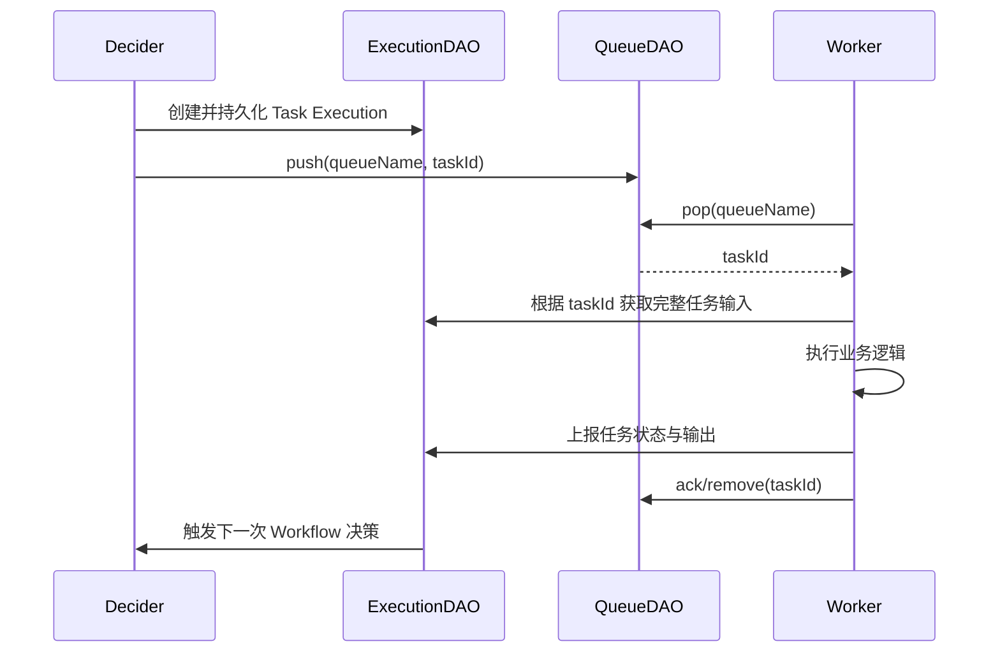

# Conductor OSS 核心抽象：Queue 与 Distributed Lock

调研日期：2026-09-09。本文补充 [011_conductor.md](./011_conductor.md) 中的三节点运行机制，重点回答两个问题：

1. Conductor 的内部任务队列基于什么实现？
2. 多节点 Workflow 执行锁支持哪些后端？

## 1. 结论

Conductor 的内部任务队列不是固定依赖 Kafka、RabbitMQ 或某一种消息中间件。核心代码依赖 `QueueDAO` 接口，部署时再选择 PostgreSQL、Redis 等具体实现。

当前最常见的两种生产组合是：

```text
简单部署：PostgreSQL = 状态存储 + Queue + Index + Distributed Lock

高吞吐部署：PostgreSQL = 状态存储
             Redis      = Queue + Distributed Lock
             OpenSearch = 搜索索引
```

Distributed Lock 也不只支持 Redis 和 ZooKeeper。当前源码明确包含 PostgreSQL 锁实现，通用生产部署文档却没有把它列入锁后端表，二者存在不一致。固定版本部署前，应同时检查目标 Release 的源码、依赖和实际启动结果。

## 2. Queue 在整体执行流程中的位置

### 2.1 Queue 只负责投递，不是任务状态的唯一来源

Conductor 把“任务执行状态”和“待领取消息”分开处理：



Queue 中通常保存的是 `taskId`，完整的 Task Execution 由 `ExecutionDAO` 持久化。因此：

- Queue 丢失会影响任务能否及时被 Worker 领取；
- Execution 数据丢失会导致引擎失去任务状态和输入输出；
- Queue 不能代替 Workflow/Task 状态数据库；
- 搜索索引同样不能代替 ExecutionDAO，它主要服务 UI 和查询 API。

### 2.2 每种任务类型对应独立逻辑队列

Conductor 按任务类型组织队列。例如：

```text
generate_copy
submit_video
publish_video
_deciderQueue
系统任务队列
```

Worker 声明自己负责的任务类型，然后不断轮询对应队列。配置 Task Domain 或 Isolation Group 后，队列名称还会包含执行域信息，从而将同一种任务路由到不同 Worker 池。

例如：

```text
submit_video:default  → 普通视频生成 Worker
submit_video:premium  → 高优先级视频生成 Worker
```

## 3. QueueDAO 抽象

QueueDAO 对上层暴露的主要能力包括：

| 操作 | 作用 |
|---|---|
| `push` | 将消息立即或延迟放入队列 |
| `pushIfNotExists` | 消息不存在时才放入，降低重复入队概率 |
| `pop` / `pollMessages` | 批量领取当前可投递的消息 |
| `ack` | 确认消息已经处理 |
| `remove` | 从队列删除指定消息 |
| `setUnackTimeout` | 设置已领取但未确认消息的再次可见时间 |
| `resetOffsetTime` | 取消延迟，使消息重新可以被领取 |
| `containsMessage` | 检查消息是否仍在队列中 |
| `getSize` / `queuesDetail` | 获取队列积压情况 |
| `flush` | 清空指定队列，属于运维操作 |

这些接口形成了一套类似“可见性超时”的消息模型：Worker 领取任务后，如果没有在规定时间内 ACK，任务可以重新变成可领取状态。因此 Conductor 的 Worker 执行需要按照 **至少一次** 语义设计，外部副作用必须幂等。

## 4. PostgreSQL Queue 的实现

### 4.1 表结构与关键字段

PostgreSQL 实现主要使用 `queue` 和 `queue_message` 表。`queue_message` 中与投递有关的关键字段包括：

| 字段 | 含义 |
|---|---|
| `queue_name` | 逻辑队列名称 |
| `message_id` | 通常是 Task ID 或待决策 Workflow ID |
| `deliver_on` | 消息最早可领取时间，用于延迟任务和重试 |
| `priority` | 消息优先级 |
| `created_on` | 创建时间 |
| `popped` | 是否已经被某个消费者领取但尚未 ACK |
| `payload` | Queue 消息附带的小型 Payload；普通 Worker Task 主要依靠 ID 查状态 |

### 4.2 入队

立即投递时，`deliver_on` 接近当前时间；延迟投递时，Conductor 把偏移量加到当前时间：

```text
deliver_on = current_timestamp + offset
```

任务重试、`callbackAfterSeconds`、WAIT 重新检查和 Sweeper 延迟扫描都可以利用这个能力。

同一个 `queue_name + message_id` 已存在时，PostgreSQL 实现会更新 Payload 和投递时间，而不是无条件插入第二行。数据库唯一约束只能减少 Queue 中的重复消息，不能保证业务调用 exactly-once。

### 4.3 领取任务

PostgreSQL Queue 使用一条事务 SQL 选择并更新消息：

```sql
WITH cte AS (
    SELECT queue_name, message_id
    FROM queue_message
    WHERE queue_name = ?
      AND popped = false
      AND deliver_on <= current_timestamp
    ORDER BY deliver_on, priority DESC, created_on
    LIMIT ?
    FOR UPDATE SKIP LOCKED
)
UPDATE queue_message
SET popped = true
FROM cte
WHERE queue_message.queue_name = cte.queue_name
  AND queue_message.message_id = cte.message_id
RETURNING queue_message.message_id;
```

`FOR UPDATE SKIP LOCKED` 使多个 Conductor 节点或 Worker 可以并发领取任务：

- 一个事务锁住的消息会被其他事务跳过；
- 不需要让所有消费者排队等待同一批行锁；
- 同一次成功领取会原子地把 `popped` 更新为 `true`。

Queue 的顺序是：

```text
deliver_on 升序 → priority 降序 → created_on 升序
```

因此它提供的是“到期时间和优先级驱动的有序领取”，不是跨队列的全局严格 FIFO。

### 4.4 ACK、Unack 与重新投递

任务处理成功后，`ack` 会删除对应 `queue_message`。如果消费者领取任务后宕机，消息会保持 `popped=true`；后台恢复逻辑扫描超过可见性期限而没有 ACK 的消息，将其重新设置为可领取状态。

这会形成下面的故障窗口：

```text
Worker 领取任务
    ↓
调用第三方视频生成 API 成功
    ↓
Worker 尚未 ACK 就宕机
    ↓
Unack 超时
    ↓
另一个 Worker 再次领取同一业务任务
```

因此 `submit_video` 应向第三方传入稳定的业务幂等键，例如：

```text
workflowId + taskReferenceName
```

或者使用媒体平台自己的 Job ID 并建立唯一约束。不要只使用某次执行尝试的 `taskId`，因为重试执行可能生成新的 Task Execution 标识。

### 4.5 LISTEN/NOTIFY 优化

PostgreSQL Queue 默认可以通过轮询读取。当前实现还提供实验性的 Queue Notify 配置：

```properties
conductor.postgres.experimentalQueueNotify=true
conductor.postgres.experimentalQueueNotifyStalePeriod=5000
```

它利用 PostgreSQL 通知机制减少无消息时的数据库查询，但消息本身仍保存在 `queue_message` 表中。通知是唤醒和缓存优化，不是新的事实来源。

源码：[PostgresQueueDAO](https://raw.githubusercontent.com/conductor-oss/conductor/main/postgres-persistence/src/main/java/com/netflix/conductor/postgres/dao/PostgresQueueDAO.java)、[PostgreSQL 配置说明](https://raw.githubusercontent.com/conductor-oss/conductor/main/docs/documentation/advanced/postgresql.md)。

## 5. Redis Queue 的实现

当前 Redis Queue 实现通过 `ConductorQueue` 封装 Redis 操作，主要使用 Sorted Set 表示队列。

### 5.1 Sorted Set

消息在 Sorted Set 中以时间戳等投递信息作为 Score：

```text
Key:    conductor_queues.<stack>.QUEUE.<queueName>.<shard>
Member: messageId
Score:  可领取时间
```

这样可以通过 Score 完成：

- 延迟投递；
- 查询已经到期的任务；
- 更新 unack timeout；
- 把消息推迟到稍后重新检查。

优先级由 `QueueMessage` 和具体 Queue 实现共同处理。读取 Queue 首部时，源码直接使用 `ZRANGEBYSCORE`。

### 5.2 Payload Hash

如果 Queue Message 本身携带 Payload，Redis 实现另外使用 Hash：

```text
Key:   ...QUEUE.<queueName>.<shard>.PAYLOAD
Field: messageId
Value: payload
```

普通 Task Queue 主要保存任务 ID，Workflow 和 Task 的完整状态仍由 ExecutionDAO 管理。

### 5.3 Redis 部署形态

Queue 可根据目标版本配置 Redis Standalone、Cluster 或 Sentinel。Redis Queue 延迟较低，适合大量 Worker 高频轮询；代价是需要额外维护 Redis，并正确配置持久化、故障切换和容量。

源码：[BaseRedisQueueDAO](https://raw.githubusercontent.com/conductor-oss/conductor/main/redis-persistence/src/main/java/io/orkes/conductor/mq/dao/BaseRedisQueueDAO.java)。

## 6. Queue 后端支持范围

| 后端 | 当前状态 | 建议 |
|---|---|---|
| PostgreSQL | 当前生产文档明确支持 | 中小规模及希望减少依赖时优先 |
| Redis | 当前生产文档明确支持 | 高频轮询、高吞吐或已有 Redis 时优先 |
| SQLite | 当前生产文档明确列出，仅限开发 | 单机学习和测试 |
| MySQL | 当前源码包含 `MySQLQueueDAO`，但生产文档没有列入 Queue 支持表 | 不作为默认推荐，固定 Release 后实测 |
| 自定义后端 | `QueueDAO` 接口允许扩展 | 需要自行负责一致性、可见性超时和维护成本 |

Kafka、NATS、RabbitMQ 和 SQS 出现在 Conductor 的 Event Task/Event Handler 集成中，不等于它们默认承担内部 Worker Task Queue。内部 Queue 与外部事件总线需要分开理解。

当前生产支持矩阵见 [Production Deployment](https://github.com/conductor-oss/conductor/blob/main/docs/devguide/running/deploy.md)。

## 7. Distributed Lock 解决什么问题

Queue 的行锁或原子领取只能防止同一条 Queue Message 同时被多个消费者领取，不能完全防止两个 Conductor 节点同时对同一个 Workflow 做状态决策。

例如：

```text
Server A 读取 Workflow：task_1 已完成
Server B 读取 Workflow：task_1 已完成
Server A 决定创建 task_2
Server B 也决定创建 task_2
```

Distributed Lock 以 `workflowId` 为锁粒度，在进入 Decider 的关键区间前加锁：

```text
acquire(workflowId)
    ↓
读取最新 Workflow/Task 状态
    ↓
计算并持久化下一批任务
    ↓
入队
    ↓
release(workflowId)
```

Conductor 的 `Lock` 接口包含：

- 阻塞获取锁；
- 带 `timeToTry` 的限时获取；
- 带 `leaseTime` 的租约锁；
- `releaseLock`；
- `deleteLock`。

接口把锁实现与工作流引擎解耦，理论上可以扩展其他后端；新增实现需要提供 Spring Bean/自动配置，并验证可重入、租约、进程崩溃和网络分区行为。

接口源码：[Lock.java](https://raw.githubusercontent.com/conductor-oss/conductor/main/core/src/main/java/com/netflix/conductor/core/sync/Lock.java)。

## 8. 当前锁实现与文档差异

### 8.1 可以确认的实现

| 类型 | 是否适合多节点 | 证据与说明 |
|---|---:|---|
| `redis` | 是 | 当前源码有 Redis Lock 自动配置；生产部署文档推荐 |
| `postgres` | 是 | 当前源码存在 `PostgresLockDAO`，PostgreSQL 专项文档提供配置 |
| `zookeeper` | 文档称支持 | 当前生产部署页提供配置，但当前主仓库中没有检索到对应实现模块，需要固定 Release 验证发布物 |
| `local_only` | 否 | JVM 本地锁，只适合单实例开发 |
| SQLite 本地实现 | 否 | 用于单机开发，不能作为三节点分布式协调方案 |

通用生产部署页只列出 Redis、ZooKeeper 和 Local；但是当前 PostgreSQL 模块通过下面的条件装配 `PostgresLockDAO`：

```text
conductor.workflow-execution-lock.type=postgres
```

同时，官方 PostgreSQL 专项文档明确写明 PostgreSQL 可以承担 Workflow 管理、Queue、Index 和 Lock。因此，“Distributed Lock 只支持 Redis 或 ZooKeeper”并不准确。

### 8.2 PostgreSQL Lock 工作方式

PostgreSQL Lock 使用 `locks` 表，而不是 PostgreSQL Advisory Lock。核心字段为：

```text
lock_id
lease_expiration
```

获取锁使用近似下面的 SQL：

```sql
INSERT INTO locks(lock_id, lease_expiration)
VALUES (?, now() + lease_time)
ON CONFLICT (lock_id)
DO UPDATE SET lease_expiration = EXCLUDED.lease_expiration
WHERE locks.lease_expiration <= now();
```

结果含义是：

- 锁不存在时创建；
- 锁存在但租约已经过期时接管；
- 锁仍有效时更新条件不成立，获取失败；
- 调用方在 `timeToTry` 内每隔一段时间重试；
- 正常释放时删除对应行。

当前实现还使用 `ThreadLocal` 记录同一线程重复获取相同 `lockId` 的次数，从而提供 JVM 线程范围内的可重入语义。

源码：[PostgresLockDAO](https://raw.githubusercontent.com/conductor-oss/conductor/main/postgres-persistence/src/main/java/com/netflix/conductor/postgres/dao/PostgresLockDAO.java)、[PostgresConfiguration](https://raw.githubusercontent.com/conductor-oss/conductor/main/postgres-persistence/src/main/java/com/netflix/conductor/postgres/config/PostgresConfiguration.java)。

### 8.3 Redis Lock

Redis Lock 适合以下场景：

- 已使用 Redis 作为 Queue；
- 工作流决策并发量较高；
- 不希望锁表进一步增加 PostgreSQL 写入压力。

配置示例：

```properties
conductor.app.workflowExecutionLockEnabled=true
conductor.workflow-execution-lock.type=redis
conductor.app.lockTimeToTry=500
conductor.app.lockLeaseTime=60000

conductor.redis-lock.serverType=SINGLE
conductor.redis-lock.serverAddress=redis://redis-host:6379
conductor.redis-lock.ignoreLockingExceptions=false
```

生产环境应使用 Redis Cluster 或 Sentinel 提供故障切换，并评估锁租约与一次 Workflow 决策最长耗时的关系。租约太短可能在第一个节点仍在执行决策时被第二个节点接管；租约太长则会延迟故障恢复。

### 8.4 ZooKeeper Lock 的版本核验

当前生产部署文档提供：

```properties
conductor.app.workflowExecutionLockEnabled=true
conductor.workflow-execution-lock.type=zookeeper
conductor.zookeeper-lock.connectionString=zk1:2181,zk2:2181,zk3:2181
```

但是在本次调研的 `main` 分支中，没有检索到与 Redis/PostgreSQL 类似的 ZooKeeper Lock 实现模块或 Curator 依赖，只看到文档、配置注释和元数据。可能原因包括：

- 实现由发布包中的外部依赖提供；
- 文档领先于或落后于当前源码；
- 模块在某些 Release 中存在，但当前主分支结构已经变化。

因此不能只依据配置示例判断可用。选择 ZooKeeper 前应固定 Conductor 版本，并执行以下验证：

1. 查看发布包依赖中是否包含对应 Lock Bean；
2. 使用 `type=zookeeper` 启动并检查 Spring 是否成功装配 `Lock`；
3. 同时启动三个 Server，确认同一 Workflow 决策不会重复；
4. 杀死持锁节点，确认会话失效或租约到期后其他节点可以接管。

## 9. 三节点部署选择

### 9.1 学习和中小规模 PoC

```properties
conductor.db.type=postgres
conductor.queue.type=postgres
conductor.indexing.enabled=true
conductor.indexing.type=postgres
conductor.elasticsearch.version=0

conductor.app.workflowExecutionLockEnabled=true
conductor.workflow-execution-lock.type=postgres
```

拓扑为：

```text
3 × Conductor Server
1 × PostgreSQL HA 集群
```

优点是组件少，可以直接观察数据库中的 Workflow、Task、Queue 和 Lock 数据。缺点是高频 Worker 轮询、状态写入、搜索和锁竞争都集中在 PostgreSQL，需要压测连接数、事务冲突和 IOPS。

### 9.2 较高吞吐生产场景

```properties
conductor.db.type=postgres
conductor.queue.type=redis_standalone

conductor.app.workflowExecutionLockEnabled=true
conductor.workflow-execution-lock.type=redis
```

拓扑为：

```text
PostgreSQL HA        → Workflow/Task 状态
Redis Cluster        → Task Queue + Distributed Lock
OpenSearch/ES 可选   → 大规模检索
```

这个组合把高频 Queue 和 Lock 操作从业务状态数据库中移出，基础设施和故障模式也会增加。

## 10. 对 media_workflow 设计的启发

如果在 `media_workflow` 中自行实现类似能力，至少需要分清下面三个对象：

| 对象 | 保存什么 | 解决什么问题 |
|---|---|---|
| StepRun Repository | 节点输入、输出、状态、尝试次数 | 事实状态与审计 |
| Ready Queue | 当前可以执行的 StepRun ID | Worker 分发、延迟和重新投递 |
| Workflow Lock | Workflow/Job ID 的状态机临界区 | 防止多个 Scheduler 重复生成下游 StepRun |

Queue 中出现重复消息不应该直接生成两个业务节点实例。Scheduler 仍需依靠数据库唯一约束、乐观锁或 Workflow Lock，保证类似下面的业务不变量：

```text
同一 Job + Step Key + Attempt 只能对应一个有效 StepRun
```

Worker 侧则需要另外保证：

```text
相同业务幂等键重复执行，不会重复提交视频、重复发布或重复扣费
```

Distributed Lock 只能保护 Conductor 内部的 Workflow 决策临界区，不能替代外部业务系统的幂等设计。

## 参考资料

- [Production Deployment](https://github.com/conductor-oss/conductor/blob/main/docs/devguide/running/deploy.md)
- [QueueDAO](https://github.com/conductor-oss/conductor/blob/main/core/src/main/java/com/netflix/conductor/dao/QueueDAO.java)
- [PostgresQueueDAO](https://raw.githubusercontent.com/conductor-oss/conductor/main/postgres-persistence/src/main/java/com/netflix/conductor/postgres/dao/PostgresQueueDAO.java)
- [BaseRedisQueueDAO](https://raw.githubusercontent.com/conductor-oss/conductor/main/redis-persistence/src/main/java/io/orkes/conductor/mq/dao/BaseRedisQueueDAO.java)
- [MySQLQueueDAO](https://github.com/conductor-oss/conductor/blob/main/mysql-persistence/src/main/java/com/netflix/conductor/mysql/dao/MySQLQueueDAO.java)
- [Lock Interface](https://raw.githubusercontent.com/conductor-oss/conductor/main/core/src/main/java/com/netflix/conductor/core/sync/Lock.java)
- [PostgresLockDAO](https://raw.githubusercontent.com/conductor-oss/conductor/main/postgres-persistence/src/main/java/com/netflix/conductor/postgres/dao/PostgresLockDAO.java)
- [PostgresConfiguration](https://raw.githubusercontent.com/conductor-oss/conductor/main/postgres-persistence/src/main/java/com/netflix/conductor/postgres/config/PostgresConfiguration.java)
- [PostgreSQL Advanced Configuration](https://raw.githubusercontent.com/conductor-oss/conductor/main/docs/documentation/advanced/postgresql.md)
