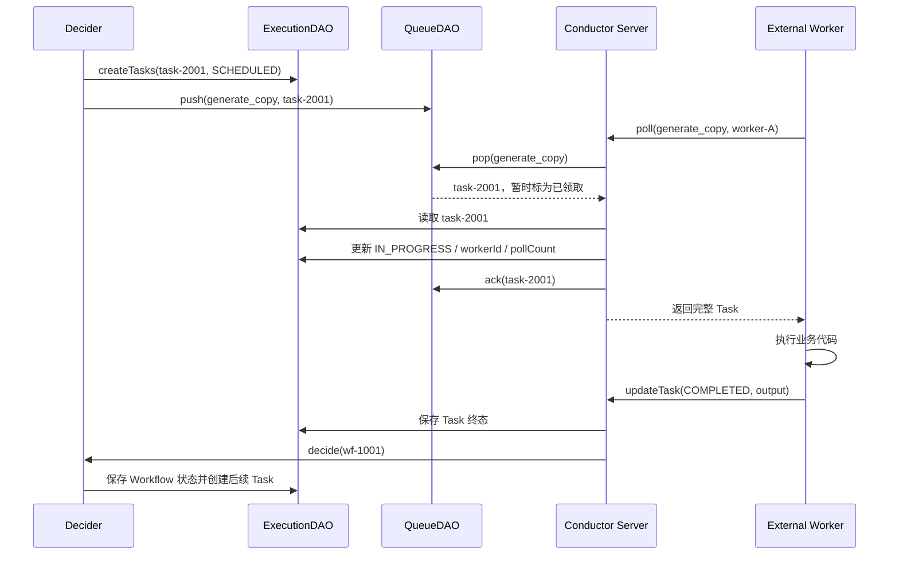

# Conductor 执行流程与故障恢复：Decider、重试与状态恢复

Conductor 内容分成四篇：

1. [第 1 篇](./011_conductor.md)；

2. [第 2 篇](./012_conductor_abs.md)；

3. **本文**；

4. [第 4 篇](./014_conductor_task_delivery_data_model.md)。

## 1. 一次任务怎样形成执行闭环

### 1.4 一个任务从调度到完成的完整链路



Worker 调用的是任务 Poll API，例如：

```http
GET /api/tasks/poll/batch/generate_copy
    ?count=10
    &timeout=1000
    &workerid=worker-A
    &domain=prod
```

官方 SDK 把这段轮询、执行和结果上报封装在 Worker 运行器中，业务通常不需要手写 HTTP 循环。服务端 `ExecutionService.poll` 的关键顺序是：

```text
queueDAO.pop
→ executionDAO.getTask
→ 检查并发限制和频率限制
→ Task 改成 IN_PROGRESS，写入 workerId、pollCount
→ executionDAO.updateTask
→ queueDAO.ack
→ 把 Task 返回给 Worker
```

如果达到 Task Definition 的并发限制或频率限制，Server 不会把任务交给 Worker，而是调用 `postpone`，让它延迟一段时间后重新可见。[Task API](https://conductor-oss.github.io/conductor/documentation/api/task.html)

### 1.5 Queue 的 ack 和 Worker 执行完成不是一回事

这里最容易误解。`queueDAO.ack` 只表示：

```text
Conductor Server 已经把 task-2001 从 QueueDAO 取出，
并且已把 Task Execution 更新为 IN_PROGRESS。
```

它不表示 Worker 的业务任务已经完成。真正完成要等 Worker 调用 `updateTask(COMPLETED)`。

因此存在两个不同的故障恢复边界：

| 故障窗口 | 依靠什么恢复 |
|---|---|
| QueueDAO 已 pop，但 Server 在写入 IN_PROGRESS 或 ack 前宕机 | 未确认消息的可见性超时；PostgreSQL 定期把过期的 `popped=true` 改回可领取 |
| Server 已 ack，但 Worker 没收到响应或执行中宕机 | Task 已是 IN_PROGRESS；由 `responseTimeoutSeconds`、Sweeper 和重试逻辑恢复 |

PostgreSQL QueueDAO 每分钟处理过期的 unacked 消息，批量使用 `FOR UPDATE SKIP LOCKED`，避免多个 Server 的清理线程互相阻塞。Redis QueueDAO 也通过 `ack`、unack timeout 和重新可见机制实现相同的 QueueDAO 契约。[QueueDAO 接口](https://github.com/conductor-oss/conductor/blob/main/core/src/main/java/com/netflix/conductor/dao/QueueDAO.java)

### 1.6 多个 Server 怎样避免重复推进同一个 Workflow

任务领取锁只保护一条队列消息，不能保护整个工作流。例如两个并行任务几乎同时完成：

```text
task-A COMPLETED ─→ Server 1 ─┐
                              ├─ 都准备 decide(wf-1001)
task-B COMPLETED ─→ Server 2 ─┘
```

如果两个 Decider 同时读取旧状态并创建下一节点，可能重复调度。Conductor 为此使用以 `workflowId` 为 Key 的 Execution Lock：

```text
Server 1: acquireLock(wf-1001) 成功
          → 读取完整 Workflow 和 Tasks
          → Decider 计算下一状态
          → 保存状态、创建后续任务
          → releaseLock(wf-1001)

Server 2: acquireLock(wf-1001) 失败
          → 把 wf-1001 重新放入 DECIDER_QUEUE，稍后再试
```

锁的粒度是单个 Workflow Execution，而不是锁住整个 Conductor 集群。因此不同 workflowId 仍可以由不同 Server 并行推进。生产环境应使用 Redis 或 ZooKeeper 分布式锁；`local_only` 只能保护单进程。[生产锁配置](https://github.com/conductor-oss/conductor/blob/main/docs/devguide/running/deploy.md#locking)

源码还会限制一次 `decide` 在锁中的运行时间：接近 `lockLeaseTime` 时停止继续循环，保存当前状态并重新入队，避免在租约过期后仍长时间持有已经失效的逻辑所有权。常用参数是：

```properties
conductor.workflow-execution-lock.type=redis
conductor.app.workflowExecutionLockEnabled=true
conductor.app.lockLeaseTime=60000
conductor.app.lockTimeToTry=500
```

### 1.7 防重复并不是只靠一把锁

Conductor 在不同边界使用不同机制：

| 冲突 | 控制机制 |
|---|---|
| 同一个 Workflow 被多个 Decider 并发推进 | `workflowId` 分布式锁 |
| 两个 Poll 同时领取同一队列消息 | QueueDAO 原子 pop；PostgreSQL 使用 `FOR UPDATE SKIP LOCKED` |
| Decider 在同一次重算中再次生成同一逻辑任务 | 按 `taskReferenceName + retryCount` 去重 |
| 同一个 taskId 被重复放进 Queue | `pushIfNotExists`；PostgreSQL 使用 `queue_name + message_id` 冲突处理 |
| 已经终态的 Task 又收到较晚的结果上报 | 读取到终态后忽略更新并清理残留队列消息 |
| 任务状态已保存但入队失败 | WorkflowRepairService 根据持久化状态补发消息 |

这些机制解决的是 Conductor 内部状态冲突，但不能提供业务副作用的 Exactly Once。

### 1.8 为什么仍然可能重复调用外部系统

考虑最典型的故障窗口：

```text
Worker 调用视频平台成功
→ 视频平台已经创建任务 externalJobId=V9001
→ Worker 向 Conductor 上报 COMPLETED 时网络断开
→ Conductor 没有可靠保存完成结果
→ response timeout 后创建新的重试 Task
→ 另一个 Worker 再次调用视频平台
```

队列没有把同一条消息同时交给两个 Worker，并不代表外部调用只发生一次。为了从故障中恢复，Conductor 的任务执行仍然是 **at-least-once 倾向**：一个逻辑业务动作在异常窗口中可能执行多次。

正确做法是在业务端增加稳定幂等键，例如：

```text
idempotencyKey = workflowId + ":" + taskReferenceName
               = wf-1001:submit_video_ref
```

第三方接口支持幂等键时直接传递；不支持时，在自己的数据库建立唯一约束并保存 `idempotencyKey → externalJobId`。重试 Task 可能获得新的 taskId，所以不要把 taskId 当作跨重试稳定的业务幂等键。

## 2. Workflow 抽象与状态持久化

### 2.1 Workflow 是版本化 JSON，而不是可恢复函数

Conductor 的规范表示是 JSON。无论工作流通过 UI、SDK、API 还是文件创建，最终都会变成服务端保存和解释的 JSON 文档。每一个 Workflow Execution 在启动时取得定义快照；后续修改定义不会改变已经运行的实例。多个版本可以同时运行。[JSON + Code Native](https://conductor-oss.github.io/conductor/architecture/json-native.html) 和 [Workflow Versioning](https://conductor-oss.github.io/conductor/devguide/how-tos/Workflows/versioning-workflows.html) 对此有明确说明。

这与 Temporal 的恢复模型不同：

- Conductor 持久化当前 Workflow/Task Execution，并由状态机重新计算下一节点；
- Temporal 主要依据事件历史重放确定性 Workflow 代码以重建状态；
- Conductor Worker 不会通过“重放业务函数”恢复局部变量，节点之间应显式传递 JSON 输入输出或外部数据 URI。

### 2.2 四类存储职责

| 存储职责 | 保存内容 | 可选实现 |
|---|---|---|
| Database / MetadataDAO、ExecutionDAO | Task/Workflow Definition、执行状态、任务状态、事件处理定义 | PostgreSQL、MySQL、Redis、Cassandra、SQLite |
| Queue / QueueDAO | 待执行任务、延迟任务、Sweeper 与系统任务所需队列 | PostgreSQL、Redis、SQLite；扩展接口允许其他实现 |
| Index / IndexDAO | UI 与 API 的工作流、任务检索索引 | PostgreSQL、Elasticsearch 7/8、OpenSearch 2/3、SQLite，或关闭 |
| External Payload Storage | 超过阈值的工作流/任务输入输出 | S3、Azure Blob、PostgreSQL；客户端支持范围需按语言核对 |

生产环境的推荐起点是：

```properties
conductor.db.type=postgres
conductor.queue.type=postgres
conductor.indexing.enabled=true
conductor.indexing.type=postgres
conductor.elasticsearch.version=0

conductor.workflow-execution-lock.type=redis
conductor.app.workflowExecutionLockEnabled=true
conductor.redis-lock.serverAddress=redis://redis-host:6379
```

这个组合用 PostgreSQL 保存状态、队列和搜索索引，只额外使用 Redis 做分布式锁，组件数量较少。MySQL 数据库目前需要搭配独立的 Redis 队列；SQLite 只适合本地开发。需要更强全文检索或更低队列延迟时，可改为 Redis 队列以及 Elasticsearch/OpenSearch 索引。具体支持矩阵和属性见 [部署配置](https://github.com/conductor-oss/conductor/blob/main/docs/devguide/running/deploy.md)。

视频、图片等业务文件不应该直接放入 Workflow/Task 的 JSON 输出。流程中只传 `videoUri`、`assetId` 和校验值，文件本体放对象存储。Conductor 的 External Payload Storage 用于卸载过大的 JSON Payload，也不应被理解成完整的媒体资产管理系统。参见 [External Payload Storage](https://conductor-oss.github.io/conductor/documentation/advanced/externalpayloadstorage.html)。

### 2.3 状态如何推进

Worker 任务的主要状态包括：

```text
SCHEDULED → IN_PROGRESS → COMPLETED
                       ├→ FAILED → 延迟 → 新的重试执行
                       ├→ FAILED_WITH_TERMINAL_ERROR
                       └→ TIMED_OUT → 按策略重试或结束 Workflow
```

此外还有 `CANCELED`、`SKIPPED` 和适用于可选任务的 `COMPLETED_WITH_ERRORS`。每次 Worker 更新任务结果后，服务端先保存 Task Execution，再触发工作流状态决策；Decider 根据定义、已完成任务输出和当前状态，创建下一批任务。任务生命周期见 [Task Lifecycle](https://conductor-oss.github.io/conductor/devguide/architecture/tasklifecycle.html)。

## 3. 异常恢复与重试

### 3.1 自动恢复能力

| 故障 | 能否继续 | 恢复机制 | 限制 |
|---|---|---|---|
| 一个 Conductor Server 节点宕机 | 可以 | 其他节点读取共享状态和队列；Sweeper 重新触发决策 | 需要高可用后端和分布式锁 |
| 三个 Server 全部重启 | 可以 | 定义、运行状态、任务状态和队列保存在外部持久化后端；启动后 Sweeper 继续评估运行实例 | 使用内存或损坏的单节点存储则无法保证 |
| Worker 领取任务后宕机，尚未回报结果 | 可以重试 | `responseTimeoutSeconds` 到期后任务被判定无响应并重新调度 | 可能产生重复执行 |
| Worker 明确报告 `FAILED` | 可以自动重试 | 按 Task Definition 的次数、退避和延迟创建重试 | 超过次数后 Workflow 失败，除非定义了其他处理 |
| Worker 报告 `FAILED_WITH_TERMINAL_ERROR` | 不自动重试 | 直接视为不可重试失败 | 适合参数错误等确定性失败 |
| 流程正在 `WAIT` 或 `HUMAN` | 可以 | 等待节点状态已持久化，收到时间条件、API 完成或外部信号后继续 | 外部事件必须能正确关联 `workflowId`/任务 |
| Workflow 已进入失败终态 | 默认不会自行变回运行 | 通过 UI/API 执行 retry、rerun 或 restart | 这是人工/运维恢复，不是自动恢复 |
| 数据库或队列不可用 | 暂停或失败 | 后端恢复后由队列和 Sweeper 继续处理 | 恢复效果取决于后端持久性与一致性 |

### 3.2 自动重试配置

Task Definition 提供以下关键控制项：

| 参数 | 作用 |
|---|---|
| `retryCount` | 最大重试次数 |
| `retryLogic` | `FIXED`、`EXPONENTIAL_BACKOFF` 或 `LINEAR_BACKOFF` |
| `retryDelaySeconds` | 基础重试间隔 |
| `maxRetryDelaySeconds` | 限制退避后的最大间隔 |
| `backoffJitterMs` | 给重试增加随机抖动，降低惊群 |
| `responseTimeoutSeconds` | Worker 领取后多久不更新视为失联，类似心跳超时 |
| `pollTimeoutSeconds` | 任务长时间无人领取时的超时 |
| `timeoutSeconds` | 单次任务执行的超时/SLA |
| `totalTimeoutSeconds` | 跨所有重试尝试的总时间预算 |
| `timeoutPolicy` | `RETRY`、`TIME_OUT_WF` 或 `ALERT_ONLY` |

详细规则见 [Task Definition](https://conductor-oss.github.io/conductor/documentation/configuration/taskdef.html)。

自动重试并不等于外部副作用只执行一次。考虑下面的故障窗口：

```text
submit_video Worker 调用第三方成功
              ↓
第三方返回 externalJobId
              ↓
Worker 在向 Conductor 上报 COMPLETED 前宕机
              ↓
response timeout 后 Conductor 重新调度 submit_video
```

Conductor 无法知道第三方调用是否成功，因此第二个 Worker 可能再次提交视频。解决方法是把稳定的业务幂等键传给第三方，例如 `workflowId + taskReferenceName` 或业务 Job ID，并在本地数据库建立唯一约束。不要直接依赖某一次重试的 `taskId`，因为新的尝试可能拥有不同执行标识。

### 3.3 Workflow 级人工恢复

在问题修复后，可以选择：

- **Retry**：从最后一个失败任务继续；
- **Rerun**：从指定任务开始，复用前面任务的输出；
- **Restart with current definitions**：从头开始，使用原执行启动时的定义快照；
- **Restart with latest definitions**：从头开始，改用最新定义。

这些操作可通过 UI、CLI 或 API 完成。它们可能再次执行已经产生外部副作用的节点，因此仍要求幂等或补偿机制。参见 [Debugging Workflows](https://conductor-oss.github.io/conductor/devguide/how-tos/Workflows/debugging-workflows.html)。

Workflow Definition 还可以配置失败工作流，在主流程失败后启动补偿流程。例如发布成功但记录结果失败时，补偿流程可以查询发布状态并补写记录；对于无法撤销的外部发布，不应假装回滚成功，而应记录实际状态并转人工处理。

## 4. 定时任务

Conductor OSS 支持 Scheduler。启用 `conductor.scheduler.enabled=true` 后，可以通过 UI、CLI 或 `/api/scheduler` 创建、查询、暂停和恢复 Schedule。Schedule 使用 Quartz 风格的 6 或 7 段 Cron 表达式，例如：

```json
{
  "name": "daily-media-report",
  "cronExpression": "0 0 2 * * ?",
  "startWorkflowRequest": {
    "name": "media_daily_report",
    "version": 1,
    "input": {
      "scope": "yesterday"
    },
    "correlationId": "daily-media-report"
  },
  "scheduleStartTime": 0,
  "scheduleEndTime": 0,
  "paused": false
}
```

Schedule 本质上是在 Cron 时间点启动 Workflow 的触发器。它不是 Airflow 的数据区间或补数模型：

- Schedule 自身没有与 Airflow DagRun 等价的独立执行历史；需要通过生成的 Workflow Execution 查询运行记录；
- 官方资料没有承诺服务停机期间的所有错过时间点都会自动 catchup；
- 对错过的周期进行补跑时，应显式启动对应日期的 Workflow，并把业务日期作为输入；
- 应使用稳定的 `correlationId` 或业务唯一键防止同一周期重复启动。

因此，Conductor 适合“定时触发一个业务流程”，不适合把复杂历史补数、数据分区和数据集依赖作为核心需求。Scheduler 操作见 [Scheduler API](https://conductor-oss.github.io/conductor/documentation/api/index.html)；Cron 示例及补跑说明见 [Schedules](https://conductor-oss.github.io/conductor-skills/skills/conductor/references/schedules.html)。
