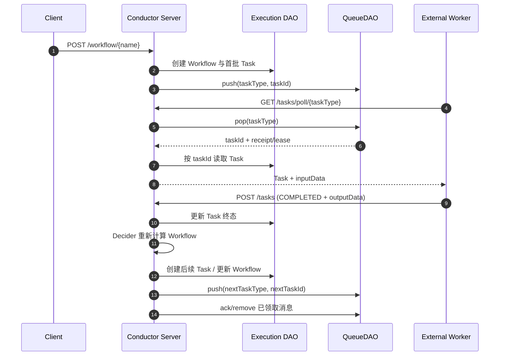

# Conductor 任务投递与数据变化：Worker Poll、QueueDAO 与状态记录

Conductor 内容分成四篇：

1. [011：基础与架构](./011_conductor.md)；
2. [012：Queue、分区与冲突控制](./012_conductor_abs.md)；
3. [013：执行与故障恢复](./013_conductor_execution_recovery.md)；
4. **本文**。

## 1. 完整时序图



## 2. Worker 的长轮询连接谁

External Worker 只调用 Conductor Server 的 HTTP/gRPC API，不直接连接 Redis、PostgreSQL Queue 或其他 QueueDAO 后端：

```text
Worker SDK → Load Balancer → Conductor Server → QueueDAO
```

Worker 按 Task Type 调用 Poll/Batch Poll。没有任务时，Server 可以等待一段时间再返回；Worker SDK 在返回、超时或断线后继续 Poll。Worker 不加入 Server 集群成员协议，也不长期拥有某个队列。

## 3. Task 与 Poll 怎样匹配

Queue 名通常由 Task Type 及 Domain、Isolation Group、Namespace 等属性组合而成。Server 从相应逻辑队列 pop 一个 taskId，再从 Execution DAO 读取完整 Task。

```text
Poll(http_task, domain=video)
  → queue name 路由
  → pop 一个可见 taskId
  → 设置 lease/unack timeout
  → 读取 Task 状态
  → 返回给一个 Worker
```

多个 Worker Poll 同一队列时，QueueDAO 的原子 pop/lease 只让一个 Poll 正常取得本次可见消息。lease 到期未 ACK 时消息可重新可见，因此 Worker 仍可能重复执行；Queue ACK 也不等同于业务 Task 已成功。

## 4. 沿图看数据模型

```yaml
workflow:
  workflowId: wf-video-42
  workflowName: video_pipeline
  status: RUNNING
  version: 3

task:
  taskId: task-script-1
  workflowInstanceId: wf-video-42
  taskType: generate_script
  status: SCHEDULED
  retryCount: 0
  inputData: {topic: temporal}
queue_message:
  queue: generate_script
  payload: task-script-1
  lease: visible
```

| 步骤 | 请求关键参数 | Execution DAO | QueueDAO/后续工作 |
|---|---|---|---|
| 启动 | Workflow Name/Version、Correlation ID、Input | 创建 RUNNING Workflow 与 SCHEDULED Task | push taskId |
| Worker Poll | Task Type、Domain、Worker ID | 按 taskId 读取 Task | pop 并建立 lease |
| Worker 开始 | taskId、callbackAfterSeconds | Task 变为 IN_PROGRESS | 延长或重设可见时间 |
| Worker 完成 | taskId、status、outputData | Task 变终态；Decider 更新 Workflow | ack/remove；push 后续 taskId |
| Worker 丢失 | lease/unack timeout | Task 仍非终态 | 消息重新可见或由修复流程重排 |
| Workflow 完成 | 所有终结任务状态 | Workflow 变 COMPLETED | 清理残留队列消息、更新索引 |

## 5. 谁推进 Workflow

Worker 只上报单个 Task 的结果。Conductor Server 中的 Decider 读取 Workflow 定义和当前 Task 状态，决定创建后续 Task、进入分支、重试或结束。多 Server 对同一 Workflow 的并发决策由锁、条件更新和幂等检查共同约束，详见 [012](./012_conductor_abs.md)。

## 参考资料

详细来源沿用 [011](./011_conductor.md) 与 [012](./012_conductor_abs.md) 的参考资料。

