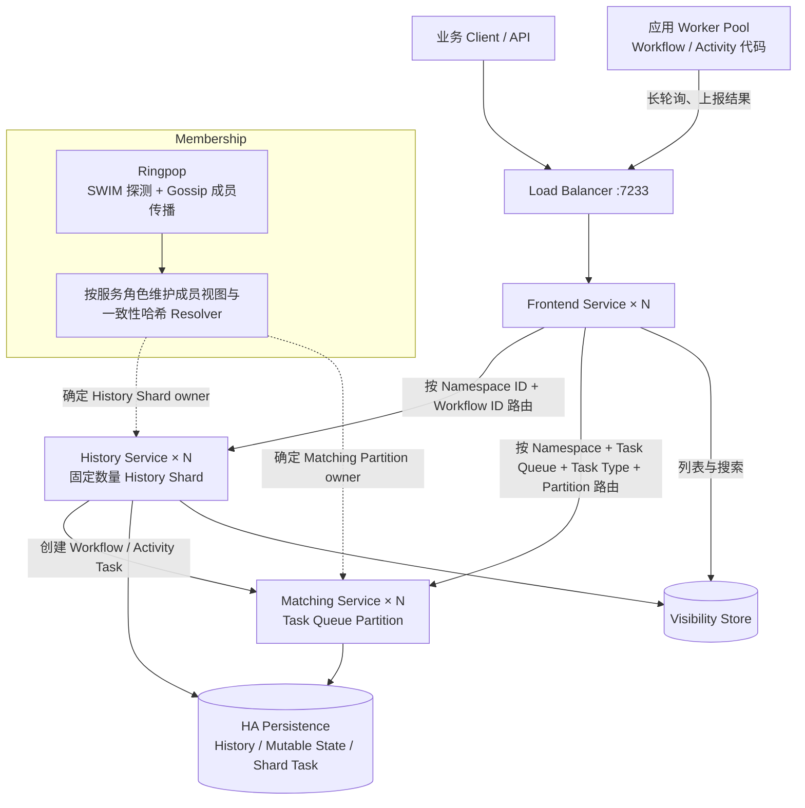

# Temporal 基础与架构

本文讨论开源 Temporal Server 及其 SDK，不包含 Temporal Cloud 的托管能力。

Temporal 内容分成四篇：

1. **基础与架构（本文）**;

2. [任务分配与并发控制](./022_temporal_membership_partition.md);

3. [执行与故障恢复](./023_temporal_execution_recovery.md);

4. [任务投递与状态变化](./024_temporal_task_delivery_data_model.md);

## 1. Temporal 解决什么问题

Temporal 是一个**代码优先的持久执行平台**。开发者用 Go、Java、Python、TypeScript 等语言编写 Workflow，用 Activity 封装 HTTP、数据库、脚本和第三方系统调用。

普通程序把执行进度放在进程内存里，进程退出后通常需要业务代码自己判断从哪里继续。Temporal Server 会保存 Workflow 的 Event History、当前状态和推进执行所需的任务。Worker 或 Server 重启后，流程可以根据已经保存的事实继续运行。

它适合：

- 跨多个服务、必须最终完成或明确失败的订单、支付和资源部署流程；
- 等待数小时或数天的人工审批、异步回调和持久定时器；
- 外部调用容易超时，需要重试、补偿、幂等和故障恢复的长流程；
- 由开发团队使用代码审查、类型系统和自动化测试维护的流程。

它不提供 BPMN 设计器、开箱即用的人工任务收件箱，也没有官方通用 YAML/JSON Workflow DSL。Temporal Web UI 主要用于观察和排障，Workflow 仍由 SDK 代码定义。

| 维度 | 结论 |
|---|---|
| 项目类型 | 持久执行平台、微服务/业务流程编排引擎 |
| 开源协议 | MIT |
| Server 实现 | 主要使用 Go |
| Workflow 定义 | SDK 代码，而不是 JSON/BPMN |
| 核心恢复模型 | Event History + 确定性重放 |
| 核心取舍 | 可靠执行和工程控制力强；业务建模 UI 与人工任务产品能力弱 |

## 2. 最小示例：执行一次 Greeting Workflow

目标是完成下面这个流程：

```text
调用方启动 GreetingWorkflow("Tao")
                 ↓
Workflow 安排 BuildGreeting Activity
                 ↓
Activity 返回 "Hello, Tao"
                 ↓
Workflow 完成
```

最小使用流程只有三步：

```text
编写 Workflow 和 Activity
→ 部署并注册应用 Worker
→ 业务调用方启动 Workflow Execution
```

### 2.1 先分清三个角色

| 角色 | 开发者提供什么 | 运行时职责 |
|---|---|---|
| 业务调用方，例如 HTTP API | 使用 Temporal Client 启动或操作 Workflow | 提交 Workflow Type、输入、Workflow ID 和 Task Queue |
| Temporal Server | 部署或使用已有集群 | 保存执行状态，安排任务，处理 Timer、超时和重试 |
| 应用 Worker | 注册 Workflow 和 Activity 函数，启动 SDK Worker | 主动轮询任务，执行代码并报告 Command 或 Activity 结果 |

Workflow 和 Activity 的业务代码都运行在**应用 Worker** 中。Temporal Server 不会直接执行开发者编写的 Go 函数。

### 2.2 编写 Workflow 和 Activity

下面省略 package 和 import。Workflow 决定执行顺序，Activity 执行真正的业务操作：

```go
func GreetingWorkflow(ctx workflow.Context, name string) (string, error) {
    ctx = workflow.WithActivityOptions(ctx, workflow.ActivityOptions{
        StartToCloseTimeout: time.Minute,
    })

    var result string
    future := workflow.ExecuteActivity(ctx, "BuildGreeting", name)
    err := future.Get(ctx, &result)
    return result, err
}

func BuildGreeting(ctx context.Context, name string) (string, error) {
    return "Hello, " + name, nil
}
```

两种函数的职责不同：

| 函数 | 负责什么 | 能否直接访问外部系统 |
|---|---|---|
| Workflow | 编排步骤、条件、并行、等待和补偿 | 不应直接访问；必须保持可确定性重放 |
| Activity | HTTP、数据库、文件、模型调用等副作用 | 可以，但要考虑重试和幂等 |

`workflow.ExecuteActivity` 不会在当前函数中直接调用 `BuildGreeting`。它产生一个安排 Activity 的 Command，Activity 后续由取得 Activity Task 的 Worker 执行。

### 2.3 启动应用 Worker

Worker 注册自己能够处理的 Workflow Type 和 Activity Type，然后持续轮询 `greeting-tasks`：

```go
w := worker.New(c, "greeting-tasks", worker.Options{})

w.RegisterWorkflowWithOptions(
    GreetingWorkflow,
    workflow.RegisterOptions{Name: "GreetingWorkflow"},
)
w.RegisterActivity(BuildGreeting)

if err := w.Run(worker.InterruptCh()); err != nil {
    return err
}
```

应用 Worker 通常是一个由 systemd、Docker 或 Kubernetes Deployment 管理的长期运行服务。`Run` 启动 SDK 内部的 Workflow Task Poller、Activity Task Poller 和执行协程，然后阻塞等待退出信号。

```text
应用 Worker 进程
  ├─ Workflow Task Poller：轮询 greeting-tasks
  ├─ Activity Task Poller：轮询 greeting-tasks
  ├─ Workflow 执行槽位
  └─ Activity 执行槽位
```

注册发生在 Worker 进程的内存中，不会把 Go 函数上传到 Temporal Server：

```text
Workflow 注册表
  "GreetingWorkflow" → GreetingWorkflow 函数

Activity 注册表
  "BuildGreeting" → BuildGreeting 函数
```

一个 Worker 进程可以注册多个 Workflow 和 Activity，也可以同时处理多个 Workflow Execution。实际并发度由 Worker 配置、Worker 副本数量和 Task Queue 负载共同决定。

### 2.4 业务调用方启动执行

调用方只需要知道约定的类型名、参数和 Task Queue，不需要包含 Workflow 函数实现：

```go
run, err := c.ExecuteWorkflow(ctx, client.StartWorkflowOptions{
    ID:        "greeting-request-42",
    TaskQueue: "greeting-tasks",
}, "GreetingWorkflow", "Tao")
if err != nil {
    return err
}

fmt.Println(run.GetID(), run.GetRunID())

var result string
if err := run.Get(ctx, &result); err != nil {
    return err
}
fmt.Println(result) // Hello, Tao
```

`ExecuteWorkflow` 成功表示 Server 接受了启动请求，不表示 Workflow 已经完成。长流程的 HTTP 接口通常立即返回 Workflow ID 和 Run ID，由调用方稍后查询或接收业务通知。

没有可用 Worker 时，执行会等待任务被处理，不会转而在调用方进程里执行。调用方和 Worker 必须连接同一目标 Namespace，Task Queue 名称以及注册的 Type 也必须匹配。

## 3. 三节点总体架构

### 3.1 四种 Server Service

Temporal Server 包含四种可以独立部署和扩缩容的服务：

| 服务 | 职责 | 是否执行用户业务代码 |
|---|---|---|
| Frontend | SDK 的 gRPC 入口，负责认证、限流、校验和内部路由 | 否 |
| History | 管理 Workflow Event History、Mutable State、Timer 和内部任务，是状态推进的权威服务 | 否 |
| Matching | 管理 Task Queue Partition，把 Workflow/Activity/Nexus Task 匹配给长轮询 Worker | 否 |
| Worker Service | 执行 Temporal 自己的系统 Workflow 和后台工作 | 否 |

这里有两个名字相似但性质不同的 Worker：

- **Worker Service** 是 Temporal Server 的内部服务；
- **应用 Worker** 是运行用户 Workflow 和 Activity 代码的业务进程。

### 3.2 补充分片和任务归属后的架构图

图中每个 Server Service 都可以有多个副本，不表示一个方框只对应一个进程：



### 3.3 示例流转与架构结论

`greeting-request-42` 会沿着下面的架构链路运行：

```text
1. Client 经 Frontend 启动 Workflow Execution
2. Frontend 根据 Namespace ID + Workflow ID 路由到固定 History Shard 的当前 owner
3. History 保存启动状态并创建 Workflow Task，经 Matching 匹配给 Workflow Worker
4. Workflow Worker 返回安排 BuildGreeting 的 Command，History 保存决定并创建 Activity Task
5. Matching 把 Activity Task 匹配给某个 Activity Worker
6. Activity 结果回到原 History Shard；History 创建下一次 Workflow Task 并最终保存完成状态
```

| 问题 | 结论 | 详细原理 |
|---|---|---|
| Workflow 进度存在哪里 | Event History 和 Mutable State 保存在 Persistence，由固定 History Shard 管理 | [023](./023_temporal_execution_recovery.md) |
| 谁推进 Workflow | Workflow Worker 计算 Command；History 校验并持久化 Command，掌握权威状态推进权 | [023](./023_temporal_execution_recovery.md) |
| Task 怎样分配 | History 创建 Task；Matching Partition owner 把 Task 与一个 Worker Poll 匹配 | [022](./022_temporal_membership_partition.md) |
| Worker 是否长期拥有 Task 或 Workflow | 否。Worker 只执行本次取得的 Task，不拥有 Workflow 或 Task Queue Partition | [024](./024_temporal_task_delivery_data_model.md) |
| 怎样并发 | 不同 Workflow 和 Activity 可跨 Shard、Partition、Worker 槽位并发；单个 Workflow 的状态转换由 History 串行提交 | [022](./022_temporal_membership_partition.md) |
| 节点故障后谁接管 | Membership 发现成员变化，新 History/Matching owner 接管；Range ID 防止旧 History owner 继续写入 | [022](./022_temporal_membership_partition.md) |

这里不展开 Gossip、分片算法、Task Token 和持久化事务。分别见 [022](./022_temporal_membership_partition.md)、[023](./023_temporal_execution_recovery.md) 和 [024](./024_temporal_task_delivery_data_model.md)。

### 3.4 三台机器如何部署

三台宿主机可以分别运行四种 Server Service 的副本：

| 故障域 | Frontend | History | Matching | 内部 Worker Service |
|---|---|---|---|---|
| Node A | Frontend A | History A | Matching A | Worker Service A |
| Node B | Frontend B | History B | Matching B | Worker Service B |
| Node C | Frontend C | History C | Matching C | Worker Service C |

在 Kubernetes 中通常把四种服务分别创建为 Deployment，再通过 topology spread 或 anti-affinity 分散到不同节点。表格不表示 History A 必须调用 Matching A，实际请求会根据服务发现和 owner 路由。

三台 Temporal Server 只能消除 Server 进程单点，不能补偿单实例数据库故障。Persistence 必须高可用，应用 Worker 也应部署多个副本；应用 Worker 不要求与 Temporal Server 同机。

## 4. 从示例理解核心对象

| Temporal 抽象 | 含义 | Greeting 示例 |
|---|---|---|
| Namespace | Workflow、保留期和配置的逻辑隔离边界 | `demo` |
| Workflow Type | Workflow 函数注册名 | `GreetingWorkflow` |
| Workflow Execution | Workflow 的一个持久运行实例 | 请求 42 的执行 |
| Workflow ID | 业务稳定标识 | `greeting-request-42` |
| Run ID | 某一次 Run 的唯一标识 | Server 生成的 UUID |
| Event History | 执行过程中已发生事实的有序记录 | Workflow 已启动、Activity 已完成 |
| Mutable State | History 为快速处理维护的当前状态摘要 | 当前等待 BuildGreeting |
| Workflow Task | 要求 Worker 运行 Workflow 代码并产生 Command | 决定安排 Activity |
| Command | Workflow Worker 对下一步的决定 | ScheduleActivityTask |
| Activity | 可以访问外部世界的业务函数 | `BuildGreeting` |
| Activity Task | Activity 的某一次执行尝试 | BuildGreeting 第 1 次尝试 |
| Task Queue | Worker 长轮询的逻辑工作队列 | `greeting-tasks` |
| Timer | Server 持久化的逻辑等待 | 示例未使用 |
| Signal / Update | 向运行中的 Workflow 写入信息 | 可扩展为人工输入 |
| Query | 不改变 History 的状态查询 | 查询当前阶段 |

一个 Workflow Execution 通常会经历多个 Workflow Task；一个 Activity 重试时也可能经历多个 Activity Task Attempt。不要把 Workflow、Workflow Execution、Workflow Task 三者当成同一个对象。

## 5. Task Queue 与应用 Worker

Temporal 基本运行不要求外接 Kafka、RabbitMQ 或 Redis。应用看到的 Task Queue 由 Matching Service 管理：

- Worker 通过同步 gRPC 长轮询，只有具备容量时才请求任务，形成 pull-based backpressure；
- 多个 Worker 轮询同名队列时共同分担任务，不要求固定消费者分区；
- 无 Worker 时，Workflow Task 和 Activity Task 的积压可以持久化；
- Task Queue 按需创建，不要求预先声明；
- 它用于向 Worker 分配工作，不是通用发布/订阅消息系统。

还要区分两层内部任务：

| 层次 | 归属 | 示例 | 应用是否直接操作 |
|---|---|---|---|
| History 内部任务 | History Shard | Transfer、Timer、Visibility、Replication | 否 |
| 应用 Task Queue | Matching | Workflow、Activity、Nexus Task | 是，通过 SDK 指定队列名并启动 Worker |

## 6. 存储与可观测性

### 6.1 核心 Persistence

| 存储 | 用途/状态 |
|---|---|
| Cassandra | 生产支持 |
| PostgreSQL | 生产支持 |
| MySQL | 生产支持 |
| SQLite | 开发和测试使用，不用于生产 |

核心 Persistence 保存 Namespace、Shard 元数据、Workflow 状态、Event History、Task Queue 积压和内部任务。复制、备份、恢复、连接数和跨可用区延迟由部署方负责。

### 6.2 Visibility Store

Visibility 用于 Workflow 列表、筛选和 Search Attributes。它是查询索引，不是单个 Workflow 的权威状态；权威执行状态由 History Service 管理。

### 6.3 Web UI 和大对象

Temporal Web UI 可以搜索 Workflow Execution、查看 Event History、检查待处理 Activity 和排查失败。它不是 BPMN 设计器，也不应直接作为业务审批后台。

制品、日志、附件和大模型输出等大对象应存入 S3、MinIO 或其他对象存储，只在 Workflow 输入输出中保存 URI、哈希和必要元数据，避免 Event History 和 Mutable State 膨胀。

## 7. 采用边界

| 需求 | 更合适的方向 |
|---|---|
| 代码优先、长时间、可靠的跨服务执行 | Temporal |
| JSON 驱动、可视化配置微服务任务 | Conductor |
| BPMN、候选人/组、表单和人工待办 | Flowable |
| 快速连接 API、消息与设备 | Node-RED |

选择 Temporal，意味着团队需要承担三项工程工作：保持 Workflow 代码可重放兼容，为 Activity 外部副作用实现幂等或补偿，以及运维高可用 Persistence 和足够的 Worker 容量。

读完本文后：

- 想知道 Shard、Gossip、owner 和 Partition 到底怎样计算，继续读 [022](./022_temporal_membership_partition.md)；
- 想知道一次执行怎样落库、Worker 崩溃后怎样恢复，继续读 [023](./023_temporal_execution_recovery.md)。
- 想逐步查看任务投递请求和每次数据变化，继续读 [024](./024_temporal_task_delivery_data_model.md)。

## 参考资料

- [Temporal Server 概念与部署架构](https://docs.temporal.io/temporal-service/temporal-server)
- [Go Worker 使用说明](https://docs.temporal.io/develop/go/workers/run-worker-process)
- [Go Client 使用说明](https://docs.temporal.io/develop/go/client/temporal-client)
- [Temporal History Service 架构](https://github.com/temporalio/temporal/blob/main/docs/architecture/history-service.md)
- [Temporal Matching Service 与 Task Queue Partitions](https://github.com/temporalio/temporal/blob/main/docs/architecture/matching-service.md)
- [Ringpop Membership Monitor](https://github.com/temporalio/temporal/blob/main/common/membership/ringpop/monitor.go)
