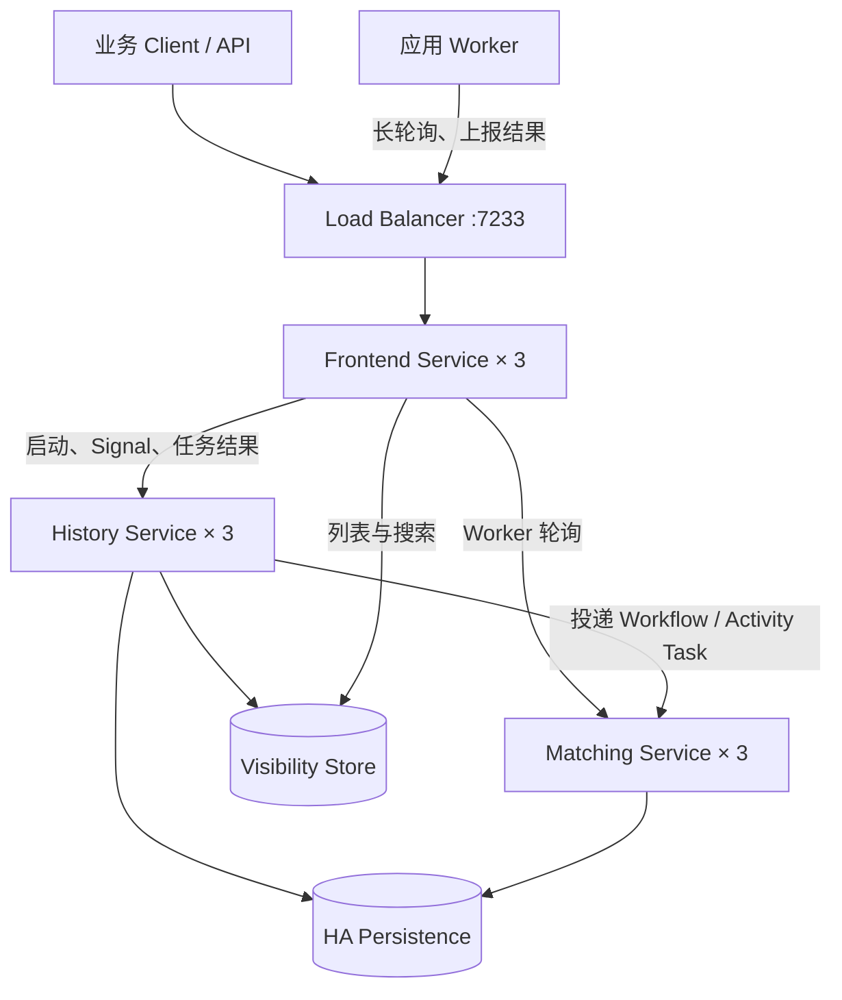
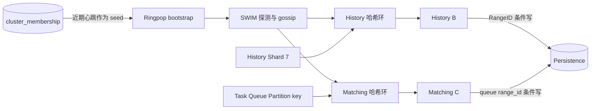
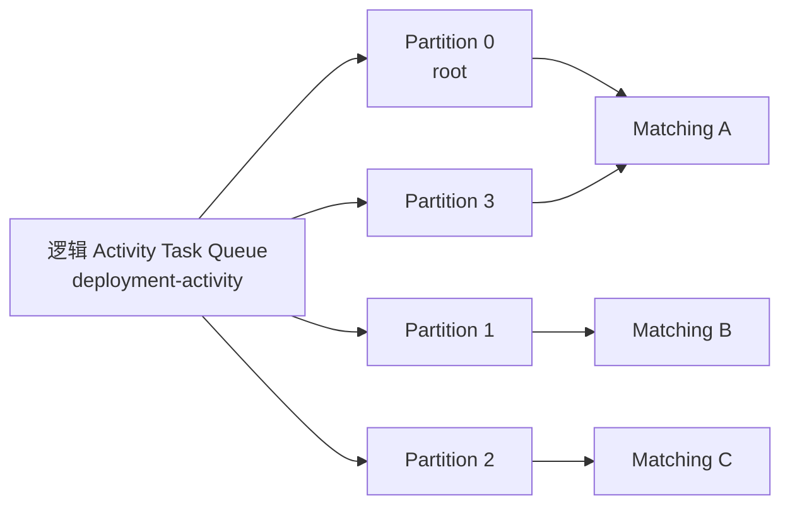
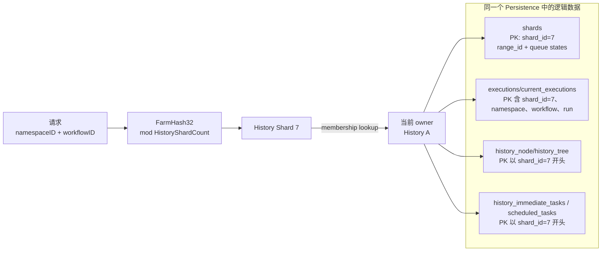
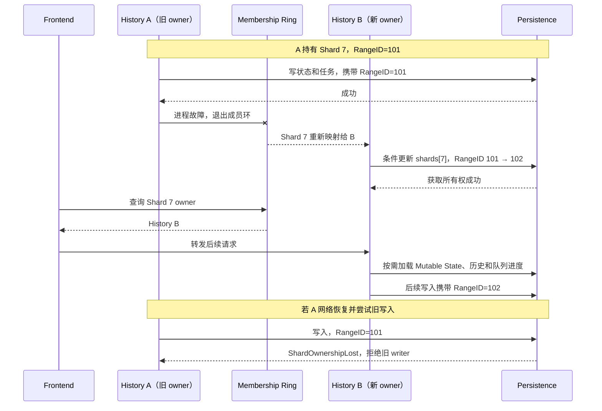
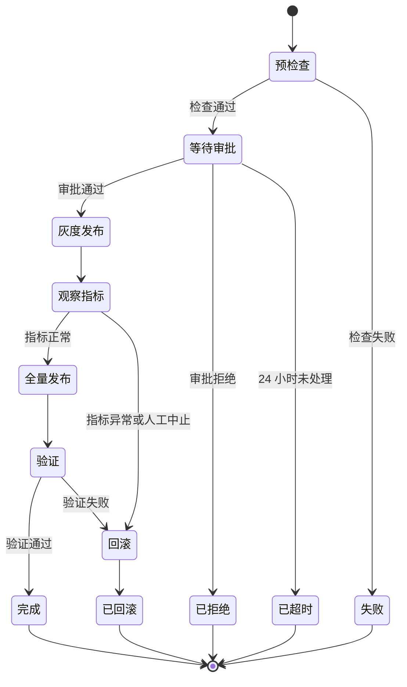
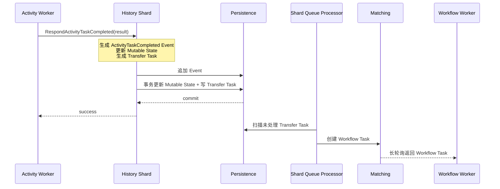
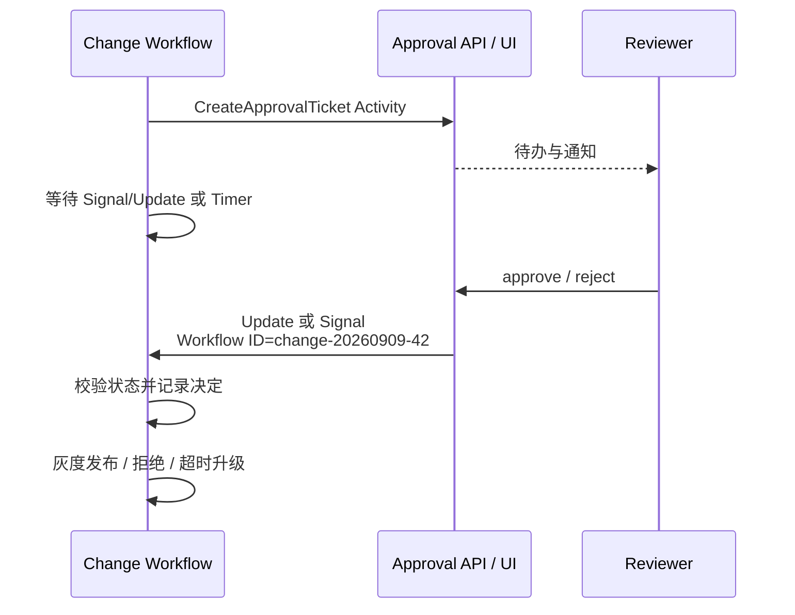

# Temporal 深入调研：持久执行、人工审批与故障恢复

调研日期：2026-09-09。调研问题见 [question.md](./question.md)。本文讨论开源 Temporal Server 及其 SDK，不把 Temporal Cloud 的托管能力算作 OSS 能力。

## 1. 结论先行

Temporal 是一个**代码优先的持久执行平台**。开发者用 Go、Java、Python、TypeScript 等语言编写 Workflow，用 Activity 封装 HTTP、数据库、脚本和第三方系统调用。Temporal 持久化的核心不是 Worker 进程的内存快照，而是 Workflow 的 Event History、Mutable State 和推进流程所需的任务。Worker 或 Server 节点重启后，流程能从持久化状态继续运行。

它最适合以下工作：

- 跨多个服务、需要最终完成或明确失败的订单、支付、资源部署和数据处理流程；
- 需要等待数小时或数天的人工审批、异步回调和持久定时器；
- 外部调用容易超时，需要重试、补偿、幂等和故障恢复的长流程；
- 流程主要由开发团队维护，希望使用代码审查、类型系统和自动化测试管理变更。

它不提供 BPMN 设计器、开箱即用的人工任务收件箱或官方通用 YAML/JSON 工作流 DSL。Temporal Web UI 主要用于观察和排障，Workflow 仍由 SDK 代码定义。如果核心需求是让业务人员画审批流和配置表单，Flowable 更直接；如果需要 JSON 驱动的服务编排，Conductor 更接近；如果需要可视化连接设备和 API，Node-RED 更轻量。

| 维度 | 结论 |
|---|---|
| 项目类型 | 持久执行平台、微服务/业务流程编排引擎 |
| 开源协议 | MIT |
| 上游 | `temporalio/temporal`，源自 Uber Cadence |
| CNCF | 不是 CNCF 托管项目 |
| 受欢迎程度 | 调研时 GitHub 主仓库约 22.9k Star、1.9k Fork |
| Server 实现 | 主要使用 Go |
| 核心取舍 | 可靠执行和工程控制力强；业务建模 UI 与人工任务产品能力弱 |

下面先解释 Temporal 集群怎样运行，再用一个“生产环境变更审批与发布”实例串起核心对象。否则直接罗列 Workflow、Activity、Task Queue 和 Signal，很难理解这些对象为什么存在。

## 2. 三节点集群：请求怎样进入，状态存在哪里

### 2.1 四种 Server Service

Temporal Server 包含四种可以独立部署和扩缩容的服务：

| 服务 | 职责 | 状态放在哪里 |
|---|---|---|
| Frontend | SDK 的 gRPC 入口，负责认证、限流、校验和内部路由 | 自身无状态 |
| History | 串行推进 Workflow 状态，管理 Event History、Mutable State、持久 Timer 和内部任务 | 权威状态在 Persistence，热点状态缓存在内存 |
| Matching | 管理用户可见的 Task Queue，把 Workflow/Activity/Nexus Task 匹配给长轮询 Worker | 积压任务和队列元数据在 Persistence |
| Worker Service | 执行 Temporal 自身的系统 Workflow 和后台工作 | 集群内部服务，不是业务 Worker |

这里有两个容易混淆的 Worker：

- **Worker Service** 是 Temporal Server 的内部组件；
- **应用 Worker** 是部署 Workflow 和 Activity 代码的业务进程，通过 Frontend 长轮询 Task Queue。

### 2.2 三节点总体架构图

先看逻辑调用关系。图中每个 Server Service 都表示一个由三个副本组成的服务集群，不展开到具体进程：



主链路只有三层：所有外部请求先到 Frontend；流程状态交给 History；待执行工作交给 Matching，再由应用 Worker 长轮询取得。History 和 Matching 都把需要恢复的数据写入 Persistence。History 另外产生 Visibility 数据，Frontend 从 Visibility Store 完成列表和搜索。

三台宿主机只负责放置这些服务的副本：

| 故障域 | Frontend | History | Matching | 内部 Worker Service |
|---|---|---|---|---|
| Node A | Frontend A | History A | Matching A | Worker Service A |
| Node B | Frontend B | History B | Matching B | Worker Service B |
| Node C | Frontend C | History C | Matching C | Worker Service C |

在 Kubernetes 中通常把四种服务分别创建为 Deployment，再用 topology spread 或 anti-affinity 将副本分散到三个节点。表格只表示副本位置，不表示同一行的 History 必须调用同一行的 Matching；服务发现会定位实际 owner。

三台 Temporal Server 只能消除 Server 进程的单点，不能补偿单实例数据库故障。Persistence 本身必须使用高可用部署。应用 Worker 也应至少有两个副本，并且不要求与 Temporal Server 同机。内部 Worker Service 负责 Temporal 自身的后台工作，不在普通业务 Workflow 的主调用链中。

#### 2.2.1 成员关系怎样确定 History Shard owner

Temporal 当前开源实现使用 `ringpop-go`。它没有通过 Raft/Paxos 维护一张强一致的“Shard → History 节点”分配表，而是把**成员发现、确定性放置和写入隔离**分成三层：



具体过程如下：

1. 每个 Temporal Server 进程启动后，把自身的地址、端口、服务角色和心跳写入 Persistence 的 `cluster_membership` 表。当前源码的心跳周期约为 10 秒，并带 0～5 秒抖动。
2. 新进程查询最近仍有心跳的记录作为 Ringpop seed。当前实现只把最近约 20 秒有心跳的记录用于 bootstrap；数据库行较长的过期时间主要用于排障和清理，不表示该节点一直存活。
3. 进程加入 Ringpop 后，由 SWIM 协议进行节点探测和 gossip。成员携带 `serviceName`、`servicePort` 等 label。
4. `ServiceResolver` 从同一批可达成员中按 `serviceName` 过滤，分别构造 Frontend、History、Matching 和 Worker Service 的一致性哈希环。只要各节点看到的可达成员集合相同，用同一个 key 查询就会得到相同 owner。
5. History 的 `ShardController` 监听成员变化。对 Shard 7，它用字符串化的 Shard ID 查询 History 环；哈希环返回 History B，B 尝试加载该 Shard，其他 History 节点关闭自己不再拥有的 Shard。

这里的“一致”是两级语义：

- **放置结果最终一致**：SWIM 通过探测和 gossip 让各节点的成员视图收敛，一致性哈希让收敛后的节点独立算出同一 owner。扩容、故障或网络抖动期间，不同节点可能短暂看到不同的环。
- **写入安全由 Persistence 强制保证**：新 owner 必须条件更新 `shards.range_id` 才能取得新的 fencing token。两个节点即使短暂都认为自己应拥有 Shard 7，也只有持有最新 `RangeID` 的节点能成功写入；旧 writer 收到 `ShardOwnershipLost`。

因此不能把 Ringpop 描述成“对 Shard owner 做强一致共识”。Ringpop 负责发现和放置，`RangeID` 才负责脑裂期间的数据安全。后面的 2.4 节会用完整时序展示这次接管。

#### 2.2.2 Task Queue partition 是什么

应用看到的是一个逻辑 Task Queue 名称，例如 `deployment-activity`。为了避免一个 Matching 进程成为吞吐瓶颈，Temporal 会在内部把它拆成多个 partition。一个逻辑队列的身份至少包含：

```text
Namespace + Task Queue Name + Task Type（Workflow / Activity / Nexus）
```

这意味着同名的 Workflow Task Queue 和 Activity Task Queue 在内部仍是不同队列。每种队列再拆成 `partition 0..N-1`。当前官方架构文档给出的默认 partition 数是 4，也可通过服务端动态配置调整。



一个 partition 是 Matching 的**路由、内存加载、积压持久化和故障转移单元**：

- partition key 经 Matching 服务的一致性哈希环映射到一个当前 owner；上图只是一次可能的分配，不要求平均到每台机器；
- owner 在内存中维护等待中的 poller、可立即同步匹配的 task 和读取进度；
- 没有 poller 可以立即接收时，task backlog 写入 `tasks/tasks_v2`，partition 元数据和 `range_id` 写入 `task_queues/task_queues_v2`；
- Matching A 故障后，它拥有的 partition 会映射到其他 Matching 节点，新 owner 从共享 Persistence 加载元数据和 backlog；
- partition 不是三副本消息队列。任一时刻只有一个有效 Matching owner，可靠性来自持久化存储和 owner 接管。

Partition 之间形成以 root partition 为根的转发树。某个 child partition 没有任务但有等待 poller 时，poll 请求可以向父 partition 转发；某个 child 有任务却没有 poller 时，task 也可以向父级转发，以提高 task 和 poller 相遇的概率。partition 较少时，所有 child 的直接父节点就是 root；更多 partition 时会形成多层树。

以变更发布为例，History 产生一个 `DeployCanary` Activity Task 后，把它加入 `deployment-activity` 的某个写 partition；应用 Worker 的 poll 请求被送到某个读 partition。两者若没有直接同步匹配，Matching 依靠持久 backlog 和 partition 间转发最终完成匹配。

Task Queue partition 也不是 Kafka 那种由业务 key 选择、用于保证分区内业务顺序的分区。Temporal 可能把同一个逻辑 Task Queue 的任务分散到不同 partition，再由多个 Worker 并发执行，因此不能依赖全局严格 FIFO。必须串行的业务步骤应由 Workflow 状态机建立先后关系；低吞吐队列若确实关心近似 FIFO，可以评估把读写 partition 数降为 1。

| 对比项 | History Shard | Task Queue partition |
|---|---|---|
| 所属服务 | History | Matching |
| 被分片的对象 | Workflow Execution 的状态和内部任务 | 某个命名 Task Queue 中的待执行任务与 poller |
| 路由 key | `namespaceID + workflowID` 先算 Shard ID | Namespace、队列名、Task 类型和 partition ID 组成的内部 key |
| 数量 | 集群初始化时固定 | 每个逻辑 Task Queue 可配置和调整 |
| 持久化 | `shards`、`executions`、`history_*` | `task_queues*`、`tasks*` |
| owner 失效 | 新 History owner 用新 `RangeID` 接管 | 新 Matching owner 加载 partition 元数据和 backlog |

### 2.3 Workflow、History Shard 与底层存储怎样对应

Temporal 在集群初始化时确定 History Shard 总数 `N`。这个数量是逻辑分片数，不等于 History 进程数，也不等于数据库实例数，并且初始化后不能修改。

一个 Workflow 被分到哪个 Shard 是确定的。当前 Server 源码中的计算可简化为：

```text
shardID = FarmHash32(namespaceID + "_" + workflowID) % N + 1
```

`Run ID` 不参与计算。因此同一个 Namespace 下，同一 `Workflow ID` 的重试 Run 或 Continue-As-New 后的新 Run 仍落到同一个 History Shard。Frontend 和 History Client 可以独立算出相同 `shardID`，再通过 History 服务的成员环找到当前 owner。



以 PostgreSQL schema 为例，存储关系如下：

| 数据 | 典型主键 | 含义 |
|---|---|---|
| `shards` | `shard_id` | 一行 Shard 元数据，保存 `range_id` 和队列进度等；不包含该 Shard 的全部 Workflow 数据 |
| `current_executions` | `(shard_id, namespace_id, workflow_id)` | 同一 Workflow ID 当前 Run 的指针和状态 |
| `executions` | `(shard_id, namespace_id, workflow_id, run_id)` | 每个 Run 的持久化 Mutable State 与执行状态 |
| `history_node` / `history_tree` | 以 `shard_id`、历史树/分支标识开头的联合键 | 追加式 Event History 及分支元数据 |
| `history_immediate_tasks` | `(shard_id, category_id, task_id)` | Transfer、Visibility、Replication 等可立即处理的内部任务 |
| `history_scheduled_tasks` | `(shard_id, category_id, visibility_timestamp, task_id)` | Timer 等按时间触发的内部任务 |

所以“Shard 保存 Workflow 状态”是一种逻辑说法。更准确地说：

1. `shard_id` 是执行状态、历史事件和内部任务的路由前缀；
2. 当前 owner 在内存中缓存 Shard 元数据和近期 Workflow 的 Mutable State；
3. 权威数据仍在共享 Persistence 中；
4. PostgreSQL/MySQL 可以把所有 Shard 的行放在同一个数据库和同一组表里，`shard_id` 是联合主键的一部分；
5. Cassandra 的 `executions` 设计则让一个 History Shard 对应一个 Cassandra partition。

数据库不会根据负载把 Shard 分配给 History 进程。History 实例的 `ShardController` 根据成员环决定当前应该拥有哪些 Shard；增加 History 副本会重新分配**所有权**，不会搬迁 Workflow 的持久化数据。

### 2.4 History 节点失效时怎样接管

假设 Shard 7 当前由 History A 持有，数据库中 `shards[7].range_id = 101`：



`RangeID` 是单调递增的 fencing token。接管者通过条件更新取得新代际；History 对 Persistence 的写入带上当前代际，旧 owner 即使恢复，也不能用过期 `RangeID` 更新状态。它解决的是 Shard owner 的脑裂写入，并不是提供给业务代码的通用分布式锁。

接管时不需要从 A 的本地磁盘复制状态。B 从共享 Persistence 读取 `shards` 中的队列 checkpoint、`executions` 中的 Mutable State、`history_node/history_tree` 中的 Event History，以及尚未处理的即时任务和定时任务。

队列 checkpoint 周期性推进，因此 B 可能再次扫描少量已经处理过的内部任务；处理逻辑必须可重入。故障切换期间请求可能短暂重试，但不会由两个有效 owner 同时推进同一 Shard。

Matching 也通过成员关系分配 Task Queue partition。Matching 节点故障后，Worker 的长轮询经 Frontend 到达新的 Matching owner；已经持久化的积压任务仍可继续分发。应用 Worker 故障则由 Task Timeout 和重试策略处理，和 History Shard 转移是两套机制。

## 3. 贯穿实例：生产环境变更审批与发布

选择这个例子，是因为它同时包含外部副作用、人工等待、定时器、失败补偿和长时间运行，能展示 Temporal 的核心价值。



### 3.1 一次执行的完整路径

假设创建变更单 `change-20260909-42`：

1. 发布系统用该业务编号作为 `Workflow ID` 启动 `ProductionChangeWorkflow`。
2. History 持久化 `WorkflowExecutionStarted`，并通过内部 Transfer Task 把 Workflow Task 送到 Matching。
3. Workflow Worker 拉到任务，重放历史，执行到 `Precheck`，返回 `ScheduleActivityTask` Command。
4. History 把新 Event、Mutable State 和内部任务持久化；Activity Worker 随后执行预检查。
5. 预检查完成后，Workflow 安排 `CreateApprovalTicket` Activity，然后等待 `approval-decision` 消息或 24 小时 Timer。
6. 等待期间没有线程、goroutine 或 Worker 被长期占用。执行状态在 Temporal Persistence 中。
7. 审批服务收到操作后，用 Update 或 Signal 把决定写给该 Workflow。
8. Workflow 安排灰度发布 Activity，再进入监控观察窗口；指标异常时安排 Rollback Activity。
9. Worker 或 Temporal Server 中途重启时，另一实例从历史恢复到当前阶段，继续尚未完成的工作。

这个路径展示了两个闭环：Workflow Task 负责“根据历史计算下一步”，Activity Task 负责“真正操作外部系统”。Workflow 代码不能直接执行部署或查询数据库。

### 3.2 简化的 Go Workflow

```go
type ApprovalDecision struct {
    DecisionID string
    Approved   bool
    Comment    string
    Reviewer   string
}

type ChangeInput struct {
    ChangeID string
    Service  string
    Version  string
}

func ProductionChangeWorkflow(ctx workflow.Context, in ChangeInput) (string, error) {
    ctx = workflow.WithActivityOptions(ctx, workflow.ActivityOptions{
        StartToCloseTimeout: 10 * time.Minute,
        RetryPolicy: &temporal.RetryPolicy{
            InitialInterval:        time.Second,
            BackoffCoefficient:     2,
            MaximumInterval:        time.Minute,
            MaximumAttempts:        5,
            NonRetryableErrorTypes: []string{"InvalidChangePlan"},
        },
    })

    if err := workflow.ExecuteActivity(ctx, Precheck, in).Get(ctx, nil); err != nil {
        return "PRECHECK_FAILED", err
    }
    if err := workflow.ExecuteActivity(ctx, CreateApprovalTicket, in).Get(ctx, nil); err != nil {
        return "NOTIFY_FAILED", err
    }

    var decision ApprovalDecision
    approved := false
    selector := workflow.NewSelector(ctx)
    selector.AddReceive(workflow.GetSignalChannel(ctx, "approval-decision"),
        func(ch workflow.ReceiveChannel, _ bool) {
            ch.Receive(ctx, &decision)
            approved = decision.Approved
        })
    selector.AddFuture(workflow.NewTimer(ctx, 24*time.Hour),
        func(workflow.Future) { approved = false })
    selector.Select(ctx)

    if !approved {
        return "REJECTED_OR_TIMEOUT", nil
    }
    if err := workflow.ExecuteActivity(ctx, DeployCanary, in, in.ChangeID).Get(ctx, nil); err != nil {
        return "CANARY_FAILED", err
    }

    var healthy bool
    if err := workflow.ExecuteActivity(ctx, CheckCanaryMetrics, in).Get(ctx, &healthy); err != nil {
        return "METRICS_FAILED", err
    }
    if !healthy {
        _ = workflow.ExecuteActivity(ctx, Rollback, in, in.ChangeID).Get(ctx, nil)
        return "ROLLED_BACK", nil
    }

    if err := workflow.ExecuteActivity(ctx, DeployAll, in, in.ChangeID).Get(ctx, nil); err != nil {
        _ = workflow.ExecuteActivity(ctx, Rollback, in, in.ChangeID).Get(ctx, nil)
        return "ROLLED_BACK", err
    }
    return "COMPLETED", nil
}
```

这只是模型示例。真实系统还应区分审批超时和拒绝，检查重复 `DecisionID`，为回滚设置独立 Retry Policy，并使用 Saga/补偿结构保证错误处理本身可恢复。

## 4. 从实例理解核心对象

| Temporal 抽象 | 定义 | 变更发布实例 |
|---|---|---|
| Namespace | 工作流、保留期和配置的逻辑隔离边界 | `production-ops` |
| Workflow Definition / Type | 确定性的流程代码及注册名 | `ProductionChangeWorkflow` |
| Workflow Execution | Workflow 的一个持久运行实例 | 变更单 42 的一次执行 |
| Workflow ID | 业务稳定标识 | `change-20260909-42` |
| Run ID | 一次 Run 的唯一标识 | Continue-As-New 或 Retry 后改变 |
| Event History | 该执行已发生事实的有序序列 | 已启动、预检查完成、收到审批、Timer 触发 |
| Mutable State | History 为快速处理保存的当前状态摘要 | 当前等待哪个 Activity、Timer 和 Child Workflow |
| Command | Workflow Worker 根据历史计算出的决定 | 安排 Activity、启动 Timer、完成 Workflow |
| Workflow Task | 要求 Worker 重放历史并产生下一批 Command | 收到审批后决定灰度发布 |
| Activity | 可以访问外部世界、可以失败和重试的代码 | 预检查、发布、查指标、回滚 |
| Activity Task | Activity 的某一次执行尝试 | 第 2 次 `DeployCanary` 尝试 |
| Task Queue | 应用 Worker 长轮询的逻辑队列 | `change-workflow`、`deployment-activity` |
| Signal | 向运行中 Workflow 异步写消息 | 审批通过、紧急中止 |
| Update | 可校验并等待结果的写请求 | 审批时校验当前是否仍可处理 |
| Query | 不改变历史的状态查询 | 查询当前阶段和已审批人 |
| Timer | Server 持久化的逻辑时间等待 | 审批 24 小时超时、灰度观察 10 分钟 |
| Child Workflow | 有独立生命周期的子流程 | 每个区域的发布流程 |
| Continue-As-New | 用新 Run 延续同一 Workflow ID | 长期运行的变更协调器缩短历史 |

最关键的对象关系是：一个 Workflow Execution 产生一条 Event History；应用 Worker 通过 Workflow Task 读取和重放这条历史，返回 Command；History 接受 Command 后进行状态转换并生成后续任务；Matching 只负责把任务交给合适的 Worker，不决定业务状态。

## 5. 一次状态转换怎样持久化

### 5.1 Event、Mutable State 和 Task 如何一起推进

以 `Precheck` Activity 完成为例：



Mutable State 与 History Task 在数据库事务中一起更新。Event History 与它们通过最新事件标识建立一致性；提交失败时，History 丢弃内存中的脏状态并从 Persistence 重新加载。Transfer Task 相当于 History 到 Matching 的 transactional outbox：只有状态转换持久化成功，任务才会最终投递到 Matching。

因此 Matching 暂时不可用不会让流程状态丢失。Shard Queue Processor 会重新读取尚未确认的 Transfer Task，直到成功创建相应 Workflow Task 或 Activity Task。内部任务可能重复处理，所以创建任务和推进 ack level 必须可重入。

### 5.2 Worker 恢复的是执行，不是内存快照

应用 Worker 不保存权威 Workflow 状态。重新得到 Workflow Task 后，SDK 从头重新执行 Workflow 函数，并将代码产生的 Command 与 Event History 对照：

- 历史已经记录 `Precheck` 完成时，重放不会再次调用该 Activity，而是直接取得已记录结果；
- 历史已经记录审批 Signal 时，`Receive` 会读到该消息；
- 运行到历史末尾后，代码才产生新的 Command，例如安排 `DeployCanary`。

这要求 Workflow 代码具备确定性。系统时间、随机数、HTTP、数据库查询和部署调用不能直接写进 Workflow，应使用 SDK 的确定性 API 或 Activity。大对象也不应塞进 History；把制品、日志和报告存到对象存储，只把 URI、哈希和必要元数据放入参数或结果。

### 5.3 历史增长和代码升级

长时间运行不代表可以无限增加事件。频繁接收 Signal 或长期循环的 Workflow 应适时 `Continue-As-New`：当前 Run 关闭，新 Run 使用相同 Workflow ID 和新的 Run ID 继续，所需状态作为新输入传入。

一个等待审批数周的 Workflow 可能跨越多个应用版本。直接改变旧历史所对应的 Command 顺序会导致 non-deterministic error。生产升级需要使用 Worker Versioning，或采用 SDK 的 Patching/GetVersion 机制兼容新旧历史，并用真实 Event History 做 replay test。

## 6. 故障、重试与自动恢复

### 6.1 先区分四种故障

| 故障 | 平台行为 | 应用责任 |
|---|---|---|
| Workflow Worker 崩溃 | Workflow Task 超时后重新投递，另一 Worker 重放历史 | Workflow 保持确定性 |
| Activity Worker 崩溃 | 通过 Start-To-Close 或 Heartbeat Timeout 判断尝试失败，再按 Retry Policy 调度 | 设置超时、心跳和业务幂等 |
| History 节点崩溃 | 其他 History 实例用新 RangeID 接管 Shard 并从 Persistence 加载状态 | Server 与数据库都部署 HA |
| 外部系统调用结果不确定 | Activity 可能被再次执行 | 使用幂等键、查单、去重或补偿 |

Workflow Worker 暂时全部下线时，Workflow Execution 不会因此失败，只是没有 Worker 计算下一步。Worker 恢复轮询后可以继续执行。

### 6.2 Activity 重试边界

Activity 默认 Retry Policy 使用指数退避，默认最大尝试次数没有固定上限，最终仍受 Schedule-To-Close Timeout 或取消约束。生产配置应按错误类型决定：

- 网络超时、429、服务暂时不可用：重试；
- 变更计划非法、权限永久不足：标记为 non-retryable；
- 长时间部署：设置 Heartbeat Timeout，并在 heartbeat details 记录阶段；
- 下游返回建议等待时间：动态设置下一次 retry delay；
- 人工审批：由 Workflow 等待 Signal/Update，不要用一个 Activity 持续占着线程等待。

通常不为整个 Workflow 配置重试，而是把可失败的外部操作放在 Activity 中，仅重试失败步骤。审批拒绝、指标不合格等合法业务结果应作为状态或返回值处理，不应全部抛成系统错误。

### 6.3 为什么 Activity 仍需要幂等

一种典型故障是：发布平台已接受灰度请求，但 Activity Worker 在向 Temporal 报告完成前崩溃。Temporal 没有看到完成 Event，超时后会再次调度该 Activity，于是外部副作用可能发生多次。

`DeployCanary` 应将 `ChangeID` 或稳定的 Activity 业务键传给发布平台，并由下游唯一约束保证重复请求返回同一结果。如果下游不支持幂等，需要先查状态再操作，或者提供补偿 Activity。Temporal 能保证自己的历史可靠推进，无法撤销一个已经发生但没有回执的外部副作用。

### 6.4 定时器与 Schedule

Workflow Timer 是执行内部的持久等待，例如审批 24 小时超时。Timer 数据在 History Shard 的 scheduled task 中；Server 或 Worker 重启后仍能触发。等待 Timer 不占用应用线程。

Temporal Schedule 用于按时间启动新的 Workflow，支持 calendar/cron 表达式、时区、暂停、恢复、Backfill、jitter 和多种重叠策略。Catchup Window 决定服务停机期间错过的触发是否在恢复后补跑。两者用途不同：

| 能力 | Workflow Timer | Schedule |
|---|---|---|
| 绑定对象 | 某个 Workflow Execution | 独立的调度资源 |
| 示例 | 当前变更单 24 小时未审批 | 每晚启动一次环境巡检 Workflow |
| 故障恢复 | 从 History scheduled task 恢复 | 按 Catchup Window 补触发 |

## 7. 人工参与怎样建模



Temporal 不自带完整的组织、候选组、表单和“我的待办”。实际系统通常这样补齐：

1. Workflow 通过 Activity 在业务库创建审批单并通知审核人；
2. UI 从业务审批表查询待办，而不是扫描所有 Workflow Query；
3. Approval API 校验登录身份、角色、表单和重复提交；
4. API 使用 Workflow ID 发送 Update 或 Signal；
5. Workflow 记录决定并推进，Activity 再同步业务待办状态。

三种交互方式的选择：

| 需求 | 选择 | 原因 |
|---|---|---|
| 异步通知“审批已完成” | Signal | 持久写入，不要求立即返回业务处理结果 |
| 提交时校验当前仍可审批并返回结果 | Update | 支持 validator，调用方可以等待接受或拒绝结果 |
| 刷新页面查看某个流程当前阶段 | Query | 只读，不增加 Event History |
| 查询某人的全部待办 | 业务待办库或 Visibility | Query 面向单个 Workflow，不适合全局列表 |

提醒、升级、撤回和改派可以建模为不同 Signal/Update，再由 Workflow 状态机验证合法转换。业务侧还需实现权限、代理审批、附件、字段权限、`DecisionID` 去重和审计报表。

## 8. Queue 基于什么实现，Worker 能做哪些任务

Temporal 基本运行不要求外接 Kafka、RabbitMQ 或 Redis。用户看到的 Task Queue 是 Matching Service 提供的逻辑工作分发队列：

- Worker 通过同步 gRPC 长轮询，只有具备容量时才取任务，形成 pull-based backpressure；
- 多个 Worker 轮询同名队列时，Matching 负责匹配；
- 无 Worker 时，Workflow Task 和 Activity Task 的积压会写入 Persistence；
- Task Queue 按需创建，不要求像消息中间件一样预先声明；
- 它用于向 Worker 分配工作，不是通用发布/订阅消息系统。

需要区分两层队列：

| 层次 | 归属 | 示例 | 用户是否直接操作 |
|---|---|---|---|
| History 内部任务 | 每个 History Shard | Transfer、Timer、Visibility、Replication | 否 |
| 应用 Task Queue | Matching Service | Workflow、Activity、Nexus Task Queue | 是 |

当前 Server 协议中，应用 Worker 主要接收三类任务：

| Task 类型 | 谁执行 | 用途 | 积压是否持久化 |
|---|---|---|---|
| Workflow Task | 注册 Workflow 的 Worker | 重放历史并计算 Command | 是 |
| Activity Task | 注册 Activity 的 Worker | 执行 HTTP、DB、部署、文件等外部操作 | 是 |
| Nexus Task | Nexus Worker | 跨 Namespace 或团队调用长期运行 Operation | 否，由调用方按策略重试 |

应用还可以组合 Local Activity、Child Workflow、Timer、Signal、Update、Query 和异步 Activity Completion。Temporal 不提供固定的 HTTP、SQL、邮件或人工审核节点目录；这些节点由 Activity 代码或第三方库实现。

## 9. UI 与工作流定义方式

Temporal Web UI 可以搜索 Workflow Execution、查看 Metadata 和 Event History、检查待处理 Activity、调试失败以及管理部分 Schedule。它是研发和运维工具，不是 BPMN 设计器，也不应直接当作审批后台。

Workflow 通过 SDK 代码定义。官方主流 SDK 包括 Go、Java、Python、TypeScript、.NET、Ruby 和 PHP；具体稳定级别应在采用时查看官方支持矩阵。参数可以经 Data Converter 序列化为 JSON 或 Protobuf，部署配置也可以使用 YAML，但这些不等于用 YAML/JSON 声明流程。

如果必须动态配置步骤，可以在 Temporal 上编写一个解释 JSON DSL 的 Workflow，但 DSL 校验、版本兼容、权限和可观测性都要自行实现。这样的需求较强时，优先评估 Conductor，通常比在 Temporal 上重建一套声明式引擎更合理。

## 10. 支持的存储

### 10.1 核心 Persistence

| 存储 | 用途/状态 |
|---|---|
| Cassandra | 生产支持 |
| PostgreSQL | 生产支持 |
| MySQL | 生产支持 |
| SQLite | 开发和测试使用，不用于生产 |

核心 Persistence 保存 Namespace、Shard 元数据、Workflow 状态、Event History、Task Queue 积压和内部任务。中小规模自建通常优先复用团队熟悉的 PostgreSQL/MySQL；已有成熟 Cassandra 运维能力并需要大规模吞吐时再评估 Cassandra。复制、备份、恢复、连接数和跨可用区延迟由部署方负责。

### 10.2 Visibility Store

Visibility 用于 Workflow 列表、筛选和 Search Attributes。当前版本支持使用 SQL，也支持 Elasticsearch；OpenSearch 的支持应按采用版本核对。Visibility 是最终一致的查询索引，不是单个 Workflow 的权威状态。查看一个执行的精确状态使用 Describe/History，业务列表也可以使用自己的投影表。

### 10.3 Archival 与业务大对象

Archival 可把已关闭执行的 History 和 Visibility 记录复制到 blob storage，使其超过 Namespace retention 后仍可查询。自建时需要按官方标注和实际版本验证成熟度，不能替代数据库备份。

制品、日志、附件和大模型输出等大对象应存入 S3、MinIO 或其他业务对象存储，只在 Workflow 中保留 URI、哈希和必要元数据，以控制 Event History 和 Mutable State 的大小。

## 11. 与另外三类工具的边界

| 维度 | Temporal | Conductor OSS | Flowable | Node-RED |
|---|---|---|---|---|
| 核心模型 | 确定性代码 + Event History 重放 | JSON Workflow + 中央状态机 + Worker | BPMN/DMN/CMMN | 可视化消息流 |
| 主要使用者 | 软件工程师 | 后端与平台团队 | 流程开发者、业务审批团队 | 集成开发、IoT 和自动化用户 |
| 定义方式 | SDK 代码 | JSON，配套 UI | BPMN XML 与建模器 | 画布导出 JSON |
| 人工任务 | Signal/Update + 自建待办 | Human Task + 自建/配套 UI | 原生 User Task、候选人/组和表单 | 依靠节点集成 |
| 恢复方式 | Event History 重放 | 持久状态与队列重新调度 | 数据库流程实例与 Job 恢复 | 依赖节点和上下文存储配置 |
| 最强项 | 长时间、可靠、开发者维护的执行 | 声明式微服务编排 | 标准业务流程和人工审批 | 快速连接 API、消息与设备 |

Temporal 值得深入学习的不是“能画多少种节点”，而是如何把一个跨服务、跨进程、跨数天的执行变成可恢复状态机。它通过 History Shard 串行化状态转换，通过 Event History 与确定性重放恢复 Workflow，通过 Activity Retry 推进失败步骤，再用幂等和补偿处理无法原子提交的外部副作用。

## 12. 最终评价

Temporal 适合由工程团队拥有的可靠长流程，尤其是微服务编排、资源部署、订单履约、异步回调、定时等待和需要人工确认的高价值操作。三节点部署的关键不是把数据复制到三台 Temporal 机器，而是让无状态入口、History Shard owner 和 Matching owner 可以迁移，同时把权威状态放在高可用 Persistence 中。

理解 Temporal 可以抓住一条主线：`namespaceID + workflowID` 确定 History Shard，成员环确定当前 History owner，`RangeID` 隔离新旧 owner，Persistence 保存状态与任务，Worker 用 Event History 重放出业务执行。把这条链路弄清楚，Workflow、Activity、Task Queue、Signal、Timer 和故障恢复便不再是互相孤立的概念。

## 参考资料

- [Temporal Server 概念与部署架构](https://docs.temporal.io/temporal-service/temporal-server)
- [Temporal History Service 架构](https://github.com/temporalio/temporal/blob/main/docs/architecture/history-service.md)
- [Temporal Matching Service 与 Task Queue Partitions](https://github.com/temporalio/temporal/blob/main/docs/architecture/matching-service.md)
- [Ringpop Membership Monitor 当前实现](https://github.com/temporalio/temporal/blob/main/common/membership/ringpop/monitor.go)
- [Ringpop Service Resolver 与一致性哈希环](https://github.com/temporalio/temporal/blob/main/common/membership/ringpop/service_resolver.go)
- [History Shard Ownership 当前实现](https://github.com/temporalio/temporal/blob/main/service/history/shard/ownership.go)
- [Workflow ID 到 History Shard 的源码实现](https://github.com/temporalio/temporal/blob/main/common/util.go)
- [PostgreSQL Temporal Schema](https://github.com/temporalio/temporal/blob/main/schema/postgresql/v12/temporal/schema.sql)
- [Cassandra Temporal Schema](https://github.com/temporalio/temporal/blob/main/schema/cassandra/temporal/schema.cql)
- [History Shard Context 与 RangeID](https://github.com/temporalio/temporal/blob/main/service/history/shard/context_impl.go)
- [Temporal Activity Execution 与重试](https://docs.temporal.io/activity-execution)
- [Temporal Workflow Execution](https://docs.temporal.io/workflow-execution)
- [Temporal Schedules](https://docs.temporal.io/schedule)
- [Temporal Human-in-the-loop 指南](https://docs.temporal.io/evaluate/development-production-features/human-in-the-loop)
- [Temporal Web UI](https://docs.temporal.io/web-ui)
- [Temporal Visibility](https://docs.temporal.io/visibility)
- [Temporal GitHub repository](https://github.com/temporalio/temporal)
- [CNCF projects](https://www.cncf.io/projects/)
