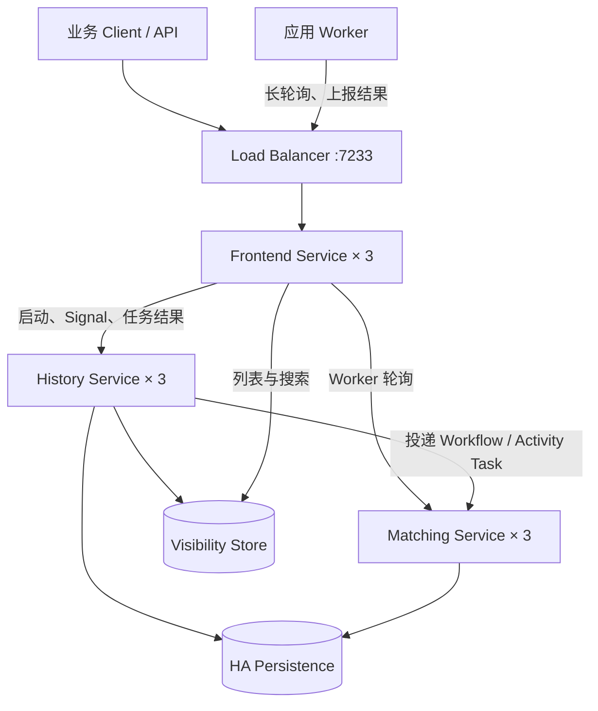
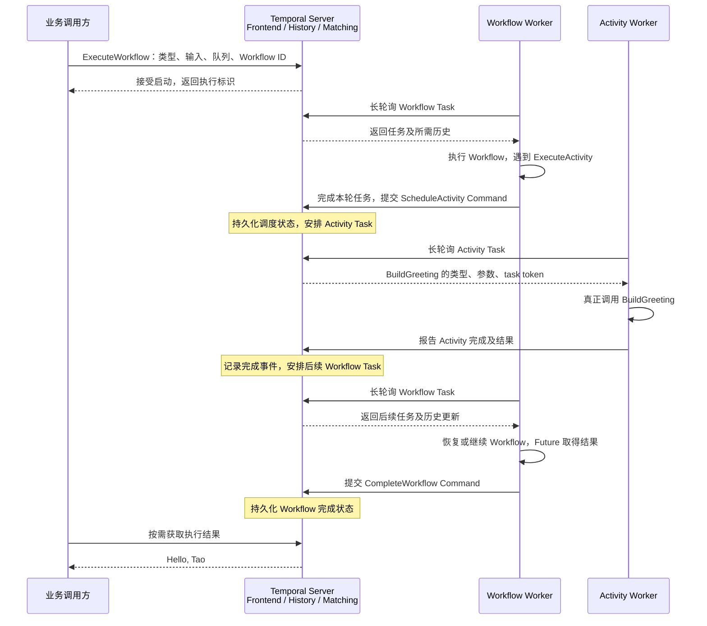
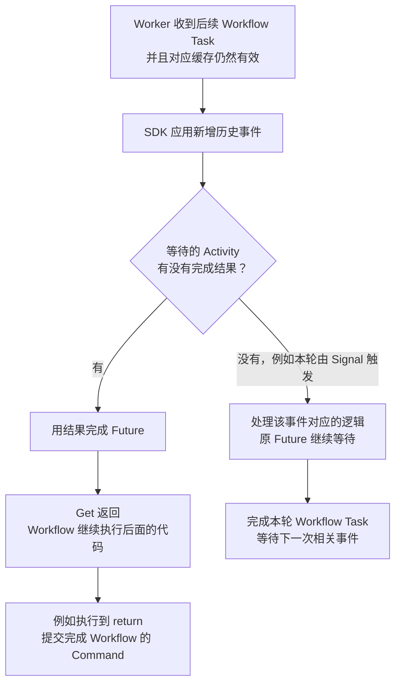
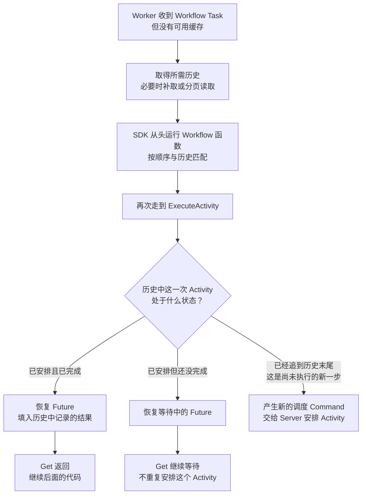
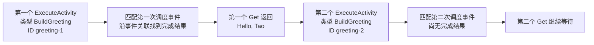
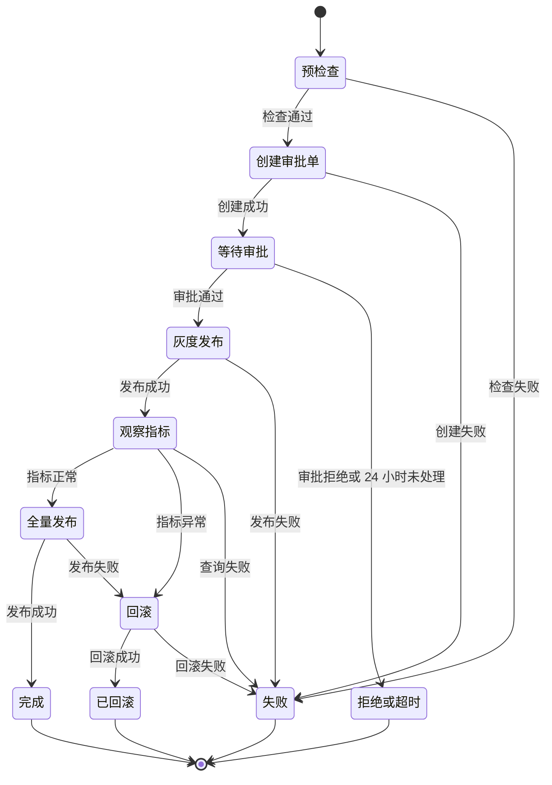
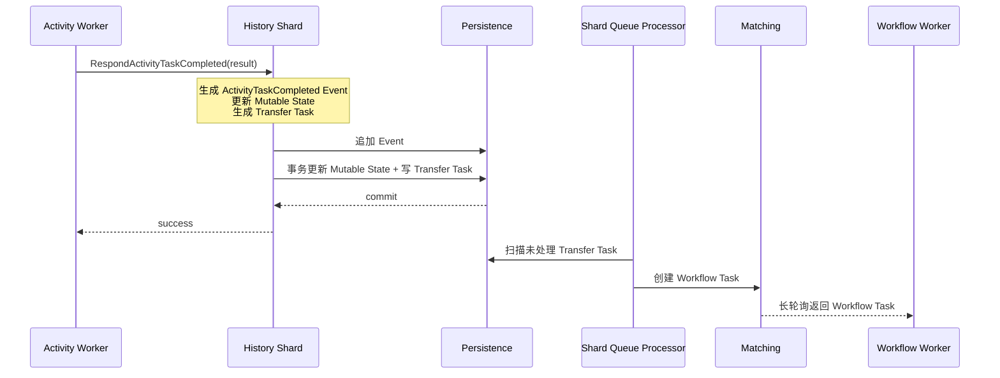

# Temporal 深入调研：持久执行、人工审批与故障恢复

调研日期：2026-09-09。调研问题见 [question.md](./question.md)。本文讨论开源 Temporal Server 及其 SDK，不把 Temporal Cloud 的托管能力算作 OSS 能力。

## 1. 结论先行

Temporal 是一个**代码优先的持久执行平台**。开发者用 Go、Java、Python、TypeScript 等语言编写 Workflow，用 Activity 封装 HTTP、数据库、脚本和第三方系统调用。Temporal 持久化的核心不是 Worker 进程的内存快照，而是 Workflow 的 Event History、Mutable State 和推进流程所需的任务。Worker 或 Server 节点重启后，流程能从持久化状态继续运行。

它最适合以下工作：

- 跨多个服务、需要最终完成或明确失败的订单、支付、资源部署和数据处理流程；
- 需要等待数小时或数天的人工审批、异步回调和持久定时器；
- 外部调用容易超时，需要重试、补偿、幂等和故障恢复的长流程；
- 流程主要由开发团队维护，希望使用代码审查、类型系统和自动化测试管理变更。

它不提供 BPMN 设计器、开箱即用的人工任务收件箱或官方通用 YAML/JSON 工作流 DSL。Temporal Web UI 主要用于观察和排障，Workflow 仍由 SDK 代码定义。如果核心需求是让业务人员画审批流和配置表单，Flowable 更直接；如果需要 JSON 驱动的服务编排，Conductor 更接近；如果需要可视化连接设备和 API，Node-RED 更轻量。

| 维度 | 结论 |
|---|---|
| 项目类型 | 持久执行平台、微服务/业务流程编排引擎 |
| 开源协议 | MIT |
| 上游 | `temporalio/temporal`，源自 Uber Cadence |
| CNCF | 不是 CNCF 托管项目 |
| 受欢迎程度 | 调研时 GitHub 主仓库约 22.9k Star、1.9k Fork |
| Server 实现 | 主要使用 Go |
| 核心取舍 | 可靠执行和工程控制力强；业务建模 UI 与人工任务产品能力弱 |

下面先看架构，再解释应用如何启动 Workflow、Worker 如何执行任务以及 Server 如何安排重试；随后用“生产环境变更审批与发布”实例串起核心对象，最后讨论持久化和故障恢复。成员发现与分区实现单独引用 022 文档。

## 2. 三节点架构：Server、应用 Worker 与调用方

### 2.1 四种 Server Service

Temporal Server 包含四种可以独立部署和扩缩容的服务：

| 服务 | 职责 | 状态放在哪里 |
|---|---|---|
| Frontend | SDK 的 gRPC 入口，负责认证、限流、校验和内部路由 | 自身无状态 |
| History | 串行推进 Workflow 状态，管理 Event History、Mutable State、持久 Timer 和内部任务 | 权威状态在 Persistence，热点状态缓存在内存 |
| Matching | 管理用户可见的 Task Queue，把 Workflow/Activity/Nexus Task 匹配给长轮询 Worker | 积压任务和队列元数据在 Persistence |
| Worker Service | 执行 Temporal 自身的系统 Workflow 和后台工作 | 集群内部服务，不是业务 Worker |

这里有两个容易混淆的 Worker：

- **Worker Service** 是 Temporal Server 的内部组件；
- **应用 Worker** 是部署 Workflow 和 Activity 代码的业务进程，通过 Frontend 长轮询 Task Queue。

### 2.2 三节点总体架构图

先看逻辑调用关系。图中每个 Server Service 都表示一个由三个副本组成的服务集群，不展开到具体进程：



主链路只有三层：所有外部请求先到 Frontend；流程状态交给 History；待执行工作交给 Matching，再由应用 Worker 长轮询取得。History 和 Matching 都把需要恢复的数据写入 Persistence。History 另外产生 Visibility 数据，Frontend 从 Visibility Store 完成列表和搜索。

三台宿主机只负责放置这些服务的副本：

| 故障域 | Frontend | History | Matching | 内部 Worker Service |
|---|---|---|---|---|
| Node A | Frontend A | History A | Matching A | Worker Service A |
| Node B | Frontend B | History B | Matching B | Worker Service B |
| Node C | Frontend C | History C | Matching C | Worker Service C |

在 Kubernetes 中通常把四种服务分别创建为 Deployment，再用 topology spread 或 anti-affinity 将副本分散到三个节点。表格只表示副本位置，不表示同一行的 History 必须调用同一行的 Matching；服务发现会定位实际 owner。

三台 Temporal Server 只能消除 Server 进程的单点，不能补偿单实例数据库故障。Persistence 本身必须使用高可用部署。应用 Worker 也应至少有两个副本，并且不要求与 Temporal Server 同机。内部 Worker Service 负责 Temporal 自身的后台工作，不在普通业务 Workflow 的主调用链中。

## 3. 应用怎样使用 Workflow，执行由谁驱动

### 3.1 先分清调用方、Server 和应用 Worker

Workflow 和 Activity 的业务代码都部署在**应用 Worker** 中。Temporal Server 保存执行状态、安排任务、处理结果和超时；它不会直接运行你编写的 Go Workflow 函数。

| 角色 | 应用开发者需要做什么 | 运行时职责 |
|---|---|---|
| 业务调用方，例如 HTTP API | 使用 Temporal Client 启动或操作一个 Workflow | 提交类型名、输入、Workflow ID 和 Task Queue；按需查询结果或发 Signal |
| Temporal Server | 部署或使用已有集群 | 记录事件与状态，创建任务，管理计时与重试 |
| 应用 Worker | 注册 Workflow 和 Activity 实现，启动 SDK Worker | 主动轮询任务，运行对应代码，再把结果报告给 Server |

一个应用 Worker 进程可以同时执行 Workflow Task 和 Activity Task，也可以拆成不同进程、不同队列。

### 3.2 应用怎样使用一个已经定义好的 Workflow

最小使用流程分三步：**写定义 → 部署并注册 Worker → 调用方请求启动**。下面只用一个 Activity，先不引入审批和补偿。代码是三个位置的集成片段，省略 package/import；分别使用 Go SDK 的 `workflow`、`worker`、`client` 包，以及标准库 `context`、`fmt`、`time`。

**第一步：定义 Workflow 和 Activity，编译到 Worker 程序中。**

```go
// Workflow 定义：由 Workflow Task 驱动，负责决定步骤与等待结果。
func GreetingWorkflow(ctx workflow.Context, name string) (string, error) {
    ctx = workflow.WithActivityOptions(ctx, workflow.ActivityOptions{
        StartToCloseTimeout: time.Minute,
    })
    var result string
    // SDK 产生调度 Command；Get 等待后续任务带回 Activity 结果。
    future := workflow.ExecuteActivity(ctx, "BuildGreeting", name)
    err := future.Get(ctx, &result)
    return result, err
}

// Activity 定义：Activity Task 触发一次函数调用，执行具体业务操作。
func BuildGreeting(ctx context.Context, name string) (string, error) {
    return "Hello, " + name, nil
}
```

**第二步：启动应用 Worker，声明自己能执行什么。** 假定 `c` 是通过 `client.Dial` 创建、连接到目标 Server 和 Namespace 的 Client：

```go
w := worker.New(c, "greeting-tasks", worker.Options{})
w.RegisterWorkflowWithOptions(GreetingWorkflow,
    workflow.RegisterOptions{Name: "GreetingWorkflow"})
w.RegisterActivity(BuildGreeting)

if err := w.Run(worker.InterruptCh()); err != nil {
    return err
}
```

注册是在 Worker 进程内建立“类型名 → 函数实现”的对应关系，并不是把 Go 函数上传到 Server。`Run` 启动轮询并维持 Worker 运行；部署两个这样的进程，就有两个可以承接任务的 Worker。[Go Worker 使用说明](https://docs.temporal.io/develop/go/workers/run-worker-process)。

**第三步：业务调用方启动一个执行实例。** 调用方只需要知道约定的类型名、参数和队列，无须持有 Workflow 函数实现：

```go
run, err := c.ExecuteWorkflow(ctx, client.StartWorkflowOptions{
    ID:        "greeting-request-42",
    TaskQueue: "greeting-tasks",
}, "GreetingWorkflow", "Tao")
if err != nil {
    return err
}
fmt.Println(run.GetID(), run.GetRunID())

// 可选：等待整个 Workflow 完成。长流程的 HTTP 接口通常直接返回执行 ID。
var result string
if err := run.Get(ctx, &result); err != nil {
    return err
}
```

`ExecuteWorkflow` 成功意味着启动请求已被接受，返回执行句柄，不意味着 Workflow 已完成。调用方断开或不再等待结果，通常不会取消已经启动的执行；取消应显式发送请求。没有可用 Worker 时，已启动的流程会等待任务被处理，而不是自动在调用方进程中执行。调用方与 Worker 必须连接同一目标 Namespace，队列名和注册的类型名也要匹配。[Go Client 使用说明](https://docs.temporal.io/develop/go/client/temporal-client)。

### 3.3 Worker 主动拉什么，Server 返回什么

Worker 主动向 Frontend 发起长轮询。Server 不需要主动连接 Worker 暴露的 HTTP 服务；任务通过尚未返回的轮询请求交给 Worker，完成后 Worker 再发 RPC 报告结果。

| 任务 | Worker 收到的主要内容 | Worker 做什么 | 返回什么 |
|---|---|---|---|
| Workflow Task | 本次执行所需的历史事件，以及执行与任务标识 | 运行或恢复 Workflow 代码，计算接下来做什么 | Command，例如安排 Activity、启动 Timer、结束 Workflow |
| Activity Task | Activity 类型、输入、任务 token 等 | 真正调用 Activity 函数，执行外部操作 | 结果或错误；长任务还可报告 heartbeat |

开发者编写的是 3.2 中的两个函数，Task 则由 Server 在运行时安排：

| 已注册的函数 | 收到 Task 后如何使用它 | 一次 Task 的执行范围 |
|---|---|---|
| `GreetingWorkflow(workflow.Context, name)` | SDK 根据历史运行或恢复这个函数 | 推进到需要等待或流程结束，提交本轮 Command；一个 Workflow 通常经历多次 Workflow Task |
| `BuildGreeting(context.Context, name)` | SDK 解码任务输入，例如 `"Tao"`，调用函数并报告结果 | 一次 Activity 执行尝试；失败重试时可以再次调用 |

两类任务由 SDK 分别轮询和处理。`workflow.Context` 用于流程的确定性调度与等待，`context.Context` 用于 Activity 的普通业务调用；业务代码无须自行实现 Task 的领取和结果上报。

### 3.4 谁推动 Workflow 进入下一步

执行由 **Server 的任务调度与 Worker 的代码计算共同推进**：Server 根据事件安排 Workflow Task，Worker 执行代码决定下一步，再把决定交回 Server。调用方启动后，不需要写一个循环反复调用“执行下一步”。

以下按普通轮询路径展示 `GreetingWorkflow` 的一次成功执行，省略 eager 等优化。为看清职责，将同一个应用 Worker 可承担的两种角色画成两个参与者；所有 Worker 与 Server 的交互均经过 Frontend。



Activity 完成、收到 Signal、Timer 到期等事件，都可能使 Server 安排后续 Workflow Task。没有新事件、流程正在等待时，不需要 Worker 不断执行同一段代码检查条件。[History Service 执行链路](https://github.com/temporalio/temporal/blob/main/docs/architecture/history-service.md)。

**这里有两个不同的结束时刻：** 第一次 `.Get` 尚未取得结果时，Workflow 逻辑挂起，但本轮 Workflow Task 已可以提交调度 Command 并结束；Activity 完成后，后续 Workflow Task 才让 `.Get` 返回。等待期间无需为该 Workflow 独占一个操作系统线程。

### 3.5 后续 Workflow Task 怎样接着执行

上一节中，Activity 结果到达后，Worker 怎样找到先前的等待位置？SDK 按是否存在有效缓存，选择下面两条路径。**历史在处理 Workflow Task 时加载和应用，`ExecuteActivity` 使用这份执行状态，不会每调用一次就远程查询历史。**

#### 3.5.1 有缓存：应用新增事件，继续等待中的代码



缓存保存了 Workflow 的执行状态，包括等待中的 Future；sticky 路由会尽量将后续任务交回持有缓存的 Worker。[Sticky Execution](https://docs.temporal.io/sticky-execution)。

#### 3.5.2 无缓存：重放历史，重建执行状态



恢复所需的结果来自 Server 保存的历史。即使之前的 Worker 缓存全部丢失，也可以重建流程；如果重放产生的命令与已有历史不一致，则会报告非确定性错误。

#### 3.5.3 同名 Activity 调用两次，怎样区分结果

例如 Workflow 顺序执行以下代码，显式给两次调用设置不同的 Activity ID：

```go
// 沿用前面配置了超时的 ctx。
firstCtx := workflow.WithActivityOptions(ctx, workflow.ActivityOptions{
    StartToCloseTimeout: time.Minute,
    ActivityID:          "greeting-1",
})
secondCtx := workflow.WithActivityOptions(ctx, workflow.ActivityOptions{
    StartToCloseTimeout: time.Minute,
    ActivityID:          "greeting-2",
})

var first, second string
workflow.ExecuteActivity(firstCtx, "BuildGreeting", "Tao").Get(firstCtx, &first)
workflow.ExecuteActivity(secondCtx, "BuildGreeting", "Li").Get(secondCtx, &second)
// 为突出匹配关系，此片段省略错误处理。
```

假设第一次已完成，第二次已安排但还在执行，重放时的对应关系如下：



SDK 按确定性的命令顺序与历史匹配，再通过事件关联找到对应 Activity 的结果。同一个函数可以产生多次独立调用；没有显式设置 `ActivityID` 时，SDK 会自动生成标识。

### 3.6 失败之后，究竟谁发起重试

先区分失败的是“做事的 Activity”“计算下一步的 Workflow Task”，还是“整个 Workflow Execution”：

| 失败对象 | 谁发现、谁调度 | 应用看到什么 |
|---|---|---|
| Activity 返回可重试错误 | Activity Worker 报错；Server 按 Retry Policy 计算退避并安排下一次尝试 | 原 Future 通常继续等待，直到成功或最终失败 |
| Activity Worker 崩溃 | 没有进程能主动报错；Server 根据已配置的超时发现，并按策略重试 | 其他 Activity Worker 可承接下一次尝试 |
| Workflow Task 失败或超时 | Worker 报告任务失败，或 Server 检测超时；Server 重新安排任务 | 可由其他 Workflow Worker 重放并继续计算，不等于重试整个业务流程 |
| Workflow 代码返回导致执行失败的错误 | Server 记录 Workflow 失败；只有配置了 Workflow Retry Policy 才自动开始新的 Run | 默认没有整个 Workflow 的 Retry Policy；应用也可另行发起新的执行 |

以 Activity 第一次失败、第二次成功为例：

```text
Workflow 调用一次 ExecuteActivity，并等待 Future
  → Server 安排 Activity attempt 1
  → Activity Worker 报告可重试错误
  → Server 等待退避时间，安排 attempt 2
  → 某个 Activity Worker 成功并报告结果
  → Server 安排 Workflow Task
  → Workflow 的同一个 Future 得到成功结果，继续后面的代码
```

普通服务端 Activity 重试不要求 Workflow 代码每次失败都重新调用 `ExecuteActivity`。最大尝试次数耗尽、遇到不可重试错误或达到相应超时边界后，最终失败才交给 Workflow 的 `.Get`，由代码决定失败结束还是补偿。本文讨论普通 Activity；Local Activity 的调度与重试路径不同。[Retry Policy 说明](https://docs.temporal.io/encyclopedia/retry-policies)。

Workflow Task 的重试也不会修复确定性错误或代码 bug；如果错误一直存在，任务可能反复失败，需要部署修复代码。更详细的超时、幂等和恢复边界放在后文。

## 4. 贯穿实例：生产环境变更审批与发布

选择这个例子，是因为它同时包含外部副作用、人工等待、定时器、失败补偿和长时间运行，能展示 Temporal 的核心价值。



### 4.1 把业务步骤映射到 Temporal 能力

假设变更单为 `change-20260909-42`。Worker 注册 `ProductionChangeWorkflow` 及其 Activity，统一轮询 `change-tasks`。沿用第 3 节的执行机制，这里新增的问题是如何表达外部操作、人工等待与业务分支：

| 业务需求 | 使用的能力 | 实例中的行为 |
|---|---|---|
| 查询和修改外部系统 | Activity | 预检查、创建审批单、部署、检查指标、回滚 |
| 等待审核人决定 | Signal + Workflow 等待 | 接收 `approval-decision`，取得批准或拒绝结果 |
| 限制审批等待时间 | Timer + Selector | 在审批消息和 24 小时超时之间等待先发生的一项 |
| 根据结果选择后续步骤 | Workflow 中的条件分支 | 批准后灰度发布；指标异常时安排回滚 |
| 关联业务单据与执行 | Workflow ID | 发布 API 与审批 API 使用同一变更单标识定位流程 |

审批等待放在 Workflow 中，审批单、权限与通知由业务系统负责。第 6 节说明这些应用功能怎样配合。

### 4.2 简化的 Go Workflow

```go
type ApprovalDecision struct {
    DecisionID string
    Approved   bool
    Comment    string
    Reviewer   string
}

type ChangeInput struct {
    ChangeID string
    Service  string
    Version  string
}

func ProductionChangeWorkflow(ctx workflow.Context, in ChangeInput) (string, error) {
    ctx = workflow.WithActivityOptions(ctx, workflow.ActivityOptions{
        StartToCloseTimeout: 10 * time.Minute,
        RetryPolicy: &temporal.RetryPolicy{
            InitialInterval:        time.Second,
            BackoffCoefficient:     2,
            MaximumInterval:        time.Minute,
            MaximumAttempts:        5,
            NonRetryableErrorTypes: []string{"InvalidChangePlan"},
        },
    })

    if err := workflow.ExecuteActivity(ctx, Precheck, in).Get(ctx, nil); err != nil {
        return "PRECHECK_FAILED", err
    }
    if err := workflow.ExecuteActivity(ctx, CreateApprovalTicket, in).Get(ctx, nil); err != nil {
        return "NOTIFY_FAILED", err
    }

    var decision ApprovalDecision
    approved := false
    selector := workflow.NewSelector(ctx)
    selector.AddReceive(workflow.GetSignalChannel(ctx, "approval-decision"),
        func(ch workflow.ReceiveChannel, _ bool) {
            ch.Receive(ctx, &decision)
            approved = decision.Approved
        })
    selector.AddFuture(workflow.NewTimer(ctx, 24*time.Hour),
        func(workflow.Future) { approved = false })
    selector.Select(ctx)

    if !approved {
        return "REJECTED_OR_TIMEOUT", nil
    }
    if err := workflow.ExecuteActivity(ctx, DeployCanary, in, in.ChangeID).Get(ctx, nil); err != nil {
        return "CANARY_FAILED", err
    }

    var healthy bool
    if err := workflow.ExecuteActivity(ctx, CheckCanaryMetrics, in).Get(ctx, &healthy); err != nil {
        return "METRICS_FAILED", err
    }
    if !healthy {
        if err := workflow.ExecuteActivity(ctx, Rollback, in, in.ChangeID).Get(ctx, nil); err != nil {
            return "ROLLBACK_FAILED", err
        }
        return "ROLLED_BACK", nil
    }

    if err := workflow.ExecuteActivity(ctx, DeployAll, in, in.ChangeID).Get(ctx, nil); err != nil {
        if rollbackErr := workflow.ExecuteActivity(ctx, Rollback, in, in.ChangeID).Get(ctx, nil); rollbackErr != nil {
            return "ROLLBACK_FAILED", rollbackErr
        }
        return "ROLLED_BACK", err
    }
    return "COMPLETED", nil
}
```

这只是模型示例。真实系统还应区分审批超时和拒绝，检查重复 `DecisionID`，为回滚设置独立 Retry Policy，并使用 Saga/补偿结构保证错误处理本身可恢复。

### 4.3 发布 API 和审批 API 怎样调用这个定义

下面片段假定 Worker 已用 `ProductionChangeWorkflow` 这个名字注册函数，调用方的 `c` 已连接同一 Namespace；活动未单独指定 Task Queue 时沿用 Workflow 的队列。

```go
run, err := c.ExecuteWorkflow(ctx, client.StartWorkflowOptions{
    ID:        "change-20260909-42",
    TaskQueue: "change-tasks",
}, "ProductionChangeWorkflow", ChangeInput{
    ChangeID: "change-20260909-42",
    Service:  "content-api",
    Version:  "v2",
})
if err != nil {
    return err
}
// HTTP 接口可立即返回这两个 ID，不必一直等待审批和发布结束。
workflowID, runID := run.GetID(), run.GetRunID()
```

审核人稍后批准时，审批 API 在完成权限和业务校验后发送 Signal：

```go
err := c.SignalWorkflow(ctx, workflowID, runID, "approval-decision", ApprovalDecision{
    DecisionID: "approval-42-1",
    Approved:   true,
    Reviewer:   "reviewer-7",
})
if err != nil {
    return err
}
```

Signal 成功返回表示消息已被服务接受，不表示灰度发布已经完成。示例的 Signal 名与 Workflow 中 `GetSignalChannel` 的名称一致；如果业务需要同步校验和处理结果，可以使用 Update 并在 Workflow 中定义对应处理逻辑。

## 5. 从实例理解核心对象

| Temporal 抽象 | 定义 | 变更发布实例 |
|---|---|---|
| Namespace | 工作流、保留期和配置的逻辑隔离边界 | `production-ops` |
| Workflow Definition / Type | 确定性的流程代码及注册名 | `ProductionChangeWorkflow` |
| Workflow Execution | Workflow 的一个持久运行实例 | 变更单 42 的一次执行 |
| Workflow ID | 业务稳定标识 | `change-20260909-42` |
| Run ID | 一次 Run 的唯一标识 | Continue-As-New 或 Retry 后改变 |
| Event History | 该执行已发生事实的有序序列 | 已启动、预检查完成、收到审批、Timer 触发 |
| Mutable State | History 为快速处理保存的当前状态摘要 | 当前等待哪个 Activity、Timer 和 Child Workflow |
| Command | Workflow Worker 根据历史计算出的决定 | 安排 Activity、启动 Timer、完成 Workflow |
| Workflow Task | 要求 Worker 推进流程并产生下一批 Command | 收到审批后决定灰度发布 |
| Activity | 可以访问外部世界、可以失败和重试的代码 | 预检查、发布、查指标、回滚 |
| Activity Task | Activity 的某一次执行尝试 | 第 2 次 `DeployCanary` 尝试 |
| Task Queue | 应用 Worker 长轮询的逻辑队列 | 本例统一使用 `change-tasks` |
| Signal | 向运行中 Workflow 异步写消息 | 审批通过或拒绝 |
| Update | 可校验并等待结果的写请求 | 审批时校验当前是否仍可处理 |
| Query | 不改变历史的状态查询 | 查询当前阶段和已审批人 |
| Timer | Server 持久化的逻辑时间等待 | 审批 24 小时超时 |
| Child Workflow | 有独立生命周期的子流程 | 扩展多区域发布时，可为每个区域启动子流程 |
| Continue-As-New | 用新 Run 延续同一 Workflow ID | 扩展为长期运行的协调器时，用于缩短单个 Run 的历史 |

## 6. 人工参与怎样建模

Temporal 不自带完整的组织、候选组、表单和“我的待办”。实际系统通常这样补齐：

1. Workflow 通过 Activity 在业务库创建审批单并通知审核人；
2. UI 从业务审批表查询待办，而不是扫描所有 Workflow Query；
3. Approval API 校验登录身份、角色、表单和重复提交；
4. API 使用 Workflow ID 发送 Update 或 Signal；
5. Workflow 记录决定并推进，Activity 再同步业务待办状态。

三种交互方式的选择：

| 需求 | 选择 | 原因 |
|---|---|---|
| 异步通知“审批已完成” | Signal | 持久写入，不要求立即返回业务处理结果 |
| 提交时校验当前仍可审批并返回结果 | Update | 支持 validator，调用方可以等待接受或拒绝结果 |
| 刷新页面查看某个流程当前阶段 | Query | 只读，不增加 Event History |
| 查询某人的全部待办 | 业务待办库或 Visibility | Query 面向单个 Workflow，不适合全局列表 |

提醒、升级、撤回和改派可以建模为不同 Signal/Update，再由 Workflow 状态机验证合法转换。业务侧还需实现权限、代理审批、附件、字段权限、`DecisionID` 去重和审计报表。

## 7. Task Queue 怎样承接负载

Temporal 基本运行不要求外接 Kafka、RabbitMQ 或 Redis。用户看到的 Task Queue 是 Matching Service 提供的逻辑工作分发队列：

- Worker 通过同步 gRPC 长轮询，只有具备容量时才取任务，形成 pull-based backpressure；
- 多个 Worker 轮询同名队列时，Matching 负责匹配；
- 无 Worker 时，Workflow Task 和 Activity Task 的积压会写入 Persistence；
- Task Queue 按需创建，不要求像消息中间件一样预先声明；
- 它用于向 Worker 分配工作，不是通用发布/订阅消息系统。

需要区分两层队列：

| 层次 | 归属 | 示例 | 用户是否直接操作 |
|---|---|---|---|
| History 内部任务 | 每个 History Shard | Transfer、Timer、Visibility、Replication | 否 |
| 应用 Task Queue | Matching Service | Workflow、Activity、Nexus Task Queue | 是 |

除第 3 节的 Workflow Task 和 Activity Task 外，Nexus Task 用于跨 Namespace 或团队调用长期运行 Operation，由 Nexus Worker 处理。它的积压不按上述两类任务持久化，而由调用方按策略重试。

应用还可以组合 Local Activity、Child Workflow、Timer、Signal、Update、Query 和异步 Activity Completion。Temporal 不提供固定的 HTTP、SQL、邮件或人工审核节点目录；这些节点由 Activity 代码或第三方库实现。

## 8. UI 与工作流定义方式

Temporal Web UI 可以搜索 Workflow Execution、查看 Metadata 和 Event History、检查待处理 Activity、调试失败以及管理部分 Schedule。它是研发和运维工具，不是 BPMN 设计器，也不应直接当作审批后台。

Workflow 通过 SDK 代码定义。官方主流 SDK 包括 Go、Java、Python、TypeScript、.NET、Ruby 和 PHP；具体稳定级别应在采用时查看官方支持矩阵。参数可以经 Data Converter 序列化为 JSON 或 Protobuf，部署配置也可以使用 YAML，但这些不等于用 YAML/JSON 声明流程。

如果必须动态配置步骤，可以在 Temporal 上编写一个解释 JSON DSL 的 Workflow，但 DSL 校验、版本兼容、权限和可观测性都要自行实现。这样的需求较强时，优先评估 Conductor，通常比在 Temporal 上重建一套声明式引擎更合理。

## 9. 内部实现：状态分片、成员发现与队列分区

前面已经说明应用怎样启动执行、Worker 怎样处理任务，以及 Server 怎样推进流程。需要进一步理解多实例如何分担这些工作时，阅读 [022：Temporal 成员发现与分区](./022_temporal_membership_partition.md)。

该文依次介绍成员发现原理、Temporal 内部组件如何使用成员信息、History Shard 的数据与归属、RangeID 写入隔离，以及 Matching Task Queue partition 的路由和接管。本文不再重复这些实现细节，下面继续解释执行状态怎样持久化，以及不同失败如何恢复。

## 10. 一次状态转换怎样持久化

### 10.1 Event、Mutable State 和 Task 如何一起推进

以 `Precheck` Activity 完成为例：



Mutable State 与 History Task 在数据库事务中一起更新。Event History 与它们通过最新事件标识建立一致性；提交失败时，History 丢弃内存中的脏状态并从 Persistence 重新加载。Transfer Task 相当于 History 到 Matching 的 transactional outbox：只有状态转换持久化成功，任务才会最终投递到 Matching。

因此 Matching 暂时不可用不会让流程状态丢失。Shard Queue Processor 会重新读取尚未确认的 Transfer Task，直到成功创建相应 Workflow Task 或 Activity Task。内部任务可能重复处理，所以创建任务和推进 ack level 必须可重入。

### 10.2 持久历史对 Workflow 代码有什么约束

3.5 已说明 Worker 如何利用历史恢复执行。这个机制要求同一份历史能让 Workflow 产生兼容的命令序列，因此编写代码时需要遵守以下边界：

| 代码中的需求 | 应放在哪里 | 原因 |
|---|---|---|
| HTTP、数据库查询、部署调用 | Activity | 外部结果会变化，应把结果记录下来供重放使用 |
| 当前时间与等待 | `workflow.Now`、Workflow Timer 等 SDK API | 保证恢复时沿用流程的逻辑时间与事件 |
| 随机值等非确定性输入 | Activity，或适用的 SDK Side Effect API | 将首次取得的值记录下来，后续重放使用同一值 |
| 条件判断与步骤编排 | Workflow | 依据输入和已记录结果，产生确定的后续命令 |

代码本身也是恢复执行的条件；数据库保存了历史，Worker 仍需部署能正确重放它的版本。

### 10.3 历史增长和代码升级

长时间运行不代表可以无限增加事件。频繁接收 Signal 或长期循环的 Workflow 应适时 `Continue-As-New`：当前 Run 关闭，新 Run 使用相同 Workflow ID 和新的 Run ID 继续，所需状态作为新输入传入。

一个等待审批数周的 Workflow 可能跨越多个应用版本。直接改变旧历史所对应的 Command 顺序会导致 non-deterministic error。生产升级需要使用 Worker Versioning，或采用 SDK 的 Patching/GetVersion 机制兼容新旧历史，并用真实 Event History 做 replay test。

## 11. 故障、重试与自动恢复

### 11.1 按故障位置确定从哪里恢复

3.6 已说明任务失败由谁重试。结合第 10 节的持久化过程，下面看进程在不同位置退出后，系统还保留了什么：

| 故障位置 | 已保留的状态 | 恢复入口 |
|---|---|---|
| Workflow Worker 提交本轮 Command 前崩溃 | 之前已提交的 Event History | 未完成任务超时后重新安排，由可用 Worker 按 3.5 重建执行 |
| History 已提交状态，但还没把后续任务投递到 Matching | Mutable State 与未处理的 Transfer Task | Queue Processor 继续投递，过程见 10.1 |
| History 节点崩溃 | Persistence 中已提交的状态和内部任务 | 新 owner 接管并加载；归属与写入隔离见 [022 第 4 节](./022_temporal_membership_partition.md) |
| Activity 已产生外部副作用，但尚未成功报告结果 | 外部系统可能成功，Temporal 尚无完成记录 | 超时重试可能重复操作，业务幂等处理见 11.3 |

应用 Worker 暂时全部下线时，流程会等待可用 Worker；已配置的超时仍按其规则生效。

### 11.2 Activity 重试边界

Activity 默认 Retry Policy 使用指数退避，默认最大尝试次数没有固定上限，最终仍受 Schedule-To-Close Timeout 或取消约束。生产配置应按错误类型决定：

- 网络超时、429、服务暂时不可用：重试；
- 变更计划非法、权限永久不足：标记为 non-retryable；
- 长时间部署：设置 Heartbeat Timeout，并在 heartbeat details 记录阶段；
- 下游返回建议等待时间：动态设置下一次 retry delay；
- 人工审批：由 Workflow 等待 Signal/Update，不要用一个 Activity 持续占着线程等待。

通常不为整个 Workflow 配置重试，而是把可失败的外部操作放在 Activity 中，仅重试失败步骤。审批拒绝、指标不合格等合法业务结果应作为状态或返回值处理，不应全部抛成系统错误。

### 11.3 为什么 Activity 仍需要幂等

一种典型故障是：发布平台已接受灰度请求，但 Activity Worker 在向 Temporal 报告完成前崩溃。Temporal 没有看到完成 Event，超时后会再次调度该 Activity，于是外部副作用可能发生多次。

`DeployCanary` 应将 `ChangeID` 或稳定的 Activity 业务键传给发布平台，并由下游唯一约束保证重复请求返回同一结果。如果下游不支持幂等，需要先查状态再操作，或者提供补偿 Activity。Temporal 能保证自己的历史可靠推进，无法撤销一个已经发生但没有回执的外部副作用。

### 11.4 定时器与 Schedule

审批示例使用的是执行内部的 Workflow Timer。另一类需求是“每晚启动一个新的巡检流程”，应使用独立的 Schedule。

Temporal Schedule 用于按时间启动新的 Workflow，支持 calendar/cron 表达式、时区、暂停、恢复、Backfill、jitter 和多种重叠策略。Catchup Window 决定服务停机期间错过的触发是否在恢复后补跑。两者用途不同：

| 能力 | Workflow Timer | Schedule |
|---|---|---|
| 绑定对象 | 某个 Workflow Execution | 独立的调度资源 |
| 示例 | 当前变更单 24 小时未审批 | 每晚启动一次环境巡检 Workflow |
| 故障恢复 | 从 History scheduled task 恢复 | 按 Catchup Window 补触发 |

## 12. 支持的存储

### 12.1 核心 Persistence

| 存储 | 用途/状态 |
|---|---|
| Cassandra | 生产支持 |
| PostgreSQL | 生产支持 |
| MySQL | 生产支持 |
| SQLite | 开发和测试使用，不用于生产 |

核心 Persistence 保存 Namespace、Shard 元数据、Workflow 状态、Event History、Task Queue 积压和内部任务。中小规模自建通常优先复用团队熟悉的 PostgreSQL/MySQL；已有成熟 Cassandra 运维能力并需要大规模吞吐时再评估 Cassandra。复制、备份、恢复、连接数和跨可用区延迟由部署方负责。

### 12.2 Visibility Store

Visibility 用于 Workflow 列表、筛选和 Search Attributes。当前版本支持使用 SQL，也支持 Elasticsearch；OpenSearch 的支持应按采用版本核对。Visibility 是最终一致的查询索引，不是单个 Workflow 的权威状态。查看一个执行的精确状态使用 Describe/History，业务列表也可以使用自己的投影表。

### 12.3 Archival 与业务大对象

Archival 可把已关闭执行的 History 和 Visibility 记录复制到 blob storage，使其超过 Namespace retention 后仍可查询。自建时需要按官方标注和实际版本验证成熟度，不能替代数据库备份。

制品、日志、附件和大模型输出等大对象应存入 S3、MinIO 或其他业务对象存储，只在 Workflow 中保留 URI、哈希和必要元数据，以控制 Event History 和 Mutable State 的大小。

## 13. 与另外三类工具的边界

| 维度 | Temporal | Conductor OSS | Flowable | Node-RED |
|---|---|---|---|---|
| 核心模型 | 确定性代码 + Event History 重放 | JSON Workflow + 中央状态机 + Worker | BPMN/DMN/CMMN | 可视化消息流 |
| 主要使用者 | 软件工程师 | 后端与平台团队 | 流程开发者、业务审批团队 | 集成开发、IoT 和自动化用户 |
| 定义方式 | SDK 代码 | JSON，配套 UI | BPMN XML 与建模器 | 画布导出 JSON |
| 人工任务 | Signal/Update + 自建待办 | Human Task + 自建/配套 UI | 原生 User Task、候选人/组和表单 | 依靠节点集成 |
| 恢复方式 | Event History 重放 | 持久状态与队列重新调度 | 数据库流程实例与 Job 恢复 | 依赖节点和上下文存储配置 |
| 最强项 | 长时间、可靠、开发者维护的执行 | 声明式微服务编排 | 标准业务流程和人工审批 | 快速连接 API、消息与设备 |

Temporal 值得深入学习的不是“能画多少种节点”，而是如何把一个跨服务、跨进程、跨数天的执行变成可恢复状态机。它通过 History Shard 串行化状态转换，通过 Event History 与确定性重放恢复 Workflow，通过 Activity Retry 推进失败步骤，再用幂等和补偿处理无法原子提交的外部副作用。

## 14. 采用时需要具备哪些条件

选择 Temporal，意味着团队愿意用代码维护流程，并承担三项工程工作：保持 Workflow 重放兼容，为 Activity 的外部副作用实现幂等或补偿，以及运维高可用 Persistence 和足够的 Worker 容量。

如果主要目标是可靠执行跨服务、跨天的业务流程，这些投入能换来持久等待和故障恢复能力；如果主要目标是让业务人员配置表单、审批权限和可视化流程，则还需要相应的业务平台。

## 参考资料

- [Temporal Server 概念与部署架构](https://docs.temporal.io/temporal-service/temporal-server)
- [Temporal History Service 架构](https://github.com/temporalio/temporal/blob/main/docs/architecture/history-service.md)
- [Temporal Matching Service 与 Task Queue Partitions](https://github.com/temporalio/temporal/blob/main/docs/architecture/matching-service.md)
- [Ringpop Membership Monitor 当前实现](https://github.com/temporalio/temporal/blob/main/common/membership/ringpop/monitor.go)
- [Ringpop Service Resolver 与一致性哈希环](https://github.com/temporalio/temporal/blob/main/common/membership/ringpop/service_resolver.go)
- [History Shard Ownership 当前实现](https://github.com/temporalio/temporal/blob/main/service/history/shard/ownership.go)
- [Workflow ID 到 History Shard 的源码实现](https://github.com/temporalio/temporal/blob/main/common/util.go)
- [PostgreSQL Temporal Schema](https://github.com/temporalio/temporal/blob/main/schema/postgresql/v12/temporal/schema.sql)
- [Cassandra Temporal Schema](https://github.com/temporalio/temporal/blob/main/schema/cassandra/temporal/schema.cql)
- [History Shard Context 与 RangeID](https://github.com/temporalio/temporal/blob/main/service/history/shard/context_impl.go)
- [Temporal Activity Execution 与重试](https://docs.temporal.io/activity-execution)
- [Temporal Workflow Execution](https://docs.temporal.io/workflow-execution)
- [Temporal Schedules](https://docs.temporal.io/schedule)
- [Temporal Human-in-the-loop 指南](https://docs.temporal.io/evaluate/development-production-features/human-in-the-loop)
- [Temporal Web UI](https://docs.temporal.io/web-ui)
- [Temporal Visibility](https://docs.temporal.io/visibility)
- [Temporal GitHub repository](https://github.com/temporalio/temporal)
- [CNCF projects](https://www.cncf.io/projects/)
