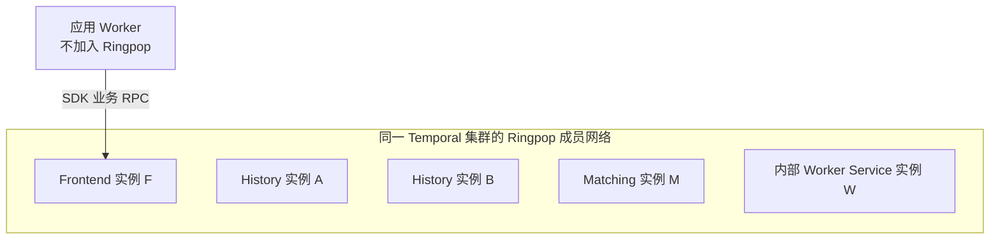
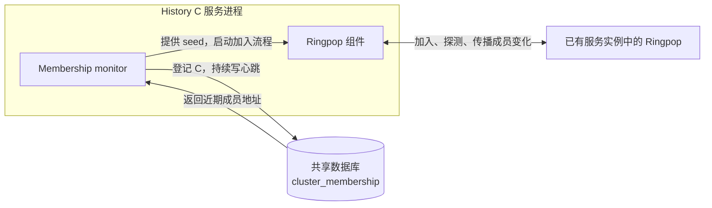
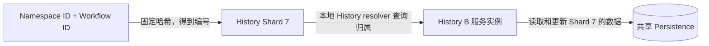
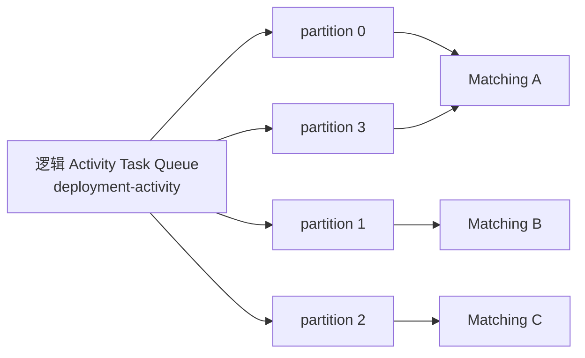
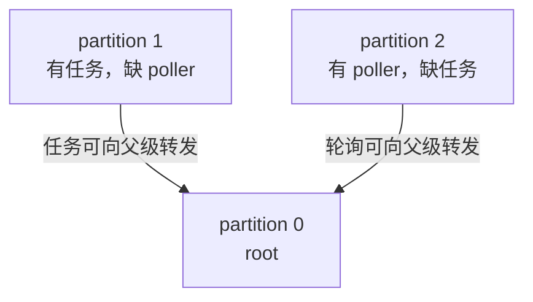

# Temporal 成员发现与分区：从找到其他节点到确定 owner

本文拆解 [Temporal 总览](./021_temporal.md) 中的成员关系与 Task Queue partition。先讲成员发现，再讲分配规则，最后讲两类分区和故障接管。以 Frontend、History、Matching、内部 Worker Service 分别部署为例；后文的 A、B、C 都表示服务实例，不表示数据库副本。

## 1. 成员发现：新实例怎样找到集群

### 1.1 先明确成员组的边界：各 Server 服务角色共同加入

在本文讨论的标准 Ringpop 部署中，**同一 Temporal 集群的 Frontend、History、Matching 和内部 Worker Service 实例，共同加入一个成员发现网络**。不是 History 单独建立一个发现组、Frontend 再建立另一个互不相通的发现组。

这里的“共同加入”表示各实例内的 Ringpop 参与同一个成员网络，不表示每个成员都必须与其他所有成员保持直接连接。



必须区分两层集合：

| 层次 | 谁在里面 | 作用 |
|---|---|---|
| 共同的成员发现网络 | 同一集群内各 Server 服务角色的实例 | 发现成员、传播成员状态和角色信息 |
| 按角色筛选的路由环 | 例如 History 环只包含 History 实例 | 为该服务的请求和分片计算目标实例 |

因此，Frontend F 可以帮助新 History 实例发现集群，但 F 不会因此进入 History 路由环，更不会获得 History Shard。角色通过 `serviceName` 等成员 label 标识，`serviceResolver` 再按目标角色筛选。

**应用 Worker 与内部 Worker Service 不同。** 运行你的 Workflow/Activity 代码的应用 Worker，以及业务调用方，都通过 SDK 连接 Frontend，不作为这个 Ringpop 网络的成员。上图中的 W 是 Temporal Server 的内部服务。

源码依据是：Membership `factory` 为各服务使用集群级的 Ringpop application name；`monitor` 查询 bootstrap 成员时不限定为本服务角色；各 `serviceResolver` 才按角色筛选成员。不同 Temporal 集群应保持各自的成员隔离，不能因为服务名称相同就混入一个成员网络。[factory.go](https://github.com/temporalio/temporal/blob/main/common/membership/ringpop/factory.go)、[monitor.go](https://github.com/temporalio/temporal/blob/main/common/membership/ringpop/monitor.go)、[service_resolver.go](https://github.com/temporalio/temporal/blob/main/common/membership/ringpop/service_resolver.go)。

### 1.2 再看新成员加入时需要解决的问题

假设这个共同成员网络中已经有 History A、History B、Frontend F、Matching M 和内部 Worker Service W，现在启动 History C。下面用 A、B、F 展示部分交互，其他成员同样属于该网络。

C 启动时首先需要知道：“其他服务实例的地址在哪里？我该联系谁加入集群？”加入之后，各实例还需要持续知道：“C 已加入了吗？A 是否仍然可达？”

这些属于**成员发现和成员状态维护**。此时还没有讨论 C 应该处理哪些 Workflow，也没有讨论任务队列怎样分区。

Temporal 把这个过程分成两段：

| 阶段 | 要解决的问题 | 使用什么 |
|---|---|---|
| 刚启动 | 我还不认识其他成员，先联系谁？ | 查询共享数据库中的近期成员记录，取得 seed 地址 |
| 加入之后 | 成员加入、离开或失联的变化怎样传播？ | 各实例中的 Ringpop 执行 SWIM 探测与 gossip |

seed 是“最初可以联系的成员地址”。它帮助新实例进入集群，并不是负责管理所有成员的 Leader。

### 1.3 每个实例内部都有一套 Membership 组件

成员发现由 Temporal 的公共 Membership 模块提供。History 有这套模块，Frontend、Matching 和内部 Worker Service 也有。

先只看 History C 内部的两个部分：

| 内部组件 | 在这个阶段做什么 |
|---|---|
| `monitor` | 把 C 的成员地址和心跳写入数据库，读取其他近期成员，启动 Ringpop 加入流程 |
| `ringpop-go` | 联系 seed，加入成员网络，在实例之间进行 SWIM 探测与 gossip |



**SWIM/gossip 的直接执行者是 Ringpop。** `monitor` 负责启动和管理它；History 的业务执行组件及 `ShardController` 不执行 SWIM 探测。Ringpop 是嵌入服务实例的库，不是额外部署的一台“成员管理服务器”。

### 1.4 第一步：通过数据库取得 seed

**一个 seed 就是一个可以尝试联系的 Ringpop 成员地址，例如 `10.0.0.11:6934`。** seed 列表就是这样的地址集合，用于新实例第一次加入成员网络。

先看一组具体数据。假设当前时间为 `10:00:30`，History C 正在启动，数据库里有以下成员记录。表格是便于阅读的简化展示，省略了 Host ID、会话等字段；地址和端口均为示例配置。

| 实例 | 服务角色 | 成员通信 IP | MembershipPort | 最近数据库心跳 |
|---|---|---|---|---|
| History A | history | `10.0.0.11` | `6934` | `10:00:24` |
| History B | history | `10.0.0.12` | `6934` | `10:00:22` |
| Frontend F | frontend | `10.0.0.21` | `6933` | `10:00:25` |
| 旧 History D | history | `10.0.0.14` | `6934` | `09:58:00` |

C 的 monitor 查询最近约 20 秒有心跳的记录，取出地址并拼接端口，得到下面这部分 seed 列表：

```text
seed addresses = [
    "10.0.0.11:6934",  // History A 的 Ringpop 地址
    "10.0.0.12:6934",  // History B 的 Ringpop 地址
    "10.0.0.21:6933"   // Frontend F 的 Ringpop 地址
]
```

D 的心跳太旧，本次不会入选。这里仅展示已有成员的记录；实际查询还可能包含 C 刚登记的自身地址及其他近期成员，不能把示例列表理解为固定配置或完整返回值。

然后，monitor 把这些字符串交给 Ringpop 的 Bootstrap。假设 Ringpop 联系到了 `10.0.0.21:6933`：

```text
History C 内部的 Ringpop
  → 联系 10.0.0.21:6933
  → 对端是 Frontend F 内部的 Ringpop
  → 通过加入流程取得成员信息，进入共同成员网络
  → 后续由成员探测与 gossip 更新本地成员视图
```

这里联系的是 F 的 **MembershipPort**，不是业务 Client 用来启动 Workflow 的 `7233` 端口。F 在这次加入过程中提供了一个入口，不会因此成为 C 的上级或负责给 C 分配 Shard。C 也不需要在每个业务请求前重新联系这个 seed。

seed 地址来自近期记录，仍可能因为实例刚好退出或网络中断而联系失败；它是加入时的候选联系地址，不是“这个成员必定在线”的保证。Bootstrap 会结合候选地址和重试机制尝试加入，单凭取得列表还不能认为加入已成功。

History C 启动后的流程是：

1. C 的 `monitor` 通过 `ClusterMetadataManager` 向 `cluster_membership` 登记自身的成员地址、角色、会话和心跳信息。
2. C 查询近期仍有心跳的成员，取得一批可以尝试联系的地址。
3. `monitor` 把这些地址交给 Ringpop，调用 Bootstrap 加入集群。
4. C 后续仍定期更新自己的数据库心跳，以便以后启动的实例发现它。

当前代码的数据库心跳周期约为 10 秒，带 0～5 秒抖动；bootstrap 查询只采用最近约 20 秒有心跳的记录。表中一条记录还没被清理，不表示对应实例当前一定可达。

seed 可以来自其他服务角色。例如 History C 可以通过已有 Frontend 的 Ringpop 加入成员网络；不要求先找到另一个 History。角色是在后续构建服务路由视图时才用于筛选的。

这一步的数据库相当于提供**初次联系地址**。数据库不向 C 下发 Shard 分配，也不要求 C 对每个业务请求都先查询成员表。实现见 [monitor.go](https://github.com/temporalio/temporal/blob/main/common/membership/ringpop/monitor.go) 的 `startHeartbeat`、`fetchCurrentBootstrapHostports` 和 `bootstrapRingPop`。

### 1.5 第二步：SWIM 探测与 gossip 维护成员视图

加入后，每个实例内部的 Ringpop 都维护自己的成员视图。为了便于理解，可以把它想成一份本地名单：

```text
History C 内部看到的成员：
  History A：可达
  History B：可达
  History C：自身
  Frontend F：可达
  Matching M：可达
  内部 Worker Service W：可达
```

这里是概念示意，不是 Ringpop 的实际存储结构。

SWIM 的探测机制用来发现成员是否可能失联；gossip 用来把成员变化逐步传播给其他成员。两者配合，持续修正各实例的本地名单。本节只说明协议职责，不展开具体报文和定时器实现。

假设 A 突然断电，变化不会在同一个瞬间被所有实例知道。下表只列各自成员视图中的 History 部分；其他服务角色仍属于同一个成员网络：

| 时刻 | B 的本地视图 | C 的本地视图 |
|---|---|---|
| 故障前 | A、B、C 可达 | A、B、C 可达 |
| 探测和传播过程中 | 已把 A 排除出可达集合 | 暂时仍把 A 视为可达 |
| 信息传播并收敛后 | B、C 可达 | B、C 可达 |

这就是后文出现“不同节点短暂算出不同 owner”的原因：它们使用的成员名单暂时不同。

**成员视图的收敛不是 Raft 式多数派日志提交。** Ringpop 不是先组织一次“全体成员对 Shard 7 的 owner 投票”，再发布一个强一致的分配结果。成员探测也可能受到网络故障影响，所以数据写入安全还需要另一层机制。

### 1.6 数据库心跳与成员间探测不要混淆

| 对比项 | monitor 的数据库心跳 | Ringpop 的探测与 gossip |
|---|---|---|
| 谁发起 | 每个实例内部的 monitor | 每个实例内部的 Ringpop |
| 发给谁 | 共享 Persistence | 其他服务实例中的 Ringpop |
| 主要用途 | 使自己可被新实例发现，提供 seed 记录 | 持续维护运行时成员视图 |
| 是否负责分配 Shard | 否 | 不直接分配；它提供计算所需的成员信息 |

Ringpop 通信使用配置中的 `MembershipPort`；服务处理业务请求使用自己的 RPC 端口。源码里 `factory` 创建 TChannel 通道并交给 Ringpop，不能把成员探测流量理解为 Workflow 请求。创建过程见 [factory.go](https://github.com/temporalio/temporal/blob/main/common/membership/ringpop/factory.go)。

## 2. 从成员名单到 owner：谁决定由哪台实例处理

### 2.1 成员发现只回答“有哪些实例”

现在 C 已经知道 A、B、C 三个 History 实例。还剩一个问题：“Shard 7 到底由谁处理？”

如果每次随机挑一个 History，不同请求可能同时去不同节点。Temporal 因此需要一个确定性的分配规则：**对相同的成员集合和相同的 key，独立计算出相同的实例。**

这由 `serviceResolver` 维护的一致性哈希环完成。

### 2.2 每个实例都在本地按服务角色建立 resolver

公共成员网络包含不同服务角色，但处理 Workflow 状态只能找 History。因此 `serviceResolver` 从 Ringpop 的成员信息中筛选目标角色，再维护本地路由环。

例如 Frontend F 内部可以有：

```text
Frontend F
  Ringpop：维护各角色的成员信息
  History resolver：只用 History 成员构建路由环
  Matching resolver：只用 Matching 成员构建路由环
```

“History resolver”的含义是“用来查找 History 实例的 resolver”，不是“只存在于 History 进程里的 resolver”。Frontend 需要它来发请求，History 自己也需要它来判断本机应该持有哪些 Shard。

### 2.3 一致性哈希是分配算法，不是成员共识协议

可以暂时把一致性哈希查询理解为下面这个函数：

```text
Lookup(当前成员集合, key) → 一个服务实例
```

底层通过哈希环和虚拟节点完成放置；本文先关注它的输入和输出。成员增加或减少后，部分 key 会重新映射，从而重新分配工作。分配不要求每台机器恰好拿到相同数量的 key。

| 使用者 | 本地 History 成员集合 | 查询 | 示例结果 |
|---|---|---|---|
| Frontend F | A、B、C | Lookup("7") | B |
| History A | A、B、C | Lookup("7") | B |
| History B | A、B、C | Lookup("7") | B |

表中的 B 是示例结果，不是由编号 7 必然推导出的固定答案。关键是：成员视图和配置相同，查询相同 key，就会得到相同结果。

整个过程没有一个中心节点把“Shard 7 分给 B”的指令发送给大家。各实例使用相同规则在本地计算。代码见 [service_resolver.go](https://github.com/temporalio/temporal/blob/main/common/membership/ringpop/service_resolver.go) 的 `Lookup`、`HandleEvent` 和成员刷新逻辑。

## 3. History Shard：把 Workflow 状态管理工作分成多份

### 3.1 先区分分片、实例和数据库

假设有大量 Workflow，需要多个 History 实例共同管理。Temporal 先把 Workflow 按固定规则分到 N 个逻辑 Shard，再把这些 Shard 分配给当前的 History 实例。



这里是两次不同的映射：

1. **Workflow → Shard ID**：由 Workflow 的标识和固定 Shard 总数决定。
2. **Shard ID → History 实例**：由当前 History 成员环决定。

增加 History 实例通常改变第二次映射，不改变第一次映射，也不要求把 Workflow 的数据库记录搬到新机器。

### 3.2 一个具体的数据例子

假设 `change-42` 算出的 Shard ID 为 7，目前 Shard 7 的 owner 是 History B。

| 内容 | 保存位置 |
|---|---|
| Shard 7 的 RangeID 和队列进度 | Persistence 的 `shards` 记录 |
| `change-42` 的 Mutable State | Persistence 的执行状态记录 |
| `change-42` 的 Event History | Persistence 的历史记录 |
| 正在访问的状态缓存 | 当前 owner B 的内存 |

B 是“当前负责管理这批状态的进程”，不是“唯一保存这批数据的磁盘”。Shard 也不是一台数据库服务器。不同数据库后端的物理组织不同，具体表关系见 [总览的存储映射说明](./021_temporal.md)。

### 3.3 成员变化后，History 的哪个组件采取行动

到这里再看内部组件就容易区分：

```text
History B 进程内部
  Ringpop：获知成员变化
      ↓
  History serviceResolver：更新本地哈希环，发出 ChangedEvent
      ↓
  ShardController 的 ownership：收到事件，触发归属检查
      ↓
  ShardController.acquireShards：加载应归本机的 Shard，关闭不再归本机的 Shard
      ↓
  Shard Context：访问 Persistence，取得写入代际并加载状态
```

`ownership` 通过 `AddListener("ShardController", ...)` 订阅 resolver；除了响应事件，还会周期性检查。检查某个 Shard 时，调用 `Lookup` 并将返回的 owner 与本机身份比较。它消费成员信息，不执行 SWIM 探测。代码见 [ownership.go](https://github.com/temporalio/temporal/blob/main/service/history/shard/ownership.go) 和 [controller_impl.go](https://github.com/temporalio/temporal/blob/main/service/history/shard/controller_impl.go)。

### 3.4 Frontend 怎样把请求发给 B

Frontend 不需要先请求 History A 帮忙找 owner。它内部的 History Client 路由逻辑先算 Shard ID，再查询本地 History resolver，得到 B 的 RPC 地址，然后向 B 发业务请求。

```text
Frontend F 收到 change-42 的请求
  → 算出 Shard 7
  → 查询 F 内部的 History resolver
  → 得到 History B 的 RPC 地址
  → 向 History B 发请求
```

这个查询是本地内存查询，不是向一台独立的“哈希环服务器”发送 RPC。

## 4. 成员名单暂时不同，为什么不会允许旧 owner 任意写入

### 4.1 “算出应该归我”与“取得写入资格”是两件事

假设 Shard 7 原来归 A，数据库的 `range_id = 101`。网络异常后，B 的成员视图排除了 A，算出 Shard 7 应该归 B；A 却可能仍认为自己是 owner。

仅靠哈希环无法解决这个冲突。因此 B 接管时，还要在 Persistence 中条件更新 Shard 元数据，取得新的 `RangeID`。可以把它理解为数据库认可的写入代际编号。

| 阶段 | 数据库当前 RangeID | A 携带的代际 | B 携带的代际 |
|---|---|---|---|
| 接管前 | 101 | 101 | 尚未取得 |
| B 成功接管后 | 102 | 101，已过期 | 102 |

受该所有权检查保护的状态更新必须匹配数据库当前代际。B 接管后，A 的旧代际写入会被拒绝；A 需要停止使用旧 Shard Context。

这不意味着网络分区期间没有错误或重试，也不意味着 A 永远不能在未来重新接管。它保证的是：**旧任期不能继续以过期代际更新当前状态。** 接管实现见 [context_impl.go](https://github.com/temporalio/temporal/blob/main/service/history/shard/context_impl.go)。

### 4.2 三层机制各自负责什么

| 层次 | 负责回答的问题 | 机制 |
|---|---|---|
| 成员发现与传播 | 当前看来有哪些可达实例？ | 数据库 seed + Ringpop SWIM/gossip |
| 确定性放置 | 按这份名单，这个 key 应交给谁？ | 各实例本地的 serviceResolver 哈希环 |
| 写入隔离 | 这个写请求是否属于数据库认可的代际？ | RangeID 与 Persistence 条件更新 |

“成员一致性协议”这个说法容易把三层混为一谈。更准确地说，成员视图逐步收敛，放置算法根据视图计算，数据库执行写入隔离。

## 5. Task Queue partition：把任务匹配工作分成多份

### 5.1 为什么已经有 History Shard，还需要另一种分区

History 管理 Workflow 的状态，Matching 把待执行任务交给应用 Worker。它们处理的是不同工作，也可能遇到不同瓶颈。

假设很多 Workflow 都往 `deployment-activity` 队列投递 Activity，同时有很多 Worker 轮询这个队列。如果整个队列的匹配都由一个 Matching 实例处理，其他 Matching 实例就难以分担这部分负载。

Temporal 因此把一个逻辑 Task Queue 拆成多个内部 partition，让多个 Matching 实例共同提供这个队列的服务。

### 5.2 Queue、partition、Matching 实例分别是什么

| 名称 | 在例子里的含义 |
|---|---|
| 逻辑 Task Queue | 应用配置的 `deployment-activity` |
| Task Type | 任务类型；此处是 Activity Task，即要求 Worker 真正执行某个 Activity 函数的任务 |
| partition | 这个逻辑队列内部的一部分匹配与积压管理工作 |
| Matching owner | 当前负责这个 partition 的 Matching 实例 |
| 应用 Worker | 轮询逻辑队列，并真正执行 Activity 代码的进程 |

**队列名相同，不表示两种任务混放在一个队列里。** 假设应用在 `production-ops` Namespace 中创建一个 Worker，配置队列名为 `deployment-activity`，同时注册 Workflow 和 Activity。这个名字由应用任意指定，名字中带有 `activity` 也不会限制它只能用于 Activity。

Matching 在内部用任务类型进一步区分：

| Namespace | 应用配置的队列名 | Task Type | 里面放什么任务 |
|---|---|---|---|
| `production-ops` | `deployment-activity` | Workflow | 请运行或恢复某个 Workflow，计算下一步，例如决定安排 DeployCanary |
| `production-ops` | `deployment-activity` | Activity | 请真正执行 DeployCanary 函数，调用发布接口 |

上面是两个按任务类型区分的逻辑队列。它们共享应用配置的名字，但分别接收任务和处理轮询，并可各自划分 partition。

```text
应用 Worker 配置队列名 deployment-activity，并注册两种代码
  → Workflow Task 轮询：领取“运行流程、计算下一步”的任务
  → Activity Task 轮询：领取“执行 Activity 函数”的任务
```

SDK 使用不同类型的轮询请求，Matching 据此返回对应类型的任务。因此同一个 Worker 进程可以同时承担两种角色，不需要先从一个混合队列取到任务再猜它属于哪种类型。

所以，一个逻辑队列的身份至少包含 **Namespace + 队列名 + Task Type**。下面的分区图只展开表格第二行，也就是 Activity Task Queue；第一行的 Workflow Task Queue 不在这张图中。这里不展开 sticky 队列、版本化物理队列和 Nexus 等特殊路径。

假设该队列配置了四个 partition，可能有如下分配：



四个 partition 不要求四台机器，也不表示每个任务有四份副本。应用 Worker 通常只配置逻辑队列名，内部路由再选择 partition 和 Matching owner。

### 5.3 partition 的 owner 也由本地 resolver 算出来

**Task Queue 的 partition 数量可以调整，不像 History Shard 总数那样在集群初始化后固定。** 分区数量和分区归属是两个独立的问题：

| 要改变什么 | 例子 | 由什么决定 |
|---|---|---|
| 一个队列使用多少个 partition | 从 4 个调整为 8 个 | Task Queue 的分区配置及当前版本的分区管理机制 |
| 某个 partition 由哪个 Matching 实例管理 | partition 2 从 Matching B 转到 Matching C | Matching resolver 根据成员环计算 |

例如，原来一个 Activity Task Queue 使用 `partition 0..3`，调整为 8 个后，可以使用 `partition 0..7`。每个 partition 再根据自己的内部 key 查找 owner；这 8 个 partition 可以分配在 3 个 Matching 实例上，并不要求启动 8 台机器。应用 Worker 仍然轮询原来的逻辑队列名。

反过来，仅把 Matching 实例从 3 个扩到 5 个，也不等于显式把队列分区数改成 5；成员变化首先影响的是 owner 分配。

实现中还分别记录**写分区数**和**读分区数**，控制投递和轮询的分区范围。服务端动态配置包含 `matching.numTaskqueueWritePartitions` 和 `matching.numTaskqueueReadPartitions`。它们解释了为什么前文分别说“写 partition”和“读 partition”；不能把一个队列简单理解成只有一个永远不变的分区数字。

调整尤其是缩减分区时，需要按所用版本的机制处理旧分区中的 backlog 和读写范围过渡；“可以调整”不表示可以立即删除旧分区的数据。这里先说明可变性，不把示例当成生产变更步骤。[动态配置定义](https://github.com/temporalio/temporal/blob/main/common/dynamicconfig/constants.go)、[读写分区计数结构](https://github.com/temporalio/temporal/blob/main/client/matching/partition_counts.go)。

这里复用前面已经解释过的机制，只是 key 和目标服务角色不同：

```text
History Shard：Shard ID → History resolver → History 实例
Task Queue partition：内部 partition key → Matching resolver → Matching 实例
```

因此两类分区没有一一对应关系。Shard 7 产生的任务可以被投递到不同 Task Queue；同一个 Task Queue 也可以接收来自很多 History Shard 的任务。

### 5.4 一条任务怎样遇到一个 Worker

以 `DeployCanary` Activity 为例：

1. History 持久化流程变化，并通过内部任务处理路径向 Matching 投递 Activity Task。
2. Matching Client 的路由逻辑选择写入 partition，并找到其当前 Matching owner。
3. 应用 Worker 发起轮询，请求经 Frontend 和 Matching Client 路由到某个读取 partition 的 owner。
4. 如果任务和等待中的 poller 能直接匹配，Matching 就把任务交给 Worker。
5. 如果暂时没有合适的 poller，普通 Activity 任务可以形成持久化 backlog，之后再交付。

“写 partition”和“读 partition”描述两条请求路径各自选中了哪里，不表示队列有两套完全独立的数据副本。相关路由代码位于本地 `tmp/temporal/client/matching/`。

### 5.5 任务和 Worker 落在不同 partition 怎么办

假设 partition 1 有任务却没有等待者，partition 2 有等待者却没有任务。Temporal 允许任务和轮询沿 partition 的父子关系向父 partition 转发，增加两者相遇的机会。



这是转发方向的示意，不表示所有任务都必须绕 root，也不保证两条请求一定在这一次同步匹配。partition 较少时，child 通常直接连 root；更多 partition 可以形成多层树。

### 5.6 Matching owner 失效后恢复什么

partition 的元数据和持久 backlog 在共享 Persistence 中，当前 owner 的内存中还维护等待者及匹配状态。

如果 Matching B 故障：

1. 成员变化传播，各实例更新本地 Matching resolver。
2. 原来映射到 B 的 partition 重新映射到其他 Matching 实例。
3. 新 owner 取得对应队列写入代际，并从 Persistence 加载元数据和 backlog。
4. 原连接上的长轮询通过超时或错误结束，Worker 重试后连到新的 owner；旧进程内存中的 poller 不会被复制过去。

已经交给应用 Worker 执行的 Activity，还涉及任务完成、超时和重试机制，不能只用 Matching partition 的迁移来解释。

普通队列的持久化涉及 `task_queues*`、`tasks*` 等结构，具体表名随后端和版本而变。架构说明见 [Matching Service](https://github.com/temporalio/temporal/blob/main/docs/architecture/matching-service.md)。

## 6. 把两类分区放在一起对照

| 对比项 | History Shard | Task Queue partition |
|---|---|---|
| 分担什么负载 | Workflow 状态管理和内部任务处理 | 向应用 Worker 匹配和分发任务 |
| 由哪个服务管理 | History | Matching |
| 第一层归类 | Workflow 标识算出 Shard ID | 逻辑队列内部选择 partition |
| owner 查询 | History resolver | Matching resolver |
| 数量 | History Shard 总数在集群初始化时确定 | 普通逻辑队列的分区数可配置；默认架构说明为 4 |
| 扩容时主要改变 | Shard 到 History 实例的归属 | partition 到 Matching 实例的归属 |
| 可靠数据在哪里 | Persistence | Persistence；内存等待者需重新建立 |
| 是否是机器之间的复制组 | 否 | 否 |

最后用一个流程把两者串起来：

```text
Workflow change-42
  → 属于 History Shard 7
  → 当前由 History B 管理状态
  → 产生 DeployCanary Activity Task
  → 投递到 deployment-activity 的某个 partition
  → 由该 partition 的 Matching owner 完成匹配
  → 应用 Worker 执行 DeployCanary
```

Task Queue partition 不提供严格的业务执行顺序：多个 partition、多个 Worker 和重试都可能改变实际顺序。即使只用一个 partition，也不能仅凭入队顺序保证多个并发任务按顺序完成。必须先完成 A 再执行 B 的业务关系，应由 Workflow 明确表达。

## 7. 看源码时按职责找文件

先理解前面的行为，再按问题进入源码，避免一开始把所有内部对象放进一张图。

| 想确认的问题 | Temporal 本地路径（相对 `tmp/temporal`） |
|---|---|
| Ringpop 对象和通信端口在哪创建 | `common/membership/ringpop/factory.go` |
| 谁写数据库心跳、查询 seed | `common/membership/ringpop/monitor.go` |
| 谁筛选角色、维护哈希环、通知变化 | `common/membership/ringpop/service_resolver.go` |
| History 谁订阅变化并验证归属 | `service/history/shard/ownership.go` |
| 谁加载和关闭 Shard | `service/history/shard/controller_impl.go` |
| 谁取得 RangeID、管理 Shard 状态 | `service/history/shard/context_impl.go` |
| Task Queue 请求怎样选择 partition | `client/matching/` |
| partition 怎样匹配和持久化 | `service/matching/` |

Temporal 的 `common/membership/ringpop/` 是集成层。SWIM/gossip 的库实现位于独立仓库 [temporalio/ringpop-go](https://github.com/temporalio/ringpop-go)，本地 Temporal 的 `go.mod` 引用 v0.1.0；需要继续研究协议报文时，再沿该依赖进入其 `swim` 包。

本文是架构和源码阅读说明，不是网络分区故障实验记录。继续阅读整体执行链路和故障接管，可返回 [021_temporal.md](./021_temporal.md)。
