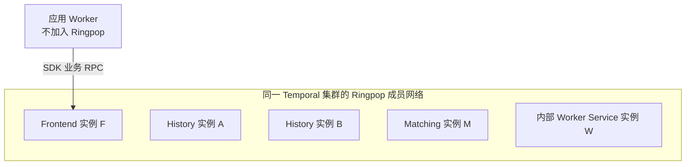
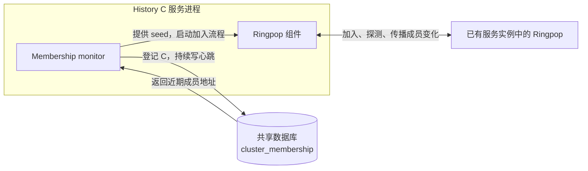
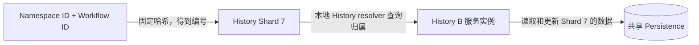
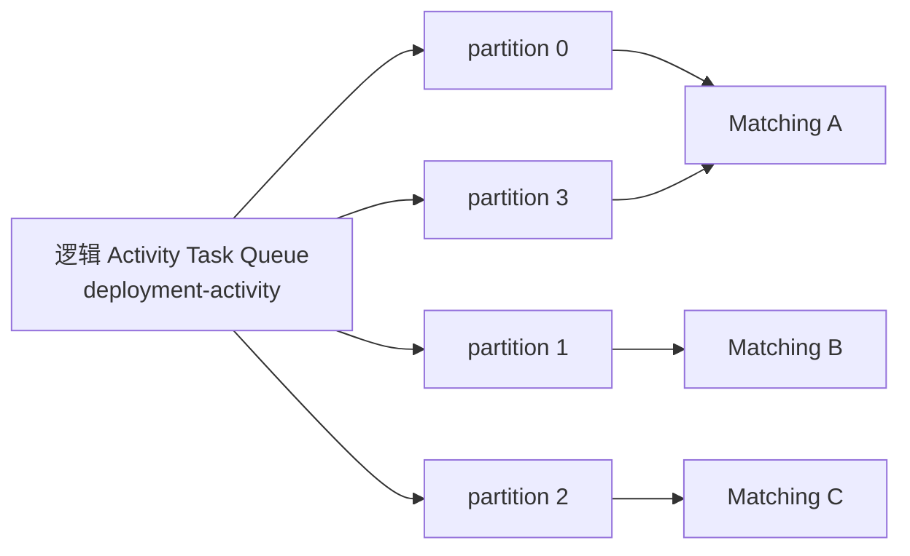
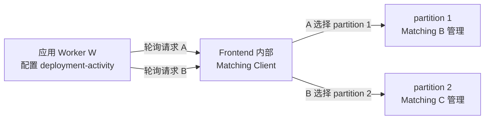
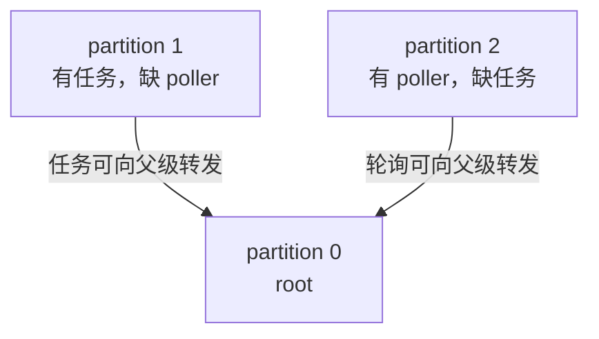

# Temporal 成员发现与分区：从找到其他节点到确定 owner

本文解释 Temporal 如何发现服务实例、计算工作归属，并在实例失效后接管工作。阅读顺序是：成员发现 → 本地路由 → History 状态分片 → 写入隔离 → Matching 队列分区。Workflow 与应用 Worker 的执行交互见 [Temporal 总览](./021_temporal.md)。全文以各 Server 服务分别部署为例，A、B、C 表示服务实例。

## 1. 成员发现：新实例怎样找到集群

### 1.1 成员网络的边界

在标准 Ringpop 部署中，**同一 Temporal 集群的 Frontend、History、Matching 和内部 Worker Service 实例，共同加入一个成员发现网络**。成员携带服务角色，供后续路由时筛选。



必须区分两层集合：

| 层次 | 谁在里面 | 作用 |
|---|---|---|
| 共同的成员发现网络 | 同一集群内各 Server 服务角色的实例 | 发现成员、传播成员状态和角色信息 |
| 按角色筛选的路由环 | 例如 History 环只包含 History 实例 | 为该服务的请求和分片计算目标实例 |

因此，Frontend F 可以作为新 History 实例加入网络的入口；实际处理 History 工作时，路由只选择 History 成员。

**应用 Worker 与内部 Worker Service 不同。** 运行你的 Workflow/Activity 代码的应用 Worker，以及业务调用方，都通过 SDK 连接 Frontend，不作为这个 Ringpop 网络的成员。上图中的 W 是 Temporal Server 的内部服务。

实现上，各服务使用集群级的 Ringpop application name；bootstrap 查询不限定服务角色，路由时再按角色筛选。[factory.go](https://github.com/temporalio/temporal/blob/main/common/membership/ringpop/factory.go)、[monitor.go](https://github.com/temporalio/temporal/blob/main/common/membership/ringpop/monitor.go)、[service_resolver.go](https://github.com/temporalio/temporal/blob/main/common/membership/ringpop/service_resolver.go)。

### 1.2 新实例加入与运行中的成员维护

假设这个共同成员网络中已经有 History A、History B、Frontend F、Matching M 和内部 Worker Service W，现在启动 History C。

C 启动时首先需要知道：“其他服务实例的地址在哪里？我该联系谁加入集群？”加入之后，各实例还需要持续知道：“C 已加入了吗？A 是否仍然可达？”

Temporal 把这个过程分成两段：

| 阶段 | 要解决的问题 | 使用什么 |
|---|---|---|
| 刚启动 | 我还不认识其他成员，先联系谁？ | 查询共享数据库中的近期成员记录，取得 seed 地址 |
| 加入之后 | 成员加入、离开或失联的变化怎样传播？ | 各实例中的 Ringpop 执行 SWIM 探测与 gossip |

seed 是加入时可尝试联系的成员地址，具体数据见 1.4 节。

### 1.3 每个实例内部都有一套 Membership 组件

成员发现由 Temporal 的公共 Membership 模块提供。History 有这套模块，Frontend、Matching 和内部 Worker Service 也有。

先只看 History C 内部的两个部分：

| 内部组件 | 在这个阶段做什么 |
|---|---|
| `monitor` | 把 C 的成员地址和心跳写入数据库，读取其他近期成员，启动 Ringpop 加入流程 |
| `ringpop-go` | 联系 seed，加入成员网络，在实例之间进行 SWIM 探测与 gossip |



**SWIM/gossip 的直接执行者是进程内的 Ringpop，monitor 负责启动和管理它。** History 的业务状态管理组件消费这套基础设施提供的成员信息。

### 1.4 第一步：通过数据库取得 seed

**一个 seed 就是一个可以尝试联系的 Ringpop 成员地址，例如 `10.0.0.11:6934`。** seed 列表就是这样的地址集合，用于新实例第一次加入成员网络。

History C 启动时，monitor 先登记自身，再查询数据库中的近期成员。假设当前时间为 `10:00:30`，以下是已有成员记录的示例，地址和端口均为示例配置：

| 实例 | 服务角色 | 成员通信 IP | MembershipPort | 最近数据库心跳 |
|---|---|---|---|---|
| History A | history | `10.0.0.11` | `6934` | `10:00:24` |
| History B | history | `10.0.0.12` | `6934` | `10:00:22` |
| Frontend F | frontend | `10.0.0.21` | `6933` | `10:00:25` |
| 旧 History D | history | `10.0.0.14` | `6934` | `09:58:00` |

C 的 monitor 查询最近约 20 秒有心跳的记录，取出地址并拼接端口，得到下面这部分 seed 列表：

```text
seed addresses = [
    "10.0.0.11:6934",  // History A 的 Ringpop 地址
    "10.0.0.12:6934",  // History B 的 Ringpop 地址
    "10.0.0.21:6933"   // Frontend F 的 Ringpop 地址
]
```

D 的心跳太旧，本次不会入选。实际列表还可能包含 C 刚登记的自身地址和其他近期成员。

然后，monitor 把这些字符串交给 Ringpop 的 Bootstrap。假设 Ringpop 联系到了 `10.0.0.21:6933`：

```text
History C 内部的 Ringpop
  → 联系 10.0.0.21:6933
  → 对端是 Frontend F 内部的 Ringpop
  → 通过加入流程取得成员信息，进入共同成员网络
  → 后续由成员探测与 gossip 更新本地成员视图
```

C 联系的是 F 的 **MembershipPort**，与业务 Client 使用的 `7233` 端口分开。加入后，C 通过成员间通信维护视图，不需要在每个业务请求前重新联系 seed。

近期记录不保证地址此刻可达，Bootstrap 仍需尝试连接和重试。加入后，monitor 继续每隔约 10～15 秒写数据库心跳，供后来启动的实例发现自己。实现见 [monitor.go](https://github.com/temporalio/temporal/blob/main/common/membership/ringpop/monitor.go) 的 `startHeartbeat`、`fetchCurrentBootstrapHostports` 和 `bootstrapRingPop`。

### 1.5 第二步：SWIM 探测与 gossip 维护成员视图

加入后，每个实例内部的 Ringpop 都维护自己的成员视图。为了便于理解，可以把它想成一份本地名单：

```text
History C 内部看到的成员：
  History A：可达
  History B：可达
  History C：自身
  Frontend F：可达
  Matching M：可达
  内部 Worker Service W：可达
```

SWIM 的探测机制用来发现成员是否可能失联；gossip 用来把成员变化逐步传播给其他成员。两者配合，持续修正各实例的本地名单。

假设 B 失联，变化不会在同一个瞬间被所有实例知道。下表只列各自成员视图中的 History 部分：

| 时刻 | A 的本地视图 | C 的本地视图 |
|---|---|---|
| 故障前 | A、B、C 可达 | A、B、C 可达 |
| 探测和传播过程中 | 暂时仍把 B 视为可达 | 已把 B 排除出可达集合 |
| 信息传播并收敛后 | A、C 可达 | A、C 可达 |

这就是后文出现“不同节点短暂算出不同 owner”的原因：它们使用的成员名单暂时不同。

**这里提供的是逐步收敛的成员视图，不是 Raft 式多数派日志提交。** 网络故障可能让视图暂时分歧，因此数据写入还需要第 4 节的代际隔离。

### 1.6 数据库心跳与成员间探测不要混淆

| 对比项 | monitor 的数据库心跳 | Ringpop 的探测与 gossip |
|---|---|---|
| 谁发起 | 每个实例内部的 monitor | 每个实例内部的 Ringpop |
| 发给谁 | 共享 Persistence | 其他服务实例中的 Ringpop |
| 主要用途 | 使自己可被新实例发现，提供 seed 记录 | 持续维护运行时成员视图 |
| 是否负责分配 Shard | 否 | 不直接分配；它提供计算所需的成员信息 |

Ringpop 通信使用配置中的 `MembershipPort`；服务处理业务请求使用自己的 RPC 端口。源码里 `factory` 创建 TChannel 通道并交给 Ringpop，不能把成员探测流量理解为 Workflow 请求。创建过程见 [factory.go](https://github.com/temporalio/temporal/blob/main/common/membership/ringpop/factory.go)。

## 2. 从成员名单到 owner：谁决定由哪台实例处理

### 2.1 成员发现只回答“有哪些实例”

现在 C 已经知道 A、B、C 三个 History 实例。接下来需要确定每份工作交给谁。下文把“当前负责某份工作的实例”称为 owner；用 `work-key` 表示这份工作的路由标识。

为了让针对同一份工作的请求找到同一个负责人，Temporal 使用确定性的分配规则：**对相同的成员集合和相同的 key，独立计算出相同的实例。**

这由 `serviceResolver` 维护的一致性哈希环完成。

### 2.2 每个实例都在本地按服务角色建立 resolver

公共成员网络包含不同服务角色，但处理 Workflow 状态只能找 History。因此 `serviceResolver` 从 Ringpop 的成员信息中筛选目标角色，再维护本地路由环。

例如 Frontend F 内部可以有：

```text
Frontend F
  Ringpop：维护各角色的成员信息
  History resolver：只用 History 成员构建路由环
  Matching resolver：只用 Matching 成员构建路由环
```

“History resolver”的含义是“用来查找 History 实例的 resolver”，不是“只存在于 History 进程里的 resolver”。Frontend 需要它来发请求，History 自己也需要它来判断本机应该持有哪些 Shard。

### 2.3 用同一规则独立计算 owner

可以暂时把一致性哈希查询理解为下面这个函数：

```text
Lookup(当前成员集合, key) → 一个服务实例
```

底层通过哈希环和虚拟节点完成放置。成员增加或减少后，部分 key 会重新映射，从而重新分配工作。分配不要求每台机器恰好拿到相同数量的 key。

| 使用者 | 本地 History 成员集合 | 查询 | 示例结果 |
|---|---|---|---|
| Frontend F | A、B、C | Lookup("work-key") | B |
| History A | A、B、C | Lookup("work-key") | B |
| History B | A、B、C | Lookup("work-key") | B |

假设该 key 映射到 B，只要成员视图和配置相同，各实例就都算出 B。

各实例在本地完成计算，不需要中心节点逐项下发分配指令。代码见 [service_resolver.go](https://github.com/temporalio/temporal/blob/main/common/membership/ringpop/service_resolver.go) 的 `Lookup`、`HandleEvent` 和成员刷新逻辑。

## 3. History Shard：把 Workflow 状态管理工作分成多份

### 3.1 先区分分片、实例和数据库

假设有大量 Workflow，需要多个 History 实例共同管理。Temporal 先把 Workflow 按固定规则分到 N 个逻辑 Shard，再把这些 Shard 分配给当前的 History 实例。



这里是两次不同的映射：

1. **Workflow → Shard ID**：由 Workflow 的标识和固定 Shard 总数决定。
2. **Shard ID → History 实例**：由当前 History 成员环决定。

增加 History 实例通常改变第二次映射，不改变第一次映射，也不要求把 Workflow 的数据库记录搬到新机器。

### 3.2 一个具体的数据例子

假设 `change-42` 算出的 Shard ID 为 7，目前 Shard 7 的 owner 是 History B。

| 内容 | 保存位置 |
|---|---|
| Shard 7 的 RangeID 和队列进度 | Persistence 的 `shards` 记录 |
| `change-42` 的 Mutable State | Persistence 的 `executions` 等记录 |
| `change-42` 的 Event History | Persistence 的 `history_node/history_tree` 等记录 |
| 正在访问的状态缓存 | 当前 owner B 的内存 |

上表以 PostgreSQL 表名为例。B 管理这批状态并缓存热点数据，权威数据保存在共享 Persistence。换一个 owner 后，新实例仍访问这些持久化记录。

### 3.3 成员变化后，History 的哪个组件采取行动

成员变化沿以下路径触发本机 Shard 的重新检查：

```text
History B 进程内部
  Ringpop：获知成员变化
      ↓
  History serviceResolver：更新本地哈希环，发出 ChangedEvent
      ↓
  ShardController 的 ownership：收到事件，触发归属检查
      ↓
  ShardController.acquireShards：加载应归本机的 Shard，关闭不再归本机的 Shard
      ↓
  Shard Context：访问 Persistence，取得写入代际并加载状态
```

`ownership` 通过 `AddListener("ShardController", ...)` 订阅 resolver；除了响应事件，还会周期性检查。检查某个 Shard 时，调用 `Lookup` 并将返回的 owner 与本机身份比较。它消费成员信息，不执行 SWIM 探测。代码见 [ownership.go](https://github.com/temporalio/temporal/blob/main/service/history/shard/ownership.go) 和 [controller_impl.go](https://github.com/temporalio/temporal/blob/main/service/history/shard/controller_impl.go)。

### 3.4 Frontend 怎样把请求发给 B

Frontend 内部的 History Client 先算 Shard ID，再查询本地 History resolver，得到 B 的 RPC 地址，然后向 B 发业务请求。

```text
Frontend F 收到 change-42 的请求
  → 算出 Shard 7
  → 查询 F 内部的 History resolver
  → 得到 History B 的 RPC 地址
  → 向 History B 发请求
```

resolver 查询发生在本地内存中，只有最终的业务请求通过 RPC 发给 B。

## 4. 成员名单暂时不同，为什么不会允许旧 owner 任意写入

### 4.1 “算出应该归我”与“取得写入资格”是两件事

沿用前文，Shard 7 由 History B 持有，数据库的 `range_id = 101`。网络异常后，C 的成员视图排除了 B，算出 Shard 7 应该归 C；B 却可能仍认为自己是 owner。

仅靠哈希环无法解决这个冲突。因此 C 接管时，还要在 Persistence 中条件更新 Shard 元数据，取得新的 `RangeID`。可以把它理解为数据库认可的写入代际编号。

| 阶段 | 数据库当前 RangeID | B 携带的代际 | C 携带的代际 |
|---|---|---|---|
| 接管前 | 101 | 101 | 尚未取得 |
| C 成功接管后 | 102 | 101，已过期 | 102 |

受该所有权检查保护的状态更新必须匹配数据库当前代际。C 接管后，B 的旧代际写入会被拒绝；B 需要停止使用旧 Shard Context。

故障切换期间可能短暂重试，但持久化层保证：**旧任期不能继续以过期代际更新当前状态。** 接管实现见 [context_impl.go](https://github.com/temporalio/temporal/blob/main/service/history/shard/context_impl.go)。

### 4.2 range_id 存在哪些表里

以下以本地源码的 PostgreSQL Schema 和 SQL Persistence 实现为例。

| 表 | 是否有独立的 `range_id` 列 | 含义 |
|---|---|---|
| `shards` | 有 | History Shard 的写入代际；一行对应一个 `shard_id` |
| `task_queues` | 有 | Matching 队列元数据的写入代际 |
| `task_queues_v2` | 有 | 新版 Matching 存储布局下的队列写入代际 |
| `executions`、`current_executions` | 无 | Workflow 执行状态通过事务内检查 `shards.range_id` 获得保护 |
| `history_node`、`history_tree` | 无 | 保存历史事件及分支信息，不在每行复制 Shard 的代际 |
| `history_immediate_tasks`、`history_scheduled_tasks` | 无 | 内部任务的受保护写入在事务中检查所属 Shard 的代际 |
| `tasks`、`tasks_v2` | 无 | Matching 写入任务时检查对应队列元数据的代际 |

History 和 Matching 的 `range_id` 是**两套独立的编号**。Shard 7 的 `range_id = 102`，与它投递任务的 Matching 队列当前是多少代际没有对应关系。`task_queues` 和 `task_queues_v2` 对应不同存储路径，也不是要求每个队列同时维护两份相同记录。[PostgreSQL Schema](https://github.com/temporalio/temporal/blob/main/schema/postgresql/v12/temporal/schema.sql)。

### 4.3 哪些执行状态更新需要检查 Shard 的 range_id

这里的“业务更新”指 **Temporal 内部对 Workflow 执行状态的更新**。Activity 调用订单数据库、支付接口等外部副作用，不受这个字段保护。

| 触发场景 | 典型 Persistence 操作 | 检查范围 |
|---|---|---|
| 启动一个 Workflow | `CreateWorkflowExecution` | 创建执行状态、当前 Run 记录及关联内部任务的事务 |
| 接受 Workflow Task 的决定，例如安排 Activity、Timer 或结束流程 | `UpdateWorkflowExecution` | 更新 Mutable State 及关联记录、生成后续内部任务的事务 |
| 处理 Activity 结果、Signal、Timer 到期等事件并推进状态 | `UpdateWorkflowExecution` 等状态更新路径 | 对应的执行状态提交事务 |
| 冲突处理或重建执行状态 | `ConflictResolveWorkflowExecution`、`SetWorkflowExecution` | 对应的执行状态写入事务 |
| 单独添加 History 内部任务 | `AddHistoryTasks` | 写入所属 Shard 的即时或定时任务的事务 |
| 接管 Shard，或保存 Shard 队列进度等元数据 | `UpdateShard` | 检查请求携带的旧代际，再更新 `shards` 行 |

前五类通过 SQL Persistence 的 `txExecuteShardLocked` 进入事务并检查 `request.RangeID`；`UpdateShard` 则检查 `PreviousRangeID`。这些是持久化操作与业务事件的对应关系，不表示每个事件都必须单独提交一次事务。[execution.go](https://github.com/temporalio/temporal/blob/main/common/persistence/sql/execution.go)、[execution_tasks.go](https://github.com/temporalio/temporal/blob/main/common/persistence/sql/execution_tasks.go)、[shard.go](https://github.com/temporalio/temporal/blob/main/common/persistence/sql/shard.go)。

### 4.4 executions 没有 range_id，数据库怎样挡住旧 owner

以旧 History B 携带 `RangeID=101`，尝试更新 `change-42` 为例。SQL Persistence 的流程可以简化为：

```text
BEGIN
  SELECT range_id FROM shards WHERE shard_id = 7 FOR SHARE
  在 Persistence 代码中比较：数据库代际 == 请求携带的代际？
    不相等 → 返回 ShardOwnershipLostError，回滚事务
    相等   → 更新 executions、关联状态及内部任务
COMMIT
```

`FOR SHARE` 的锁保持到事务结束。新 owner C 接管时则用 `FOR UPDATE` 锁住同一条 `shards` 记录，比较旧代际后写入新代际。共享锁和排他锁的冲突，使检查与状态提交之间不能插入一次无约束的代际切换。

因此有两种结果：

- B 先获得共享锁并验证 101：C 的接管等待 B 的事务结束，随后才能把代际推进到 102。
- C 先完成接管：B 再读取时看到 102，与自身的 101 不同，执行状态事务被拒绝。

关键是**检查代际与执行状态更新处于同一个持锁事务中**，而不是先在事务外查询一次 owner，再无条件更新 Workflow。执行状态还会有自身的版本和条件检查；`range_id` 负责的是 Shard 级别的旧 owner 隔离。[PostgreSQL 锁查询](https://github.com/temporalio/temporal/blob/main/common/persistence/sql/sqlplugin/postgresql/shard.go)。

### 4.5 哪些操作不能理解为逐条检查 range_id

**历史追加与执行状态提交要分开看。** SQL 实现的 `CreateWorkflowExecution`、`UpdateWorkflowExecution` 会先调用 `AppendHistoryNodes` 追加历史，再进入带 Shard 锁的执行状态事务。历史追加本身不使用同一个 `range_id` 检查事务。因此旧 owner 可能已经写入部分历史数据，随后在提交执行状态时被拒绝；不能把“追加了一段历史”直接等同于“Workflow 状态成功推进”。

普通查询、部分执行记录删除，以及已完成内部任务的清理，也不是全部通过 `txExecuteShardLocked`。它们按各自的记录条件、任务标识和清理逻辑处理。`RangeID` 的保证应表述为保护上述关键状态提交路径，而不是“数据库里每条 SQL 都带这个字段”。

Matching 使用类似的事务保护，但检查的是队列元数据的代际：`CreateTasks` 在提交任务写入前，通过 `lockTaskQueue` 校验对应 `task_queues` 或 `task_queues_v2` 记录的 `range_id`；队列元数据更新也检查旧代际。任务插入与校验处于同一个事务，校验失败时一起回滚。[task_v1.go](https://github.com/temporalio/temporal/blob/main/common/persistence/sql/task_v1.go)、[task_v2.go](https://github.com/temporalio/temporal/blob/main/common/persistence/sql/task_v2.go)、[task_queues.go](https://github.com/temporalio/temporal/blob/main/common/persistence/sql/task_queues.go)。

### 4.6 三层机制各自负责什么

| 层次 | 负责回答的问题 | 机制 |
|---|---|---|
| 成员发现与传播 | 当前看来有哪些可达实例？ | 数据库 seed + Ringpop SWIM/gossip |
| 确定性放置 | 按这份名单，这个 key 应交给谁？ | 各实例本地的 serviceResolver 哈希环 |
| 写入隔离 | 这个写请求是否属于数据库认可的代际？ | RangeID 与 Persistence 条件更新 |

“成员一致性协议”这个说法容易把三层混为一谈。更准确地说，成员视图逐步收敛，放置算法根据视图计算，数据库执行写入隔离。

## 5. Task Queue partition：把任务匹配工作分成多份

### 5.1 为什么已经有 History Shard，还需要另一种分区

History 管理 Workflow 的状态，Matching 把待执行任务交给应用 Worker。它们处理的是不同工作，也可能遇到不同瓶颈。

假设很多 Workflow 都往 `deployment-activity` 队列投递 Activity，同时有很多 Worker 轮询这个队列。如果整个队列的匹配都由一个 Matching 实例处理，其他 Matching 实例就难以分担这部分负载。

Temporal 因此把一个逻辑 Task Queue 拆成多个内部 partition，让多个 Matching 实例共同提供这个队列的服务。

### 5.2 Queue、partition、Matching 实例分别是什么

| 名称 | 在例子里的含义 |
|---|---|
| 队列名 | 应用配置的 `deployment-activity`；完整队列身份还包含 Namespace 和任务类型 |
| Task Type | 任务类型；此处是 Activity Task，即要求 Worker 真正执行某个 Activity 函数的任务 |
| partition | 这个逻辑队列内部的一部分匹配与积压管理工作 |
| Matching owner | 当前负责这个 partition 的 Matching 实例 |
| 应用 Worker | 发起任务轮询，并执行注册的 Workflow 或 Activity 代码 |

**队列名相同，不表示两种任务混放在一个队列里。** 假设应用在 `production-ops` Namespace 中创建一个 Worker，配置队列名为 `deployment-activity`，同时注册 Workflow 和 Activity。这个名字由应用任意指定，名字中带有 `activity` 也不会限制它只能用于 Activity。

Matching 在内部用任务类型进一步区分：

| Namespace | 应用配置的队列名 | Task Type | 里面放什么任务 |
|---|---|---|---|
| `production-ops` | `deployment-activity` | Workflow | 请运行或恢复某个 Workflow，计算下一步，例如决定安排 DeployCanary |
| `production-ops` | `deployment-activity` | Activity | 请真正执行 DeployCanary 函数，调用发布接口 |

上面是两个按任务类型区分的逻辑队列。它们共享应用配置的名字，但分别接收任务和处理轮询，并可各自划分 partition。

```text
应用 Worker 配置队列名 deployment-activity，并注册两种代码
  → Workflow Task 轮询：领取“运行流程、计算下一步”的任务
  → Activity Task 轮询：领取“执行 Activity 函数”的任务
```

SDK 分别发起两种轮询，Matching 返回对应类型的任务。同一个 Worker 进程可以同时承担两种执行角色。

一个逻辑队列的身份至少包含 **Namespace + 队列名 + Task Type**。后文以表格第二行的普通 Activity Task Queue 为例。

假设该队列配置了四个 partition，可能有如下分配：



四个 partition 不要求四台机器，也不表示每个任务有四份副本。应用 Worker 通常只配置逻辑队列名，内部路由再选择 partition 和 Matching owner。

#### 5.2.1 partition 有逻辑标识，也有对应的持久化数据

**partition 是逻辑分区，但不意味着它只存在于内存、没有数据库记录。** 一个普通 Activity partition 可以从三层看：

| 层次 | 具体是什么 |
|---|---|
| 逻辑身份 | 某个 Namespace、队列名和任务类型下的 partition 编号 |
| 内存对象 | 当前 Matching owner 中的 partition manager，管理匹配、等待者和下属物理队列 |
| 持久化数据 | 下属物理队列的元数据记录，以及需要持久化的积压任务记录 |

用最简单的**未启用版本化、使用 V1 存储的普通 Activity 队列**举例：`deployment-activity` 有两个 partition，且两者都已经加载并建立了持久队列元数据。

| partition | 内部持久化队列名 | 示例 owner |
|---|---|---|
| 0（root） | `deployment-activity` | Matching A |
| 1 | `/_sys/deployment-activity/1` | Matching B |

这两个名字与 Namespace ID、Activity 类型等信息一起编码为数据库的 `task_queue_id`。假设将编码结果简写成 K0、K1，数据库中会有如下记录：

**`task_queues`：保存队列元数据。**

| range_hash | task_queue_id | range_id | data 中的内容 |
|---|---|---|---|
| hash(K0) | K0 | 12 | partition 0 对应队列的进度等元数据 |
| hash(K1) | K1 | 8 | partition 1 对应队列的进度等元数据 |

**`tasks`：保存尚需交付的持久化任务。**

| range_hash | task_queue_id | task_id | data 中的任务 |
|---|---|---|---|
| hash(K0) | K0 | 100 | 某次 DeployCanary Activity Task |
| hash(K0) | K0 | 101 | 另一次 DeployCanary Activity Task |
| hash(K1) | K1 | 200 | 某次 CheckCanaryMetrics Activity Task |

K0、K1 和编号是便于阅读的示例值，实际 `task_queue_id` 是二进制编码。因此数据库里即使没有单独的 `partition_id` 列，也能通过不同的队列标识区分 partition 的数据。两个 partition 的记录可以放在**同一张表**里，不需要为每个 partition 创建一张表，更不要求每个 partition 使用一台数据库。

Matching B 失效后，新的 owner 可以按 K1 读取元数据和任务，继续处理 partition 1。原来 B 内存里的等待轮询则需要 Worker 重新发起，不能从这些数据库记录中恢复连接。

一个 partition 在版本化等模式下还可以包含多个物理队列，所以更准确的关系是 **partition → 物理队列 → 元数据与任务记录**，不能在所有模式下简化成“一个 partition 永远只对应一行”。此外，任务若直接同步匹配成功，不一定形成持久 backlog；配置分区数也不等于立即预建所有记录。[partition 定义](https://github.com/temporalio/temporal/blob/main/common/tqid/task_queue_id.go)、[持久化队列名](https://github.com/temporalio/temporal/blob/main/service/matching/physical_task_queue_key.go)、[数据库标识编码](https://github.com/temporalio/temporal/blob/main/common/persistence/sql/task_util.go)。

### 5.3 partition 的 owner 也由本地 resolver 算出来

partition 的归属计算复用第 2 节的机制，只是目标服务和路由 key 不同：

```text
History Shard：Shard ID → History resolver → History 实例
Task Queue partition：内部 partition key → Matching resolver → Matching 实例
```

例如，路由 `production-ops` 下 `deployment-activity` 的 Activity partition 1 时，Matching Client 根据这个 partition 的内部 key 查询本地 Matching resolver，得到上图中的 Matching B 地址。

两类分区没有一一对应关系。Shard 7 可以向不同 Task Queue 投递任务，一个 Task Queue 也可以接收很多 History Shard 产生的任务。

#### 5.3.1 先选择 partition，再用 partition key 找 owner

这两步不要混淆：

```text
一条新任务
  → 负载均衡器选择 partition ID，例如 1
  → 构造 partition 的路由 key
  → Matching resolver 根据一致性哈希找到 owner
```

**第一步不是 `hash(WorkflowID) % 分区数`。** 普通 Task Queue 通过 Matching Client 的负载均衡器选择 partition，同一个 Workflow 产生的不同任务可以进入不同 partition。

以本地 Temporal 提交 `706e0b437` 的实现为准：

| 请求 | 选择 partition 的策略 |
|---|---|
| 投递新任务 | 有完整 backlog 信息和有效容量目标时，按各分区剩余容量的权重随机选择，倾向积压较少的分区；信息不足或所有分区达到目标时，退回均匀随机 |
| Worker 轮询 | 有可用 backlog 信息时，按积压权重随机选择，倾向积压较多的分区；否则优先选择该负载均衡器记录的在途轮询较少的分区 |

这里的容量目标用于计算路由权重，不是数据库拒绝写入的硬上限；轮询计数也是本地负载均衡器的统计。具体策略随版本和配置变化。[loadbalancer.go](https://github.com/temporalio/temporal/blob/706e0b437/client/matching/loadbalancer.go)。

**第二步的 key 标识的是 partition 本身。** 普通 partition 的完整身份包括：

```text
Namespace ID + Task Queue Name + Task Type + Partition ID
```

在未启用 spread routing 的路径中，实际路由字符串为：

```text
NamespaceID:PartitionRpcName:TaskType数字

partition 0：<namespace-uuid>:deployment-activity:2
partition 1：<namespace-uuid>:/_sys/deployment-activity/1:2
```

其中 `2` 表示 Activity 类型，`<namespace-uuid>` 表示实际 Namespace ID。resolver 使用 **FarmHash Fingerprint32 + 虚拟节点一致性哈希环**，将该字符串映射到 Matching 实例。这里不是简单对 Matching 实例数量取模。

源码另有 spread routing 路径：把同一队列的 partition 分批，为每批构造共同 key，再结合批内索引和 `LookupN` 分散到成员上。因此完整 partition 身份、RPC 名称和实际参与哈希的字符串需要区分。[RoutingKey 实现](https://github.com/temporalio/temporal/blob/706e0b437/common/tqid/task_queue_id.go)、[resolver 哈希环](https://github.com/temporalio/temporal/blob/706e0b437/common/membership/ringpop/service_resolver.go)。

### 5.4 分区数量怎样调整


**Task Queue 的 partition 数量可以调整，不像 History Shard 总数那样在集群初始化后固定。** 分区数量和分区归属是两个独立的问题：

| 要改变什么 | 例子 | 由什么决定 |
|---|---|---|
| 一个队列使用多少个 partition | 从 4 个调整为 8 个 | Task Queue 的分区配置及当前版本的分区管理机制 |
| 某个 partition 由哪个 Matching 实例管理 | partition 1 从 Matching B 转到 Matching C | Matching resolver 根据成员环计算 |

例如，原来一个 Activity Task Queue 使用 `partition 0..3`，调整为 8 个后，可以使用 `partition 0..7`。每个 partition 再根据自己的内部 key 查找 owner；这 8 个 partition 可以分配在 3 个 Matching 实例上，并不要求启动 8 台机器。应用 Worker 仍然轮询原来的逻辑队列名。

反过来，仅把 Matching 实例从 3 个扩到 5 个，也不等于显式把队列分区数改成 5；成员变化首先影响的是 owner 分配。

实现中分别记录**写分区数**和**读分区数**：前者控制新任务投递到哪些 partition，后者控制轮询可以选择哪些 partition。服务端动态配置包含 `matching.numTaskqueueWritePartitions` 和 `matching.numTaskqueueReadPartitions`。

缩减分区时，旧分区可能仍有积压任务，需要按所用版本的机制完成读写范围过渡和积压处理。[动态配置定义](https://github.com/temporalio/temporal/blob/main/common/dynamicconfig/constants.go)、[读写分区计数结构](https://github.com/temporalio/temporal/blob/main/client/matching/partition_counts.go)。

#### 扩分区不会自动把旧积压重新均分

假设队列从 2 个 partition 扩为 4 个，在扩容瞬间有如下积压：

| partition | 扩容前 backlog | 扩容刚生效时的旧 backlog |
|---|---|---|
| 0 | 1000 条 | 仍归 partition 0 管理 |
| 1 | 200 条 | 仍归 partition 1 管理 |
| 2 | 不存在 | 不会自动分到旧任务 |
| 3 | 不存在 | 不会自动分到旧任务 |

改变分区数会调整后续投递和轮询的选择范围，不会仅因这个配置变化就把旧任务记录重新哈希、均分到四个 partition。新任务仍可进入旧 partition，也可进入新增 partition。

但“旧任务的存储归属不自动改变”不等于“处理旧任务的负载永远不变”：旧 partition 可以更换 Matching owner，轮询与任务也可以向父 partition 转发，应用 Worker 则继续通过逻辑队列领取工作。这些都会影响旧 backlog 的处理位置或速度，而不要求先迁移它的全部数据库记录。

这种扩展方式依靠稳定的 partition 标识、可接管的元数据与可继续消费的 backlog。没有全局 FIFO 约束使跨分区匹配更灵活，但仍必须确保旧分区的任务能被读取和交付，尤其在缩减分区时。[Matching 架构](https://github.com/temporalio/temporal/blob/main/docs/architecture/matching-service.md)、[任务和轮询转发实现](https://github.com/temporalio/temporal/blob/main/service/matching/forwarder.go)。

### 5.5 一条任务怎样遇到一个 Worker

Matching 需要让“待执行任务”和“等待任务的轮询请求”相遇。后者称为 **poller**；尚未交付的积压任务称为 **backlog**。以 `DeployCanary` Activity 为例：

1. History 持久化流程变化，并通过内部任务处理路径向 Matching 投递 Activity Task。
2. History 进程内的 Matching Client 选择写入 partition，并查询 Matching resolver，把任务发给当前 owner。
3. 应用 Worker 发起轮询，Frontend 进程内的 Matching Client 选择读取 partition，再将轮询转发给对应 owner。
4. 如果任务和等待中的 poller 能直接匹配，Matching 就把任务交给 Worker。
5. 如果暂时没有合适的 poller，普通 Activity 任务可以形成持久化 backlog，之后再交付。

“写 partition”和“读 partition”描述两条请求路径各自选中了哪里，不表示队列有两套完全独立的数据副本。相关路由代码位于本地 `tmp/temporal/client/matching/`。

### 5.6 Worker 怎样轮询 partition，任务和轮询错开怎么办

#### 5.6.1 每次轮询会选 partition，Worker 不固定绑定 partition

对于这里讨论的普通 Activity Task Queue，应用 Worker 配置的是**逻辑队列名**：

```go
w := worker.New(c, "deployment-activity", worker.Options{})
w.RegisterActivity(DeployCanary)
```

Worker 向 Frontend 请求该队列的 Activity Task；Frontend 内部的 Matching Client 为**这一次轮询请求**选择读取 partition，再根据 resolver 将请求发给该 partition 的 Matching owner。

| 对象 | 与 partition 的关系 |
|---|---|
| 应用 Worker 进程 | 轮询逻辑队列，可发起多次或并发轮询；不固定绑定一个 partition |
| 一次轮询请求 | 初始路由到一个读取 partition，之后可能向父 partition 转发 |
| Matching owner | 管理 partition 的匹配状态与 backlog；是 Server 实例，不是应用 Worker |

例如同一个 Worker W 可以出现下面的路由结果，具体选取策略见 5.3.1：



A、B 可以是先后两次轮询，也可以是 Worker 有足够容量时发出的并发轮询。一次轮询拿到任务、超时或失败后，后续请求会再次经过选分区逻辑；它可能选择原分区，也可能选择其他分区。Worker 数量因此不需要与 partition 数量相等。

#### 5.6.2 当前任务和轮询没有相遇时，向父 partition 寻找机会

“partition 2 有 Worker”更准确的说法是：**某个 Worker 当前的一次轮询请求正在 partition 2 等待**。它不表示这个 Worker 此后只能消费 partition 2。

假设 partition 1 有任务却没有等待中的轮询请求，partition 2 有轮询请求却没有任务。Temporal 允许任务和轮询沿 partition 的父子关系向父 partition 转发，增加两者相遇的机会。



能够在本 partition 匹配的请求直接完成匹配，需要转发的请求再向父级寻找机会。partition 较少时，子分区直接连接 root；更多 partition 可以形成多层树。

匹配成功后，任务沿尚未结束的轮询 RPC 返回给应用 Worker。下一次轮询仍按逻辑队列重新路由，不会因为这次取得了 partition 1 的任务，就把 Worker 绑定到 partition 1。

### 5.7 Matching owner 失效后恢复什么

partition 的元数据和持久 backlog 在共享 Persistence 中，当前 owner 的内存中还维护等待者及匹配状态。

沿用上图，partition 1 由 Matching B 管理。如果 B 故障：

1. 成员变化传播，各实例更新本地 Matching resolver。
2. 原来映射到 B 的 partition 重新映射到其他 Matching 实例。
3. 新 owner 取得对应队列写入代际，并从 Persistence 加载元数据和 backlog。
4. 原连接上的长轮询通过超时或错误结束，Worker 重试后连到新的 owner；旧进程内存中的 poller 不会被复制过去。

已经交给应用 Worker 执行的 Activity，还涉及任务完成、超时和重试机制，不能只用 Matching partition 的迁移来解释。

普通队列的持久化涉及 `task_queues*`、`tasks*` 等结构，具体表名随后端和版本而变。架构说明见 [Matching Service](https://github.com/temporalio/temporal/blob/main/docs/architecture/matching-service.md)。

## 6. 把两类分区放在一起对照

| 对比项 | History Shard | Task Queue partition |
|---|---|---|
| 分担什么负载 | Workflow 状态管理和内部任务处理 | 向应用 Worker 匹配和分发任务 |
| 由哪个服务管理 | History | Matching |
| 第一层归类 | Workflow 标识算出 Shard ID | 逻辑队列内部选择 partition |
| owner 查询 | History resolver | Matching resolver |
| 数量 | History Shard 总数在集群初始化时确定 | 普通逻辑队列的分区数可配置；默认架构说明为 4 |
| 扩容时主要改变 | Shard 到 History 实例的归属 | partition 到 Matching 实例的归属 |
| 可靠数据在哪里 | Persistence | Persistence；内存等待者需重新建立 |
| 是否是机器之间的复制组 | 否 | 否 |

把一次执行的两层路由串起来：

```text
Workflow change-42
  → 属于 History Shard 7
  → 由当前 History owner 管理状态
  → 产生 DeployCanary Activity Task
  → 投递到 deployment-activity 的某个 partition
  → 由该 partition 的 Matching owner 完成匹配
  → 应用 Worker 执行 DeployCanary
```

Task Queue partition 不提供严格的业务执行顺序：多个 partition、多个 Worker 和重试都可能改变实际顺序。即使只用一个 partition，也不能仅凭入队顺序保证多个并发任务按顺序完成。必须先完成 A 再执行 B 的业务关系，应由 Workflow 明确表达。

## 7. 看源码时按职责找文件

| 想确认的问题 | Temporal 本地路径（相对 `tmp/temporal`） |
|---|---|
| Ringpop 对象和通信端口在哪创建 | `common/membership/ringpop/factory.go` |
| 谁写数据库心跳、查询 seed | `common/membership/ringpop/monitor.go` |
| 谁筛选角色、维护哈希环、通知变化 | `common/membership/ringpop/service_resolver.go` |
| History 谁订阅变化并验证归属 | `service/history/shard/ownership.go` |
| 谁加载和关闭 Shard | `service/history/shard/controller_impl.go` |
| 谁取得 RangeID、管理 Shard 状态 | `service/history/shard/context_impl.go` |
| Task Queue 请求怎样选择 partition | `client/matching/` |
| partition 怎样匹配和持久化 | `service/matching/` |

Temporal 的 `common/membership/ringpop/` 是集成层。SWIM/gossip 的库实现位于独立仓库 [temporalio/ringpop-go](https://github.com/temporalio/ringpop-go)，本地 Temporal 的 `go.mod` 引用 v0.1.0；需要继续研究协议报文时，再沿该依赖进入其 `swim` 包。

Workflow 的执行、Activity 重试与应用 Worker 恢复见 [021_temporal.md](./021_temporal.md)。
