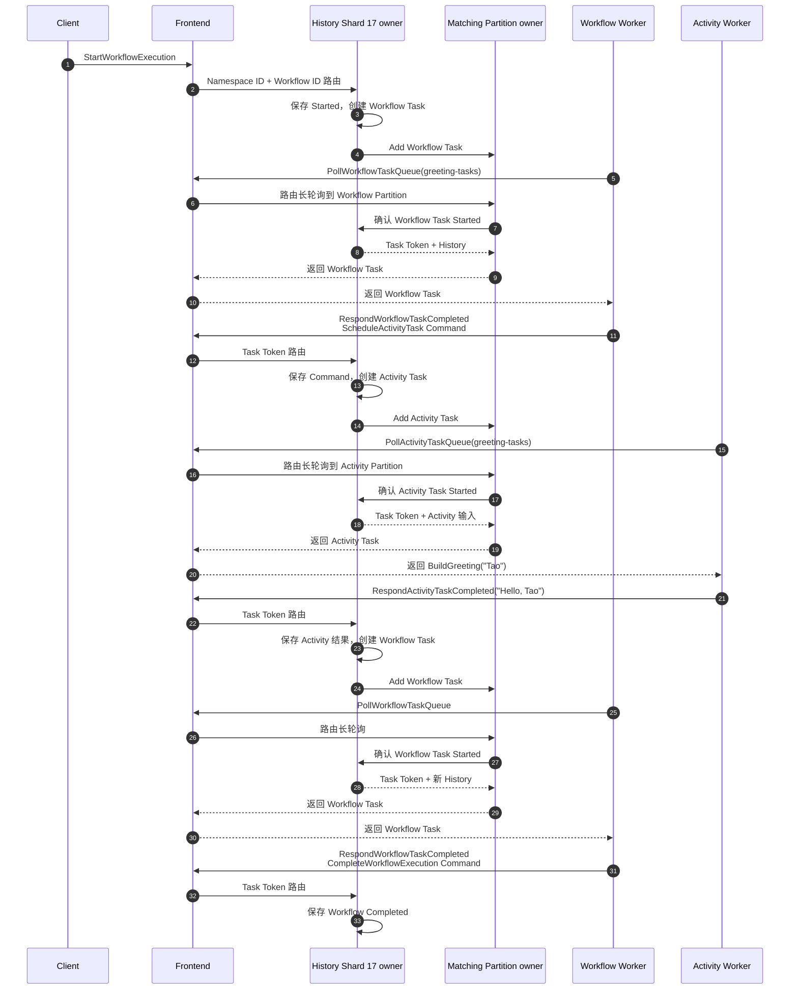
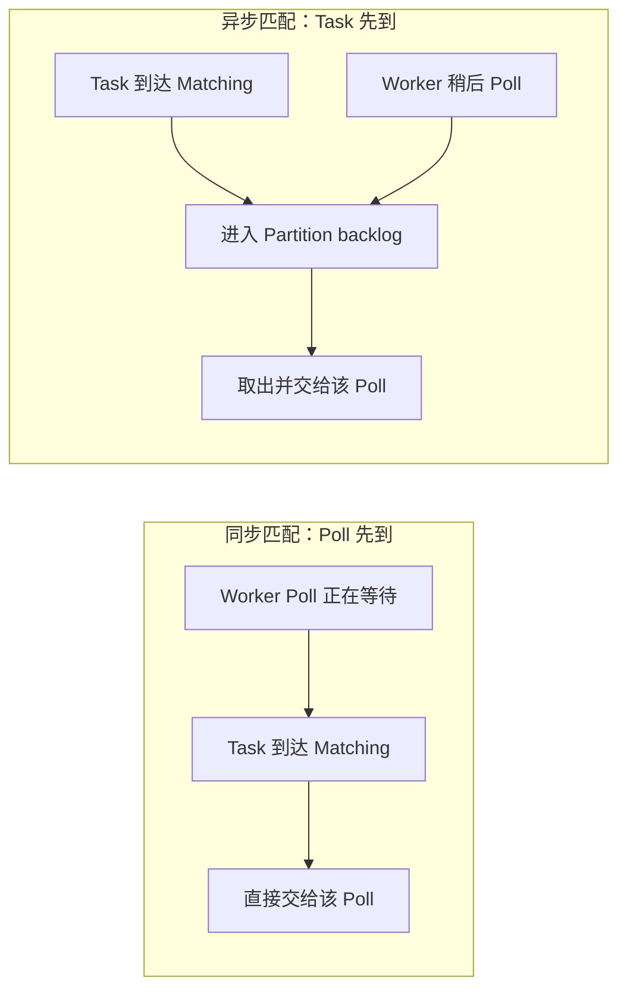
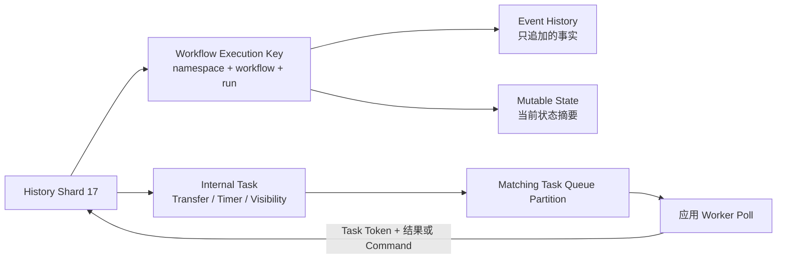

# Temporal 任务投递与状态变化

Temporal 内容分成四篇：

1. [基础与架构](./021_temporal.md);

2. [任务分配与并发控制](./022_temporal_membership_partition.md);

3. [执行与故障恢复](./023_temporal_execution_recovery.md);

4. **任务投递与状态变化（本文）**;

## 1. 先看完整时序图

仍使用 `greeting-request-42`：Workflow Worker 运行 `GreetingWorkflow`，Activity Worker 执行 `BuildGreeting("Tao")`。



图中有两种方向完全不同的请求：

- **History 向 Matching 添加 Task**：表示某个 Workflow 接下来需要计算决定或执行 Activity；
- **Worker 向 Frontend 发起 Poll**：表示这个 Worker 当前有能力接收一项任务。

Matching 的工作就是让一条待处理 Task 与一个等待中的 Poll 相遇。Task 的权威状态仍然由 History 管理。

## 2. Worker 的长轮询到底连接谁

### 2.1 Worker 直接连接的是 Frontend

应用 Worker 使用 SDK 配置 Temporal 地址，通常指向负载均衡器或 Frontend Service：

```text
Workflow / Activity Worker
        │
        │ gRPC / HTTP/2
        ▼
Load Balancer :7233
        │
        ▼
Frontend Service
        │ 内部路由
        ▼
Matching Partition owner
```

Worker 不直接发现或连接 Matching 节点，也不加入 Server 的 Ringpop/SWIM Membership。Matching owner 变化时，由 Frontend 根据当前成员视图重新路由，应用 Worker 不需要知道新 owner 的地址。

### 2.2 “长连接”更准确地说是反复发起长轮询 RPC

Worker SDK 内部运行 Poller 循环：

```text
发起 PollWorkflowTaskQueue 或 PollActivityTaskQueue
        ↓
Server 暂时没有任务：请求保持等待
        ↓
有任务则返回；达到长轮询期限也可能空返回
        ↓
Worker 获得执行槽位并处理任务
        ↓
Poller 立即再次发起 Poll
```

底层 gRPC 通常复用 HTTP/2 Channel，但语义上不是“一条永不结束的请求”，而是一系列长轮询 RPC。网络断开、Frontend 重启或请求超时后，SDK 会重连并继续 Poll。

一个 Worker 进程一般包含多个 Poller 和多个执行槽位：

```text
Worker 进程
├─ Workflow Task Poller × N
├─ Activity Task Poller × M
├─ Workflow 执行槽位
└─ Activity 执行槽位
```

Poller 数量决定同时可以挂起多少个取任务请求，执行槽位限制本进程同时处理多少任务。Worker 即使同时注册 Workflow 和 Activity，也会分别调用两类 Poll RPC；相同的 Task Queue 名称不代表两类任务混成一条队列。

### 2.3 Worker 不长期拥有 Workflow 或 Partition

一次 Poll 最多取得一项可执行 Task。匹配成功只表示“这次 Task 交给这个 Worker 尝试处理”，并不意味着：

- 这个 Worker 成为 Workflow Execution 的 owner；
- 这个 Worker 永久绑定 Task Queue Partition；
- 后续 Task 一定还会回到同一 Worker。

Workflow 的权威状态归 History Shard owner，Task Queue Partition 归 Matching owner。应用 Worker 只是本次 Task 的执行者。Sticky Workflow Task 可能优先回到缓存该 Workflow 的 Worker，但那是性能优化，不改变权威状态归属。

## 3. Matching 怎样把 Task 与 Poll 配对

### 3.1 配对使用哪些信息

History 添加 Task 时，关键路由维度是：

```text
Namespace ID
+ Task Queue
+ Task Type（Workflow / Activity）
+ Partition
```

Worker Poll 至少表明 Namespace、Task Queue、任务类型和 Worker Identity；SDK 还会携带版本、能力或部署信息，供 Worker Versioning 等机制筛选兼容 Worker。

因此，名为 `greeting-tasks` 的 Workflow Task 与 Activity Task 仍属于不同任务类型，Workflow Poller 不会取到 Activity Task。

### 3.2 两种相遇顺序



- **同步匹配**：Matching 已经持有等待中的 Poll，新 Task 到达后可以直接交付，减少入队和读取开销；
- **异步匹配**：暂时没有合适 Poll，Task 进入 Partition 的 backlog，待兼容 Worker Poll 到达后再交付。

无论采用哪种路径，Matching 都不把“已匹配”当成 Workflow 的最终事实。对 Workflow Task 和 Activity Task，Matching 会与 History 协作确认该 Task 仍有效并记录 Started 状态；History 返回 Task Token、历史或 Activity 输入后，结果才沿 Frontend 返回 Worker。

### 3.3 多个 Worker 同时 Poll 时怎样避免冲突

假设三个 Worker 都轮询 `greeting-tasks`：

```text
Poll(worker-1) ─┐
Poll(worker-2) ─┼─ Matching Partition ─ Task A
Poll(worker-3) ─┘
```

Matching 只让一个兼容 Poll 取得 Task A。其他 Poll 继续等待别的 Task，所以不会出现三个 Worker 因为同时 Poll 就都正常领取同一 Task 的情况。

但是“只匹配给一个 Poll”不等于外部副作用 exactly-once。Worker 得到 Activity Task、完成外部调用，却在上报成功前崩溃时，History 仍可能在超时后安排新的 Attempt。因此 Activity 仍需业务幂等，详见 [023](./023_temporal_execution_recovery.md)。

### 3.4 匹配成功后的边界

```text
Matching 找到 Poll
  → History 确认 Task 当前仍有效并标记 Started
  → Worker 得到 Task Token 和执行输入
  → Worker 执行
  → Worker 用 Task Token 向 Frontend 上报
  → Frontend 路由到原 Workflow 所在 History Shard
```

旧 Task、已超时 Task 或已被其他状态转换取代的 Task 会被 History 拒绝，不能仅凭 Matching 中还存在一条消息就修改 Workflow 状态。最终是否接受完成结果，也由 History 根据 Task Token 和当前 Mutable State 判断。

## 4. 沿图看请求参数和状态变化

Temporal 的物理表名和序列化格式会随数据库类型、Server 版本而变化。理解执行流程时，不要先背 SQL 表，而应先认识四类稳定的**逻辑记录**：

| 逻辑记录 | 内容 | 特性 |
|---|---|---|
| Workflow Execution | 一次 Workflow 运行的身份和当前状态 | 由 `Namespace ID + Workflow ID + Run ID` 唯一标识 |
| Event History | 已经发生的事实，例如启动、Activity 完成、Workflow 完成 | 只追加，是重放和审计依据 |
| Mutable State | 从 Event History 派生的当前状态摘要，例如待执行 Activity、Timer、当前 Workflow Task | 会原地更新，避免每次请求都扫描全部历史 |
| Internal Task | History 后续还要完成的工作，例如向 Matching 投递任务、触发 Timer、更新 Visibility | 与状态变化一起持久化，用于故障后继续推进 |

Matching 还会维护 Task Queue Partition 中待匹配的 Task，但它不是 Workflow 状态的权威来源。任务即使需要重新投递，History 中的状态也不会因此丢失。

### 4.1 Greeting 示例的固定身份

沿用第一篇 [3.3 节](./021_temporal.md)的输入，为示例补上具体值：

```yaml
namespace: demo
namespace_id: ns-demo-7f31       # Server 内部 ID，示意值
workflow_id: greeting-request-42 # 业务指定
run_id: run-a1b2-c3d4            # Server 创建，示意值
workflow_type: GreetingWorkflow
task_queue: greeting-tasks
input:
  name: Tao
```

这次执行的持久化主键可以概念化为：

```text
WorkflowExecutionKey
└─ namespace_id = ns-demo-7f31
   workflow_id  = greeting-request-42
   run_id       = run-a1b2-c3d4
```

路由到 History Shard 时，关键输入是 `Namespace ID + Workflow ID`，不依赖某台 Worker：

```text
shard_id = hash(ns-demo-7f31, greeting-request-42) % configured_shard_count
```

假设结果是 `shard_id = 17`，后续启动、Activity 完成和 Workflow 完成请求都会回到 Shard 17 当前的 History owner。具体哈希、owner 与接管见 [022](./022_temporal_membership_partition.md)。

### 4.2 四类记录之间的关系



下面按本文第 1 节时序图中的执行顺序，观察每一步的请求参数和数据变化。事件编号是为了帮助理解而给出的简化示意；不同 Server/SDK 版本可能插入额外事件，不能把编号写死在业务代码里。

### 4.3 第一步：Client 启动 Workflow

Client 发出的 `StartWorkflowExecution` 请求包含：

```yaml
namespace: demo
workflow_id: greeting-request-42
workflow_type: GreetingWorkflow
task_queue: greeting-tasks
input: {name: Tao}
request_id: req-start-42        # 用于启动请求去重
workflow_run_timeout: 1h
```

History Shard 17 在一次状态更新中形成下面的逻辑变化：

| 类型 | 创建或更新的内容 |
|---|---|
| Event History | 追加 `#1 WorkflowExecutionStarted`、`#2 WorkflowTaskScheduled` |
| Mutable State | `status=RUNNING`；保存 Workflow Type、Task Queue、输入；记录一个待执行 Workflow Task |
| Internal Task | 创建“把 Workflow Task 投递到 `greeting-tasks`”的 Transfer Task |
| Visibility | 创建本次 Workflow Execution 的可见性更新任务 |

此时可以把状态快照理解成：

```yaml
execution:
  status: RUNNING
  next_event_id: 3
workflow_task:
  state: SCHEDULED
  scheduled_event_id: 2
pending_activities: {}
```

### 4.4 第二步：Workflow Task 路由并匹配给 Worker

History 的 Transfer Task 向 Matching 写入的关键信息可以概念化为：

```yaml
namespace_id: ns-demo-7f31
task_queue: greeting-tasks
task_type: WORKFLOW
partition: 0
workflow_id: greeting-request-42
run_id: run-a1b2-c3d4
scheduled_event_id: 2
```

Workflow Worker 发起长轮询：

```yaml
namespace: demo
task_queue: greeting-tasks
worker_identity: greeting-worker-1
```

Matching owner 把 Task 与这个 Poll 匹配。History 确认领取后，会把 Workflow Task 标记为已开始，并生成 Task Token。Worker 收到的主要内容包括：

```yaml
task_token: opaque-workflow-task-token
workflow_type: GreetingWorkflow
workflow_execution:
  workflow_id: greeting-request-42
  run_id: run-a1b2-c3d4
history:
  - WorkflowExecutionStarted
  - WorkflowTaskScheduled
  - WorkflowTaskStarted
```

这里改变的是 Workflow Task 的执行状态；Workflow 整体仍是 `RUNNING`。Task Token 是不透明凭证，包含 History 定位和本次 Task 校验所需信息，应用不应自行解析。

### 4.5 第三步：Workflow Worker 决定安排 Activity

Worker 运行 `GreetingWorkflow`，走到 `ExecuteActivity` 后返回 `RespondWorkflowTaskCompleted`：

```yaml
task_token: opaque-workflow-task-token
commands:
  - type: ScheduleActivityTask
    activity_id: build-greeting-1
    activity_type: BuildGreeting
    task_queue: greeting-tasks
    input: {name: Tao}
    start_to_close_timeout: 1m
```

History 验证 Task Token 和 Command 后更新：

| 类型 | 创建或更新的内容 |
|---|---|
| Event History | 追加 `WorkflowTaskCompleted`、`ActivityTaskScheduled` |
| Mutable State | 清除当前 Workflow Task；在 `pending_activities` 中增加 `build-greeting-1` |
| Internal Task | 创建“把 Activity Task 投递到 `greeting-tasks`”的 Transfer Task，以及所需的超时 Timer Task |

```yaml
execution:
  status: RUNNING
workflow_task: null
pending_activities:
  build-greeting-1:
    activity_type: BuildGreeting
    state: SCHEDULED
    attempt: 1
    scheduled_event_id: 5  # 简化示意
```

注意：Worker 返回的是“安排 Activity”的 Command，不是直接向 Matching 或数据库插入任务。是否接受并持久化这个决定，由 History 负责。

### 4.6 第四步：Activity Task 路由并执行

Activity Worker 同样通过 Task Queue 长轮询：

```yaml
namespace: demo
task_queue: greeting-tasks
worker_identity: activity-worker-2
```

Matching 匹配成功后，Worker 收到：

```yaml
task_token: opaque-activity-task-token
activity_id: build-greeting-1
activity_type: BuildGreeting
input: {name: Tao}
attempt: 1
timeouts:
  start_to_close: 1m
```

History 在 Mutable State 中把本次 Attempt 标记为 `STARTED`。为了避免多次重试产生大量历史事件，不能简单理解成 Worker 一领取任务，Server 就立即向 Event History 单独追加一个可见的 `ActivityTaskStarted`；最终 Attempt 关闭时，相关 Started 与完成结果会反映到历史中。Activity Worker 随后调用 `BuildGreeting("Tao")`，真正产生业务结果 `Hello, Tao`。

### 4.7 第五步：Activity Worker 上报结果

Worker 发出的完成请求是：

```yaml
task_token: opaque-activity-task-token
result: "Hello, Tao"
```

Frontend 根据 Task Token 把请求路由回 Shard 17 的 History owner。History 更新：

| 类型 | 创建或更新的内容 |
|---|---|
| Event History | 记录最终 Attempt 的 `ActivityTaskStarted`，追加 `ActivityTaskCompleted(result="Hello, Tao")`、新的 `WorkflowTaskScheduled` |
| Mutable State | 从 `pending_activities` 删除 `build-greeting-1`；增加一个待执行 Workflow Task |
| Internal Task | 创建投递下一个 Workflow Task 的 Transfer Task |

```yaml
execution:
  status: RUNNING
workflow_task:
  state: SCHEDULED
pending_activities: {}
```

Activity 结果已经进入 Event History。即使原 Worker 随后退出，新 Worker 也能通过历史恢复 `Future.Get()` 的返回值，而不会因为恢复 Workflow 状态再次执行已经成功记录的 Activity。

### 4.8 第六步：Workflow Worker 完成执行

新的 Workflow Task 再次经过 Matching。Worker 重放或恢复缓存后，得到 Activity 结果，并返回：

```yaml
task_token: opaque-workflow-task-token-2
commands:
  - type: CompleteWorkflowExecution
    result: "Hello, Tao"
```

History 最后更新：

| 类型 | 创建或更新的内容 |
|---|---|
| Event History | 追加 `WorkflowTaskCompleted`、`WorkflowExecutionCompleted(result="Hello, Tao")` |
| Mutable State | `status=COMPLETED`，清除待处理 Workflow Task、Activity 和 Timer |
| Visibility | 创建状态更新任务，使列表和搜索最终显示为 Completed |

最终的逻辑快照是：

```yaml
execution:
  status: COMPLETED
  close_time: 2024-10-11T08:00:03+08:00
workflow_task: null
pending_activities: {}
pending_timers: {}
result: "Hello, Tao"
```

### 4.9 把每一步压缩到一张表

| 步骤 | 请求中的关键参数 | Event History | Mutable State | 新的待处理任务 |
|---|---|---|---|---|
| 启动 Workflow | Namespace、Workflow ID、Type、Task Queue、输入 | Started、WorkflowTaskScheduled | 创建 RUNNING Execution | 投递 Workflow Task |
| Workflow Worker 领取 | Namespace、Task Queue、Worker Identity | WorkflowTaskStarted | Workflow Task 变为 STARTED | 无 |
| Worker 安排 Activity | Task Token、Activity ID/Type、输入、超时 | WorkflowTaskCompleted、ActivityTaskScheduled | 增加 Pending Activity | 投递 Activity、建立超时 Timer |
| Activity Worker 领取 | Namespace、Task Queue、Worker Identity | 通常不在领取瞬间单独追加可见 Event | Activity 变为 STARTED，记录 Attempt | 无 |
| Activity 完成 | Task Token、Result | 最终 Attempt 的 ActivityTaskStarted、ActivityTaskCompleted、WorkflowTaskScheduled | 删除 Pending Activity，增加 Workflow Task | 投递 Workflow Task |
| Workflow 完成 | Task Token、Complete Command、Result | WorkflowTaskCompleted、WorkflowExecutionCompleted | Execution 变为 COMPLETED | 更新 Visibility |

这张表也是后文故障恢复的判断基础：先看某一步的事实是否已经写入 Event History，再决定是重新投递任务、重放 Workflow，还是重试 Activity。

## 5. 阅读这张图时最容易混淆的四点

1. Worker 连接 Frontend，Frontend 才把 Poll 路由到 Matching owner；
2. Matching 匹配的是“一条 Task”和“一次 Poll”，不是把 Workflow 永久分配给 Worker；
3. Worker 返回 Result 或 Command，History 才负责把它变成 Event、Mutable State 和后续 Internal Task；
4. 判断故障后应该做什么，先看对应事实是否已经进入 Event History，而不是只看 Worker 是否执行过代码。

Membership、Shard 与 Partition owner 的计算见 [022](./022_temporal_membership_partition.md)；重放、重试、Activity 幂等和故障恢复见 [023](./023_temporal_execution_recovery.md)。

## 参考资料

- [Temporal Docs：Workers](https://docs.temporal.io/workers)
- [Temporal Docs：Task Queue](https://docs.temporal.io/task-queue)
- [Temporal Docs：Workflow Execution](https://docs.temporal.io/workflow-execution)
- [Temporal Docs：Event History](https://docs.temporal.io/workflow-execution/event)
- [Temporal Docs：Activity Execution](https://docs.temporal.io/activity-execution)
