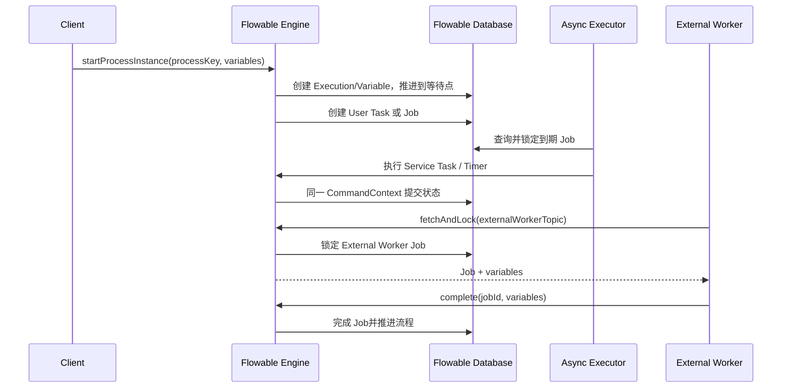

# Flowable 任务投递与状态变化

Flowable 内容分成四篇：

1. [基础与架构](./031_flowable.md);

2. [任务分配与并发控制](./032_flowable_job_assignment.md);

3. [执行与故障恢复](./033_flowable_execution_recovery.md);

4. **任务投递与状态变化（本文）**;

## 1. 完整时序图



## 2. 执行者连接谁

内置 Async Executor 与 Flowable Engine 同进程或同应用部署，直接通过数据库查询并获取 Job，不存在独立 Matching 服务。External Worker 则调用 Flowable REST/API 的 fetch-and-lock 接口，经任一应用节点访问数据库；它不直接操作 Flowable 表。

## 3. Job 怎样匹配执行者

Async Executor 按到期时间、重试次数和锁状态查询 Job，通过 lock owner、lock expiration 与条件更新竞争。多个节点看到同一 Job 时，只有成功取得锁的节点执行。External Worker 按 Topic 拉取，Server 对匹配 Job 加租约锁后返回一个 Worker。租约到期或失败重试后 Job 可再次被领取，所以外部副作用仍需幂等。

## 4. 沿图看数据模型

```yaml
process_instance: {processInstanceId: proc-42, processDefinitionId: content-review:3, state: ACTIVE}
execution: {executionId: exec-review, activityId: editorialReview, active: true}
user_task: {taskId: usertask-7, assignee: null, candidateGroup: editors}
job: {jobId: job-9, retries: 3, lockOwner: null, lockExpirationTime: null}
variable: {processInstanceId: proc-42, name: articleId, value: article-42}
```

| 步骤 | 请求参数 | 创建/更新记录 | 下一步 |
|---|---|---|---|
| 启动实例 | processDefinitionKey、businessKey、variables | Runtime Execution、Variables | 同步推进到等待点 |
| 到 User Task | assignee/candidate、表单信息 | ACT_RU_TASK 与 Identity Link | 等待 complete |
| 到 Async Service Task | handler、due time、retries | Runtime Job | Async Executor 获取 |
| 获取 Job | node/worker ID、Topic、锁时长 | lock owner/expiration | 一个执行者获得租约 |
| 完成任务 | task/job ID、variables | 删除运行时任务，更新 Execution/Variables | 继续推进 BPMN Token |
| 流程结束 | end event | 清理 Runtime，写 Historic 记录 | 实例 COMPLETED |

物理表会随引擎模块与版本变化；重点是 Runtime 表保存当前等待点，Historic 表用于审计，Job 表承担可恢复的异步工作。

## 5. 谁推进流程

执行 API 的应用线程或 Async Executor 在一个 CommandContext 中持续执行 BPMN Token，直到 User Task、Receive Task、Timer、异步边界等等待点，然后提交数据库事务。External Worker 只完成外部工作，Server 收到完成请求后再推进 Token。
