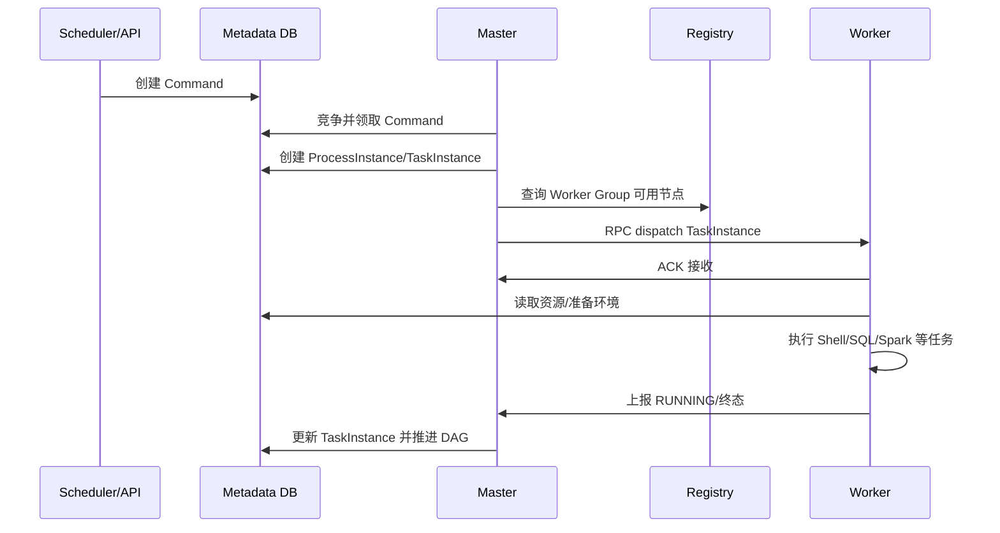

# DolphinScheduler 任务投递与状态变化

DolphinScheduler 内容分成四篇：

1. [基础与架构](./041_dolphinscheduler.md);

2. [任务分配与并发控制](./042_dolphinscheduler_assignment.md);

3. [执行与故障恢复](./043_dolphinscheduler_execution_recovery.md);

4. **任务投递与状态变化（本文）**;

## 1. 完整时序图



## 2. Worker 与谁通信

Worker 在注册中心登记地址和 Worker Group，由 Master 选择节点并通过内部 RPC 主动下发任务；它不是像 Temporal Worker 那样持续 Poll Matching。Worker 与 Master 保持心跳/状态上报，任务资源可从 Resource Center 获取。

## 3. Task 怎样匹配 Worker

Master 先按 Task 配置选 Worker Group，再结合注册中心中的存活节点、负载和执行槽位选择具体 Worker。多个 Master 对 Command/流程实例的竞争通过数据库状态、注册中心和锁协调；Worker ACK 只表示接收，不等于业务成功。

## 4. 沿图看数据模型

```yaml
command: {commandType: START_PROCESS, processDefinitionCode: 1001, state: WAITING}
process_instance: {id: 42, state: RUNNING_EXECUTION}
task_instance: {id: 99, taskCode: 2001, taskType: SHELL, workerGroup: content, state: SUBMITTED_SUCCESS}
worker: {address: worker-a:1234, group: content, heartbeat: alive}
```

| 步骤 | 关键输入 | 数据库状态 | 后续动作 |
|---|---|---|---|
| 触发 | Definition、Schedule、参数 | 创建 Command | Master 扫描领取 |
| 初始化 | Command ID、Definition Version | 创建 ProcessInstance | 计算可运行 Task |
| 分发 | TaskInstance ID、Worker Group、资源 | TaskInstance 提交态 | RPC 给一个 Worker |
| Worker 接收 | Task 内容、租户、环境 | ACK/RUNNING | 启动任务进程 |
| 完成 | TaskInstance ID、结果、日志位置 | TaskInstance 终态 | Master 推进下游 |
| 故障 | 心跳、超时、Failover 标记 | 重试/失败/重新提交 | 新 Master 或 Worker 接管 |

## 5. 谁推进 DAG

Master 是流程状态机的推进者；Worker 只执行单个 TaskInstance 并上报。Metadata Database 保存权威实例状态，注册中心提供活性与路由信息，不能替代数据库状态。
