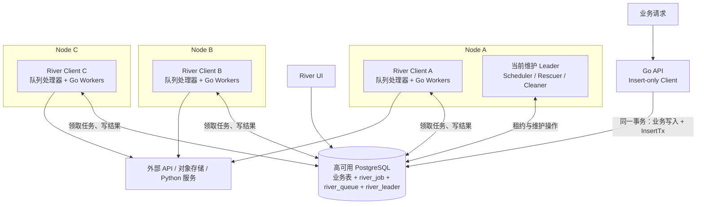
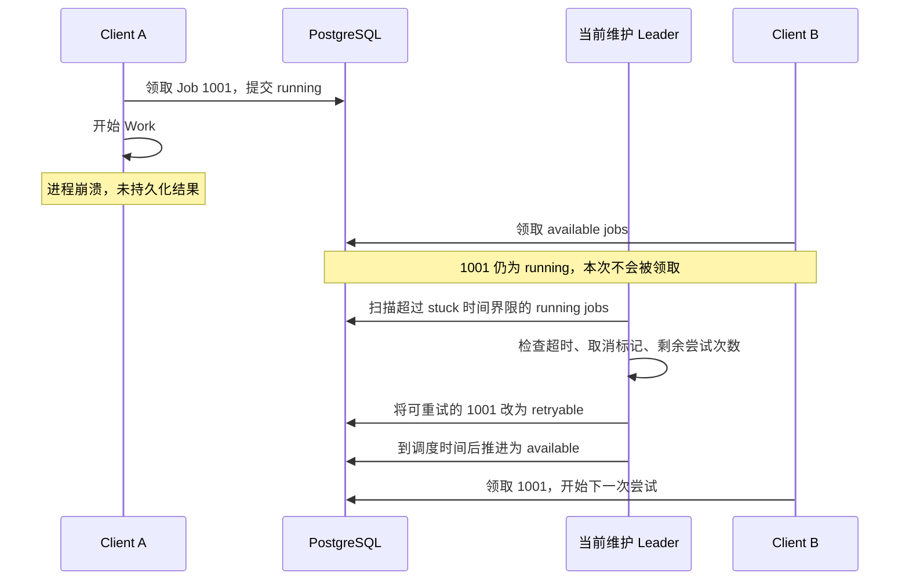
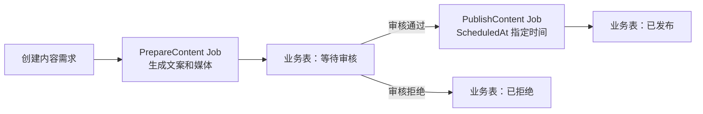
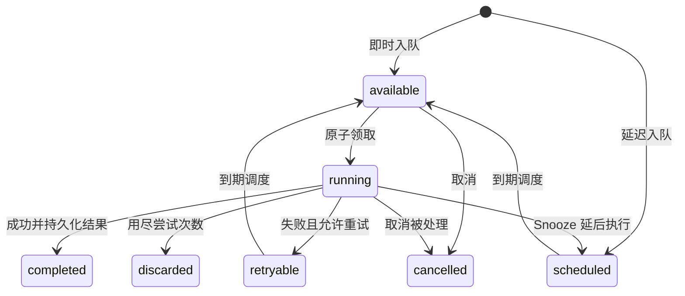

# River 深入调研：事务任务队列、分步骤恢复与工作流边界

调研日期：2026-09-10。本文沿用 [Temporal 调研](./021_temporal.md) 的叙述顺序：先解释多节点架构、数据映射和协调方式，再用业务实例串起任务执行、持久化与故障恢复。

源码基准为本地 `tmp/river` 的提交 `a4cf56f7233ce1a84a4dc188d91bd09399522763`，提交日期为 2026-09-07；该快照的 CHANGELOG 最近版本为 v0.47.0。下文实现细节以这个快照为准；River Pro 仅依据公开官方文档说明能力，不把私有模块当作已经审阅的开源实现。

## 1. 结论先行

River 是一个**嵌入 Go 应用、以数据库作为持久化队列的后台任务库**。它最突出的设计是：业务数据和 Job 可以在同一个数据库事务里提交，减少“业务已成功，但异步任务没有发出去”的双写问题。

它适合邮件、Webhook、报表、媒体处理、索引更新、批量导入，以及由 Go 服务驱动的 AI API 调用。当前开源版还支持 Resumable Jobs：把一个 Worker 划分为命名步骤，通过持久化进度跳过已完成步骤。但跨多个 Job 的原生依赖图、工作流 Signal/Timer 等属于 River Pro，应与开源版区分。[包文档](https://github.com/riverqueue/river/blob/a4cf56f7233ce1a84a4dc188d91bd09399522763/doc.go)、[Pro 能力说明](https://riverqueue.com/pro)。

| 维度 | 结论 |
|---|---|
| 项目类型 | 数据库支持的后台任务队列，Go 应用内集成 |
| 开源协议 | 仓库 LICENSE 标注 MPL-2.0 |
| 项目热度 | 调研时 GitHub API 返回约 5.7k Star，2026-09-10 仍有推送 |
| 核心执行单元 | 一条 Job 记录，以及按 kind 注册的 Go Worker |
| 原生存储驱动 | PostgreSQL、SQLite；本文多节点实例采用 PostgreSQL |
| 开源版恢复方式 | Job 重试、stuck job 回收、命名步骤和游标检查点 |
| 工作流产品边界 | 开源版提供任务和步骤；Pro 提供跨 Job 的 Workflow DAG 等能力 |
| 主要取舍 | 集成成本低、事务边界清晰；复杂流程的平台能力需应用补齐或采用 Pro |

项目与维护信息来自 [GitHub 仓库](https://github.com/riverqueue/river)；版本依据见固定提交的 [CHANGELOG](https://github.com/riverqueue/river/blob/a4cf56f7233ce1a84a4dc188d91bd09399522763/CHANGELOG.md)。驱动范围见 [官方驱动说明](https://riverqueue.com/docs/database-drivers)。

## 2. 三节点部署：谁领取任务，状态存在哪里

### 2.1 进程里有哪些组件

River 不需要先部署一套独立的 Frontend、History 和 Matching 服务。Go 应用创建 `river.Client`，注册 Worker，配置队列并调用 `Start`，就可以直接从数据库领取和执行任务。

| 组件 | 职责 | 生命周期和状态 |
|---|---|---|
| Client | 提供 Insert/InsertTx、管理队列处理和后台服务 | 嵌入应用进程；可以只插入、不执行 |
| 每队列 producer | 根据剩余容量拉取任务，创建执行器 | 进程内组件，维护当前活跃任务 |
| Job Executor / Worker | 反序列化参数，执行 Work，处理超时、错误和 panic | 每次尝试在 goroutine 中运行 |
| Completer | 将执行结果写回数据库，可合并批量写入 | 内存中的待写结果尚不是持久完成 |
| Notifier | 接收任务和控制通知，减少轮询延迟 | 通知用于唤醒，Job 表保存任务事实 |
| Elector / Maintenance | 选出维护 Leader，运行调度、回收、清理等服务 | 协调信息和待维护任务位于数据库 |

这里源码中的 `producer` 实际负责**取任务和安排执行**，不能按消息中间件术语把它理解为业务消息发送端。业务入队入口是 `Client.Insert` / `InsertTx`。实现入口见 [client.go](https://github.com/riverqueue/river/blob/a4cf56f7233ce1a84a4dc188d91bd09399522763/client.go) 与 [producer.go](https://github.com/riverqueue/river/blob/a4cf56f7233ce1a84a4dc188d91bd09399522763/producer.go)。

### 2.2 三节点总体架构图



三台机器运行对等的执行进程，API 可以独立部署，也可以与执行进程同机。三个 Client 都能领取同一队列的 Job；A 的维护 Leader 身份不会使它成为所有任务的转发入口。

任务没有分别复制到 A、B、C 的本地队列。数据库保存权威状态，PostgreSQL 的复制、备份和主库切换由数据库部署方案负责。应用增加到三个副本，不能补偿单实例数据库故障。

### 2.3 Job、Queue 与底层存储怎样对应

先看一个待生成视频的任务：

```text
业务记录：content_request.id = 42
Job：id = 1001
     kind = "prepare_content"
     queue = "media"
     args = {"request_id": 42}
     state = "available"
```

`kind` 决定用哪个 Worker 执行，`queue` 决定由哪些配置了该队列的 Client 竞争领取。`request_id` 是业务关联键，`id` 是 River Job 标识；它们不是同一个标识空间。

| 表或字段 | 数据形态 | 用途 |
|---|---|---|
| `river_job` | 每个 Job 一行，主键 `id` | 参数、状态、调度时间、尝试次数、错误和元数据 |
| `river_job.kind` / `args` | 类型名 + JSONB 参数 | 找 Worker、重建本次调用输入 |
| `river_job.queue` | 队列名称 | 领取查询的过滤条件 |
| `river_job.metadata` | JSONB | 应用元数据、步骤/游标进度、记录的输出等 |
| `river_queue` | 主键 `name` | 队列暂停状态、元数据和更新时间 |
| `river_leader` | PostgreSQL UNLOGGED 表，固定 name 的协调行 | 当前维护 Leader、当选时间、租约截止时间 |
| `river_migration` | Schema 迁移记录 | 记录已执行的迁移版本 |
| 业务表、对象存储 | 由应用定义 | 长期业务状态、审批单、媒体文件和最终结果 |

一个 Queue 不对应一张独立的 Job 表，也不对应一个固定节点。开源版这里没有 Temporal 的 `Workflow ID → History Shard → owner` 映射，也没有 Kafka 式分区副本分配。配置更多 Queue 主要是分开领取条件、执行容量和管理策略；它不会自动把数据库分片。

`river_leader` 的 UNLOGGED 定位与 `river_job` 不同：前者是可重新选举的协调信息，后者才是需要保留的任务状态。不能把 Leader 行当成任务可靠性的来源。表结构和查询可直接阅读 [river_job.sql](https://github.com/riverqueue/river/blob/a4cf56f7233ce1a84a4dc188d91bd09399522763/riverdriver/riverpgxv5/internal/dbsqlc/river_job.sql)、[river_queue.sql](https://github.com/riverqueue/river/blob/a4cf56f7233ce1a84a4dc188d91bd09399522763/riverdriver/riverpgxv5/internal/dbsqlc/river_queue.sql) 和 [river_leader.sql](https://github.com/riverqueue/river/blob/a4cf56f7233ce1a84a4dc188d91bd09399522763/riverdriver/riverpgxv5/internal/dbsqlc/river_leader.sql)。

### 2.4 多个节点怎样避免同时领取同一任务

PostgreSQL 路径中的核心是 `JobGetAvailable`。以下是保留关键逻辑的简化 SQL，不是可直接替换源码的版本：

```sql
WITH locked_jobs AS (
    SELECT id
    FROM river_job
    WHERE state = 'available'
      AND queue = $1
      AND scheduled_at <= now()
    ORDER BY priority, scheduled_at, id
    LIMIT $2
    FOR UPDATE SKIP LOCKED
)
UPDATE river_job AS j
SET state = 'running',
    attempt = j.attempt + 1,
    attempted_at = now()
FROM locked_jobs AS l
WHERE j.id = l.id
RETURNING j.*;
```

假设 A、B 同时取 `media` 队列：A 已经锁定的行会被 B 跳过，B 可以继续领取其他行。领取事务提交后，Job 已经是 `running`，普通领取查询就不会再次选中它。

**行锁只覆盖领取事务，不会一直持有到 HTTP 调用或视频渲染结束。** 后续执行靠 `running` 状态与结果更新衔接；进程崩溃后的恢复由 Rescuer 处理。因此，这个机制解决正常领取竞争，并不保证外部副作用只发生一次。

排序是 `priority → scheduled_at → id`，其中 priority 数字越小越优先。多节点、多个 goroutine、重试以及跳过锁定行都会影响实际开始和完成顺序，不能把它当成严格 FIFO 的业务顺序保证。依据见上述 `river_job.sql` 的 `JobGetAvailable`。

### 2.5 成员协调与维护 Leader 怎样确定

River 的这条执行路径不依赖 Ringpop 成员环。Client 只要连接到同一数据库和 Schema，就能竞争领取任务；需要集群协调的是“谁负责执行一份维护工作”。

选主过程可以概括为：

1. 开始执行任务的 Client 参与选举；只入队的 Client 不承担维护选主。
2. 在事务中删除已过期的 Leader 行，再尝试插入 `river_leader`。
3. 固定 `name` 的唯一约束使一个竞争者获得该协调行；其他 Client 继续正常执行任务。
4. Leader 周期性续租。续租 SQL 同时检查 `leader_id`、`elected_at` 和租约尚未过期，避免旧任期随意续写新任期。
5. 续租失败或超过本地安全期限后，停止本任期的维护职责；其他 Client 在租约过期后重新竞争。正常退出还会主动辞任并发送通知。

本地快照的默认选举周期为 5 秒，`leaderTTL()` 为“选举周期 + 10 秒”，默认租约为 15 秒。官方概念页仍有“五秒 TTL”的表述，本文采用固定提交的源码值；选举周期、租约长度和实际故障恢复时间需要分别理解。[选主源码](https://github.com/riverqueue/river/blob/a4cf56f7233ce1a84a4dc188d91bd09399522763/internal/leadership/elector.go)、[官方选主说明](https://riverqueue.com/docs/leader-election)。

维护 Leader 负责推进到期任务、生成周期任务、回收 stuck jobs、清理终态任务等。**失去维护 Leader 不等于整个队列马上停止执行**：其他 Client 仍可领取已满足条件的 `available` Job，但依赖维护服务的调度和回收可能延迟。

### 2.6 执行节点失效时怎样恢复

假设 Job 1001 被 A 领取，A 写入 `running` 后突然断电：



如果 A 同时是维护 Leader，还要先由剩余节点接替维护职责。B 不从 A 的内存或磁盘复制执行栈，而是读取 Job 参数、错误和已持久化的进度。

本地默认 `JobTimeout` 为 1 分钟，`RescueStuckJobsAfter` 为 1 小时，Rescuer 默认扫描间隔为 30 秒。它先按 `attempted_at` 找候选，再考虑 Worker 类型的超时设置等条件。因此“Leader 十几秒完成切换”不能推导出“崩溃任务十几秒后重跑”。长任务应根据实际最长执行时间调整这些参数；超时设为无限的任务在当前 Rescuer 判断中可能被跳过，不能假设所有 stuck job 都会自动回收。[配置](https://github.com/riverqueue/river/blob/a4cf56f7233ce1a84a4dc188d91bd09399522763/client.go)、[JobRescuer](https://github.com/riverqueue/river/blob/a4cf56f7233ce1a84a4dc188d91bd09399522763/internal/maintenance/job_rescuer.go)。

## 3. 贯穿实例：生成内容、人工审核与定时发布

以一个 Go 驱动的自媒体后台为例：用户创建内容需求，后台生成文案和媒体文件，审核通过后在指定时间发布。以下是**基于 River OSS 设计的应用流程**，不是声称开源版内置了这张 Workflow 图。



### 3.1 一次执行的完整路径

1. API 在同一 PostgreSQL 事务中创建 `content_request`，并 `InsertTx` 插入 `PrepareContentArgs{RequestID: 42}`。
2. 事务提交后，某个 Client 领取 Job，按 `kind` 找到 `PrepareContentWorker`。
3. Worker 调用模型或 Python 服务，产物存到对象存储，业务表记录 URI 和处理进度。
4. 准备完成后，在同一事务中更新业务状态为 `waiting_review`，创建审批记录，并用 `JobCompleteTx` 完成当前 Job。
5. 等待审核期间没有正在执行的 Worker；等待状态在业务表中。
6. 审核 API 校验权限和当前版本，在同一事务中记录批准结果，并插入带 `ScheduledAt` 的 `PublishContent` Job。
7. 到期后 Scheduler 使任务可以被领取。发布 Worker 调用外部平台，记录平台内容 ID 和最终业务状态。

这里两类状态分工明确：`river_job.state` 描述某个后台任务的生命周期；`content_request.status` 描述用户关心的完整业务进度。`PrepareContent` 已完成而业务仍在等待审核，是正常状态。

### 3.2 事务入队的 Go 示例

以下为集成片段，假定业务表、`dbPool`、`riverClient` 和 Worker 注册已经准备好：

```go
type PrepareContentArgs struct {
    RequestID int64 `json:"request_id"`
}

func (PrepareContentArgs) Kind() string { return "prepare_content" }

func CreateRequest(
    ctx context.Context,
    dbPool *pgxpool.Pool,
    riverClient *river.Client[pgx.Tx],
    topic string,
) (int64, error) {
    tx, err := dbPool.Begin(ctx)
    if err != nil {
        return 0, err
    }
    defer tx.Rollback(ctx)

    var id int64
    err = tx.QueryRow(ctx,
        `INSERT INTO content_request(topic, status)
         VALUES ($1, 'preparing') RETURNING id`, topic,
    ).Scan(&id)
    if err != nil {
        return 0, err
    }

    _, err = riverClient.InsertTx(ctx, tx,
        PrepareContentArgs{RequestID: id},
        &river.InsertOpts{Queue: "media"},
    )
    if err != nil {
        return 0, err
    }
    if err := tx.Commit(ctx); err != nil {
        return 0, err
    }
    return id, nil
}
```

事务回滚，两条记录一起撤销；事务提交，业务记录和 Job 一起可见。若在事务外另调 `Insert`，或者业务数据位于另一个独立数据库，就没有这个原子边界。API 自身的重复请求仍需业务幂等键处理。接口依据见 [InsertTx 所在的 client.go](https://github.com/riverqueue/river/blob/a4cf56f7233ce1a84a4dc188d91bd09399522763/client.go)。

## 4. 从实例理解核心对象

| River 抽象 | 定义 | 内容处理实例 |
|---|---|---|
| JobArgs / Kind | JSON 可序列化参数与稳定类型名 | `PrepareContentArgs`、`prepare_content` |
| Worker | 实现 `Work(ctx, job)` 的 Go 类型 | 生成文案、调用渲染服务 |
| Workers registry | kind 到 Worker 实现的注册表 | 进程启动时注册所有相关类型 |
| Job / JobRow | 类型化参数与持久化任务记录 | Job 1001，对应内容需求 42 |
| Attempt | 同一 Job 的一次执行尝试 | 第一次模型调用失败，第二次重试 |
| Queue | 领取和本地并发配置的逻辑分组 | `media`、`publish` |
| InsertOpts | 入队时指定调度、队列、重试和唯一性等 | 发布时间、最大尝试次数 |
| ResumableStep / Cursor | 单个 Job 内的步骤与循环进度 | 已生成文案，接着生成媒体 |
| RecordOutput | 把 JSON 结果记到 Job metadata | 临时记录产物 URI 或外部资源 ID |
| PeriodicJob | 周期性创建新 Job 的定义 | 定期刷新平台统计 |

开源版的核心闭环是：**插入 Job → 数据库领取 → Worker 执行 → 更新同一 Job 的状态**。ResumableStep 只是这个闭环内的细粒度进度，不会自动把每个步骤变成可以交给其他机器独立执行的 Job。

## 5. 一次状态转换怎样持久化

### 5.1 Job 状态机



这是主路径示意，省略了部分管理操作、短期 Snooze 优化与正常停机中断分支。Schema 还定义了 `pending`：普通领取 SQL 只选 `available`，不能因为存在 `pending` 状态，就推导出 OSS 已经内置跨 Job 依赖解析器。

Job 的参数、尝试次数、错误和时间字段都随记录保存在数据库中。它没有 Temporal 那种“通过完整 Event History 校验 Command 序列”的恢复过程，也没有恢复 goroutine 的内存快照。

### 5.2 完成任务与业务更新怎样原子提交

普通 Worker `return nil` 后，River 再把任务完成状态写入数据库。如果 Worker 已经提交业务更新，却在 River 完成状态落库前崩溃，任务之后仍可能重新执行。

当副作用都在同一数据库时，可以使用：

```text
BEGIN
  更新 content_request 为 waiting_review
  创建 approval_ticket
  JobCompleteTx：把当前 Job 标记为 completed
COMMIT
```

如果还要接续另一个 Job，可以把 `InsertTx(下一任务)` 放进同一事务。这使“当前业务结果、当前任务完成、下一任务入队”一起提交，适合实现简单串行链。每个函数和 SQL 的错误都必须检查，提交成功后 Worker 正常返回 nil。[JobCompleteTx 源码](https://github.com/riverqueue/river/blob/a4cf56f7233ce1a84a4dc188d91bd09399522763/job_complete_tx.go)。

这个事务不能包含第三方平台的 HTTP 提交结果。把发布 API 调用放进一个长数据库事务，也不会让两个系统自动具备原子提交能力。

### 5.3 LISTEN/NOTIFY 为什么不会成为任务丢失点

PostgreSQL 通知用于提示 Client“现在可能有新工作”。Client 醒来后仍然查询 `river_job`；通知本身不是唯一的任务载体。连接中断或通知错过后，周期轮询可以再次发现已提交的 Job。

本地默认 `FetchPollInterval` 为 1 秒，`FetchCooldown` 为 100 毫秒。它们影响取任务节奏，并不是端到端延迟承诺：数据库负载、队列容量和 Worker 耗时仍会影响开始时间。依据见 [Client 配置注释](https://github.com/riverqueue/river/blob/a4cf56f7233ce1a84a4dc188d91bd09399522763/client.go)。

### 5.4 任务记录不是永久业务历史

终态任务达到保留期后会被 Cleaner 删除。`RecordOutput` 将输出写到 Job 的 metadata，而且通常随执行结果延后持久化。因此长期产物、账务记录、审批审计和用户可见状态应另有业务存储；不能仅保存在会清理的 Job 行里。依据见 [RecordOutput](https://github.com/riverqueue/river/blob/a4cf56f7233ce1a84a4dc188d91bd09399522763/recorded_output.go) 与 [JobCleaner](https://github.com/riverqueue/river/blob/a4cf56f7233ce1a84a4dc188d91bd09399522763/internal/maintenance/job_cleaner.go)。

## 6. 分步骤恢复：Resumable Jobs 到底恢复什么

### 6.1 普通失败后，从已记录的步骤继续

一个内容准备任务可以定义三个命名步骤：

```go
func (w *PrepareContentWorker) Work(
    ctx context.Context, job *river.Job[PrepareContentArgs],
) error {
    river.ResumableStep(ctx, "generate_script", nil, func(ctx context.Context) error {
        return w.generateScript(ctx, job.Args.RequestID)
    })
    river.ResumableStep(ctx, "render_media", nil, func(ctx context.Context) error {
        return w.renderMedia(ctx, job.Args.RequestID)
    })
    river.ResumableStep(ctx, "request_review", nil, func(ctx context.Context) error {
        return w.requestReview(ctx, job.Args.RequestID)
    })
    return nil
}
```

这是 Worker 片段，三个业务方法需自行实现，结果应写入可重新读取的业务存储。假设 `generate_script` 成功、`render_media` 返回错误，River 会停止后续步骤，处理步骤错误并保存进度。下一次尝试重新进入 Work 时，跳过已记录完成的步骤，继续渲染。

步骤名必须在 Worker 内唯一，并在升级时保持兼容；步骤外的普通代码仍会在每次尝试执行。不要把下一步所需的唯一结果只存在局部变量中，因为重试时前一步可能被跳过。[Resumable 实现](https://github.com/riverqueue/river/blob/a4cf56f7233ce1a84a4dc188d91bd09399522763/resumable.go)。

### 6.2 强杀进程时，默认检查点可能还没有落库

需要区分两个时刻：

```text
步骤函数成功返回
    ↓
进程内记录 CompletedStep
    ↓
Worker 返回，River 持久化结果与进度
```

默认并不是每个步骤成功后立即提交一次数据库事务。如果生成文案已产生外部结果，但进程在 Worker 返回前被强杀，那么进程内的步骤进度可能丢失；恢复后仍可能重复生成文案。`ResumableSetCursor` 的普通游标记录也有这个边界。

需要更强的检查点时，在步骤回调内调用 `ResumableSetStepTx`，或在游标步骤内调用 `ResumableSetStepCursorTx`，并提交事务。这样可以让业务库更新与进度一起持久化。步骤检查点应在该步骤需要保证完成的工作之后提交；外部 API 仍需自己的幂等设计。[事务检查点源码](https://github.com/riverqueue/river/blob/a4cf56f7233ce1a84a4dc188d91bd09399522763/resumable_step_tx.go)、[官方 Durable checkpoints 说明](https://riverqueue.com/docs/resumable-jobs#durable-checkpoints-with-resumablesetsteptx)。

### 6.3 与 Temporal 恢复机制的区别

| 问题 | River OSS Resumable Job | Temporal Workflow |
|---|---|---|
| 主要恢复依据 | Job 状态、步骤名、游标和业务数据 | Event History 与确定性代码 |
| 再次运行 | 重新进入 Work，按已保存进度跳过步骤 | 重放 Workflow，以历史结果恢复执行 |
| 步骤能否直接访问外部系统 | 可以，Worker 就是副作用执行代码 | Workflow 不直接执行副作用，交给 Activity |
| 步骤如何分布式执行 | 单个 Job 内仍在当前 Worker 执行 | Activity 可以分派到不同 Worker |
| 长期外部等待 | OSS 通常用业务状态、后续 Job 或 Snooze 建模 | 原生 Signal/Update 与持久 Timer |
| 改代码的约束 | 保持参数、步骤名和业务进度兼容 | 还需保持重放确定性和历史兼容 |

River 的方式更接近“显式检查点驱动的再次尝试”。两者都不能仅靠执行框架消除外部副作用重复，相关 Temporal 机制见 [持久化与恢复章节](./021_temporal.md)。

## 7. 故障、重试与幂等边界

### 7.1 先区分几类失败

| 故障 | River 的处理 | 应用责任 |
|---|---|---|
| Work 返回错误或 panic | 按剩余次数安排重试，耗尽后 discarded | 区分可恢复错误和永久错误 |
| 进程突然死亡 | Job 留在 running，满足条件后由 Rescuer 回收 | 配好回收时间、最长执行时间与幂等 |
| 正常停止但任务未结束 | Stop 等待；取消退出有专门中断处理 | 留足退出时间，传播 context 取消 |
| 外部提交成功、结果未落库 | 之后可能再次尝试同一 Job | 用外部幂等键、查单或补偿 |
| 数据库不可用 | 领取和状态更新受阻，恢复后重试相关操作 | 数据库 HA；处理提交结果不确定 |

本地 v0.44.0 之后的正常停机中断路径，能够把被停机取消的任务重新变为 `available`，并恢复本次尝试前的 attempt 计数；这和硬崩溃后等待 Rescuer 是两条不同路径。不能把所有取消都解释为普通业务失败。[CHANGELOG](https://github.com/riverqueue/river/blob/a4cf56f7233ce1a84a4dc188d91bd09399522763/CHANGELOG.md)。

### 7.2 重试、Snooze 与取消

默认最大尝试次数为 25。默认退避大致按失败次数的四次方增加，并带抖动；可以通过 Worker `NextRetry` 或 Client `RetryPolicy` 定制。永久失败可以用 `JobCancel` 表达取消；任务暂时还不该执行时，可返回 `JobSnooze(duration)`，释放执行槽位后再调度，而不是占着 goroutine 睡几个小时。[重试入口](https://github.com/riverqueue/river/blob/a4cf56f7233ce1a84a4dc188d91bd09399522763/retry_policy.go)、[错误与 Snooze 定义](https://github.com/riverqueue/river/blob/a4cf56f7233ce1a84a4dc188d91bd09399522763/error.go)。

Go context 取消是协作式的。Worker 或下游库不检查取消，不会因为框架发出取消信号就自动停止外部操作。回收阈值也不能设得短于正常业务执行时间，否则仍在工作的任务可能被当成 stuck 再执行。

### 7.3 Unique Job 不能替代业务幂等

UniqueOpts 可以按参数、时间窗口、队列和状态等定义入队唯一性；当前默认实现利用唯一键与数据库唯一约束，部分特殊配置有兼容路径。它解决的是“符合唯一条件的 Job 是否重复插入”，不是“同一个 Job 的多次尝试是否重复调用发布 API”。[UniqueOpts 源码](https://github.com/riverqueue/river/blob/a4cf56f7233ce1a84a4dc188d91bd09399522763/insert_opts.go)。

发布场景中，应使用稳定的 `request_id + platform + content_version` 作为业务幂等依据。外部平台支持幂等键就直接传入；不支持则持久化外部请求和资源标识、重试前查状态，并设计结果无法判定时的人工处理路径。任务清理之后，不能依赖旧 Job 行继续承担永久去重。

## 8. 定时任务、人工等待与跨 Job 编排

### 8.1 Scheduled Job 与 Periodic Job 是两个层次

| 能力 | 保存什么 | 重启后的行为 |
|---|---|---|
| OSS Scheduled Job | 一条已入库 Job 的 `scheduled_at` 和状态 | 已提交任务仍在，服务恢复后可继续推进 |
| OSS Periodic/Cron Job | 周期定义及下一次运行计算主要在 Leader 内存 | 新 Leader 从当前时间重新计算，切换窗口可能漏一次触发 |
| Pro Durable Periodic Job | 持久化周期运行时间 | 提供持久周期调度能力，具体策略按采用版本配置 |

OSS 周期任务定义应在所有可能成为 Leader 的执行 Client 上保持一致。`RunOnStart` 配合 UniqueOpts 能缓解部分切换漏触发或重复入队问题，但不等于通用的历史补数机制。[官方周期任务说明](https://riverqueue.com/docs/periodic-jobs)。

### 8.2 人工审核怎样建模

在上述 OSS 方案里，审批等待存于业务表，审批 API 用事务插入后续任务。若需要 24 小时超时，可同时安排一个检查任务；它执行时用条件更新判断业务是否仍在等待。审批和超时竞争时，数据库状态转换决定胜者，重复或过期的任务应直接结束。

这种设计不需要长期占着 Worker，但审批候选人、权限、撤回、改派、审计和超时竞争均由业务应用负责。River UI 的取消、重试按钮也不能替代业务审批动作。

### 8.3 什么时候需要 River Pro Workflow

如果一个内容任务要并行生成多个尺寸的视频，等所有分支完成才进入审核，继续手写“子任务计数 + 汇合条件 + 失败传播”就会逐渐形成自己的编排引擎。

River Pro 的公开文档提供跨 Job 的 DAG、依赖和分支汇合、动态增加任务，以及持久 Signal、Timer 和等待条件。每个任务可独立重试；定义主要通过 Go builder 完成。本文只确认这些公开能力，未审阅私有实现。[Pro Workflow 文档](https://riverqueue.com/docs/pro/workflows)。

还要区分 OSS `InsertMany` 的批量入队与 Pro 的 Batching 功能：一次插入多条任务不意味着已经获得成组任务编排能力。同理，OSS `MaxWorkers` 与 Pro 的全局并发限制不是同一个配置层级。[Pro 能力矩阵](https://riverqueue.com/pro)。

## 9. Queue 容量、执行类型与 Go/Python 协作

### 9.1 MaxWorkers 是本地并发数

假设 A、B、C 都设置 `media.MaxWorkers = 10`，正常情况下合计最多有约 30 个该队列的执行槽位，而不是全局 10 个。producer 按 `MaxWorkers - 当前活跃任务数` 决定领取容量。

将 `media` 和 `publish` 配成不同队列，可以分别控制耗时任务和发布请求的本地并发。对于“某个模型 API 在全系统最多并发 5 次”之类约束，需要共享限流机制或评估 Pro 全局并发能力，不能靠每台机器各设 5 来实现。[producer 容量计算](https://github.com/riverqueue/river/blob/a4cf56f7233ce1a84a4dc188d91bd09399522763/producer.go)。

还有一个部署细节：领取按 Queue 筛选，并不按“本进程碰巧注册了哪些 kind”自动过滤。消费同一队列的进程必须能够处理其中的任务类型。当前 Rescuer 对无法识别的 kind 也有丢弃分支，因此可能担任维护 Leader 的 Client 应保持完整、兼容的 Worker 注册与相关配置；不能只改变副本数而忽略注册表。[JobGetAvailable](https://github.com/riverqueue/river/blob/a4cf56f7233ce1a84a4dc188d91bd09399522763/riverdriver/riverpgxv5/internal/dbsqlc/river_job.sql)、[Rescuer 类型查找](https://github.com/riverqueue/river/blob/a4cf56f7233ce1a84a4dc188d91bd09399522763/internal/maintenance/job_rescuer.go)。

### 9.2 支持哪些工作节点

River 的任务类型由 Go Worker 代码定义，没有内置一套 HTTP、SQL、Bash、人工审批的可视化节点目录。

| 工作 | 典型实现 |
|---|---|
| HTTP、Webhook、模型调用 | Go Worker 调用 API，并设置超时和幂等键 |
| SQL、批量数据处理 | Worker 执行数据库操作，必要时事务完成或记录游标 |
| 媒体处理 | Worker 调用 FFmpeg、容器服务或远程渲染 API |
| Python 模型与 Agent | Go Worker 调用 Python 服务；长期作业用外部任务 ID 跟踪 |
| 人工动作 | 业务待办和回调入队；原生工作流等待需区分 Pro |

官方提供非 Go 语言入队方式，但“Python 可以插入 River Job”不等于“Python 具有与 Go 相同的原生执行 Worker SDK”。对于 Go + Python 项目，一个可行方案是 Go 使用 River 管理后台 Job，Python 承担模型和工具计算；Python 执行端的取消、重复请求和结果持久化仍需明确设计。[跨语言入队入口](https://riverqueue.com/docs/python)。

## 10. UI、流程定义和可观测性

River UI 可以观察 Job 与 Queue，提供任务排障和管理入口；可以独立运行，也能作为 `http.Handler` 嵌入现有 Go 服务。它应接入项目已有的访问控制。Pro Workflow 的图形展示应与 OSS 任务 UI 分开理解。[River UI 文档](https://riverqueue.com/docs/river-ui)。

业务定义以 Go 为主：JobArgs 描述参数，Worker 描述执行，配置定义队列和周期任务。JSON 参数是数据格式，不等于 JSON 工作流 DSL。若需要 YAML/JSON 动态声明整个流程，还需自己实现解释、校验和版本管理，或选择已有声明式引擎。

应用可使用日志、Hooks、Middleware 和订阅事件接入观测。进程内 Subscribe 适合统计与通知本地观察者，不应作为跨进程持久业务事件总线。监控应覆盖可执行积压、任务等待时长、失败/丢弃率、stuck 回收次数、数据库查询延迟，以及最老的运行中任务。[订阅实现](https://github.com/riverqueue/river/blob/a4cf56f7233ce1a84a4dc188d91bd09399522763/subscription_manager.go)。

## 11. 存储选择与运维成本

### 11.1 PostgreSQL 与驱动

本文三节点方案以 PostgreSQL 为前提。官方推荐 `riverpgxv5`；已有 `database/sql`、Bun 或 GORM 集成的应用可以使用 `riverdatabasesql`。后者默认通过轮询工作，也可以通过 `NewWithPgxListener` 增加专用 Pgx 通知连接，业务查询和事务仍走原来的 `database/sql` 连接池。[驱动说明](https://riverqueue.com/docs/database-drivers)。

这里的 `database/sql` 是 Go 数据库接口，不表示 River 自动支持 MySQL、SQL Server 等所有 SQL 数据库。是否支持取决于具体驱动与 Schema 实现。

### 11.2 SQLite 是真实支持的路径，但部署拓扑不同

本地仓库已经包含 `riversqlite` 驱动，不能继续把 River 描述为“只支持 PostgreSQL”。SQLite 适合希望减少外部数据库服务的部署，但其并发写入、连接池、WAL 和通知机制有独立约束；不能把上面的 PostgreSQL `SKIP LOCKED` SQL 原样套到 SQLite。

官方建议合理限制写连接并保持事务短小，以减少 `SQLITE_BUSY`。三台机器各自保存一个 SQLite 文件会形成三个独立队列；这并不是本文共享 PostgreSQL 的三节点模式。[SQLite 使用说明](https://riverqueue.com/docs/sqlite)。

### 11.3 数据库成本不会因为少了 Broker 而消失

Job 的插入、领取、重试、完成与清理都会产生数据库写入。选择与业务共库可获得事务优势，也意味着队列压力会影响业务查询，需要控制连接池、Job payload、保留期、索引与 vacuum。

媒体和大模型长输出应保存到对象存储，Job 主要传 ID、URI 和必要元数据。扩容 Worker 前先确认数据库吞吐、外部服务配额和队列等待时长，不能把增加并发当成无成本扩容。

## 12. 与本系列工具的边界及采用建议

| 需求 | River OSS | River Pro | Temporal |
|---|---|---|---|
| Go + 数据库的可靠异步任务 | 核心场景 | 在 OSS 上扩展 | 可以实现，但需要独立平台 |
| 业务写入和入队同事务 | 原生优势 | 延续该优势 | 应用业务库与 Temporal 不天然共用事务 |
| 单 Job 分步骤继续 | Resumable Jobs | 可使用相同基础能力 | Workflow + Activity + 历史恢复 |
| 多 Job 依赖、并行汇合 | 应用自己建模 | 原生 Workflow DAG | 代码式编排 |
| 长期人工/外部事件等待 | 业务表与后续任务 | Workflow Signal/Timer 等 | 原生 Signal/Update/Timer |
| Go/Python 原生执行协同 | Go 执行；Python 可入队或被调用 | 沿用 Go Worker 模式 | 多语言 SDK 与 Worker |
| UI 画图定义 BPMN 审批 | 不提供 | Workflow 可视化不等于 BPMN 设计器 | 不提供 |

这张表的 River OSS 结论来自前述固定源码，Pro 来自 [官方 Workflow 文档](https://riverqueue.com/docs/pro/workflows)，Temporal 细节见 [本系列对应文章](./021_temporal.md)。需要 JSON 动态服务编排时可继续阅读 [Conductor](./011_conductor.md)，需要组织待办与 BPMN 时可阅读 [Flowable](./031_flowable.md)。

对于 Go + Python 自媒体 Agent，若主要问题是“请求提交后可靠地生成内容、调用外部 API、定时发布”，并且业务数据已经在 PostgreSQL，River 值得做集成验证。若主问题已经变成跨服务长流程、复杂分支汇合、持续数天的外部等待和多语言执行，则应比较 River Pro 与 Temporal 所提供的编排能力和运维成本。

一个有针对性的 PoC 应验证：

1. 业务事务回滚时 Job 是否也消失，提交后是否可被其他进程领取。
2. 三个 Client 并发领取时的正常执行分布，以及实际合计并发数。
3. 外部 API 已成功但结果未写回时强杀进程，验证幂等与 stuck 回收耗时。
4. 分别在普通步骤检查点和事务检查点之后强杀，比较恢复位置。
5. 在周期触发边界切换 Leader，确认漏触发和重复触发处理是否满足业务要求。

本文完成了源码与文档核对，未启动数据库集群执行这些故障实验；实际吞吐、恢复耗时和业务幂等效果需要通过 PoC 验证。

## 参考资料与源码阅读顺序

| 阅读目标 | 本地源码路径（相对 `tmp/river`） |
|---|---|
| API、默认配置与后台组件初始化 | `client.go`、`doc.go` |
| 每队列领取容量与执行分发 | `producer.go` |
| Job 状态、领取、调度与结果更新 SQL | `riverdriver/riverpgxv5/internal/dbsqlc/river_job.sql` |
| Leader 行结构与租约更新 SQL | `riverdriver/riverpgxv5/internal/dbsqlc/river_leader.sql` |
| 选举周期、任期和失去租约处理 | `internal/leadership/elector.go` |
| 超时任务回收 | `internal/maintenance/job_rescuer.go` |
| 到期任务和周期入队 | `internal/maintenance/job_scheduler.go`、`periodic_job_enqueuer.go`（同目录） |
| 执行与结果落库 | `internal/jobexecutor/`、`internal/jobcompleter/` |
| 单 Job 步骤与持久检查点 | `resumable.go`、`resumable_step_tx.go` |
| 事务完成、唯一性与输出 | `job_complete_tx.go`、`insert_opts.go`、`recorded_output.go` |

- [River 官方文档](https://riverqueue.com/docs)
- [本次阅读的固定源码快照](https://github.com/riverqueue/river/tree/a4cf56f7233ce1a84a4dc188d91bd09399522763)
- [Resumable Jobs](https://riverqueue.com/docs/resumable-jobs)
- [Periodic Jobs](https://riverqueue.com/docs/periodic-jobs)
- [River Pro 能力范围](https://riverqueue.com/pro)
- [Pro Workflows：依赖、Signal 与 Timer](https://riverqueue.com/docs/pro/workflows)
